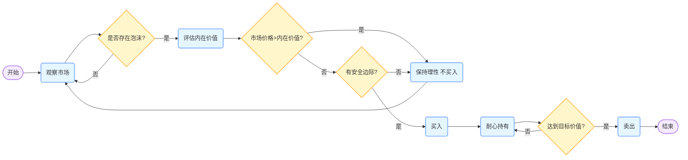

# 巴菲特应对市场泡沫的策略：保持理性和耐心

> 关键词：巴菲特、市场泡沫、理性、耐心、投资策略

> 摘要：本文深入探讨了巴菲特应对市场泡沫的策略，即保持理性和耐心。通过对相关背景的介绍，阐述了核心概念，详细分析了策略背后的原理和具体操作步骤，运用数学模型和公式进行解读，并结合实际案例展示了策略的应用。同时，介绍了该策略在不同场景下的实际应用，推荐了学习和开发过程中可用的工具和资源。最后，对未来发展趋势与挑战进行了总结，解答了常见问题，并提供了扩展阅读和参考资料，旨在帮助投资者理解和运用巴菲特的投资智慧应对市场泡沫。

## 1. 背景介绍 
### 1.1 目的和范围
本文章的主要目的是深入剖析巴菲特应对市场泡沫时所采用的保持理性和耐心的策略。通过详细阐述该策略的原理、操作步骤、实际应用等方面，为投资者提供全面且深入的理解，帮助他们在面对市场泡沫时能够借鉴巴菲特的智慧做出更明智的投资决策。文章的范围涵盖了从基本概念到具体案例，从理论分析到实际应用的多个层面，旨在为读者构建一个完整的知识体系。

### 1.2 预期读者
本文预期读者主要包括广大投资者，无论是个人投资者还是专业投资机构从业者，都能从文章中获取有价值的信息。同时，对金融市场和投资策略感兴趣的学生、学者以及相关研究人员也可以通过阅读本文，加深对巴菲特投资理念的理解，拓展自己的知识视野。此外，那些希望在市场波动中提升自身投资能力和决策水平的人群也是本文的潜在读者。

### 1.3 文档结构概述
本文将按照以下结构进行阐述：首先介绍背景信息，包括目的、预期读者和文档结构概述以及相关术语。接着阐述核心概念与联系，通过文本示意图和 Mermaid 流程图展示巴菲特应对市场泡沫策略的核心原理和架构。然后详细讲解核心算法原理和具体操作步骤，结合 Python 源代码进行说明。再运用数学模型和公式对策略进行深入分析，并举例说明。之后通过项目实战，展示代码实际案例并进行详细解释。随后介绍该策略的实际应用场景。接着推荐学习和开发过程中可用的工具和资源，包括书籍、在线课程、技术博客、开发工具、框架和相关论文等。最后总结未来发展趋势与挑战，解答常见问题，并提供扩展阅读和参考资料。

### 1.4 术语表
#### 1.4.1 核心术语定义
- **市场泡沫**：指资产价格严重偏离其内在价值，形成一种虚假的繁荣现象。通常是由于投资者的过度乐观和投机行为导致资产价格不断上涨，远远超过了其实际的经济价值。
- **理性投资**：投资者在进行投资决策时，基于充分的信息和客观的分析，不受情绪和短期市场波动的影响，以追求长期稳定的投资回报为目标的投资方式。
- **耐心投资**：投资者在投资过程中，能够忍受市场的短期波动和不确定性，坚持自己的投资策略，不轻易被市场情绪左右，等待合适的时机实现投资目标。

#### 1.4.2 相关概念解释
- **内在价值**：资产所具有的真实价值，是基于资产未来预期现金流的现值计算得出的。内在价值是理性投资的重要依据，投资者通过评估资产的内在价值来判断其价格是否合理。
- **安全边际**：指投资者购买资产的价格低于其内在价值的部分。安全边际为投资者提供了一定的缓冲空间，降低了投资风险。巴菲特非常重视安全边际，认为它是投资成功的关键因素之一。

#### 1.4.3 缩略词列表
- **PE**：市盈率（Price Earnings Ratio），是指股票价格除以每股收益的比率，用于衡量股票的估值水平。
- **PB**：市净率（Price to Book Ratio），是指股票价格除以每股净资产的比率，反映了市场对公司净资产的估值。

## 2. 核心概念与联系 
### 核心概念原理
巴菲特应对市场泡沫的核心策略是保持理性和耐心。理性是指在投资决策过程中，不被市场的狂热情绪所左右，而是基于对资产内在价值的深入分析和评估。投资者需要通过研究公司的财务报表、行业前景、竞争优势等因素，准确估算资产的内在价值。当市场价格高于内在价值时，即使市场表现出强烈的上涨趋势，也应保持冷静，不盲目跟风买入。

耐心则体现在投资过程的各个环节。在市场泡沫形成阶段，投资者需要耐心等待，不急于参与市场的炒作。当市场泡沫破裂，资产价格大幅下跌时，投资者更需要耐心等待合适的买入时机，避免在价格尚未跌到底部时就匆忙出手。同时，在持有资产的过程中，也需要耐心等待资产价值的逐步实现，不被短期的市场波动所干扰。

### 架构的文本示意图
|环节|具体内容|
| ---- | ---- |
|市场泡沫观察|密切关注市场动态，识别市场泡沫的迹象，如资产价格的快速上涨、市盈率和市净率等估值指标的过高、投资者情绪的过度乐观等。|
|内在价值评估|运用财务分析、行业研究等方法，对资产的内在价值进行准确估算。考虑公司的盈利能力、现金流状况、竞争优势等因素。|
|理性决策|根据内在价值评估结果，与市场价格进行比较。当市场价格高于内在价值时，保持理性，不盲目跟风买入；当市场价格低于内在价值时，考虑是否具有足够的安全边际。|
|耐心等待|在市场泡沫形成和破裂的过程中，保持耐心。等待市场价格回归到合理水平，寻找合适的买入和卖出时机。|
|长期持有|一旦买入具有投资价值的资产，耐心持有，等待资产价值的逐步实现，不被短期的市场波动所影响。|

### Mermaid 流程图


## 3. 核心算法原理 & 具体操作步骤 
### 核心算法原理
巴菲特的投资策略核心是基于价值投资，其核心算法原理可以概括为寻找被低估的资产。通过对公司的财务报表进行分析，计算公司的内在价值，然后与市场价格进行比较。当市场价格低于内在价值时，认为该资产具有投资价值。

### 具体操作步骤
#### 步骤一：数据收集
收集公司的财务报表，包括资产负债表、利润表和现金流量表。这些报表可以从公司的官方网站、证券交易所网站或专业的金融数据提供商处获取。同时，收集行业相关数据，如行业增长率、市场份额等。

#### 步骤二：财务分析
使用 Python 对收集到的财务数据进行分析。以下是一个简单的示例代码，用于计算公司的市盈率和市净率：
```python
# 假设已经获取到公司的每股收益和每股净资产
earnings_per_share = 2.5
book_value_per_share = 10
market_price = 20

# 计算市盈率
pe_ratio = market_price / earnings_per_share
print(f"市盈率: {pe_ratio}")

# 计算市净率
pb_ratio = market_price / book_value_per_share
print(f"市净率: {pb_ratio}")
```
#### 步骤三：内在价值评估
使用现金流折现模型（DCF）来评估公司的内在价值。现金流折现模型的基本原理是将公司未来的现金流折现到当前时刻，得到公司的内在价值。以下是一个简化的 DCF 模型的 Python 代码示例：
```python
import numpy as np

# 假设未来五年的自由现金流预测值
free_cash_flows = [100, 120, 140, 160, 180]
# 折现率
discount_rate = 0.1
# 永续增长率
perpetual_growth_rate = 0.03

# 计算前五年现金流的现值
present_values = []
for i, fcf in enumerate(free_cash_flows):
    pv = fcf / ((1 + discount_rate) ** (i + 1))
    present_values.append(pv)

# 计算终值
terminal_value = free_cash_flows[-1] * (1 + perpetual_growth_rate) / (discount_rate - perpetual_growth_rate)
terminal_present_value = terminal_value / ((1 + discount_rate) ** len(free_cash_flows))

# 计算内在价值
intrinsic_value = sum(present_values) + terminal_present_value
print(f"公司内在价值: {intrinsic_value}")
```
#### 步骤四：决策制定
将计算得到的内在价值与市场价格进行比较。如果市场价格低于内在价值，且具有足够的安全边际（如安全边际设定为 30%），则可以考虑买入该资产。如果市场价格高于内在价值，则保持理性，不盲目买入。

## 4. 数学模型和公式 & 详细讲解 & 举例说明 
### 现金流折现模型（DCF）
现金流折现模型是评估公司内在价值的常用方法，其基本公式为：
$$V = \sum_{t=1}^{n} \frac{FCF_t}{(1 + r)^t} + \frac{TV}{(1 + r)^n}$$
其中：
- $V$ 表示公司的内在价值
- $FCF_t$ 表示第 $t$ 期的自由现金流
- $r$ 表示折现率
- $n$ 表示预测期数
- $TV$ 表示终值

### 终值的计算
终值是指预测期结束后公司持续经营所产生的现金流的现值，通常使用永续增长模型计算：
$$TV = \frac{FCF_n \times (1 + g)}{r - g}$$
其中：
- $FCF_n$ 表示预测期最后一期的自由现金流
- $g$ 表示永续增长率

### 详细讲解
现金流折现模型的核心思想是将公司未来的现金流折现到当前时刻，考虑了货币的时间价值。自由现金流是指公司在满足了所有运营和投资需求后剩余的现金流量，它反映了公司实际可用于分配给股东或进行再投资的资金。折现率反映了投资者对该投资的预期回报率，通常可以使用资本资产定价模型（CAPM）来确定。预测期数是指对公司未来现金流进行预测的时间段，一般为 5 - 10 年。终值则是考虑了公司在预测期结束后仍将持续经营的情况。

### 举例说明
假设一家公司未来五年的自由现金流预测值分别为 100 万元、120 万元、140 万元、160 万元和 180 万元，折现率为 10%，永续增长率为 3%。

首先，计算前五年现金流的现值：
- 第一年：$PV_1 = \frac{100}{(1 + 0.1)^1} \approx 90.91$（万元）
- 第二年：$PV_2 = \frac{120}{(1 + 0.1)^2} \approx 99.17$（万元）
- 第三年：$PV_3 = \frac{140}{(1 + 0.1)^3} \approx 105.18$（万元）
- 第四年：$PV_4 = \frac{160}{(1 + 0.1)^4} \approx 109.29$（万元）
- 第五年：$PV_5 = \frac{180}{(1 + 0.1)^5} \approx 111.77$（万元）

然后，计算终值：
$TV = \frac{180 \times (1 + 0.03)}{0.1 - 0.03} \approx 2657.14$（万元）

终值的现值：$PV_{TV} = \frac{2657.14}{(1 + 0.1)^5} \approx 1643.77$（万元）

最后，计算公司的内在价值：
$V = 90.91 + 99.17 + 105.18 + 109.29 + 111.77 + 1643.77 = 2159.09$（万元）

如果该公司的市场价值低于 2159.09 万元，且具有足够的安全边际，则可以考虑买入该公司的股票。

## 5. 项目实战：代码实际案例和详细解释说明 
### 5.1  开发环境搭建
#### 安装 Python
首先，需要安装 Python 开发环境。可以从 Python 官方网站（https://www.python.org/downloads/）下载适合自己操作系统的 Python 版本，并按照安装向导进行安装。

#### 安装必要的库
在安装好 Python 后，需要安装一些必要的库，如 pandas、numpy 等。可以使用 pip 命令进行安装：
```bash
pip install pandas numpy
```

### 5.2  源代码详细实现和代码解读
以下是一个完整的 Python 代码示例，用于实现巴菲特投资策略的基本流程：
```python
import pandas as pd
import numpy as np

# 步骤一：数据收集（假设已经有一个包含公司财务数据的 CSV 文件）
data = pd.read_csv('company_financial_data.csv')

# 步骤二：财务分析
# 计算每股收益和每股净资产
earnings_per_share = data['净利润'] / data['总股本']
book_value_per_share = data['股东权益'] / data['总股本']

# 假设市场价格
market_price = 50

# 计算市盈率和市净率
pe_ratio = market_price / earnings_per_share
pb_ratio = market_price / book_value_per_share

print(f"市盈率: {pe_ratio}")
print(f"市净率: {pb_ratio}")

# 步骤三：内在价值评估
# 假设未来五年的自由现金流预测值
free_cash_flows = [200, 220, 240, 260, 280]
# 折现率
discount_rate = 0.1
# 永续增长率
perpetual_growth_rate = 0.03

# 计算前五年现金流的现值
present_values = []
for i, fcf in enumerate(free_cash_flows):
    pv = fcf / ((1 + discount_rate) ** (i + 1))
    present_values.append(pv)

# 计算终值
terminal_value = free_cash_flows[-1] * (1 + perpetual_growth_rate) / (discount_rate - perpetual_growth_rate)
terminal_present_value = terminal_value / ((1 + discount_rate) ** len(free_cash_flows))

# 计算内在价值
intrinsic_value = sum(present_values) + terminal_present_value
print(f"公司内在价值: {intrinsic_value}")

# 步骤四：决策制定
# 设定安全边际为 30%
safety_margin = 0.3
if market_price < intrinsic_value * (1 - safety_margin):
    print("可以考虑买入该资产")
else:
    print("市场价格过高，保持理性，不买入")
```
### 5.3  代码解读与分析
#### 数据收集部分
使用 pandas 库的 `read_csv` 函数读取包含公司财务数据的 CSV 文件。在实际应用中，需要根据具体情况从不同的数据源获取数据。

#### 财务分析部分
计算每股收益和每股净资产，然后根据市场价格计算市盈率和市净率。市盈率和市净率是常用的估值指标，可以帮助投资者初步判断股票的估值水平。

#### 内在价值评估部分
使用现金流折现模型（DCF）计算公司的内在价值。首先，计算前五年自由现金流的现值，然后计算终值的现值，最后将两者相加得到公司的内在价值。

#### 决策制定部分
设定安全边际为 30%，如果市场价格低于内在价值乘以（1 - 安全边际），则认为该资产具有投资价值，可以考虑买入；否则，保持理性，不盲目买入。

## 6. 实际应用场景 
### 股票投资
在股票市场中，市场泡沫经常出现。当市场处于牛市后期，股票价格普遍上涨，市盈率和市净率等估值指标过高时，投资者容易陷入盲目乐观的情绪。此时，运用巴菲特的策略，保持理性和耐心，通过深入分析公司的内在价值，不被市场的狂热情绪所左右。当市场泡沫破裂，股票价格大幅下跌时，耐心等待价格回归到合理水平，寻找具有足够安全边际的股票进行投资。

### 房地产投资
房地产市场也会出现泡沫现象。在房地产市场繁荣时期，房价不断上涨，投资者纷纷涌入市场。此时，投资者需要保持理性，评估房地产的内在价值，考虑租金回报率、地段、市场供需等因素。当市场泡沫破裂，房价下跌时，耐心等待合适的时机买入房产，避免在高价时盲目跟风。

### 创业投资
在创业投资领域，也存在市场泡沫。当某个新兴行业受到市场热捧时，大量资金涌入，创业项目的估值往往过高。投资者需要保持理性，深入分析创业项目的商业模式、市场前景、团队能力等因素，评估其内在价值。在投资过程中，要有耐心，等待项目的发展和价值的逐步实现，不被短期的市场炒作所迷惑。

## 7. 工具和资源推荐
### 7.1 学习资源推荐
#### 7.1.1 书籍推荐
- 《聪明的投资者》（The Intelligent Investor）：作者是本杰明·格雷厄姆（Benjamin Graham），这本书是价值投资的经典之作，巴菲特称其为有史以来最伟大的投资著作。书中详细阐述了价值投资的理念和方法，对投资者具有很高的指导价值。
- 《巴菲特致股东的信：股份公司教程》（Letters to Shareholders of Berkshire Hathaway）：这本书收录了巴菲特历年致股东的信，通过这些信件可以深入了解巴菲特的投资理念、策略和决策过程。
- 《穷查理宝典：查理·芒格的智慧箴言录》（Poor Charlie's Almanack: The Wit and Wisdom of Charles T. Munger）：查理·芒格是巴菲特的长期合作伙伴，这本书收集了芒格的演讲、文章和语录，展现了他独特的思维方式和投资智慧。

#### 7.1.2 在线课程
- Coursera 上的“投资学原理”（Principles of Investing）：该课程由知名教授授课，系统地介绍了投资学的基本原理和方法，包括资产定价、投资组合管理等内容。
- edX 上的“价值投资基础”（Fundamentals of Value Investing）：课程聚焦于价值投资的核心概念和方法，通过实际案例分析帮助学习者掌握价值投资的技巧。

#### 7.1.3 技术博客和网站
- 雪球（https://xueqiu.com/）：国内知名的投资社区，汇聚了大量的投资者和投资专家。在雪球上可以获取到丰富的投资资讯、研究报告和投资者的交流分享。
- Seeking Alpha（https://seekingalpha.com/）：国外的投资研究网站，提供了全球范围内的股票分析、投资策略和市场评论等内容。

### 7.2 开发工具框架推荐
#### 7.2.1 IDE和编辑器
- PyCharm：一款专业的 Python 集成开发环境（IDE），具有强大的代码编辑、调试和项目管理功能，适合用于开发投资分析相关的 Python 程序。
- Jupyter Notebook：一种交互式的开发环境，支持 Python、R 等多种编程语言。它以笔记本的形式展示代码和结果，方便进行数据分析和可视化。

#### 7.2.2 调试和性能分析工具
- pdb：Python 自带的调试工具，可以帮助开发者在代码运行过程中进行调试，定位问题。
- cProfile：Python 的性能分析工具，可以分析代码的运行时间和函数调用情况，帮助开发者优化代码性能。

#### 7.2.3 相关框架和库
- pandas：用于数据处理和分析的 Python 库，提供了高效的数据结构和数据操作方法，非常适合处理金融数据。
- numpy：Python 的数值计算库，提供了强大的多维数组对象和数学函数，在金融计算中广泛应用。
- scikit-learn：机器学习库，提供了各种机器学习算法和工具，可用于构建投资预测模型。

### 7.3 相关论文著作推荐
#### 7.3.1 经典论文
- 《证券分析》（Security Analysis）：本杰明·格雷厄姆和大卫·多德（David Dodd）的经典著作，奠定了价值投资的理论基础。论文中提出了“内在价值”、“安全边际”等重要概念。
- 《有效市场假说》（Efficient Market Hypothesis）：由尤金·法玛（Eugene F. Fama）提出，该理论认为市场价格已经反映了所有可用的信息，投资者无法通过分析历史数据或其他信息获得超额收益。虽然巴菲特的投资策略与有效市场假说存在一定的冲突，但了解该理论有助于投资者更全面地认识市场。

#### 7.3.2 最新研究成果
- 关注金融学术期刊，如《金融研究》《Journal of Finance》等，这些期刊会发表最新的金融研究成果，包括对市场泡沫、投资策略等方面的研究。
- 参加金融学术会议，如美国金融协会年会（AFA Annual Meeting），可以了解到最新的研究动态和前沿观点。

#### 7.3.3 应用案例分析
- 可以研究一些知名投资机构或投资者的实际案例，如巴菲特的伯克希尔·哈撒韦公司的投资案例。通过分析这些案例，了解他们在不同市场环境下的投资决策过程和策略应用。

## 8. 总结：未来发展趋势与挑战
### 未来发展趋势
#### 科技驱动的投资分析
随着科技的不断发展，大数据、人工智能和机器学习等技术将在投资分析中得到更广泛的应用。投资者可以利用这些技术更快速、准确地收集和分析大量的金融数据，挖掘潜在的投资机会。例如，通过自然语言处理技术分析新闻报道和社交媒体信息，了解市场情绪和公司动态；利用机器学习算法构建投资预测模型，提高投资决策的准确性。

#### 全球市场的融合与互动
随着经济全球化的深入发展，全球金融市场的融合程度越来越高。一个国家或地区的市场波动可能会迅速传导到其他市场，市场泡沫也具有更强的传染性。投资者需要更加关注全球市场的动态，了解不同国家和地区的经济政策、政治形势等因素对市场的影响，制定更加多元化的投资策略。

#### 可持续投资的兴起
近年来，可持续投资受到越来越多投资者的关注。投资者不仅关注投资的财务回报，还注重投资项目对环境、社会和公司治理（ESG）的影响。未来，可持续投资将成为投资领域的一个重要发展趋势，市场泡沫也可能在可持续投资领域出现。投资者需要在评估可持续投资项目时，保持理性和耐心，准确评估其内在价值。

### 挑战
#### 信息过载与虚假信息
在信息时代，投资者面临着海量的信息，其中不乏虚假信息和误导性信息。如何从大量的信息中筛选出有价值的信息，并准确判断信息的真实性和可靠性，是投资者面临的一大挑战。如果投资者受到虚假信息的影响，可能会做出错误的投资决策，增加投资风险。

#### 市场不确定性增加
全球经济和政治形势的不确定性不断增加，如贸易摩擦、地缘政治冲突、自然灾害等因素都可能对市场产生重大影响。这些不确定性使得市场泡沫的形成和破裂更加难以预测，投资者需要在复杂多变的市场环境中保持理性和耐心，及时调整投资策略。

#### 投资者情绪的影响
投资者的情绪在投资决策中起着重要的作用。在市场泡沫形成和破裂的过程中，投资者的情绪往往会出现过度乐观或过度悲观的情况。这种情绪波动可能导致投资者做出非理性的投资决策，如在市场泡沫高峰期追高买入，在市场底部恐慌卖出。如何克服情绪的影响，保持理性和耐心，是投资者需要不断修炼的技能。

## 9. 附录：常见问题与解答
### 问题一：如何准确评估公司的内在价值？
评估公司的内在价值是一个复杂的过程，需要综合考虑多个因素。可以从以下几个方面入手：
- 财务分析：分析公司的财务报表，包括资产负债表、利润表和现金流量表，了解公司的盈利能力、偿债能力、运营能力等。
- 行业研究：研究公司所处的行业，了解行业的发展趋势、市场规模、竞争格局等。行业前景对公司的未来发展具有重要影响。
- 竞争优势分析：评估公司的竞争优势，如品牌优势、技术优势、成本优势等。具有竞争优势的公司在市场中更具竞争力，其内在价值也相对较高。
- 现金流折现模型：使用现金流折现模型（DCF）计算公司的内在价值。该模型需要对公司未来的现金流进行预测，并选择合适的折现率。

### 问题二：安全边际应该设定为多少合适？
安全边际的设定没有固定的标准，需要根据市场情况、投资标的的风险程度等因素来确定。一般来说，在市场不确定性较大、投资标的风险较高时，可以适当提高安全边际；在市场相对稳定、投资标的风险较低时，可以适当降低安全边际。巴菲特通常会要求安全边际在 30% - 50% 左右，但这并不是绝对的，投资者可以根据自己的风险承受能力和投资目标进行调整。

### 问题三：如何保持理性和耐心在投资过程中？
保持理性和耐心在投资过程中是非常重要的，可以从以下几个方面入手：
- 学习投资知识：通过学习投资理论和方法，提高自己的投资水平，增强对市场的理解和判断能力。知识储备越丰富，越能在投资决策中保持理性。
- 制定投资计划：在投资前制定详细的投资计划，包括投资目标、投资策略、风险控制等。按照投资计划进行投资，避免受到市场情绪的影响。
- 分散投资：将资金分散投资于不同的资产、行业和地区，降低投资风险。分散投资可以减少单一投资标的对投资组合的影响，使投资者在市场波动时更加从容。
- 培养良好的心态：认识到投资是一个长期的过程，市场波动是正常的。不要被短期的市场涨跌所左右，保持平和的心态，耐心等待投资机会的出现。

## 10. 扩展阅读 & 参考资料
### 扩展阅读
- 《金融炼金术》（The Alchemy of Finance）：乔治·索罗斯（George Soros）的著作，书中提出了反身性理论，对理解市场泡沫和金融市场的运行机制具有重要的启示作用。
- 《漫步华尔街》（A Random Walk Down Wall Street）：作者是伯顿·马尔基尔（Burton G. Malkiel），这本书介绍了各种投资理论和策略，以通俗易懂的方式为投资者提供了全面的投资指导。

### 参考资料
- 巴菲特历年致股东的信：可以从伯克希尔·哈撒韦公司的官方网站获取。
- 金融数据提供商：如 Bloomberg、Wind 等，提供了丰富的金融数据和研究报告。
- 金融学术期刊：如《金融研究》《Journal of Finance》《Review of Financial Studies》等，发表了大量的金融研究成果。