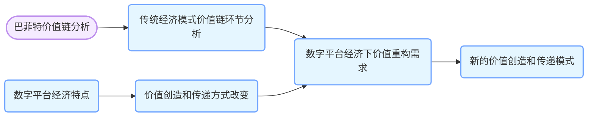

# 巴菲特的价值链分析：数字平台经济下的价值重构

> 关键词：巴菲特、价值链分析、数字平台经济、价值重构、商业模式

> 摘要：本文聚焦于在数字平台经济蓬勃发展的背景下，深入探讨巴菲特的价值链分析理论及其在这一新兴经济模式下的价值重构。首先介绍了研究的背景、目的、预期读者等内容，详细阐述了相关核心概念与联系。接着对核心算法原理进行剖析并给出具体操作步骤，同时通过数学模型和公式进行理论支撑与举例说明。然后通过项目实战案例展示具体应用，分析其在实际场景中的应用情况。还推荐了相关的学习工具、资源以及论文著作。最后总结了未来发展趋势与挑战，解答常见问题并提供扩展阅读与参考资料，旨在全面且深入地研究巴菲特的价值链分析在数字平台经济下的演变与应用。

## 1. 背景介绍 
### 1.1 目的和范围
在当今数字化浪潮席卷全球的时代，数字平台经济呈现出爆发式增长，对传统的商业模式和经济体系产生了巨大的冲击和变革。巴菲特作为投资界的传奇人物，其价值链分析理论在传统经济模式下取得了巨大的成功。然而，面对数字平台经济这一全新的经济形态，巴菲特的价值链分析理论需要重新审视和解读。本文的目的在于深入研究巴菲特的价值链分析理论在数字平台经济下的适应性和变革方向，探讨如何在数字平台经济的背景下重构价值体系，为企业和投资者提供新的思路和方法。

本文的研究范围涵盖了数字平台经济的各个领域，包括电子商务、共享经济、社交网络等，同时结合巴菲特的投资理念和价值链分析方法，分析这些领域中企业的价值创造和价值传递过程。

### 1.2 预期读者
本文预期读者主要包括企业管理者、投资者、经济学者以及对数字平台经济和巴菲特投资理论感兴趣的人士。对于企业管理者来说，本文可以帮助他们了解数字平台经济下的价值重构规律，优化企业的商业模式和战略决策；对于投资者而言，有助于他们识别数字平台经济中的投资机会，提高投资回报率；对于经济学者来说，可为其研究数字经济和价值链理论提供新的视角和参考；对于普通读者，能够增加对数字平台经济和巴菲特投资智慧的认识和理解。

### 1.3 文档结构概述
本文将按照以下结构展开：首先介绍研究的背景信息，包括目的、预期读者和文档结构概述等内容；接着阐述相关的核心概念与联系，通过文本示意图和 Mermaid 流程图直观展示；然后详细讲解核心算法原理和具体操作步骤，并结合 Python 源代码进行说明；再通过数学模型和公式对理论进行深入分析，并举例说明；之后通过项目实战案例，介绍开发环境搭建、源代码实现与解读；随后分析实际应用场景；推荐相关的工具和资源；总结未来发展趋势与挑战；解答常见问题；最后提供扩展阅读与参考资料。

### 1.4 术语表
#### 1.4.1 核心术语定义
- **巴菲特的价值链分析**：巴菲特基于企业的价值创造过程，对企业的各个环节进行分析和评估，以确定企业的内在价值和竞争优势的一种分析方法。
- **数字平台经济**：依托数字技术和互联网平台，通过整合资源、连接供需双方，实现价值创造和价值交换的一种新型经济模式。
- **价值重构**：在数字平台经济的背景下，企业对其价值创造、价值传递和价值获取的方式进行重新审视和调整，以适应新的市场环境和竞争格局。

#### 1.4.2 相关概念解释
- **商业模式**：企业为了创造价值、传递价值和获取价值而建立的一种逻辑架构和运营方式。
- **价值创造**：企业通过投入各种资源，经过一系列的生产和经营活动，将其转化为具有价值的产品或服务的过程。
- **价值传递**：企业将创造的价值传递给目标客户的过程，包括渠道选择、营销推广等环节。
- **价值获取**：企业从客户那里获得经济回报的过程，主要通过产品或服务的销售来实现。

#### 1.4.3 缩略词列表
- **GDP**：国内生产总值（Gross Domestic Product）
- **AI**：人工智能（Artificial Intelligence）
- **IoT**：物联网（Internet of Things）

## 2. 核心概念与联系 
### 2.1 巴菲特的价值链分析原理
巴菲特的价值链分析核心在于深入挖掘企业的内在价值。他认为企业的价值不仅仅取决于其当前的财务报表，更重要的是其长期的竞争优势和可持续的盈利能力。巴菲特将企业的价值链划分为多个环节，包括原材料采购、生产制造、销售与营销、售后服务等。通过对每个环节的分析，评估企业在这些环节中的成本控制能力、效率水平和创新能力，从而确定企业的竞争优势所在。

例如，在原材料采购环节，巴菲特会关注企业与供应商的关系，是否能够获得稳定且低成本的原材料供应；在生产制造环节，会考察企业的生产工艺、设备先进程度以及生产效率；在销售与营销环节，会分析企业的品牌影响力、市场份额以及销售渠道的有效性；在售后服务环节，会评估企业的客户满意度和客户忠诚度。

### 2.2 数字平台经济的特点
数字平台经济具有以下显著特点：
- **网络效应**：数字平台的价值随着用户数量的增加而呈指数级增长。例如，社交网络平台上的用户越多，用户之间的互动和交流就越频繁，平台对新用户的吸引力也就越大。
- **数据驱动**：数字平台通过收集和分析用户数据，能够深入了解用户需求和行为，从而提供个性化的产品和服务，提高用户体验和满意度。
- **多边市场**：数字平台通常连接多个不同的用户群体，如买家和卖家、服务提供者和消费者等，通过促进不同群体之间的交易和互动来实现价值创造。
- **轻资产运营**：数字平台企业主要依靠信息技术和互联网平台开展业务，不需要大量的固定资产投入，具有较低的运营成本和较高的灵活性。

### 2.3 数字平台经济下价值重构的联系
在数字平台经济下，巴菲特的价值链分析需要进行价值重构。传统的价值链环节在数字平台经济中发生了很大的变化。例如，在数字平台上，原材料采购可能转变为数据资源的获取和整合；生产制造环节可能更多地表现为软件开发和算法优化；销售与营销环节则借助数字营销手段和社交媒体平台来实现；售后服务也可以通过在线客服和智能客服系统来提供。

同时，数字平台经济的网络效应和数据驱动特点使得价值创造和价值传递的方式发生了根本性的改变。企业的价值不再仅仅取决于产品或服务本身，还取决于平台的用户规模、数据资产以及用户之间的互动和协同效应。因此，在数字平台经济下，企业需要重新审视其价值链，优化价值创造和传递过程，以实现价值的最大化。

### 2.4 文本示意图
```plaintext
巴菲特价值链分析 <------ 传统经济模式
                      |
                      |  变革与适应
                      |
数字平台经济下价值重构 <------ 数字平台经济模式
```

### 2.5 Mermaid 流程图


## 3. 核心算法原理 & 具体操作步骤 
### 3.1 核心算法原理
在数字平台经济下进行价值重构的核心算法原理基于对企业价值的量化分析。我们可以将企业的价值分为多个维度，包括用户价值、数据价值、业务价值等。通过建立数学模型，对这些维度的价值进行评估和计算，从而确定企业的整体价值。

以下是一个简化的企业价值评估模型：

企业价值 $V$ 可以表示为：

$V = \alpha U + \beta D + \gamma B$

其中，$U$ 表示用户价值，$D$ 表示数据价值，$B$ 表示业务价值，$\alpha$、$\beta$、$\gamma$ 分别为对应的权重系数，且 $\alpha + \beta + \gamma = 1$。

#### 用户价值评估
用户价值可以通过用户数量、用户活跃度、用户忠诚度等指标来衡量。例如，用户数量越多，用户活跃度越高，用户忠诚度越高，用户价值就越大。我们可以使用以下公式来计算用户价值：

$U = \sum_{i=1}^{n} w_i u_i$

其中，$n$ 表示用户数量，$u_i$ 表示第 $i$ 个用户的活跃度和忠诚度综合得分，$w_i$ 表示第 $i$ 个用户的权重。

#### 数据价值评估
数据价值可以根据数据的规模、质量、多样性以及数据的应用场景等因素来评估。例如，数据规模越大，质量越高，多样性越强，数据的应用场景越广泛，数据价值就越大。我们可以使用以下公式来计算数据价值：

$D = \sum_{j=1}^{m} v_j d_j$

其中，$m$ 表示数据的种类，$d_j$ 表示第 $j$ 种数据的质量和应用场景综合得分，$v_j$ 表示第 $j$ 种数据的权重。

#### 业务价值评估
业务价值可以通过企业的收入、利润、市场份额等指标来衡量。例如，企业的收入越高，利润越大，市场份额越高，业务价值就越大。我们可以使用以下公式来计算业务价值：

$B = \sum_{k=1}^{l} s_k b_k$

其中，$l$ 表示业务的种类，$b_k$ 表示第 $k$ 种业务的收入、利润和市场份额综合得分，$s_k$ 表示第 $k$ 种业务的权重。

### 3.2 具体操作步骤
#### 步骤 1：数据收集
收集企业的用户数据、数据资产信息以及业务运营数据。例如，用户的注册信息、登录记录、消费行为数据；企业的数据存储规模、数据质量评估报告；企业的财务报表、市场份额数据等。

#### 步骤 2：指标设定
根据企业的特点和行业特性，设定用户价值、数据价值和业务价值的评估指标和权重系数。例如，对于社交网络平台，用户活跃度和用户忠诚度的权重可能较高；对于数据驱动的企业，数据价值的权重可能较大。

#### 步骤 3：数据处理
对收集到的数据进行清洗、整理和分析，计算出每个用户、每种数据和每种业务的综合得分。例如，通过对用户登录频率、消费金额等数据的分析，计算出用户的活跃度和忠诚度综合得分。

#### 步骤 4：价值计算
根据上述公式，计算出用户价值、数据价值和业务价值，然后将它们加权求和，得到企业的整体价值。

#### 步骤 5：价值重构决策
根据计算结果，分析企业在各个价值维度上的优势和劣势，制定相应的价值重构策略。例如，如果用户价值较低，可以通过优化用户体验、开展营销活动等方式来提高用户价值；如果数据价值较高，可以进一步挖掘数据的潜力，开发新的业务和产品。

### 3.3 Python 源代码实现
```python
# 模拟用户数据
users = [
    {"id": 1, "activity": 0.8, "loyalty": 0.7},
    {"id": 2, "activity": 0.6, "loyalty": 0.8},
    {"id": 3, "activity": 0.9, "loyalty": 0.6}
]

# 模拟数据资产信息
data_assets = [
    {"type": "user_data", "quality": 0.8, "application": 0.7},
    {"type": "transaction_data", "quality": 0.9, "application": 0.6}
]

# 模拟业务运营数据
businesses = [
    {"id": 1, "revenue": 100000, "profit": 20000, "market_share": 0.3},
    {"id": 2, "revenue": 80000, "profit": 15000, "market_share": 0.2}
]

# 设定权重系数
alpha = 0.3
beta = 0.3
gamma = 0.4

# 计算用户价值
user_value = 0
for user in users:
    user_score = user["activity"] * 0.5 + user["loyalty"] * 0.5
    user_value += user_score

# 计算数据价值
data_value = 0
for data_asset in data_assets:
    data_score = data_asset["quality"] * 0.6 + data_asset["application"] * 0.4
    data_value += data_score

# 计算业务价值
business_value = 0
for business in businesses:
    business_score = business["revenue"] * 0.4 + business["profit"] * 0.3 + business["market_share"] * 0.3
    business_value += business_score

# 计算企业整体价值
enterprise_value = alpha * user_value + beta * data_value + gamma * business_value

print("用户价值:", user_value)
print("数据价值:", data_value)
print("业务价值:", business_value)
print("企业整体价值:", enterprise_value)
```

## 4. 数学模型和公式 & 详细讲解 & 举例说明 
### 4.1 数学模型
如前面所述，企业价值评估的数学模型为：

$V = \alpha U + \beta D + \gamma B$

其中，$V$ 表示企业的整体价值，$U$ 表示用户价值，$D$ 表示数据价值，$B$ 表示业务价值，$\alpha$、$\beta$、$\gamma$ 分别为对应的权重系数，且 $\alpha + \beta + \gamma = 1$。

### 4.2 公式详细讲解
#### 用户价值公式
$U = \sum_{i=1}^{n} w_i u_i$

该公式表示用户价值是所有用户的活跃度和忠诚度综合得分的加权求和。其中，$n$ 表示用户数量，$u_i$ 表示第 $i$ 个用户的活跃度和忠诚度综合得分，$w_i$ 表示第 $i$ 个用户的权重。权重 $w_i$ 可以根据用户的重要性、消费能力等因素来确定。

#### 数据价值公式
$D = \sum_{j=1}^{m} v_j d_j$

该公式表示数据价值是所有数据种类的质量和应用场景综合得分的加权求和。其中，$m$ 表示数据的种类，$d_j$ 表示第 $j$ 种数据的质量和应用场景综合得分，$v_j$ 表示第 $j$ 种数据的权重。权重 $v_j$ 可以根据数据的重要性、稀缺性等因素来确定。

#### 业务价值公式
$B = \sum_{k=1}^{l} s_k b_k$

该公式表示业务价值是所有业务种类的收入、利润和市场份额综合得分的加权求和。其中，$l$ 表示业务的种类，$b_k$ 表示第 $k$ 种业务的收入、利润和市场份额综合得分，$s_k$ 表示第 $k$ 种业务的权重。权重 $s_k$ 可以根据业务的发展前景、盈利能力等因素来确定。

### 4.3 举例说明
假设一家电商平台企业，有 1000 个用户，数据资产包括用户数据、商品数据和交易数据，业务包括商品销售和广告服务。

#### 用户价值计算
选取 10 个有代表性的用户进行分析，他们的活跃度和忠诚度综合得分分别为 $u_1 = 0.8, u_2 = 0.7, \cdots, u_{10} = 0.9$，权重都为 $w_i = 0.1$。则用户价值为：

$U = \sum_{i=1}^{10} w_i u_i = 0.1\times(0.8 + 0.7 + \cdots + 0.9) = 0.8$

#### 数据价值计算
用户数据的质量和应用场景综合得分 $d_1 = 0.8$，权重 $v_1 = 0.4$；商品数据的质量和应用场景综合得分 $d_2 = 0.7$，权重 $v_2 = 0.3$；交易数据的质量和应用场景综合得分 $d_3 = 0.9$，权重 $v_3 = 0.3$。则数据价值为：

$D = \sum_{j=1}^{3} v_j d_j = 0.4\times0.8 + 0.3\times0.7 + 0.3\times0.9 = 0.8$

#### 业务价值计算
商品销售业务的收入、利润和市场份额综合得分 $b_1 = 0.9$，权重 $s_1 = 0.6$；广告服务业务的收入、利润和市场份额综合得分 $b_2 = 0.7$，权重 $s_2 = 0.4$。则业务价值为：

$B = \sum_{k=1}^{2} s_k b_k = 0.6\times0.9 + 0.4\times0.7 = 0.82$

#### 企业整体价值计算
设定 $\alpha = 0.3$，$\beta = 0.3$，$\gamma = 0.4$，则企业整体价值为：

$V = \alpha U + \beta D + \gamma B = 0.3\times0.8 + 0.3\times0.8 + 0.4\times0.82 = 0.808$

## 5. 项目实战：代码实际案例和详细解释说明 
### 5.1  开发环境搭建
#### 编程语言和版本
本项目使用 Python 3.8 作为开发语言。Python 是一种功能强大、易于学习和使用的编程语言，拥有丰富的库和工具，适合进行数据分析和价值评估模型的实现。

#### 开发工具
推荐使用 PyCharm 作为开发工具。PyCharm 是一款专业的 Python 集成开发环境（IDE），提供了代码编辑、调试、版本控制等功能，能够提高开发效率。

#### 所需库
- `pandas`：用于数据处理和分析。
- `numpy`：用于数值计算。

可以使用以下命令安装所需库：

```sh
pip install pandas numpy
```

### 5.2  源代码详细实现和代码解读
```python
import pandas as pd
import numpy as np

# 模拟用户数据
user_data = {
    "id": [1, 2, 3, 4, 5],
    "activity": [0.8, 0.6, 0.9, 0.7, 0.8],
    "loyalty": [0.7, 0.8, 0.6, 0.9, 0.7]
}
user_df = pd.DataFrame(user_data)

# 模拟数据资产信息
data_asset_data = {
    "type": ["user_data", "transaction_data", "product_data"],
    "quality": [0.8, 0.9, 0.7],
    "application": [0.7, 0.6, 0.8]
}
data_asset_df = pd.DataFrame(data_asset_data)

# 模拟业务运营数据
business_data = {
    "id": [1, 2],
    "revenue": [100000, 80000],
    "profit": [20000, 15000],
    "market_share": [0.3, 0.2]
}
business_df = pd.DataFrame(business_data)

# 设定权重系数
alpha = 0.3
beta = 0.3
gamma = 0.4

# 计算用户价值
user_df["score"] = user_df["activity"] * 0.5 + user_df["loyalty"] * 0.5
user_value = user_df["score"].sum()

# 计算数据价值
data_asset_df["score"] = data_asset_df["quality"] * 0.6 + data_asset_df["application"] * 0.4
data_value = data_asset_df["score"].sum()

# 计算业务价值
business_df["score"] = business_df["revenue"] * 0.4 + business_df["profit"] * 0.3 + business_df["market_share"] * 0.3
business_value = business_df["score"].sum()

# 计算企业整体价值
enterprise_value = alpha * user_value + beta * data_value + gamma * business_value

print("用户价值:", user_value)
print("数据价值:", data_value)
print("业务价值:", business_value)
print("企业整体价值:", enterprise_value)
```

### 5.3  代码解读与分析
#### 数据模拟
使用 `pandas` 的 `DataFrame` 来模拟用户数据、数据资产信息和业务运营数据。这样可以方便地进行数据处理和分析。

#### 用户价值计算
通过对用户的活跃度和忠诚度进行加权平均，计算出每个用户的综合得分，然后将所有用户的得分求和，得到用户价值。

#### 数据价值计算
对每种数据资产的质量和应用场景进行加权平均，计算出每种数据资产的综合得分，然后将所有数据资产的得分求和，得到数据价值。

#### 业务价值计算
对每种业务的收入、利润和市场份额进行加权平均，计算出每种业务的综合得分，然后将所有业务的得分求和，得到业务价值。

#### 企业整体价值计算
根据设定的权重系数，将用户价值、数据价值和业务价值加权求和，得到企业的整体价值。

## 6. 实际应用场景 
### 6.1 电子商务平台
在电子商务平台中，通过对用户价值、数据价值和业务价值的评估，可以优化平台的运营策略。例如，如果发现用户价值较低，可以通过推出优惠活动、提高用户服务质量等方式来提高用户活跃度和忠诚度；如果数据价值较高，可以进一步挖掘用户数据，为用户提供个性化的推荐服务，提高用户的购买转化率；如果业务价值中某一项业务的得分较低，可以考虑调整业务策略，加大对该业务的投入或进行业务创新。

### 6.2 共享经济平台
对于共享经济平台，如共享单车、共享汽车等，用户价值的评估尤为重要。通过分析用户的使用频率、使用时长等数据，了解用户需求和行为，优化车辆的投放和调度，提高用户体验。同时，数据价值的挖掘可以帮助平台更好地了解市场需求和竞争态势，制定合理的价格策略和市场推广方案。

### 6.3 社交网络平台
社交网络平台的价值主要体现在用户数量和用户活跃度上。通过对用户价值的评估，可以了解用户的兴趣爱好和社交关系，推出个性化的社交功能和广告服务，提高用户的参与度和平台的盈利能力。数据价值的分析可以帮助平台更好地管理用户数据，保护用户隐私，同时挖掘数据的商业价值。

## 7. 工具和资源推荐
### 7.1 学习资源推荐
#### 7.1.1 书籍推荐
- 《巴菲特致股东的信》：这本书收录了巴菲特历年致股东的信，通过这些信件可以深入了解巴菲特的投资理念和方法。
- 《数字平台经济学》：系统介绍了数字平台经济的理论和实践，对于理解数字平台经济的特点和发展趋势有很大的帮助。
- 《价值投资实战手册》：详细讲解了价值投资的原理和方法，结合实际案例进行分析，具有很强的实用性。

#### 7.1.2 在线课程
- Coursera 上的“投资学原理”：由知名教授授课，全面介绍了投资学的基本原理和方法。
- edX 上的“数字经济与创新”：讲解了数字经济的发展趋势和创新模式，对于了解数字平台经济有很大的启发。
- 网易云课堂上的“巴菲特投资智慧”：深入剖析了巴菲特的投资理念和策略，通过案例分析帮助学员掌握投资技巧。

#### 7.1.3 技术博客和网站
- 雪球网：提供了丰富的股票投资资讯和分析，是投资者交流和学习的平台。
- 36氪：专注于互联网和新经济领域的资讯和分析，对于了解数字平台经济的最新动态有很大的帮助。
- 艾瑞网：提供了大量的行业研究报告和数据分析，对于研究数字经济和商业模式有很大的参考价值。

### 7.2 开发工具框架推荐
#### 7.2.1 IDE和编辑器
- PyCharm：功能强大的 Python 集成开发环境，适合进行数据分析和价值评估模型的开发。
- Jupyter Notebook：交互式的开发环境，方便进行代码的编写、调试和展示，适合进行数据探索和模型验证。

#### 7.2.2 调试和性能分析工具
- pdb：Python 自带的调试工具，用于调试 Python 代码。
- cProfile：Python 自带的性能分析工具，用于分析代码的性能瓶颈。

#### 7.2.3 相关框架和库
- pandas：用于数据处理和分析，提供了丰富的数据结构和函数。
- numpy：用于数值计算，提供了高效的数组和矩阵运算功能。
- scikit-learn：用于机器学习和数据分析，提供了各种机器学习算法和工具。

### 7.3 相关论文著作推荐
#### 7.3.1 经典论文
- “The Theory of the Firm: Managerial Behavior, Agency Costs and Ownership Structure”：该论文提出了代理理论，对于理解企业的治理结构和价值创造有重要的意义。
- “Competitive Advantage: Creating and Sustaining Superior Performance”：详细阐述了企业的竞争优势理论，为价值链分析提供了理论基础。

#### 7.3.2 最新研究成果
- “Digital Platforms and the Future of Competition”：探讨了数字平台经济对竞争格局的影响和未来发展趋势。
- “Value Creation in the Digital Economy”：研究了数字经济下企业的价值创造模式和策略。

#### 7.3.3 应用案例分析
- “Case Studies in Digital Platform Business Models”：通过实际案例分析了数字平台企业的商业模式和价值创造过程。
- “Value Chain Analysis in the Digital Age”：研究了数字时代价值链分析的新方法和应用。

## 8. 总结：未来发展趋势与挑战
### 8.1 未来发展趋势
- **智能化发展**：随着人工智能和机器学习技术的不断发展，数字平台经济将更加智能化。企业将利用智能算法对用户数据进行深度分析，提供更加个性化的产品和服务，提高用户体验和满意度。
- **生态化融合**：数字平台企业将加强与上下游企业的合作，形成更加完整的生态系统。通过生态化融合，实现资源共享、优势互补，提高整个生态系统的价值创造能力。
- **全球化拓展**：数字平台经济具有天然的全球化属性，未来数字平台企业将更加注重全球化拓展。通过拓展国际市场，获取更多的用户和资源，实现企业的快速发展。

### 8.2 挑战
- **数据安全和隐私问题**：数字平台经济依赖大量的用户数据，数据安全和隐私问题成为了企业面临的重要挑战。企业需要加强数据安全管理，保护用户隐私，避免数据泄露和滥用。
- **竞争加剧**：数字平台经济的发展吸引了大量的企业进入市场，竞争日益激烈。企业需要不断创新和优化商业模式，提高自身的竞争力，才能在市场中立足。
- **监管政策变化**：数字平台经济的发展对传统的监管政策提出了挑战，监管政策也在不断调整和完善。企业需要密切关注监管政策的变化，遵守相关法律法规，避免法律风险。

## 9. 附录：常见问题与解答
### 9.1 如何确定权重系数？
权重系数的确定需要根据企业的特点和行业特性来进行。可以通过专家评估、历史数据分析、市场调研等方法来确定。例如，对于数据驱动的企业，数据价值的权重可以适当提高；对于用户粘性较高的企业，用户价值的权重可以适当提高。

### 9.2 如何处理数据缺失的情况？
如果出现数据缺失的情况，可以采用以下方法进行处理：
- 数据填充：根据历史数据或其他相关数据进行填充。
- 忽略缺失数据：如果缺失数据的比例较小，可以忽略这些数据。
- 模型预测：使用机器学习模型对缺失数据进行预测。

### 9.3 如何评估模型的准确性？
可以使用以下方法评估模型的准确性：
- 交叉验证：将数据分为训练集和测试集，使用训练集训练模型，使用测试集评估模型的性能。
- 对比分析：将模型的预测结果与实际数据进行对比分析，计算误差率。
- 敏感性分析：分析模型对不同参数的敏感性，评估模型的稳定性。

## 10. 扩展阅读 & 参考资料
### 10.1 扩展阅读
- 《平台革命：改变世界的商业模式》：深入探讨了平台经济的商业模式和发展趋势，对于理解数字平台经济有很大的帮助。
- 《创新者的窘境》：研究了创新对企业的影响，对于数字平台企业的创新发展有重要的启示。

### 10.2 参考资料
- 巴菲特历年致股东的信官方网站
- 相关行业研究报告和统计数据来源
- 学术期刊和会议论文数据库