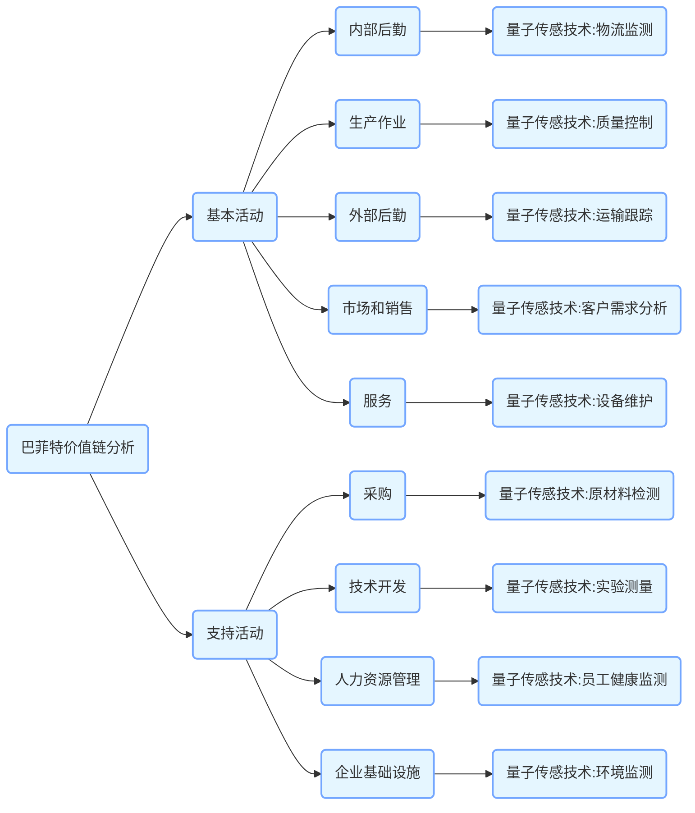

# 巴菲特的价值链分析：量子传感技术在产业升级中的作用

> 关键词：巴菲特价值链分析、量子传感技术、产业升级、价值创造、技术应用

> 摘要：本文旨在探讨巴菲特的价值链分析理论与量子传感技术在产业升级中的关联及作用。通过深入剖析巴菲特价值链分析的核心要点，详细阐述量子传感技术的原理、特点及优势，进而研究该技术如何融入产业价值链的各个环节，推动产业升级。文章结合实际案例，分析量子传感技术在不同产业中的具体应用场景，同时介绍相关的工具和资源，最后对未来发展趋势与挑战进行总结，以期为产业发展和技术应用提供有价值的参考。

## 1. 背景介绍 
### 1.1 目的和范围
本研究的目的在于深入理解巴菲特的价值链分析理论，并探讨量子传感技术在产业升级过程中的作用机制。具体范围涵盖对巴菲特价值链分析的理论梳理，量子传感技术的原理、发展现状及应用领域的研究，以及该技术如何在产业价值链的各个环节发挥作用，促进产业升级。通过对不同产业案例的分析，总结量子传感技术在产业升级中的经验和规律，为产业界和学术界提供理论支持和实践参考。

### 1.2 预期读者
本文预期读者包括产业界的企业管理者、技术研发人员、战略规划者，学术界的研究人员、学生，以及对量子传感技术和产业升级感兴趣的投资者、政策制定者等。不同读者群体可以从本文中获取与自身需求相关的信息，如企业管理者可以了解量子传感技术如何优化企业价值链，提升竞争力；研究人员可以深入探讨相关理论和技术的发展；投资者可以发现潜在的投资机会；政策制定者可以制定促进产业升级的政策措施。

### 1.3 文档结构概述
本文共分为十个部分。第一部分为背景介绍，阐述研究的目的、范围、预期读者和文档结构概述，并对相关术语进行解释。第二部分介绍核心概念与联系，包括巴菲特价值链分析的原理和量子传感技术的架构，以及两者之间的联系。第三部分详细讲解量子传感技术的核心算法原理和具体操作步骤，并给出Python源代码示例。第四部分介绍量子传感技术相关的数学模型和公式，并进行详细讲解和举例说明。第五部分通过项目实战，展示量子传感技术在实际应用中的代码案例和详细解释。第六部分探讨量子传感技术的实际应用场景。第七部分推荐相关的学习资源、开发工具框架和论文著作。第八部分总结未来发展趋势与挑战。第九部分为附录，解答常见问题。第十部分提供扩展阅读和参考资料。

### 1.4 术语表
#### 1.4.1 核心术语定义
- **巴菲特价值链分析**：是由投资大师沃伦·巴菲特提出的一种分析企业价值创造过程的方法。该方法将企业的活动分为基本活动和支持活动，通过分析各个活动环节的价值创造能力，来评估企业的竞争力和价值。
- **量子传感技术**：是基于量子力学原理，利用量子系统的特性（如量子态的叠加、纠缠等）来实现对物理量（如磁场、电场、温度、加速度等）的高灵敏度、高精度测量的技术。

#### 1.4.2 相关概念解释
- **产业升级**：指产业结构的改善和产业素质与效率的提高。产业升级的核心是通过技术创新、管理创新等手段，提高产业的附加值和竞争力，实现产业从低附加值向高附加值、从劳动密集型向技术密集型、从传统产业向新兴产业的转变。
- **价值创造**：是指企业通过一系列的活动，将各种生产要素转化为具有价值的产品或服务，从而满足客户需求，实现企业利润和社会价值的过程。

#### 1.4.3 缩略词列表
- **QST**：Quantum Sensing Technology（量子传感技术）
- **VR**：Value Chain（价值链）

## 2. 核心概念与联系 

### 2.1 巴菲特价值链分析原理
巴菲特的价值链分析将企业的活动分为基本活动和支持活动。基本活动包括内部后勤、生产作业、外部后勤、市场和销售、服务等环节，这些活动直接与产品或服务的生产、销售和交付相关。支持活动包括采购、技术开发、人力资源管理、企业基础设施等环节，这些活动为基本活动提供支持和保障。通过对价值链各个环节的分析，可以找出企业的优势和劣势，优化企业的资源配置，提高企业的价值创造能力。

### 2.2 量子传感技术架构
量子传感技术主要由量子系统、量子操控、量子测量和信号处理等部分组成。量子系统是量子传感的核心，通常采用原子、离子、光子等量子体系。量子操控是指通过外部控制手段（如激光、微波等）来制备和控制量子系统的状态。量子测量是指对量子系统的状态进行测量，获取与被测量物理量相关的信息。信号处理是指对测量得到的信号进行处理和分析，提取有用信息。

### 2.3 两者联系
量子传感技术可以在巴菲特价值链分析的各个环节发挥作用。在基本活动中，量子传感技术可以用于内部后勤的物流监测、生产作业的质量控制、外部后勤的运输跟踪、市场和销售的客户需求分析、服务的设备维护等。在支持活动中，量子传感技术可以用于采购的原材料检测、技术开发的实验测量、人力资源管理的员工健康监测、企业基础设施的环境监测等。通过将量子传感技术融入企业的价值链，企业可以提高生产效率、降低成本、提升产品质量和服务水平，从而增强企业的竞争力和价值创造能力。

### 2.4 文本示意图
```plaintext
巴菲特价值链分析
|-- 基本活动
|   |-- 内部后勤
|   |   |-- 量子传感技术：物流监测
|   |-- 生产作业
|   |   |-- 量子传感技术：质量控制
|   |-- 外部后勤
|   |   |-- 量子传感技术：运输跟踪
|   |-- 市场和销售
|   |   |-- 量子传感技术：客户需求分析
|   |-- 服务
|   |   |-- 量子传感技术：设备维护
|-- 支持活动
|   |-- 采购
|   |   |-- 量子传感技术：原材料检测
|   |-- 技术开发
|   |   |-- 量子传感技术：实验测量
|   |-- 人力资源管理
|   |   |-- 量子传感技术：员工健康监测
|   |-- 企业基础设施
|       |-- 量子传感技术：环境监测
```

### 2.5 Mermaid流程图


## 3. 核心算法原理 & 具体操作步骤 

### 3.1 量子传感技术核心算法原理
量子传感技术的核心算法基于量子力学原理，主要包括量子态制备、量子演化和量子测量三个步骤。

#### 3.1.1 量子态制备
量子态制备是指将量子系统初始化为特定的量子态。常用的量子态制备方法包括激光冷却、微波脉冲等。例如，在原子量子传感器中，可以通过激光冷却将原子冷却到极低温度，使其处于基态，然后通过微波脉冲将原子激发到特定的量子态。

#### 3.1.2 量子演化
量子演化是指在外部物理量的作用下，量子系统的状态随时间发生变化。量子系统的演化可以用薛定谔方程来描述：
$$i\hbar\frac{\partial}{\partial t}|\psi(t)\rangle = H|\psi(t)\rangle$$
其中，$|\psi(t)\rangle$ 是量子系统在时间 $t$ 的状态矢量，$H$ 是量子系统的哈密顿量，$\hbar$ 是约化普朗克常数。

#### 3.1.3 量子测量
量子测量是指对量子系统的状态进行测量，获取与被测量物理量相关的信息。量子测量的结果是概率性的，满足量子力学的测量公设。例如，在原子量子传感器中，可以通过测量原子的荧光信号来获取原子的状态信息，从而推断出被测量物理量的值。

### 3.2 具体操作步骤
以下是一个基于原子量子传感器的磁场测量的具体操作步骤：

#### 3.2.1 实验准备
- 准备原子气体，如铷原子气体。
- 搭建实验装置，包括激光系统、微波系统、真空系统等。
- 校准实验设备，确保实验条件的稳定性。

#### 3.2.2 量子态制备
- 使用激光冷却技术将原子气体冷却到极低温度，使其处于基态。
- 使用微波脉冲将原子激发到特定的量子态，如自旋相干态。

#### 3.2.3 量子演化
- 将原子系统置于待测磁场中，使原子的量子态在磁场的作用下发生演化。
- 控制演化时间，使原子的量子态发生足够的变化，以便后续测量。

#### 3.2.4 量子测量
- 使用激光照射原子，测量原子的荧光信号。
- 根据荧光信号的强度和频率，推断出原子的量子态信息。
- 通过量子态信息，计算出待测磁场的强度。

### 3.3 Python源代码示例
```python
import numpy as np

# 定义量子态制备函数
def prepare_quantum_state():
    # 简单示例：制备一个两能级系统的基态
    state = np.array([1, 0])
    return state

# 定义量子演化函数
def quantum_evolution(state, hamiltonian, time):
    # 简单示例：使用指数演化
    from scipy.linalg import expm
    evolution_operator = expm(-1j * hamiltonian * time)
    evolved_state = np.dot(evolution_operator, state)
    return evolved_state

# 定义量子测量函数
def quantum_measurement(state):
    # 简单示例：测量处于基态的概率
    probability_ground_state = np.abs(state[0])**2
    return probability_ground_state

# 主函数
def main():
    # 初始化参数
    hamiltonian = np.array([[0, 1], [1, 0]])  # 简单的哈密顿量示例
    time = 1.0  # 演化时间

    # 量子态制备
    initial_state = prepare_quantum_state()

    # 量子演化
    evolved_state = quantum_evolution(initial_state, hamiltonian, time)

    # 量子测量
    measurement_result = quantum_measurement(evolved_state)

    print(f"测量结果：处于基态的概率为 {measurement_result}")

if __name__ == "__main__":
    main()
```

## 4. 数学模型和公式 & 详细讲解 & 举例说明 

### 4.1 量子态的表示
量子态可以用希尔伯特空间中的矢量来表示。对于一个两能级系统，其量子态可以表示为：
$$|\psi\rangle = \alpha|0\rangle + \beta|1\rangle$$
其中，$|0\rangle$ 和 $|1\rangle$ 是两能级系统的基态，$\alpha$ 和 $\beta$ 是复数，满足 $|\alpha|^2 + |\beta|^2 = 1$。$|\alpha|^2$ 表示量子态处于 $|0\rangle$ 态的概率，$|\beta|^2$ 表示量子态处于 $|1\rangle$ 态的概率。

### 4.2 量子演化的数学模型
量子系统的演化可以用薛定谔方程来描述：
$$i\hbar\frac{\partial}{\partial t}|\psi(t)\rangle = H|\psi(t)\rangle$$
其中，$|\psi(t)\rangle$ 是量子系统在时间 $t$ 的状态矢量，$H$ 是量子系统的哈密顿量，$\hbar$ 是约化普朗克常数。

对于一个简单的两能级系统，其哈密顿量可以表示为：
$$H = \begin{pmatrix}
E_0 & \Omega \\
\Omega^* & E_1
\end{pmatrix}$$
其中，$E_0$ 和 $E_1$ 是两能级系统的能量，$\Omega$ 是耦合强度。

### 4.3 量子测量的数学模型
量子测量的结果是概率性的，满足量子力学的测量公设。对于一个量子态 $|\psi\rangle$，测量其处于某个本征态 $|i\rangle$ 的概率为：
$$P(i) = |\langle i|\psi\rangle|^2$$
其中，$\langle i|\psi\rangle$ 是量子态 $|\psi\rangle$ 在本征态 $|i\rangle$ 上的投影。

### 4.4 举例说明
假设有一个两能级系统，其哈密顿量为：
$$H = \begin{pmatrix}
0 & 1 \\
1 & 0
\end{pmatrix}$$
初始量子态为 $|\psi(0)\rangle = |0\rangle$。

根据薛定谔方程，量子态的演化可以表示为：
$$|\psi(t)\rangle = e^{-iHt/\hbar}|\psi(0)\rangle$$
将哈密顿量和初始量子态代入上式，得到：
$$|\psi(t)\rangle = \begin{pmatrix}
\cos(t/\hbar) & -i\sin(t/\hbar) \\
-i\sin(t/\hbar) & \cos(t/\hbar)
\end{pmatrix}\begin{pmatrix}
1 \\
0
\end{pmatrix} = \begin{pmatrix}
\cos(t/\hbar) \\
-i\sin(t/\hbar)
\end{pmatrix}$$

测量量子态处于 $|0\rangle$ 态的概率为：
$$P(0) = |\langle 0|\psi(t)\rangle|^2 = \cos^2(t/\hbar)$$
测量量子态处于 $|1\rangle$ 态的概率为：
$$P(1) = |\langle 1|\psi(t)\rangle|^2 = \sin^2(t/\hbar)$$

可以看到，随着时间的变化，量子态在 $|0\rangle$ 态和 $|1\rangle$ 态之间振荡。

## 5. 项目实战：代码实际案例和详细解释说明 

### 5.1  开发环境搭建
#### 5.1.1 安装Python
首先需要安装Python环境，建议使用Python 3.7及以上版本。可以从Python官方网站（https://www.python.org/downloads/）下载安装包，按照安装向导进行安装。

#### 5.1.2 安装必要的库
本项目需要使用一些科学计算和数值处理的库，如NumPy、SciPy等。可以使用pip命令进行安装：
```sh
pip install numpy scipy
```

### 5.2  源代码详细实现和代码解读
以下是一个基于量子传感技术的磁场测量模拟的完整代码示例：

```python
import numpy as np
from scipy.linalg import expm

# 定义量子态制备函数
def prepare_quantum_state():
    """
    制备一个两能级系统的基态
    :return: 量子态矢量
    """
    state = np.array([1, 0])
    return state

# 定义哈密顿量生成函数
def generate_hamiltonian(magnetic_field):
    """
    根据磁场强度生成哈密顿量
    :param magnetic_field: 磁场强度
    :return: 哈密顿量矩阵
    """
    omega = 1.0  # 耦合强度
    hamiltonian = np.array([[0, omega], [omega, magnetic_field]])
    return hamiltonian

# 定义量子演化函数
def quantum_evolution(state, hamiltonian, time):
    """
    进行量子演化
    :param state: 初始量子态
    :param hamiltonian: 哈密顿量
    :param time: 演化时间
    :return: 演化后的量子态
    """
    evolution_operator = expm(-1j * hamiltonian * time)
    evolved_state = np.dot(evolution_operator, state)
    return evolved_state

# 定义量子测量函数
def quantum_measurement(state):
    """
    进行量子测量，测量处于基态的概率
    :param state: 量子态
    :return: 处于基态的概率
    """
    probability_ground_state = np.abs(state[0])**2
    return probability_ground_state

# 主函数
def main():
    # 初始化参数
    magnetic_field = 2.0  # 待测磁场强度
    time = 1.0  # 演化时间

    # 量子态制备
    initial_state = prepare_quantum_state()

    # 生成哈密顿量
    hamiltonian = generate_hamiltonian(magnetic_field)

    # 量子演化
    evolved_state = quantum_evolution(initial_state, hamiltonian, time)

    # 量子测量
    measurement_result = quantum_measurement(evolved_state)

    print(f"待测磁场强度：{magnetic_field}")
    print(f"测量结果：处于基态的概率为 {measurement_result}")

if __name__ == "__main__":
    main()
```

### 5.3  代码解读与分析
#### 5.3.1 量子态制备函数 `prepare_quantum_state`
该函数用于制备一个两能级系统的基态，即 $|0\rangle$ 态。通过创建一个包含两个元素的NumPy数组 `[1, 0]` 来表示量子态矢量。

#### 5.3.2 哈密顿量生成函数 `generate_hamiltonian`
该函数根据输入的磁场强度生成哈密顿量矩阵。哈密顿量矩阵的形式为：
$$H = \begin{pmatrix}
0 & \omega \\
\omega & B
\end{pmatrix}$$
其中，$\omega$ 是耦合强度，$B$ 是磁场强度。

#### 5.3.3 量子演化函数 `quantum_evolution`
该函数用于进行量子演化，根据输入的初始量子态、哈密顿量和演化时间，计算演化后的量子态。使用 `scipy.linalg.expm` 函数计算演化算符，然后将演化算符与初始量子态相乘得到演化后的量子态。

#### 5.3.4 量子测量函数 `quantum_measurement`
该函数用于进行量子测量，测量量子态处于基态的概率。通过计算量子态矢量第一个元素的模的平方得到处于基态的概率。

#### 5.3.5 主函数 `main`
该函数是程序的入口，初始化参数，调用上述函数完成量子态制备、哈密顿量生成、量子演化和量子测量的过程，并输出测量结果。

## 6. 实际应用场景 
### 6.1 医疗领域
- **疾病诊断**：量子传感技术可以用于检测生物分子的微小变化，如蛋白质、核酸等的浓度和结构变化。通过检测这些生物标志物，可以实现疾病的早期诊断和精准治疗。例如，量子磁传感器可以检测血液中肿瘤标志物的含量，为癌症的早期筛查提供依据。
- **神经科学研究**：量子传感技术可以用于检测神经元的电活动和磁场变化，帮助研究人员深入了解大脑的工作机制。例如，量子光学传感器可以实时监测神经元的活动，为神经系统疾病的研究和治疗提供重要信息。

### 6.2 能源领域
- **油气勘探**：量子传感技术可以用于检测地下油气资源的分布和储量。通过测量地下磁场、重力场等物理量的变化，可以推断出油气储层的位置和性质。例如，量子重力仪可以高精度地测量地球重力场的微小变化，为油气勘探提供更准确的信息。
- **电力系统监测**：量子传感技术可以用于监测电力系统的运行状态，如电流、电压、温度等参数的变化。通过实时监测这些参数，可以及时发现电力系统的故障和隐患，保障电力系统的安全稳定运行。例如，量子电流传感器可以高精度地测量电力系统中的电流，为电力系统的监测和控制提供重要数据。

### 6.3 交通领域
- **自动驾驶**：量子传感技术可以用于自动驾驶汽车的环境感知和定位。通过测量周围环境的磁场、电场、加速度等物理量，自动驾驶汽车可以更准确地感知周围环境，实现高精度的定位和导航。例如，量子惯性传感器可以提供高精度的加速度和角速度测量，为自动驾驶汽车的运动控制提供重要信息。
- **铁路运输**：量子传感技术可以用于铁路轨道的监测和维护。通过测量轨道的应力、变形等物理量，可以及时发现轨道的故障和隐患，保障铁路运输的安全。例如，量子应变传感器可以高精度地测量轨道的应变变化，为铁路轨道的健康监测提供重要数据。

### 6.4 环境监测领域
- **空气质量监测**：量子传感技术可以用于检测空气中污染物的浓度和种类。通过测量污染物分子的吸收光谱、荧光光谱等物理信号，可以实现对空气质量的实时监测。例如，量子光学传感器可以高精度地检测空气中有害气体的浓度，为空气质量监测和治理提供重要依据。
- **水质监测**：量子传感技术可以用于检测水中污染物的浓度和种类。通过测量水中污染物分子的电化学信号、光学信号等物理信号，可以实现对水质的实时监测。例如，量子电化学传感器可以高精度地检测水中重金属离子的浓度，为水质监测和治理提供重要数据。

## 7. 工具和资源推荐
### 7.1 学习资源推荐
#### 7.1.1 书籍推荐
- 《量子力学导论》（David J. Griffiths 著）：这本书是量子力学领域的经典教材，系统地介绍了量子力学的基本概念、原理和方法。通过学习这本书，可以深入理解量子传感技术的理论基础。
- 《量子传感技术》（相关专家著）：专门介绍量子传感技术的书籍，涵盖了量子传感技术的原理、发展现状、应用领域等方面的内容。对于想要深入了解量子传感技术的读者来说，是一本很好的参考书籍。

#### 7.1.2 在线课程
- Coursera上的“量子力学基础”课程：由知名高校的教授授课，系统地讲解量子力学的基本概念和原理。通过在线视频、作业和讨论等方式，帮助学习者掌握量子力学的基础知识。
- edX上的“量子传感技术前沿”课程：介绍量子传感技术的最新研究成果和应用案例。通过学习这门课程，可以了解量子传感技术的发展趋势和应用前景。

#### 7.1.3 技术博客和网站
- 量子科学与技术网：提供量子科学与技术领域的最新研究动态、学术论文、技术报告等信息。通过浏览这个网站，可以及时了解量子传感技术的最新发展。
- 科学网的量子技术专栏：汇聚了量子技术领域的专家和学者的观点和研究成果。通过阅读这个专栏的文章，可以深入了解量子传感技术的研究热点和难点。

### 7.2 开发工具框架推荐
#### 7.2.1 IDE和编辑器
- PyCharm：一款功能强大的Python集成开发环境，提供代码编辑、调试、版本控制等功能。在开发量子传感技术相关的Python代码时，PyCharm可以提高开发效率。
- Jupyter Notebook：一个交互式的编程环境，支持Python、R等多种编程语言。在进行量子传感技术的实验和数据分析时，Jupyter Notebook可以方便地进行代码编写、运行和结果展示。

#### 7.2.2 调试和性能分析工具
- pdb：Python自带的调试工具，可以帮助开发者调试Python代码。在开发量子传感技术相关的Python代码时，pdb可以帮助开发者快速定位和解决代码中的问题。
- cProfile：Python的性能分析工具，可以帮助开发者分析Python代码的性能瓶颈。在优化量子传感技术相关的Python代码时，cProfile可以帮助开发者找出代码中耗时较长的部分，进行针对性的优化。

#### 7.2.3 相关框架和库
- Qiskit：一个开源的量子计算框架，提供量子电路设计、量子算法实现、量子模拟等功能。在开发量子传感技术相关的量子算法时，Qiskit可以提供便捷的开发工具和库。
- QuTiP：一个用于量子光学和量子信息处理的Python库，提供量子态表示、量子演化计算、量子测量等功能。在进行量子传感技术的理论研究和数值模拟时，QuTiP可以提供强大的计算工具。

### 7.3 相关论文著作推荐
#### 7.3.1 经典论文
- “Quantum Sensors”（by Dieter Suter）：这篇论文系统地介绍了量子传感技术的基本原理和应用领域，是量子传感技术领域的经典论文之一。
- “Quantum Metrology”（by Vittorio Giovannetti, Seth Lloyd, and Lorenzo Maccone）：这篇论文介绍了量子计量学的基本概念和方法，为量子传感技术的发展提供了理论基础。

#### 7.3.2 最新研究成果
- 关注《Nature》《Science》《Physical Review Letters》等顶级学术期刊上关于量子传感技术的最新研究论文。这些论文通常代表了量子传感技术领域的最新研究成果和发展趋势。
- 参加国际量子科学与技术会议（如QIP、QCRYPT等），了解量子传感技术领域的最新研究动态和前沿技术。

#### 7.3.3 应用案例分析
- 研究一些量子传感技术在实际应用中的成功案例，如量子传感技术在医疗诊断、能源勘探、环境监测等领域的应用案例。通过分析这些案例，可以了解量子传感技术在实际应用中的优势和挑战，为量子传感技术的进一步应用提供参考。

## 8. 总结：未来发展趋势与挑战
### 8.1 未来发展趋势
- **集成化和小型化**：未来量子传感技术将朝着集成化和小型化的方向发展。通过将量子传感器与其他电子元件集成在一起，可以实现量子传感系统的小型化和便携化，扩大量子传感技术的应用范围。
- **多物理量测量**：未来量子传感技术将实现对多种物理量的同时测量。通过利用量子系统的多种特性，可以实现对磁场、电场、温度、加速度等多种物理量的高精度测量，提高量子传感技术的综合性能。
- **与其他技术融合**：未来量子传感技术将与人工智能、大数据、物联网等技术深度融合。通过将量子传感技术与这些技术结合，可以实现对海量数据的快速处理和分析，提高量子传感技术的智能化水平。

### 8.2 挑战
- **技术难度**：量子传感技术涉及到量子力学、光学、电子学等多个领域的知识，技术难度较大。目前，量子传感技术的发展还面临着一些技术瓶颈，如量子态的制备和控制、量子测量的精度和稳定性等问题。
- **成本问题**：量子传感技术的研发和生产成本较高，限制了其大规模应用。未来需要进一步降低量子传感技术的成本，提高其性价比，以促进量子传感技术的广泛应用。
- **人才短缺**：量子传感技术是一个新兴的领域，相关的专业人才短缺。未来需要加强量子传感技术领域的人才培养，提高人才素质，为量子传感技术的发展提供人才支持。

## 9. 附录：常见问题与解答
### 9.1 量子传感技术与传统传感技术有什么区别？
量子传感技术基于量子力学原理，利用量子系统的特性（如量子态的叠加、纠缠等）来实现对物理量的高灵敏度、高精度测量。与传统传感技术相比，量子传感技术具有更高的灵敏度、更低的噪声、更强的抗干扰能力等优势。

### 9.2 量子传感技术的应用前景如何？
量子传感技术具有广泛的应用前景，在医疗、能源、交通、环境监测等领域都有重要的应用价值。随着量子传感技术的不断发展和成熟，其应用范围将不断扩大，对推动产业升级和社会发展将起到重要的作用。

### 9.3 学习量子传感技术需要具备哪些基础知识？
学习量子传感技术需要具备量子力学、光学、电子学等方面的基础知识。此外，还需要掌握一定的数学知识，如线性代数、概率论等。

### 9.4 如何开展量子传感技术的研究和开发工作？
开展量子传感技术的研究和开发工作需要具备一定的实验条件和技术能力。可以从理论研究入手，深入理解量子传感技术的原理和方法；然后进行实验研究，搭建实验平台，开展量子传感技术的实验验证和优化；最后进行工程应用开发，将量子传感技术应用到实际场景中。

## 10. 扩展阅读 & 参考资料
### 10.1 扩展阅读
- 《量子信息科学与技术》：进一步深入了解量子信息科学与技术的相关知识，包括量子计算、量子通信、量子密码等领域的内容。
- 《传感器技术原理与应用》：学习传感器技术的基本原理和应用方法，了解传统传感技术的发展现状和趋势。

### 10.2 参考资料
- 相关学术论文和研究报告，如在IEEE、ACM等学术数据库中搜索量子传感技术相关的论文。
- 行业标准和规范，如量子传感技术相关的国际标准和国内标准。
- 企业和机构的技术文档和白皮书，如一些量子传感技术研发企业发布的技术资料。