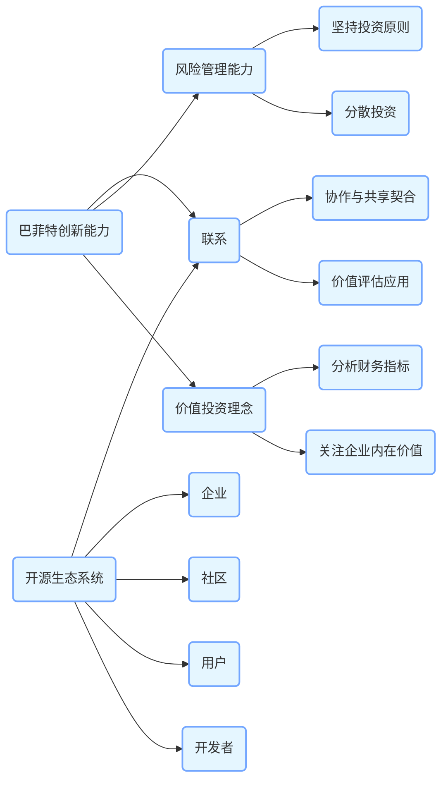

# 巴菲特的创新能力评估：开源生态系统中的价值创造

> 关键词：巴菲特、创新能力评估、开源生态系统、价值创造、投资理念

> 摘要：本文旨在深入探讨巴菲特的创新能力在开源生态系统中的价值创造。通过分析巴菲特的投资理念、开源生态系统的特点和运作机制，阐述了两者之间的联系和相互影响。文章详细讲解了评估巴菲特创新能力的核心概念和方法，介绍了相关的核心算法原理和具体操作步骤，构建了数学模型并进行举例说明。通过项目实战案例，展示了如何在开源生态系统中应用巴菲特的创新理念实现价值创造。同时，探讨了其在实际应用场景中的表现，推荐了相关的工具和资源，最后对未来发展趋势与挑战进行了总结，并提供了常见问题解答和扩展阅读参考资料。

## 1. 背景介绍 
### 1.1 目的和范围
本研究的目的在于全面评估巴菲特的创新能力，并探讨这种创新能力在开源生态系统中如何实现价值创造。研究范围涵盖了巴菲特的投资生涯、开源生态系统的各个层面，包括开源软件的开发、社区协作、商业模式等。通过对这些领域的研究，揭示巴菲特的创新思维和策略在开源环境中的应用和价值。

### 1.2 预期读者
本文预期读者包括金融投资领域的从业者、开源技术开发者、科技企业管理者以及对创新和价值创造感兴趣的研究者。对于金融从业者，本文可以提供新的投资视角和思路；对于开源开发者和科技企业管理者，有助于理解如何将巴菲特的理念应用到开源项目和企业运营中；对于研究者，则可作为进一步深入研究的参考。

### 1.3 文档结构概述
本文将按照以下结构展开：首先介绍核心概念与联系，包括巴菲特创新能力和开源生态系统的定义、特点以及两者之间的关联；接着阐述核心算法原理和具体操作步骤，通过Python代码详细说明评估巴菲特创新能力的方法；然后构建数学模型并进行详细讲解和举例；之后通过项目实战案例展示在开源生态系统中应用巴菲特创新理念的具体实现；再探讨实际应用场景；推荐相关的工具和资源；最后总结未来发展趋势与挑战，提供常见问题解答和扩展阅读参考资料。

### 1.4 术语表
#### 1.4.1 核心术语定义
- **巴菲特创新能力**：指巴菲特在投资决策、企业管理等方面展现出的独特思维和方法，包括对价值的敏锐判断、长期投资理念、风险管理等，这些能力使其在投资领域取得了巨大成功。
- **开源生态系统**：是一个由开源软件开发者、用户、社区和相关企业组成的生态环境，强调代码的开放、共享和协作，通过社区的力量推动软件的发展和创新。
- **价值创造**：指通过各种手段和活动，为企业、用户或社会创造新的价值，包括经济价值、社会价值和技术价值等。

#### 1.4.2 相关概念解释
- **投资理念**：是投资者在进行投资活动时所遵循的基本原则和方法，巴菲特的投资理念以价值投资为核心，注重企业的内在价值和长期发展潜力。
- **开源软件**：是一种源代码公开的软件，用户可以自由使用、修改和分发，这种开放性促进了软件的快速发展和创新。
- **社区协作**：在开源生态系统中，开发者和用户通过社区平台进行交流、合作和贡献，共同推动开源项目的发展。

#### 1.4.3 缩略词列表
- **ROE**：Return on Equity，净资产收益率，是衡量企业盈利能力的重要指标。
- **P/E**：Price-to-Earnings Ratio，市盈率，反映了股票价格与公司盈利之间的关系。
- **FOSS**：Free and Open-Source Software，自由和开源软件。

## 2. 核心概念与联系 
### 2.1 巴菲特创新能力的核心原理
巴菲特的创新能力主要体现在他独特的投资理念和决策方法上。他坚持价值投资，即通过深入研究企业的基本面，寻找那些被市场低估但具有长期发展潜力的企业进行投资。他注重企业的内在价值，关注企业的盈利能力、竞争优势、管理团队等因素。例如，他会分析企业的财务报表，计算净资产收益率（ROE）、市盈率（P/E）等指标，以评估企业的价值。

巴菲特还具有强大的风险管理能力。他通过分散投资、选择优质企业等方式降低投资风险。他不会盲目跟风，而是坚持自己的投资原则，不受短期市场波动的影响。

### 2.2 开源生态系统的架构和特点
开源生态系统的架构主要包括开源软件开发者、用户、社区和相关企业。开发者负责编写和维护开源软件，用户使用和反馈软件，社区提供交流和协作的平台，企业则通过商业化开源软件或提供相关服务来获取收益。

开源生态系统的特点包括开放性、共享性和协作性。开放性使得任何人都可以获取和使用开源软件的源代码，促进了知识的传播和创新。共享性鼓励开发者将自己的代码和经验分享给社区，共同推动软件的发展。协作性则通过社区的力量，让开发者可以共同解决问题、改进软件。

### 2.3 两者之间的联系
巴菲特的创新能力和开源生态系统之间存在着密切的联系。在开源生态系统中，价值创造同样需要对项目的价值进行准确评估和长期投资。巴菲特的价值投资理念可以应用到开源项目的选择和评估中，投资者可以通过分析开源项目的技术实力、社区活跃度、商业潜力等因素，选择具有长期发展潜力的项目进行投资。

同时，开源生态系统的协作性和共享性也与巴菲特的投资理念相契合。在开源社区中，开发者通过协作共同创造价值，就像巴菲特通过与优秀的管理团队合作实现企业的价值增长一样。

### 2.4 文本示意图
```plaintext
巴菲特创新能力
|-- 价值投资理念
|   |-- 关注企业内在价值
|   |-- 分析财务指标
|-- 风险管理能力
|   |-- 分散投资
|   |-- 坚持投资原则

开源生态系统
|-- 开发者
|-- 用户
|-- 社区
|-- 企业

联系
|-- 价值评估应用
|-- 协作与共享契合
```

### 2.5 Mermaid 流程图


## 3. 核心算法原理 & 具体操作步骤 
### 3.1 核心算法原理
为了评估巴菲特的创新能力在开源生态系统中的应用，我们可以构建一个基于多指标的评估模型。该模型综合考虑开源项目的技术指标、社区指标和商业指标，通过计算加权得分来评估项目的价值。

技术指标包括代码质量、技术创新性等；社区指标包括社区活跃度、开发者数量等；商业指标包括市场需求、盈利模式等。

### 3.2 Python 代码实现
```python
import pandas as pd

# 定义指标权重
weights = {
    '技术指标': 0.4,
    '社区指标': 0.3,
    '商业指标': 0.3
}

# 示例数据
data = {
    '项目名称': ['项目A', '项目B', '项目C'],
    '技术指标得分': [80, 70, 90],
    '社区指标得分': [75, 85, 60],
    '商业指标得分': [60, 70, 80]
}

df = pd.DataFrame(data)

# 计算加权得分
df['加权得分'] = (df['技术指标得分'] * weights['技术指标'] +
                df['社区指标得分'] * weights['社区指标'] +
                df['商业指标得分'] * weights['商业指标'])

# 排序并输出结果
df = df.sort_values(by='加权得分', ascending=False)
print(df)
```

### 3.3 具体操作步骤
1. **数据收集**：收集开源项目的技术指标、社区指标和商业指标数据。可以通过代码分析工具、社区平台统计数据、市场调研等方式获取数据。
2. **指标打分**：根据收集到的数据，对每个指标进行打分。可以采用专家评估、机器学习算法等方法进行打分。
3. **确定权重**：根据不同指标的重要性，确定每个指标的权重。可以通过层次分析法、德尔菲法等方法确定权重。
4. **计算加权得分**：根据指标得分和权重，计算每个项目的加权得分。
5. **评估和决策**：根据加权得分对项目进行评估，选择得分较高的项目进行投资或参与。

## 4. 数学模型和公式 & 详细讲解 & 举例说明 
### 4.1 数学模型
设开源项目的技术指标得分、社区指标得分和商业指标得分分别为 $x_1$、$x_2$ 和 $x_3$，对应的权重分别为 $w_1$、$w_2$ 和 $w_3$，则项目的加权得分 $S$ 可以表示为：

$$S = w_1x_1 + w_2x_2 + w_3x_3$$

其中，$w_1 + w_2 + w_3 = 1$。

### 4.2 详细讲解
该数学模型通过加权求和的方式，综合考虑了开源项目的多个方面的指标。权重的设置反映了不同指标在评估项目价值时的重要性。例如，如果我们认为技术指标更为重要，可以将 $w_1$ 设置得较大。

### 4.3 举例说明
假设我们有一个开源项目，其技术指标得分 $x_1 = 85$，社区指标得分 $x_2 = 75$，商业指标得分 $x_3 = 70$，权重分别为 $w_1 = 0.4$，$w_2 = 0.3$，$w_3 = 0.3$。则该项目的加权得分 $S$ 为：

$$S = 0.4\times85 + 0.3\times75 + 0.3\times70$$
$$S = 34 + 22.5 + 21$$
$$S = 77.5$$

通过计算加权得分，我们可以对不同的开源项目进行比较和评估，选择更有价值的项目进行投资或参与。

## 5. 项目实战：代码实际案例和详细解释说明 
### 5.1 开发环境搭建
为了实现上述评估模型，我们需要搭建以下开发环境：
- **Python 环境**：建议使用 Python 3.7 及以上版本。可以从 Python 官方网站下载并安装。
- **开发工具**：可以使用 PyCharm、Jupyter Notebook 等开发工具。这里我们以 Jupyter Notebook 为例，它可以方便地进行代码编写、调试和展示。
- **必要的库**：需要安装 pandas 库，用于数据处理和分析。可以使用以下命令进行安装：
```sh
pip install pandas
```

### 5.2 源代码详细实现和代码解读
```python
import pandas as pd

# 定义指标权重
weights = {
    '技术指标': 0.4,
    '社区指标': 0.3,
    '商业指标': 0.3
}

# 示例数据
data = {
    '项目名称': ['项目A', '项目B', '项目C'],
    '技术指标得分': [80, 70, 90],
    '社区指标得分': [75, 85, 60],
    '商业指标得分': [60, 70, 80]
}

df = pd.DataFrame(data)

# 计算加权得分
df['加权得分'] = (df['技术指标得分'] * weights['技术指标'] +
                df['社区指标得分'] * weights['社区指标'] +
                df['商业指标得分'] * weights['商业指标'])

# 排序并输出结果
df = df.sort_values(by='加权得分', ascending=False)
print(df)
```
**代码解读**：
1. **导入库**：`import pandas as pd` 导入 pandas 库，并将其别名设置为 `pd`，方便后续使用。
2. **定义指标权重**：使用字典 `weights` 定义了技术指标、社区指标和商业指标的权重。
3. **创建示例数据**：使用字典 `data` 存储了三个开源项目的名称、技术指标得分、社区指标得分和商业指标得分。
4. **创建 DataFrame**：使用 `pd.DataFrame(data)` 将字典数据转换为 pandas 的 DataFrame 对象，方便进行数据处理和分析。
5. **计算加权得分**：通过对 DataFrame 中的各列进行加权求和，计算每个项目的加权得分，并将结果存储在新的列 `加权得分` 中。
6. **排序并输出结果**：使用 `sort_values` 方法按照加权得分对 DataFrame 进行降序排序，并输出排序后的结果。

### 5.3 代码解读与分析
通过上述代码，我们可以实现对开源项目的价值评估。代码的核心在于使用加权求和的方法综合考虑多个指标，从而更全面地评估项目的价值。

在实际应用中，我们可以根据具体情况调整指标权重和数据来源。例如，如果我们认为社区指标更为重要，可以适当提高社区指标的权重；同时，我们可以通过爬虫程序从开源社区网站上获取更准确的指标数据。

## 6. 实际应用场景 
### 6.1 投资决策
在开源生态系统中，投资者可以使用上述评估模型来选择具有潜力的开源项目进行投资。通过对项目的技术、社区和商业指标进行评估，投资者可以更准确地判断项目的价值和风险，从而做出更明智的投资决策。

### 6.2 项目选择
对于开源开发者和企业来说，在选择参与或合作的开源项目时，可以使用该评估模型来筛选出更有价值的项目。这有助于开发者和企业将资源集中在更有发展潜力的项目上，提高项目的成功率和回报率。

### 6.3 项目评估和改进
开源项目的管理者可以使用该评估模型对项目进行定期评估，了解项目在技术、社区和商业方面的表现。根据评估结果，管理者可以发现项目存在的问题，并采取相应的措施进行改进，以提高项目的竞争力和价值。

## 7. 工具和资源推荐
### 7.1 学习资源推荐
#### 7.1.1 书籍推荐
- 《聪明的投资者》（The Intelligent Investor）：巴菲特推荐的投资经典书籍，详细阐述了价值投资的理念和方法。
- 《开源软件架构》（Open Source Software Architecture）：介绍了开源软件的架构设计和开发方法，对于理解开源生态系统有很大帮助。
- 《Python 数据分析实战》（Python for Data Analysis）：适合学习使用 Python 进行数据处理和分析的读者。

#### 7.1.2 在线课程
- Coursera 上的“投资学原理”（Principles of Investing）：由知名教授授课，系统讲解投资的基本原理和方法。
- edX 上的“开源软件开发”（Open Source Software Development）：介绍开源软件开发的流程和实践。
- Udemy 上的“Python 数据科学实战”（Python for Data Science and Machine Learning Bootcamp）：通过实际项目学习 Python 在数据科学领域的应用。

#### 7.1.3 技术博客和网站
- Medium 上有很多关于投资和开源技术的优秀博客文章，可以关注一些知名博主，获取最新的行业动态和技术知识。
- GitHub 是开源项目的主要托管平台，通过浏览热门的开源项目和开发者的代码，可以学习到很多优秀的开源实践和技术。
- Stack Overflow 是程序员的问答社区，遇到技术问题可以在这里查找解决方案。

### 7.2 开发工具框架推荐
#### 7.2.1 IDE和编辑器
- PyCharm：是一款专业的 Python 集成开发环境，提供了丰富的代码编辑、调试和分析功能。
- Jupyter Notebook：适合进行数据探索和分析，支持代码、文本和可视化的混合编写。
- Visual Studio Code：是一款轻量级的代码编辑器，支持多种编程语言，并且有丰富的插件可以扩展功能。

#### 7.2.2 调试和性能分析工具
- pdb：Python 内置的调试器，可以帮助开发者定位和解决代码中的问题。
- cProfile：Python 标准库中的性能分析工具，可以分析代码的运行时间和函数调用情况。
- Py-Spy：是一个轻量级的 Python 性能分析工具，可以实时监测 Python 程序的性能。

#### 7.2.3 相关框架和库
- pandas：用于数据处理和分析的强大库，提供了高效的数据结构和数据操作方法。
- numpy：用于科学计算的基础库，提供了多维数组和各种数学函数。
- scikit-learn：是一个机器学习库，提供了各种机器学习算法和工具，可用于数据建模和预测。

### 7.3 相关论文著作推荐
#### 7.3.1 经典论文
- “The Economics of Open Source Software Development”：探讨了开源软件开发的经济原理和商业模式。
- “Value Investing: The Use of Historical Financial Statement Information to Separate Winners from Losers”：阐述了价值投资中如何使用历史财务报表信息进行股票筛选。

#### 7.3.2 最新研究成果
可以关注顶级学术期刊如《Journal of Financial Economics》《Management Science》等，以及相关的学术会议如 ACM SIGSOFT、IEEE ICSE 等，获取关于投资和开源技术的最新研究成果。

#### 7.3.3 应用案例分析
一些商业咨询公司和研究机构会发布关于开源项目和投资的应用案例分析报告，可以通过搜索引擎查找相关报告，了解实际应用中的经验和教训。

## 8. 总结：未来发展趋势与挑战
### 8.1 未来发展趋势
- **开源与金融的深度融合**：随着开源生态系统的不断发展，开源技术将在金融领域得到更广泛的应用，同时金融投资也将更多地关注开源项目的价值创造。
- **数据驱动的投资决策**：随着大数据和人工智能技术的发展，投资者将更多地依赖数据和算法来进行投资决策，评估开源项目的价值将更加科学和准确。
- **跨领域合作的加强**：开源生态系统将与其他领域如医疗、教育、能源等进行更深入的合作，创造更多的价值和机会。

### 8.2 挑战
- **数据质量和安全问题**：在评估开源项目时，需要大量的数据支持，但数据的质量和安全是一个挑战。不准确或不完整的数据可能会导致错误的评估结果，而数据泄露则可能会带来安全风险。
- **技术更新换代快**：开源技术发展迅速，新的技术和框架不断涌现。投资者和开发者需要不断学习和更新知识，以跟上技术的发展步伐。
- **法律和政策风险**：开源软件的使用和分发涉及到一系列的法律和政策问题，如知识产权保护、许可证合规等。企业和投资者需要了解相关的法律和政策，避免法律风险。

## 9. 附录：常见问题与解答
### 9.1 如何确定指标的权重？
可以通过多种方法确定指标的权重，如层次分析法、德尔菲法等。层次分析法是一种常用的多准则决策方法，通过比较不同指标的相对重要性，构建判断矩阵，从而确定权重。德尔菲法是通过专家的意见调查和反馈，逐步达成共识，确定指标的权重。

### 9.2 如何收集开源项目的指标数据？
可以通过以下途径收集开源项目的指标数据：
- **代码分析工具**：如 SonarQube 可以分析代码的质量和复杂度。
- **社区平台统计数据**：如 GitHub 提供了项目的星标数、fork 数、贡献者数量等统计信息。
- **市场调研**：可以通过问卷调查、访谈等方式了解市场对开源项目的需求和评价。

### 9.3 评估模型是否适用于所有开源项目？
评估模型可以作为一种参考，但并不是适用于所有开源项目。不同的开源项目具有不同的特点和目标，需要根据具体情况进行调整和优化。例如，对于一些纯技术驱动的开源项目，技术指标的权重可能需要更高；而对于一些面向商业应用的开源项目，商业指标的权重可能需要更高。

## 10. 扩展阅读 & 参考资料
### 10.1 扩展阅读
- 《创新者的窘境》（The Innovator's Dilemma）：探讨了企业在创新过程中面临的挑战和机遇。
- 《开源革命》（The Open Source Revolution）：深入介绍了开源运动的发展历程和影响。
- 《金融炼金术》（The Alchemy of Finance）：乔治·索罗斯的著作，阐述了他的投资哲学和方法。

### 10.2 参考资料
- Buffett, Warren E. “The Superinvestors of Graham-and-Doddsville.” Hermes, 1984.
- Raymond, Eric S. The Cathedral and the Bazaar. O'Reilly Media, 2001.
- GitHub. https://github.com
- Stack Overflow. https://stackoverflow.com