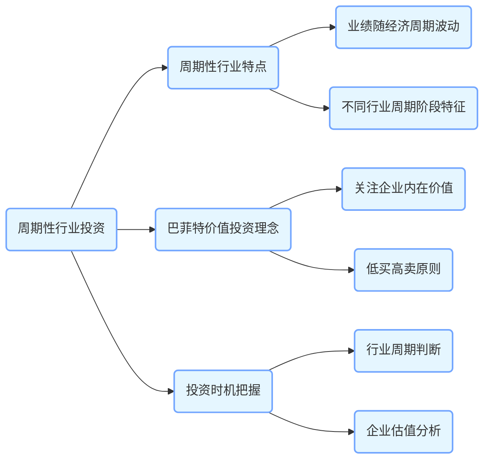

# 巴菲特的周期性行业投资技巧：把握时机的艺术

> 关键词：巴菲特、周期性行业、投资技巧、把握时机、行业周期、价值投资

> 摘要：本文深入探讨了巴菲特在周期性行业的投资技巧，核心在于把握投资时机。通过对周期性行业特点的分析，阐述了巴菲特投资的核心概念和逻辑，详细介绍了相关的投资算法原理和操作步骤，并运用数学模型和公式进行解读。结合实际项目案例，分析了在周期性行业投资中的代码实现和具体应用场景。同时，推荐了学习该领域投资知识的工具和资源，最后对未来周期性行业投资的发展趋势与挑战进行了总结，并解答了常见问题，为投资者提供了全面且深入的投资参考。

## 1. 背景介绍 
### 1.1 目的和范围
本文旨在深入剖析巴菲特在周期性行业的投资技巧，特别是把握投资时机的艺术。通过对相关概念、原理、算法以及实际案例的研究，为投资者提供系统的知识和方法，帮助他们在周期性行业投资中做出更明智的决策。范围涵盖了周期性行业的基本概念、巴菲特投资的核心思想、具体的投资操作步骤、数学模型分析、实际项目应用以及未来发展趋势等方面。

### 1.2 预期读者
本文适合各类投资者，包括个人投资者、机构投资者以及对投资领域感兴趣的学生和研究人员。对于希望学习巴菲特投资理念并将其应用于周期性行业的读者，本文将提供有价值的参考和指导。

### 1.3 文档结构概述
本文将按照以下结构进行阐述：首先介绍周期性行业投资的背景信息，包括目的、读者群体和文档结构。接着阐述核心概念与联系，展示相关的原理和架构示意图。然后详细讲解核心算法原理和具体操作步骤，结合Python代码进行说明。随后介绍数学模型和公式，并通过举例进行详细解释。再通过实际项目案例，展示代码实现和分析。之后探讨实际应用场景，推荐学习工具和资源。最后总结未来发展趋势与挑战，解答常见问题，并提供扩展阅读和参考资料。

### 1.4 术语表
#### 1.4.1 核心术语定义
- **周期性行业**：指那些经营业绩随着经济周期的涨缩而变动的行业。经济上升期，这些行业的业绩会显著增长；经济衰退期，业绩则会大幅下滑。例如钢铁、汽车、房地产等行业。
- **价值投资**：由本杰明·格雷厄姆提出，经巴菲特发扬光大的投资理念。其核心是通过对企业内在价值的评估，寻找价格低于内在价值的股票进行投资，以获取长期的投资回报。
- **投资时机**：在周期性行业投资中，指投资者选择买入或卖出股票的最佳时间点，通常与行业周期的不同阶段相关。

#### 1.4.2 相关概念解释
- **行业周期**：周期性行业经历的从繁荣到衰退，再到复苏的循环过程。一般包括四个阶段：繁荣期、衰退期、萧条期和复苏期。
- **内在价值**：企业在其剩余寿命中所能产生的现金流量的折现值，是价值投资中评估股票是否值得投资的重要指标。

#### 1.4.3 缩略词列表
- **PE**：市盈率（Price-to-Earnings Ratio），指股票价格除以每股收益的比率，用于衡量股票的估值水平。
- **PB**：市净率（Price-to-Book Ratio），指股票价格与每股净资产的比率，反映了市场对公司资产质量的评价。

## 2. 核心概念与联系 
### 周期性行业的特点
周期性行业的业绩与宏观经济环境密切相关。在经济繁荣时期，市场需求旺盛，企业的销售额和利润会大幅增长；而在经济衰退时期，市场需求萎缩，企业的业绩会受到严重影响。例如，钢铁行业在经济高速发展阶段，基础设施建设和房地产开发对钢铁的需求巨大，钢铁企业的产能利用率高，利润丰厚；但在经济低迷时期，需求下降，钢铁价格下跌，企业可能面临亏损。

### 巴菲特的价值投资理念
巴菲特坚持价值投资，他认为股票的价格会围绕其内在价值波动。投资者应该关注企业的内在价值，而不是短期的市场波动。在周期性行业投资中，巴菲特会在行业处于低谷、企业股价被低估时买入股票，等待行业复苏和企业价值回归，从而获得丰厚的投资回报。

### 核心概念原理和架构的文本示意图
```plaintext
周期性行业投资
|-- 周期性行业特点
|   |-- 业绩随经济周期波动
|   |-- 不同行业周期阶段特征
|-- 巴菲特价值投资理念
|   |-- 关注企业内在价值
|   |-- 低买高卖原则
|-- 投资时机把握
|   |-- 行业周期判断
|   |-- 企业估值分析
```

### Mermaid 流程图


## 3. 核心算法原理 & 具体操作步骤 
### 行业周期判断算法
判断行业周期是把握投资时机的关键。我们可以通过分析行业的一些关键指标，如销售额、利润率、产能利用率等，来判断行业所处的周期阶段。以下是一个简单的Python代码示例，用于模拟行业周期的判断：

```python
def industry_cycle_judgment(sales_growth_rate, profit_margin):
    if sales_growth_rate > 0 and profit_margin > 0.1:
        return "繁荣期"
    elif sales_growth_rate < 0 and profit_margin < 0.05:
        return "衰退期"
    elif sales_growth_rate < 0 and profit_margin < 0:
        return "萧条期"
    else:
        return "复苏期"

# 示例数据
sales_growth_rate = 0.1
profit_margin = 0.15
cycle_stage = industry_cycle_judgment(sales_growth_rate, profit_margin)
print(f"行业当前处于 {cycle_stage}")
```

### 企业估值算法
企业估值是价值投资的核心。常用的估值方法有市盈率法、市净率法等。以下是一个使用市盈率法进行企业估值的Python代码示例：

```python
def enterprise_valuation(earnings_per_share, pe_ratio):
    return earnings_per_share * pe_ratio

# 示例数据
earnings_per_share = 2
pe_ratio = 15
valuation = enterprise_valuation(earnings_per_share, pe_ratio)
print(f"企业的估值为 {valuation}")
```

### 具体操作步骤
1. **收集数据**：收集周期性行业的相关数据，包括行业的销售额、利润率、产能利用率等，以及企业的财务数据，如每股收益、净资产等。
2. **行业周期判断**：使用上述行业周期判断算法，根据收集的数据判断行业所处的周期阶段。
3. **企业估值**：选择合适的估值方法，如市盈率法、市净率法等，对目标企业进行估值。
4. **投资决策**：在行业处于低谷、企业股价被低估时，买入股票；在行业复苏、企业价值回归时，卖出股票。

## 4. 数学模型和公式 & 详细讲解 & 举例说明 
### 市盈率模型
市盈率（PE）是最常用的估值指标之一，其计算公式为：
$$PE = \frac{P}{EPS}$$
其中，$P$ 表示股票价格，$EPS$ 表示每股收益。

市盈率模型的原理是，通过比较不同企业的市盈率，判断股票的估值水平。一般来说，市盈率较低的股票可能被低估，具有投资价值。

例如，某公司的股票价格为 $30$ 元，每股收益为 $2$ 元，则该公司的市盈率为：
$$PE = \frac{30}{2} = 15$$

### 市净率模型
市净率（PB）也是常用的估值指标，其计算公式为：
$$PB = \frac{P}{BVPS}$$
其中，$P$ 表示股票价格，$BVPS$ 表示每股净资产。

市净率模型的原理是，通过比较企业的市场价值与账面价值，判断股票的估值水平。市净率较低的股票可能被低估。

例如，某公司的股票价格为 $20$ 元，每股净资产为 $10$ 元，则该公司的市净率为：
$$PB = \frac{20}{10} = 2$$

### 内在价值模型
内在价值是企业在其剩余寿命中所能产生的现金流量的折现值。常用的内在价值模型是现金流折现模型（DCF），其计算公式为：
$$V = \sum_{t=1}^{n} \frac{CF_t}{(1 + r)^t}$$
其中，$V$ 表示企业的内在价值，$CF_t$ 表示第 $t$ 期的现金流量，$r$ 表示折现率，$n$ 表示预测期数。

例如，假设某企业未来三年的现金流量分别为 $100$ 万元、$120$ 万元和 $150$ 万元，折现率为 $10\%$，则该企业的内在价值为：
$$V = \frac{100}{(1 + 0.1)^1} + \frac{120}{(1 + 0.1)^2} + \frac{150}{(1 + 0.1)^3} \approx 295.47$$（万元）

## 5. 项目实战：代码实际案例和详细解释说明 
### 5.1  开发环境搭建
为了实现周期性行业投资的代码，我们需要搭建以下开发环境：
- **Python 环境**：建议使用 Python 3.7 及以上版本。
- **开发工具**：可以使用 PyCharm、Jupyter Notebook 等开发工具。
- **相关库**：需要安装 pandas、numpy 等数据处理库，以及 matplotlib 等可视化库。

### 5.2  源代码详细实现和代码解读
以下是一个完整的周期性行业投资分析的 Python 代码示例：

```python
import pandas as pd
import numpy as np
import matplotlib.pyplot as plt

# 模拟行业数据
data = {
    'year': [2015, 2016, 2017, 2018, 2019, 2020, 2021, 2022, 2023],
    'sales_growth_rate': [0.1, 0.15, 0.2, -0.05, -0.1, -0.15, 0.05, 0.1, 0.12],
    'profit_margin': [0.12, 0.15, 0.18, 0.08, 0.03, -0.02, 0.06, 0.09, 0.11]
}

df = pd.DataFrame(data)

# 行业周期判断函数
def industry_cycle_judgment(sales_growth_rate, profit_margin):
    if sales_growth_rate > 0 and profit_margin > 0.1:
        return "繁荣期"
    elif sales_growth_rate < 0 and profit_margin < 0.05:
        return "衰退期"
    elif sales_growth_rate < 0 and profit_margin < 0:
        return "萧条期"
    else:
        return "复苏期"

# 判断每年的行业周期
df['cycle_stage'] = df.apply(lambda row: industry_cycle_judgment(row['sales_growth_rate'], row['profit_margin']), axis=1)

# 可视化行业周期
plt.figure(figsize=(10, 6))
plt.plot(df['year'], df['sales_growth_rate'], label='Sales Growth Rate')
plt.plot(df['year'], df['profit_margin'], label='Profit Margin')
for i, stage in enumerate(df['cycle_stage']):
    plt.text(df['year'][i], df['sales_growth_rate'][i], stage, ha='center', va='bottom')
plt.xlabel('Year')
plt.ylabel('Rate')
plt.title('Industry Cycle Analysis')
plt.legend()
plt.show()

# 企业估值示例
earnings_per_share = 2
pe_ratio = 15
valuation = earnings_per_share * pe_ratio
print(f"企业的估值为 {valuation}")
```

### 代码解读与分析
1. **数据模拟**：使用 `pandas` 库创建一个包含行业销售额增长率和利润率的数据集。
2. **行业周期判断**：定义 `industry_cycle_judgment` 函数，根据销售额增长率和利润率判断行业所处的周期阶段，并将结果添加到数据集中。
3. **可视化分析**：使用 `matplotlib` 库绘制销售额增长率和利润率的折线图，并在图上标注每年的行业周期阶段。
4. **企业估值**：使用市盈率法对企业进行估值，并输出估值结果。

通过以上代码，我们可以对周期性行业的发展情况进行分析，并对企业进行估值，为投资决策提供参考。

## 6. 实际应用场景 
### 钢铁行业投资
在钢铁行业，当经济处于衰退期时，市场需求下降，钢铁价格下跌，钢铁企业的业绩会受到严重影响。此时，巴菲特可能会关注那些具有成本优势、技术领先的钢铁企业，通过对企业的内在价值进行评估，在股价被低估时买入股票。当经济复苏，市场需求增加，钢铁价格上涨，企业业绩回升时，卖出股票获取投资回报。

### 汽车行业投资
汽车行业也是典型的周期性行业。在经济繁荣时期，消费者购买力强，汽车销量增加，汽车企业的利润丰厚；而在经济衰退时期，汽车销量下降，企业可能面临亏损。巴菲特会在汽车行业处于低谷时，寻找那些具有品牌优势、研发能力强的汽车企业进行投资，等待行业复苏。

### 房地产行业投资
房地产行业的周期性也很明显。在经济上升期，房地产市场需求旺盛，房价上涨，房地产企业的销售额和利润会大幅增长；在经济衰退期，市场需求萎缩，房价下跌，企业的业绩会受到影响。巴菲特可能会在房地产行业低迷时，投资那些具有优质土地储备、良好信誉的房地产企业，在行业复苏时获得收益。

## 7. 工具和资源推荐
### 7.1 学习资源推荐
#### 7.1.1 书籍推荐
- 《聪明的投资者》（The Intelligent Investor）：本杰明·格雷厄姆著，价值投资的经典之作，对巴菲特的投资理念产生了深远影响。
- 《巴菲特致股东的信：股份公司教程》（Letters to Shareholders of Berkshire Hathaway）：沃伦·巴菲特著，通过巴菲特写给股东的信，深入了解他的投资思想和方法。
- 《怎样选择成长股》（Common Stocks and Uncommon Profits）：菲利普·费雪著，介绍了如何寻找具有成长潜力的股票，对周期性行业投资也有一定的参考价值。

#### 7.1.2 在线课程
- Coursera 上的“投资学原理”课程：由知名大学教授授课，系统介绍投资学的基本原理和方法。
- edX 上的“价值投资基础”课程：深入讲解价值投资的理念和实践。

#### 7.1.3 技术博客和网站
- 雪球网：国内知名的投资社区，有大量的投资者分享投资经验和研究报告。
- Seeking Alpha：国外的投资网站，提供全球范围内的投资分析和研究。

### 7.2 开发工具框架推荐
#### 7.2.1 IDE和编辑器
- PyCharm：功能强大的 Python 集成开发环境，适合进行数据分析和算法开发。
- Jupyter Notebook：交互式的开发环境，方便进行代码调试和数据可视化。

#### 7.2.2 调试和性能分析工具
- PDB：Python 自带的调试工具，用于调试 Python 代码。
- cProfile：Python 的性能分析工具，用于分析代码的运行时间和性能瓶颈。

#### 7.2.3 相关框架和库
- pandas：用于数据处理和分析的 Python 库，提供了丰富的数据结构和函数。
- numpy：用于科学计算的 Python 库，提供了高效的数组操作和数学函数。
- matplotlib：用于数据可视化的 Python 库，可绘制各种类型的图表。

### 7.3 相关论文著作推荐
#### 7.3.1 经典论文
- 《证券分析》（Security Analysis）：本杰明·格雷厄姆和戴维·多德著，奠定了价值投资的理论基础。
- 《有效市场假说》（Efficient Markets Hypothesis）：尤金·法玛著，探讨了市场效率和投资策略的关系。

#### 7.3.2 最新研究成果
- 《周期性行业投资策略研究》：近年来一些学者对周期性行业投资策略的研究成果，可在学术数据库中查找。

#### 7.3.3 应用案例分析
- 一些金融研究机构发布的关于周期性行业投资的案例分析报告，可在其官方网站上获取。

## 8. 总结：未来发展趋势与挑战
### 未来发展趋势
- **宏观经济环境的影响**：随着全球经济的发展和变化，周期性行业的波动将受到宏观经济环境的影响更加明显。投资者需要更加关注宏观经济指标，如 GDP 增长率、通货膨胀率等，以更好地把握行业周期。
- **科技创新的推动**：科技创新将对周期性行业产生深远影响。例如，新能源技术的发展将改变传统能源行业的格局，智能制造技术的应用将提高制造业的生产效率。投资者需要关注科技创新带来的行业变革，寻找新的投资机会。
- **国际化投资趋势**：随着全球化的发展，投资者将更加关注国际市场的周期性行业投资机会。跨国投资将成为未来的发展趋势，投资者需要了解不同国家和地区的经济环境和行业特点。

### 挑战
- **行业周期判断的难度**：周期性行业的周期波动受到多种因素的影响，如宏观经济政策、市场需求变化、技术创新等，使得行业周期的判断难度加大。投资者需要具备丰富的经验和专业知识，才能准确判断行业所处的周期阶段。
- **企业估值的不确定性**：企业的内在价值受到多种因素的影响，如未来现金流量的预测、折现率的选择等，使得企业估值存在一定的不确定性。投资者需要采用多种估值方法进行综合评估，以降低估值误差。
- **市场情绪的影响**：市场情绪往往会对周期性行业的股价产生较大影响。在行业繁荣期，投资者可能会过度乐观，导致股价高估；在行业衰退期，投资者可能会过度悲观，导致股价低估。投资者需要保持理性，不受市场情绪的影响。

## 9. 附录：常见问题与解答
### 如何准确判断周期性行业的周期阶段？
判断周期性行业的周期阶段需要综合考虑多个因素，如行业的销售额、利润率、产能利用率、宏观经济指标等。可以通过分析历史数据，建立数学模型，结合行业专家的意见，来提高判断的准确性。

### 价值投资在周期性行业中是否适用？
价值投资在周期性行业中仍然适用。虽然周期性行业的业绩波动较大，但企业的内在价值是相对稳定的。投资者可以在行业处于低谷、企业股价被低估时买入股票，等待行业复苏和企业价值回归，从而获得投资回报。

### 如何选择合适的估值方法？
选择合适的估值方法需要考虑企业的特点和行业的情况。对于周期性行业的企业，市盈率法和市净率法是常用的估值方法。在使用这些方法时，需要结合企业的历史数据和行业平均水平进行综合分析。同时，也可以采用现金流折现模型等方法进行估值，以提高估值的准确性。

## 10. 扩展阅读 & 参考资料
### 扩展阅读
- 《金融炼金术》（The Alchemy of Finance）：乔治·索罗斯著，探讨了金融市场的波动和投资者的心理。
- 《漫步华尔街》（A Random Walk Down Wall Street）：伯顿·马尔基尔著，介绍了股票市场的投资策略和风险控制。

### 参考资料
- 巴菲特历年致股东的信，可在伯克希尔·哈撒韦公司官方网站上获取。
- 相关行业的统计数据和研究报告，可在国家统计局、行业协会等官方网站上获取。
- 学术数据库，如 CNKI、万方数据等，可查找相关的学术论文和研究成果。