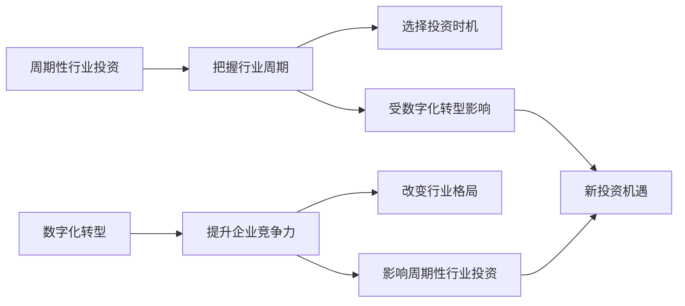

# 巴菲特的周期性行业投资：数字化转型中的机遇把握

> 关键词：巴菲特、周期性行业投资、数字化转型、机遇把握、投资策略

> 摘要：本文深入探讨了巴菲特在周期性行业投资方面的理念和策略，并结合当下数字化转型的大背景，分析了在这一过程中周期性行业所面临的机遇。首先介绍了文章的背景，包括目的、预期读者、文档结构和相关术语。接着阐述了周期性行业投资和数字化转型的核心概念及其联系，通过Python代码详细讲解了相关核心算法原理和操作步骤。从数学模型和公式层面进行了深入剖析并举例说明。以实际项目为例，展示了代码实现和解读。列举了周期性行业投资在数字化转型中的实际应用场景，推荐了相关的学习资源、开发工具框架和论文著作。最后总结了未来发展趋势与挑战，解答了常见问题，并提供了扩展阅读和参考资料，旨在为投资者在周期性行业数字化转型中把握机遇提供全面的指导。

## 1. 背景介绍 
### 1.1 目的和范围
本文的目的在于结合巴菲特的周期性行业投资理念，深入探讨数字化转型为周期性行业投资带来的机遇。通过对核心概念、算法原理、数学模型等多方面的分析，以及实际项目案例的展示，为投资者和相关从业者提供全面且深入的见解。范围涵盖了周期性行业投资的基本理论、数字化转型的技术和趋势，以及两者结合下的投资策略和实际应用。

### 1.2 预期读者
本文预期读者包括对投资领域尤其是周期性行业投资感兴趣的投资者，金融行业从业者，对数字化转型在传统行业应用有研究需求的技术人员和学者，以及关注经济发展趋势和行业变革的相关人士。

### 1.3 文档结构概述
本文首先介绍背景信息，让读者了解文章的目的、目标读者和整体结构。接着阐述周期性行业投资和数字化转型的核心概念及其联系，为后续内容奠定基础。通过Python代码详细讲解核心算法原理和操作步骤，并用数学模型和公式进行深入分析。以实际项目为例展示代码实现和解读，使读者能更好地理解理论知识在实际中的应用。列举实际应用场景，推荐相关学习资源、开发工具框架和论文著作。最后总结未来发展趋势与挑战，解答常见问题，并提供扩展阅读和参考资料。

### 1.4 术语表
#### 1.4.1 核心术语定义
- **周期性行业**：指行业的景气度与宏观经济周期密切相关的行业，如钢铁、煤炭、化工等。这些行业的产品需求和价格会随着经济的繁荣和衰退而波动。
- **数字化转型**：指企业或行业利用数字技术，对业务流程、商业模式、组织架构等进行全面变革，以提高效率、创新能力和竞争力。
- **巴菲特投资理念**：以价值投资为核心，强调寻找具有长期竞争优势、被市场低估的企业进行投资，并长期持有。

#### 1.4.2 相关概念解释
- **经济周期**：经济活动沿着经济发展的总体趋势所经历的有规律的扩张和收缩。一般分为繁荣、衰退、萧条和复苏四个阶段。
- **价值投资**：通过对企业基本面的分析，评估其内在价值，寻找价格低于内在价值的股票进行投资。

#### 1.4.3 缩略词列表
- **GDP**：国内生产总值，衡量一个国家或地区经济活动总量的指标。
- **AI**：人工智能，利用计算机模拟人类智能的技术。
- **IoT**：物联网，通过互联网将各种设备连接起来，实现数据交换和智能化管理的网络。

## 2. 核心概念与联系 
### 周期性行业投资的核心概念
周期性行业投资的核心在于把握行业的周期波动规律。在经济繁荣阶段，周期性行业的产品需求旺盛，企业盈利能力增强，股价往往会上涨；而在经济衰退阶段，需求下降，企业盈利减少，股价可能下跌。投资者需要通过对宏观经济形势的分析，判断周期性行业所处的周期阶段，选择合适的投资时机。

### 数字化转型的核心概念
数字化转型是利用数字技术对传统行业进行全方位的改造。它包括数据的采集、存储、分析和应用，以及利用人工智能、物联网等技术实现业务流程的自动化和智能化。数字化转型可以提高企业的生产效率、降低成本、提升产品质量和服务水平，增强企业的竞争力。

### 两者的联系
数字化转型为周期性行业投资带来了新的机遇。一方面，数字化技术可以帮助周期性行业企业更好地应对周期波动。例如，通过物联网技术实现生产设备的实时监测和管理，提高生产效率和质量，降低成本；利用大数据分析预测市场需求，优化生产计划和库存管理。另一方面，数字化转型也为投资者提供了新的投资视角。投资者可以关注那些积极推进数字化转型的周期性行业企业，这些企业可能在行业竞争中脱颖而出，具有更高的投资价值。

### 文本示意图
周期性行业投资与数字化转型的联系可以用以下文本示意图表示：

周期性行业投资 -> 把握行业周期波动 -> 选择投资时机
数字化转型 -> 提升企业竞争力 -> 改变行业格局
两者联系 -> 数字化转型助力周期性行业应对周期波动 -> 为投资者带来新机遇

### Mermaid 流程图


## 3. 核心算法原理 & 具体操作步骤 
### 核心算法原理：基于宏观经济指标的周期性行业投资分析
在周期性行业投资中，我们可以通过分析宏观经济指标来判断行业所处的周期阶段。常用的宏观经济指标包括GDP增长率、通货膨胀率、利率等。以下是一个简单的基于Python的分析算法，通过分析GDP增长率来判断周期性行业的投资时机。

```python
import pandas as pd
import matplotlib.pyplot as plt

# 假设我们有一个包含GDP增长率的数据集
gdp_growth = [2.5, 3.0, 2.8, 2.2, 1.5, 0.8, 1.2, 1.8, 2.3, 2.6]
years = [2010, 2011, 2012, 2013, 2014, 2015, 2016, 2017, 2018, 2019]

# 创建DataFrame
data = pd.DataFrame({'Year': years, 'GDP Growth': gdp_growth})

# 绘制GDP增长率折线图
plt.plot(data['Year'], data['GDP Growth'])
plt.xlabel('Year')
plt.ylabel('GDP Growth (%)')
plt.title('GDP Growth over Years')
plt.show()

# 判断投资时机
def investment_opportunity(gdp_growth):
    if gdp_growth > 2.5:
        return 'Buy'
    elif gdp_growth < 1.5:
        return 'Sell'
    else:
        return 'Hold'

# 为每个年份判断投资时机
data['Investment Decision'] = data['GDP Growth'].apply(investment_opportunity)
print(data)
```

### 具体操作步骤
1. **数据收集**：收集相关的宏观经济指标数据，如GDP增长率、通货膨胀率等。可以从政府统计部门、金融机构等获取数据。
2. **数据预处理**：对收集到的数据进行清洗和整理，去除缺失值和异常值。
3. **数据分析**：使用Python等编程语言对数据进行分析，绘制图表，观察指标的变化趋势。
4. **投资决策**：根据分析结果，结合周期性行业的特点，制定投资决策。例如，当GDP增长率较高时，可以考虑买入周期性行业的股票；当GDP增长率较低时，可以考虑卖出或持有。

## 4. 数学模型和公式 & 详细讲解 & 举例说明 
### 数学模型：基于回归分析的周期性行业盈利预测
在周期性行业投资中，我们可以建立回归模型来预测企业的盈利情况。假设企业的盈利（$Y$）与宏观经济指标（如GDP增长率 $X_1$、通货膨胀率 $X_2$ 等）之间存在线性关系，可以用以下公式表示：

$$Y = \beta_0 + \beta_1X_1 + \beta_2X_2 + \epsilon$$

其中，$\beta_0$ 是截距项，$\beta_1$ 和 $\beta_2$ 是回归系数，$\epsilon$ 是误差项。

### 详细讲解
回归分析的目的是通过已知的样本数据，估计回归系数 $\beta_0$、$\beta_1$ 和 $\beta_2$ 的值，从而建立预测模型。常用的估计方法是最小二乘法，即通过最小化误差项的平方和来求解回归系数。

### 举例说明
假设我们有以下样本数据：

| GDP增长率（$X_1$） | 通货膨胀率（$X_2$） | 企业盈利（$Y$） |
| --- | --- | --- |
| 2.5 | 1.8 | 100 |
| 3.0 | 2.0 | 120 |
| 2.8 | 1.9 | 110 |
| 2.2 | 1.6 | 90 |
| 1.5 | 1.2 | 70 |

使用Python的`statsmodels`库进行回归分析：

```python
import numpy as np
import statsmodels.api as sm

# 定义自变量和因变量
X = np.array([[2.5, 1.8], [3.0, 2.0], [2.8, 1.9], [2.2, 1.6], [1.5, 1.2]])
Y = np.array([100, 120, 110, 90, 70])

# 添加常数项
X = sm.add_constant(X)

# 建立回归模型
model = sm.OLS(Y, X)
results = model.fit()

# 输出回归结果
print(results.summary())
```

通过回归分析，我们可以得到回归系数的估计值，从而建立预测模型。例如，假设回归结果为 $\beta_0 = 20$，$\beta_1 = 20$，$\beta_2 = 10$，则预测模型为：

$$Y = 20 + 20X_1 + 10X_2$$

当GDP增长率为 3.0，通货膨胀率为 2.0 时，预测企业盈利为：

$$Y = 20 + 20\times3.0 + 10\times2.0 = 100$$

## 5. 项目实战：代码实际案例和详细解释说明 
### 5.1  开发环境搭建
- **操作系统**：推荐使用Windows、Linux或macOS。
- **编程语言**：Python 3.x
- **开发工具**：可以使用PyCharm、Jupyter Notebook等。
- **所需库**：`pandas`、`numpy`、`matplotlib`、`statsmodels` 等。可以使用以下命令安装：

```sh
pip install pandas numpy matplotlib statsmodels
```

### 5.2  源代码详细实现和代码解读
以下是一个完整的项目实战代码，结合数字化转型的概念，分析周期性行业企业的数字化程度对其股价的影响。

```python
import pandas as pd
import numpy as np
import matplotlib.pyplot as plt
import statsmodels.api as sm

# 模拟数据：企业数字化程度（0 - 100）和股价
digitalization_level = [20, 30, 40, 50, 60, 70, 80, 90, 100]
stock_prices = [50, 60, 70, 80, 90, 100, 110, 120, 130]

# 创建DataFrame
data = pd.DataFrame({'Digitalization Level': digitalization_level, 'Stock Price': stock_prices})

# 绘制散点图
plt.scatter(data['Digitalization Level'], data['Stock Price'])
plt.xlabel('Digitalization Level')
plt.ylabel('Stock Price')
plt.title('Relationship between Digitalization Level and Stock Price')
plt.show()

# 建立回归模型
X = data['Digitalization Level']
Y = data['Stock Price']

# 添加常数项
X = sm.add_constant(X)

# 拟合回归模型
model = sm.OLS(Y, X)
results = model.fit()

# 输出回归结果
print(results.summary())

# 预测股价
new_digitalization_level = np.array([[1, 55]])  # 预测数字化程度为55时的股价
predicted_stock_price = results.predict(new_digitalization_level)
print(f'Predicted stock price for digitalization level 55: {predicted_stock_price[0]}')
```

### 代码解读与分析
1. **数据模拟**：使用`digitalization_level`和`stock_prices`列表模拟企业的数字化程度和股价数据。
2. **数据可视化**：使用`matplotlib`库绘制散点图，直观展示数字化程度和股价之间的关系。
3. **回归分析**：使用`statsmodels`库建立线性回归模型，分析数字化程度对股价的影响。
4. **模型评估**：通过输出回归结果的摘要信息，评估模型的拟合效果和回归系数的显著性。
5. **预测**：使用拟合好的模型预测数字化程度为 55 时的股价。

## 6. 实际应用场景 
### 钢铁行业
在钢铁行业，数字化转型可以实现生产过程的智能化管理。通过物联网技术，对高炉、轧机等设备进行实时监测，及时发现设备故障和异常情况，提高设备的运行效率和可靠性。同时，利用大数据分析预测市场需求，优化生产计划和库存管理，降低生产成本。投资者可以关注那些积极推进数字化转型的钢铁企业，这些企业可能在行业竞争中具有更大的优势。

### 煤炭行业
煤炭行业的数字化转型主要体现在智能化开采和安全生产方面。通过引入人工智能和自动化技术，实现煤炭开采的自动化和智能化，提高开采效率和安全性。此外，数字化转型还可以帮助煤炭企业优化供应链管理，降低物流成本。投资者可以选择那些在数字化转型方面取得显著进展的煤炭企业进行投资。

### 化工行业
化工行业的数字化转型涉及到生产过程的优化、质量控制和环境保护等方面。通过数字化技术，实现对化工生产过程的精确控制，提高产品质量和生产效率。同时，利用大数据分析和人工智能技术，预测市场需求和原材料价格波动，优化生产计划和采购策略。投资者可以关注那些在数字化转型方面具有创新能力的化工企业。

## 7. 工具和资源推荐
### 7.1 学习资源推荐
#### 7.1.1 书籍推荐
- 《聪明的投资者》（The Intelligent Investor）：作者本杰明·格雷厄姆（Benjamin Graham），价值投资领域的经典著作，介绍了价值投资的基本理念和方法。
- 《巴菲特致股东的信》（Letters to Shareholders of Berkshire Hathaway）：沃伦·巴菲特（Warren Buffett）写给股东的信，包含了他的投资理念、策略和对宏观经济的看法。
- 《数字化转型：企业破局与增长的新路径》：介绍了企业数字化转型的理论和实践，对周期性行业的数字化转型具有指导意义。

#### 7.1.2 在线课程
- Coursera上的“投资学原理”（Principles of Investing）：由知名大学教授授课，系统介绍投资学的基本原理和方法。
- edX上的“数字化转型战略”（Digital Transformation Strategy）：讲解企业数字化转型的战略规划和实施方法。

#### 7.1.3 技术博客和网站
- 雪球网：提供股票投资分析、财经新闻等内容，是投资者交流和学习的平台。
- 36氪：关注科技创新和创业领域，有很多关于数字化转型的文章和案例。

### 7.2 开发工具框架推荐
#### 7.2.1 IDE和编辑器
- PyCharm：专业的Python集成开发环境，具有代码编辑、调试、版本控制等功能。
- Jupyter Notebook：交互式编程环境，适合数据分析和模型开发。

#### 7.2.2 调试和性能分析工具
- PySnooper：可以在不修改代码的情况下，输出函数的执行过程和变量的值，方便调试。
- cProfile：Python内置的性能分析工具，可以分析代码的运行时间和函数调用情况。

#### 7.2.3 相关框架和库
- Pandas：用于数据处理和分析的Python库，提供了高效的数据结构和数据操作方法。
- NumPy：用于科学计算的Python库，提供了多维数组和矩阵运算的功能。
- Scikit-learn：用于机器学习的Python库，包含了各种机器学习算法和工具。

### 7.3 相关论文著作推荐
#### 7.3.1 经典论文
- Fama, E. F., & French, K. R. (1992). The cross-section of expected stock returns. The Journal of Finance, 47(2), 427-465. 提出了Fama-French三因子模型，用于解释股票回报率的差异。
- Modigliani, F., & Miller, M. H. (1958). The cost of capital, corporation finance and the theory of investment. The American Economic Review, 48(3), 261-297. 提出了Modigliani-Miller定理，对企业融资和资本结构理论产生了深远影响。

#### 7.3.2 最新研究成果
- 关注《Journal of Financial Economics》、《Review of Financial Studies》等金融领域顶级期刊，了解周期性行业投资和数字化转型的最新研究成果。

#### 7.3.3 应用案例分析
- 可以参考麦肯锡、波士顿咨询等咨询公司发布的关于周期性行业数字化转型的研究报告和案例分析，了解实际应用中的经验和教训。

## 8. 总结：未来发展趋势与挑战
### 未来发展趋势
- **数字化转型加速**：随着数字技术的不断发展和普及，周期性行业的数字化转型将进一步加速。企业将更加注重利用大数据、人工智能、物联网等技术提高生产效率、降低成本、提升产品质量和服务水平。
- **投资机会增加**：数字化转型将为周期性行业带来新的投资机会。投资者可以关注那些在数字化转型方面具有领先优势的企业，以及与数字化转型相关的新兴产业，如工业互联网、智能制造等。
- **行业整合加剧**：数字化转型将推动周期性行业的整合和升级。一些规模较小、技术落后的企业可能会被淘汰，而具有较强竞争力的企业将通过并购、重组等方式扩大市场份额。

### 挑战
- **技术应用难度**：周期性行业的生产过程复杂，数字化转型需要大量的技术投入和专业人才。企业在应用数字技术时可能会遇到技术难题和实施困难。
- **数据安全和隐私问题**：数字化转型涉及到大量的数据收集、存储和分析，数据安全和隐私问题成为企业面临的重要挑战。企业需要加强数据安全管理，保护用户的隐私。
- **市场不确定性**：周期性行业的市场需求和价格波动较大，数字化转型并不能完全消除市场不确定性。投资者需要对市场趋势进行准确判断，降低投资风险。

## 9. 附录：常见问题与解答
### 问题1：周期性行业投资和非周期性行业投资有什么区别？
解答：周期性行业投资的收益与宏观经济周期密切相关，在经济繁荣时表现较好，在经济衰退时表现较差。非周期性行业投资的收益相对稳定，不受宏观经济周期的影响较大，如食品、医药等行业。

### 问题2：数字化转型对周期性行业企业的成本有什么影响？
解答：数字化转型初期，企业需要投入大量的资金用于技术研发、设备升级和人才培养，成本可能会增加。但从长期来看，数字化转型可以提高生产效率、降低生产成本，如减少人工成本、降低能源消耗等。

### 问题3：如何判断周期性行业企业的数字化转型是否成功？
解答：可以从多个方面进行判断，如生产效率是否提高、产品质量是否提升、成本是否降低、市场份额是否扩大等。此外，还可以关注企业的创新能力和竞争力是否增强。

## 10. 扩展阅读 & 参考资料
### 扩展阅读
- 《金融炼金术》（The Alchemy of Finance）：作者乔治·索罗斯（George Soros），介绍了他的投资哲学和方法，对投资者的思维方式有很大的启发。
- 《创新者的窘境》（The Innovator's Dilemma）：作者克莱顿·克里斯坦森（Clayton Christensen），探讨了企业在面对技术创新时的困境和应对策略。

### 参考资料
- 国家统计局网站：获取宏观经济数据和行业统计信息。
- 各行业协会网站：了解行业动态和发展趋势。
- 上市公司年报和公告：获取企业的财务信息和业务发展情况。