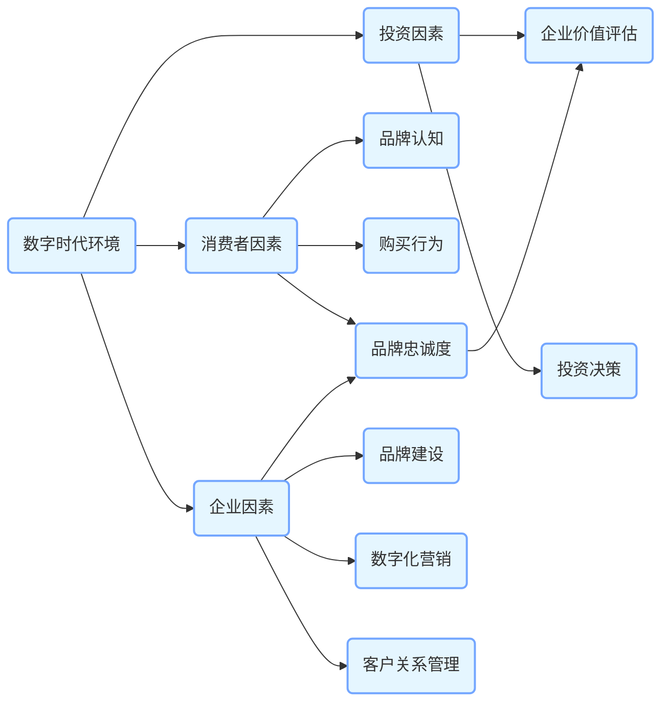

# 巴菲特的品牌忠诚度在数字时代的重新定义

> 关键词：巴菲特、品牌忠诚度、数字时代、重新定义、投资理念、消费者行为、企业价值

> 摘要：本文聚焦于巴菲特的品牌忠诚度在数字时代的重新定义。首先介绍了研究的背景、目的、预期读者等内容。接着深入探讨核心概念，包括品牌忠诚度的原理及与巴菲特投资理念的联系，并通过流程图展示。详细阐述核心算法原理，用 Python 代码模拟相关决策过程。引入数学模型和公式来分析品牌忠诚度的量化关系，并举例说明。通过项目实战，搭建开发环境，给出源代码并解读。分析实际应用场景，推荐相关工具和资源。最后总结未来发展趋势与挑战，解答常见问题并提供扩展阅读和参考资料，旨在全面剖析巴菲特的品牌忠诚度在数字时代的新内涵与新变化。

## 1. 背景介绍 
### 1.1 目的和范围
在当今数字时代，信息传播的速度和方式发生了翻天覆地的变化，消费者的行为模式、企业的运营策略以及市场的竞争格局都与以往大不相同。巴菲特作为投资界的传奇人物，其秉持的品牌忠诚度理念在传统经济环境下取得了巨大成功。然而，数字时代的诸多新特点对这一理念提出了新的挑战和机遇。本文的目的在于深入探讨巴菲特的品牌忠诚度在数字时代应如何重新定义，分析其在新环境下的内涵、影响因素以及变化趋势。范围涵盖从消费者视角的品牌认知和购买行为，到企业层面的品牌建设与维护，再到投资领域中基于品牌忠诚度的决策分析。

### 1.2 预期读者
本文预期读者包括对投资领域感兴趣的专业人士，如投资经理、分析师等，他们可以从本文中获取关于在数字时代如何运用品牌忠诚度进行投资决策的新思路；企业管理者和市场营销人员，有助于他们了解数字时代消费者品牌忠诚度的变化，从而优化品牌策略；以及对商业和经济领域有研究热情的学者和学生，为他们提供相关理论和实践的参考依据。

### 1.3 文档结构概述
本文首先介绍研究的背景信息，包括目的、预期读者和文档结构等。接着阐述核心概念，明确品牌忠诚度在数字时代的新含义以及与巴菲特投资理念的联系，并通过流程图直观展示。然后讲解核心算法原理，用 Python 代码实现相关逻辑。引入数学模型和公式对品牌忠诚度进行量化分析并举例说明。通过项目实战，从开发环境搭建到源代码实现和解读，深入分析相关案例。探讨实际应用场景，推荐学习、开发相关的工具和资源。最后总结未来发展趋势与挑战，解答常见问题并提供扩展阅读和参考资料。

### 1.4 术语表
#### 1.4.1 核心术语定义
- **品牌忠诚度**：指消费者在长期内对某一品牌的产品或服务表现出的重复购买行为和积极态度，包括情感忠诚和行为忠诚。情感忠诚体现在消费者对品牌的喜爱、信任和认同感；行为忠诚则表现为实际的重复购买行为。
- **巴菲特投资理念**：以价值投资为核心，强调寻找具有长期竞争优势和稳定现金流的企业进行投资，注重企业的内在价值和品牌影响力。
- **数字时代**：指以信息技术和互联网为基础，信息传播迅速、数字化程度高、消费者行为和市场环境发生深刻变化的时代。

#### 1.4.2 相关概念解释
- **品牌资产**：是品牌所拥有的价值总和，包括品牌知名度、美誉度、忠诚度等多个方面。品牌忠诚度是品牌资产的重要组成部分，对品牌资产的增值和企业的长期发展具有关键作用。
- **消费者行为**：指消费者在购买、使用和处置产品或服务过程中所表现出的心理和行为活动。在数字时代，消费者行为受到社交媒体、网络口碑、个性化推荐等多种因素的影响。

#### 1.4.3 缩略词列表
- **AI**：Artificial Intelligence，人工智能
- **ML**：Machine Learning，机器学习
- **CRM**：Customer Relationship Management，客户关系管理

## 2. 核心概念与联系 

### 核心概念原理
在传统经济环境下，巴菲特的品牌忠诚度理念强调投资具有强大品牌的企业，这些品牌通常具有较高的知名度、美誉度和消费者忠诚度，能够为企业带来稳定的现金流和长期的竞争优势。品牌忠诚度的形成往往基于产品质量、服务水平、品牌形象等因素，消费者通过长期的使用和体验对品牌产生信任和依赖。

在数字时代，品牌忠诚度的形成和影响因素发生了变化。一方面，社交媒体和网络平台的兴起使得信息传播更加迅速和广泛，消费者获取信息的渠道增多，品牌的传播和推广方式也更加多样化。消费者可以通过网络轻松地比较不同品牌的产品和服务，对品牌的评价和口碑也能快速传播。另一方面，数字技术的发展使得企业能够更好地了解消费者的需求和偏好，实现个性化营销和精准服务，从而影响消费者的品牌忠诚度。

### 架构的文本示意图
品牌忠诚度在数字时代的架构可以分为三个层次：消费者层面、企业层面和投资层面。

消费者层面：消费者的品牌认知和态度受到多种因素的影响，包括社交媒体、网络口碑、个性化推荐等。消费者的购买行为和品牌忠诚度也会受到这些因素的调节。

企业层面：企业通过品牌建设、数字化营销、客户关系管理等手段来影响消费者的品牌忠诚度。同时，企业也需要不断创新和提升产品和服务质量，以适应数字时代的竞争。

投资层面：投资者在数字时代需要重新评估品牌忠诚度对企业价值的影响，考虑数字技术和消费者行为变化对企业未来发展的潜在影响，从而做出更加合理的投资决策。

### Mermaid 流程图


## 3. 核心算法原理 & 具体操作步骤 

### 算法原理讲解
在数字时代，我们可以通过分析消费者的行为数据来评估品牌忠诚度。一种简单的方法是基于消费者的购买频率和购买金额来计算品牌忠诚度得分。具体步骤如下：

1. 收集消费者的购买记录，包括购买时间、购买品牌、购买金额等信息。
2. 计算每个消费者在一定时间内的购买频率和购买金额。
3. 根据购买频率和购买金额计算品牌忠诚度得分。可以使用以下公式：

品牌忠诚度得分 $S = \alpha \times F + \beta \times A$

其中，$F$ 是购买频率，$A$ 是购买金额，$\alpha$ 和 $\beta$ 是权重系数，且 $\alpha + \beta = 1$。

### Python 源代码实现
```python
import pandas as pd

# 示例购买记录数据
data = {
    'customer_id': [1, 1, 2, 2, 3, 3],
    'purchase_date': ['2023-01-01', '2023-02-01', '2023-01-15', '2023-03-01', '2023-02-10', '2023-03-20'],
    'brand': ['A', 'A', 'B', 'B', 'A', 'A'],
    'amount': [100, 200, 150, 300, 80, 120]
}

df = pd.DataFrame(data)

# 将购买日期转换为日期类型
df['purchase_date'] = pd.to_datetime(df['purchase_date'])

# 设定时间范围
start_date = '2023-01-01'
end_date = '2023-03-31'

# 筛选时间范围内的数据
filtered_df = df[(df['purchase_date'] >= start_date) & (df['purchase_date'] <= end_date)]

# 计算每个消费者对每个品牌的购买频率和购买金额
grouped_df = filtered_df.groupby(['customer_id', 'brand']).agg({
    'purchase_date': 'count',
    'amount': 'sum'
}).reset_index()

grouped_df.rename(columns={'purchase_date': 'frequency', 'amount': 'total_amount'}, inplace=True)

# 设定权重系数
alpha = 0.6
beta = 0.4

# 计算品牌忠诚度得分
grouped_df['loyalty_score'] = alpha * grouped_df['frequency'] + beta * grouped_df['total_amount']

print(grouped_df)
```

### 具体操作步骤
1. 准备数据：收集消费者的购买记录数据，并将其存储在合适的数据结构中，如 Pandas 的 DataFrame。
2. 数据预处理：将购买日期转换为日期类型，并筛选出需要的时间范围。
3. 数据分组和聚合：按照消费者 ID 和品牌对数据进行分组，计算每个消费者对每个品牌的购买频率和购买金额。
4. 设定权重系数：根据实际情况设定购买频率和购买金额的权重系数。
5. 计算品牌忠诚度得分：使用上述公式计算每个消费者对每个品牌的品牌忠诚度得分。

## 4. 数学模型和公式 & 详细讲解 & 举例说明 

### 数学模型和公式
如前面所述，品牌忠诚度得分的计算公式为：

$$S = \alpha \times F + \beta \times A$$

其中，$S$ 表示品牌忠诚度得分，$F$ 表示购买频率，$A$ 表示购买金额，$\alpha$ 和 $\beta$ 是权重系数，且 $\alpha + \beta = 1$。

### 详细讲解
购买频率 $F$ 反映了消费者在一定时间内购买某一品牌产品或服务的次数，次数越多，说明消费者对该品牌的依赖程度越高。购买金额 $A$ 则反映了消费者在该品牌上的消费支出，支出越高，说明消费者对该品牌的价值认可度越高。

权重系数 $\alpha$ 和 $\beta$ 用于调整购买频率和购买金额在品牌忠诚度得分中的重要性。例如，如果 $\alpha$ 较大，说明购买频率对品牌忠诚度的影响更大；如果 $\beta$ 较大，则说明购买金额对品牌忠诚度的影响更大。

### 举例说明
假设消费者甲在 2023 年 1 月至 3 月期间购买品牌 A 的产品 3 次，总花费为 500 元；购买品牌 B 的产品 2 次，总花费为 300 元。设定 $\alpha = 0.6$，$\beta = 0.4$。

对于品牌 A：
$F_A = 3$，$A_A = 500$
$S_A = 0.6 \times 3 + 0.4 \times 500 = 1.8 + 200 = 201.8$

对于品牌 B：
$F_B = 2$，$A_B = 300$
$S_B = 0.6 \times 2 + 0.4 \times 300 = 1.2 + 120 = 121.2$

从计算结果可以看出，消费者甲对品牌 A 的品牌忠诚度得分高于品牌 B，说明消费者甲在这段时间内对品牌 A 的忠诚度更高。

## 5. 项目实战：代码实际案例和详细解释说明 

### 5.1  开发环境搭建
- **操作系统**：可以选择 Windows、Linux 或 macOS 等主流操作系统。
- **Python 环境**：安装 Python 3.7 及以上版本。可以从 Python 官方网站（https://www.python.org/downloads/）下载安装包进行安装。
- **开发工具**：推荐使用 PyCharm 或 Jupyter Notebook。PyCharm 是一款功能强大的 Python 集成开发环境，提供了代码编辑、调试、版本控制等多种功能；Jupyter Notebook 则是一个交互式的开发环境，适合进行数据分析和代码演示。
- **依赖库安装**：使用 `pip` 命令安装所需的依赖库，主要包括 Pandas。在命令行中执行以下命令：
```sh
pip install pandas
```

### 5.2  源代码详细实现和代码解读
```python
import pandas as pd

# 示例购买记录数据
data = {
    'customer_id': [1, 1, 2, 2, 3, 3],
    'purchase_date': ['2023-01-01', '2023-02-01', '2023-01-15', '2023-03-01', '2023-02-10', '2023-03-20'],
    'brand': ['A', 'A', 'B', 'B', 'A', 'A'],
    'amount': [100, 200, 150, 300, 80, 120]
}

df = pd.DataFrame(data)

# 将购买日期转换为日期类型
df['purchase_date'] = pd.to_datetime(df['purchase_date'])

# 设定时间范围
start_date = '2023-01-01'
end_date = '2023-03-31'

# 筛选时间范围内的数据
filtered_df = df[(df['purchase_date'] >= start_date) & (df['purchase_date'] <= end_date)]

# 计算每个消费者对每个品牌的购买频率和购买金额
grouped_df = filtered_df.groupby(['customer_id', 'brand']).agg({
    'purchase_date': 'count',
    'amount': 'sum'
}).reset_index()

grouped_df.rename(columns={'purchase_date': 'frequency', 'amount': 'total_amount'}, inplace=True)

# 设定权重系数
alpha = 0.6
beta = 0.4

# 计算品牌忠诚度得分
grouped_df['loyalty_score'] = alpha * grouped_df['frequency'] + beta * grouped_df['total_amount']

print(grouped_df)
```

### 代码解读与分析
1. **数据导入**：使用 `pandas` 库创建一个包含消费者购买记录的 DataFrame。数据包含消费者 ID、购买日期、品牌和购买金额等信息。
2. **数据预处理**：将购买日期列转换为日期类型，以便进行时间范围的筛选。
3. **时间范围筛选**：设定一个时间范围，筛选出在该时间范围内的购买记录。
4. **数据分组和聚合**：使用 `groupby` 方法按照消费者 ID 和品牌对数据进行分组，然后使用 `agg` 方法计算每个消费者对每个品牌的购买频率（通过计算购买日期的数量）和购买金额（通过求和）。
5. **列名重命名**：将计算得到的购买频率和购买金额列重命名为更具描述性的名称。
6. **设定权重系数**：设定购买频率和购买金额的权重系数。
7. **计算品牌忠诚度得分**：根据公式计算每个消费者对每个品牌的品牌忠诚度得分，并将结果添加到 DataFrame 中。
8. **结果输出**：打印包含品牌忠诚度得分的 DataFrame。

通过这个项目实战，我们可以看到如何使用 Python 和 Pandas 库来计算品牌忠诚度得分，从而为分析消费者的品牌忠诚度提供数据支持。

## 6. 实际应用场景 
### 企业营销决策
企业可以利用品牌忠诚度得分来制定针对性的营销策略。对于品牌忠诚度高的消费者，可以提供专属的优惠活动、会员服务等，以进一步增强他们的忠诚度；对于品牌忠诚度较低的消费者，可以通过个性化推荐、精准营销等手段来提高他们对品牌的认知和兴趣。

例如，某电商平台通过分析消费者的购买行为数据，计算出每个消费者对不同品牌的忠诚度得分。对于忠诚度高的消费者，平台为他们提供了优先配送、专属折扣等服务，增加了消费者的满意度和忠诚度；对于忠诚度较低的消费者，平台根据他们的浏览历史和购买偏好，推送个性化的商品推荐，提高了消费者的购买转化率。

### 投资决策
投资者可以将品牌忠诚度作为评估企业价值的一个重要指标。具有较高品牌忠诚度的企业通常具有更强的市场竞争力和稳定的现金流，未来的发展潜力也更大。

例如，巴菲特在投资时会关注企业的品牌影响力和消费者忠诚度。他认为可口可乐等品牌具有强大的品牌忠诚度，能够在市场上长期保持竞争优势，因此选择对这些企业进行长期投资。

### 品牌管理
企业可以通过监测品牌忠诚度得分的变化，及时发现品牌建设中存在的问题。如果某个品牌的忠诚度得分下降，企业需要分析原因，可能是产品质量问题、服务水平下降或竞争对手的冲击等，然后采取相应的措施进行改进。

例如，某手机品牌发现其品牌忠诚度得分在某一时期出现了下降，通过市场调研发现是因为产品的电池续航能力受到了消费者的诟病。于是，该品牌及时改进产品，提高了电池续航能力，品牌忠诚度得分也随之回升。

## 7. 工具和资源推荐
### 7.1 学习资源推荐
#### 7.1.1 书籍推荐
- 《巴菲特致股东的信：股份公司教程》：这本书收录了巴菲特历年致股东的信，详细阐述了他的投资理念和方法，包括对品牌价值和品牌忠诚度的重视。
- 《品牌洗脑：世界著名品牌只做不说的营销秘密》：深入剖析了品牌营销的各种策略和手段，有助于理解品牌忠诚度的形成机制。
- 《消费者行为学》：系统介绍了消费者的心理和行为活动，对于理解数字时代消费者品牌忠诚度的变化有很大帮助。

#### 7.1.2 在线课程
- Coursera 上的“Marketing Analytics”：该课程介绍了营销分析的方法和工具，包括如何分析消费者行为和品牌忠诚度。
- edX 上的“Branding Strategy”：课程讲解了品牌战略的制定和实施，对品牌忠诚度的管理有深入的探讨。

#### 7.1.3 技术博客和网站
- 36氪：提供了大量关于商业、科技和营销的资讯和分析文章，其中不乏关于品牌建设和消费者行为的内容。
- 虎嗅网：聚焦于新经济领域，对数字时代的商业模式和品牌发展有很多独特的见解。

### 7.2 开发工具框架推荐
#### 7.2.1 IDE和编辑器
- PyCharm：功能强大的 Python 集成开发环境，提供了代码编辑、调试、版本控制等多种功能，适合开发数据分析和机器学习项目。
- Jupyter Notebook：交互式的开发环境，适合进行数据分析和代码演示，方便快速验证算法和展示结果。

#### 7.2.2 调试和性能分析工具
- PDB：Python 自带的调试工具，可以帮助开发者定位代码中的问题。
- cProfile：Python 的性能分析工具，可以分析代码的运行时间和资源消耗情况，帮助优化代码性能。

#### 7.2.3 相关框架和库
- Pandas：用于数据处理和分析的 Python 库，提供了丰富的数据结构和数据操作方法，方便进行消费者行为数据的处理和分析。
- NumPy：用于科学计算的 Python 库，提供了高效的数组操作和数学函数，可用于品牌忠诚度得分的计算。

### 7.3 相关论文著作推荐
#### 7.3.1 经典论文
- Aaker, D. A. (1991). Managing brand equity: Capitalizing on the value of a brand name. The Free Press. 该论文系统地阐述了品牌资产的概念和管理方法，对品牌忠诚度的研究有重要的理论基础。
- Kotler, P., & Armstrong, G. (2010). Principles of marketing. Pearson Prentice Hall. 这本经典的营销学著作对品牌建设和消费者行为有深入的探讨，其中涉及到品牌忠诚度的相关内容。

#### 7.3.2 最新研究成果
- 可以通过 Google Scholar、IEEE Xplore、ACM Digital Library 等学术数据库搜索关于数字时代品牌忠诚度的最新研究论文，了解该领域的前沿动态和研究成果。

#### 7.3.3 应用案例分析
- Harvard Business Review 上有很多关于品牌建设和营销的案例分析文章，其中不乏关于数字时代品牌忠诚度的实际应用案例，可以从中学习企业在实践中的经验和做法。

## 8. 总结：未来发展趋势与挑战
### 未来发展趋势
- **个性化与定制化**：在数字时代，消费者越来越注重个性化和定制化的产品和服务。企业需要通过大数据和人工智能技术，深入了解消费者的需求和偏好，提供个性化的品牌体验，以提高消费者的品牌忠诚度。
- **社交化与互动化**：社交媒体的发展使得品牌与消费者之间的互动更加频繁和直接。品牌可以通过社交媒体平台与消费者进行互动，建立良好的品牌形象和口碑，增强消费者的品牌忠诚度。
- **数字化转型**：企业需要加快数字化转型的步伐，利用数字技术提升品牌建设和管理的效率和效果。例如，通过数字化营销手段提高品牌的传播范围和影响力，通过数字化客户关系管理系统更好地维护消费者的品牌忠诚度。

### 挑战
- **信息过载**：数字时代信息爆炸，消费者面临着大量的品牌信息和营销信息。企业如何在信息过载的环境中脱颖而出，吸引消费者的注意力并建立品牌忠诚度，是一个巨大的挑战。
- **消费者行为变化快速**：数字时代消费者的行为变化非常快速，企业需要及时了解消费者的需求和偏好变化，调整品牌策略。否则，品牌可能会很快失去消费者的青睐。
- **数据安全与隐私问题**：企业在收集和分析消费者数据时，需要注意数据安全和隐私问题。如果企业泄露了消费者的个人信息，可能会导致消费者对品牌失去信任，从而影响品牌忠诚度。

## 9. 附录：常见问题与解答
### 问题 1：如何确定权重系数 $\alpha$ 和 $\beta$？
权重系数 $\alpha$ 和 $\beta$ 的确定需要根据具体的业务场景和分析目的来进行。可以通过以下几种方法：
- **经验法**：根据以往的经验和行业惯例，设定一个大致的权重系数。
- **实验法**：通过实验不同的权重系数组合，观察品牌忠诚度得分与实际业务指标（如销售额、客户留存率等）之间的关系，选择最优的权重系数。
- **机器学习法**：使用机器学习算法，如回归分析、决策树等，根据历史数据自动学习权重系数。

### 问题 2：品牌忠诚度得分是否可以完全代表消费者的品牌忠诚度？
品牌忠诚度得分只是一个量化的指标，不能完全代表消费者的品牌忠诚度。消费者的品牌忠诚度还受到情感、文化、社会等多种因素的影响，这些因素很难用数字来准确衡量。因此，品牌忠诚度得分可以作为一个参考，但不能作为唯一的判断依据。

### 问题 3：在数字时代，如何提高品牌忠诚度？
在数字时代，可以通过以下几种方法提高品牌忠诚度：
- **提供优质的产品和服务**：这是提高品牌忠诚度的基础。消费者只有对产品和服务满意，才会对品牌产生信任和依赖。
- **建立良好的品牌形象**：通过品牌故事、品牌价值观等方式，传递品牌的独特魅力和文化内涵，吸引消费者的认同和共鸣。
- **加强与消费者的互动**：利用社交媒体、在线社区等平台，与消费者进行互动，了解他们的需求和反馈，及时解决他们的问题。
- **提供个性化的体验**：利用大数据和人工智能技术，为消费者提供个性化的产品推荐、优惠活动等，提高消费者的满意度和忠诚度。

## 10. 扩展阅读 & 参考资料
### 扩展阅读
- 《影响力：你为什么会说“是”？》：这本书介绍了影响人们决策和行为的各种因素，对于理解消费者的品牌忠诚度有一定的启发。
- 《从0到1：开启商业与未来的秘密》：书中探讨了创业和创新的方法，对于企业在数字时代如何打造具有忠诚度的品牌有一定的参考价值。

### 参考资料
- 巴菲特历年致股东的信官方发布资料。
- 各品牌的官方网站和市场调研报告。
- 相关学术期刊和会议论文，如《Journal of Marketing》《Marketing Science》等。