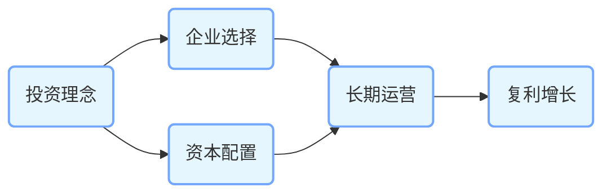

# 巴菲特的商业模式可扩展性分析

> 关键词：巴菲特、商业模式、可扩展性、价值投资、长期主义、资本配置、投资组合

> 摘要：本文旨在深入剖析巴菲特的商业模式及其可扩展性。通过对巴菲特投资理念、操作策略、资本运作等多方面的研究，探讨其商业模式在不同市场环境和时间维度下的扩展潜力与限制。首先介绍相关背景信息，包括研究目的、预期读者等；接着阐述核心概念与联系，呈现其商业模式的原理与架构；然后分析核心算法原理及操作步骤，用 Python 代码示例辅助理解；再从数学模型和公式角度深入讲解；通过项目实战案例详细解释代码实现与解读；探讨实际应用场景；推荐相关学习资源、开发工具及论文著作；最后总结未来发展趋势与挑战，并给出常见问题解答和参考资料，为全面理解和评估巴菲特商业模式的可扩展性提供深度分析和思考。

## 1. 背景介绍 
### 1.1 目的和范围
本研究的主要目的是全面、深入地分析巴菲特的商业模式，重点聚焦于其可扩展性。通过对巴菲特长期投资实践的研究，探讨其商业模式能否在不同规模、不同市场环境以及不同行业领域中进行复制和拓展。研究范围涵盖巴菲特投资理念的形成、伯克希尔·哈撒韦公司的运营模式、具体投资策略和资本配置方式等多个方面，旨在揭示其商业模式的本质特征以及可扩展性的内在逻辑和限制条件。

### 1.2 预期读者
本文预期读者包括金融投资领域的从业者，如基金经理、投资顾问、分析师等，他们可以从本文中获取对巴菲特商业模式的深入理解，为自身的投资决策和业务拓展提供参考。同时，对于对金融投资感兴趣的学者和研究人员，本文也提供了一个系统的分析框架和研究视角，有助于他们进一步开展相关学术研究。此外，广大的个人投资者也可以通过阅读本文，学习巴菲特的投资智慧，提升自身的投资素养。

### 1.3 文档结构概述
本文将按照以下结构展开：首先介绍研究的背景信息，包括目的、预期读者和文档结构概述等；接着阐述巴菲特商业模式的核心概念与联系，通过文本示意图和 Mermaid 流程图展示其原理和架构；然后详细讲解核心算法原理及具体操作步骤，结合 Python 源代码进行说明；再深入探讨相关的数学模型和公式，并举例说明；通过项目实战部分展示代码实际案例并进行详细解释；分析巴菲特商业模式的实际应用场景；推荐相关的学习资源、开发工具和论文著作；最后总结未来发展趋势与挑战，提供常见问题解答和参考资料。

### 1.4 术语表
#### 1.4.1 核心术语定义
- **价值投资**：一种投资策略，强调通过对公司内在价值的评估，寻找被市场低估的股票进行投资，以获取长期的资本增值。
- **长期主义**：在投资过程中，秉持长期投资的理念，忽略短期市场波动，追求长期的投资回报。
- **资本配置**：将资金分配到不同的资产或投资项目中，以实现风险分散和收益最大化的过程。
- **投资组合**：由多种不同的投资资产组成的集合，通过合理的资产配置来降低风险并提高收益。

#### 1.4.2 相关概念解释
- **护城河理论**：巴菲特提出的一个重要概念，指企业具有的一种可持续的竞争优势，使其能够在市场中抵御竞争对手的侵蚀，保持长期的盈利能力。例如，品牌优势、技术专利、成本优势等都可以构成企业的护城河。
- **内在价值**：企业在其存续期间所产生的未来现金流量的现值。内在价值是价值投资的核心概念，投资者通过评估企业的内在价值来判断其股票是否被低估或高估。

#### 1.4.3 缩略词列表
- **BRK**：伯克希尔·哈撒韦公司（Berkshire Hathaway）的股票代码。

## 2. 核心概念与联系 
巴菲特的商业模式核心基于价值投资理念，通过长期持有具有竞争优势的企业股权，实现资本的增值和复利增长。其商业模式的主要组成部分包括投资理念、企业选择、资本配置和长期运营等方面，这些部分相互关联、相互影响，共同构成了一个有机的整体。

### 核心概念原理和架构的文本示意图
巴菲特的商业模式可以用一个金字塔结构来表示。金字塔的底层是其投资理念，包括价值投资、长期主义和安全边际等原则，这些理念是整个商业模式的基石。中间层是企业选择和资本配置，通过对具有护城河的优质企业进行深入研究和筛选，将资本合理地分配到不同的投资项目中。金字塔的顶层是长期运营和复利增长，通过长期持有优质企业股权，享受企业成长带来的收益，并利用复利的力量实现资本的快速增长。

### Mermaid 流程图

这个流程图展示了巴菲特商业模式的主要环节及其逻辑关系。投资理念指导企业选择和资本配置，而企业选择和资本配置又为长期运营奠定基础，长期运营最终实现复利增长的目标。

## 3. 核心算法原理 & 具体操作步骤 
### 核心算法原理
巴菲特的投资决策主要基于对企业内在价值的评估。内在价值的评估通常采用现金流折现模型（DCF），该模型的基本思想是将企业未来的现金流量按照一定的折现率折现到当前时刻，得到企业的内在价值。

### 具体操作步骤
1. **预测企业未来现金流量**：通过对企业的财务报表、行业前景、竞争优势等方面的分析，预测企业未来若干年的自由现金流量。
2. **确定折现率**：折现率反映了投资者对投资风险的预期，通常采用加权平均资本成本（WACC）作为折现率。
3. **计算内在价值**：将预测的未来现金流量按照折现率折现到当前时刻，得到企业的内在价值。
4. **比较内在价值和市场价格**：如果企业的内在价值高于市场价格，则认为该股票被低估，具有投资价值；反之，则认为该股票被高估，不适合投资。

### Python 源代码示例
```python
import numpy as np

def dcf_valuation(free_cash_flows, discount_rate, growth_rate, terminal_year):
    """
    现金流折现模型计算企业内在价值
    :param free_cash_flows: 未来若干年的自由现金流量列表
    :param discount_rate: 折现率
    :param growth_rate: 长期增长率
    :param terminal_year: 预测的最后一年
    :return: 企业内在价值
    """
    present_values = []
    for i in range(len(free_cash_flows)):
        present_value = free_cash_flows[i] / (1 + discount_rate) ** (i + 1)
        present_values.append(present_value)
    
    # 计算终值
    terminal_value = free_cash_flows[-1] * (1 + growth_rate) / (discount_rate - growth_rate)
    terminal_present_value = terminal_value / (1 + discount_rate) ** terminal_year
    present_values.append(terminal_present_value)
    
    # 计算内在价值
    intrinsic_value = sum(present_values)
    return intrinsic_value

# 示例数据
free_cash_flows = [100, 120, 140, 160, 180]
discount_rate = 0.1
growth_rate = 0.03
terminal_year = 5

# 计算内在价值
intrinsic_value = dcf_valuation(free_cash_flows, discount_rate, growth_rate, terminal_year)
print(f"企业内在价值: {intrinsic_value}")
```
这段代码实现了现金流折现模型的基本计算过程。首先，将未来若干年的自由现金流量按照折现率折现到当前时刻，得到各年现金流量的现值。然后，计算企业的终值，并将其折现到当前时刻。最后，将所有现值相加，得到企业的内在价值。

## 4. 数学模型和公式 & 详细讲解 & 举例说明 
### 数学模型和公式
现金流折现模型的基本公式为：
$$
V = \sum_{t=1}^{n} \frac{FCF_t}{(1 + r)^t} + \frac{FCF_n \times (1 + g)}{(r - g) \times (1 + r)^n}
$$
其中：
- $V$ 表示企业的内在价值；
- $FCF_t$ 表示第 $t$ 年的自由现金流量；
- $r$ 表示折现率；
- $g$ 表示长期增长率；
- $n$ 表示预测的最后一年。

### 详细讲解
- **自由现金流量（FCF）**：指企业在满足了所有运营成本和资本支出后剩余的现金流量，它反映了企业实际可用于分配给投资者的现金。
- **折现率（r）**：是投资者要求的最低回报率，它考虑了投资的风险和机会成本。折现率越高，未来现金流量的现值越低。
- **长期增长率（g）**：是企业在长期内的预期增长率，通常基于行业的平均增长率和企业的竞争优势来确定。
- **终值**：公式中的 $\frac{FCF_n \times (1 + g)}{(r - g)}$ 表示企业在预测期结束后的终值，它假设企业在预测期结束后将以固定的增长率持续增长。

### 举例说明
假设某企业未来 5 年的自由现金流量分别为 100 万元、120 万元、140 万元、160 万元和 180 万元，折现率为 10%，长期增长率为 3%。则该企业的内在价值计算如下：

首先，计算前 5 年自由现金流量的现值：
- 第 1 年：$PV_1 = \frac{100}{(1 + 0.1)^1} = 90.91$（万元）
- 第 2 年：$PV_2 = \frac{120}{(1 + 0.1)^2} = 99.17$（万元）
- 第 3 年：$PV_3 = \frac{140}{(1 + 0.1)^3} = 105.19$（万元）
- 第 4 年：$PV_4 = \frac{160}{(1 + 0.1)^4} = 109.29$（万元）
- 第 5 年：$PV_5 = \frac{180}{(1 + 0.1)^5} = 111.77$（万元）

然后，计算终值：
$TV = \frac{180 \times (1 + 0.03)}{(0.1 - 0.03)} = 2657.14$（万元）
终值的现值：$PV_{TV} = \frac{2657.14}{(1 + 0.1)^5} = 1646.07$（万元）

最后，计算企业的内在价值：
$V = 90.91 + 99.17 + 105.19 + 109.29 + 111.77 + 1646.07 = 2162.39$（万元）

## 5. 项目实战：代码实际案例和详细解释说明 
### 5.1  开发环境搭建
为了运行上述 Python 代码，需要搭建相应的开发环境。以下是具体步骤：
1. **安装 Python**：从 Python 官方网站（https://www.python.org/downloads/）下载并安装 Python 3.x 版本。
2. **安装开发工具**：推荐使用 PyCharm 或 Jupyter Notebook 作为开发工具。可以从官方网站下载并安装相应的版本。
3. **安装必要的库**：代码中使用了 `numpy` 库，需要使用以下命令进行安装：
```sh
pip install numpy
```

### 5.2  源代码详细实现和代码解读
```python
import numpy as np

def dcf_valuation(free_cash_flows, discount_rate, growth_rate, terminal_year):
    """
    现金流折现模型计算企业内在价值
    :param free_cash_flows: 未来若干年的自由现金流量列表
    :param discount_rate: 折现率
    :param growth_rate: 长期增长率
    :param terminal_year: 预测的最后一年
    :return: 企业内在价值
    """
    present_values = []
    for i in range(len(free_cash_flows)):
        present_value = free_cash_flows[i] / (1 + discount_rate) ** (i + 1)
        present_values.append(present_value)
    
    # 计算终值
    terminal_value = free_cash_flows[-1] * (1 + growth_rate) / (discount_rate - growth_rate)
    terminal_present_value = terminal_value / (1 + discount_rate) ** terminal_year
    present_values.append(terminal_present_value)
    
    # 计算内在价值
    intrinsic_value = sum(present_values)
    return intrinsic_value

# 示例数据
free_cash_flows = [100, 120, 140, 160, 180]
discount_rate = 0.1
growth_rate = 0.03
terminal_year = 5

# 计算内在价值
intrinsic_value = dcf_valuation(free_cash_flows, discount_rate, growth_rate, terminal_year)
print(f"企业内在价值: {intrinsic_value}")
```
**代码解读**：
1. **导入库**：`import numpy as np` 导入 `numpy` 库，虽然在本代码中未直接使用，但在实际应用中可能会用于处理更复杂的数值计算。
2. **定义函数 `dcf_valuation`**：该函数接受四个参数：未来自由现金流量列表、折现率、长期增长率和预测的最后一年。函数内部首先计算前 $n$ 年自由现金流量的现值，然后计算终值及其现值，最后将所有现值相加得到企业的内在价值。
3. **示例数据**：定义了示例的自由现金流量列表、折现率、长期增长率和预测的最后一年。
4. **计算内在价值**：调用 `dcf_valuation` 函数计算企业的内在价值，并将结果打印输出。

### 5.3  代码解读与分析
这段代码实现了现金流折现模型的基本计算过程，通过将未来现金流量折现到当前时刻，得到企业的内在价值。在实际应用中，需要注意以下几点：
- **数据准确性**：未来自由现金流量、折现率和长期增长率的预测是模型的关键输入，需要进行充分的研究和分析，以确保数据的准确性。
- **模型局限性**：现金流折现模型假设企业的未来现金流量和增长率是稳定的，但实际情况可能并非如此。因此，在使用该模型时，需要结合其他分析方法进行综合判断。
- **敏感性分析**：可以对模型中的参数进行敏感性分析，了解不同参数变化对企业内在价值的影响，从而更好地评估投资风险。

## 6. 实际应用场景 
巴菲特的商业模式在多个领域都有实际应用场景，以下是一些主要的应用场景：
### 股票投资
在股票投资领域，巴菲特的价值投资理念被广泛应用。投资者通过分析企业的内在价值，寻找被市场低估的股票进行投资。例如，巴菲特对可口可乐、苹果等公司的投资，都是基于对这些公司内在价值的深入研究和评估。通过长期持有这些优质企业的股票，投资者可以分享企业成长带来的收益。

### 企业并购
在企业并购领域，巴菲特的商业模式也具有重要的指导意义。伯克希尔·哈撒韦公司通过并购具有竞争优势的企业，实现了业务的多元化和规模的扩张。在并购过程中，巴菲特注重企业的内在价值和护城河，选择具有长期发展潜力的企业进行投资。例如，伯克希尔·哈撒韦公司对伯灵顿北方圣太菲铁路公司的收购，就是基于对该公司在铁路运输领域的竞争优势和长期发展前景的看好。

### 私募股权投资
在私募股权投资领域，巴菲特的投资理念同样受到关注。私募股权投资机构通过寻找具有高成长潜力的企业进行投资，帮助企业实现快速发展，并在合适的时机退出，获取投资回报。巴菲特的长期主义和价值投资理念可以帮助私募股权投资机构更好地筛选投资项目，评估企业的价值和风险，提高投资成功率。

### 保险业务
伯克希尔·哈撒韦公司的保险业务是其商业模式的重要组成部分。通过保险业务，伯克希尔·哈撒韦公司可以获得大量的浮存金，这些浮存金可以用于投资其他项目。巴菲特利用其投资能力，将浮存金合理地配置到不同的资产中，实现了保险业务和投资业务的协同发展。例如，伯克希尔·哈撒韦公司旗下的 GEICO 保险公司，通过提供优质的保险产品和服务，吸引了大量的客户，为公司带来了稳定的浮存金来源。

## 7. 工具和资源推荐
### 7.1 学习资源推荐
#### 7.1.1 书籍推荐
- 《聪明的投资者》（The Intelligent Investor）：本杰明·格雷厄姆（Benjamin Graham）著，被誉为价值投资的圣经，详细阐述了价值投资的基本原理和方法。
- 《巴菲特致股东的信》（Letters to Shareholders of Berkshire Hathaway）：沃伦·巴菲特（Warren Buffett）著，收录了巴菲特多年来致股东的信，从中可以了解巴菲特的投资理念、决策过程和对市场的看法。
- 《穷查理宝典》（Poor Charlie's Almanack）：彼得·考夫曼（Peter D. Kaufman）编，介绍了查理·芒格（Charlie Munger）的智慧和投资理念，芒格是巴菲特的长期合作伙伴，他的思想对巴菲特的投资决策产生了重要影响。

#### 7.1.2 在线课程
- Coursera 平台上的“投资学原理”（Principles of Investing）课程，由知名教授授课，系统讲解投资学的基本原理和方法。
- edX 平台上的“金融市场”（Financial Markets）课程，由耶鲁大学教授罗伯特·席勒（Robert Shiller）主讲，深入探讨金融市场的运行机制和投资策略。

#### 7.1.3 技术博客和网站
- 伯克希尔·哈撒韦公司官方网站（https://www.berkshirehathaway.com/）：可以获取公司的年报、巴菲特致股东的信等重要信息。
- 价值投资论坛（https://www.valueinvestorsclub.com/）：一个价值投资者交流的平台，分享投资经验和研究成果。

### 7.2 开发工具框架推荐
#### 7.2.1 IDE和编辑器
- PyCharm：一款功能强大的 Python 集成开发环境，提供代码编辑、调试、版本控制等功能，适合专业开发者使用。
- Jupyter Notebook：一个交互式的开发环境，支持 Python、R 等多种编程语言，适合数据分析和快速原型开发。

#### 7.2.2 调试和性能分析工具
- `pdb`：Python 内置的调试工具，可以帮助开发者逐行调试代码，查找错误。
- `cProfile`：Python 内置的性能分析工具，可以分析代码的执行时间和函数调用次数，帮助开发者优化代码性能。

#### 7.2.3 相关框架和库
- `pandas`：一个用于数据处理和分析的 Python 库，提供了丰富的数据结构和数据分析工具。
- `matplotlib`：一个用于数据可视化的 Python 库，可以绘制各种类型的图表，帮助开发者更好地理解数据。

### 7.3 相关论文著作推荐
#### 7.3.1 经典论文
- 《证券分析》（Security Analysis）：本杰明·格雷厄姆和戴维·多德（David Dodd）著，是价值投资领域的经典著作，提出了证券分析的基本方法和原则。
- 《有效市场假说》（Efficient Markets Hypothesis）：尤金·法玛（Eugene F. Fama）提出，探讨了市场效率和股票价格的形成机制。

#### 7.3.2 最新研究成果
- 近年来，学术界对巴菲特的投资策略和商业模式进行了大量的研究。可以通过学术数据库，如 Web of Science、EBSCOhost 等，查找相关的最新研究论文。

#### 7.3.3 应用案例分析
- 一些商业杂志和金融媒体会对巴菲特的投资案例进行深入分析和报道。例如，《福布斯》（Forbes）、《巴伦周刊》（Barron's）等，这些案例分析可以帮助读者更好地理解巴菲特的投资决策过程和商业模式。

## 8. 总结：未来发展趋势与挑战
### 未来发展趋势
- **数字化转型**：随着科技的不断发展，金融行业正面临着数字化转型的趋势。巴菲特的商业模式也可能会受到数字化的影响，例如利用大数据和人工智能技术进行企业分析和投资决策，提高投资效率和准确性。
- **可持续投资**：越来越多的投资者开始关注企业的社会责任和可持续发展。未来，巴菲特的商业模式可能会更加注重企业的环境、社会和治理（ESG）因素，将可持续投资纳入投资决策的考虑范围。
- **全球多元化投资**：随着全球经济的一体化，巴菲特的投资范围可能会进一步扩大，实现全球多元化投资。通过投资不同国家和地区的优质企业，分散投资风险，获取更广泛的投资机会。

### 挑战
- **市场环境变化**：金融市场环境复杂多变，未来可能会面临各种不确定性，如经济衰退、通货膨胀、利率波动等。这些因素可能会对巴菲特的投资组合和商业模式产生影响，增加投资风险。
- **竞争加剧**：随着价值投资理念的普及，越来越多的投资者开始采用类似的投资策略，市场竞争加剧。巴菲特需要不断创新和优化其商业模式，以保持竞争优势。
- **传承问题**：巴菲特已经年事已高，伯克希尔·哈撒韦公司的传承问题是一个重要的挑战。如何确保公司的文化和商业模式能够得到延续，是公司未来发展面临的关键问题。

## 9. 附录：常见问题与解答
### 1. 巴菲特的商业模式是否适用于所有投资者？
巴菲特的商业模式基于价值投资理念和长期主义，需要投资者具备深入的企业分析能力和长期投资的耐心。对于一些短期投机者或缺乏专业知识的投资者来说，可能并不适用。但对于那些追求长期稳定回报、愿意深入研究企业的投资者来说，巴菲特的商业模式具有重要的借鉴意义。

### 2. 如何评估企业的内在价值？
评估企业的内在价值是一个复杂的过程，需要综合考虑多个因素。常用的方法包括现金流折现模型、相对估值法等。在评估过程中，需要对企业的财务报表、行业前景、竞争优势等进行深入分析，同时还需要考虑宏观经济环境和市场情绪等因素的影响。

### 3. 巴菲特的投资策略是否会随着市场环境的变化而调整？
巴菲特的投资理念和基本原则是相对稳定的，但他的投资策略也会根据市场环境的变化进行适当调整。例如，在不同的经济周期和市场阶段，他会调整投资组合的结构和资产配置比例，以适应市场变化，降低投资风险。

### 4. 伯克希尔·哈撒韦公司的保险业务对其投资业务有何影响？
伯克希尔·哈撒韦公司的保险业务为其投资业务提供了重要的资金来源。通过保险业务获得的浮存金可以用于投资其他项目，实现资金的增值。同时，保险业务的稳定性也为投资业务提供了一定的保障，降低了投资风险。

## 10. 扩展阅读 & 参考资料
### 扩展阅读
- 《滚雪球：巴菲特和他的财富人生》（The Snowball: Warren Buffett and the Business of Life）：爱丽丝·施罗德（Alice Schroeder）著，详细讲述了巴菲特的人生经历和投资生涯。
- 《投资最重要的事》（The Most Important Thing Illuminated）：霍华德·马克斯（Howard Marks）著，分享了投资中的重要原则和经验教训。

### 参考资料
- Berkshire Hathaway Annual Reports.
- Warren Buffett's Letters to Shareholders.
- Academic papers on value investing and Warren Buffett's investment strategy.