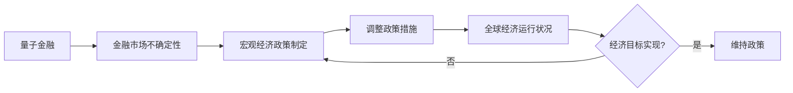

# 巴菲特的宏观经济视角：量子金融对全球经济政策的影响

> 关键词：巴菲特、宏观经济视角、量子金融、全球经济政策、金融影响

> 摘要：本文深入探讨了巴菲特的宏观经济视角下，量子金融对全球经济政策所产生的影响。从背景介绍入手，阐述了研究的目的、范围、预期读者等内容。接着详细解析了核心概念，包括量子金融和宏观经济政策的原理与联系，并给出了相应的示意图和流程图。对核心算法原理进行讲解，结合 Python 代码展示具体操作步骤。通过数学模型和公式深入剖析其中的经济逻辑，并举例说明。在项目实战部分，搭建开发环境，给出实际代码案例并进行详细解读。探讨了量子金融在实际中的应用场景，推荐了相关的学习资源、开发工具框架以及论文著作。最后总结了未来发展趋势与挑战，提供常见问题解答和扩展阅读参考资料，旨在为读者全面呈现量子金融在全球经济政策领域的多维度影响。

## 1. 背景介绍 
### 1.1 目的和范围
本研究旨在从巴菲特独特的宏观经济视角出发，全面剖析量子金融对全球经济政策的影响。巴菲特作为全球投资界的传奇人物，其宏观经济观点具有重要的参考价值。量子金融作为新兴的金融理论与实践领域，正在逐渐改变传统金融格局。本研究将探讨量子金融在理论层面如何影响经济政策的制定逻辑，以及在实践中如何改变全球经济政策的实施方向和效果。研究范围涵盖全球主要经济体的经济政策，包括货币政策、财政政策、产业政策等，同时分析量子金融在不同经济发展阶段和不同经济体制下的影响差异。

### 1.2 预期读者
本文预期读者包括金融从业者，如银行家、投资经理、分析师等，他们可以从本文中了解量子金融对金融市场和经济政策的影响，为投资决策和风险管理提供参考。经济政策制定者，包括政府官员、央行工作人员等，能够通过本文认识到量子金融带来的新挑战和机遇，从而优化经济政策的制定。学术研究人员可以将本文作为研究量子金融和宏观经济关系的参考资料，进一步深入探讨相关理论和实证问题。此外，对宏观经济和金融市场感兴趣的普通投资者和爱好者也可以通过本文了解量子金融的基本概念和对全球经济政策的影响。

### 1.3 文档结构概述
本文共分为十个部分。第一部分为背景介绍，阐述研究的目的、范围、预期读者和文档结构概述，并给出术语表。第二部分介绍核心概念与联系，解释量子金融和宏观经济政策的原理，展示它们之间的关系示意图和流程图。第三部分讲解核心算法原理和具体操作步骤，使用 Python 代码详细阐述。第四部分给出数学模型和公式，详细讲解其含义并举例说明。第五部分进行项目实战，包括开发环境搭建、源代码实现和代码解读。第六部分探讨实际应用场景。第七部分推荐学习资源、开发工具框架和相关论文著作。第八部分总结未来发展趋势与挑战。第九部分为附录，解答常见问题。第十部分提供扩展阅读和参考资料。

### 1.4 术语表
#### 1.4.1 核心术语定义
- **巴菲特的宏观经济视角**：指巴菲特基于其丰富的投资经验和对全球经济的深刻理解，形成的对宏观经济形势、经济政策和市场趋势的独特观点和分析方法。
- **量子金融**：是将量子力学的概念、理论和方法应用于金融领域的新兴交叉学科。它试图解释金融市场中的一些复杂现象，如市场的不确定性、资产价格的波动等，并提供新的金融分析和决策工具。
- **全球经济政策**：是指世界各国政府为了实现一定的经济目标，如经济增长、稳定物价、充分就业、国际收支平衡等，而制定和实施的一系列政策措施，包括货币政策、财政政策、产业政策等。

#### 1.4.2 相关概念解释
- **货币政策**：是指中央银行为实现特定的经济目标，如稳定物价、促进经济增长、实现充分就业等，而对货币供应量和信贷量进行调节和控制所采取的政策措施。常见的货币政策工具包括调整利率、法定准备金率、公开市场操作等。
- **财政政策**：是指政府通过调整财政收支规模和结构，以实现经济稳定增长、调节收入分配等目标的政策。财政政策的主要手段包括税收政策、政府支出政策等。
- **产业政策**：是指政府为了促进产业结构优化升级、提高产业竞争力而制定的一系列政策措施，包括产业规划、产业扶持、产业限制等。

#### 1.4.3 缩略词列表
- **GDP**：国内生产总值（Gross Domestic Product），是指一个国家（或地区）所有常住单位在一定时期内生产活动的最终成果，是衡量一个国家经济状况和发展水平的重要指标。
- **CPI**：消费者物价指数（Consumer Price Index），是反映居民家庭一般所购买的消费品和服务项目价格水平变动情况的宏观经济指标。
- **FED**：美国联邦储备系统（Federal Reserve System），简称美联储，是美国的中央银行，负责制定和执行货币政策。

## 2. 核心概念与联系 
### 2.1 量子金融原理
量子金融的核心在于将量子力学的一些特性引入金融领域。在量子力学中，粒子具有不确定性，其状态不能被精确测量，而是以概率的形式存在。在金融市场中，资产价格、投资者行为等也具有很大的不确定性。量子金融认为，金融市场中的信息传播和投资者决策过程类似于量子系统中的粒子相互作用。例如，投资者的决策可能受到多种因素的影响，这些因素之间的关系是复杂且不确定的，就像量子粒子之间的纠缠关系。

### 2.2 宏观经济政策原理
宏观经济政策的目标是实现经济的稳定增长、充分就业、物价稳定和国际收支平衡。货币政策通过调节货币供应量和利率来影响经济活动。当经济衰退时，中央银行可以降低利率、增加货币供应量，刺激投资和消费；当经济过热时，中央银行可以提高利率、减少货币供应量，抑制通货膨胀。财政政策则通过政府支出和税收来调节经济。政府增加支出可以直接拉动经济增长，减少税收可以增加居民和企业的可支配收入，促进消费和投资。

### 2.3 量子金融与宏观经济政策的联系
量子金融的不确定性和复杂性对宏观经济政策的制定和实施带来了新的挑战。传统的宏观经济政策模型往往基于确定性的假设，难以准确描述金融市场的复杂动态。量子金融的引入可以帮助政策制定者更好地理解金融市场的不确定性，从而制定更加灵活和有效的经济政策。例如，在制定货币政策时，考虑到金融市场的量子特性，政策制定者可以更加谨慎地调整利率和货币供应量，以避免引发市场的过度波动。

### 2.4 文本示意图
```plaintext
         量子金融
           |
           |  影响金融市场不确定性
           |
    宏观经济政策制定
           |
           |  调整政策措施
           |
    全球经济运行状况
```

### 2.5 Mermaid 流程图


## 3. 核心算法原理 & 具体操作步骤 
### 3.1 量子金融中的概率模型
在量子金融中，我们可以使用概率模型来描述资产价格的波动。假设资产价格的变化服从某种概率分布，例如正态分布。我们可以使用 Python 来模拟资产价格的波动。

```python
import numpy as np
import matplotlib.pyplot as plt

# 模拟参数
num_simulations = 1000  # 模拟次数
num_periods = 252  # 交易周期数
initial_price = 100  # 初始资产价格
mu = 0.1  # 预期收益率
sigma = 0.2  # 波动率

# 模拟资产价格路径
price_paths = np.zeros((num_simulations, num_periods))
price_paths[:, 0] = initial_price

for i in range(num_simulations):
    for t in range(1, num_periods):
        # 生成随机收益率
        random_return = np.random.normal(mu / num_periods, sigma / np.sqrt(num_periods))
        # 计算下一期价格
        price_paths[i, t] = price_paths[i, t - 1] * (1 + random_return)

# 绘制资产价格路径
plt.figure(figsize=(10, 6))
for i in range(num_simulations):
    plt.plot(price_paths[i, :], label=f'Simulation {i + 1}' if i < 5 else "")
plt.title('Simulated Asset Price Paths')
plt.xlabel('Time (Days)')
plt.ylabel('Asset Price')
plt.legend()
plt.show()
```

### 3.2 算法原理讲解
上述代码使用蒙特卡罗模拟方法来模拟资产价格的波动。蒙特卡罗模拟是一种基于随机抽样的数值计算方法，通过多次模拟来估计资产价格的可能分布。在每次模拟中，我们根据正态分布生成随机收益率，然后根据当前资产价格和随机收益率计算下一期的资产价格。重复这个过程，直到模拟结束。最后，我们绘制出所有模拟的资产价格路径，直观地展示资产价格的不确定性。

### 3.3 具体操作步骤
1. **参数设置**：设置模拟次数、交易周期数、初始资产价格、预期收益率和波动率等参数。
2. **初始化价格矩阵**：创建一个二维数组来存储所有模拟的资产价格路径，并将初始价格赋值给第一列。
3. **循环模拟**：对于每一次模拟，从第二个周期开始，根据正态分布生成随机收益率，计算下一期的资产价格，并将其存储在价格矩阵中。
4. **绘制图形**：使用 matplotlib 库绘制所有模拟的资产价格路径，以便直观观察资产价格的波动情况。

## 4. 数学模型和公式 & 详细讲解 & 举例说明 
### 4.1 几何布朗运动模型
在金融领域，几何布朗运动（Geometric Brownian Motion，GBM）是一种常用的模型来描述资产价格的动态变化。其数学公式为：

$$dS_t = \mu S_t dt+\sigma S_t dW_t$$

其中：
- $S_t$ 表示资产在时间 $t$ 的价格。
- $\mu$ 是资产的预期收益率。
- $\sigma$ 是资产价格的波动率。
- $dW_t$ 是维纳过程（Wiener process）的增量，满足 $dW_t=\epsilon\sqrt{dt}$，其中 $\epsilon$ 是标准正态分布的随机变量。

### 4.2 公式详细讲解
这个公式描述了资产价格的微小变化 $dS_t$ 由两部分组成。第一部分 $\mu S_t dt$ 表示资产价格的确定性增长部分，它与资产的预期收益率 $\mu$、当前价格 $S_t$ 和时间间隔 $dt$ 成正比。第二部分 $\sigma S_t dW_t$ 表示资产价格的随机波动部分，它与资产的波动率 $\sigma$、当前价格 $S_t$ 和维纳过程的增量 $dW_t$ 成正比。维纳过程的增量 $dW_t$ 是一个随机变量，它反映了市场的不确定性。

### 4.3 离散化公式
为了在计算机上进行模拟，我们需要将连续时间的几何布朗运动模型离散化。离散化后的公式为：

$$S_{t + \Delta t}=S_t\exp\left[\left(\mu-\frac{\sigma^2}{2}\right)\Delta t+\sigma\epsilon\sqrt{\Delta t}\right]$$

其中 $\Delta t$ 是时间间隔，$\epsilon$ 是标准正态分布的随机变量。

### 4.4 举例说明
假设某股票的初始价格 $S_0 = 100$，预期收益率 $\mu = 0.1$，波动率 $\sigma = 0.2$，时间间隔 $\Delta t = 1$ 天。我们可以使用离散化公式来计算下一天的股票价格。

```python
import numpy as np

S0 = 100
mu = 0.1
sigma = 0.2
dt = 1
epsilon = np.random.normal(0, 1)

S1 = S0 * np.exp((mu - 0.5 * sigma**2) * dt + sigma * epsilon * np.sqrt(dt))
print(f"下一天的股票价格: {S1}")
```

在这个例子中，我们通过随机生成一个标准正态分布的随机变量 $\epsilon$，然后使用离散化公式计算下一天的股票价格。由于 $\epsilon$ 是随机的，每次运行代码得到的结果可能不同，这反映了股票价格的不确定性。

## 5. 项目实战：代码实际案例和详细解释说明 
### 5.1  开发环境搭建
#### 5.1.1 安装 Python
首先，需要安装 Python 编程语言。可以从 Python 官方网站（https://www.python.org/downloads/）下载适合自己操作系统的 Python 版本，并按照安装向导进行安装。建议安装 Python 3.7 及以上版本。

#### 5.1.2 安装必要的库
本项目需要使用一些 Python 库，如 numpy、matplotlib 等。可以使用以下命令来安装这些库：

```sh
pip install numpy matplotlib
```

### 5.2  源代码详细实现和代码解读
```python
import numpy as np
import matplotlib.pyplot as plt

# 模拟参数
num_simulations = 1000  # 模拟次数
num_periods = 252  # 交易周期数
initial_price = 100  # 初始资产价格
mu = 0.1  # 预期收益率
sigma = 0.2  # 波动率
dt = 1 / num_periods  # 时间间隔

# 初始化价格矩阵
price_paths = np.zeros((num_simulations, num_periods))
price_paths[:, 0] = initial_price

# 循环模拟
for i in range(num_simulations):
    for t in range(1, num_periods):
        # 生成标准正态分布的随机变量
        epsilon = np.random.normal(0, 1)
        # 使用离散化公式计算下一期价格
        price_paths[i, t] = price_paths[i, t - 1] * np.exp((mu - 0.5 * sigma**2) * dt + sigma * epsilon * np.sqrt(dt))

# 计算平均价格路径
average_path = np.mean(price_paths, axis=0)

# 绘制资产价格路径
plt.figure(figsize=(10, 6))
for i in range(num_simulations):
    plt.plot(price_paths[i, :], label=f'Simulation {i + 1}' if i < 5 else "")
plt.plot(average_path, label='Average Path', color='black', linewidth=2)
plt.title('Simulated Asset Price Paths')
plt.xlabel('Time (Days)')
plt.ylabel('Asset Price')
plt.legend()
plt.show()
```

### 5.3  代码解读与分析
#### 5.3.1 参数设置
- `num_simulations`：模拟的次数，即生成多少条资产价格路径。
- `num_periods`：交易周期数，通常表示一年的交易天数。
- `initial_price`：资产的初始价格。
- `mu`：资产的预期收益率。
- `sigma`：资产价格的波动率。
- `dt`：时间间隔，等于 1 除以交易周期数。

#### 5.3.2 初始化价格矩阵
使用 `np.zeros` 函数创建一个二维数组 `price_paths`，用于存储所有模拟的资产价格路径。将初始价格赋值给第一列。

#### 5.3.3 循环模拟
使用两层循环来模拟资产价格的变化。外层循环控制模拟次数，内层循环控制交易周期数。在每次循环中，生成一个标准正态分布的随机变量 $\epsilon$，然后使用离散化公式计算下一期的资产价格。

#### 5.3.4 计算平均价格路径
使用 `np.mean` 函数计算所有模拟路径的平均价格路径。

#### 5.3.5 绘制图形
使用 `matplotlib` 库绘制所有模拟的资产价格路径和平均价格路径。通过图形可以直观地观察资产价格的波动情况和平均趋势。

## 6. 实际应用场景 
### 6.1 货币政策制定
在制定货币政策时，央行需要考虑金融市场的不确定性。量子金融的概率模型可以帮助央行更好地估计资产价格的波动范围，从而更准确地评估货币政策对金融市场的影响。例如，在调整利率时，央行可以使用量子金融模型来预测不同利率水平下资产价格的变化，以及对经济增长、通货膨胀等目标的影响，从而制定更加合理的货币政策。

### 6.2 财政政策调整
政府在制定财政政策时，也需要考虑金融市场的动态变化。量子金融可以为政府提供有关投资者行为和市场预期的信息，帮助政府更好地评估财政政策的效果。例如，在实施税收政策或政府支出政策时，政府可以使用量子金融模型来分析政策对投资者信心和市场流动性的影响，从而优化财政政策的实施。

### 6.3 风险管理
金融机构在进行风险管理时，可以利用量子金融的方法来评估资产组合的风险。传统的风险管理方法往往基于历史数据和线性模型，难以准确捕捉金融市场的非线性和不确定性。量子金融的概率模型可以更全面地考虑市场的各种可能性，帮助金融机构更好地识别和管理风险。例如，银行在进行信贷风险管理时，可以使用量子金融模型来评估借款人的违约概率和信用风险。

### 6.4 投资决策
投资者在进行投资决策时，需要考虑市场的不确定性和资产价格的波动。量子金融的模型可以为投资者提供更准确的市场预测和风险评估，帮助投资者做出更明智的投资决策。例如，投资者可以使用量子金融模型来分析不同资产的预期收益率和风险，从而优化资产配置。

## 7. 工具和资源推荐
### 7.1 学习资源推荐
#### 7.1.1 书籍推荐
- 《量子金融导论》：这本书系统地介绍了量子金融的基本概念、理论和方法，是学习量子金融的入门佳作。
- 《宏观经济学》：经典的宏观经济学教材，详细讲解了宏观经济政策的原理和实践，有助于理解量子金融与宏观经济政策的关系。
- 《金融数学》：涵盖了金融领域的数学模型和方法，对于理解量子金融中的数学原理有很大帮助。

#### 7.1.2 在线课程
- Coursera 上的“Quantum Finance”课程：由知名教授授课，深入讲解量子金融的前沿知识和应用。
- edX 上的“Macroeconomics Principles”课程：帮助学习者掌握宏观经济政策的基本原理和分析方法。
- Udemy 上的“Financial Mathematics for Beginners”课程：适合初学者学习金融数学的基础知识。

#### 7.1.3 技术博客和网站
- Quantum Finance Journal：专门发表量子金融领域的研究论文和最新动态的网站。
- Financial Times：提供全球金融市场和经济政策的最新资讯和分析。
- Seeking Alpha：投资者交流和分享投资观点的平台，有很多关于宏观经济和金融市场的深度分析文章。

### 7.2 开发工具框架推荐
#### 7.2.1 IDE和编辑器
- PyCharm：功能强大的 Python 集成开发环境，提供代码编辑、调试、版本控制等功能，适合开发量子金融相关的 Python 代码。
- Jupyter Notebook：交互式的开发环境，方便进行数据探索、模型验证和代码演示，常用于金融数据分析和模拟。

#### 7.2.2 调试和性能分析工具
- Py-Spy：用于分析 Python 代码的性能瓶颈，帮助优化代码运行效率。
- PDB：Python 内置的调试器，可以在代码中设置断点，逐步调试代码，找出问题所在。

#### 7.2.3 相关框架和库
- NumPy：Python 中用于科学计算的基础库，提供了高效的数组操作和数学函数，在量子金融的数值计算中广泛应用。
- Pandas：用于数据处理和分析的库，提供了数据结构和数据操作方法，方便处理金融数据。
- Matplotlib：用于绘制图形和可视化数据的库，可用于展示资产价格路径、风险分析结果等。

### 7.3 相关论文著作推荐
#### 7.3.1 经典论文
- "Quantum Finance: A New Paradigm for Financial Modeling"：该论文首次提出了量子金融的概念和基本框架，对后续的研究产生了重要影响。
- "Macroeconomic Policy and Financial Stability"：探讨了宏观经济政策与金融稳定之间的关系，为理解量子金融对经济政策的影响提供了理论基础。

#### 7.3.2 最新研究成果
- "Quantum Machine Learning in Financial Risk Management"：研究了量子机器学习在金融风险管理中的应用，展示了量子技术在金融领域的最新进展。
- "The Impact of Quantum Finance on Global Economic Policy"：分析了量子金融对全球经济政策的具体影响和挑战，是该领域的前沿研究成果。

#### 7.3.3 应用案例分析
- "Case Studies in Quantum Finance: Real-World Applications"：通过实际案例分析，展示了量子金融在投资决策、风险管理等方面的应用效果。
- "How Quantum Finance Influences Central Bank Policy-Making"：以央行的政策制定为例，分析了量子金融在实际经济政策中的应用和影响。

## 8. 总结：未来发展趋势与挑战
### 8.1 未来发展趋势
#### 8.1.1 理论与实践的融合
未来，量子金融将更加注重理论与实践的结合。一方面，学者们将继续深入研究量子金融的理论基础，完善相关的数学模型和算法；另一方面，金融机构和政策制定者将积极探索量子金融在实际业务和政策制定中的应用，通过实践不断验证和改进理论。

#### 8.1.2 跨学科研究的加强
量子金融是一个跨学科的领域，涉及量子力学、金融学、数学、计算机科学等多个学科。未来，跨学科研究将进一步加强，不同学科的专家将共同合作，推动量子金融的发展。例如，量子物理学家和金融学家将共同研究如何将量子算法应用于金融市场分析，计算机科学家将开发更高效的量子计算软件和硬件来支持量子金融的研究和应用。

#### 8.1.3 与新技术的融合
量子金融将与其他新兴技术，如人工智能、区块链等深度融合。人工智能可以帮助处理和分析量子金融模型中的大量数据，提高模型的准确性和效率；区块链技术可以为量子金融提供安全、透明的交易环境，促进金融市场的创新和发展。

### 8.2 挑战
#### 8.2.1 技术难题
量子计算技术目前仍处于发展阶段，存在着量子比特的稳定性、量子噪声等技术难题。这些技术问题限制了量子金融模型的实际应用。未来需要进一步提高量子计算的性能和可靠性，以支持更复杂的量子金融模型的运行。

#### 8.2.2 数据质量和隐私问题
量子金融模型需要大量的高质量数据来进行训练和验证。然而，金融数据往往存在着数据缺失、数据噪声等问题，影响了模型的准确性。此外，金融数据涉及到大量的个人隐私和商业机密，如何在保护数据隐私的前提下，充分利用数据进行量子金融研究和应用，是一个亟待解决的问题。

#### 8.2.3 政策和监管挑战
量子金融的发展可能会带来新的金融风险和监管挑战。由于量子金融模型的复杂性和不确定性，传统的金融监管方法可能难以有效应对。政策制定者需要制定新的监管政策和法规，以确保量子金融的健康发展，保护投资者的利益和金融市场的稳定。

## 9. 附录：常见问题与解答
### 9.1 量子金融与传统金融有什么区别？
量子金融与传统金融的主要区别在于对不确定性的处理方式。传统金融通常基于确定性的模型和假设，难以准确描述金融市场的复杂动态和不确定性。而量子金融引入了量子力学的概念和方法，将金融市场中的不确定性视为一种本质特征，使用概率模型来描述资产价格的波动和投资者的行为。

### 9.2 量子金融对普通投资者有什么影响？
对于普通投资者来说，量子金融可以提供更准确的市场预测和风险评估，帮助投资者做出更明智的投资决策。例如，量子金融模型可以帮助投资者更好地理解资产价格的波动范围和风险水平，从而优化资产配置。此外，量子金融的发展也可能带来新的投资机会，如量子计算相关的金融科技公司的投资。

### 9.3 学习量子金融需要具备哪些知识？
学习量子金融需要具备一定的数学、物理和金融知识。数学方面，需要掌握概率论、数理统计、微积分等基础知识；物理方面，需要了解量子力学的基本概念和原理；金融方面，需要熟悉金融市场的基本理论和交易机制。此外，还需要具备一定的编程能力，能够使用 Python 等编程语言进行数值计算和模型实现。

### 9.4 量子金融会取代传统金融吗？
量子金融不会取代传统金融，而是对传统金融的补充和拓展。传统金融经过长期的发展，已经形成了一套成熟的理论和实践体系，在金融市场中仍然发挥着重要作用。量子金融作为新兴的领域，为解决金融市场中的一些复杂问题提供了新的思路和方法。未来，两者将相互融合、相互促进，共同推动金融行业的发展。

## 10. 扩展阅读 & 参考资料
### 10.1 扩展阅读
- 《量子计算与金融创新》：深入探讨了量子计算技术在金融领域的应用和创新，为读者提供了更广阔的视野。
- 《金融市场的复杂性与不确定性》：分析了金融市场的复杂特性和不确定性来源，有助于读者更好地理解量子金融的背景和意义。

### 10.2 参考资料
- 相关学术期刊，如《Journal of Financial Economics》、《Review of Financial Studies》等，发表了大量关于金融理论和实践的研究论文，是获取最新研究成果的重要来源。
- 国际金融机构的报告，如国际货币基金组织（IMF）、世界银行等发布的报告，提供了全球经济和金融市场的宏观数据和分析。
- 各国央行的货币政策报告和研究论文，有助于了解宏观经济政策的制定和实施情况。