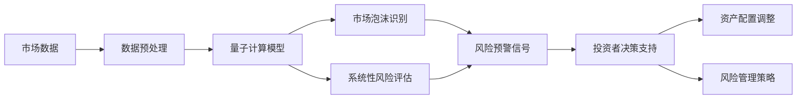

# 巴菲特的市场泡沫识别：量子计算驱动的系统性风险预警

> 关键词：巴菲特、市场泡沫识别、量子计算、系统性风险预警、金融市场分析

> 摘要：本文聚焦于利用量子计算技术助力实现如巴菲特式的市场泡沫识别以及系统性风险预警。深入探讨了市场泡沫和系统性风险的核心概念，详细阐述量子计算在其中的算法原理、数学模型。通过实际案例展示了量子计算在金融市场分析中的应用，同时推荐了相关的学习资源、开发工具和研究论文。最后总结了该领域未来的发展趋势与挑战，并对常见问题进行解答，为金融科技领域的研究者和从业者提供全面的参考。

## 1. 背景介绍 
### 1.1 目的和范围
在金融市场中，市场泡沫的形成与破裂以及系统性风险的爆发往往会带来巨大的经济损失。巴菲特以其卓越的投资智慧和对市场泡沫的敏锐洞察力而闻名。本研究的目的在于借助量子计算这一前沿技术，实现类似巴菲特式的市场泡沫识别和系统性风险预警。范围涵盖金融市场的主要资产类别，包括股票、债券、大宗商品等，旨在为投资者和监管机构提供更精准、高效的风险预警工具。

### 1.2 预期读者
本文预期读者包括金融领域的投资者、分析师、监管机构工作人员，以及计算机科学领域对量子计算在金融应用感兴趣的研究者和开发者。通过阅读本文，读者能够了解量子计算在金融市场风险预警中的原理、方法和实际应用。

### 1.3 文档结构概述
本文首先介绍背景知识，包括目的、预期读者和文档结构。接着阐述核心概念，如市场泡沫、系统性风险和量子计算，并展示它们之间的联系。然后详细讲解核心算法原理、数学模型和具体操作步骤，通过Python代码进行示例。随后给出项目实战案例，包括开发环境搭建、源代码实现和代码解读。再探讨实际应用场景，推荐相关的工具和资源。最后总结未来发展趋势与挑战，解答常见问题并提供扩展阅读和参考资料。

### 1.4 术语表
#### 1.4.1 核心术语定义
- **市场泡沫**：指资产价格显著高于其内在价值的现象，通常是由于投资者的过度乐观和投机行为导致。
- **系统性风险**：指整个金融体系面临的风险，可能导致金融市场的崩溃和经济衰退。
- **量子计算**：利用量子力学原理进行计算的新型计算模式，具有强大的并行计算能力。
- **风险预警**：通过对市场数据的分析和监测，提前发现潜在的风险并发出警报。

#### 1.4.2 相关概念解释
- **内在价值**：资产的真实价值，通常基于其未来现金流的折现计算。
- **量子比特**：量子计算中的基本信息单元，类似于经典计算中的比特。
- **量子纠缠**：量子比特之间的一种特殊关联，使得它们的状态相互依赖。
- **蒙特卡罗模拟**：一种通过随机抽样来估计复杂系统行为的统计方法。

#### 1.4.3 缩略词列表
- **QC**：Quantum Computing（量子计算）
- **MC**：Monte Carlo（蒙特卡罗）
- **VAR**：Value at Risk（风险价值）

## 2. 核心概念与联系 

### 核心概念原理
#### 市场泡沫
市场泡沫的形成通常是由于投资者的非理性行为和市场的信息不对称。当投资者对某项资产的未来收益过于乐观时，会大量买入该资产，导致其价格不断上涨，远远超过其内在价值。这种价格的虚高是不可持续的，一旦市场情绪发生转变，泡沫就会破裂，资产价格会大幅下跌。

#### 系统性风险
系统性风险是由宏观经济因素、政策变化、金融市场结构等多种因素共同作用引起的。它具有传染性和普遍性，会影响整个金融体系的稳定性。例如，2008年的全球金融危机就是由美国次贷危机引发的系统性风险，导致全球金融市场崩溃和经济衰退。

#### 量子计算
量子计算利用量子比特的叠加和纠缠特性，能够在极短的时间内处理大量的计算任务。与经典计算相比，量子计算具有指数级的计算速度优势，能够解决一些经典计算难以处理的复杂问题。在金融市场分析中，量子计算可以用于快速计算资产的内在价值、评估市场风险等。

### 架构的文本示意图
```plaintext
               市场数据
                   |
                   v
            数据预处理
                   |
                   v
      ┌─────────────────────┐
      │  量子计算模型       │
      │  - 市场泡沫识别     │
      │  - 系统性风险评估  │
      └─────────────────────┘
                   |
                   v
            风险预警信号
                   |
                   v
      ┌─────────────────────┐
      │  投资者决策支持    │
      │  - 资产配置调整    │
      │  - 风险管理策略    │
      └─────────────────────┘
```

### Mermaid流程图


## 3. 核心算法原理 & 具体操作步骤 

### 算法原理
我们采用量子蒙特卡罗模拟算法来评估市场泡沫和系统性风险。量子蒙特卡罗模拟利用量子计算的并行性，能够快速生成大量的随机样本，从而更准确地估计资产价格的分布和风险。

### Python源代码示例
```python
import numpy as np
from qiskit import QuantumCircuit, Aer, execute

# 定义量子蒙特卡罗模拟函数
def quantum_monte_carlo(num_qubits, num_samples):
    # 创建量子电路
    qc = QuantumCircuit(num_qubits, num_qubits)
    # 应用Hadamard门实现叠加态
    for qubit in range(num_qubits):
        qc.h(qubit)
    # 测量量子比特
    qc.measure(range(num_qubits), range(num_qubits))

    # 模拟量子电路
    simulator = Aer.get_backend('qasm_simulator')
    job = execute(qc, simulator, shots=num_samples)
    result = job.result()
    counts = result.get_counts(qc)

    # 将测量结果转换为二进制数组
    samples = []
    for key, value in counts.items():
        binary_str = key.zfill(num_qubits)
        sample = [int(bit) for bit in binary_str]
        samples.extend([sample] * value)

    return np.array(samples)

# 示例参数
num_qubits = 3
num_samples = 1000

# 运行量子蒙特卡罗模拟
samples = quantum_monte_carlo(num_qubits, num_samples)
print("模拟结果：", samples)
```

### 具体操作步骤
1. **数据准备**：收集金融市场的历史数据，包括资产价格、交易量、宏观经济指标等。
2. **数据预处理**：对数据进行清洗、归一化等处理，以便后续的计算。
3. **量子电路设计**：根据问题的特点设计量子电路，实现量子蒙特卡罗模拟。
4. **量子计算模拟**：使用量子模拟器或实际的量子计算机运行量子电路，生成随机样本。
5. **数据分析**：对生成的样本进行分析，计算资产价格的分布和风险指标，如风险价值（VAR）。
6. **风险预警**：根据计算结果判断市场是否存在泡沫和系统性风险，并发出相应的预警信号。

## 4. 数学模型和公式 & 详细讲解 & 举例说明 

### 数学模型
我们使用风险价值（VAR）作为衡量市场风险的指标。VAR是指在一定的置信水平下，某一资产或投资组合在未来一定时间内可能遭受的最大损失。其数学定义如下：

设 $X$ 为资产或投资组合的收益率，$F(x)$ 为 $X$ 的累积分布函数，$c$ 为置信水平（通常取 95% 或 99%），则 VAR 可以表示为：

$$VAR_c = - \inf \{ x : F(x) \geq c \}$$

### 详细讲解
风险价值（VAR）的计算基于资产收益率的分布。通过量子蒙特卡罗模拟，我们可以生成大量的资产收益率样本，从而估计其分布函数 $F(x)$。然后，根据置信水平 $c$ 找到对应的 VAR 值。

### 举例说明
假设我们有一个投资组合，其收益率的样本数据如下：

```python
returns = np.array([0.01, 0.02, -0.03, 0.04, -0.05, 0.06, -0.07, 0.08, -0.09, 0.1])
```

我们可以使用以下代码计算 95% 置信水平下的 VAR：

```python
confidence_level = 0.95
sorted_returns = np.sort(returns)
var_index = int((1 - confidence_level) * len(sorted_returns))
var = -sorted_returns[var_index]
print("95% 置信水平下的 VAR：", var)
```

在这个例子中，我们首先对收益率数据进行排序，然后根据置信水平找到对应的分位数，最后取其相反数得到 VAR 值。

## 5. 项目实战：代码实际案例和详细解释说明 

### 5.1  开发环境搭建
#### 安装 Python
首先，确保你已经安装了 Python 3.x 版本。可以从 Python 官方网站（https://www.python.org/downloads/）下载并安装。

#### 安装 Qiskit
Qiskit 是一个用于量子计算的开源框架，我们可以使用以下命令安装：

```sh
pip install qiskit
```

#### 安装其他依赖库
还需要安装一些其他的依赖库，如 NumPy、Matplotlib 等：

```sh
pip install numpy matplotlib
```

### 5.2  源代码详细实现和代码解读
```python
import numpy as np
from qiskit import QuantumCircuit, Aer, execute
import matplotlib.pyplot as plt

# 定义量子蒙特卡罗模拟函数
def quantum_monte_carlo(num_qubits, num_samples):
    # 创建量子电路
    qc = QuantumCircuit(num_qubits, num_qubits)
    # 应用Hadamard门实现叠加态
    for qubit in range(num_qubits):
        qc.h(qubit)
    # 测量量子比特
    qc.measure(range(num_qubits), range(num_qubits))

    # 模拟量子电路
    simulator = Aer.get_backend('qasm_simulator')
    job = execute(qc, simulator, shots=num_samples)
    result = job.result()
    counts = result.get_counts(qc)

    # 将测量结果转换为二进制数组
    samples = []
    for key, value in counts.items():
        binary_str = key.zfill(num_qubits)
        sample = [int(bit) for bit in binary_str]
        samples.extend([sample] * value)

    return np.array(samples)

# 定义计算风险价值（VAR）的函数
def calculate_var(samples, confidence_level):
    # 将二进制样本转换为收益率
    returns = []
    for sample in samples:
        # 这里简单地将二进制样本转换为一个数值
        return_value = np.sum(sample) / len(sample)
        returns.append(return_value)

    sorted_returns = np.sort(returns)
    var_index = int((1 - confidence_level) * len(sorted_returns))
    var = -sorted_returns[var_index]
    return var

# 示例参数
num_qubits = 4
num_samples = 1000
confidence_level = 0.95

# 运行量子蒙特卡罗模拟
samples = quantum_monte_carlo(num_qubits, num_samples)

# 计算风险价值
var = calculate_var(samples, confidence_level)
print("95% 置信水平下的 VAR：", var)

# 绘制收益率分布直方图
returns = []
for sample in samples:
    return_value = np.sum(sample) / len(sample)
    returns.append(return_value)

plt.hist(returns, bins=20)
plt.xlabel('收益率')
plt.ylabel('频数')
plt.title('收益率分布直方图')
plt.show()
```

### 代码解读与分析
- **量子蒙特卡罗模拟函数**：`quantum_monte_carlo` 函数用于生成量子随机样本。首先创建一个量子电路，应用 Hadamard 门实现叠加态，然后进行测量。最后将测量结果转换为二进制数组。
- **计算风险价值函数**：`calculate_var` 函数用于计算风险价值（VAR）。首先将二进制样本转换为收益率，然后对收益率进行排序，根据置信水平找到对应的分位数，最后取其相反数得到 VAR 值。
- **主程序**：设置示例参数，运行量子蒙特卡罗模拟，计算风险价值，并绘制收益率分布直方图。

通过这个项目实战，我们可以看到如何使用量子计算进行市场风险评估，并计算风险价值（VAR）。

## 6. 实际应用场景 
### 投资者决策支持
投资者可以利用量子计算驱动的风险预警系统，及时了解市场的泡沫情况和系统性风险，调整资产配置策略。例如，当系统发出市场泡沫预警时，投资者可以减少股票投资，增加债券等防御性资产的配置。

### 监管机构监管
监管机构可以使用该系统监测金融市场的稳定性，及时发现潜在的系统性风险。当系统检测到风险水平过高时，监管机构可以采取相应的措施，如加强对金融机构的监管、调整货币政策等，以维护金融市场的稳定。

### 金融机构风险管理
金融机构可以利用该系统对自身的投资组合进行风险评估和管理。通过准确识别市场泡沫和系统性风险，金融机构可以优化投资组合，降低风险暴露，提高风险管理能力。

## 7. 工具和资源推荐
### 7.1 学习资源推荐
#### 7.1.1 书籍推荐
- 《量子计算与量子信息》（Quantum Computation and Quantum Information）：由 Michael A. Nielsen 和 Isaac L. Chuang 所著，是量子计算领域的经典教材，全面介绍了量子计算的基本原理和算法。
- 《金融市场风险管理》（Financial Risk Management）：涵盖了金融市场风险的各种类型和管理方法，对于理解市场泡沫和系统性风险有很大帮助。

#### 7.1.2 在线课程
- Coursera 上的“量子计算基础”（Foundations of Quantum Computing）课程：由专业教授授课，系统介绍量子计算的基础知识和应用。
- edX 上的“金融风险管理”（Financial Risk Management）课程：提供了金融市场风险评估和管理的实用方法和技术。

#### 7.1.3 技术博客和网站
- Qiskit 官方博客（https://qiskit.org/blog/）：提供了量子计算领域的最新技术和应用案例。
- 金融界网站（https://www.jrj.com.cn/）：提供了丰富的金融市场资讯和分析报告。

### 7.2 开发工具框架推荐
#### 7.2.1 IDE和编辑器
- PyCharm：一款功能强大的 Python 集成开发环境，适合开发量子计算和金融分析相关的代码。
- Jupyter Notebook：一种交互式的开发环境，方便进行代码的编写、调试和可视化展示。

#### 7.2.2 调试和性能分析工具
- Qiskit Aer：Qiskit 提供的量子模拟器，可用于调试和验证量子电路的正确性。
- NumPy 和 Pandas：用于数据处理和分析的 Python 库，可以帮助进行性能分析和优化。

#### 7.2.3 相关框架和库
- Qiskit：用于量子计算的开源框架，提供了丰富的量子算法和工具。
- Scikit-learn：用于机器学习的 Python 库，可以用于构建风险评估模型。

### 7.3 相关论文著作推荐
#### 7.3.1 经典论文
- “Quantum Algorithm for Monte Carlo Simulation”：介绍了量子蒙特卡罗模拟算法的原理和应用。
- “On the Pricing of Corporate Debt: The Risk Structure of Interest Rates”：提出了著名的信用风险定价模型，对于理解系统性风险有重要意义。

#### 7.3.2 最新研究成果
- 关注 arXiv 上关于量子计算在金融领域应用的最新论文，了解该领域的前沿研究动态。

#### 7.3.3 应用案例分析
- 一些金融科技公司发布的关于量子计算在市场风险预警中的应用案例，可从中学习实际应用经验。

## 8. 总结：未来发展趋势与挑战
### 未来发展趋势
- **量子计算技术的不断进步**：随着量子计算机的性能不断提高，量子计算在金融市场分析中的应用将更加广泛和深入。例如，能够处理更复杂的模型和更大规模的数据，提高风险预警的准确性和及时性。
- **与人工智能的融合**：量子计算与人工智能技术的结合将为市场泡沫识别和系统性风险预警带来新的突破。通过量子机器学习算法，可以更有效地挖掘市场数据中的潜在信息，提高风险评估的能力。
- **跨领域合作的加强**：金融领域与计算机科学、物理学等领域的合作将更加紧密。不同领域的专家将共同攻克量子计算在金融应用中的技术难题，推动该领域的快速发展。

### 挑战
- **量子计算硬件的限制**：目前量子计算机的稳定性和可扩展性仍然存在问题，限制了量子计算在实际金融应用中的大规模使用。需要进一步研发高性能的量子硬件，提高量子比特的质量和数量。
- **数据安全和隐私问题**：金融市场数据涉及大量的敏感信息，量子计算的强大计算能力可能会对数据安全和隐私造成威胁。需要加强数据加密和安全防护技术的研究。
- **人才短缺**：量子计算和金融领域的交叉人才相对较少，培养既懂量子计算又懂金融的专业人才是当前面临的一个挑战。

## 9. 附录：常见问题与解答
### 问题 1：量子计算在市场泡沫识别和系统性风险预警中的优势是什么？
解答：量子计算具有强大的并行计算能力，能够在极短的时间内处理大量的计算任务。在市场泡沫识别和系统性风险预警中，量子计算可以快速生成大量的随机样本，更准确地估计资产价格的分布和风险，从而提高风险预警的准确性和及时性。

### 问题 2：量子计算是否能够完全替代经典计算？
解答：目前来看，量子计算还不能完全替代经典计算。量子计算虽然在某些特定问题上具有优势，但量子计算机的稳定性和可扩展性仍然存在问题，而且量子计算的编程和调试也相对复杂。在实际应用中，通常会结合经典计算和量子计算的优势，实现更高效的计算。

### 问题 3：如何获取量子计算设备进行实验？
解答：可以通过一些云平台获取量子计算设备进行实验，如 IBM Quantum Experience、Google Cloud Quantum Computing 等。这些平台提供了量子模拟器和实际的量子计算机，用户可以通过在线编程的方式使用这些设备。

## 10. 扩展阅读 & 参考资料
### 扩展阅读
- 《量子计算简史》：了解量子计算的发展历程和重要里程碑。
- 《金融炼金术》：乔治·索罗斯的著作，深入探讨了金融市场的运行规律和投资策略。

### 参考资料
- Nielsen, M. A., & Chuang, I. L. (2010). Quantum Computation and Quantum Information. Cambridge University Press.
- Hull, J. C. (2018). Options, Futures, and Other Derivatives. Pearson.
- Qiskit Documentation: https://qiskit.org/documentation/