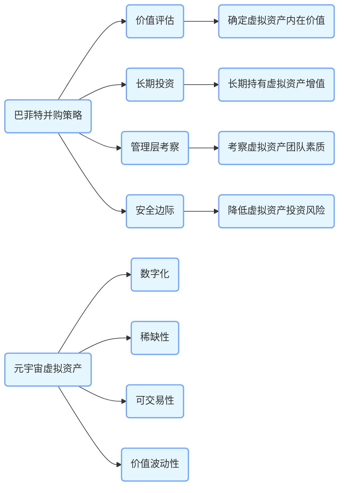

# 巴菲特的并购策略在元宇宙虚拟资产整合中的创新

> 关键词：巴菲特并购策略、元宇宙、虚拟资产整合、创新、投资理念

> 摘要：本文深入探讨了巴菲特的并购策略在元宇宙虚拟资产整合中的创新应用。首先介绍了巴菲特并购策略的背景及其在传统领域的成功经验，接着分析元宇宙虚拟资产的特点与整合需求。在此基础上，阐述如何将巴菲特的经典并购策略创新性地应用于元宇宙虚拟资产整合，包括价值评估、风险管理等方面。通过实际案例分析展示创新策略的可行性和效果，最后对未来发展趋势和挑战进行总结，旨在为相关领域的从业者和投资者提供有价值的参考。

## 1. 背景介绍 
### 1.1 目的和范围
本研究的目的在于探索如何将巴菲特成熟的并购策略应用于新兴的元宇宙虚拟资产整合领域，以实现虚拟资产的优化配置和价值提升。研究范围涵盖巴菲特并购策略的核心原则、元宇宙虚拟资产的特性、以及两者结合的创新方式和实际应用案例。通过对这些内容的研究，为元宇宙虚拟资产整合提供新的思路和方法，促进该领域的健康发展。

### 1.2 预期读者
本文预期读者包括元宇宙领域的创业者、投资者、资产管理者，以及对并购策略和虚拟资产感兴趣的研究人员和学者。对于创业者而言，了解如何运用创新的并购策略进行虚拟资产整合有助于企业的成长和扩张；投资者可以通过本文的研究更好地把握元宇宙投资机会，降低投资风险；资产管理者则可以借鉴相关策略优化资产配置，提高资产回报率；研究人员和学者可以将本文作为进一步深入研究的参考资料。

### 1.3 文档结构概述
本文首先介绍研究的背景、目的、预期读者和文档结构，为后续内容奠定基础。接着阐述巴菲特并购策略和元宇宙虚拟资产的核心概念及其联系，分析两者结合的可能性和意义。然后详细讲解将巴菲特并购策略应用于元宇宙虚拟资产整合的核心算法原理和具体操作步骤，并通过数学模型和公式进行深入分析。之后通过项目实战展示实际案例和代码实现，解读代码逻辑和应用效果。再探讨元宇宙虚拟资产整合的实际应用场景，为策略的应用提供现实依据。推荐相关的学习资源、开发工具框架和论文著作，帮助读者进一步深入学习和研究。最后总结未来发展趋势与挑战，解答常见问题，并提供扩展阅读和参考资料。

### 1.4 术语表
#### 1.4.1 核心术语定义
- **巴菲特并购策略**：指由沃伦·巴菲特（Warren Buffett）所倡导和实践的一系列并购投资原则和方法，强调对目标企业的内在价值评估、长期投资理念、管理层素质考察等。
- **元宇宙**：是一个基于虚拟现实、增强现实、区块链等技术构建的虚拟世界，用户可以在其中进行社交、娱乐、工作、创造等活动，具有开放性、交互性、去中心化等特点。
- **虚拟资产**：存在于元宇宙中的数字化资产，包括虚拟土地、虚拟货币、虚拟艺术品、虚拟角色等，具有稀缺性、可交易性和价值波动性等特点。
- **虚拟资产整合**：指通过并购、重组等方式，将分散的虚拟资产进行优化配置，实现资源共享、协同发展，提升虚拟资产的整体价值。

#### 1.4.2 相关概念解释
- **内在价值**：是指资产本身所具有的价值，不受市场短期波动的影响。在巴菲特的投资理念中，内在价值是评估目标企业或资产是否值得投资的重要依据。
- **协同效应**：指两个或多个资产或企业合并后，产生的整体效益大于各个部分效益之和的现象。在虚拟资产整合中，协同效应可以表现为技术共享、用户资源整合、品牌影响力提升等方面。
- **去中心化**：是指在元宇宙中，没有单一的中心化机构进行管理和控制，而是通过区块链等技术实现分布式的管理和决策。去中心化的特点使得虚拟资产的所有权和控制权更加分散和透明。

#### 1.4.3 缩略词列表
- **NFT**：Non-Fungible Token，非同质化代币，是一种基于区块链技术的数字资产凭证，用于表示虚拟资产的唯一性和所有权。
- **AR**：Augmented Reality，增强现实，是一种将虚拟信息与现实世界相结合的技术，为用户提供更加丰富的交互体验。
- **VR**：Virtual Reality，虚拟现实，是一种通过计算机技术创建的虚拟环境，使用户沉浸其中，获得身临其境的感受。

## 2. 核心概念与联系 

### 2.1 巴菲特并购策略核心原理
巴菲特的并购策略基于其长期的投资实践和价值投资理念，核心原理包括以下几个方面：
- **价值评估**：注重对目标企业或资产的内在价值进行评估，通过分析企业的财务状况、商业模式、竞争优势等因素，确定其真实价值。巴菲特认为，只有当资产的市场价格低于其内在价值时，才是值得投资的机会。
- **长期投资**：秉持长期投资的理念，不追求短期的市场波动和投机收益。他相信优秀的企业或资产在长期内会实现价值增长，因此愿意长期持有。
- **管理层考察**：重视目标企业的管理层素质，认为优秀的管理层是企业成功的关键因素之一。巴菲特会考察管理层的经营能力、诚信度和战略眼光等方面。
- **安全边际**：强调在投资中保留足够的安全边际，即购买价格与内在价值之间的差距。安全边际可以降低投资风险，提高投资的安全性。

### 2.2 元宇宙虚拟资产特性
元宇宙虚拟资产具有以下特性：
- **数字化**：虚拟资产以数字形式存在，依托于计算机技术和网络平台，不受物理空间的限制。
- **稀缺性**：部分虚拟资产通过技术手段设置了稀缺性，如限量发行的NFT，使得其具有一定的收藏价值和投资价值。
- **可交易性**：虚拟资产可以在元宇宙平台或相关交易市场上进行交易，实现价值的流通和转移。
- **价值波动性**：虚拟资产的价值受到市场供需关系、技术发展、用户关注度等多种因素的影响，具有较大的波动性。

### 2.3 两者联系的文本示意图
```plaintext
巴菲特并购策略
|-- 价值评估
|-- 长期投资
|-- 管理层考察
|-- 安全边际

元宇宙虚拟资产
|-- 数字化
|-- 稀缺性
|-- 可交易性
|-- 价值波动性

联系
|-- 价值评估用于确定虚拟资产的内在价值
|-- 长期投资理念适用于虚拟资产的持有和增值
|-- 考察虚拟资产背后团队的素质
|-- 安全边际降低虚拟资产投资风险
```

### 2.4 Mermaid 流程图


## 3. 核心算法原理 & 具体操作步骤 

### 3.1 价值评估算法原理
在元宇宙虚拟资产整合中，价值评估是关键环节。可以借鉴巴菲特的现金流折现模型（Discounted Cash Flow, DCF）来评估虚拟资产的内在价值。

现金流折现模型的基本原理是将资产未来产生的现金流按照一定的折现率折现到当前时刻，得到资产的现值。公式如下：
$$V = \sum_{t=1}^{n} \frac{CF_t}{(1 + r)^t}$$
其中，$V$ 表示资产的内在价值，$CF_t$ 表示第 $t$ 期的现金流，$r$ 表示折现率，$n$ 表示现金流的期数。

### 3.2 Python 代码实现价值评估
```python
def dcf_value(cash_flows, discount_rate):
    """
    计算现金流折现模型的资产内在价值
    :param cash_flows: 未来各期的现金流列表
    :param discount_rate: 折现率
    :return: 资产的内在价值
    """
    value = 0
    for t, cf in enumerate(cash_flows, start=1):
        value += cf / (1 + discount_rate) ** t
    return value

# 示例数据
cash_flows = [100, 120, 150, 180, 200]  # 未来 5 期的现金流
discount_rate = 0.1  # 折现率为 10%

# 计算内在价值
intrinsic_value = dcf_value(cash_flows, discount_rate)
print(f"虚拟资产的内在价值: {intrinsic_value}")
```

### 3.3 具体操作步骤
1. **数据收集**：收集虚拟资产未来可能产生的现金流数据，包括销售收入、广告收入、用户付费等。这需要对元宇宙市场、虚拟资产的用户群体、商业模式等进行深入分析。
2. **确定折现率**：折现率反映了资金的时间价值和投资风险。可以参考市场利率、行业平均收益率等因素来确定折现率。一般来说，元宇宙虚拟资产的投资风险较高，折现率也相对较高。
3. **计算内在价值**：将收集到的现金流数据代入现金流折现模型，计算虚拟资产的内在价值。
4. **比较与决策**：将计算得到的内在价值与虚拟资产的市场价格进行比较。如果内在价值大于市场价格，则认为该虚拟资产具有投资价值，可以考虑进行并购整合；反之，则需要谨慎决策。

## 4. 数学模型和公式 & 详细讲解 & 举例说明 

### 4.1 现金流折现模型详细讲解
现金流折现模型的核心思想是将资产未来的收益转化为当前的价值，考虑了资金的时间价值和投资风险。

- **现金流（$CF_t$）**：是指资产在未来各期产生的现金流入减去现金流出后的净额。对于元宇宙虚拟资产，现金流可能来自于虚拟土地的租赁收入、虚拟艺术品的销售收益、虚拟角色的付费服务等。
- **折现率（$r$）**：反映了投资者对资金时间价值和投资风险的要求。折现率越高，说明投资者对风险的承受能力越低，对资产的预期回报率越高。
- **期数（$n$）**：表示现金流的预测期限。在实际应用中，需要根据虚拟资产的生命周期、市场发展趋势等因素合理确定期数。

### 4.2 举例说明
假设某元宇宙虚拟土地项目，预计未来 5 年的现金流分别为 50 万元、60 万元、70 万元、80 万元和 90 万元，折现率为 12%。

根据现金流折现模型计算该虚拟土地的内在价值：
$$V = \frac{50}{(1 + 0.12)^1} + \frac{60}{(1 + 0.12)^2} + \frac{70}{(1 + 0.12)^3} + \frac{80}{(1 + 0.12)^4} + \frac{90}{(1 + 0.12)^5}$$

```python
cash_flows = [50, 60, 70, 80, 90]
discount_rate = 0.12

intrinsic_value = dcf_value(cash_flows, discount_rate)
print(f"该虚拟土地的内在价值: {intrinsic_value} 万元")
```

### 4.3 风险调整模型
在实际应用中，还需要考虑虚拟资产的风险因素。可以采用风险调整折现率模型，将风险因素纳入折现率的计算中。

风险调整折现率公式为：
$$r_{adj} = r_f + \beta \times (r_m - r_f)$$
其中，$r_{adj}$ 表示风险调整后的折现率，$r_f$ 表示无风险利率，$\beta$ 表示资产的风险系数，$r_m$ 表示市场平均收益率。

### 4.4 举例说明风险调整模型
假设无风险利率为 3%，市场平均收益率为 10%，某虚拟资产的风险系数为 1.5。

则风险调整后的折现率为：
$$r_{adj} = 0.03 + 1.5 \times (0.1 - 0.03) = 0.135$$

将风险调整后的折现率代入现金流折现模型，重新计算虚拟资产的内在价值。

## 5. 项目实战：代码实际案例和详细解释说明 

### 5.1  开发环境搭建
- **编程语言**：Python 3.x
- **开发工具**：PyCharm 或 Jupyter Notebook
- **依赖库**：`numpy`、`pandas`（用于数据处理和分析）

### 5.2  源代码详细实现和代码解读
```python
import numpy as np
import pandas as pd

def dcf_value(cash_flows, discount_rate):
    """
    计算现金流折现模型的资产内在价值
    :param cash_flows: 未来各期的现金流列表
    :param discount_rate: 折现率
    :return: 资产的内在价值
    """
    value = 0
    for t, cf in enumerate(cash_flows, start=1):
        value += cf / (1 + discount_rate) ** t
    return value

def risk_adjusted_discount_rate(rf, beta, rm):
    """
    计算风险调整后的折现率
    :param rf: 无风险利率
    :param beta: 资产的风险系数
    :param rm: 市场平均收益率
    :return: 风险调整后的折现率
    """
    return rf + beta * (rm - rf)

# 示例数据
cash_flows = np.array([100, 120, 150, 180, 200])  # 未来 5 期的现金流
rf = 0.03  # 无风险利率
beta = 1.2  # 资产的风险系数
rm = 0.1  # 市场平均收益率

# 计算风险调整后的折现率
r_adj = risk_adjusted_discount_rate(rf, beta, rm)
print(f"风险调整后的折现率: {r_adj}")

# 计算内在价值
intrinsic_value = dcf_value(cash_flows, r_adj)
print(f"虚拟资产的内在价值: {intrinsic_value}")
```

### 5.3  代码解读与分析
- **`dcf_value` 函数**：实现了现金流折现模型的计算逻辑，通过遍历未来各期的现金流，将其按照折现率折现到当前时刻，并累加得到资产的内在价值。
- **`risk_adjusted_discount_rate` 函数**：根据风险调整折现率公式计算风险调整后的折现率，考虑了资产的风险因素。
- **示例数据**：定义了未来 5 期的现金流、无风险利率、资产的风险系数和市场平均收益率。
- **计算过程**：首先计算风险调整后的折现率，然后将其代入现金流折现模型计算虚拟资产的内在价值。

通过这个案例，可以看到如何将巴菲特的价值评估理念应用于元宇宙虚拟资产的估值，为虚拟资产整合提供决策依据。

## 6. 实际应用场景 

### 6.1 虚拟土地整合
在元宇宙中，虚拟土地是一种重要的虚拟资产。不同的虚拟土地具有不同的地理位置、资源和开发潜力。通过并购整合，可以将相邻或具有互补性的虚拟土地合并，实现资源共享和协同开发。例如，将商业中心附近的虚拟土地与具有创意设计能力的虚拟土地整合，打造一个集商业、娱乐、文化为一体的虚拟社区，提高虚拟土地的整体价值。

### 6.2 虚拟艺术品整合
虚拟艺术品市场在元宇宙中发展迅速。通过并购整合，可以将不同风格、不同创作者的虚拟艺术品进行整合，形成一个具有规模效应的虚拟艺术画廊或博物馆。这样可以吸引更多的用户和投资者，提高虚拟艺术品的知名度和市场价值。同时，整合后的平台可以提供更优质的展示和交易服务，促进虚拟艺术品的流通和增值。

### 6.3 虚拟角色整合
虚拟角色是元宇宙中用户的化身，具有个性化和社交属性。通过并购整合，可以将不同类型、不同功能的虚拟角色进行整合，打造一个多元化的虚拟角色平台。例如，将具有战斗能力的虚拟角色与具有社交互动功能的虚拟角色整合，为用户提供更加丰富的游戏和社交体验。同时，整合后的平台可以通过用户数据的分析和挖掘，实现虚拟角色的精准营销和个性化推荐，提高用户的满意度和忠诚度。

### 6.4 虚拟企业整合
在元宇宙中，也存在着各种虚拟企业。通过并购整合，可以将具有不同业务领域和优势的虚拟企业进行合并，实现资源优化配置和协同发展。例如，将一家专注于虚拟商品开发的企业与一家擅长市场营销的企业整合，提高虚拟商品的市场推广能力和销售业绩。同时，整合后的虚拟企业可以共享技术、人才和用户资源，降低运营成本，提高市场竞争力。

## 7. 工具和资源推荐
### 7.1 学习资源推荐
#### 7.1.1 书籍推荐
- 《巴菲特致股东的信：投资者和公司高管教程》：详细介绍了巴菲特的投资理念和并购策略，是学习巴菲特思想的经典著作。
- 《元宇宙通证》：全面介绍了元宇宙的概念、技术、经济和社会影响，对理解元宇宙虚拟资产有很大帮助。
- 《区块链技术指南》：深入讲解了区块链技术的原理、应用和发展趋势，对于理解虚拟资产的底层技术支持有重要意义。

#### 7.1.2 在线课程
- Coursera 上的“投资学原理”：系统介绍了投资学的基本理论和方法，包括价值评估、风险管理等内容。
- edX 上的“元宇宙与未来社会”：探讨了元宇宙的发展趋势、技术挑战和社会影响，提供了丰富的案例和研究成果。
- Udemy 上的“区块链实战开发”：通过实际项目案例，教授区块链技术的开发和应用，帮助学习者掌握虚拟资产的技术实现。

#### 7.1.3 技术博客和网站
- 巴伦周刊（Barron's）：提供了丰富的金融投资资讯和分析，包括巴菲特的投资动态和观点。
- 元宇宙星球（Metaverse Planet）：专注于元宇宙领域的新闻、技术和应用，是了解元宇宙发展的重要平台。
- 区块链研究网（Blockchain Research Network）：分享区块链技术的最新研究成果和应用案例，对虚拟资产的研究有很大帮助。

### 7.2 开发工具框架推荐
#### 7.2.1 IDE和编辑器
- PyCharm：一款专业的 Python 集成开发环境，提供了丰富的代码编辑、调试和版本控制功能，适合开发虚拟资产相关的 Python 程序。
- Visual Studio Code：一款轻量级的代码编辑器，支持多种编程语言和插件扩展，方便进行跨平台开发。
- Remix：一款基于网页的以太坊智能合约开发工具，适合开发基于区块链的虚拟资产智能合约。

#### 7.2.2 调试和性能分析工具
- PDB：Python 自带的调试器，可以帮助开发者定位代码中的错误和问题。
- Py-Spy：一款用于分析 Python 程序性能的工具，可以实时监控程序的 CPU 使用率、内存占用等情况。
- Ganache：一款以太坊区块链的本地开发环境，用于测试和调试智能合约，方便开发者进行虚拟资产的开发和测试。

#### 7.2.3 相关框架和库
- Web3.py：一个 Python 库，用于与以太坊区块链进行交互，方便开发者开发基于以太坊的虚拟资产应用。
- Solidity：以太坊智能合约的编程语言，用于编写虚拟资产的智能合约。
- OpenZeppelin：一个用于开发安全智能合约的框架，提供了一系列经过审计的智能合约模板和工具，提高虚拟资产智能合约的安全性。

### 7.3 相关论文著作推荐
#### 7.3.1 经典论文
- “The Theory of Investment Value” by John Burr Williams：阐述了现金流折现模型的基本原理，是价值评估领域的经典论文。
- “Bitcoin: A Peer-to-Peer Electronic Cash System” by Satoshi Nakamoto：介绍了比特币的原理和实现，是区块链技术的开山之作。
- “The Metaverse: A New Frontier for Digital Innovation” by Matthew Ball：探讨了元宇宙的概念、技术和发展趋势，对理解元宇宙的本质有重要意义。

#### 7.3.2 最新研究成果
- 关注顶级学术期刊如《ACM Transactions on Multimedia Computing, Communications, and Applications》、《IEEE Transactions on Virtual Reality and 3D User Interfaces》等，获取元宇宙和虚拟资产领域的最新研究成果。
- 参加相关的学术会议，如 SIGGRAPH（Special Interest Group on Computer Graphics and Interactive Techniques）、VR/AR（Virtual Reality/Augmented Reality）等，了解行业前沿动态。

#### 7.3.3 应用案例分析
- 研究国内外知名的元宇宙项目，如 Decentraland、The Sandbox 等，分析其虚拟资产整合的策略和实践经验。
- 关注区块链游戏项目，如 Axie Infinity、CryptoKitties 等，了解虚拟资产在游戏领域的应用和发展趋势。

## 8. 总结：未来发展趋势与挑战

### 8.1 未来发展趋势
- **市场规模扩大**：随着元宇宙概念的不断普及和技术的不断发展，元宇宙虚拟资产市场将不断扩大。越来越多的用户和投资者将进入元宇宙领域，虚拟资产的种类和数量也将不断增加。
- **资产类型多元化**：除了现有的虚拟土地、虚拟艺术品、虚拟角色等资产类型，未来还将出现更多新型的虚拟资产，如虚拟知识产权、虚拟数据资产等。这些新型虚拟资产将为元宇宙经济带来更多的创新和发展机会。
- **产业融合加速**：元宇宙将与实体经济、文化娱乐、教育医疗等多个领域进行深度融合。虚拟资产整合将成为促进产业融合的重要手段，通过整合不同领域的虚拟资产，实现资源共享和协同发展，推动产业升级和转型。
- **技术创新推动**：区块链、虚拟现实、增强现实、人工智能等技术的不断创新将为元宇宙虚拟资产整合提供更强大的技术支持。例如，区块链技术的发展将提高虚拟资产的安全性和透明度，人工智能技术的应用将实现虚拟资产的智能管理和个性化推荐。

### 8.2 挑战
- **法律法规不完善**：元宇宙虚拟资产是一种新兴事物，目前相关的法律法规还不完善。虚拟资产的所有权、交易规则、税收政策等方面存在很多法律空白，这给虚拟资产整合带来了一定的法律风险。
- **技术标准不统一**：元宇宙涉及多种技术领域，目前技术标准还不统一。不同的元宇宙平台和虚拟资产之间缺乏互操作性，这给虚拟资产的整合和流通带来了困难。
- **安全风险**：虚拟资产存在安全风险，如黑客攻击、数据泄露、智能合约漏洞等。这些安全问题可能导致虚拟资产的损失和用户权益的受损，影响虚拟资产整合的顺利进行。
- **市场泡沫和投机风险**：元宇宙虚拟资产市场目前存在一定的泡沫和投机现象。部分虚拟资产的价格被过度炒作，偏离了其内在价值。这给虚拟资产整合带来了市场风险，可能导致整合后的资产价值下降。

## 9. 附录：常见问题与解答

### 9.1 如何确定虚拟资产的现金流？
确定虚拟资产的现金流需要对其商业模式、市场前景、用户需求等进行深入分析。可以参考类似虚拟资产的历史数据，结合市场调研和行业分析，预测虚拟资产未来可能产生的销售收入、广告收入、用户付费等现金流。同时，需要考虑市场竞争、技术发展等因素对现金流的影响，进行合理的调整和修正。

### 9.2 如何评估虚拟资产的风险系数？
评估虚拟资产的风险系数可以参考以下几个方面：
- **市场风险**：分析虚拟资产市场的波动性和不确定性，了解市场供需关系、政策变化等因素对虚拟资产价格的影响。
- **技术风险**：考察虚拟资产所依赖的技术是否成熟、稳定，是否存在技术更新换代的风险。
- **团队风险**：评估虚拟资产背后团队的技术实力、管理能力、创新能力等，了解团队的稳定性和可靠性。
- **法律风险**：关注虚拟资产相关的法律法规是否完善，是否存在法律纠纷和合规风险。

可以通过专家评估、数据分析、市场调研等方法综合确定虚拟资产的风险系数。

### 9.3 虚拟资产整合后如何实现协同效应？
虚拟资产整合后实现协同效应可以从以下几个方面入手：
- **资源共享**：整合虚拟资产的技术、人才、用户、数据等资源，实现资源的优化配置和共享。例如，共享技术研发成果可以降低研发成本，提高研发效率；共享用户资源可以扩大市场份额，提高用户粘性。
- **业务协同**：根据虚拟资产的特点和优势，进行业务整合和协同发展。例如，将具有互补性的虚拟业务进行合并，实现业务流程的优化和效率的提升。
- **品牌协同**：整合虚拟资产的品牌资源，打造统一的品牌形象和品牌影响力。通过品牌协同，可以提高品牌知名度和美誉度，吸引更多的用户和投资者。
- **文化协同**：关注虚拟资产背后的文化内涵和价值观，进行文化整合和协同发展。通过文化协同，可以增强用户的认同感和归属感，提高虚拟资产的文化价值。

### 9.4 如何应对虚拟资产整合中的安全风险？
应对虚拟资产整合中的安全风险可以采取以下措施：
- **技术防护**：采用先进的安全技术，如加密技术、防火墙、入侵检测系统等，保障虚拟资产的安全性。同时，定期对系统进行安全漏洞扫描和修复，及时更新安全补丁。
- **智能合约审计**：对虚拟资产的智能合约进行严格的审计，确保智能合约的安全性和可靠性。可以聘请专业的智能合约审计机构进行审计，发现并解决潜在的安全问题。
- **用户教育**：加强用户安全教育，提高用户的安全意识和防范能力。例如，提醒用户注意保护个人信息、设置强密码、不轻易点击不明链接等。
- **应急响应机制**：建立完善的应急响应机制，及时处理安全事件。制定应急预案，明确应急处理流程和责任分工，确保在安全事件发生时能够迅速响应和处理，减少损失。

## 10. 扩展阅读 & 参考资料

### 10.1 扩展阅读
- 《失控：全人类的最终命运和结局》：探讨了科技发展对人类社会的影响，对理解元宇宙的发展趋势有一定的启发。
- 《人类简史：从动物到上帝》：从人类历史的角度分析了人类的进化和发展，有助于理解元宇宙的社会文化背景。
- 《未来简史：从智人到神人》：展望了人类未来的发展方向，对思考元宇宙的未来发展有一定的参考价值。

### 10.2 参考资料
- 巴菲特官方网站：https://www.berkshirehathaway.com/
- 元宇宙相关研究报告：如 Gartner、IDC 等机构发布的元宇宙研究报告。
- 区块链技术白皮书：如以太坊、比特币等区块链项目的白皮书。

通过以上的扩展阅读和参考资料，读者可以进一步深入了解巴菲特的并购策略、元宇宙虚拟资产的相关知识和技术，为相关领域的研究和实践提供更丰富的资源和支持。