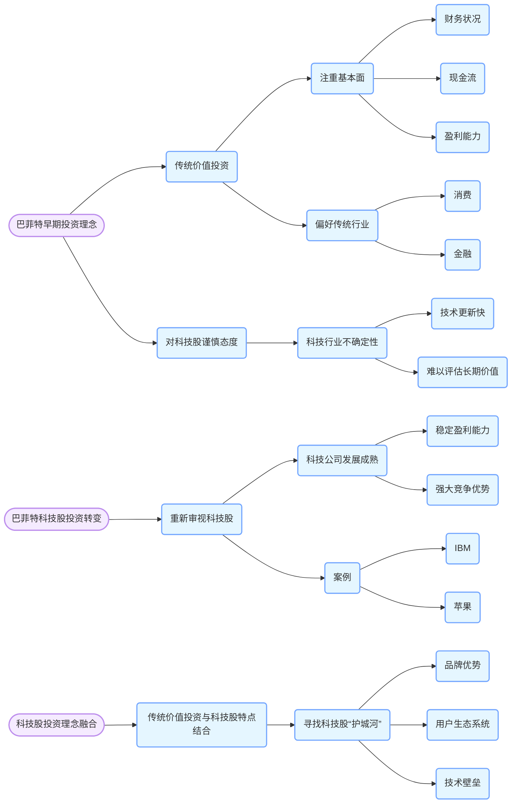

# 巴菲特的科技股投资转变：与时俱进的智慧

> 关键词：巴菲特、科技股投资、投资转变、与时俱进、价值投资

> 摘要：本文深入探讨了巴菲特在科技股投资领域的转变，分析了其背后的原因、核心投资理念的变化以及具体的投资策略。通过详细阐述巴菲特不同阶段的投资案例，揭示了他如何在科技快速发展的时代中与时俱进，展现出卓越的投资智慧。同时，结合数学模型、实际项目案例和多种工具资源推荐，为投资者提供全面的参考和启示，最后对科技股投资的未来发展趋势与挑战进行了总结。

## 1. 背景介绍 
### 1.1 目的和范围
本文章旨在全面剖析巴菲特科技股投资转变这一现象。通过对巴菲特投资理念、投资行为的分析，探讨他为何以及如何在科技股投资方面做出改变。范围涵盖了巴菲特早期对科技股的态度、转变的关键节点、具体投资案例以及这些转变对投资界的影响等方面。我们将深入研究他的投资决策过程，分析其背后的逻辑和智慧，为广大投资者提供有价值的参考和启示。

### 1.2 预期读者
本文的预期读者主要包括对投资领域感兴趣的个人投资者、金融从业者、投资研究人员以及对巴菲特投资理念有深入探究需求的人群。无论是希望学习投资技巧的新手，还是寻求投资策略优化的专业人士，都能从本文中获取有价值的信息。

### 1.3 文档结构概述
本文将按照以下结构进行阐述：首先介绍相关背景信息，包括目的、读者群体和文档结构。接着深入探讨核心概念，分析巴菲特投资理念的转变以及科技股投资的相关联系。然后详细讲解核心算法原理和具体操作步骤，运用Python代码进行说明。之后介绍数学模型和公式，并通过具体例子进行解释。在项目实战部分，给出实际代码案例并进行详细解读。随后探讨科技股投资的实际应用场景，推荐相关的工具和资源。最后对未来发展趋势与挑战进行总结，并提供常见问题解答和扩展阅读参考资料。

### 1.4 术语表
#### 1.4.1 核心术语定义
- **价值投资**：一种投资策略，强调通过分析公司的内在价值，寻找被低估的股票进行投资，长期持有以获取回报。
- **科技股**：指那些从事高科技领域研发、生产和销售的公司所发行的股票，通常具有高成长性和高风险性。
- **护城河**：巴菲特提出的概念，指企业拥有的可持续竞争优势，能够保护企业的长期盈利能力。

#### 1.4.2 相关概念解释
- **投资理念转变**：指投资者在不同时期根据市场环境、行业发展等因素，调整自己的投资策略和理念。
- **科技行业的不确定性**：由于科技发展迅速，技术更新换代快，科技公司面临着技术失败、市场竞争激烈等多种不确定性因素。

#### 1.4.3 缩略词列表
- **PE**：市盈率（Price-to-Earnings Ratio），是指股票价格除以每股收益的比率，用于衡量股票的估值水平。
- **ROE**：净资产收益率（Return on Equity），是指净利润与平均股东权益的百分比，反映了公司运用自有资本的效率。

## 2. 核心概念与联系 

### 巴菲特早期投资理念与科技股态度
巴菲特早期秉持传统的价值投资理念，注重公司的财务状况、现金流、盈利能力等基本面因素。他偏好那些具有稳定现金流、强大品牌和宽阔“护城河”的传统行业公司，如消费、金融等。对于科技股，他长期持谨慎态度，主要原因在于科技行业的高度不确定性。科技公司的技术更新换代迅速，今天的领先技术可能明天就会被淘汰，这使得很难准确评估科技公司的长期价值。例如，在互联网泡沫时期，许多科技股的股价被严重高估，但实际盈利能力却很弱。巴菲特坚持不参与这类投资，避免了在泡沫破裂时遭受巨大损失。

### 巴菲特科技股投资的转变过程
随着科技行业的不断发展和成熟，一些科技公司逐渐展现出稳定的盈利能力和强大的竞争优势。巴菲特开始重新审视科技股投资。2011年，伯克希尔·哈撒韦首次买入IBM股票，这被视为巴菲特科技股投资转变的一个重要信号。此后，他又大量买入苹果公司股票，成为其前十大股东之一。这一转变并非一蹴而就，而是巴菲特在深入研究科技行业和相关公司后做出的决策。他开始认识到，一些科技公司已经建立了类似传统行业的“护城河”，如苹果公司凭借其强大的品牌、优秀的产品设计和庞大的用户生态系统，拥有了稳定的现金流和较高的市场份额。

### 核心概念原理和架构的文本示意图
```plaintext
巴菲特早期投资理念
|-- 传统价值投资
|   |-- 注重基本面
|   |   |-- 财务状况
|   |   |-- 现金流
|   |   |-- 盈利能力
|   |-- 偏好传统行业
|       |-- 消费
|       |-- 金融
|-- 对科技股谨慎态度
    |-- 科技行业不确定性
        |-- 技术更新快
        |-- 难以评估长期价值

巴菲特科技股投资转变
|-- 重新审视科技股
|   |-- 科技公司发展成熟
|   |   |-- 稳定盈利能力
|   |   |-- 强大竞争优势
|   |-- 案例
|       |-- IBM
|       |-- 苹果

科技股投资理念融合
|-- 传统价值投资与科技股特点结合
|   |-- 寻找科技股“护城河”
|       |-- 品牌优势
|       |-- 用户生态系统
|       |-- 技术壁垒
```

### Mermaid 流程图


## 3. 核心算法原理 & 具体操作步骤 

### 巴菲特投资决策的核心算法原理
巴菲特的投资决策核心是评估公司的内在价值。虽然没有一个固定的数学公式可以完全精确地计算内在价值，但可以通过一些常见的财务指标和方法进行估算。其中，最常用的方法是现金流折现法（Discounted Cash Flow, DCF）。现金流折现法的基本原理是将公司未来的现金流按照一定的折现率折现到当前，得到公司的内在价值。

### Python 代码实现现金流折现法
```python
import numpy as np

def dcf_valuation(free_cash_flows, discount_rate, growth_rate, terminal_growth_rate):
    """
    现金流折现法计算公司内在价值
    
    参数:
    free_cash_flows (list): 未来n年的自由现金流
    discount_rate (float): 折现率
    growth_rate (float): 预测期内的现金流增长率
    terminal_growth_rate (float): 永续增长率
    
    返回:
    float: 公司的内在价值
    """
    n = len(free_cash_flows)
    # 计算预测期内现金流的现值
    present_values = []
    for i in range(n):
        present_value = free_cash_flows[i] / ((1 + discount_rate) ** (i + 1))
        present_values.append(present_value)
    
    # 计算终值
    last_fcf = free_cash_flows[-1] * (1 + growth_rate)
    terminal_value = last_fcf / (discount_rate - terminal_growth_rate)
    terminal_present_value = terminal_value / ((1 + discount_rate) ** n)
    
    # 计算内在价值
    intrinsic_value = sum(present_values) + terminal_present_value
    return intrinsic_value

# 示例数据
free_cash_flows = [100, 110, 120, 130, 140]  # 未来5年的自由现金流
discount_rate = 0.1  # 折现率为10%
growth_rate = 0.05  # 预测期内的现金流增长率为5%
terminal_growth_rate = 0.02  # 永续增长率为2%

# 计算内在价值
intrinsic_value = dcf_valuation(free_cash_flows, discount_rate, growth_rate, terminal_growth_rate)
print(f"公司的内在价值为: {intrinsic_value}")
```

### 具体操作步骤
1. **确定未来现金流**：通过分析公司的历史财务数据、行业发展趋势等，预测公司未来n年的自由现金流。
2. **选择折现率**：折现率反映了资金的时间价值和投资的风险。通常可以使用公司的加权平均资本成本（WACC）作为折现率。
3. **确定增长率**：包括预测期内的现金流增长率和永续增长率。预测期内的增长率可以根据公司的业务发展情况和行业前景进行估计，永续增长率一般假设为一个较低的稳定值。
4. **计算现值和终值**：将未来每年的现金流按照折现率折现到当前，得到预测期内现金流的现值。然后计算终值，即预测期结束后公司的价值，同样折现到当前。
5. **计算内在价值**：将预测期内现金流的现值和终值相加，得到公司的内在价值。
6. **比较内在价值和市场价格**：如果内在价值高于市场价格，说明股票被低估，可以考虑买入；反之则说明股票被高估，应谨慎投资。

## 4. 数学模型和公式 & 详细讲解 & 举例说明 

### 现金流折现法数学模型和公式
现金流折现法的数学模型可以表示为：

$$
V = \sum_{t=1}^{n} \frac{FCF_t}{(1 + r)^t} + \frac{FCF_n \times (1 + g)}{(r - g_{terminal}) \times (1 + r)^n}
$$

其中：
- $V$ 表示公司的内在价值
- $FCF_t$ 表示第 $t$ 年的自由现金流
- $r$ 表示折现率
- $n$ 表示预测期的年数
- $g$ 表示预测期内的现金流增长率
- $g_{terminal}$ 表示永续增长率

### 详细讲解
1. **预测期内现金流现值**：$\sum_{t=1}^{n} \frac{FCF_t}{(1 + r)^t}$ 这部分计算了预测期内每年自由现金流的现值之和。随着时间的推移，未来现金流的现值会逐渐减少，因为资金具有时间价值，现在的一元钱比未来的一元钱更有价值。
2. **终值**：$\frac{FCF_n \times (1 + g)}{(r - g_{terminal}) \times (1 + r)^n}$ 计算了预测期结束后公司的价值。假设公司在预测期结束后以永续增长率 $g_{terminal}$ 持续增长，根据永续年金的计算公式得到终值，再将其折现到当前。

### 举例说明
假设一家公司未来5年的自由现金流分别为100万元、110万元、120万元、130万元和140万元。折现率为10%，预测期内的现金流增长率为5%，永续增长率为2%。

1. **计算预测期内现金流的现值**：
    - 第1年：$PV_1 = \frac{100}{(1 + 0.1)^1} \approx 90.91$（万元）
    - 第2年：$PV_2 = \frac{110}{(1 + 0.1)^2} \approx 90.91$（万元）
    - 第3年：$PV_3 = \frac{120}{(1 + 0.1)^3} \approx 90.16$（万元）
    - 第4年：$PV_4 = \frac{130}{(1 + 0.1)^4} \approx 88.79$（万元）
    - 第5年：$PV_5 = \frac{140}{(1 + 0.1)^5} \approx 86.93$（万元）
    - 预测期内现金流现值之和：$PV = PV_1 + PV_2 + PV_3 + PV_4 + PV_5 \approx 447.7$（万元）

2. **计算终值**：
    - 第6年的自由现金流：$FCF_6 = 140 \times (1 + 0.05) = 147$（万元）
    - 终值：$TV = \frac{147}{(0.1 - 0.02)} \approx 1837.5$（万元）
    - 终值的现值：$PV_{TV} = \frac{1837.5}{(1 + 0.1)^5} \approx 1134.8$（万元）

3. **计算内在价值**：
    - 内在价值：$V = PV + PV_{TV} \approx 447.7 + 1134.8 = 1582.5$（万元）

如果该公司的市场价值低于1582.5万元，从现金流折现法的角度来看，该股票可能被低估，具有投资价值。

## 5. 项目实战：代码实际案例和详细解释说明 

### 5.1  开发环境搭建
为了运行上述的Python代码，需要搭建以下开发环境：
1. **Python安装**：可以从Python官方网站（https://www.python.org/downloads/）下载适合自己操作系统的Python版本进行安装。建议安装Python 3.7及以上版本。
2. **集成开发环境（IDE）**：可以选择PyCharm、Jupyter Notebook等。PyCharm是一款功能强大的Python IDE，提供了代码编辑、调试、自动补全等功能；Jupyter Notebook则适合交互式编程和数据分析，以网页的形式展示代码和结果。
3. **必要的库安装**：上述代码只使用了Python的内置库，无需额外安装其他库。如果需要进行更复杂的数据分析和可视化，可以安装NumPy、Pandas、Matplotlib等库。可以使用以下命令进行安装：
```sh
pip install numpy pandas matplotlib
```

### 5.2  源代码详细实现和代码解读
```python
import numpy as np

def dcf_valuation(free_cash_flows, discount_rate, growth_rate, terminal_growth_rate):
    """
    现金流折现法计算公司内在价值
    
    参数:
    free_cash_flows (list): 未来n年的自由现金流
    discount_rate (float): 折现率
    growth_rate (float): 预测期内的现金流增长率
    terminal_growth_rate (float): 永续增长率
    
    返回:
    float: 公司的内在价值
    """
    n = len(free_cash_flows)
    # 计算预测期内现金流的现值
    present_values = []
    for i in range(n):
        present_value = free_cash_flows[i] / ((1 + discount_rate) ** (i + 1))
        present_values.append(present_value)
    
    # 计算终值
    last_fcf = free_cash_flows[-1] * (1 + growth_rate)
    terminal_value = last_fcf / (discount_rate - terminal_growth_rate)
    terminal_present_value = terminal_value / ((1 + discount_rate) ** n)
    
    # 计算内在价值
    intrinsic_value = sum(present_values) + terminal_present_value
    return intrinsic_value

# 示例数据
free_cash_flows = [100, 110, 120, 130, 140]  # 未来5年的自由现金流
discount_rate = 0.1  # 折现率为10%
growth_rate = 0.05  # 预测期内的现金流增长率为5%
terminal_growth_rate = 0.02  # 永续增长率为2%

# 计算内在价值
intrinsic_value = dcf_valuation(free_cash_flows, discount_rate, growth_rate, terminal_growth_rate)
print(f"公司的内在价值为: {intrinsic_value}")
```

### 代码解读与分析
1. **导入必要的库**：`import numpy as np` 导入了NumPy库，虽然在本代码中未使用，但在实际应用中可能会用于处理数值计算。
2. **定义 `dcf_valuation` 函数**：该函数接受四个参数，分别是未来n年的自由现金流、折现率、预测期内的现金流增长率和永续增长率。函数内部实现了现金流折现法的计算过程。
    - 计算预测期内现金流的现值：通过循环遍历未来每年的自由现金流，将其按照折现率折现到当前，并将现值存储在 `present_values` 列表中。
    - 计算终值：根据预测期最后一年的自由现金流和增长率计算第n+1年的自由现金流，然后使用永续年金公式计算终值，再将终值折现到当前。
    - 计算内在价值：将预测期内现金流的现值和终值相加，得到公司的内在价值。
3. **示例数据和计算**：定义了未来5年的自由现金流、折现率、预测期内的现金流增长率和永续增长率，并调用 `dcf_valuation` 函数计算公司的内在价值，最后将结果打印输出。

在实际应用中，可以根据具体情况修改示例数据，输入不同公司的财务数据和参数，以计算不同公司的内在价值。同时，还可以对代码进行扩展，例如添加数据验证、异常处理等功能，提高代码的健壮性。

## 6. 实际应用场景 
### 个人投资者的科技股投资决策
对于个人投资者来说，巴菲特的科技股投资转变提供了重要的参考。个人投资者可以借鉴巴菲特的价值投资理念，结合现金流折现法等方法，评估科技股的内在价值。在选择科技股时，不仅要关注公司的技术创新能力，还要考察其盈利能力、市场份额、竞争优势等基本面因素。例如，当投资者考虑投资一家新兴的科技公司时，可以通过分析其未来的现金流预测，结合合理的折现率和增长率，计算出公司的内在价值。如果内在价值高于当前市场价格，且公司具有较强的竞争优势和发展前景，那么可以考虑买入该股票。

### 机构投资者的资产配置
机构投资者如基金公司、保险公司等，在进行资产配置时也可以参考巴菲特的投资策略。在科技行业快速发展的今天，适当增加科技股的配置比例可以提高投资组合的收益潜力。机构投资者可以采用分散投资的方法，选择不同类型、不同规模的科技公司进行投资，以降低风险。同时，通过深入研究和分析，挖掘具有长期投资价值的科技股，为投资者带来稳定的回报。

### 科技公司的战略规划
科技公司自身也可以从巴菲特的投资转变中获得启示。为了吸引投资者的关注和资金，科技公司需要注重提升自身的内在价值。这包括加强技术研发，提高产品质量和市场竞争力；优化财务状况，保持稳定的现金流和盈利能力；建立良好的品牌形象和用户生态系统，形成强大的“护城河”。例如，苹果公司通过不断推出创新的产品、打造完善的生态系统，吸引了包括巴菲特在内的众多投资者的青睐。

### 投资教育和研究
巴菲特的科技股投资转变为投资教育和研究提供了丰富的案例素材。在投资课程中，可以通过分析巴菲特的投资决策过程，向学生传授价值投资理念和分析方法。研究人员可以进一步深入研究巴菲特的投资策略，探讨其在科技股投资领域的成功经验和面临的挑战，为投资理论的发展做出贡献。

## 7. 工具和资源推荐
### 7.1 学习资源推荐
#### 7.1.1 书籍推荐
- 《聪明的投资者》（The Intelligent Investor）：作者本杰明·格雷厄姆（Benjamin Graham）是价值投资理论的奠基人，这本书被誉为投资界的圣经。书中介绍了价值投资的基本原理和方法，对巴菲特的投资理念产生了深远影响。
- 《巴菲特致股东的信：股份公司教程》（Letters to Shareholders of Berkshire Hathaway）：这本书收录了巴菲特历年致股东的信，通过这些信件可以深入了解巴菲特的投资思想、公司管理理念和对市场的看法。
- 《穷查理宝典：查理·芒格的智慧箴言录》（Poor Charlie's Almanack: The Wit and Wisdom of Charles T. Munger）：查理·芒格是巴菲特的长期合作伙伴，这本书介绍了芒格的多元思维模型和投资哲学，对投资者拓宽思维视野具有重要意义。

#### 7.1.2 在线课程
- Coursera平台上的“投资学原理”（Principles of Investing）课程：由知名大学的教授授课，系统介绍了投资的基本理论和方法，包括股票、债券、基金等投资工具的分析和选择。
- Udemy平台上的“价值投资实战课程”（Value Investing Practical Course）：课程结合实际案例，详细讲解了价值投资的流程和技巧，适合有一定投资基础的学习者。

#### 7.1.3 技术博客和网站
- 雪球网（https://xueqiu.com/）：国内知名的投资社区，提供股票、基金等投资产品的行情信息、分析评论和投资者交流平台。
- Seeking Alpha（https://seekingalpha.com/）：国外著名的金融投资网站，汇聚了众多投资专家和分析师的文章和观点，对科技股投资的分析具有较高的参考价值。

### 7.2 开发工具框架推荐
#### 7.2.1 IDE和编辑器
- PyCharm：功能强大的Python集成开发环境，提供了丰富的代码编辑、调试、自动补全等功能，适合开发大型Python项目。
- Jupyter Notebook：交互式编程环境，以网页的形式展示代码和结果，方便进行数据分析和可视化，适合进行投资模型的开发和验证。

#### 7.2.2 调试和性能分析工具
- PDB：Python自带的调试器，可以在代码中设置断点，逐步执行代码，查看变量的值和程序的执行流程，帮助定位和解决代码中的问题。
- cProfile：Python的性能分析工具，可以统计代码中各个函数的执行时间和调用次数，帮助优化代码性能。

#### 7.2.3 相关框架和库
- NumPy：用于科学计算的Python库，提供了高效的多维数组对象和各种数学函数，在处理投资数据和进行数值计算时非常有用。
- Pandas：用于数据处理和分析的Python库，提供了数据结构和数据操作工具，方便对财务数据进行清洗、整理和分析。
- Matplotlib：用于数据可视化的Python库，可以绘制各种类型的图表，如折线图、柱状图、散点图等，帮助直观展示投资数据和分析结果。

### 7.3 相关论文著作推荐
#### 7.3.1 经典论文
- Fama, E. F., & French, K. R. (1992). The cross-section of expected stock returns. The Journal of Finance, 47(2), 427-465. 这篇论文提出了著名的Fama-French三因子模型，用于解释股票收益率的差异，对投资组合理论和资产定价模型的发展产生了重要影响。
- Sharpe, W. F. (1964). Capital asset prices: A theory of market equilibrium under conditions of risk. The Journal of Finance, 19(3), 425-442. 该论文提出了资本资产定价模型（CAPM），为投资组合的风险和收益评估提供了重要的理论基础。

#### 7.3.2 最新研究成果
- 在学术数据库如IEEE Xplore、ACM Digital Library等可以搜索到关于科技股投资、人工智能在投资领域应用等方面的最新研究论文。这些研究成果可以帮助投资者了解科技股投资的最新趋势和方法。

#### 7.3.3 应用案例分析
- 《金融科技前沿：应用案例与商业模式》：这本书介绍了金融科技在投资领域的应用案例，包括智能投顾、量化投资等，对科技股投资的实际应用具有一定的参考价值。

## 8. 总结：未来发展趋势与挑战
### 未来发展趋势
1. **科技股投资将持续增长**：随着科技的不断进步和创新，科技行业将继续保持快速发展。越来越多的科技公司将展现出强大的竞争力和盈利能力，吸引更多投资者的关注和资金。科技股在投资组合中的比重可能会进一步增加。
2. **人工智能和大数据在投资中的应用将更加广泛**：人工智能和大数据技术可以帮助投资者更准确地分析市场数据、预测公司业绩和评估投资风险。未来，这些技术将在科技股投资中发挥更加重要的作用，例如通过机器学习算法构建投资模型，实现自动化投资决策。
3. **跨界融合趋势加强**：科技行业与其他行业的跨界融合将越来越明显，如科技与医疗、金融、能源等行业的结合。这将创造出更多的投资机会，投资者需要具备更广泛的知识和跨行业分析能力。

### 挑战
1. **科技行业的不确定性依然存在**：尽管一些科技公司已经发展成熟，但科技行业的快速变化和不确定性仍然是投资的一大挑战。技术更新换代快、市场竞争激烈等因素可能导致科技公司的业绩波动较大，增加了投资风险。
2. **估值难题**：科技股的估值相对传统行业更加困难。由于科技公司的创新能力和未来发展潜力难以准确评估，传统的估值方法可能无法完全适用。投资者需要不断探索和创新估值方法，以更准确地评估科技股的价值。
3. **政策和监管风险**：科技行业受到政策和监管的影响较大。政府可能会出台相关政策来规范科技行业的发展，这可能会对科技公司的业务和盈利能力产生影响。投资者需要密切关注政策和监管动态，及时调整投资策略。

## 9. 附录：常见问题与解答
### 问题1：巴菲特为什么早期不投资科技股，后来又转变态度？
解答：巴菲特早期不投资科技股主要是因为科技行业的高度不确定性。科技公司的技术更新换代快，很难准确评估其长期价值。后来他转变态度是因为一些科技公司逐渐发展成熟，展现出稳定的盈利能力和强大的竞争优势，具备了类似传统行业的“护城河”，如苹果公司的品牌、用户生态系统等。

### 问题2：现金流折现法的局限性是什么？
解答：现金流折现法的局限性主要包括：
1. **预测的不确定性**：未来现金流的预测是基于假设和估计的，实际情况可能与预测相差较大。
2. **折现率的选择困难**：折现率的选择对计算结果影响较大，但很难确定一个准确的折现率。
3. **对长期增长率的假设**：永续增长率的假设较为敏感，不同的假设可能会导致计算结果的较大差异。

### 问题3：个人投资者如何应用巴菲特的投资理念进行科技股投资？
解答：个人投资者可以从以下几个方面应用巴菲特的投资理念进行科技股投资：
1. **注重基本面分析**：关注科技公司的财务状况、盈利能力、市场份额等基本面因素。
2. **寻找“护城河”**：选择具有品牌优势、技术壁垒、用户生态系统等竞争优势的科技公司。
3. **计算内在价值**：运用现金流折现法等方法计算科技股的内在价值，与市场价格进行比较。
4. **长期投资**：避免短期波动的影响，坚持长期投资。

### 问题4：科技股投资与传统行业投资有哪些不同？
解答：科技股投资与传统行业投资的不同主要体现在以下几个方面：
1. **行业特性**：科技行业发展迅速，技术更新换代快，不确定性较高；传统行业相对稳定，发展速度较慢。
2. **估值方法**：科技股的估值相对困难，传统的估值方法可能不完全适用；传统行业的估值方法相对成熟。
3. **风险特征**：科技股的风险较高，股价波动较大；传统行业的风险相对较低。
4. **创新因素**：科技股投资更注重公司的创新能力和技术研发；传统行业投资更关注公司的品牌、市场份额等因素。

## 10. 扩展阅读 & 参考资料
### 扩展阅读
- 《金融炼金术》（The Alchemy of Finance）：作者乔治·索罗斯（George Soros）介绍了他的反身性理论和投资实践，对投资者理解市场的运行机制和投资心理具有重要启示。
- 《漫步华尔街》（A Random Walk Down Wall Street）：这本书探讨了股票市场的有效性和投资策略，对投资者选择投资方式和构建投资组合具有参考价值。

### 参考资料
- Berkshire Hathaway官方网站（https://www.berkshirehathaway.com/）：获取巴菲特致股东的信、公司年报等官方资料。
- Yahoo Finance（https://finance.yahoo.com/）：提供股票行情、财务数据、新闻资讯等信息，方便投资者进行科技股的研究和分析。
- Google Scholar（https://scholar.google.com/）：搜索学术论文和研究报告，获取关于科技股投资的最新研究成果。