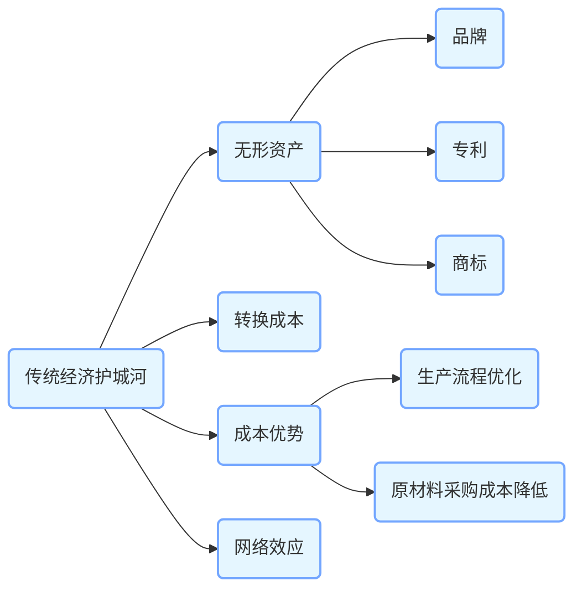
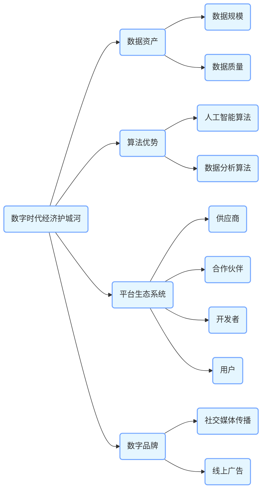

# 巴菲特的经济护城河更新：数字时代的竞争优势

> 关键词：巴菲特、经济护城河、数字时代、竞争优势、商业模式

> 摘要：本文聚焦于巴菲特提出的经济护城河概念在数字时代的更新情况。首先介绍了经济护城河理论的背景，明确文章目的、预期读者、文档结构和相关术语。接着阐述核心概念及其联系，包括传统经济护城河与数字时代经济护城河的原理和架构。深入分析核心算法原理及具体操作步骤，结合Python代码示例进行说明。通过数学模型和公式详细讲解经济护城河的量化评估，并举例分析。在项目实战部分，给出代码实际案例及详细解释。探讨了经济护城河在数字时代的实际应用场景，推荐了相关学习资源、开发工具框架和论文著作。最后总结未来发展趋势与挑战，解答常见问题并提供扩展阅读和参考资料，旨在帮助读者全面理解数字时代下经济护城河所代表的竞争优势。

## 1. 背景介绍 
### 1.1 目的和范围
在当今数字时代，商业环境发生了翻天覆地的变化。巴菲特所提出的经济护城河概念是价值投资领域的核心理论之一，该理论旨在识别那些拥有可持续竞争优势的企业。然而，随着科技的飞速发展，尤其是数字技术的广泛应用，传统的经济护城河因素可能已经发生了改变。本文的目的在于探讨巴菲特经济护城河理论在数字时代的更新，分析数字时代下企业竞争优势的新来源和变化。范围涵盖了传统经济护城河理论的回顾、数字时代新竞争优势的挖掘、如何量化评估这些优势以及在实际投资和企业经营中的应用等方面。

### 1.2 预期读者
本文预期读者包括对价值投资感兴趣的投资者，他们希望通过深入理解经济护城河理论在数字时代的变化，更好地筛选具有长期投资价值的企业；企业管理者也可以从本文中获得启发，了解如何在数字时代构建和强化自身企业的竞争优势；同时，对于金融专业的学生和研究人员来说，本文提供了一个结合传统理论和数字时代实际情况的研究视角，有助于他们进行相关学术研究和案例分析。

### 1.3 文档结构概述
本文将按照以下结构展开：首先介绍核心概念与联系，明确传统经济护城河和数字时代经济护城河的定义、原理和架构，并通过示意图和流程图进行直观展示；接着阐述核心算法原理及具体操作步骤，结合Python代码详细说明如何量化评估经济护城河；然后介绍相关的数学模型和公式，通过具体例子加深理解；在项目实战部分，提供代码实际案例并进行详细解释；探讨经济护城河在数字时代的实际应用场景；推荐学习资源、开发工具框架和相关论文著作；最后总结未来发展趋势与挑战，解答常见问题并提供扩展阅读和参考资料。

### 1.4 术语表
#### 1.4.1 核心术语定义
- **经济护城河**：指企业拥有的可持续竞争优势，能够使其在长期内抵御竞争对手的侵蚀，保持较高的盈利能力。
- **数字时代**：以信息技术和互联网的广泛应用为特征的时代，数据成为重要的生产要素，数字化商业模式和创新不断涌现。
- **竞争优势**：企业在市场中相对于竞争对手所具有的优势，表现为更低的成本、更高的产品质量、更强的品牌影响力等，能够帮助企业获得更多的市场份额和利润。

#### 1.4.2 相关概念解释
- **无形资产**：包括品牌、专利、商标等，是企业经济护城河的重要组成部分。在数字时代，无形资产还可能包括数据资产、算法专利等。
- **转换成本**：指客户从一个产品或服务转换到另一个产品或服务时所面临的成本，包括时间成本、学习成本、经济成本等。较高的转换成本可以增强企业的竞争优势。
- **网络效应**：指产品或服务的价值随着用户数量的增加而增加的现象。在数字时代，网络效应成为许多互联网企业的重要竞争优势来源。

#### 1.4.3 缩略词列表
- **AI**：Artificial Intelligence，人工智能
- **IoT**：Internet of Things，物联网
- **API**：Application Programming Interface，应用程序编程接口

## 2. 核心概念与联系 
### 传统经济护城河的原理和架构
传统经济护城河主要包括以下几个方面：
1. **无形资产**：品牌是企业的重要无形资产之一，具有较高品牌知名度和美誉度的企业能够吸引更多的客户，并且可以收取更高的价格。例如，可口可乐凭借其强大的品牌，在全球饮料市场占据了主导地位。专利则可以保护企业的技术创新，使其在一定时期内拥有独家生产和销售的权利，从而获得超额利润。
2. **转换成本**：当客户从一个产品或服务转换到另一个产品或服务时，如果面临较高的转换成本，就会倾向于继续使用现有的产品或服务。例如，企业使用的企业资源规划（ERP）系统，由于涉及到大量的数据迁移和员工培训，转换成本非常高，因此企业通常不会轻易更换供应商。
3. **成本优势**：企业通过优化生产流程、降低原材料采购成本等方式，能够实现比竞争对手更低的成本。成本优势可以使企业在价格竞争中占据优势，或者在相同价格下获得更高的利润。例如，沃尔玛通过高效的供应链管理和大规模采购，实现了较低的成本，从而能够以低价吸引消费者。
4. **网络效应**：在一些行业中，产品或服务的价值随着用户数量的增加而增加。例如，社交网络平台，用户越多，平台的价值就越大，因为用户可以与更多的人进行交流和互动。这种网络效应可以形成强大的竞争壁垒，阻止新的竞争对手进入市场。

下面是传统经济护城河原理和架构的文本示意图：

```plaintext
传统经济护城河
|-- 无形资产
|   |-- 品牌
|   |-- 专利
|   |-- 商标
|-- 转换成本
|-- 成本优势
|   |-- 生产流程优化
|   |-- 原材料采购成本降低
|-- 网络效应
```

对应的Mermaid流程图如下：


### 数字时代经济护城河的原理和架构
在数字时代，经济护城河的构成发生了一些变化，增加了一些新的因素：
1. **数据资产**：数据成为数字时代最重要的生产要素之一。企业拥有大量的、高质量的数据，可以用于训练人工智能模型，提供个性化的产品和服务，从而获得竞争优势。例如，谷歌通过收集大量的搜索数据，不断优化其搜索引擎算法，提高搜索结果的准确性和相关性，吸引了更多的用户。
2. **算法优势**：先进的算法可以帮助企业更好地处理和分析数据，发现潜在的商业机会。例如，电商平台通过算法进行精准营销，向用户推荐符合其兴趣和需求的商品，提高用户的购买转化率。
3. **平台生态系统**：许多数字企业构建了自己的平台生态系统，将供应商、合作伙伴、开发者和用户连接在一起。平台生态系统具有强大的网络效应，用户越多，平台上的服务和应用就越丰富，从而吸引更多的用户和合作伙伴。例如，苹果的App Store生态系统，吸引了大量的开发者为其开发应用程序，为用户提供了丰富的选择。
4. **数字品牌**：在数字时代，品牌的传播和塑造方式发生了变化。企业通过社交媒体、线上广告等渠道，可以快速建立和传播自己的数字品牌。数字品牌具有更强的互动性和传播性，能够吸引更多的年轻用户。

下面是数字时代经济护城河原理和架构的文本示意图：

```plaintext
数字时代经济护城河
|-- 数据资产
|   |-- 数据规模
|   |-- 数据质量
|-- 算法优势
|   |-- 人工智能算法
|   |-- 数据分析算法
|-- 平台生态系统
|   |-- 供应商
|   |-- 合作伙伴
|   |-- 开发者
|   |-- 用户
|-- 数字品牌
|   |-- 社交媒体传播
|   |-- 线上广告
```

对应的Mermaid流程图如下：


### 传统经济护城河与数字时代经济护城河的联系
传统经济护城河和数字时代经济护城河并不是相互独立的，而是相互补充和融合的。传统的无形资产、转换成本、成本优势和网络效应在数字时代仍然具有重要的价值，同时数字时代的新因素如数据资产、算法优势、平台生态系统和数字品牌也为企业的竞争优势提供了新的来源。例如，企业可以利用数据资产和算法优势进一步强化其品牌影响力和成本优势；平台生态系统可以增强用户的转换成本和网络效应。

## 3. 核心算法原理 & 具体操作步骤 
### 评估数据资产价值的算法原理
数据资产的价值评估是一个复杂的问题，目前并没有统一的标准方法。一种常用的方法是基于数据的潜在收益来评估其价值。具体步骤如下：
1. **确定数据的应用场景**：明确数据可以用于哪些业务场景，例如精准营销、产品优化、风险评估等。
2. **估算每个应用场景的潜在收益**：根据历史数据和市场分析，估算每个应用场景下数据可能带来的收益。例如，在精准营销场景下，可以估算通过提高营销转化率所带来的额外销售收入。
3. **考虑数据的质量和时效性**：数据的质量和时效性会影响其价值。高质量、时效性强的数据通常具有更高的价值。可以通过数据清洗、验证和更新等方式提高数据的质量和时效性。
4. **计算数据资产的总价值**：将每个应用场景的潜在收益进行加权求和，得到数据资产的总价值。

以下是一个使用Python实现的数据资产价值评估的示例代码：
```python
# 定义数据应用场景和潜在收益
data_applications = {
    "精准营销": 100000,
    "产品优化": 80000,
    "风险评估": 50000
}

# 定义数据质量和时效性的权重
data_quality_weight = 0.8
data_timeliness_weight = 0.9

# 计算每个应用场景的加权收益
weighted_benefits = []
for benefit in data_applications.values():
    weighted_benefit = benefit * data_quality_weight * data_timeliness_weight
    weighted_benefits.append(weighted_benefit)

# 计算数据资产的总价值
total_value = sum(weighted_benefits)

print(f"数据资产的总价值为: {total_value} 元")
```
### 评估算法优势的算法原理
评估算法优势可以从算法的准确性、效率和可扩展性等方面进行。一种常用的方法是使用交叉验证和性能指标来评估算法的性能。具体步骤如下：
1. **选择合适的数据集**：根据算法的应用场景，选择合适的数据集进行训练和测试。
2. **划分训练集和测试集**：将数据集划分为训练集和测试集，通常按照70% - 30%或80% - 20%的比例进行划分。
3. **训练算法模型**：使用训练集对算法模型进行训练。
4. **评估算法性能**：使用测试集对训练好的算法模型进行评估，计算性能指标，如准确率、召回率、F1值等。
5. **比较不同算法的性能**：可以选择多个算法进行训练和评估，比较它们的性能指标，选择性能最优的算法。

以下是一个使用Python和Scikit-learn库实现的简单分类算法评估的示例代码：
```python
from sklearn.datasets import load_iris
from sklearn.model_selection import train_test_split
from sklearn.tree import DecisionTreeClassifier
from sklearn.metrics import accuracy_score

# 加载鸢尾花数据集
iris = load_iris()
X = iris.data
y = iris.target

# 划分训练集和测试集
X_train, X_test, y_train, y_test = train_test_split(X, y, test_size=0.3, random_state=42)

# 创建决策树分类器
clf = DecisionTreeClassifier()

# 训练模型
clf.fit(X_train, y_train)

# 预测测试集
y_pred = clf.predict(X_test)

# 计算准确率
accuracy = accuracy_score(y_test, y_pred)

print(f"决策树分类器的准确率为: {accuracy}")
```
### 评估平台生态系统价值的算法原理
评估平台生态系统的价值可以从平台的用户数量、用户活跃度、交易规模等方面进行。一种常用的方法是构建一个综合指标体系，对平台的各个方面进行量化评估。具体步骤如下：
1. **确定评估指标**：选择与平台生态系统价值相关的指标，如用户数量、用户留存率、交易金额、合作伙伴数量等。
2. **收集数据**：收集平台的相关数据，确保数据的准确性和完整性。
3. **对指标进行标准化处理**：由于不同指标的量纲和取值范围可能不同，需要对指标进行标准化处理，以便进行综合评估。
4. **确定指标权重**：根据指标的重要性，确定每个指标的权重。
5. **计算综合指标得分**：将标准化后的指标值乘以相应的权重，然后进行求和，得到平台生态系统的综合指标得分。

以下是一个使用Python实现的平台生态系统价值评估的示例代码：
```python
import numpy as np

# 定义评估指标和数据
metrics = ["用户数量", "用户留存率", "交易金额", "合作伙伴数量"]
data = [10000, 0.8, 500000, 20]

# 定义指标权重
weights = [0.3, 0.2, 0.4, 0.1]

# 数据标准化处理
def standardize(data):
    data = np.array(data)
    mean = np.mean(data)
    std = np.std(data)
    return (data - mean) / std

standardized_data = standardize(data)

# 计算综合指标得分
score = np.dot(standardized_data, weights)

print(f"平台生态系统的综合指标得分为: {score}")
```

## 4. 数学模型和公式 & 详细讲解 & 举例说明 
### 数据资产价值评估的数学模型
数据资产价值评估的数学模型可以表示为：
$$V = \sum_{i=1}^{n} w_{i} \times b_{i} \times q \times t$$
其中，$V$ 表示数据资产的总价值，$n$ 表示数据的应用场景数量，$w_{i}$ 表示第 $i$ 个应用场景的权重，$b_{i}$ 表示第 $i$ 个应用场景的潜在收益，$q$ 表示数据的质量权重，$t$ 表示数据的时效性权重。

**举例说明**：假设某企业的数据有三个应用场景，分别是精准营销、产品优化和风险评估，其潜在收益分别为 $100000$ 元、$80000$ 元、$50000$ 元，权重分别为 $0.4$、$0.3$、$0.3$，数据质量权重为 $0.8$，时效性权重为 $0.9$。则数据资产的总价值为：
$$V = 0.4 \times 100000 \times 0.8 \times 0.9 + 0.3 \times 80000 \times 0.8 \times 0.9 + 0.3 \times 50000 \times 0.8 \times 0.9$$
$$V = 28800 + 17280 + 10800 = 56880$$（元）

### 算法优势评估的数学模型
在分类算法中，常用的准确率指标可以表示为：
$$Accuracy = \frac{TP + TN}{TP + TN + FP + FN}$$
其中，$TP$ 表示真正例（预测为正例且实际为正例）的数量，$TN$ 表示真反例（预测为反例且实际为反例）的数量，$FP$ 表示假正例（预测为正例但实际为反例）的数量，$FN$ 表示假反例（预测为反例但实际为正例）的数量。

**举例说明**：假设在一个二分类问题中，$TP = 80$，$TN = 70$，$FP = 10$，$FN = 20$，则准确率为：
$$Accuracy = \frac{80 + 70}{80 + 70 + 10 + 20} = \frac{150}{180} \approx 0.833$$

### 平台生态系统价值评估的数学模型
平台生态系统价值评估的综合指标得分可以表示为：
$$S = \sum_{i=1}^{m} w_{i} \times x_{i}$$
其中，$S$ 表示综合指标得分，$m$ 表示评估指标的数量，$w_{i}$ 表示第 $i$ 个评估指标的权重，$x_{i}$ 表示第 $i$ 个评估指标的标准化值。

**举例说明**：假设某平台的评估指标有用户数量、用户留存率、交易金额、合作伙伴数量，其标准化值分别为 $1.2$、$0.8$、$1.5$、$0.6$，权重分别为 $0.3$、$0.2$、$0.4$、$0.1$。则综合指标得分为：
$$S = 0.3 \times 1.2 + 0.2 \times 0.8 + 0.4 \times 1.5 + 0.1 \times 0.6$$
$$S = 0.36 + 0.16 + 0.6 + 0.06 = 1.18$$

## 5. 项目实战：代码实际案例和详细解释说明 
### 5.1  开发环境搭建
为了实现上述的经济护城河评估算法，我们需要搭建一个Python开发环境。以下是具体的搭建步骤：
1. **安装Python**：从Python官方网站（https://www.python.org/downloads/）下载并安装Python 3.x版本。
2. **安装必要的库**：使用pip命令安装所需的库，如Scikit-learn、NumPy等。可以在命令行中运行以下命令：
```sh
pip install scikit-learn numpy
```
3. **选择开发工具**：可以选择使用Jupyter Notebook、PyCharm等开发工具。Jupyter Notebook适合进行交互式开发和数据分析，PyCharm是一个功能强大的Python集成开发环境。

### 5.2  源代码详细实现和代码解读
#### 数据资产价值评估
```python
# 定义数据应用场景和潜在收益
data_applications = {
    "精准营销": 100000,
    "产品优化": 80000,
    "风险评估": 50000
}

# 定义数据质量和时效性的权重
data_quality_weight = 0.8
data_timeliness_weight = 0.9

# 计算每个应用场景的加权收益
weighted_benefits = []
for benefit in data_applications.values():
    weighted_benefit = benefit * data_quality_weight * data_timeliness_weight
    weighted_benefits.append(weighted_benefit)

# 计算数据资产的总价值
total_value = sum(weighted_benefits)

print(f"数据资产的总价值为: {total_value} 元")
```
**代码解读**：
- 首先，我们定义了一个字典 `data_applications`，存储了数据的应用场景和对应的潜在收益。
- 然后，定义了数据质量和时效性的权重。
- 接着，使用 `for` 循环遍历 `data_applications` 字典，计算每个应用场景的加权收益，并将其存储在 `weighted_benefits` 列表中。
- 最后，使用 `sum` 函数计算 `weighted_benefits` 列表的总和，得到数据资产的总价值，并将其打印输出。

#### 算法优势评估
```python
from sklearn.datasets import load_iris
from sklearn.model_selection import train_test_split
from sklearn.tree import DecisionTreeClassifier
from sklearn.metrics import accuracy_score

# 加载鸢尾花数据集
iris = load_iris()
X = iris.data
y = iris.target

# 划分训练集和测试集
X_train, X_test, y_train, y_test = train_test_split(X, y, test_size=0.3, random_state=42)

# 创建决策树分类器
clf = DecisionTreeClassifier()

# 训练模型
clf.fit(X_train, y_train)

# 预测测试集
y_pred = clf.predict(X_test)

# 计算准确率
accuracy = accuracy_score(y_test, y_pred)

print(f"决策树分类器的准确率为: {accuracy}")
```
**代码解读**：
- 首先，从 `sklearn.datasets` 中导入 `load_iris` 函数，用于加载鸢尾花数据集。
- 然后，使用 `train_test_split` 函数将数据集划分为训练集和测试集，测试集占比为 30%。
- 接着，创建一个决策树分类器对象 `clf`，并使用训练集对其进行训练。
- 之后，使用训练好的模型对测试集进行预测，得到预测结果 `y_pred`。
- 最后，使用 `accuracy_score` 函数计算预测结果的准确率，并将其打印输出。

#### 平台生态系统价值评估
```python
import numpy as np

# 定义评估指标和数据
metrics = ["用户数量", "用户留存率", "交易金额", "合作伙伴数量"]
data = [10000, 0.8, 500000, 20]

# 定义指标权重
weights = [0.3, 0.2, 0.4, 0.1]

# 数据标准化处理
def standardize(data):
    data = np.array(data)
    mean = np.mean(data)
    std = np.std(data)
    return (data - mean) / std

standardized_data = standardize(data)

# 计算综合指标得分
score = np.dot(standardized_data, weights)

print(f"平台生态系统的综合指标得分为: {score}")
```
**代码解读**：
- 首先，导入 `numpy` 库，用于进行数值计算。
- 然后，定义了评估指标和对应的数据集，以及指标的权重。
- 接着，定义了一个 `standardize` 函数，用于对数据进行标准化处理。
- 之后，调用 `standardize` 函数对数据进行标准化，得到标准化后的数据 `standardized_data`。
- 最后，使用 `np.dot` 函数计算标准化后的数据与权重的点积，得到综合指标得分，并将其打印输出。

### 5.3  代码解读与分析
通过上述代码，我们可以看到如何使用Python实现经济护城河相关指标的评估。在数据资产价值评估中，我们考虑了数据的应用场景、质量和时效性，通过加权求和的方式计算数据资产的总价值。在算法优势评估中，我们使用了鸢尾花数据集，通过训练决策树分类器并计算准确率来评估算法的性能。在平台生态系统价值评估中，我们构建了一个综合指标体系，通过数据标准化和加权求和的方式计算平台的综合指标得分。

这些代码示例只是简单的演示，实际应用中可能需要根据具体情况进行调整和扩展。例如，在数据资产价值评估中，可能需要更复杂的方法来估算潜在收益；在算法优势评估中，可能需要尝试不同的算法和参数，以找到最优的模型。

## 6. 实际应用场景 
### 投资领域
在投资领域，经济护城河的概念可以帮助投资者筛选具有长期投资价值的企业。在数字时代，投资者可以关注企业的数据资产、算法优势、平台生态系统和数字品牌等方面的竞争优势。例如，对于一家互联网电商平台，其数据资产可以用于精准营销和商品推荐，算法优势可以提高运营效率和用户体验，平台生态系统可以吸引更多的商家和用户，数字品牌可以增强用户的忠诚度。投资者可以通过评估这些因素，判断企业是否具有可持续的竞争优势，从而做出投资决策。

### 企业战略规划
企业在制定战略规划时，可以利用经济护城河的理论来构建和强化自身的竞争优势。例如，企业可以加大对数据资产的投入，收集和分析更多的用户数据，以提供更个性化的产品和服务；可以加强算法研发，提高业务流程的自动化和智能化水平；可以构建平台生态系统，整合上下游资源，实现协同发展；可以通过线上营销和社交媒体传播，打造强大的数字品牌。

### 市场竞争分析
在市场竞争分析中，经济护城河的概念可以帮助企业了解竞争对手的优势和劣势。企业可以分析竞争对手的数据资产规模和质量、算法优势、平台生态系统的完善程度和数字品牌的影响力等方面，找出自身与竞争对手的差距，并制定相应的竞争策略。例如，如果竞争对手在数据资产方面具有优势，企业可以考虑加强数据收集和整合，或者与数据供应商合作，以缩小差距。

## 7. 工具和资源推荐
### 7.1 学习资源推荐
#### 7.1.1 书籍推荐
- 《巴菲特的护城河》：这本书详细介绍了巴菲特的经济护城河理论，通过大量的案例分析，阐述了如何识别具有经济护城河的企业。
- 《数字经济：从概念到实践》：该书介绍了数字经济的发展趋势、商业模式和技术应用，对于理解数字时代的经济护城河具有重要的参考价值。
- 《人工智能：现代方法》：这本书是人工智能领域的经典教材，涵盖了人工智能的基本概念、算法和应用，有助于了解数字时代的算法优势。

#### 7.1.2 在线课程
- Coursera上的“机器学习”课程：由斯坦福大学教授Andrew Ng主讲，是学习机器学习算法的经典课程。
- edX上的“数据科学基础”课程：该课程介绍了数据科学的基本概念、方法和工具，对于数据资产的评估和分析具有重要的帮助。
- Udemy上的“数字营销实战”课程：该课程介绍了数字营销的策略和技巧，有助于企业打造数字品牌。

#### 7.1.3 技术博客和网站
- Medium：上面有很多关于投资、数字经济和人工智能的优质博客文章，可以及时了解行业动态和最新研究成果。
- 36氪：专注于互联网和创业领域的资讯平台，提供了大量关于数字企业的案例分析和行业研究报告。
- 艾瑞咨询：提供了丰富的互联网行业数据和研究报告，对于了解数字时代的市场趋势和竞争格局具有重要的参考价值。

### 7.2 开发工具框架推荐
#### 7.2.1 IDE和编辑器
- PyCharm：功能强大的Python集成开发环境，提供了代码编辑、调试、版本控制等一系列功能。
- Jupyter Notebook：交互式的开发环境，适合进行数据分析和算法验证。
- Visual Studio Code：轻量级的代码编辑器，支持多种编程语言，具有丰富的插件扩展功能。

#### 7.2.2 调试和性能分析工具
- Py-Spy：用于Python代码的性能分析工具，可以帮助开发者找出代码中的性能瓶颈。
- cProfile：Python标准库中的性能分析模块，可以统计函数的调用次数和执行时间。
- PDB：Python标准库中的调试模块，可以帮助开发者调试代码，找出程序中的错误。

#### 7.2.3 相关框架和库
- Scikit-learn：Python中常用的机器学习库，提供了丰富的机器学习算法和工具，如分类、回归、聚类等。
- TensorFlow：谷歌开发的深度学习框架，广泛应用于人工智能领域，如图像识别、自然语言处理等。
- Pandas：Python中用于数据处理和分析的库，提供了高效的数据结构和数据操作方法。

### 7.3 相关论文著作推荐
#### 7.3.1 经典论文
- "Competitive Advantage: Creating and Sustaining Superior Performance" by Michael E. Porter：这本书是竞争战略领域的经典著作，提出了五力模型和三种基本竞争战略，对于理解企业的竞争优势具有重要的启示。
- "The Lean Startup: How Today's Entrepreneurs Use Continuous Innovation to Create Radically Successful Businesses" by Eric Ries：该书介绍了精益创业的理念和方法，对于数字时代的创业企业具有重要的指导意义。

#### 7.3.2 最新研究成果
- 可以关注顶级学术期刊如《Management Science》、《Journal of Marketing》、《Strategic Management Journal》等，上面发表了很多关于企业竞争优势、数字经济和商业模式创新的最新研究成果。

#### 7.3.3 应用案例分析
- 可以参考一些商业案例集，如《哈佛商业评论案例集》、《麦肯锡商业案例集》等，其中包含了很多企业在数字时代构建和强化经济护城河的成功案例。

## 8. 总结：未来发展趋势与挑战
### 未来发展趋势
1. **数据资产的重要性将进一步提升**：随着数字技术的不断发展，数据将成为企业最重要的资产之一。企业将更加注重数据的收集、存储、分析和应用，以挖掘数据的潜在价值，提高企业的竞争力。
2. **算法创新将成为竞争的关键**：在数字时代，算法的优劣直接影响企业的效率和用户体验。未来，企业将加大对算法研发的投入，不断推出创新的算法，以提高自身的竞争优势。
3. **平台生态系统将更加完善**：平台经济将继续发展壮大，企业将构建更加完善的平台生态系统，整合更多的资源和服务，实现平台的协同发展和价值共创。
4. **数字品牌的影响力将不断扩大**：随着社交媒体和线上营销的普及，数字品牌的传播速度和影响力将不断扩大。企业将更加注重数字品牌的建设和维护，以提高品牌的知名度和美誉度。

### 挑战
1. **数据安全和隐私问题**：随着数据资产的重要性不断提升，数据安全和隐私问题也日益突出。企业需要加强数据安全管理，保护用户的隐私信息，避免数据泄露和滥用。
2. **技术更新换代快**：数字技术的发展日新月异，算法和技术不断更新换代。企业需要不断学习和掌握新的技术，以跟上时代的步伐，否则将面临被淘汰的风险。
3. **竞争加剧**：数字时代的竞争更加激烈，企业面临来自国内外的众多竞争对手。企业需要不断创新和提升自身的竞争力，才能在市场中立足。
4. **法律法规和政策的不确定性**：数字经济的发展带来了许多新的商业模式和问题，相关的法律法规和政策还不够完善。企业需要密切关注法律法规和政策的变化，以确保自身的合规经营。

## 9. 附录：常见问题与解答
### 问题1：如何判断企业的数据资产是否具有价值？
答：可以从数据的规模、质量、时效性和应用场景等方面进行判断。数据规模越大、质量越高、时效性越强，并且能够应用于多个有价值的业务场景，那么数据资产的价值就越高。可以通过本文介绍的评估方法，对数据资产的价值进行量化评估。

### 问题2：算法优势是否只适用于科技企业？
答：不是的。虽然科技企业在算法研发和应用方面具有一定的优势，但算法优势并不仅限于科技企业。传统企业也可以通过引入先进的算法，优化业务流程，提高生产效率和服务质量。例如，制造业企业可以使用算法进行生产调度和质量控制，金融企业可以使用算法进行风险评估和投资决策。

### 问题3：平台生态系统的构建需要注意哪些问题？
答：构建平台生态系统需要注意以下几个问题：一是要明确平台的定位和目标用户，提供有吸引力的价值主张；二是要建立良好的合作伙伴关系，吸引更多的供应商、开发者和用户加入平台；三是要注重平台的用户体验，提供便捷、高效的服务；四是要建立合理的利益分配机制，确保各方的利益得到保障；五是要加强平台的安全管理，保护用户的信息和资金安全。

### 问题4：数字品牌与传统品牌有什么区别？
答：数字品牌与传统品牌的主要区别在于传播和塑造方式。数字品牌主要通过社交媒体、线上广告等渠道进行传播，具有更强的互动性和传播性。数字品牌可以更快速地响应用户的需求和反馈，与用户建立更紧密的联系。而传统品牌主要通过电视、报纸、杂志等传统媒体进行传播，传播速度相对较慢，互动性也较弱。

## 10. 扩展阅读 & 参考资料
### 扩展阅读
- 《创新者的窘境》：该书探讨了创新对于企业的重要性以及企业如何应对创新带来的挑战。
- 《从0到1：开启商业与未来的秘密》：介绍了创业企业如何从无到有，创造出具有独特价值的产品和服务。
- 《智能时代：大数据与智能革命重新定义未来》：阐述了大数据和人工智能对社会和经济的影响。

### 参考资料
- Buffett, Warren E. "The Superinvestors of Graham-and-Doddsville." Hermes, Columbia Business School, 1984.
- Porter, Michael E. "Competitive Strategy: Techniques for Analyzing Industries and Competitors." Free Press, 1980.
- Ries, Eric. "The Lean Startup: How Today's Entrepreneurs Use Continuous Innovation to Create Radically Successful Businesses." Crown Business, 2011.