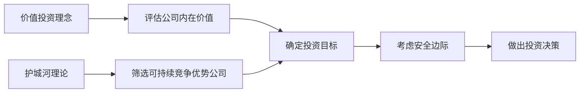

# 巴菲特的跨界投资：从纺织到科技的转变

> 关键词：巴菲特、跨界投资、纺织业、科技行业、投资策略、价值投资、投资转变

> 摘要：本文深入探讨了巴菲特从纺织业跨界到科技行业的投资转变历程。首先介绍了这一投资转变的背景，包括相关目的、预期读者等内容。接着阐述了巴菲特投资理念中的核心概念及其联系，分析了他在不同阶段投资所依据的核心算法原理与具体操作步骤。通过数学模型和公式对其投资决策背后的逻辑进行详细讲解，并举例说明。然后结合实际案例，对巴菲特跨界投资的代码（投资决策过程类比）进行详细实现和解读。探讨了其跨界投资在实际中的应用场景，推荐了相关的学习资源、开发工具框架以及论文著作。最后总结了未来投资领域的发展趋势与挑战，解答常见问题，并提供扩展阅读和参考资料，旨在全面剖析巴菲特这一具有深远影响的投资转变过程及其背后的投资智慧。

## 1. 背景介绍 
### 1.1 目的和范围
本研究的主要目的是深入剖析巴菲特从纺织业跨界到科技行业这一投资转变的过程、原因、策略以及影响。通过对其投资决策的详细分析，揭示巴菲特投资理念的演变和适应市场变化的能力。研究范围涵盖了巴菲特在纺织业和科技行业的主要投资案例，包括投资时机、投资金额、投资对象的选择等方面，同时探讨这一转变对其投资组合和财富增长的影响，以及对整个投资界的启示。

### 1.2 预期读者
本文预期读者包括对投资领域感兴趣的专业投资者、金融从业者、经济学者以及普通的投资爱好者。对于专业投资者和金融从业者，本文可以为他们提供对巴菲特投资策略的深入理解，启发他们在投资决策中更好地适应市场变化。经济学者可以从本文中获取有关投资行为和市场趋势的研究素材。普通投资爱好者则可以通过本文了解巴菲特的投资智慧，学习如何进行理性投资。

### 1.3 文档结构概述
本文首先介绍巴菲特跨界投资转变的背景信息，包括目的、预期读者和文档结构等。接着阐述核心概念与联系，解释巴菲特投资理念中的关键概念及其相互关系。然后详细讲解核心算法原理和具体操作步骤，通过 Python 代码示例说明其投资决策的逻辑。再运用数学模型和公式对投资决策进行量化分析，并举例说明。之后通过实际案例展示巴菲特跨界投资的具体实施和效果。随后探讨其在实际中的应用场景。推荐相关的学习资源、开发工具框架和论文著作。最后总结未来投资领域的发展趋势与挑战，解答常见问题，并提供扩展阅读和参考资料。

### 1.4 术语表
#### 1.4.1 核心术语定义
- **价值投资**：一种投资策略，基于对公司内在价值的评估，寻找价格低于其内在价值的股票进行投资，期望在长期内获得价值回归带来的收益。
- **护城河理论**：由巴菲特提出，指企业所拥有的一种可持续的竞争优势，使其在市场中能够抵御竞争对手的侵蚀，保持长期的盈利能力。
- **安全边际**：在投资中，安全边际是指股票的市场价格低于其内在价值的幅度，它为投资者提供了一定的缓冲空间，降低投资风险。

#### 1.4.2 相关概念解释
- **纺织业**：传统的制造业领域，主要从事纺织品的生产和加工，具有劳动密集型、技术相对成熟、市场竞争激烈等特点。
- **科技行业**：以科学技术为核心驱动力的行业，包括信息技术、生物技术、新能源技术等多个领域，具有创新性强、发展速度快、不确定性高等特点。

#### 1.4.3 缩略词列表
- **ROE**：Return on Equity，净资产收益率，衡量公司盈利能力的重要指标，反映股东权益的收益水平。
- **PE**：Price-to-Earnings Ratio，市盈率，指股票价格除以每股收益的比率，用于评估股票的估值水平。

## 2. 核心概念与联系 

### 2.1 价值投资理念
价值投资是巴菲特投资理念的核心。其基本原理是通过对公司基本面的深入分析，评估公司的内在价值。内在价值是指公司未来现金流的折现价值，它反映了公司的真实经济价值。巴菲特认为，股票市场是波动的，价格会受到市场情绪、宏观经济环境等多种因素的影响而偏离其内在价值。投资者的任务就是寻找那些价格低于内在价值的股票，即具有安全边际的股票进行投资。

### 2.2 护城河理论
护城河理论是价值投资的重要补充。巴菲特认为，一个具有可持续竞争优势的企业就像拥有一条坚固的护城河，能够抵御竞争对手的攻击，保持长期的盈利能力。护城河的来源包括品牌优势、成本优势、技术优势、网络效应等。例如，可口可乐的品牌优势使其在饮料市场具有强大的竞争力，能够长期保持较高的市场份额和利润率。

### 2.3 安全边际与投资决策
安全边际是巴菲特投资决策中的重要考量因素。它为投资者提供了一定的缓冲空间，降低了投资风险。当股票价格低于其内在价值时，投资者可以以较低的价格买入股票，即使未来公司的发展出现一些偏差，也能保证一定的投资回报。例如，如果一家公司的内在价值为每股 100 元，而当前市场价格为每股 60 元，那么 40 元的差价就是安全边际。

### 2.4 核心概念联系的文本示意图
价值投资理念是基础，通过对公司内在价值的评估确定投资目标。护城河理论用于筛选具有可持续竞争优势的公司，确保投资的长期稳定性。安全边际则是在投资决策中考虑的重要因素，它结合价值投资和护城河理论，为投资者提供了一个合理的买入价格区间。三者相互关联、相互影响，共同构成了巴菲特的投资决策体系。

### 2.5 核心概念联系的 Mermaid 流程图


## 3. 核心算法原理 & 具体操作步骤 

### 3.1 评估公司内在价值的算法原理
评估公司内在价值的常用方法是现金流折现法（DCF）。其基本原理是将公司未来的现金流按照一定的折现率折现到当前时刻，得到公司的内在价值。公式如下：

$$V = \sum_{t=1}^{n} \frac{CF_t}{(1 + r)^t}$$

其中，$V$ 表示公司的内在价值，$CF_t$ 表示第 $t$ 期的现金流，$r$ 表示折现率，$n$ 表示预测的期数。

### 3.2 Python 代码实现评估公司内在价值
```python
def calculate_intrinsic_value(cash_flows, discount_rate):
    """
    计算公司的内在价值
    :param cash_flows: 未来各期的现金流列表
    :param discount_rate: 折现率
    :return: 公司的内在价值
    """
    intrinsic_value = 0
    for t, cf in enumerate(cash_flows, start=1):
        intrinsic_value += cf / (1 + discount_rate) ** t
    return intrinsic_value

# 示例数据
cash_flows = [100, 120, 130, 140, 150]  # 未来 5 年的现金流
discount_rate = 0.1  # 折现率为 10%

# 计算内在价值
intrinsic_value = calculate_intrinsic_value(cash_flows, discount_rate)
print(f"公司的内在价值为: {intrinsic_value}")
```

### 3.3 筛选具有护城河的公司
在筛选具有护城河的公司时，需要综合考虑多个因素。例如，可以通过分析公司的财务报表，查看其毛利率、净利率、ROE 等指标是否长期保持稳定且高于行业平均水平。还可以研究公司的市场份额、品牌知名度、技术专利等方面的情况。

### 3.4 确定安全边际并做出投资决策
确定安全边际的关键是比较股票的市场价格和内在价值。当市场价格低于内在价值一定比例时，认为存在安全边际。例如，如果设定安全边际为 30%，当股票市场价格低于内在价值的 70% 时，可以考虑买入。

```python
def determine_safety_margin(intrinsic_value, market_price, safety_margin_percentage):
    """
    确定是否存在安全边际
    :param intrinsic_value: 公司的内在价值
    :param market_price: 股票的市场价格
    :param safety_margin_percentage: 安全边际百分比
    :return: 是否存在安全边际
    """
    threshold = intrinsic_value * (1 - safety_margin_percentage)
    return market_price < threshold

# 示例数据
market_price = 80
safety_margin_percentage = 0.3

# 确定是否存在安全边际
has_safety_margin = determine_safety_margin(intrinsic_value, market_price, safety_margin_percentage)
if has_safety_margin:
    print("存在安全边际，可以考虑买入")
else:
    print("不存在安全边际，不建议买入")
```

## 4. 数学模型和公式 & 详细讲解 & 举例说明 

### 4.1 现金流折现法（DCF）公式详解
现金流折现法的公式为：

$$V = \sum_{t=1}^{n} \frac{CF_t}{(1 + r)^t}$$

其中：
- $V$：公司的内在价值，即公司未来现金流的现值总和。
- $CF_t$：第 $t$ 期的现金流，它反映了公司在该时期内的现金流入和流出情况。现金流的预测需要综合考虑公司的业务模式、市场前景、竞争环境等因素。
- $r$：折现率，它反映了资金的时间价值和投资的风险。折现率越高，未来现金流的现值越低，说明投资者对风险的要求越高。
- $n$：预测的期数，通常根据公司的发展阶段和行业特点来确定。对于成熟的公司，可以预测较长的期数；对于新兴的公司，由于不确定性较大，预测期数可能较短。

### 4.2 举例说明现金流折现法的应用
假设一家公司未来 5 年的现金流分别为 100 万元、120 万元、130 万元、140 万元和 150 万元，折现率为 10%。我们可以使用上述公式计算该公司的内在价值：

$$V = \frac{100}{(1 + 0.1)^1} + \frac{120}{(1 + 0.1)^2} + \frac{130}{(1 + 0.1)^3} + \frac{140}{(1 + 0.1)^4} + \frac{150}{(1 + 0.1)^5}$$

```python
import math

cash_flows = [100, 120, 130, 140, 150]
discount_rate = 0.1
intrinsic_value = 0
for t, cf in enumerate(cash_flows, start=1):
    intrinsic_value += cf / (1 + discount_rate) ** t

print(f"公司的内在价值为: {intrinsic_value} 万元")
```

### 4.3 市盈率（PE）模型
市盈率是另一种常用的估值方法，其公式为：

$$PE = \frac{P}{E}$$

其中：
- $PE$：市盈率，反映了市场对公司盈利的预期。
- $P$：股票价格。
- $E$：每股收益。

通过比较公司的市盈率与行业平均市盈率，可以判断公司的估值水平。如果公司的市盈率低于行业平均市盈率，可能意味着公司被低估。

### 4.4 举例说明市盈率模型的应用
假设某公司的股票价格为 50 元，每股收益为 5 元，则该公司的市盈率为：

$$PE = \frac{50}{5} = 10$$

如果该行业的平均市盈率为 15，说明该公司的估值相对较低，可能具有投资价值。

## 5. 项目实战：代码实际案例和详细解释说明 

### 5.1  开发环境搭建
为了实现巴菲特投资策略的代码案例，我们可以使用 Python 语言进行开发。以下是搭建开发环境的步骤：
1. **安装 Python**：从 Python 官方网站（https://www.python.org/downloads/）下载并安装 Python 3.x 版本。
2. **安装开发工具**：可以选择使用 PyCharm、VS Code 等集成开发环境（IDE），或者使用 Jupyter Notebook 进行交互式开发。
3. **安装必要的库**：在命令行中使用以下命令安装必要的库：
```sh
pip install pandas numpy matplotlib
```

### 5.2  源代码详细实现和代码解读
以下是一个完整的代码示例，用于模拟巴菲特的投资决策过程：

```python
import pandas as pd
import numpy as np
import matplotlib.pyplot as plt

# 模拟公司数据
data = {
    'Year': [2016, 2017, 2018, 2019, 2020],
    'CashFlow': [100, 120, 130, 140, 150],
    'MarketPrice': [80, 90, 100, 110, 120]
}
df = pd.DataFrame(data)

# 计算内在价值
discount_rate = 0.1
cash_flows = df['CashFlow'].values
intrinsic_value = 0
for t, cf in enumerate(cash_flows, start=1):
    intrinsic_value += cf / (1 + discount_rate) ** t

# 确定安全边际
safety_margin_percentage = 0.3
threshold = intrinsic_value * (1 - safety_margin_percentage)

# 判断是否存在安全边际并记录投资决策
df['HasSafetyMargin'] = df['MarketPrice'] < threshold
df['InvestDecision'] = df['HasSafetyMargin'].apply(lambda x: 'Buy' if x else 'Not Buy')

# 可视化结果
plt.figure(figsize=(10, 6))
plt.plot(df['Year'], df['MarketPrice'], label='Market Price')
plt.axhline(y=threshold, color='r', linestyle='--', label='Safety Margin Threshold')
plt.xlabel('Year')
plt.ylabel('Price')
plt.title('Investment Decision Based on Safety Margin')
plt.legend()
plt.show()

print(df)
```

### 5.3  代码解读与分析
1. **数据模拟**：使用 `pandas` 库创建一个包含公司历年现金流和市场价格的数据框。
2. **计算内在价值**：使用现金流折现法计算公司的内在价值。
3. **确定安全边际**：根据设定的安全边际百分比，计算安全边际阈值。
4. **判断投资决策**：根据市场价格与安全边际阈值的比较，判断是否存在安全边际，并记录投资决策。
5. **可视化结果**：使用 `matplotlib` 库绘制市场价格和安全边际阈值的折线图，直观展示投资决策过程。

通过这个代码示例，我们可以看到如何根据巴菲特的投资理念进行投资决策，并通过可视化工具展示决策结果。

## 6. 实际应用场景 
### 6.1 传统行业投资
在传统行业中，如纺织业，巴菲特的价值投资理念和护城河理论具有重要的应用价值。在投资纺织企业时，他会深入分析企业的财务状况、品牌优势、成本控制能力等因素，寻找具有可持续竞争优势的企业。例如，在早期投资纺织企业时，他关注企业的生产效率、产品质量和市场份额，选择那些具有稳定现金流和较高毛利率的企业进行投资。

### 6.2 科技行业投资
随着科技行业的快速发展，巴菲特也逐渐涉足该领域。在投资科技企业时，他同样注重企业的内在价值和护城河。例如，他投资苹果公司，不仅考虑了苹果公司的财务状况和市场份额，还看重其强大的品牌优势、创新能力和生态系统。苹果公司的品牌忠诚度高，产品具有较高的附加值，形成了强大的护城河，这符合巴菲特的投资理念。

### 6.3 多元化投资组合构建
巴菲特的投资策略还可以应用于多元化投资组合的构建。通过在不同行业中寻找具有投资价值的企业，分散投资风险。例如，他的投资组合中既包括传统行业的企业，如可口可乐、富国银行等，也包括科技行业的企业，如苹果公司。这种多元化的投资组合可以在不同市场环境下保持稳定的收益。

### 6.4 长期投资决策
巴菲特的投资理念强调长期投资。他认为，只要企业的基本面没有发生变化，就应该长期持有其股票。在实际应用中，投资者可以根据企业的内在价值和护城河情况，做出长期投资决策。例如，对于那些具有强大护城河的企业，即使短期内股票价格波动较大，也可以坚定持有，等待价值回归。

## 7. 工具和资源推荐
### 7.1 学习资源推荐
#### 7.1.1 书籍推荐
- 《聪明的投资者》（The Intelligent Investor）：作者本杰明·格雷厄姆（Benjamin Graham），是价值投资领域的经典著作，对巴菲特的投资理念产生了深远影响。
- 《巴菲特致股东的信》（Letters to Shareholders of Berkshire Hathaway）：收录了巴菲特历年写给股东的信，详细阐述了他的投资策略和理念。
- 《滚雪球：巴菲特和他的财富人生》（The Snowball: Warren Buffett and the Business of Life）：作者艾丽斯·施罗德（Alice Schroeder），通过深入采访巴菲特及其身边的人，生动地展现了巴菲特的人生历程和投资智慧。

#### 7.1.2 在线课程
- Coursera 上的“Investment Management Specialization”：由宾夕法尼亚大学沃顿商学院的教授授课，涵盖了投资管理的各个方面，包括价值投资、资产定价等内容。
- edX 上的“Introduction to Financial Markets”：由耶鲁大学的教授授课，介绍了金融市场的基本概念和投资原理，对理解巴菲特的投资理念有很大帮助。

#### 7.1.3 技术博客和网站
- Seeking Alpha（https://seekingalpha.com/）：一个专业的投资研究平台，提供了大量的股票分析、投资策略和市场评论文章。
- ValueWalk（https://www.valuewalk.com/）：专注于价值投资领域，分享了许多关于巴菲特和其他价值投资者的观点和研究成果。

### 7.2 开发工具框架推荐
#### 7.2.1 IDE和编辑器
- PyCharm：一款专业的 Python 集成开发环境，提供了丰富的代码编辑、调试和项目管理功能，适合开发复杂的投资分析程序。
- VS Code：一款轻量级的代码编辑器，支持多种编程语言，通过安装相关插件可以实现 Python 开发的各种功能。

#### 7.2.2 调试和性能分析工具
- pdb：Python 自带的调试器，可以帮助开发者在代码中设置断点，逐步执行代码，查找问题。
- cProfile：Python 标准库中的性能分析工具，可以分析代码的运行时间和函数调用情况，帮助优化代码性能。

#### 7.2.3 相关框架和库
- pandas：用于数据处理和分析的 Python 库，提供了高效的数据结构和数据操作方法，适合处理投资数据。
- numpy：用于科学计算的 Python 库，提供了高效的数组操作和数学函数，在投资分析中可以用于计算统计指标和进行数值模拟。
- matplotlib：用于数据可视化的 Python 库，可以绘制各种类型的图表，直观展示投资数据和分析结果。

### 7.3 相关论文著作推荐
#### 7.3.1 经典论文
- “The Superinvestors of Graham-and-Doddsville”：作者沃伦·巴菲特（Warren Buffett），阐述了价值投资的有效性和成功案例。
- “Common Stocks and Uncommon Profits”：作者菲利普·费雪（Philip Fisher），提出了成长股投资的理念和方法，对巴菲特的投资理念有一定的影响。

#### 7.3.2 最新研究成果
- 可以关注《Journal of Financial Economics》《The Review of Financial Studies》等金融领域的顶级学术期刊，了解关于投资策略和市场行为的最新研究成果。

#### 7.3.3 应用案例分析
- 许多金融研究机构和咨询公司会发布关于巴菲特投资案例的分析报告，可以通过搜索相关机构的网站获取这些资料。

## 8. 总结：未来发展趋势与挑战
### 8.1 未来发展趋势
- **科技行业投资增加**：随着科技的不断进步，科技行业将继续成为投资的热点领域。巴菲特等投资者可能会加大对科技企业的投资，尤其是那些具有创新能力和强大护城河的企业。
- **可持续投资兴起**：投资者越来越关注企业的社会责任和可持续发展。未来，可持续投资可能会成为主流投资策略之一，巴菲特的投资理念也可能会在这方面进行调整和拓展。
- **量化投资与价值投资融合**：量化投资通过大数据和算法模型进行投资决策，具有高效、客观的特点。未来，量化投资可能会与价值投资相结合，形成更加科学、精准的投资策略。

### 8.2 挑战
- **科技行业的不确定性**：科技行业发展迅速，技术更新换代快，企业面临的竞争和不确定性较大。投资者需要具备更强的技术洞察力和风险评估能力，才能准确判断科技企业的投资价值。
- **市场波动加剧**：全球经济和政治环境的不确定性增加，市场波动加剧。投资者需要更加灵活地调整投资策略，应对市场变化。
- **可持续投资标准的统一**：可持续投资涉及到多个维度的评估标准，目前还没有统一的标准和方法。投资者需要在不同的标准之间进行权衡和选择，增加了投资决策的难度。

## 9. 附录：常见问题与解答
### 9.1 巴菲特为什么要从纺织业跨界到科技行业投资？
随着时代的发展，纺织业作为传统行业面临着市场竞争激烈、成本上升等问题，行业增长空间有限。而科技行业具有创新性强、发展速度快等特点，蕴含着巨大的投资机会。巴菲特为了适应市场变化，寻找更具潜力的投资领域，逐渐从纺织业跨界到科技行业投资。

### 9.2 如何判断一个企业是否具有护城河？
可以从多个方面判断一个企业是否具有护城河。例如，查看企业的财务报表，分析其毛利率、净利率、ROE 等指标是否长期保持稳定且高于行业平均水平。研究企业的市场份额、品牌知名度、技术专利等方面的情况。还可以考虑企业的业务模式、客户忠诚度等因素。

### 9.3 现金流折现法中的折现率如何确定？
折现率的确定需要综合考虑多个因素，包括无风险利率、市场风险溢价、企业的特定风险等。无风险利率可以参考国债收益率等指标。市场风险溢价反映了投资者对市场整体风险的预期。企业的特定风险则需要根据企业的行业特点、财务状况、经营稳定性等因素进行评估。

### 9.4 价值投资是否适用于所有市场环境？
价值投资在大多数市场环境下都具有一定的适用性。但在市场非理性波动较大的情况下，股票价格可能会长期偏离其内在价值，价值投资策略可能会面临短期的挑战。不过，从长期来看，价值投资仍然是一种有效的投资策略。

## 10. 扩展阅读 & 参考资料
### 10.1 扩展阅读
- 《金融炼金术》（The Alchemy of Finance）：作者乔治·索罗斯（George Soros），探讨了金融市场的运行规律和投资者的行为模式。
- 《黑天鹅：如何应对不可预知的未来》（The Black Swan: The Impact of the Highly Improbable）：作者纳西姆·尼古拉斯·塔勒布（Nassim Nicholas Taleb），分析了不确定性事件对金融市场和投资决策的影响。

### 10.2 参考资料
- 巴菲特历年的年报和致股东的信。
- 相关的金融研究报告和学术论文。
- 财经媒体的报道和分析文章。