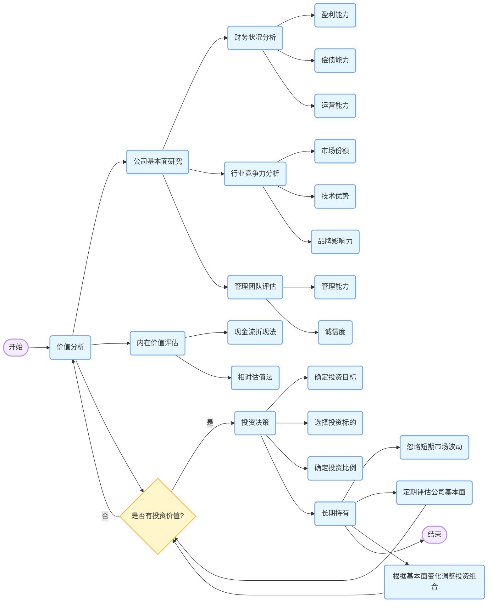

# 巴菲特的集中投资策略：利弊分析

> 关键词：巴菲特、集中投资策略、利弊分析、价值投资、投资组合

> 摘要：本文聚焦于巴菲特的集中投资策略，深入剖析其利弊。首先介绍了该策略产生的背景、适用读者以及文档整体结构，明确相关术语概念。接着阐述集中投资策略的核心概念与联系，用文本示意图和Mermaid流程图展示其架构。通过Python代码详细讲解核心算法原理和具体操作步骤，并运用数学模型和公式进一步阐释。结合实际项目案例，从开发环境搭建到源代码实现及解读，全面呈现该策略在实际中的应用。探讨了集中投资策略的实际应用场景，推荐了相关学习资源、开发工具框架和论文著作。最后总结其未来发展趋势与挑战，解答常见问题并提供扩展阅读与参考资料，帮助读者全面理解巴菲特集中投资策略的利弊。

## 1. 背景介绍 
### 1.1 目的和范围
巴菲特的集中投资策略在投资界具有广泛而深远的影响。本文章的目的在于深入、全面地剖析这一策略的利弊，为投资者提供一个清晰、客观的视角，帮助他们在决策过程中更好地权衡和应用这一策略。范围涵盖了该策略的核心概念、算法原理、数学模型、实际应用案例等多个方面，同时还涉及到与该策略相关的学习资源、开发工具以及研究成果等内容。

### 1.2 预期读者
本文预期读者包括各类投资者，无论是初涉投资领域的新手，还是经验丰富的专业投资者，都能从本文中获得有价值的信息。对于新手投资者，本文可以帮助他们了解巴菲特集中投资策略的基本原理和操作方法，为他们的投资之路提供指引；对于专业投资者，本文深入的利弊分析和实际案例解读，可以为他们优化投资组合、调整投资策略提供参考。此外，金融专业的学生、研究人员以及对投资领域感兴趣的人士也可以从本文中获取相关的知识和见解。

### 1.3 文档结构概述
本文共分为十个部分。第一部分为背景介绍，包括目的和范围、预期读者、文档结构概述以及术语表。第二部分阐述核心概念与联系，通过文本示意图和Mermaid流程图展示集中投资策略的架构。第三部分详细讲解核心算法原理和具体操作步骤，并给出Python源代码示例。第四部分运用数学模型和公式对该策略进行深入分析，并举例说明。第五部分是项目实战，包括开发环境搭建、源代码详细实现和代码解读。第六部分探讨实际应用场景。第七部分推荐相关的工具和资源，包括学习资源、开发工具框架和论文著作。第八部分总结未来发展趋势与挑战。第九部分为附录，解答常见问题。第十部分提供扩展阅读和参考资料。

### 1.4 术语表
#### 1.4.1 核心术语定义
- **集中投资策略**：是指投资者将大部分资金集中投资于少数几只经过深入研究和分析后认为具有高价值的股票，而不是分散投资于众多股票的一种投资策略。
- **价值投资**：强调以低于股票内在价值的价格买入股票，并长期持有，等待股票价格回归或超过其内在价值，从而获得投资收益。
- **投资组合**：是指投资者将不同的资产（如股票、债券、基金等）按照一定的比例组合在一起，以达到分散风险、实现收益最大化的目的。

#### 1.4.2 相关概念解释
- **内在价值**：是指股票所代表的公司的真实价值，它基于公司的基本面因素，如财务状况、盈利能力、行业前景等。内在价值是价值投资的核心概念，投资者通过分析公司的内在价值来判断股票的投资价值。
- **安全边际**：是指股票的市场价格低于其内在价值的部分。安全边际是价值投资的重要原则之一，它为投资者提供了一定的缓冲，降低了投资风险。

#### 1.4.3 缩略词列表
- **PE**：市盈率，是指股票价格与每股收益的比率，用于衡量股票的估值水平。
- **PB**：市净率，是指股票价格与每股净资产的比率，也是衡量股票估值的重要指标之一。

## 2. 核心概念与联系 
### 核心概念原理
巴菲特的集中投资策略基于价值投资的理念。其核心原理是通过深入研究和分析，寻找那些具有长期竞争优势、管理团队优秀、财务状况良好且市场价格低于其内在价值的公司。一旦发现这样的公司，投资者就将大部分资金集中投资于这些公司的股票，并长期持有。

这种策略的理论基础在于，优秀的公司在长期内往往能够创造出稳定的现金流和持续的增长，其股票价格也会随着公司价值的提升而上涨。通过集中投资，投资者可以充分分享这些优秀公司的成长红利，获得高于市场平均水平的投资收益。

### 架构的文本示意图
```plaintext
集中投资策略
|
|-- 价值分析
|   |-- 公司基本面研究
|   |   |-- 财务状况分析
|   |   |   |-- 盈利能力（如净利润率、ROE等）
|   |   |   |-- 偿债能力（如资产负债率等）
|   |   |   |-- 运营能力（如存货周转率等）
|   |   |-- 行业竞争力分析
|   |   |   |-- 市场份额
|   |   |   |-- 技术优势
|   |   |   |-- 品牌影响力
|   |   |-- 管理团队评估
|   |       |-- 管理能力
|   |       |-- 诚信度
|   |-- 内在价值评估
|       |-- 现金流折现法
|       |-- 相对估值法（如PE、PB等）
|
|-- 投资决策
|   |-- 确定投资目标
|   |-- 选择投资标的
|   |-- 确定投资比例
|
|-- 长期持有
|   |-- 忽略短期市场波动
|   |-- 定期评估公司基本面
|   |-- 根据基本面变化调整投资组合
```

### Mermaid流程图


## 3. 核心算法原理 & 具体操作步骤 
### 核心算法原理
集中投资策略的核心算法主要围绕价值评估展开，其中现金流折现法是常用的价值评估方法之一。现金流折现法的基本原理是将公司未来的现金流按照一定的折现率折现到当前时刻，从而得到公司的内在价值。

### 具体操作步骤
1. **预测未来现金流**：分析公司的历史财务数据、行业发展趋势、公司战略规划等因素，预测公司未来若干年的自由现金流。
2. **确定折现率**：折现率反映了投资者对投资回报的要求，通常可以采用资本资产定价模型（CAPM）来确定。
3. **计算现金流现值**：将预测的未来现金流按照确定的折现率折现到当前时刻，得到现金流现值。
4. **计算内在价值**：将各年现金流现值相加，得到公司的内在价值。

### Python源代码示例
```python
import numpy as np

def calculate_intrinsic_value(free_cash_flows, discount_rate):
    """
    计算公司的内在价值
    :param free_cash_flows: 未来各年的自由现金流列表
    :param discount_rate: 折现率
    :return: 公司的内在价值
    """
    num_years = len(free_cash_flows)
    present_values = []
    for i in range(num_years):
        present_value = free_cash_flows[i] / ((1 + discount_rate) ** (i + 1))
        present_values.append(present_value)
    intrinsic_value = np.sum(present_values)
    return intrinsic_value

# 示例数据
free_cash_flows = [100, 120, 150, 180, 200]  # 未来5年的自由现金流
discount_rate = 0.1  # 折现率为10%

intrinsic_value = calculate_intrinsic_value(free_cash_flows, discount_rate)
print(f"公司的内在价值为: {intrinsic_value}")
```

### 代码解释
1. **函数定义**：`calculate_intrinsic_value` 函数接受两个参数，`free_cash_flows` 表示未来各年的自由现金流列表，`discount_rate` 表示折现率。
2. **计算现金流现值**：通过循环遍历未来各年的自由现金流，将其按照折现率折现到当前时刻，并将现值存储在 `present_values` 列表中。
3. **计算内在价值**：使用 `np.sum` 函数将各年现金流现值相加，得到公司的内在价值。
4. **示例数据和结果输出**：定义了未来5年的自由现金流和折现率，并调用 `calculate_intrinsic_value` 函数计算公司的内在价值，最后将结果打印输出。

## 4. 数学模型和公式 & 详细讲解 & 举例说明 
### 现金流折现法的数学模型和公式
现金流折现法的基本公式为：
$$
V = \sum_{t=1}^{n} \frac{FCF_t}{(1 + r)^t}
$$
其中，$V$ 表示公司的内在价值，$FCF_t$ 表示第 $t$ 年的自由现金流，$r$ 表示折现率，$n$ 表示预测的年数。

### 详细讲解
- **自由现金流（$FCF_t$）**：是指公司在满足了所有运营成本和资本支出后剩余的现金流量，它反映了公司实际可用于分配给股东或进行再投资的现金数量。
- **折现率（$r$）**：是投资者要求的必要回报率，它考虑了投资的风险和机会成本。折现率越高，未来现金流的现值就越低。
- **预测年数（$n$）**：是指投资者预测公司未来现金流的时间范围。通常，预测年数越长，不确定性就越大。

### 举例说明
假设一家公司未来5年的自由现金流分别为100万元、120万元、150万元、180万元和200万元，折现率为10%。根据现金流折现法的公式，计算该公司的内在价值如下：

第1年现金流现值：$PV_1 = \frac{100}{(1 + 0.1)^1} \approx 90.91$（万元）

第2年现金流现值：$PV_2 = \frac{120}{(1 + 0.1)^2} \approx 99.17$（万元）

第3年现金流现值：$PV_3 = \frac{150}{(1 + 0.1)^3} \approx 112.69$（万元）

第4年现金流现值：$PV_4 = \frac{180}{(1 + 0.1)^4} \approx 122.94$（万元）

第5年现金流现值：$PV_5 = \frac{200}{(1 + 0.1)^5} \approx 124.18$（万元）

公司内在价值：$V = PV_1 + PV_2 + PV_3 + PV_4 + PV_5 \approx 90.91 + 99.17 + 112.69 + 122.94 + 124.18 = 549.89$（万元）

通过以上计算，我们可以得出该公司的内在价值约为549.89万元。如果该公司的市场价格低于这个内在价值，那么从价值投资的角度来看，该公司的股票可能具有投资价值。

## 5. 项目实战：代码实际案例和详细解释说明 
### 5.1  开发环境搭建
#### 安装Python
首先，需要安装Python开发环境。可以从Python官方网站（https://www.python.org/downloads/）下载适合自己操作系统的Python安装包，并按照安装向导进行安装。

#### 安装必要的库
在进行集中投资策略的项目实战时，需要使用一些Python库来进行数据处理、分析和可视化。可以使用以下命令来安装这些库：
```sh
pip install numpy pandas matplotlib
```
- **numpy**：用于进行数值计算和数组操作。
- **pandas**：用于数据处理和分析。
- **matplotlib**：用于数据可视化。

### 5.2  源代码详细实现和代码解读
以下是一个简单的集中投资策略的项目实战代码示例，用于模拟集中投资的过程并分析投资收益。

```python
import numpy as np
import pandas as pd
import matplotlib.pyplot as plt

# 模拟股票数据
np.random.seed(0)
num_stocks = 5  # 选择5只股票进行集中投资
num_periods = 252  # 模拟一年的交易日
stock_prices = pd.DataFrame()
for i in range(num_stocks):
    stock_prices[f'Stock_{i+1}'] = np.random.normal(1, 0.01, num_periods).cumprod()

# 初始投资金额
initial_investment = 100000

# 确定投资比例
investment_weights = np.array([0.2, 0.2, 0.2, 0.2, 0.2])  # 平均分配投资比例

# 计算每只股票的投资金额
stock_investments = initial_investment * investment_weights

# 计算每只股票的持有数量
stock_quantities = stock_investments / stock_prices.iloc[0]

# 计算投资组合的价值
portfolio_value = (stock_prices * stock_quantities).sum(axis=1)

# 绘制投资组合价值的变化曲线
plt.figure(figsize=(10, 6))
plt.plot(portfolio_value)
plt.title('Portfolio Value over Time')
plt.xlabel('Trading Days')
plt.ylabel('Portfolio Value')
plt.grid(True)
plt.show()

# 计算投资组合的收益率
portfolio_returns = portfolio_value.pct_change()
annualized_return = (1 + portfolio_returns.mean()) ** 252 - 1
print(f"年化收益率: {annualized_return * 100:.2f}%")
```

### 5.3  代码解读与分析
#### 模拟股票数据
使用 `np.random.normal` 函数模拟了5只股票一年（252个交易日）的价格走势，并将其存储在 `stock_prices` 数据框中。

#### 确定投资比例
将初始投资金额平均分配到5只股票上，即每只股票的投资比例为20%。

#### 计算每只股票的投资金额和持有数量
根据投资比例计算每只股票的投资金额，并通过初始股价计算每只股票的持有数量。

#### 计算投资组合的价值
将每只股票的价格乘以持有数量，然后求和得到投资组合的价值。

#### 绘制投资组合价值的变化曲线
使用 `matplotlib` 库绘制投资组合价值随时间的变化曲线，直观展示投资组合的表现。

#### 计算投资组合的收益率
计算投资组合的每日收益率，并通过年化公式计算年化收益率。

通过以上代码，我们可以模拟集中投资的过程，并分析投资组合的表现。在实际应用中，需要根据真实的股票数据和投资策略进行调整。

## 6. 实际应用场景 
### 长期价值投资
巴菲特的集中投资策略最适合长期价值投资者。对于那些相信优秀公司的长期增长潜力，并且愿意长期持有股票的投资者来说，集中投资可以让他们充分分享优秀公司的成长红利。例如，巴菲特长期持有可口可乐、富国银行等公司的股票，通过集中投资获得了丰厚的回报。

### 专业投资者
专业投资者通常具有较强的研究能力和风险承受能力，他们可以运用集中投资策略，通过深入研究和分析，选择少数几只具有高投资价值的股票进行集中投资。专业投资者还可以根据市场情况和公司基本面的变化，及时调整投资组合，以实现投资收益的最大化。

### 资金规模较大的投资者
对于资金规模较大的投资者来说，分散投资可能会导致投资过于分散，难以实现显著的投资收益。而集中投资可以让他们将资金集中在少数几只优质股票上，提高资金的使用效率，从而获得更高的投资回报。

### 市场环境稳定时期
在市场环境稳定、经济增长趋势明确的时期，集中投资策略更容易发挥作用。因为在这种环境下，优秀公司的基本面相对稳定，其股票价格也更容易反映其内在价值。投资者可以通过集中投资这些优秀公司的股票，获得稳定的投资收益。

## 7. 工具和资源推荐
### 7.1 学习资源推荐
#### 7.1.1 书籍推荐
- 《聪明的投资者》（The Intelligent Investor）：作者是本杰明·格雷厄姆（Benjamin Graham），这本书是价值投资领域的经典之作，被巴菲特称为“有史以来最伟大的投资著作”。书中介绍了价值投资的基本理念和方法，对巴菲特的投资思想产生了深远的影响。
- 《巴菲特致股东的信：股份公司教程》（Letters to Shareholders of Berkshire Hathaway）：这本书收集了巴菲特历年致股东的信，通过这些信件，读者可以深入了解巴菲特的投资理念、策略和方法，以及他对市场、公司和经济的看法。
- 《怎样选择成长股》（Common Stocks and Uncommon Profits）：作者是菲利普·费雪（Philip Fisher），这本书介绍了寻找成长股的方法和技巧，对巴菲特的投资策略也产生了重要的影响。

#### 7.1.2 在线课程
- Coursera上的“投资学原理”（Principles of Investing）：该课程由耶鲁大学教授罗伯特·席勒（Robert Shiller）主讲，介绍了投资的基本原理和方法，包括资产定价、投资组合理论、风险管理等内容。
- edX上的“价值投资基础”（Foundations of Value Investing）：该课程由哥伦比亚大学教授布鲁斯·格林沃尔德（Bruce Greenwald）主讲，深入讲解了价值投资的理念、方法和实践。

#### 7.1.3 技术博客和网站
- 雪球网（https://xueqiu.com/）：是国内知名的投资社区，提供股票、基金、债券等多种投资品种的信息和分析，用户可以在上面交流投资经验和心得。
- 价值投资网（https://www.value-investing.info/）：专注于价值投资领域，提供价值投资的理论、方法、案例等方面的内容，是价值投资者学习和交流的重要平台。

### 7.2 开发工具框架推荐
#### 7.2.1 IDE和编辑器
- PyCharm：是一款专业的Python集成开发环境（IDE），具有强大的代码编辑、调试、自动补全、代码分析等功能，适合开发Python投资分析程序。
- Jupyter Notebook：是一个交互式的开发环境，支持Python、R等多种编程语言，适合进行数据探索、分析和可视化。

#### 7.2.2 调试和性能分析工具
- PDB：是Python自带的调试器，可以帮助开发者定位和解决代码中的问题。
- cProfile：是Python的性能分析工具，可以分析代码的运行时间和函数调用情况，帮助开发者优化代码性能。

#### 7.2.3 相关框架和库
- Pandas：是Python中用于数据处理和分析的重要库，提供了丰富的数据结构和函数，方便进行数据清洗、转换、分析和可视化。
- NumPy：是Python中用于数值计算的基础库，提供了高效的多维数组对象和各种数学函数，是许多科学计算和数据分析库的基础。
- Matplotlib：是Python中用于数据可视化的库，提供了丰富的绘图函数和工具，可用于绘制各种类型的图表。

### 7.3 相关论文著作推荐
#### 7.3.1 经典论文
- “The Security Market Line: Another View”（《证券市场线：另一种视角》）：作者是迈克尔·詹森（Michael Jensen），该论文对资本资产定价模型（CAPM）进行了深入的分析和批判，提出了一种新的视角来理解证券市场的风险和收益关系。
- “The Cross-Section of Expected Stock Returns”（《股票预期收益率的横截面分析》）：作者是尤金·法玛（Eugene F. Fama）和肯尼斯·弗兰奇（Kenneth R. French），该论文提出了著名的三因子模型，解释了股票收益率的横截面差异。

#### 7.3.2 最新研究成果
- “Factor Investing: From Academic Theory to Industry Practice”（《因子投资：从学术理论到行业实践》）：该研究探讨了因子投资的理论和实践，分析了各种因子在不同市场环境下的表现和应用。
- “Machine Learning in Finance: The Case of Portfolio Selection”（《金融中的机器学习：投资组合选择案例》）：该研究将机器学习技术应用于投资组合选择问题，提出了一种基于机器学习的投资组合优化方法。

#### 7.3.3 应用案例分析
- “Case Studies in Value Investing”（《价值投资案例分析》）：该著作通过实际案例分析，介绍了价值投资的理念和方法在不同市场环境和行业中的应用。
- “Warren Buffett's Investment Strategies: Case Studies and Lessons Learned”（《沃伦·巴菲特的投资策略：案例分析与经验教训》）：该研究深入分析了巴菲特的投资案例，总结了他的投资策略和成功经验。

## 8. 总结：未来发展趋势与挑战
### 未来发展趋势
#### 与科技融合
随着科技的不断发展，集中投资策略可能会与大数据、人工智能等技术更加紧密地结合。通过利用大数据分析公司的基本面、行业趋势和市场情绪，以及使用人工智能算法进行投资决策和风险控制，投资者可以更加精准地选择投资标的，提高投资收益。

#### 全球多元化投资
随着全球经济的一体化和金融市场的互联互通，投资者将有更多的机会进行全球多元化投资。集中投资策略也将不再局限于国内市场，而是可以在全球范围内寻找具有投资价值的公司，进一步分散风险，提高投资组合的稳定性和收益性。

#### 社会责任投资
越来越多的投资者开始关注企业的社会责任和可持续发展，社会责任投资将成为未来投资的一个重要趋势。集中投资策略也将更加注重选择那些具有良好社会形象、积极履行社会责任的公司进行投资，实现经济效益和社会效益的双赢。

### 挑战
#### 市场不确定性增加
随着全球经济和政治环境的日益复杂，市场不确定性不断增加。集中投资策略由于将资金集中在少数几只股票上，一旦所选股票的公司基本面发生不利变化或市场出现系统性风险，投资组合的损失可能会比较大。因此，投资者需要更加注重风险管理，及时调整投资组合。

#### 信息获取和分析难度加大
在信息爆炸的时代，投资者面临着海量的信息，如何获取和分析有价值的信息成为了一个挑战。对于集中投资策略来说，深入研究和分析公司的基本面是至关重要的，但这需要投资者具备较强的专业知识和分析能力。此外，信息的真实性和可靠性也需要投资者进行仔细甄别。

#### 竞争加剧
随着集中投资策略的普及和投资者对优秀公司的关注度不断提高，市场上的竞争也越来越激烈。优质公司的股票价格可能会被高估，投资者获取超额收益的难度也会相应增加。因此，投资者需要不断提高自己的投资能力和水平，寻找那些被市场低估的投资机会。

## 9. 附录：常见问题与解答
### 集中投资策略是否适合所有投资者？
集中投资策略并不适合所有投资者。该策略要求投资者具备较强的研究能力、风险承受能力和长期投资的理念。对于缺乏专业知识和经验的投资者来说，分散投资可能是更合适的选择，因为分散投资可以降低投资组合的风险。

### 如何确定集中投资的股票数量？
集中投资的股票数量并没有一个固定的标准，通常建议选择3 - 10只股票。股票数量过少可能会导致投资组合的风险过于集中，而股票数量过多则可能会失去集中投资的优势。投资者需要根据自己的投资目标、风险承受能力和研究能力来确定合适的股票数量。

### 集中投资策略如何应对市场波动？
集中投资策略强调长期投资，投资者应该忽略短期市场波动，关注公司的基本面变化。在市场波动较大时，投资者可以通过定期评估公司的基本面，判断公司的内在价值是否发生变化。如果公司的基本面没有发生重大变化，投资者可以继续持有股票；如果公司的基本面出现不利变化，投资者可以考虑调整投资组合。

### 集中投资策略与分散投资策略的区别是什么？
集中投资策略是将大部分资金集中投资于少数几只股票，以追求较高的投资收益；而分散投资策略是将资金分散投资于众多股票或其他资产，以降低投资组合的风险。集中投资策略的风险相对较高，但潜在收益也可能较高；分散投资策略的风险相对较低，但潜在收益也相对较低。

## 10. 扩展阅读 & 参考资料
### 扩展阅读
- 《金融炼金术》（The Alchemy of Finance）：作者是乔治·索罗斯（George Soros），这本书介绍了索罗斯的投资哲学和方法，以及他对金融市场的独特见解。
- 《漫步华尔街》（A Random Walk Down Wall Street）：作者是伯顿·马尔基尔（Burton G. Malkiel），这本书探讨了股票市场的有效性和投资策略，对投资者有一定的启示作用。

### 参考资料
- Buffett, Warren E. “Letters to Shareholders of Berkshire Hathaway.” Berkshire Hathaway Inc., various years.
- Graham, Benjamin. The Intelligent Investor. HarperBusiness, 2003.
- Fisher, Philip A. Common Stocks and Uncommon Profits. Wiley, 2003.
- Fama, Eugene F., and Kenneth R. French. “The Cross-Section of Expected Stock Returns.” The Journal of Finance, Vol. 47, No. 2, 1992.
- Jensen, Michael C. “The Security Market Line: Another View.” Journal of Financial and Quantitative Analysis, Vol. 4, No. 4, 1969.