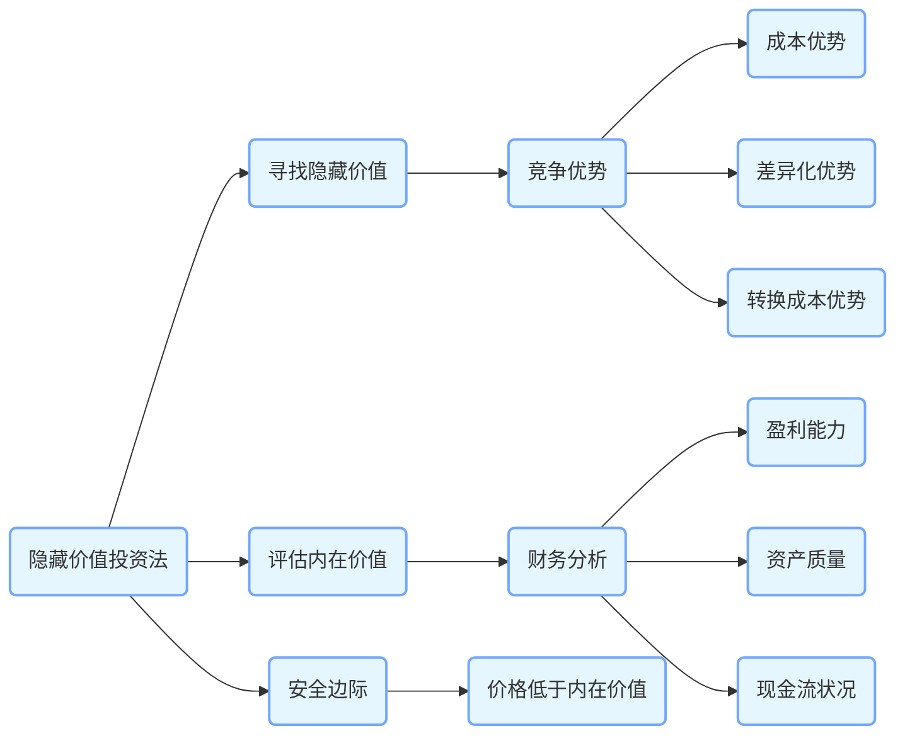

# 布鲁斯·格林沃尔德的隐藏价值投资法

> 关键词：布鲁斯·格林沃尔德、隐藏价值投资法、价值投资、财务分析、竞争优势

> 摘要：本文深入探讨了布鲁斯·格林沃尔德的隐藏价值投资法。详细介绍了该投资法的背景，包括其目的、适用读者、文档结构和相关术语。阐述了隐藏价值投资法的核心概念，构建了相应的架构并给出流程图。通过Python代码详细解释了核心算法原理及操作步骤，引入数学模型和公式进行深入讲解并举例说明。结合项目实战，给出代码实际案例并进行详细解读。分析了该投资法的实际应用场景，推荐了学习所需的工具和资源，包括书籍、在线课程、技术博客、开发工具、相关框架和经典论文等。最后总结了隐藏价值投资法的未来发展趋势与挑战，解答了常见问题并提供扩展阅读和参考资料，旨在为投资者提供全面且深入的关于布鲁斯·格林沃尔德隐藏价值投资法的知识体系。

## 1. 背景介绍 

### 1.1 目的和范围
布鲁斯·格林沃尔德的隐藏价值投资法旨在帮助投资者识别那些被市场低估的具有潜在价值的公司，从而获得长期稳定的投资回报。这种投资方法不仅仅关注公司的表面财务数据，更注重挖掘公司背后隐藏的价值因素，如独特的竞争优势、未被充分认识的资产等。本文的范围将涵盖隐藏价值投资法的核心概念、算法原理、数学模型、实际应用案例以及相关的工具和资源推荐等方面，为读者全面理解和应用该投资法提供指导。

### 1.2 预期读者
本文预期读者主要包括对价值投资感兴趣的个人投资者、金融专业学生、投资机构的分析师以及从事相关研究的学者。无论你是初涉投资领域的新手，还是希望深入了解价值投资策略的专业人士，都能从本文中获取有价值的信息。

### 1.3 文档结构概述
本文将按照以下结构展开：首先介绍隐藏价值投资法的核心概念与联系，构建起该投资法的基本框架；接着详细阐述核心算法原理和具体操作步骤，通过Python代码进行说明；引入数学模型和公式，结合实际例子进行深入讲解；进行项目实战，展示代码实际案例并详细解读；分析该投资法的实际应用场景；推荐相关的工具和资源，包括学习资源、开发工具框架和论文著作等；最后总结隐藏价值投资法的未来发展趋势与挑战，解答常见问题并提供扩展阅读和参考资料。

### 1.4 术语表
#### 1.4.1 核心术语定义
- **隐藏价值**：指公司中那些未被市场充分认识和定价的价值因素，可能包括品牌价值、技术专利、潜在的市场份额等。
- **价值投资**：一种投资策略，强调通过分析公司的基本面，寻找被低估的股票，以长期持有为目标，获取公司价值增长带来的收益。
- **竞争优势**：公司在市场中相对于竞争对手所具有的独特优势，如成本优势、差异化优势等，能够帮助公司获得更高的利润和市场份额。
- **经济商誉**：公司因品牌、声誉、客户忠诚度等因素而产生的超过有形资产价值的额外价值。

#### 1.4.2 相关概念解释
- **安全边际**：在价值投资中，安全边际是指股票的市场价格低于其内在价值的部分。投资者通过寻找具有足够安全边际的股票，降低投资风险。
- **自由现金流**：公司在满足了所有运营成本和资本支出后剩余的现金流量，反映了公司实际可用于分配给股东或进行再投资的资金。

#### 1.4.3 缩略词列表
- **ROE**：净资产收益率（Return on Equity），衡量公司运用自有资本的效率。
- **PE**：市盈率（Price-to-Earnings Ratio），反映了市场对公司盈利的预期。
- **PB**：市净率（Price-to-Book Ratio），用于评估公司的市场价值与账面价值的关系。

## 2. 核心概念与联系 

布鲁斯·格林沃尔德的隐藏价值投资法的核心在于寻找那些具有隐藏价值的公司。隐藏价值通常源于公司的竞争优势，而竞争优势又可以分为不同的类型，如成本优势、差异化优势和转换成本优势等。这些竞争优势能够为公司带来持续的现金流和利润增长，从而提升公司的内在价值。

### 核心概念架构
以下是隐藏价值投资法核心概念的架构示意图：

```plaintext
隐藏价值投资法
|-- 寻找隐藏价值
|   |-- 竞争优势
|       |-- 成本优势
|       |-- 差异化优势
|       |-- 转换成本优势
|-- 评估内在价值
|   |-- 财务分析
|       |-- 盈利能力
|       |-- 资产质量
|       |-- 现金流状况
|-- 安全边际
|   |-- 价格低于内在价值
```

### Mermaid流程图


在这个流程图中，我们可以清晰地看到隐藏价值投资法的主要步骤。首先是寻找隐藏价值，这需要关注公司的竞争优势。然后通过财务分析评估公司的内在价值，包括盈利能力、资产质量和现金流状况等方面。最后，要确保投资具有安全边际，即股票的市场价格低于其内在价值。

## 3. 核心算法原理 & 具体操作步骤 

### 核心算法原理
隐藏价值投资法的核心算法原理是通过对公司的财务数据和竞争优势进行分析，评估公司的内在价值，并与市场价格进行比较。具体来说，我们可以通过以下几个步骤来实现：
1. **确定公司的竞争优势**：通过分析公司的业务模式、市场地位、产品特点等，判断公司是否具有成本优势、差异化优势或转换成本优势。
2. **进行财务分析**：收集公司的财务报表，包括资产负债表、利润表和现金流量表，计算关键的财务指标，如ROE、PE、PB等，评估公司的盈利能力、资产质量和现金流状况。
3. **估算公司的内在价值**：根据公司的财务数据和竞争优势，采用合适的估值方法，如现金流折现法（DCF）、相对估值法等，估算公司的内在价值。
4. **比较内在价值和市场价格**：将估算的内在价值与股票的市场价格进行比较，如果市场价格低于内在价值，且具有一定的安全边际，则认为该股票具有投资价值。

### 具体操作步骤及Python代码实现
以下是一个使用Python实现的简单示例，用于计算公司的ROE和PE指标，并进行初步的估值分析。

```python
# 定义公司的财务数据
net_income = 1000000  # 净利润
shareholders_equity = 5000000  # 股东权益
market_price_per_share = 50  # 每股市场价格
earnings_per_share = 5  # 每股收益

# 计算ROE和PE
roe = (net_income / shareholders_equity) * 100
pe = market_price_per_share / earnings_per_share

# 输出结果
print(f"ROE: {roe}%")
print(f"PE: {pe}")

# 简单的估值分析
if pe < 15:
    print("该股票可能被低估，具有一定的投资价值。")
else:
    print("该股票可能被高估，需要谨慎投资。")
```

在这个示例中，我们首先定义了公司的净利润、股东权益、每股市场价格和每股收益等财务数据。然后计算了ROE和PE指标，并根据PE指标进行了简单的估值分析。如果PE小于15，我们认为该股票可能被低估，具有一定的投资价值；否则，认为该股票可能被高估，需要谨慎投资。

## 4. 数学模型和公式 & 详细讲解 & 举例说明 

### 现金流折现法（DCF）
现金流折现法是一种常用的估值方法，其基本思想是将公司未来的现金流折现到当前时刻，以估算公司的内在价值。其数学公式为：

$$
V = \sum_{t=1}^{n} \frac{FCF_t}{(1 + r)^t} + \frac{TV}{(1 + r)^n}
$$

其中：
- $V$ 表示公司的内在价值
- $FCF_t$ 表示第 $t$ 期的自由现金流
- $r$ 表示折现率
- $n$ 表示预测期数
- $TV$ 表示终值

### 详细讲解
1. **自由现金流（FCF）**：自由现金流是公司在满足了所有运营成本和资本支出后剩余的现金流量。可以通过以下公式计算：

$$
FCF = EBIT(1 - T) + D&A - CapEx - \Delta NWC
$$

其中：
- $EBIT$ 表示息税前利润
- $T$ 表示所得税税率
- $D&A$ 表示折旧和摊销
- $CapEx$ 表示资本支出
- $\Delta NWC$ 表示净营运资本的变化

2. **折现率（r）**：折现率反映了投资者对未来现金流的风险预期。通常可以使用加权平均资本成本（WACC）作为折现率。

3. **终值（TV）**：终值是指预测期结束后公司的价值。可以使用以下公式计算：

$$
TV = \frac{FCF_{n+1}}{r - g}
$$

其中：
- $FCF_{n+1}$ 表示预测期结束后下一期的自由现金流
- $g$ 表示长期增长率

### 举例说明
假设我们要对一家公司进行估值，预测期为5年，相关数据如下：

| 年份 | 自由现金流（万元） |
|------|---------------------|
| 1    | 100                 |
| 2    | 120                 |
| 3    | 140                 |
| 4    | 160                 |
| 5    | 180                 |

折现率 $r = 10\%$，长期增长率 $g = 3\%$。

首先，计算预测期内自由现金流的现值：

$$
PV_{FCF} = \frac{100}{(1 + 0.1)^1} + \frac{120}{(1 + 0.1)^2} + \frac{140}{(1 + 0.1)^3} + \frac{160}{(1 + 0.1)^4} + \frac{180}{(1 + 0.1)^5}
$$

```python
import math

fcfs = [100, 120, 140, 160, 180]
r = 0.1
pv_fcf = 0
for i, fcf in enumerate(fcfs):
    pv_fcf += fcf / math.pow(1 + r, i + 1)

print(f"预测期内自由现金流的现值: {pv_fcf} 万元")
```

然后，计算终值：

$$
FCF_6 = 180 \times (1 + 0.03) = 185.4
$$

$$
TV = \frac{185.4}{0.1 - 0.03} = 2648.57
$$

```python
g = 0.03
fcf_6 = fcfs[-1] * (1 + g)
tv = fcf_6 / (r - g)
print(f"终值: {tv} 万元")
```

最后，计算公司的内在价值：

$$
V = PV_{FCF} + \frac{TV}{(1 + r)^5}
$$

```python
v = pv_fcf + tv / math.pow(1 + r, 5)
print(f"公司的内在价值: {v} 万元")
```

通过以上计算，我们可以得到该公司的内在价值。如果该公司的市场价值低于这个内在价值，且具有一定的安全边际，则可以认为该公司具有投资价值。

## 5. 项目实战：代码实际案例和详细解释说明 

### 5.1 开发环境搭建
在进行项目实战之前，我们需要搭建相应的开发环境。以下是具体的步骤：
1. **安装Python**：从Python官方网站（https://www.python.org/downloads/）下载并安装Python 3.x版本。
2. **安装必要的库**：我们需要安装一些用于数据处理和分析的库，如`pandas`、`numpy`等。可以使用以下命令进行安装：

```sh
pip install pandas numpy
```

### 5.2 源代码详细实现和代码解读
以下是一个完整的Python代码示例，用于对一家公司进行财务分析和估值：

```python
import pandas as pd
import numpy as np

# 定义公司的财务数据
financial_data = {
    '年份': [2016, 2017, 2018, 2019, 2020],
    '净利润（万元）': [1000, 1200, 1400, 1600, 1800],
    '股东权益（万元）': [5000, 5500, 6000, 6500, 7000],
    '每股市场价格（元）': [50, 55, 60, 65, 70],
    '每股收益（元）': [5, 6, 7, 8, 9]
}

# 创建DataFrame
df = pd.DataFrame(financial_data)

# 计算ROE和PE
df['ROE'] = (df['净利润（万元）'] / df['股东权益（万元）']) * 100
df['PE'] = df['每股市场价格（元）'] / df['每股收益（元）']

# 输出财务指标
print("财务指标：")
print(df[['年份', 'ROE', 'PE']])

# 简单的估值分析
for index, row in df.iterrows():
    if row['PE'] < 15:
        print(f"{row['年份']}年该股票可能被低估，具有一定的投资价值。")
    else:
        print(f"{row['年份']}年该股票可能被高估，需要谨慎投资。")

# 假设预测未来5年的净利润增长率为10%
growth_rate = 0.1
future_years = [2021, 2022, 2023, 2024, 2025]
future_net_incomes = []
last_net_income = df['净利润（万元）'].iloc[-1]
for year in future_years:
    last_net_income = last_net_income * (1 + growth_rate)
    future_net_incomes.append(last_net_income)

# 计算未来自由现金流（假设自由现金流等于净利润）
future_fcfs = future_net_incomes

# 折现率
r = 0.1

# 计算预测期内自由现金流的现值
pv_fcf = 0
for i, fcf in enumerate(future_fcfs):
    pv_fcf += fcf / np.power(1 + r, i + 1)

# 假设长期增长率为3%
g = 0.03
last_fcf = future_fcfs[-1]
fcf_next = last_fcf * (1 + g)
tv = fcf_next / (r - g)

# 计算终值的现值
pv_tv = tv / np.power(1 + r, len(future_years))

# 计算公司的内在价值
intrinsic_value = pv_fcf + pv_tv

print(f"公司的内在价值: {intrinsic_value} 万元")
```

### 5.3 代码解读与分析
1. **数据定义和DataFrame创建**：首先，我们定义了公司的财务数据，包括年份、净利润、股东权益、每股市场价格和每股收益等。然后使用`pandas`库创建了一个DataFrame对象，方便进行数据处理和分析。
2. **财务指标计算**：通过DataFrame的运算功能，计算了ROE和PE指标，并将结果添加到DataFrame中。
3. **估值分析**：根据PE指标对每年的股票价值进行了简单的判断，如果PE小于15，则认为该股票可能被低估，具有一定的投资价值；否则，认为该股票可能被高估，需要谨慎投资。
4. **未来现金流预测**：假设未来5年的净利润增长率为10%，预测了未来5年的净利润，并将其作为自由现金流。
5. **现金流折现计算**：使用现金流折现法计算了预测期内自由现金流的现值和终值的现值，最后得到公司的内在价值。

通过这个代码示例，我们可以看到如何使用Python对公司的财务数据进行分析和估值，为投资决策提供参考。

## 6. 实际应用场景 

### 股票投资
布鲁斯·格林沃尔德的隐藏价值投资法在股票投资领域具有广泛的应用。投资者可以使用该方法筛选出那些被市场低估的股票，通过深入分析公司的竞争优势和财务状况，寻找具有投资价值的标的。例如，一些传统行业的公司可能由于市场对其增长前景的担忧而被低估，但实际上这些公司可能拥有强大的品牌、稳定的现金流和较低的成本结构，具有隐藏的价值。投资者可以通过隐藏价值投资法发现这些机会，实现长期的投资回报。

### 企业并购
在企业并购中，隐藏价值投资法可以帮助收购方评估目标公司的真实价值。收购方不仅要关注目标公司的表面财务数据，还要挖掘其隐藏的价值因素，如未被充分利用的资产、潜在的市场份额等。通过准确评估目标公司的内在价值，收购方可以制定合理的收购价格，避免过高支付收购成本。

### 私募股权投资
私募股权投资机构在选择投资项目时，也可以运用隐藏价值投资法。通过对创业公司的商业模式、技术创新、团队能力等方面进行分析，寻找具有隐藏价值的项目。这些项目可能在初期市场表现不佳，但具有巨大的发展潜力。私募股权投资机构可以在早期阶段进行投资，随着公司的成长实现高额回报。

## 7. 工具和资源推荐

### 7.1 学习资源推荐
#### 7.1.1 书籍推荐
- 《价值投资：从格雷厄姆到巴菲特》：本书系统地介绍了价值投资的理论和方法，包括格雷厄姆、巴菲特等投资大师的思想和实践经验，对理解布鲁斯·格林沃尔德的隐藏价值投资法有很大的帮助。
- 《聪明的投资者》：本杰明·格雷厄姆的经典著作，被誉为价值投资的圣经。书中详细阐述了价值投资的基本原则和策略，是学习价值投资的必读之书。
- 《竞争优势：透视企业护城河》：该书深入探讨了企业的竞争优势，包括成本优势、差异化优势等，与隐藏价值投资法中寻找竞争优势的理念相契合。

#### 7.1.2 在线课程
- Coursera平台上的“价值投资基础”课程：由知名教授授课，系统地讲解了价值投资的基本概念、方法和实践技巧。
- edX平台上的“财务分析与估值”课程：该课程重点介绍了财务分析和估值的方法，包括现金流折现法、相对估值法等，对理解隐藏价值投资法中的估值部分有很大的帮助。

#### 7.1.3 技术博客和网站
- 雪球网：国内知名的投资社区，汇聚了众多投资者和投资专家，提供了丰富的投资分析和研究报告。
- Seeking Alpha：国外的投资研究网站，提供了大量的股票分析和投资建议，有助于投资者了解不同公司的隐藏价值。

### 7.2 开发工具框架推荐
#### 7.2.1 IDE和编辑器
- PyCharm：一款专业的Python集成开发环境，提供了丰富的代码编辑、调试和分析功能，适合进行数据分析和编程开发。
- Jupyter Notebook：一种交互式的开发环境，支持Python等多种编程语言，方便进行数据探索和可视化分析。

#### 7.2.2 调试和性能分析工具
- pdb：Python自带的调试工具，可以帮助开发者定位和解决代码中的问题。
- cProfile：Python的性能分析工具，可以分析代码的运行时间和函数调用情况，帮助优化代码性能。

#### 7.2.3 相关框架和库
- pandas：用于数据处理和分析的Python库，提供了高效的数据结构和数据操作方法，适合处理财务数据。
- numpy：Python的数值计算库，提供了强大的数组和矩阵运算功能，在财务分析和估值计算中经常使用。

### 7.3 相关论文著作推荐
#### 7.3.1 经典论文
- 《证券分析》（本杰明·格雷厄姆）：价值投资领域的经典论文，奠定了价值投资的理论基础。
- 《有效市场假说》（尤金·法玛）：探讨了市场效率和股票价格的形成机制，对理解价值投资的有效性有重要意义。

#### 7.3.2 最新研究成果
- 《基于机器学习的价值投资策略研究》：该研究运用机器学习算法对价值投资策略进行优化，为隐藏价值投资法的发展提供了新的思路。
- 《企业竞争优势的动态演化研究》：深入研究了企业竞争优势的动态变化过程，有助于投资者更好地识别和评估公司的隐藏价值。

#### 7.3.3 应用案例分析
- 《某传统制造业公司隐藏价值挖掘案例分析》：通过实际案例，详细介绍了如何运用隐藏价值投资法对传统制造业公司进行分析和估值，为投资者提供了实践参考。

## 8. 总结：未来发展趋势与挑战

### 未来发展趋势
1. **与科技的融合**：随着科技的不断发展，隐藏价值投资法将与大数据、人工智能等技术深度融合。通过运用大数据分析和机器学习算法，投资者可以更高效地筛选和分析大量的财务数据和市场信息，更准确地识别公司的隐藏价值。
2. **国际化发展**：随着全球经济一体化的加速，隐藏价值投资法将在国际市场上得到更广泛的应用。投资者可以通过跨境投资，寻找不同国家和地区的隐藏价值机会，实现资产的多元化配置。
3. **社会责任投资的结合**：未来，隐藏价值投资法可能会与社会责任投资相结合。投资者不仅关注公司的财务表现，还会考虑公司的环境、社会和治理（ESG）因素，寻找那些具有良好社会形象和可持续发展能力的公司。

### 挑战
1. **数据质量和可靠性**：隐藏价值投资法依赖于大量的财务数据和市场信息，数据的质量和可靠性直接影响到投资决策的准确性。然而，在实际应用中，数据可能存在不准确、不完整或滞后等问题，给投资者带来挑战。
2. **市场变化的不确定性**：市场环境是复杂多变的，公司的竞争优势和隐藏价值也可能随着市场变化而发生改变。投资者需要及时跟踪和评估市场变化，调整投资策略，以应对不确定性带来的风险。
3. **专业知识和技能要求高**：隐藏价值投资法需要投资者具备丰富的财务分析、行业研究和估值等专业知识和技能。对于普通投资者来说，掌握这些知识和技能可能存在一定的难度。

## 9. 附录：常见问题与解答

### 问题1：如何判断公司是否具有竞争优势？
解答：可以从以下几个方面判断公司是否具有竞争优势：
- **成本优势**：观察公司的生产成本是否低于竞争对手，是否能够通过规模经济、高效的供应链管理等方式降低成本。
- **差异化优势**：分析公司的产品或服务是否具有独特的特点，如品牌、技术、质量等，能够满足客户的特殊需求。
- **转换成本优势**：考虑客户从该公司转换到其他竞争对手的成本是否较高，如更换供应商需要承担的时间、成本和风险等。

### 问题2：现金流折现法中的折现率如何确定？
解答：折现率通常可以使用加权平均资本成本（WACC）来确定。WACC的计算公式为：

$$
WACC = E / V \times r_E + D / V \times r_D \times (1 - T)
$$

其中：
- $E$ 表示权益资本的市场价值
- $D$ 表示债务资本的市场价值
- $V = E + D$ 表示公司的总市场价值
- $r_E$ 表示权益资本成本
- $r_D$ 表示债务资本成本
- $T$ 表示所得税税率

权益资本成本可以使用资本资产定价模型（CAPM）来计算：

$$
r_E = r_f + \beta \times (r_m - r_f)
$$

其中：
- $r_f$ 表示无风险利率
- $\beta$ 表示股票的贝塔系数
- $r_m$ 表示市场组合的预期收益率

### 问题3：隐藏价值投资法是否适用于所有类型的公司？
解答：隐藏价值投资法并不适用于所有类型的公司。该方法更适合那些具有稳定现金流、较强竞争优势和一定资产基础的公司。对于一些新兴行业的创业公司，由于其未来的发展具有较大的不确定性，财务数据可能不具有代表性，隐藏价值投资法的应用可能会受到一定的限制。

## 10. 扩展阅读 & 参考资料
1. 《价值投资实战手册》，唐朝 著
2. 《巴菲特致股东的信：股份公司教程》，沃伦·巴菲特 著
3. 晨星网（https://cn.morningstar.com/）
4. 东方财富网（https://www.eastmoney.com/）
5. 《Journal of Financial Economics》
6. 《The Review of Financial Studies》