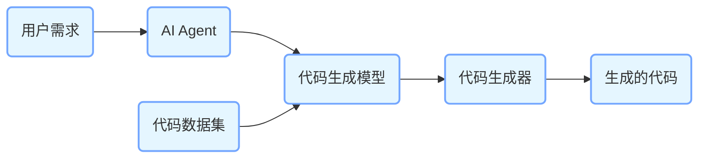

# 开发AI Agent支持的智能代码生成系统

> 关键词：AI Agent、智能代码生成系统、代码生成算法、数学模型、项目实战

> 摘要：本文围绕开发AI Agent支持的智能代码生成系统展开，详细阐述了该系统的相关核心概念、算法原理、数学模型。通过项目实战展示了系统的开发过程，包括环境搭建、代码实现与解读。同时探讨了系统的实际应用场景，推荐了相关的学习资源、开发工具框架以及论文著作。最后对系统未来的发展趋势与挑战进行了总结，并给出常见问题解答和扩展阅读参考资料，旨在为开发者全面深入地了解和开发此类系统提供指导。

## 1. 背景介绍 
### 1.1 目的和范围
随着软件开发行业的不断发展，对代码生成效率和质量的要求越来越高。开发AI Agent支持的智能代码生成系统的目的在于利用AI Agent的智能特性，实现自动生成高质量代码，减少开发者的重复劳动，提高开发效率。本系统的范围涵盖了多种编程语言和常见的软件应用场景，如Web开发、数据分析、机器学习等。

### 1.2 预期读者
本文预期读者包括软件开发人员、人工智能研究者、软件架构师以及对智能代码生成技术感兴趣的技术爱好者。这些读者希望通过本文了解智能代码生成系统的开发原理、方法和实践经验，以便在实际工作中应用或进一步研究该技术。

### 1.3 文档结构概述
本文首先介绍了智能代码生成系统的背景信息，包括目的、预期读者和文档结构。接着阐述了核心概念与联系，包括AI Agent和智能代码生成的原理及架构。然后详细讲解了核心算法原理和具体操作步骤，并用Python代码进行了说明。随后介绍了相关的数学模型和公式，并举例说明。通过项目实战展示了系统的开发过程，包括环境搭建、代码实现和解读。探讨了系统的实际应用场景，推荐了学习资源、开发工具框架和论文著作。最后总结了未来发展趋势与挑战，给出常见问题解答和扩展阅读参考资料。

### 1.4 术语表
#### 1.4.1 核心术语定义
- **AI Agent**：人工智能代理，是一种能够感知环境、进行决策并采取行动以实现特定目标的智能实体。在智能代码生成系统中，AI Agent可以根据用户需求和上下文信息生成代码。
- **智能代码生成系统**：利用人工智能技术，根据用户输入的需求描述自动生成代码的系统。
- **代码生成算法**：用于实现代码自动生成的算法，如基于模板的算法、基于机器学习的算法等。

#### 1.4.2 相关概念解释
- **自然语言处理（NLP）**：是人工智能的一个分支，研究如何让计算机理解和处理人类语言。在智能代码生成系统中，NLP技术用于将用户的自然语言需求转换为可执行的代码。
- **机器学习**：是一门多领域交叉学科，涉及概率论、统计学、逼近论、凸分析、算法复杂度理论等多门学科。它专门研究计算机怎样模拟或实现人类的学习行为，以获取新的知识或技能，重新组织已有的知识结构使之不断改善自身的性能。在代码生成系统中，机器学习算法可以学习大量的代码数据，从而生成符合用户需求的代码。

#### 1.4.3 缩略词列表
- **NLP**：Natural Language Processing（自然语言处理）
- **ML**：Machine Learning（机器学习）

## 2. 核心概念与联系 

### 核心概念原理
#### AI Agent
AI Agent是智能代码生成系统的核心组成部分。它具有感知、决策和行动的能力。在智能代码生成系统中，AI Agent首先通过感知模块获取用户的需求信息，如自然语言描述的功能需求、代码片段等。然后，决策模块根据感知到的信息，结合自身的知识和经验，选择合适的代码生成策略。最后，行动模块根据决策结果生成相应的代码。

#### 智能代码生成
智能代码生成是指系统根据用户输入的需求自动生成代码的过程。其原理是利用机器学习、自然语言处理等技术，对大量的代码数据进行学习和分析，建立代码生成模型。当用户输入需求时，系统通过模型生成符合需求的代码。

### 架构示意图
以下是智能代码生成系统的架构示意图：



在这个架构中，用户需求作为输入传递给AI Agent。AI Agent根据需求调用代码生成模型，该模型是基于代码数据集训练得到的。代码生成器根据模型的输出生成最终的代码。

## 3. 核心算法原理 & 具体操作步骤 

### 基于机器学习的代码生成算法原理
在智能代码生成系统中，基于机器学习的算法是常用的方法之一。这里我们以基于深度学习的序列到序列（Sequence-to-Sequence）模型为例进行讲解。

序列到序列模型由编码器（Encoder）和解码器（Decoder）组成。编码器将输入的序列（如用户的需求描述）转换为一个固定长度的向量表示，解码器则根据这个向量表示生成输出序列（即代码）。

### Python源代码实现
```python
import torch
import torch.nn as nn
import torch.optim as optim

# 定义编码器
class Encoder(nn.Module):
    def __init__(self, input_size, hidden_size):
        super(Encoder, self).__init__()
        self.hidden_size = hidden_size
        self.embedding = nn.Embedding(input_size, hidden_size)
        self.gru = nn.GRU(hidden_size, hidden_size)

    def forward(self, input, hidden):
        embedded = self.embedding(input).view(1, 1, -1)
        output = embedded
        output, hidden = self.gru(output, hidden)
        return output, hidden

    def initHidden(self):
        return torch.zeros(1, 1, self.hidden_size)

# 定义解码器
class Decoder(nn.Module):
    def __init__(self, hidden_size, output_size):
        super(Decoder, self).__init__()
        self.hidden_size = hidden_size
        self.embedding = nn.Embedding(output_size, hidden_size)
        self.gru = nn.GRU(hidden_size, hidden_size)
        self.out = nn.Linear(hidden_size, output_size)
        self.softmax = nn.LogSoftmax(dim=1)

    def forward(self, input, hidden):
        output = self.embedding(input).view(1, 1, -1)
        output = torch.relu(output)
        output, hidden = self.gru(output, hidden)
        output = self.softmax(self.out(output[0]))
        return output, hidden

    def initHidden(self):
        return torch.zeros(1, 1, self.hidden_size)

# 训练模型
def train(input_tensor, target_tensor, encoder, decoder, encoder_optimizer, decoder_optimizer, criterion):
    encoder_hidden = encoder.initHidden()

    encoder_optimizer.zero_grad()
    decoder_optimizer.zero_grad()

    input_length = input_tensor.size(0)
    target_length = target_tensor.size(0)

    encoder_outputs = torch.zeros(input_length, encoder.hidden_size)

    loss = 0

    for ei in range(input_length):
        encoder_output, encoder_hidden = encoder(
            input_tensor[ei], encoder_hidden)
        encoder_outputs[ei] = encoder_output[0, 0]

    decoder_input = torch.tensor([[0]])
    decoder_hidden = encoder_hidden

    for di in range(target_length):
        decoder_output, decoder_hidden = decoder(
            decoder_input, decoder_hidden)
        topv, topi = decoder_output.topk(1)
        decoder_input = topi.squeeze().detach()

        loss += criterion(decoder_output, target_tensor[di].unsqueeze(0))
        if decoder_input.item() == 1:
            break

    loss.backward()

    encoder_optimizer.step()
    decoder_optimizer.step()

    return loss.item() / target_length

# 生成代码
def generate_code(encoder, decoder, input_tensor, max_length=20):
    with torch.no_grad():
        input_length = input_tensor.size()[0]
        encoder_hidden = encoder.initHidden()
        encoder_outputs = torch.zeros(max_length, encoder.hidden_size)

        for ei in range(input_length):
            encoder_output, encoder_hidden = encoder(input_tensor[ei],
                                                     encoder_hidden)
            encoder_outputs[ei] += encoder_output[0, 0]

        decoder_input = torch.tensor([[0]])
        decoder_hidden = encoder_hidden

        decoded_words = []

        for di in range(max_length):
            decoder_output, decoder_hidden = decoder(
                decoder_input, decoder_hidden)
            topv, topi = decoder_output.data.topk(1)
            if topi.item() == 1:
                decoded_words.append('<EOS>')
                break
            else:
                decoded_words.append(topi.item())

            decoder_input = topi.squeeze().detach()

    return decoded_words

# 示例使用
input_size = 100  # 输入词汇表大小
hidden_size = 256
output_size = 100  # 输出词汇表大小

encoder = Encoder(input_size, hidden_size)
decoder = Decoder(hidden_size, output_size)

encoder_optimizer = optim.SGD(encoder.parameters(), lr=0.01)
decoder_optimizer = optim.SGD(decoder.parameters(), lr=0.01)
criterion = nn.NLLLoss()

# 模拟输入和目标
input_tensor = torch.randint(0, input_size, (10,))
target_tensor = torch.randint(0, output_size, (10,))

# 训练模型
for iter in range(100):
    loss = train(input_tensor, target_tensor, encoder, decoder, encoder_optimizer, decoder_optimizer, criterion)
    print(f'Iteration {iter}, Loss: {loss}')

# 生成代码
generated_code = generate_code(encoder, decoder, input_tensor)
print('Generated Code:', generated_code)
```

### 具体操作步骤
1. **数据准备**：收集大量的代码数据，并进行预处理，包括分词、构建词汇表等。
2. **模型定义**：定义编码器和解码器的结构，如上述代码中的`Encoder`和`Decoder`类。
3. **模型训练**：使用训练数据对模型进行训练，调整模型的参数，使其能够更好地生成代码。
4. **代码生成**：使用训练好的模型，根据用户输入的需求生成代码。

## 4. 数学模型和公式 & 详细讲解 & 举例说明 

### 序列到序列模型的数学模型
序列到序列模型的核心是编码器和解码器的计算过程。

#### 编码器
编码器的输入是一个输入序列 $X = (x_1, x_2, \cdots, x_T)$，其中 $x_t$ 是第 $t$ 个输入元素。编码器通过循环神经网络（如GRU）将输入序列转换为一个隐藏状态序列 $h = (h_1, h_2, \cdots, h_T)$，其中 $h_t$ 是第 $t$ 个时间步的隐藏状态。

编码器的计算公式如下：
$$
h_t = GRU(x_t, h_{t-1})
$$
其中，$GRU$ 是门控循环单元的计算函数，$h_0$ 通常初始化为零向量。

#### 解码器
解码器的输入是编码器的最后一个隐藏状态 $h_T$ 和一个初始输入 $y_0$（通常为起始符号）。解码器通过循环神经网络生成输出序列 $Y = (y_1, y_2, \cdots, y_{T'})$，其中 $y_t$ 是第 $t$ 个输出元素。

解码器的计算公式如下：
$$
s_t = GRU(y_{t-1}, s_{t-1})
$$
$$
\hat{y}_t = softmax(W_s s_t + b)
$$
其中，$s_t$ 是第 $t$ 个时间步的解码器隐藏状态，$\hat{y}_t$ 是第 $t$ 个输出元素的概率分布，$W_s$ 和 $b$ 是线性变换的参数。

### 损失函数
在训练序列到序列模型时，通常使用交叉熵损失函数。交叉熵损失函数的计算公式如下：
$$
L = -\frac{1}{T'} \sum_{t=1}^{T'} \log p(y_t | y_{<t}, X)
$$
其中，$p(y_t | y_{<t}, X)$ 是在给定输入序列 $X$ 和之前的输出元素 $y_{<t}$ 的条件下，生成第 $t$ 个输出元素 $y_t$ 的概率。

### 举例说明
假设我们有一个简单的输入序列 $X = [1, 2, 3]$，目标输出序列 $Y = [4, 5, 6]$。编码器将输入序列转换为隐藏状态序列 $h = [h_1, h_2, h_3]$。解码器以 $h_3$ 为初始隐藏状态，从 $y_0$ 开始生成输出序列。在每个时间步，解码器计算输出元素的概率分布，选择概率最大的元素作为输出。通过不断迭代，最终生成输出序列。

在训练过程中，根据交叉熵损失函数计算损失值，并使用反向传播算法更新模型的参数，使得模型能够更好地生成与目标输出序列相近的结果。

## 5. 项目实战：代码实际案例和详细解释说明 

### 5.1  开发环境搭建
#### 操作系统
本项目可以在Windows、Linux或macOS等操作系统上进行开发。建议使用Linux系统，因为它在软件开发和机器学习领域具有广泛的支持。

#### 编程语言和版本
使用Python 3.7及以上版本。Python是一种功能强大且易于学习的编程语言，拥有丰富的机器学习和深度学习库。

#### 依赖库安装
使用`pip`命令安装以下依赖库：
```bash
pip install torch
pip install numpy
```
`torch`是PyTorch深度学习框架，用于构建和训练神经网络。`numpy`是Python的数值计算库，用于处理数组和矩阵。

### 5.2  源代码详细实现和代码解读
#### 数据准备
```python
import torch
import torch.nn as nn
import torch.optim as optim
import numpy as np

# 模拟代码数据集
input_data = [
    [1, 2, 3],
    [4, 5, 6],
    [7, 8, 9]
]
target_data = [
    [10, 11, 12],
    [13, 14, 15],
    [16, 17, 18]
]

# 转换为PyTorch张量
input_tensors = [torch.tensor(x) for x in input_data]
target_tensors = [torch.tensor(y) for y in target_data]
```
这段代码模拟了一个简单的代码数据集，将输入数据和目标数据转换为PyTorch张量，方便后续的模型训练。

#### 模型定义
```python
# 定义编码器
class Encoder(nn.Module):
    def __init__(self, input_size, hidden_size):
        super(Encoder, self).__init__()
        self.hidden_size = hidden_size
        self.embedding = nn.Embedding(input_size, hidden_size)
        self.gru = nn.GRU(hidden_size, hidden_size)

    def forward(self, input, hidden):
        embedded = self.embedding(input).view(1, 1, -1)
        output = embedded
        output, hidden = self.gru(output, hidden)
        return output, hidden

    def initHidden(self):
        return torch.zeros(1, 1, self.hidden_size)

# 定义解码器
class Decoder(nn.Module):
    def __init__(self, hidden_size, output_size):
        super(Decoder, self).__init__()
        self.hidden_size = hidden_size
        self.embedding = nn.Embedding(output_size, hidden_size)
        self.gru = nn.GRU(hidden_size, hidden_size)
        self.out = nn.Linear(hidden_size, output_size)
        self.softmax = nn.LogSoftmax(dim=1)

    def forward(self, input, hidden):
        output = self.embedding(input).view(1, 1, -1)
        output = torch.relu(output)
        output, hidden = self.gru(output, hidden)
        output = self.softmax(self.out(output[0]))
        return output, hidden

    def initHidden(self):
        return torch.zeros(1, 1, self.hidden_size)
```
这里定义了编码器和解码器的结构。编码器使用嵌入层将输入转换为向量表示，然后通过GRU循环神经网络进行处理。解码器同样使用嵌入层和GRU，最后通过线性层和softmax函数输出概率分布。

#### 模型训练
```python
# 初始化模型
input_size = 10  # 输入词汇表大小
hidden_size = 256
output_size = 10  # 输出词汇表大小

encoder = Encoder(input_size, hidden_size)
decoder = Decoder(hidden_size, output_size)

encoder_optimizer = optim.SGD(encoder.parameters(), lr=0.01)
decoder_optimizer = optim.SGD(decoder.parameters(), lr=0.01)
criterion = nn.NLLLoss()

# 训练模型
n_iters = 100
for iter in range(n_iters):
    for input_tensor, target_tensor in zip(input_tensors, target_tensors):
        loss = train(input_tensor, target_tensor, encoder, decoder, encoder_optimizer, decoder_optimizer, criterion)
    print(f'Iteration {iter}, Loss: {loss}')
```
在模型训练阶段，我们初始化编码器和解码器，并使用随机梯度下降（SGD）优化器来更新模型的参数。使用负对数似然损失函数（NLLLoss）来计算损失值。通过多次迭代训练，不断调整模型的参数，使得损失值逐渐减小。

#### 代码生成
```python
# 生成代码
def generate_code(encoder, decoder, input_tensor, max_length=20):
    with torch.no_grad():
        input_length = input_tensor.size()[0]
        encoder_hidden = encoder.initHidden()
        encoder_outputs = torch.zeros(max_length, encoder.hidden_size)

        for ei in range(input_length):
            encoder_output, encoder_hidden = encoder(input_tensor[ei],
                                                     encoder_hidden)
            encoder_outputs[ei] += encoder_output[0, 0]

        decoder_input = torch.tensor([[0]])
        decoder_hidden = encoder_hidden

        decoded_words = []

        for di in range(max_length):
            decoder_output, decoder_hidden = decoder(
                decoder_input, decoder_hidden)
            topv, topi = decoder_output.data.topk(1)
            if topi.item() == 1:
                decoded_words.append('<EOS>')
                break
            else:
                decoded_words.append(topi.item())

            decoder_input = topi.squeeze().detach()

    return decoded_words

# 示例生成
input_tensor = input_tensors[0]
generated_code = generate_code(encoder, decoder, input_tensor)
print('Generated Code:', generated_code)
```
在代码生成阶段，我们定义了一个`generate_code`函数，使用训练好的编码器和解码器根据输入张量生成代码。通过循环不断生成输出元素，直到遇到结束符号`<EOS>`或达到最大长度。

### 5.3  代码解读与分析
#### 数据处理
在数据准备阶段，我们将输入数据和目标数据转换为PyTorch张量，方便后续的模型训练。使用张量可以利用PyTorch的自动求导功能，简化模型训练的过程。

#### 模型结构
编码器和解码器的结构是序列到序列模型的核心。编码器将输入序列转换为隐藏状态，解码器根据隐藏状态生成输出序列。嵌入层用于将输入和输出元素转换为向量表示，GRU循环神经网络用于处理序列信息。

#### 训练过程
在训练过程中，我们使用随机梯度下降优化器更新模型的参数。通过多次迭代训练，不断调整模型的参数，使得损失值逐渐减小。损失函数使用负对数似然损失函数，用于衡量模型生成的输出与目标输出之间的差异。

#### 代码生成
在代码生成阶段，我们使用训练好的模型根据输入生成代码。通过循环不断生成输出元素，直到遇到结束符号或达到最大长度。

## 6. 实际应用场景 
### 软件开发
在软件开发中，智能代码生成系统可以帮助开发者快速生成代码框架和常见功能的代码。例如，在Web开发中，系统可以根据用户的需求自动生成前端页面的HTML、CSS和JavaScript代码，以及后端服务器的API接口代码。这可以大大提高开发效率，减少开发者的重复劳动。

### 数据分析
在数据分析领域，智能代码生成系统可以根据用户的数据分析需求生成相应的代码。例如，用户需要对一个数据集进行数据清洗、特征提取和模型训练，系统可以自动生成Python或R语言的代码，帮助用户快速完成数据分析任务。

### 教育领域
在教育领域，智能代码生成系统可以作为教学辅助工具。教师可以使用系统生成示例代码，帮助学生更好地理解编程概念和算法。学生也可以通过系统验证自己的想法，快速得到代码实现，提高学习效率。

## 7. 工具和资源推荐
### 7.1 学习资源推荐
#### 7.1.1 书籍推荐
- 《深度学习》（Deep Learning）：由Ian Goodfellow、Yoshua Bengio和Aaron Courville撰写，是深度学习领域的经典教材，涵盖了深度学习的基本概念、算法和应用。
- 《Python深度学习》（Deep Learning with Python）：由Francois Chollet撰写，介绍了如何使用Python和Keras框架进行深度学习开发，适合初学者入门。
- 《自然语言处理入门》：由何晗撰写，详细介绍了自然语言处理的基本概念、算法和应用，对于理解智能代码生成系统中的自然语言处理技术有很大帮助。

#### 7.1.2 在线课程
- Coursera上的“深度学习专项课程”（Deep Learning Specialization）：由Andrew Ng教授授课，包括神经网络和深度学习、改善深层神经网络、结构化机器学习项目、卷积神经网络和序列模型等课程，是学习深度学习的优质资源。
- edX上的“自然语言处理基础”（Foundations of Natural Language Processing）：介绍了自然语言处理的基本概念、算法和应用，帮助学习者掌握自然语言处理的核心技术。

#### 7.1.3 技术博客和网站
- Medium：是一个技术博客平台，上面有很多关于人工智能、机器学习和代码生成的文章，可以帮助开发者了解最新的技术动态和研究成果。
- arXiv：是一个预印本服务器，提供了大量的学术论文，包括人工智能、机器学习和自然语言处理等领域的最新研究成果。

### 7.2 开发工具框架推荐
#### 7.2.1 IDE和编辑器
- PyCharm：是一款专门为Python开发设计的集成开发环境（IDE），提供了代码编辑、调试、版本控制等功能，支持多种Python框架，是Python开发者的首选工具。
- Visual Studio Code：是一款轻量级的代码编辑器，支持多种编程语言，拥有丰富的插件生态系统，可以通过安装插件来扩展功能，如代码自动补全、语法检查等。

#### 7.2.2 调试和性能分析工具
- PyTorch Profiler：是PyTorch框架自带的性能分析工具，可以帮助开发者分析模型的训练和推理过程，找出性能瓶颈，优化代码性能。
- TensorBoard：是TensorFlow框架的可视化工具，也可以与PyTorch结合使用。它可以展示模型的训练过程、损失曲线、准确率等信息，帮助开发者更好地理解模型的性能。

#### 7.2.3 相关框架和库
- PyTorch：是一个开源的深度学习框架，提供了丰富的神经网络层和优化算法，支持GPU加速，易于使用和扩展。
- Hugging Face Transformers：是一个用于自然语言处理的开源库，提供了预训练的语言模型和工具，如BERT、GPT等，可以帮助开发者快速实现自然语言处理任务。

### 7.3 相关论文著作推荐
#### 7.3.1 经典论文
- “Sequence to Sequence Learning with Neural Networks”：由Ilya Sutskever、Oriol Vinyals和Quoc V. Le撰写，介绍了序列到序列模型的基本原理和实现方法，是智能代码生成系统中常用的模型之一。
- “Attention Is All You Need”：由Ashish Vaswani等人撰写，提出了Transformer模型，是自然语言处理领域的重要突破，为智能代码生成系统提供了更强大的模型架构。

#### 7.3.2 最新研究成果
- 在arXiv等预印本服务器上可以找到关于智能代码生成系统的最新研究成果。这些研究成果通常涉及到新的算法、模型架构和应用场景，可以帮助开发者了解该领域的最新发展动态。

#### 7.3.3 应用案例分析
- 在ACM SIGPLAN、IEEE Transactions on Software Engineering等学术会议和期刊上可以找到智能代码生成系统的应用案例分析。这些案例分析可以帮助开发者了解如何将智能代码生成系统应用到实际项目中，解决实际问题。

## 8. 总结：未来发展趋势与挑战
### 未来发展趋势
#### 更强大的模型架构
随着深度学习技术的不断发展，未来智能代码生成系统将采用更强大的模型架构，如基于Transformer的模型和强化学习模型。这些模型可以更好地处理长序列和复杂的代码结构，提高代码生成的质量和效率。

#### 跨语言和跨领域支持
未来的智能代码生成系统将支持更多的编程语言和应用领域。例如，系统可以根据用户的需求生成多种编程语言的代码，包括Java、C++、Python等，并且可以应用于不同的领域，如金融、医疗、交通等。

#### 与开发工具的深度集成
智能代码生成系统将与现有的开发工具进行深度集成，如IDE、版本控制系统等。开发者可以在开发过程中直接使用代码生成系统，提高开发效率。

### 挑战
#### 代码质量和可维护性
虽然智能代码生成系统可以生成代码，但生成的代码质量和可维护性仍然是一个挑战。生成的代码可能存在逻辑错误、性能问题和安全隐患，需要开发者进行进一步的审查和优化。

#### 数据隐私和安全
智能代码生成系统需要大量的代码数据进行训练，这些数据可能包含敏感信息。如何保护数据的隐私和安全，防止数据泄露和滥用，是一个需要解决的问题。

#### 模型可解释性
深度学习模型通常是黑盒模型，难以解释其决策过程。在智能代码生成系统中，模型的可解释性对于开发者来说非常重要，因为他们需要了解模型为什么生成这样的代码。提高模型的可解释性是未来研究的一个重要方向。

## 9. 附录：常见问题与解答
### 问题1：智能代码生成系统生成的代码可以直接使用吗？
解答：智能代码生成系统生成的代码通常需要开发者进行进一步的审查和优化。虽然系统可以生成符合基本需求的代码，但生成的代码可能存在逻辑错误、性能问题和安全隐患。开发者需要根据具体情况对代码进行检查和修改，确保代码的质量和可维护性。

### 问题2：智能代码生成系统需要多少数据进行训练？
解答：智能代码生成系统需要大量的代码数据进行训练，数据量的大小取决于模型的复杂度和应用场景。一般来说，数据量越大，模型的性能越好。通常需要数万到数百万条代码数据才能训练出一个性能较好的模型。

### 问题3：智能代码生成系统支持哪些编程语言？
解答：智能代码生成系统可以支持多种编程语言，如Python、Java、C++、JavaScript等。具体支持的编程语言取决于系统的设计和训练数据。一些系统可以通过扩展训练数据和模型结构来支持更多的编程语言。

## 10. 扩展阅读 & 参考资料
### 扩展阅读
- 《人工智能：现代方法》（Artificial Intelligence: A Modern Approach）：全面介绍了人工智能的基本概念、算法和应用，是人工智能领域的经典教材。
- 《机器学习实战》（Machine Learning in Action）：通过实际案例介绍了机器学习的基本算法和应用，适合初学者入门。

### 参考资料
- Goodfellow, I., Bengio, Y., & Courville, A. (2016). Deep Learning. MIT Press.
- Chollet, F. (2017). Deep Learning with Python. Manning Publications.
- Sutskever, I., Vinyals, O., & Le, Q. V. (2014). Sequence to Sequence Learning with Neural Networks. Advances in Neural Information Processing Systems.
- Vaswani, A., Shazeer, N., Parmar, N., Uszkoreit, J., Jones, L., Gomez, A. N., ... & Polosukhin, I. (2017). Attention Is All You Need. Advances in Neural Information Processing Systems.