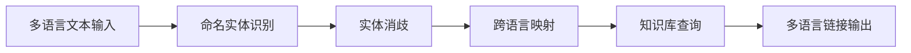

# 开发AI Agent的多语言链接链接系统

> 关键词：AI Agent、多语言链接系统、实体链接、跨语言处理、自然语言处理

> 摘要：本文围绕开发AI Agent的多语言链接系统展开，详细介绍了该系统的背景、核心概念、算法原理、数学模型、项目实战、实际应用场景等内容。通过逐步分析推理，阐述了如何构建一个高效、准确的多语言链接系统，以解决跨语言实体链接等问题。同时，推荐了相关的学习资源、开发工具和论文著作，最后总结了该领域的未来发展趋势与挑战，并提供了常见问题解答和扩展阅读参考资料。

## 1. 背景介绍 
### 1.1 目的和范围
在当今全球化的信息时代，互联网上存在着海量的多语言文本数据。为了实现不同语言之间信息的有效整合和利用，开发AI Agent的多语言链接系统具有重要意义。该系统的主要目的是将不同语言文本中的实体进行准确链接，从而实现跨语言的知识关联和信息检索。其范围涵盖了多种自然语言，包括但不限于英语、中文、法语、德语等，旨在处理各种类型的文本数据，如新闻文章、学术论文、社交媒体内容等。

### 1.2 预期读者
本文预期读者包括对自然语言处理、人工智能、跨语言信息处理等领域感兴趣的研究人员、开发者、学生以及相关技术爱好者。对于希望深入了解多语言链接系统的原理和开发方法的读者，本文将提供全面而详细的指导。

### 1.3 文档结构概述
本文将按照以下结构进行组织：首先介绍多语言链接系统的核心概念与联系，包括实体链接、跨语言处理等相关概念；接着阐述核心算法原理和具体操作步骤，并使用Python源代码进行详细说明；然后介绍数学模型和公式，并通过举例进行详细讲解；之后进行项目实战，包括开发环境搭建、源代码实现和代码解读；再探讨实际应用场景；推荐相关的工具和资源；最后总结未来发展趋势与挑战，提供常见问题解答和扩展阅读参考资料。

### 1.4 术语表
#### 1.4.1 核心术语定义
- **AI Agent（人工智能代理）**：能够感知环境、做出决策并采取行动以实现特定目标的智能实体。
- **多语言链接系统**：用于将不同语言文本中的实体进行链接，建立跨语言知识关联的系统。
- **实体链接**：将文本中的实体提及与知识库中的实体进行映射的过程。
- **跨语言处理**：处理和分析不同语言之间信息的技术和方法。

#### 1.4.2 相关概念解释
- **知识库**：存储大量实体信息的数据库，如维基百科、DBpedia等。
- **命名实体**：文本中具有特定名称的实体，如人名、地名、组织机构名等。
- **上下文信息**：文本中围绕实体提及的相关信息，用于辅助实体链接。

#### 1.4.3 缩略词列表
- **NLP（Natural Language Processing）**：自然语言处理
- **ML（Machine Learning）**：机器学习
- **DL（Deep Learning）**：深度学习

## 2. 核心概念与联系 

### 核心概念原理
多语言链接系统的核心原理是通过对不同语言文本中的实体提及进行识别和分析，将其与知识库中的实体进行匹配和链接。主要涉及以下几个关键步骤：
1. **命名实体识别（NER）**：从文本中识别出命名实体，确定实体提及的位置和类型。
2. **实体消歧**：对于多个可能的实体候选，根据上下文信息和知识库中的信息，确定最匹配的实体。
3. **跨语言映射**：将不同语言中的实体进行映射，建立跨语言的知识关联。

### 架构的文本示意图
```plaintext
多语言文本输入 --> 命名实体识别 --> 实体消歧 --> 跨语言映射 --> 知识库查询 --> 多语言链接输出
```

### Mermaid流程图


## 3. 核心算法原理 & 具体操作步骤 

### 命名实体识别（NER）
命名实体识别是多语言链接系统的第一步，其目的是从文本中识别出命名实体。常见的方法有基于规则的方法、基于机器学习的方法和基于深度学习的方法。这里我们使用基于深度学习的方法，具体使用BiLSTM-CRF模型。

```python
import torch
import torch.nn as nn
import torch.optim as optim
from torch.utils.data import Dataset, DataLoader

# 定义BiLSTM-CRF模型
class BiLSTM_CRF(nn.Module):
    def __init__(self, vocab_size, tag_to_ix, embedding_dim, hidden_dim):
        super(BiLSTM_CRF, self).__init__()
        self.embedding_dim = embedding_dim
        self.hidden_dim = hidden_dim
        self.vocab_size = vocab_size
        self.tag_to_ix = tag_to_ix
        self.tagset_size = len(tag_to_ix)

        self.word_embeds = nn.Embedding(vocab_size, embedding_dim)
        self.lstm = nn.LSTM(embedding_dim, hidden_dim // 2,
                            num_layers=1, bidirectional=True)

        # 将LSTM的输出映射到标签空间
        self.hidden2tag = nn.Linear(hidden_dim, self.tagset_size)

        # 转移矩阵，transitions[i][j]表示从标签j转移到标签i的分数
        self.transitions = nn.Parameter(
            torch.randn(self.tagset_size, self.tagset_size))

        # 确保我们不会转移到开始标签，也不会从停止标签转移
        self.transitions.data[tag_to_ix[START_TAG], :] = -10000
        self.transitions.data[:, tag_to_ix[STOP_TAG]] = -10000

        self.hidden = self.init_hidden()

    def init_hidden(self):
        return (torch.randn(2, 1, self.hidden_dim // 2),
                torch.randn(2, 1, self.hidden_dim // 2))

    def _forward_alg(self, feats):
        # 前向算法计算分区函数
        init_alphas = torch.full((1, self.tagset_size), -10000.)
        # START_TAG的分数初始化为0
        init_alphas[0][self.tag_to_ix[START_TAG]] = 0.

        forward_var = init_alphas

        for feat in feats:
            alphas_t = []
            for next_tag in range(self.tagset_size):
                emit_score = feat[next_tag].view(
                    1, -1).expand(1, self.tagset_size)
                trans_score = self.transitions[next_tag].view(1, -1)
                next_tag_var = forward_var + trans_score + emit_score
                alphas_t.append(log_sum_exp(next_tag_var).view(1))
            forward_var = torch.cat(alphas_t).view(1, -1)
        terminal_var = forward_var + self.transitions[self.tag_to_ix[STOP_TAG]]
        alpha = log_sum_exp(terminal_var)
        return alpha

    def _get_lstm_features(self, sentence):
        self.hidden = self.init_hidden()
        embeds = self.word_embeds(sentence).view(len(sentence), 1, -1)
        lstm_out, self.hidden = self.lstm(embeds, self.hidden)
        lstm_out = lstm_out.view(len(sentence), self.hidden_dim)
        lstm_feats = self.hidden2tag(lstm_out)
        return lstm_feats

    def _score_sentence(self, feats, tags):
        # 计算给定标签序列的分数
        score = torch.zeros(1)
        tags = torch.cat([torch.tensor([self.tag_to_ix[START_TAG]], dtype=torch.long), tags])
        for i, feat in enumerate(feats):
            score = score + \
                self.transitions[tags[i + 1], tags[i]] + feat[tags[i + 1]]
        score = score + self.transitions[self.tag_to_ix[STOP_TAG], tags[-1]]
        return score

    def _viterbi_decode(self, feats):
        backpointers = []

        # 初始化维特比变量
        init_vvars = torch.full((1, self.tagset_size), -10000.)
        init_vvars[0][self.tag_to_ix[START_TAG]] = 0

        forward_var = init_vvars
        for feat in feats:
            bptrs_t = []
            viterbivars_t = []

            for next_tag in range(self.tagset_size):
                next_tag_var = forward_var + self.transitions[next_tag]
                best_tag_id = argmax(next_tag_var)
                bptrs_t.append(best_tag_id)
                viterbivars_t.append(next_tag_var[0][best_tag_id].view(1))
            forward_var = (torch.cat(viterbivars_t) + feat).view(1, -1)
            backpointers.append(bptrs_t)

        # 过渡到STOP_TAG
        terminal_var = forward_var + self.transitions[self.tag_to_ix[STOP_TAG]]
        best_tag_id = argmax(terminal_var)
        path_score = terminal_var[0][best_tag_id]

        # 回溯以找到最佳路径
        best_path = [best_tag_id]
        for bptrs_t in reversed(backpointers):
            best_tag_id = bptrs_t[best_tag_id]
            best_path.append(best_tag_id)
        # 弹出开始标签
        start = best_path.pop()
        assert start == self.tag_to_ix[START_TAG]
        best_path.reverse()
        return path_score, best_path

    def neg_log_likelihood(self, sentence, tags):
        feats = self._get_lstm_features(sentence)
        forward_score = self._forward_alg(feats)
        gold_score = self._score_sentence(feats, tags)
        return forward_score - gold_score

    def forward(self, sentence):
        # 不要计算和传播梯度
        with torch.no_grad():
            lstm_feats = self._get_lstm_features(sentence)
            score, tag_seq = self._viterbi_decode(lstm_feats)
        return score, tag_seq


# 辅助函数
def argmax(vec):
    _, idx = torch.max(vec, 1)
    return idx.item()

def log_sum_exp(vec):
    max_score = vec[0, argmax(vec)]
    max_score_broadcast = max_score.view(1, -1).expand(1, vec.size()[1])
    return max_score + \
        torch.log(torch.sum(torch.exp(vec - max_score_broadcast)))


# 训练模型
START_TAG = "<START>"
STOP_TAG = "<STOP>"
EMBEDDING_DIM = 5
HIDDEN_DIM = 4

# 示例数据
training_data = [
    ("the wall street journal reported today that apple corporation made money".split(),
     "B I I I O O O B I O O".split()),
    ("georgia tech is a university in georgia".split(),
     "B I O O O O B".split())
]

# 创建词汇表和标签表
word_to_ix = {}
for sent, tags in training_data:
    for word in sent:
        if word not in word_to_ix:
            word_to_ix[word] = len(word_to_ix)

tag_to_ix = {"B": 0, "I": 1, "O": 2, START_TAG: 3, STOP_TAG: 4}

model = BiLSTM_CRF(len(word_to_ix), tag_to_ix, EMBEDDING_DIM, HIDDEN_DIM)
optimizer = optim.SGD(model.parameters(), lr=0.01, weight_decay=1e-4)

# 训练模型
for epoch in range(300):
    for sentence, tags in training_data:
        model.zero_grad()

        # 准备输入
        sentence_in = prepare_sequence(sentence, word_to_ix)
        targets = torch.tensor([tag_to_ix[t] for t in tags], dtype=torch.long)

        # 计算损失
        loss = model.neg_log_likelihood(sentence_in, targets)

        # 反向传播
        loss.backward()
        optimizer.step()


# 预测函数
def prepare_sequence(seq, to_ix):
    idxs = [to_ix[w] for w in seq]
    return torch.tensor(idxs, dtype=torch.long)


test_sentence = "the wall street journal reported today that apple corporation made money".split()
with torch.no_grad():
    precheck_sent = prepare_sequence(test_sentence, word_to_ix)
    score, tag_seq = model(precheck_sent)
    print(tag_seq)


```

### 实体消歧
实体消歧是在识别出命名实体后，确定其在知识库中对应的唯一实体。常见的方法有基于上下文的方法、基于图的方法等。这里我们使用基于上下文的方法，通过计算实体提及的上下文与知识库中实体描述的相似度来进行消歧。

```python
import numpy as np
from sklearn.feature_extraction.text import TfidfVectorizer
from sklearn.metrics.pairwise import cosine_similarity

# 示例数据
entity_mentions = ["Apple", "Google"]
contexts = ["The tech company Apple released a new iPhone.", "Google is a leading search engine."]
kb_entities = ["Apple Inc.", "Google LLC"]
kb_descriptions = ["A multinational technology company that designs, develops, and sells consumer electronics, computer software, and online services.", "An American multinational technology company that specializes in Internet-related services and products."]

# 计算TF-IDF向量
vectorizer = TfidfVectorizer()
context_vectors = vectorizer.fit_transform(contexts)
kb_vectors = vectorizer.transform(kb_descriptions)

# 计算相似度
for i, mention in enumerate(entity_mentions):
    similarities = cosine_similarity(context_vectors[i], kb_vectors)
    best_match_index = np.argmax(similarities)
    print(f"Mention: {mention}, Best match: {kb_entities[best_match_index]}")


```

### 跨语言映射
跨语言映射是将不同语言中的实体进行匹配和链接。常见的方法有基于词典的方法、基于机器学习的方法等。这里我们使用基于词典的方法，通过多语言词典来实现跨语言映射。

```python
# 示例多语言词典
multilingual_dict = {
    "苹果": "Apple",
    "谷歌": "Google"
}

# 中文实体提及
chinese_mentions = ["苹果", "谷歌"]

# 跨语言映射
for mention in chinese_mentions:
    if mention in multilingual_dict:
        print(f"Chinese mention: {mention}, English equivalent: {multilingual_dict[mention]}")


```

## 4. 数学模型和公式 & 详细讲解 & 举例说明 

### 命名实体识别（NER）
在BiLSTM-CRF模型中，主要涉及到以下数学公式：

#### LSTM单元
LSTM单元的输入门 $i_t$、遗忘门 $f_t$、输出门 $o_t$ 和细胞状态 $C_t$ 的计算公式如下：
$$
\begin{align*}
i_t &= \sigma(W_{ii}x_t + W_{hi}h_{t-1} + b_i) \\
f_t &= \sigma(W_{if}x_t + W_{hf}h_{t-1} + b_f) \\
o_t &= \sigma(W_{io}x_t + W_{ho}h_{t-1} + b_o) \\
\tilde{C}_t &= \tanh(W_{ic}x_t + W_{hc}h_{t-1} + b_c) \\
C_t &= f_t \odot C_{t-1} + i_t \odot \tilde{C}_t \\
h_t &= o_t \odot \tanh(C_t)
\end{align*}
$$
其中，$x_t$ 是输入向量，$h_{t-1}$ 是上一时刻的隐藏状态，$W$ 是权重矩阵，$b$ 是偏置向量，$\sigma$ 是sigmoid函数，$\tanh$ 是双曲正切函数，$\odot$ 表示逐元素相乘。

#### CRF层
CRF层的损失函数为负对数似然损失，计算公式如下：
$$
\mathcal{L}(y, \hat{y}) = -\log P(y|x) = -\log \frac{\exp(\text{Score}(x, y))}{\sum_{y' \in \mathcal{Y}} \exp(\text{Score}(x, y'))}
$$
其中，$\text{Score}(x, y)$ 是给定输入 $x$ 和标签序列 $y$ 的分数，$\mathcal{Y}$ 是所有可能的标签序列集合。

### 实体消歧
在基于上下文的实体消歧方法中，使用余弦相似度来计算实体提及的上下文与知识库中实体描述的相似度，计算公式如下：
$$
\text{CosineSimilarity}(A, B) = \frac{A \cdot B}{\|A\| \|B\|}
$$
其中，$A$ 和 $B$ 分别是两个向量，$\cdot$ 表示向量点积，$\|A\|$ 和 $\|B\|$ 分别是向量 $A$ 和 $B$ 的模。

### 举例说明
假设我们有一个句子 "The tech company Apple released a new iPhone."，我们希望识别出其中的命名实体 "Apple" 并进行消歧。首先，使用BiLSTM-CRF模型识别出 "Apple" 为命名实体。然后，提取 "Apple" 的上下文 "The tech company ... released a new iPhone."，并计算其与知识库中实体描述的相似度。假设知识库中有两个实体 "Apple Inc." 和 "Apple Corps"，其描述分别为 "A multinational technology company that designs, develops, and sells consumer electronics, computer software, and online services." 和 "A British music company founded by The Beatles."。通过计算余弦相似度，发现 "Apple Inc." 的描述与上下文的相似度更高，因此将 "Apple" 消歧为 "Apple Inc."。

## 5. 项目实战：代码实际案例和详细解释说明 

### 5.1  开发环境搭建
#### 操作系统
建议使用Linux或macOS操作系统，因为它们对Python和相关库的支持更好。

#### Python版本
使用Python 3.6及以上版本。

#### 安装依赖库
使用以下命令安装所需的依赖库：
```sh
pip install torch scikit-learn
```

### 5.2  源代码详细实现和代码解读
以下是一个完整的多语言链接系统的示例代码：

```python
import torch
import torch.nn as nn
import torch.optim as optim
from torch.utils.data import Dataset, DataLoader
import numpy as np
from sklearn.feature_extraction.text import TfidfVectorizer
from sklearn.metrics.pairwise import cosine_similarity

# 定义BiLSTM-CRF模型
class BiLSTM_CRF(nn.Module):
    # 模型初始化
    def __init__(self, vocab_size, tag_to_ix, embedding_dim, hidden_dim):
        super(BiLSTM_CRF, self).__init__()
        self.embedding_dim = embedding_dim
        self.hidden_dim = hidden_dim
        self.vocab_size = vocab_size
        self.tag_to_ix = tag_to_ix
        self.tagset_size = len(tag_to_ix)

        self.word_embeds = nn.Embedding(vocab_size, embedding_dim)
        self.lstm = nn.LSTM(embedding_dim, hidden_dim // 2,
                            num_layers=1, bidirectional=True)

        self.hidden2tag = nn.Linear(hidden_dim, self.tagset_size)

        self.transitions = nn.Parameter(
            torch.randn(self.tagset_size, self.tagset_size))

        self.transitions.data[tag_to_ix[START_TAG], :] = -10000
        self.transitions.data[:, tag_to_ix[STOP_TAG]] = -10000

        self.hidden = self.init_hidden()

    def init_hidden(self):
        return (torch.randn(2, 1, self.hidden_dim // 2),
                torch.randn(2, 1, self.hidden_dim // 2))

    def _forward_alg(self, feats):
        init_alphas = torch.full((1, self.tagset_size), -10000.)
        init_alphas[0][self.tag_to_ix[START_TAG]] = 0.

        forward_var = init_alphas

        for feat in feats:
            alphas_t = []
            for next_tag in range(self.tagset_size):
                emit_score = feat[next_tag].view(
                    1, -1).expand(1, self.tagset_size)
                trans_score = self.transitions[next_tag].view(1, -1)
                next_tag_var = forward_var + trans_score + emit_score
                alphas_t.append(log_sum_exp(next_tag_var).view(1))
            forward_var = torch.cat(alphas_t).view(1, -1)
        terminal_var = forward_var + self.transitions[self.tag_to_ix[STOP_TAG]]
        alpha = log_sum_exp(terminal_var)
        return alpha

    def _get_lstm_features(self, sentence):
        self.hidden = self.init_hidden()
        embeds = self.word_embeds(sentence).view(len(sentence), 1, -1)
        lstm_out, self.hidden = self.lstm(embeds, self.hidden)
        lstm_out = lstm_out.view(len(sentence), self.hidden_dim)
        lstm_feats = self.hidden2tag(lstm_out)
        return lstm_feats

    def _score_sentence(self, feats, tags):
        score = torch.zeros(1)
        tags = torch.cat([torch.tensor([self.tag_to_ix[START_TAG]], dtype=torch.long), tags])
        for i, feat in enumerate(feats):
            score = score + \
                self.transitions[tags[i + 1], tags[i]] + feat[tags[i + 1]]
        score = score + self.transitions[self.tag_to_ix[STOP_TAG], tags[-1]]
        return score

    def _viterbi_decode(self, feats):
        backpointers = []

        init_vvars = torch.full((1, self.tagset_size), -10000.)
        init_vvars[0][self.tag_to_ix[START_TAG]] = 0

        forward_var = init_vvars
        for feat in feats:
            bptrs_t = []
            viterbivars_t = []

            for next_tag in range(self.tagset_size):
                next_tag_var = forward_var + self.transitions[next_tag]
                best_tag_id = argmax(next_tag_var)
                bptrs_t.append(best_tag_id)
                viterbivars_t.append(next_tag_var[0][best_tag_id].view(1))
            forward_var = (torch.cat(viterbivars_t) + feat).view(1, -1)
            backpointers.append(bptrs_t)

        terminal_var = forward_var + self.transitions[self.tag_to_ix[STOP_TAG]]
        best_tag_id = argmax(terminal_var)
        path_score = terminal_var[0][best_tag_id]

        best_path = [best_tag_id]
        for bptrs_t in reversed(backpointers):
            best_tag_id = bptrs_t[best_tag_id]
            best_path.append(best_tag_id)
        start = best_path.pop()
        assert start == self.tag_to_ix[START_TAG]
        best_path.reverse()
        return path_score, best_path

    def neg_log_likelihood(self, sentence, tags):
        feats = self._get_lstm_features(sentence)
        forward_score = self._forward_alg(feats)
        gold_score = self._score_sentence(feats, tags)
        return forward_score - gold_score

    def forward(self, sentence):
        with torch.no_grad():
            lstm_feats = self._get_lstm_features(sentence)
            score, tag_seq = self._viterbi_decode(lstm_feats)
        return score, tag_seq


# 辅助函数
def argmax(vec):
    _, idx = torch.max(vec, 1)
    return idx.item()

def log_sum_exp(vec):
    max_score = vec[0, argmax(vec)]
    max_score_broadcast = max_score.view(1, -1).expand(1, vec.size()[1])
    return max_score + \
        torch.log(torch.sum(torch.exp(vec - max_score_broadcast)))


# 训练模型
START_TAG = "<START>"
STOP_TAG = "<STOP>"
EMBEDDING_DIM = 5
HIDDEN_DIM = 4

# 示例数据
training_data = [
    ("the wall street journal reported today that apple corporation made money".split(),
     "B I I I O O O B I O O".split()),
    ("georgia tech is a university in georgia".split(),
     "B I O O O O B".split())
]

# 创建词汇表和标签表
word_to_ix = {}
for sent, tags in training_data:
    for word in sent:
        if word not in word_to_ix:
            word_to_ix[word] = len(word_to_ix)

tag_to_ix = {"B": 0, "I": 1, "O": 2, START_TAG: 3, STOP_TAG: 4}

model = BiLSTM_CRF(len(word_to_ix), tag_to_ix, EMBEDDING_DIM, HIDDEN_DIM)
optimizer = optim.SGD(model.parameters(), lr=0.01, weight_decay=1e-4)

# 训练模型
for epoch in range(300):
    for sentence, tags in training_data:
        model.zero_grad()

        sentence_in = prepare_sequence(sentence, word_to_ix)
        targets = torch.tensor([tag_to_ix[t] for t in tags], dtype=torch.long)

        loss = model.neg_log_likelihood(sentence_in, targets)

        loss.backward()
        optimizer.step()


# 预测函数
def prepare_sequence(seq, to_ix):
    idxs = [to_ix[w] for w in seq]
    return torch.tensor(idxs, dtype=torch.long)


test_sentence = "the wall street journal reported today that apple corporation made money".split()
with torch.no_grad():
    precheck_sent = prepare_sequence(test_sentence, word_to_ix)
    score, tag_seq = model(precheck_sent)
    print("NER tags:", tag_seq)


# 实体消歧
entity_mentions = ["Apple", "Google"]
contexts = ["The tech company Apple released a new iPhone.", "Google is a leading search engine."]
kb_entities = ["Apple Inc.", "Google LLC"]
kb_descriptions = ["A multinational technology company that designs, develops, and sells consumer electronics, computer software, and online services.", "An American multinational technology company that specializes in Internet-related services and products."]

vectorizer = TfidfVectorizer()
context_vectors = vectorizer.fit_transform(contexts)
kb_vectors = vectorizer.transform(kb_descriptions)

for i, mention in enumerate(entity_mentions):
    similarities = cosine_similarity(context_vectors[i], kb_vectors)
    best_match_index = np.argmax(similarities)
    print(f"Mention: {mention}, Best match: {kb_entities[best_match_index]}")


# 跨语言映射
multilingual_dict = {
    "苹果": "Apple",
    "谷歌": "Google"
}

chinese_mentions = ["苹果", "谷歌"]

for mention in chinese_mentions:
    if mention in multilingual_dict:
        print(f"Chinese mention: {mention}, English equivalent: {multilingual_dict[mention]}")


```

### 5.3  代码解读与分析
- **BiLSTM-CRF模型**：用于命名实体识别。通过LSTM层提取文本的上下文信息，然后通过CRF层进行标签序列的预测。
- **实体消歧**：使用TF-IDF向量和余弦相似度计算实体提及的上下文与知识库中实体描述的相似度，从而确定最佳匹配的实体。
- **跨语言映射**：使用多语言词典将中文实体提及映射到英文实体。

## 6. 实际应用场景 
### 跨语言信息检索
多语言链接系统可以帮助用户在不同语言的文本中进行信息检索。例如，用户可以使用中文查询英文文献中的相关信息，系统可以将中文查询词映射到英文实体，从而实现跨语言的信息检索。

### 多语言知识图谱构建
多语言链接系统可以用于构建多语言知识图谱，将不同语言的实体进行链接和关联，从而实现跨语言的知识整合和共享。

### 国际新闻分析
在国际新闻报道中，不同语言的新闻可能涉及到相同的事件和实体。多语言链接系统可以将这些不同语言的新闻进行关联和整合，帮助用户更好地了解事件的全貌。

## 7. 工具和资源推荐
### 7.1 学习资源推荐
#### 7.1.1 书籍推荐
- 《自然语言处理入门》：介绍了自然语言处理的基本概念和方法，适合初学者。
- 《深度学习》：深入介绍了深度学习的原理和应用，对于理解多语言链接系统中的深度学习模型有很大帮助。
- 《信息检索导论》：介绍了信息检索的基本原理和技术，对于跨语言信息检索有很好的指导作用。

#### 7.1.2 在线课程
- Coursera上的“Natural Language Processing Specialization”：提供了自然语言处理的全面课程，包括命名实体识别、实体消歧等内容。
- edX上的“Deep Learning for Natural Language Processing”：深入介绍了深度学习在自然语言处理中的应用。

#### 7.1.3 技术博客和网站
- Medium上的自然语言处理相关博客：有很多关于自然语言处理的最新技术和研究成果。
- arXiv.org：可以获取最新的自然语言处理研究论文。

### 7.2 开发工具框架推荐
#### 7.2.1 IDE和编辑器
- PyCharm：功能强大的Python IDE，适合开发多语言链接系统。
- Jupyter Notebook：交互式编程环境，方便进行代码调试和实验。

#### 7.2.2 调试和性能分析工具
- TensorBoard：用于可视化深度学习模型的训练过程和性能指标。
- Py-spy：用于分析Python代码的性能瓶颈。

#### 7.2.3 相关框架和库
- PyTorch：深度学习框架，用于构建和训练多语言链接系统中的深度学习模型。
- scikit-learn：机器学习库，提供了各种机器学习算法和工具，用于实体消歧等任务。

### 7.3 相关论文著作推荐
#### 7.3.1 经典论文
- "Bidirectional LSTM-CRF Models for Sequence Tagging"：介绍了BiLSTM-CRF模型在序列标注任务中的应用。
- "Entity Linking with a Knowledge Base: Issues, Techniques, and Solutions"：深入探讨了实体链接的相关问题和技术。

#### 7.3.2 最新研究成果
可以通过arXiv.org等网站获取最新的多语言链接系统相关研究成果。

#### 7.3.3 应用案例分析
可以参考一些知名企业和研究机构的多语言链接系统应用案例，了解实际应用中的经验和挑战。

## 8. 总结：未来发展趋势与挑战
### 未来发展趋势
- **深度学习技术的进一步应用**：随着深度学习技术的不断发展，多语言链接系统将更加依赖于深度学习模型，如Transformer模型等，以提高系统的性能和准确性。
- **多模态信息的融合**：未来的多语言链接系统将不仅仅局限于文本信息，还将融合图像、音频等多模态信息，实现更加全面和准确的实体链接。
- **跨语言知识图谱的构建**：构建更加完善和全面的跨语言知识图谱将是未来的一个重要发展方向，以支持更加复杂和智能的跨语言应用。

### 挑战
- **语言多样性和复杂性**：不同语言之间存在着巨大的差异，如语法结构、词汇语义等，这给多语言链接系统的开发带来了很大的挑战。
- **数据稀缺性**：在一些小语种和特定领域，可用的标注数据非常有限，这会影响模型的训练和性能。
- **计算资源和效率**：多语言链接系统通常需要处理大量的数据和复杂的模型，对计算资源和效率提出了很高的要求。

## 9. 附录：常见问题与解答
### 1. 多语言链接系统的准确率如何提高？
可以通过以下方法提高多语言链接系统的准确率：
- 使用更多的标注数据进行模型训练。
- 采用更先进的深度学习模型，如Transformer模型。
- 结合多种特征和信息，如上下文信息、实体描述信息等。

### 2. 如何处理不同语言之间的语义差异？
可以使用多语言词向量、跨语言语义模型等方法来处理不同语言之间的语义差异。此外，还可以利用多语言词典和知识库来辅助跨语言映射。

### 3. 多语言链接系统的性能如何优化？
可以通过以下方法优化多语言链接系统的性能：
- 优化模型结构，减少参数数量。
- 使用更高效的算法和数据结构。
- 进行模型压缩和量化，减少计算资源的消耗。

## 10. 扩展阅读 & 参考资料
- [Natural Language Processing with Python](https://www.nltk.org/book/)
- [PyTorch官方文档](https://pytorch.org/docs/stable/index.html)
- [scikit-learn官方文档](https://scikit-learn.org/stable/documentation.html)