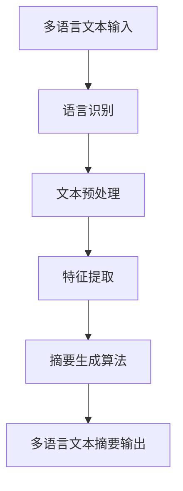

# 开发AI Agent的多语言文本摘要生成器

> 关键词：AI Agent、多语言、文本摘要生成器、自然语言处理、机器学习、深度学习、Transformer

> 摘要：本文聚焦于开发AI Agent的多语言文本摘要生成器这一前沿课题。首先介绍了开发该系统的背景，包括目的、预期读者等内容。接着深入探讨了核心概念，如多语言处理、文本摘要生成的原理及它们之间的联系，并给出了相应的架构示意图和流程图。详细阐述了核心算法原理，通过Python代码进行了讲解，同时给出了相关的数学模型和公式并举例说明。通过项目实战，展示了开发环境搭建、源代码实现与解读的过程。分析了该多语言文本摘要生成器的实际应用场景，推荐了学习资源、开发工具框架以及相关论文著作。最后总结了未来发展趋势与挑战，提供了常见问题解答和扩展阅读参考资料，旨在为相关领域的研究者和开发者提供全面且深入的技术指导。

## 1. 背景介绍 
### 1.1 目的和范围
在当今全球化的时代，信息以多种语言的形式海量产生。处理和理解这些多语言文本信息变得越来越重要。开发AI Agent的多语言文本摘要生成器的主要目的是为用户提供一种高效、准确且支持多种语言的文本摘要生成解决方案。通过该系统，用户可以快速获取多语言文本的核心内容，节省阅读和理解的时间。

本项目的范围涵盖了从多种语言的文本输入，到经过自然语言处理技术进行处理，最终生成简洁且有意义的文本摘要的整个过程。支持的语言包括但不限于英语、中文、法语、德语、西班牙语等常见语言，同时也具备一定的扩展性，能够支持更多的语言。

### 1.2 预期读者
本文的预期读者主要包括以下几类人群：
- **自然语言处理领域的研究者**：对多语言文本处理和文本摘要生成技术感兴趣，希望深入了解相关原理和算法，为进一步的研究提供参考。
- **AI开发者**：有一定的编程基础，想要开发多语言文本摘要生成系统，从本文中获取开发思路、技术细节和实践经验。
- **企业中的数据分析师和信息处理人员**：需要处理大量的多语言文本信息，希望借助该系统提高工作效率，获取有价值的信息。

### 1.3 文档结构概述
本文将按照以下结构进行组织：
- **核心概念与联系**：介绍多语言文本处理和文本摘要生成的核心概念，以及它们之间的联系，并给出架构示意图和流程图。
- **核心算法原理 & 具体操作步骤**：详细讲解实现多语言文本摘要生成的核心算法，通过Python代码展示具体的操作步骤。
- **数学模型和公式 & 详细讲解 & 举例说明**：给出相关的数学模型和公式，并通过具体例子进行详细讲解。
- **项目实战：代码实际案例和详细解释说明**：从开发环境搭建开始，逐步展示源代码的实现和解读过程。
- **实际应用场景**：分析多语言文本摘要生成器在不同领域的实际应用场景。
- **工具和资源推荐**：推荐学习资源、开发工具框架以及相关论文著作。
- **总结：未来发展趋势与挑战**：总结多语言文本摘要生成技术的未来发展趋势和面临的挑战。
- **附录：常见问题与解答**：提供常见问题的解答，帮助读者更好地理解和应用相关技术。
- **扩展阅读 & 参考资料**：提供扩展阅读的内容和参考资料，方便读者进一步深入学习。

### 1.4 术语表
#### 1.4.1 核心术语定义
- **AI Agent**：人工智能代理，是一种能够感知环境、进行决策并采取行动的智能实体，在本文中用于实现多语言文本摘要生成的相关任务。
- **多语言文本摘要生成器**：一种能够处理多种语言的文本，并生成其核心内容摘要的系统。
- **自然语言处理（NLP）**：计算机科学与人工智能领域中的一个重要方向，主要研究如何让计算机理解和处理人类语言。
- **文本摘要**：从原始文本中提取关键信息，生成简洁、有代表性的摘要的过程。

#### 1.4.2 相关概念解释
- **Transformer架构**：一种基于注意力机制的深度学习架构，在自然语言处理任务中取得了显著的效果，是实现多语言文本摘要生成的重要基础。
- **预训练模型**：在大规模语料上进行无监督学习训练得到的模型，通过微调可以应用于特定的自然语言处理任务，如文本摘要生成。
- **多语言支持**：系统能够处理多种不同语言的文本，通常需要考虑语言的语法、词汇、语义等方面的差异。

#### 1.4.3 缩略词列表
- **NLP**：自然语言处理（Natural Language Processing）
- **BERT**：双向编码器表示来自变压器（Bidirectional Encoder Representations from Transformers）
- **T5**：文本到文本传输变压器（Text-to-Text Transfer Transformer）

## 2. 核心概念与联系 

### 多语言文本处理
多语言文本处理是指对多种不同语言的文本进行分析、理解和转换的过程。由于不同语言在语法、词汇、语义等方面存在差异，多语言文本处理需要考虑这些因素，以实现准确的处理效果。例如，中文和英文的语法结构有很大的不同，中文的句子结构相对灵活，而英文则有较为严格的主谓宾结构。

### 文本摘要生成
文本摘要生成是从原始文本中提取关键信息，生成简洁、有代表性的摘要的过程。根据摘要的生成方式，可以分为抽取式摘要和生成式摘要。抽取式摘要通过从原始文本中选择重要的句子或短语来组成摘要，而生成式摘要则是通过自然语言生成技术，根据原始文本的语义信息生成全新的摘要。

### 核心概念的联系
多语言文本处理和文本摘要生成是紧密相关的。在进行多语言文本摘要生成时，首先需要对多语言文本进行处理，包括语言识别、分词、词性标注等操作，以理解文本的语义信息。然后，根据处理后的信息，运用文本摘要生成算法生成摘要。同时，由于不同语言的特点不同，在文本摘要生成过程中需要考虑语言的差异，以生成高质量的摘要。

### 架构的文本示意图
```plaintext
多语言文本输入 -> 语言识别 -> 文本预处理（分词、词性标注等） -> 特征提取 -> 摘要生成算法 -> 多语言文本摘要输出
```

### Mermaid流程图


## 3. 核心算法原理 & 具体操作步骤 

### 基于Transformer的多语言文本摘要生成算法原理
Transformer架构是一种基于注意力机制的深度学习架构，它能够有效地处理序列数据，在自然语言处理任务中取得了显著的效果。在多语言文本摘要生成中，我们可以使用预训练的Transformer模型，如T5，进行微调以适应特定的任务。

T5模型是一种文本到文本的Transformer模型，它将所有的自然语言处理任务都转换为文本生成任务。通过在大规模语料上进行预训练，T5模型学习到了丰富的语言知识和语义信息。在微调阶段，我们可以使用特定的数据集对T5模型进行训练，使其能够生成高质量的文本摘要。

### Python源代码详细阐述
```python
import torch
from transformers import T5Tokenizer, T5ForConditionalGeneration

# 加载预训练的T5模型和分词器
tokenizer = T5Tokenizer.from_pretrained("t5-base")
model = T5ForConditionalGeneration.from_pretrained("t5-base")

# 定义多语言文本
text = "This is a sample text in English. 这是一段中文示例文本。"

# 对文本进行编码
input_ids = tokenizer.encode("summarize: " + text, return_tensors="pt")

# 生成摘要
outputs = model.generate(input_ids)

# 解码摘要
summary = tokenizer.decode(outputs[0], skip_special_tokens=True)

print("摘要: ", summary)
```

### 具体操作步骤
1. **加载预训练模型和分词器**：使用`transformers`库加载预训练的T5模型和分词器。
2. **定义多语言文本**：将需要进行摘要生成的多语言文本输入。
3. **对文本进行编码**：使用分词器将文本转换为模型可以接受的输入格式，并添加`"summarize: "`前缀，以指示模型进行摘要生成任务。
4. **生成摘要**：使用模型的`generate`方法生成摘要。
5. **解码摘要**：使用分词器将生成的摘要解码为文本格式。

## 4. 数学模型和公式 & 详细讲解 & 举例说明 

### 注意力机制的数学模型
注意力机制是Transformer架构的核心，它能够根据输入序列的不同部分之间的相关性，动态地分配权重。注意力机制的数学模型可以表示为：

$$
\text{Attention}(Q, K, V) = \text{softmax}\left(\frac{QK^T}{\sqrt{d_k}}\right)V
$$

其中，$Q$ 是查询矩阵，$K$ 是键矩阵，$V$ 是值矩阵，$d_k$ 是键的维度。

### 详细讲解
- **查询矩阵 $Q$**：表示当前需要关注的位置的特征向量。
- **键矩阵 $K$**：表示输入序列中每个位置的特征向量。
- **值矩阵 $V$**：表示输入序列中每个位置的特征向量。
- **注意力分数**：$QK^T$ 计算查询向量与每个键向量之间的相似度。
- **缩放因子**：$\sqrt{d_k}$ 用于缩放注意力分数，防止梯度消失或爆炸。
- **softmax函数**：将注意力分数转换为概率分布，即注意力权重。
- **加权求和**：将注意力权重与值矩阵相乘并求和，得到最终的输出。

### 举例说明
假设我们有一个输入序列 $x = [x_1, x_2, x_3]$，其中每个 $x_i$ 是一个特征向量。我们可以将 $x$ 转换为查询矩阵 $Q$、键矩阵 $K$ 和值矩阵 $V$。

设 $Q = \begin{bmatrix} q_1 \\ q_2 \\ q_3 \end{bmatrix}$，$K = \begin{bmatrix} k_1 \\ k_2 \\ k_3 \end{bmatrix}$，$V = \begin{bmatrix} v_1 \\ v_2 \\ v_3 \end{bmatrix}$。

首先计算注意力分数：

$$
\text{scores} = QK^T = \begin{bmatrix} q_1 \cdot k_1 & q_1 \cdot k_2 & q_1 \cdot k_3 \\ q_2 \cdot k_1 & q_2 \cdot k_2 & q_2 \cdot k_3 \\ q_3 \cdot k_1 & q_3 \cdot k_2 & q_3 \cdot k_3 \end{bmatrix}
$$

然后进行缩放：

$$
\text{scaled_scores} = \frac{\text{scores}}{\sqrt{d_k}}
$$

接着使用softmax函数计算注意力权重：

$$
\text{weights} = \text{softmax}(\text{scaled_scores})
$$

最后进行加权求和：

$$
\text{output} = \text{weights}V
$$

## 5. 项目实战：代码实际案例和详细解释说明 

### 5.1  开发环境搭建
1. **安装Python**：确保你的系统中安装了Python 3.6或更高版本。
2. **创建虚拟环境**：使用`venv`或`conda`创建一个虚拟环境，以隔离项目的依赖。
```bash
# 使用venv创建虚拟环境
python -m venv myenv

# 激活虚拟环境
source myenv/bin/activate  # Linux/Mac
myenv\Scripts\activate  # Windows
```
3. **安装依赖库**：使用`pip`安装所需的依赖库，包括`transformers`、`torch`等。
```bash
pip install transformers torch
```

### 5.2  源代码详细实现和代码解读
```python
import torch
from transformers import T5Tokenizer, T5ForConditionalGeneration

# 加载预训练的T5模型和分词器
tokenizer = T5Tokenizer.from_pretrained("t5-base")
model = T5ForConditionalGeneration.from_pretrained("t5-base")

# 定义多语言文本
text = "This is a sample text in English. 这是一段中文示例文本。"

# 对文本进行编码
input_ids = tokenizer.encode("summarize: " + text, return_tensors="pt")

# 生成摘要
outputs = model.generate(input_ids)

# 解码摘要
summary = tokenizer.decode(outputs[0], skip_special_tokens=True)

print("摘要: ", summary)
```
- **加载预训练模型和分词器**：`T5Tokenizer.from_pretrained("t5-base")` 和 `T5ForConditionalGeneration.from_pretrained("t5-base")` 分别加载预训练的T5分词器和模型。
- **定义多语言文本**：将需要进行摘要生成的多语言文本赋值给变量`text`。
- **对文本进行编码**：`tokenizer.encode("summarize: " + text, return_tensors="pt")` 将文本转换为模型可以接受的输入格式，并添加`"summarize: "`前缀。
- **生成摘要**：`model.generate(input_ids)` 使用模型的`generate`方法生成摘要。
- **解码摘要**：`tokenizer.decode(outputs[0], skip_special_tokens=True)` 将生成的摘要解码为文本格式。

### 5.3  代码解读与分析
- **模型选择**：选择`T5-base`模型是因为它在多语言处理任务中表现较好，且具有一定的通用性。
- **前缀的作用**：添加`"summarize: "`前缀是为了指示模型进行摘要生成任务，这是T5模型的一种任务提示方式。
- **输出处理**：`skip_special_tokens=True` 用于跳过生成结果中的特殊标记，如开始标记、结束标记等，使输出更加简洁。

## 6. 实际应用场景 
### 新闻媒体领域
在新闻媒体领域，每天会产生大量的多语言新闻报道。使用多语言文本摘要生成器可以快速生成新闻的摘要，帮助读者快速了解新闻的核心内容，提高阅读效率。同时，也可以用于新闻的分类和推荐，根据摘要的内容将新闻推荐给相关的读者。

### 企业信息处理
企业在日常运营中会收到大量的多语言邮件、报告等文本信息。使用多语言文本摘要生成器可以快速提取这些文本的关键信息，帮助企业管理人员快速做出决策。例如，在市场调研中，对多语言的市场报告进行摘要生成，以便更好地了解市场动态。

### 教育领域
在教育领域，学生需要阅读大量的多语言教材、文献等资料。使用多语言文本摘要生成器可以帮助学生快速掌握资料的核心内容，提高学习效率。同时，也可以用于教师对学生作业的批改和反馈，根据摘要的内容判断学生对知识的掌握程度。

### 国际交流与合作
在国际交流与合作中，涉及到大量的多语言文件和会议记录。使用多语言文本摘要生成器可以快速生成这些文件和记录的摘要，方便各方快速了解内容，促进交流与合作的顺利进行。

## 7. 工具和资源推荐
### 7.1 学习资源推荐
#### 7.1.1 书籍推荐
- 《自然语言处理入门》：介绍了自然语言处理的基本概念、算法和技术，适合初学者入门。
- 《深度学习》：详细讲解了深度学习的原理和应用，对于理解Transformer架构和相关模型有很大的帮助。
- 《Python自然语言处理》：结合Python语言，介绍了自然语言处理的实践方法和工具。

#### 7.1.2 在线课程
- Coursera上的“Natural Language Processing Specialization”：由顶尖大学的教授授课，系统地介绍了自然语言处理的各个方面。
- edX上的“Deep Learning for Natural Language Processing”：专注于深度学习在自然语言处理中的应用，包括Transformer架构和预训练模型。
- 哔哩哔哩上的一些自然语言处理相关的教程：有很多优秀的UP主分享了自然语言处理的学习经验和实践案例。

#### 7.1.3 技术博客和网站
- Hugging Face的官方博客：提供了关于Transformer模型和自然语言处理的最新研究成果和实践经验。
- Medium上的自然语言处理相关的博客：有很多专业人士分享了自己的研究和实践心得。
- arXiv.org：可以获取到自然语言处理领域的最新学术论文。

### 7.2 开发工具框架推荐
#### 7.2.1 IDE和编辑器
- PyCharm：功能强大的Python集成开发环境，支持代码调试、自动补全、版本控制等功能。
- Visual Studio Code：轻量级的代码编辑器，支持多种编程语言，有丰富的插件可以扩展功能。
- Jupyter Notebook：交互式的开发环境，适合进行数据分析和模型训练的实验。

#### 7.2.2 调试和性能分析工具
- PyTorch Profiler：用于分析PyTorch模型的性能，找出性能瓶颈。
- TensorBoard：可视化工具，用于查看模型的训练过程和性能指标。
- cProfile：Python内置的性能分析工具，用于分析Python代码的性能。

#### 7.2.3 相关框架和库
- Transformers：Hugging Face开发的自然语言处理库，提供了多种预训练模型和工具，方便进行自然语言处理任务。
- PyTorch：深度学习框架，广泛应用于自然语言处理领域，支持GPU加速。
- NLTK：自然语言工具包，提供了丰富的自然语言处理工具和数据集。

### 7.3 相关论文著作推荐
#### 7.3.1 经典论文
- “Attention Is All You Need”：介绍了Transformer架构的原理和应用，是自然语言处理领域的经典论文。
- “BERT: Pre-training of Deep Bidirectional Transformers for Language Understanding”：提出了BERT模型，开启了预训练模型在自然语言处理中的应用热潮。
- “Exploring the Limits of Transfer Learning with a Unified Text-to-Text Transformer”：介绍了T5模型的原理和性能。

#### 7.3.2 最新研究成果
- 在ACL、EMNLP等自然语言处理领域的顶级会议上发表的论文，反映了该领域的最新研究成果。
- arXiv.org上的预印本论文，及时展示了最新的研究进展。

#### 7.3.3 应用案例分析
- 一些企业和研究机构发布的关于多语言文本处理和文本摘要生成的应用案例分析，具有很强的实践指导意义。

## 8. 总结：未来发展趋势与挑战
### 未来发展趋势
- **更强大的预训练模型**：随着计算资源的不断提升和研究的深入，未来会出现更强大的预训练模型，能够更好地处理多语言文本和生成高质量的摘要。
- **跨语言融合**：不仅能够处理多种语言的文本，还能够实现跨语言的知识融合和信息交互，提高多语言文本处理的效率和准确性。
- **与其他技术的结合**：与图像识别、语音识别等技术结合，实现多模态的文本摘要生成，提供更加丰富的信息服务。

### 挑战
- **语言差异**：不同语言在语法、词汇、语义等方面存在很大的差异，如何有效地处理这些差异是一个挑战。
- **数据稀缺**：对于一些小语种，可用的训练数据相对较少，这会影响模型的性能。
- **计算资源需求**：训练和运行多语言文本摘要生成模型需要大量的计算资源，如何降低计算成本是一个需要解决的问题。

## 9. 附录：常见问题与解答
### 问题1：如何提高多语言文本摘要生成的质量？
答：可以通过以下几种方法提高多语言文本摘要生成的质量：
- 使用更强大的预训练模型，如T5-large。
- 增加训练数据的多样性和规模，尤其是对于小语种。
- 进行模型的微调，根据具体的任务和数据集进行优化。

### 问题2：多语言文本摘要生成器支持哪些语言？
答：多语言文本摘要生成器的语言支持取决于所使用的预训练模型。一般来说，像T5这样的模型支持多种常见语言，如英语、中文、法语、德语、西班牙语等。同时，也可以通过扩展训练数据和模型来支持更多的语言。

### 问题3：如何处理不同语言的文本格式差异？
答：在文本预处理阶段，可以使用相应的工具和技术来处理不同语言的文本格式差异。例如，对于中文文本需要进行分词处理，而对于英文文本需要进行词干提取和词性标注等操作。

## 10. 扩展阅读 & 参考资料
### 扩展阅读
- 《Neural Machine Translation》：深入介绍了神经机器翻译的原理和技术，对于理解多语言文本处理有很大的帮助。
- 《Advances in Information Retrieval》：关于信息检索的最新研究成果，对于文本摘要生成有一定的启发。

### 参考资料
- Hugging Face官方文档：https://huggingface.co/docs
- PyTorch官方文档：https://pytorch.org/docs/stable/index.html
- NLTK官方文档：https://www.nltk.org/