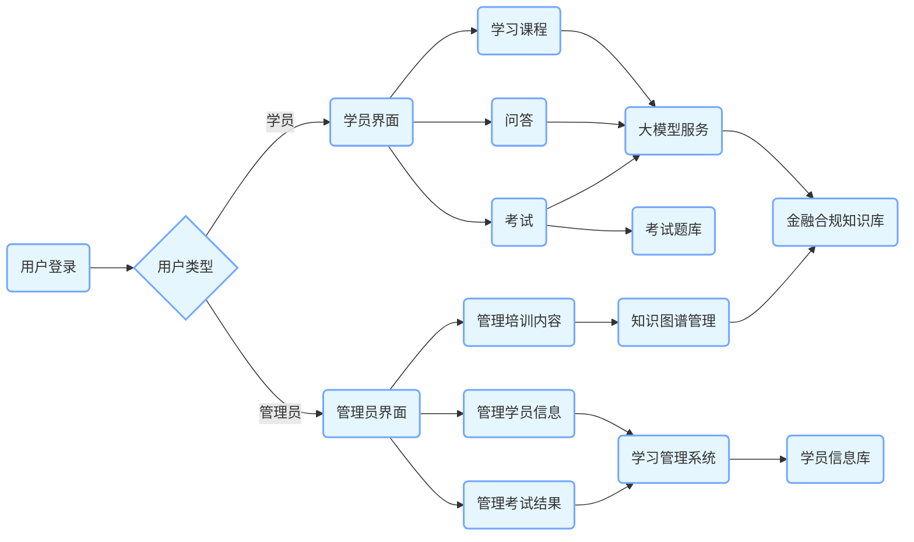

# 开发基于大模型的金融合规培训系统

> 关键词：大模型、金融合规培训系统、自然语言处理、人工智能、深度学习、知识图谱、在线学习

> 摘要：本文聚焦于开发基于大模型的金融合规培训系统，旨在解决传统金融合规培训效率低、效果差等问题。首先介绍了开发该系统的背景，包括目的、预期读者、文档结构和相关术语。接着阐述了核心概念，如大模型、金融合规等，并给出了系统架构示意图和流程图。详细讲解了核心算法原理，结合Python代码进行说明，同时介绍了相关数学模型和公式。通过项目实战，展示了开发环境搭建、源代码实现和代码解读。探讨了系统的实际应用场景，推荐了学习资源、开发工具和相关论文著作。最后总结了未来发展趋势与挑战，提供了常见问题解答和扩展阅读参考资料。

## 1. 背景介绍 
### 1.1 目的和范围
金融行业受到严格的监管，合规运营是金融机构生存和发展的基础。传统的金融合规培训通常采用线下课程、纸质资料等方式，存在培训效率低、更新不及时、缺乏个性化等问题。开发基于大模型的金融合规培训系统的目的在于利用先进的人工智能技术，为金融机构提供高效、个性化、智能化的合规培训解决方案。

本系统的范围涵盖金融合规知识的管理、培训课程的生成、学员学习情况的跟踪和评估等方面。系统将集成大模型的自然语言处理能力，实现对金融法规、政策的准确理解和解读，为学员提供实时、准确的培训内容。

### 1.2 预期读者
本文的预期读者包括金融机构的培训管理人员、合规部门工作人员、技术开发人员以及对金融科技和人工智能应用感兴趣的研究人员。对于培训管理人员和合规部门工作人员，本文将帮助他们了解如何利用大模型提升金融合规培训的效果；对于技术开发人员，本文将提供系统开发的详细技术指导；对于研究人员，本文将为他们的相关研究提供参考。

### 1.3 文档结构概述
本文将按照以下结构进行组织：
1. 背景介绍：阐述开发基于大模型的金融合规培训系统的目的、预期读者和文档结构。
2. 核心概念与联系：介绍大模型、金融合规等核心概念，以及它们之间的联系，并给出系统架构示意图和流程图。
3. 核心算法原理 & 具体操作步骤：讲解系统中使用的核心算法原理，如自然语言处理算法、深度学习算法等，并结合Python代码进行说明。
4. 数学模型和公式 & 详细讲解 & 举例说明：介绍系统中涉及的数学模型和公式，如损失函数、优化算法等，并进行详细讲解和举例说明。
5. 项目实战：代码实际案例和详细解释说明：通过实际项目案例，展示系统的开发过程，包括开发环境搭建、源代码实现和代码解读。
6. 实际应用场景：探讨系统在金融机构中的实际应用场景，如新员工入职培训、合规知识更新培训等。
7. 工具和资源推荐：推荐学习资源、开发工具和相关论文著作，帮助读者进一步深入学习和研究。
8. 总结：未来发展趋势与挑战：总结系统的发展趋势和面临的挑战，并提出相应的建议。
9. 附录：常见问题与解答：提供常见问题的解答，帮助读者解决在开发和使用系统过程中遇到的问题。
10. 扩展阅读 & 参考资料：提供相关的扩展阅读资料和参考资料，供读者进一步学习和研究。

### 1.4 术语表
#### 1.4.1 核心术语定义
- **大模型**：指具有大量参数和强大计算能力的人工智能模型，如GPT、BERT等。这些模型在自然语言处理、图像识别等领域取得了显著的成果。
- **金融合规**：指金融机构及其员工的经营管理和业务活动符合法律法规、监管要求、行业规范等规定。
- **自然语言处理（NLP）**：是人工智能的一个重要分支，研究如何让计算机理解和处理人类语言。
- **深度学习**：是一种基于人工神经网络的机器学习方法，通过构建多层神经网络来学习数据的特征和模式。
- **知识图谱**：是一种语义网络，用于表示实体之间的关系和知识。在金融合规培训系统中，知识图谱可以用于存储和管理金融法规、政策等知识。

#### 1.4.2 相关概念解释
- **在线学习**：指通过互联网进行学习的方式，学员可以随时随地访问学习资源。
- **个性化学习**：根据学员的学习情况、兴趣爱好等因素，为学员提供个性化的学习内容和学习路径。
- **智能辅导**：利用人工智能技术为学员提供实时、准确的辅导和解答。

#### 1.4.3 缩略词列表
- **NLP**：自然语言处理（Natural Language Processing）
- **GPT**：生成式预训练变换器（Generative Pretrained Transformer）
- **BERT**：双向编码器表示来自变换器（Bidirectional Encoder Representations from Transformers）
- **API**：应用程序编程接口（Application Programming Interface）

## 2. 核心概念与联系 

### 核心概念原理
#### 大模型
大模型是基于深度学习的人工智能模型，通常采用Transformer架构。Transformer架构具有强大的并行计算能力和长序列处理能力，能够有效地学习语言的语义和语法信息。大模型通过在大规模的文本数据上进行预训练，学习到通用的语言知识和模式。在金融合规培训系统中，大模型可以用于对金融法规、政策的理解和解读，生成培训内容，以及为学员提供智能辅导。

#### 金融合规
金融合规是金融机构运营的重要组成部分，涉及到法律法规、监管要求、行业规范等多个方面。金融合规知识具有复杂性、动态性和专业性的特点。金融合规培训系统需要对这些知识进行有效的管理和更新，确保学员学习到最新、最准确的合规知识。

#### 自然语言处理
自然语言处理是大模型在金融合规培训系统中的核心应用技术。通过自然语言处理技术，系统可以实现对金融法规、政策文本的理解和分析，提取关键信息，生成培训内容。同时，自然语言处理技术还可以实现学员与系统之间的自然语言交互，如问答、对话等。

#### 知识图谱
知识图谱是一种语义网络，用于表示实体之间的关系和知识。在金融合规培训系统中，知识图谱可以用于存储和管理金融法规、政策等知识。通过知识图谱，系统可以实现对知识的结构化表示和查询，为学员提供更加准确、全面的知识服务。

### 架构的文本示意图
```plaintext
金融合规培训系统架构示意图

用户界面层
|
|-- 学员界面：提供学习课程、问答、考试等功能
|-- 管理员界面：管理培训内容、学员信息、考试结果等
|
业务逻辑层
|
|-- 大模型服务：调用大模型进行知识理解、内容生成、智能辅导等
|-- 知识图谱管理：管理金融合规知识图谱，实现知识的存储、查询和更新
|-- 学习管理系统：管理学员的学习记录、学习进度、考试结果等
|
数据存储层
|
|-- 金融合规知识库：存储金融法规、政策等知识
|-- 学员信息库：存储学员的基本信息、学习记录等
|-- 考试题库：存储考试题目和答案
```

### Mermaid流程图


## 3. 核心算法原理 & 具体操作步骤 

### 自然语言处理算法原理
#### 文本分类
文本分类是自然语言处理中的一个重要任务，用于将文本划分到不同的类别中。在金融合规培训系统中，文本分类可以用于对金融法规、政策文本进行分类，以便更好地管理和查询。常见的文本分类算法有朴素贝叶斯、支持向量机、深度学习等。

以下是一个使用Python和Scikit-learn库实现的朴素贝叶斯文本分类示例：
```python
from sklearn.feature_extraction.text import TfidfVectorizer
from sklearn.naive_bayes import MultinomialNB
from sklearn.pipeline import Pipeline

# 训练数据
train_texts = ["这是关于金融风险的法规", "这是关于金融合规的政策"]
train_labels = ["金融风险法规", "金融合规政策"]

# 构建分类器
text_clf = Pipeline([
    ('tfidf', TfidfVectorizer()),
    ('clf', MultinomialNB())
])

# 训练模型
text_clf.fit(train_texts, train_labels)

# 测试数据
test_text = "这是关于金融合规的新法规"
predicted = text_clf.predict([test_text])

print("预测结果:", predicted[0])
```

#### 命名实体识别
命名实体识别是指从文本中识别出人名、地名、组织机构名、日期等实体。在金融合规培训系统中，命名实体识别可以用于提取金融法规、政策文本中的关键实体信息，如金融机构名称、法规名称等。常见的命名实体识别算法有基于规则的方法、基于机器学习的方法和基于深度学习的方法。

以下是一个使用Python和Hugging Face的Transformers库实现的基于BERT模型的命名实体识别示例：
```python
from transformers import AutoTokenizer, AutoModelForTokenClassification
import torch

# 加载预训练模型和分词器
tokenizer = AutoTokenizer.from_pretrained("dbmdz/bert-large-cased-finetuned-conll03-english")
model = AutoModelForTokenClassification.from_pretrained("dbmdz/bert-large-cased-finetuned-conll03-english")

# 输入文本
text = "The European Central Bank is located in Frankfurt."

# 分词
inputs = tokenizer(text, return_tensors="pt")

# 模型推理
with torch.no_grad():
    outputs = model(**inputs)

# 获取预测结果
logits = outputs.logits
predictions = torch.argmax(logits, dim=2)

# 解码预测结果
tokens = tokenizer.convert_ids_to_tokens(inputs["input_ids"][0])
labels = model.config.id2label
for token, prediction in zip(tokens, predictions[0]):
    print(token, labels[prediction.item()])
```

### 深度学习算法原理
#### 神经网络基础
神经网络是深度学习的核心，由输入层、隐藏层和输出层组成。神经元是神经网络的基本单元，通过激活函数将输入信号转换为输出信号。常见的激活函数有Sigmoid函数、ReLU函数等。

#### 前向传播和反向传播
前向传播是指输入数据通过神经网络的各层计算，得到输出结果的过程。反向传播是指根据输出结果和真实标签计算损失函数，然后通过链式法则将损失函数的梯度反向传播到神经网络的各层，更新神经元的权重和偏置。

以下是一个使用Python和PyTorch库实现的简单神经网络示例：
```python
import torch
import torch.nn as nn
import torch.optim as optim

# 定义神经网络模型
class SimpleNet(nn.Module):
    def __init__(self):
        super(SimpleNet, self).__init__()
        self.fc1 = nn.Linear(2, 3)
        self.fc2 = nn.Linear(3, 1)

    def forward(self, x):
        x = torch.relu(self.fc1(x))
        x = self.fc2(x)
        return x

# 创建模型实例
model = SimpleNet()

# 定义损失函数和优化器
criterion = nn.MSELoss()
optimizer = optim.SGD(model.parameters(), lr=0.01)

# 训练数据
inputs = torch.tensor([[1.0, 2.0], [2.0, 3.0]], dtype=torch.float32)
labels = torch.tensor([[3.0], [4.0]], dtype=torch.float32)

# 训练模型
for epoch in range(100):
    optimizer.zero_grad()
    outputs = model(inputs)
    loss = criterion(outputs, labels)
    loss.backward()
    optimizer.step()

    if (epoch + 1) % 10 == 0:
        print(f'Epoch {epoch + 1}, Loss: {loss.item()}')
```

### 具体操作步骤
1. **数据收集和预处理**：收集金融法规、政策文本数据，并进行清洗、分词、标注等预处理操作。
2. **模型选择和训练**：根据任务需求选择合适的大模型，如GPT、BERT等，并在预处理后的数据上进行微调训练。
3. **系统开发和集成**：使用Python和相关框架开发金融合规培训系统的各个模块，如用户界面、业务逻辑层、数据存储层等，并将大模型集成到系统中。
4. **系统测试和优化**：对系统进行功能测试、性能测试等，发现并解决问题，优化系统性能。
5. **系统部署和上线**：将系统部署到生产环境中，为金融机构的学员提供服务。

## 4. 数学模型和公式 & 详细讲解 & 举例说明 

### 损失函数
#### 交叉熵损失函数
交叉熵损失函数常用于分类任务，用于衡量模型预测结果与真实标签之间的差异。对于一个多分类问题，假设模型的预测概率分布为 $p = (p_1, p_2, \cdots, p_n)$，真实标签的概率分布为 $q = (q_1, q_2, \cdots, q_n)$，则交叉熵损失函数定义为：
$$
H(p, q) = -\sum_{i=1}^{n} q_i \log(p_i)
$$

在二分类问题中，交叉熵损失函数可以简化为：
$$
H(p, q) = -y \log(p) - (1 - y) \log(1 - p)
$$
其中，$y$ 是真实标签（0 或 1），$p$ 是模型预测为正类的概率。

以下是一个使用Python和PyTorch库实现的交叉熵损失函数示例：
```python
import torch
import torch.nn as nn

# 定义交叉熵损失函数
criterion = nn.CrossEntropyLoss()

# 模型预测结果
outputs = torch.tensor([[0.2, 0.3, 0.5], [0.1, 0.8, 0.1]], dtype=torch.float32)
# 真实标签
labels = torch.tensor([2, 1], dtype=torch.long)

# 计算损失
loss = criterion(outputs, labels)

print("交叉熵损失:", loss.item())
```

#### 均方误差损失函数
均方误差损失函数常用于回归任务，用于衡量模型预测结果与真实值之间的平均平方误差。假设模型的预测值为 $\hat{y}$，真实值为 $y$，则均方误差损失函数定义为：
$$
MSE = \frac{1}{n} \sum_{i=1}^{n} (y_i - \hat{y}_i)^2
$$

以下是一个使用Python和PyTorch库实现的均方误差损失函数示例：
```python
import torch
import torch.nn as nn

# 定义均方误差损失函数
criterion = nn.MSELoss()

# 模型预测结果
outputs = torch.tensor([[1.2], [2.3]], dtype=torch.float32)
# 真实值
labels = torch.tensor([[1.0], [2.0]], dtype=torch.float32)

# 计算损失
loss = criterion(outputs, labels)

print("均方误差损失:", loss.item())
```

### 优化算法
#### 随机梯度下降（SGD）
随机梯度下降是一种常用的优化算法，用于更新神经网络的权重和偏置。其基本思想是在每次迭代中，随机选择一个样本或一个小批量样本，计算损失函数关于权重和偏置的梯度，然后根据梯度更新权重和偏置。

权重更新公式为：
$$
\theta_{t+1} = \theta_t - \eta \nabla L(\theta_t)
$$
其中，$\theta$ 是权重和偏置，$\eta$ 是学习率，$\nabla L(\theta_t)$ 是损失函数关于 $\theta$ 在第 $t$ 次迭代时的梯度。

以下是一个使用Python和PyTorch库实现的随机梯度下降优化算法示例：
```python
import torch
import torch.nn as nn
import torch.optim as optim

# 定义神经网络模型
class SimpleNet(nn.Module):
    def __init__(self):
        super(SimpleNet, self).__init__()
        self.fc = nn.Linear(2, 1)

    def forward(self, x):
        x = self.fc(x)
        return x

# 创建模型实例
model = SimpleNet()

# 定义损失函数和优化器
criterion = nn.MSELoss()
optimizer = optim.SGD(model.parameters(), lr=0.01)

# 训练数据
inputs = torch.tensor([[1.0, 2.0], [2.0, 3.0]], dtype=torch.float32)
labels = torch.tensor([[3.0], [4.0]], dtype=torch.float32)

# 训练模型
for epoch in range(100):
    optimizer.zero_grad()
    outputs = model(inputs)
    loss = criterion(outputs, labels)
    loss.backward()
    optimizer.step()

    if (epoch + 1) % 10 == 0:
        print(f'Epoch {epoch + 1}, Loss: {loss.item()}')
```

#### Adam优化算法
Adam优化算法是一种自适应学习率的优化算法，结合了动量法和自适应梯度算法的优点。它能够自适应地调整每个参数的学习率，提高训练效率。

Adam优化算法的更新公式如下：
$$
m_{t+1} = \beta_1 m_t + (1 - \beta_1) \nabla L(\theta_t)
$$
$$
v_{t+1} = \beta_2 v_t + (1 - \beta_2) (\nabla L(\theta_t))^2
$$
$$
\hat{m}_{t+1} = \frac{m_{t+1}}{1 - \beta_1^{t+1}}
$$
$$
\hat{v}_{t+1} = \frac{v_{t+1}}{1 - \beta_2^{t+1}}
$$
$$
\theta_{t+1} = \theta_t - \frac{\eta}{\sqrt{\hat{v}_{t+1}} + \epsilon} \hat{m}_{t+1}
$$
其中，$m$ 是一阶矩估计（动量），$v$ 是二阶矩估计（自适应学习率），$\beta_1$ 和 $\beta_2$ 是超参数，通常分别设置为 0.9 和 0.999，$\epsilon$ 是一个很小的常数，用于避免除零错误。

以下是一个使用Python和PyTorch库实现的Adam优化算法示例：
```python
import torch
import torch.nn as nn
import torch.optim as optim

# 定义神经网络模型
class SimpleNet(nn.Module):
    def __init__(self):
        super(SimpleNet, self).__init__()
        self.fc = nn.Linear(2, 1)

    def forward(self, x):
        x = self.fc(x)
        return x

# 创建模型实例
model = SimpleNet()

# 定义损失函数和优化器
criterion = nn.MSELoss()
optimizer = optim.Adam(model.parameters(), lr=0.01)

# 训练数据
inputs = torch.tensor([[1.0, 2.0], [2.0, 3.0]], dtype=torch.float32)
labels = torch.tensor([[3.0], [4.0]], dtype=torch.float32)

# 训练模型
for epoch in range(100):
    optimizer.zero_grad()
    outputs = model(inputs)
    loss = criterion(outputs, labels)
    loss.backward()
    optimizer.step()

    if (epoch + 1) % 10 == 0:
        print(f'Epoch {epoch + 1}, Loss: {loss.item()}')
```

## 5. 项目实战：代码实际案例和详细解释说明 

### 5.1  开发环境搭建
#### 操作系统
建议使用Linux系统，如Ubuntu 18.04或更高版本。

#### Python环境
安装Python 3.7或更高版本，可以使用Anaconda或Miniconda来管理Python环境。

#### 安装依赖库
使用以下命令安装所需的依赖库：
```bash
pip install torch transformers scikit-learn flask
```

### 5.2  源代码详细实现和代码解读
#### 大模型服务模块
```python
from transformers import AutoTokenizer, AutoModelForCausalLM
import torch

# 加载预训练模型和分词器
tokenizer = AutoTokenizer.from_pretrained("gpt2")
model = AutoModelForCausalLM.from_pretrained("gpt2")

def generate_text(prompt):
    """
    根据输入的提示生成文本
    :param prompt: 输入的提示文本
    :return: 生成的文本
    """
    input_ids = tokenizer.encode(prompt, return_tensors="pt")
    output = model.generate(input_ids, max_length=100, num_beams=5, no_repeat_ngram_size=2, early_stopping=True)
    generated_text = tokenizer.decode(output[0], skip_special_tokens=True)
    return generated_text
```
代码解读：
- 首先，使用`AutoTokenizer`和`AutoModelForCausalLM`从Hugging Face的模型库中加载预训练的GPT-2模型和分词器。
- `generate_text`函数接受一个提示文本作为输入，将其编码为模型可以接受的输入格式，然后使用模型生成文本，最后将生成的文本解码并返回。

#### 知识图谱管理模块
```python
from py2neo import Graph, Node, Relationship

# 连接到Neo4j图数据库
graph = Graph("bolt://localhost:7687", auth=("neo4j", "password"))

def add_entity(entity_name, entity_type):
    """
    向知识图谱中添加实体
    :param entity_name: 实体名称
    :param entity_type: 实体类型
    """
    node = Node(entity_type, name=entity_name)
    graph.create(node)

def add_relationship(source_entity, target_entity, relationship_type):
    """
    向知识图谱中添加关系
    :param source_entity: 源实体名称
    :param target_entity: 目标实体名称
    :param relationship_type: 关系类型
    """
    source_node = graph.nodes.match(name=source_entity).first()
    target_node = graph.nodes.match(name=target_entity).first()
    if source_node and target_node:
        rel = Relationship(source_node, relationship_type, target_node)
        graph.create(rel)

def query_entities(entity_type):
    """
    查询指定类型的实体
    :param entity_type: 实体类型
    :return: 实体列表
    """
    query = f"MATCH (n:{entity_type}) RETURN n.name"
    result = graph.run(query)
    entities = [record[0] for record in result]
    return entities
```
代码解读：
- 使用`py2neo`库连接到Neo4j图数据库。
- `add_entity`函数用于向知识图谱中添加实体，创建一个节点并将其添加到图数据库中。
- `add_relationship`函数用于向知识图谱中添加关系，查找源实体和目标实体节点，然后创建一个关系并将其添加到图数据库中。
- `query_entities`函数用于查询指定类型的实体，执行Cypher查询并返回查询结果。

#### 用户界面模块
```python
from flask import Flask, request, jsonify
import json

app = Flask(__name__)

# 导入大模型服务模块和知识图谱管理模块
from big_model_service import generate_text
from knowledge_graph_manager import query_entities

@app.route('/generate_text', methods=['POST'])
def api_generate_text():
    """
    处理生成文本的API请求
    """
    data = request.get_json()
    prompt = data.get('prompt')
    if prompt:
        generated_text = generate_text(prompt)
        return jsonify({"generated_text": generated_text})
    else:
        return jsonify({"error": "Missing prompt"}), 400

@app.route('/query_entities', methods=['GET'])
def api_query_entities():
    """
    处理查询实体的API请求
    """
    entity_type = request.args.get('entity_type')
    if entity_type:
        entities = query_entities(entity_type)
        return jsonify({"entities": entities})
    else:
        return jsonify({"error": "Missing entity_type"}), 400

if __name__ == '__main__':
    app.run(debug=True)
```
代码解读：
- 使用Flask框架创建一个Web应用程序。
- 定义两个API接口：`/generate_text`用于处理生成文本的请求，`/query_entities`用于处理查询实体的请求。
- 当接收到请求时，调用相应的函数进行处理，并返回JSON格式的响应。

### 5.3  代码解读与分析
#### 大模型服务模块
- 该模块使用了Hugging Face的Transformers库，通过加载预训练的GPT-2模型实现了文本生成功能。
- 优点是可以利用预训练模型的强大语言生成能力，快速实现文本生成功能。
- 缺点是模型的计算资源需求较大，需要较高的硬件配置。

#### 知识图谱管理模块
- 该模块使用了`py2neo`库连接到Neo4j图数据库，实现了实体和关系的添加、查询功能。
- 优点是图数据库可以有效地存储和管理实体之间的关系，方便进行知识查询和推理。
- 缺点是图数据库的性能和扩展性可能受到数据规模和查询复杂度的影响。

#### 用户界面模块
- 该模块使用了Flask框架创建了一个简单的Web应用程序，提供了两个API接口。
- 优点是Flask框架简单易用，开发效率高，可以快速搭建Web服务。
- 缺点是对于大规模的并发请求，可能需要使用更强大的Web框架或进行性能优化。

## 6. 实际应用场景 
### 新员工入职培训
对于新入职的金融员工，基于大模型的金融合规培训系统可以为他们提供全面、系统的合规知识培训。系统可以根据员工的岗位和职责，为他们生成个性化的培训课程，包括金融法规、政策解读、合规案例分析等内容。通过在线学习和智能辅导，新员工可以快速掌握合规知识，提高合规意识。

### 合规知识更新培训
金融法规和政策不断更新变化，金融机构需要及时对员工进行合规知识更新培训。系统可以实时监测法规和政策的变化，自动生成更新后的培训内容，并推送给相关员工。员工可以通过系统随时随地学习最新的合规知识，确保自己的业务活动符合最新的法规要求。

### 合规考试和评估
系统可以提供合规考试功能，根据培训内容生成考试题目，对员工的合规知识掌握情况进行评估。考试结果可以实时反馈给员工和管理人员，帮助他们了解员工的学习效果和合规水平。对于考试不合格的员工，系统可以提供针对性的辅导和培训，帮助他们提高合规知识水平。

### 合规咨询和答疑
员工在日常工作中遇到合规问题时，可以通过系统向大模型咨询。大模型可以根据问题的描述，提供准确、详细的解答和建议。同时，系统还可以记录员工的咨询问题和解答结果，形成知识问答库，供其他员工参考。

## 7. 工具和资源推荐
### 7.1 学习资源推荐
#### 7.1.1 书籍推荐
- 《深度学习》（Deep Learning）：由Ian Goodfellow、Yoshua Bengio和Aaron Courville合著，是深度学习领域的经典教材，系统介绍了深度学习的基本概念、算法和应用。
- 《Python自然语言处理》（Natural Language Processing with Python）：由Steven Bird、Ewan Klein和Edward Loper合著，详细介绍了Python在自然语言处理中的应用，包括文本处理、分类、命名实体识别等任务。
- 《知识图谱：方法、实践与应用》：由王昊奋、漆桂林、陈华钧主编，全面介绍了知识图谱的基本概念、构建方法和应用场景。

#### 7.1.2 在线课程
- Coursera上的“深度学习专项课程”（Deep Learning Specialization）：由Andrew Ng教授授课，包括深度学习基础、改善深层神经网络、结构化机器学习项目等多个课程，是学习深度学习的优质资源。
- edX上的“自然语言处理”（Natural Language Processing）：由哈佛大学和麻省理工学院联合开设，系统介绍了自然语言处理的基本概念、算法和应用。
- 阿里云大学上的“知识图谱实战教程”：介绍了知识图谱的构建方法和应用案例，通过实际项目帮助学员掌握知识图谱的开发和应用。

#### 7.1.3 技术博客和网站
- Hugging Face官方博客：提供了关于Transformer模型、自然语言处理等领域的最新研究成果和技术应用案例。
- Medium上的Towards Data Science：汇集了大量数据科学、机器学习、人工智能等领域的优质文章，包括技术教程、研究论文解读等。
- 机器之心：关注人工智能领域的最新动态和技术发展趋势，提供了丰富的技术文章和研究报告。

### 7.2 开发工具框架推荐
#### 7.2.1 IDE和编辑器
- PyCharm：是一款专业的Python集成开发环境，提供了代码编辑、调试、版本控制等功能，适合开发Python项目。
- Visual Studio Code：是一款轻量级的代码编辑器，支持多种编程语言和插件扩展，具有丰富的代码编辑和调试功能。

#### 7.2.2 调试和性能分析工具
- TensorBoard：是TensorFlow提供的可视化工具，可以用于可视化模型的训练过程、损失函数变化、模型结构等信息，帮助开发者进行调试和性能分析。
- Py-Spy：是一个用于分析Python代码性能的工具，可以实时监测Python程序的CPU使用率、函数调用时间等信息，帮助开发者找出性能瓶颈。

#### 7.2.3 相关框架和库
- PyTorch：是一个开源的深度学习框架，具有动态图、易于使用等特点，广泛应用于自然语言处理、计算机视觉等领域。
- Transformers：是Hugging Face开发的自然语言处理库，提供了大量预训练的模型和工具，方便开发者进行自然语言处理任务的开发。
- Neo4j：是一个开源的图数据库，用于存储和管理实体之间的关系，适合构建知识图谱应用。

### 7.3 相关论文著作推荐
#### 7.3.1 经典论文
- “Attention Is All You Need”：提出了Transformer架构，是自然语言处理领域的重要突破，为后续的大模型发展奠定了基础。
- “BERT: Pre-training of Deep Bidirectional Transformers for Language Understanding”：介绍了BERT模型，通过双向预训练的方式提高了模型的语言理解能力。
- “Knowledge Graph Embedding: A Survey of Approaches and Applications”：对知识图谱嵌入技术进行了全面的综述，介绍了各种知识图谱嵌入方法和应用场景。

#### 7.3.2 最新研究成果
- 关注arXiv上的最新论文，特别是关于大模型、自然语言处理、知识图谱等领域的研究成果。
- 参加相关的学术会议，如ACL（Association for Computational Linguistics）、EMNLP（Conference on Empirical Methods in Natural Language Processing）等，了解最新的研究动态。

#### 7.3.3 应用案例分析
- 研究金融机构的实际应用案例，了解基于大模型的金融合规培训系统在实际应用中的效果和挑战。
- 分析其他行业的类似应用案例，借鉴其经验和做法，为金融合规培训系统的开发和应用提供参考。

## 8. 总结：未来发展趋势与挑战
### 未来发展趋势
#### 模型性能不断提升
随着计算资源的不断增加和算法的不断优化，大模型的性能将不断提升。模型将能够处理更加复杂的自然语言任务，生成更加准确、流畅的文本，为金融合规培训系统提供更强大的支持。

#### 个性化学习体验增强
未来的金融合规培训系统将更加注重个性化学习体验。系统将根据学员的学习情况、兴趣爱好、职业发展规划等因素，为学员提供更加个性化的学习内容和学习路径。同时，系统还将利用智能辅导和反馈机制，帮助学员更好地掌握合规知识。

#### 与其他技术融合发展
金融合规培训系统将与其他技术，如区块链、物联网等进行融合发展。例如，利用区块链技术确保培训记录的真实性和不可篡改，利用物联网技术实现培训设备的智能化管理。

#### 跨领域应用拓展
基于大模型的金融合规培训系统的技术和方法可以拓展到其他领域，如医疗合规、教育合规等。通过将金融合规培训系统的成功经验应用到其他领域，可以为更多行业提供高效、个性化的合规培训解决方案。

### 挑战
#### 数据隐私和安全问题
金融合规培训系统涉及大量的敏感数据，如学员信息、金融法规文本等。如何保障数据的隐私和安全是一个重要的挑战。需要采用先进的加密技术、访问控制技术等，确保数据不被泄露和滥用。

#### 模型可解释性问题
大模型通常是黑盒模型，其决策过程难以解释。在金融合规培训系统中，模型的决策结果可能会对学员的学习和职业发展产生重要影响。因此，如何提高模型的可解释性，让用户理解模型的决策过程和依据，是一个亟待解决的问题。

#### 法规和政策变化的适应性
金融法规和政策不断变化，金融合规培训系统需要及时适应这些变化。如何快速、准确地更新培训内容，确保学员学习到最新的合规知识，是系统开发和维护过程中的一个挑战。

#### 技术人才短缺
开发基于大模型的金融合规培训系统需要具备深度学习、自然语言处理、知识图谱等多方面的技术知识。目前，相关领域的技术人才短缺，如何培养和吸引优秀的技术人才是金融机构和科技企业面临的一个挑战。

## 9. 附录：常见问题与解答
### 问题1：如何选择适合的大模型？
解答：选择适合的大模型需要考虑多个因素，如任务需求、计算资源、数据规模等。如果任务是文本生成，可以选择GPT系列模型；如果任务是文本分类、命名实体识别等，可以选择BERT系列模型。同时，还需要考虑模型的大小和复杂度，确保计算资源能够支持模型的运行。

### 问题2：如何确保知识图谱的准确性和完整性？
解答：确保知识图谱的准确性和完整性需要从多个方面入手。首先，要收集准确、全面的数据源，如金融法规文本、行业报告等。其次，要采用有效的知识抽取和融合方法，确保知识的准确提取和整合。最后，要建立知识图谱的质量评估和更新机制，及时发现和纠正知识图谱中的错误和缺失。

### 问题3：如何提高系统的性能和响应速度？
解答：提高系统的性能和响应速度可以从以下几个方面入手。一是优化模型的结构和参数，减少模型的计算量。二是采用分布式计算和并行计算技术，提高系统的处理能力。三是使用缓存技术，减少重复计算。四是优化数据库的查询语句和索引，提高数据的查询效率。

### 问题4：如何进行系统的安全防护？
解答：进行系统的安全防护需要采取多种措施。一是采用加密技术对数据进行加密，确保数据在传输和存储过程中的安全性。二是建立访问控制机制，对用户的访问权限进行严格管理。三是定期进行安全漏洞扫描和修复，及时发现和解决安全问题。四是加强员工的安全意识培训，提高员工的安全防范能力。

## 10. 扩展阅读 & 参考资料
### 扩展阅读
- 《人工智能：现代方法》（Artificial Intelligence: A Modern Approach）：全面介绍了人工智能的基本概念、算法和应用，是人工智能领域的经典教材。
- 《大数据时代：生活、工作与思维的大变革》（Big Data: A Revolution That Will Transform How We Live, Work, and Think）：探讨了大数据时代的特点和影响，以及大数据在各个领域的应用。
- 《智能时代：大数据与智能革命重新定义未来》：介绍了智能时代的发展趋势和影响，以及人工智能在各个领域的应用案例。

### 参考资料
- Hugging Face官方文档：https://huggingface.co/docs
- PyTorch官方文档：https://pytorch.org/docs/stable/index.html
- Neo4j官方文档：https://neo4j.com/docs/
- 中国人民银行、银保监会、证监会等金融监管机构的官方网站，获取最新的金融法规和政策信息。