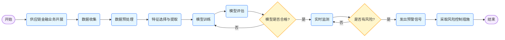

# 开发智能化的供应链金融风险预警模型

> 关键词：供应链金融、风险预警模型、智能化、机器学习、数据挖掘

> 摘要：本文围绕开发智能化的供应链金融风险预警模型展开，详细阐述了该模型开发的背景、核心概念、算法原理、数学模型等内容。通过逐步分析推理，讲解了如何利用Python实现具体的算法，并结合实际案例展示了模型的开发过程。同时，探讨了该模型的实际应用场景，推荐了相关的学习资源、开发工具和论文著作。最后对供应链金融风险预警模型的未来发展趋势与挑战进行了总结，并提供了常见问题解答和扩展阅读参考资料。

## 1. 背景介绍 
### 1.1 目的和范围
供应链金融作为一种新兴的金融服务模式，将核心企业和上下游企业联系在一起，通过整合物流、资金流和信息流，为供应链上的企业提供融资支持。然而，供应链金融业务涉及多个参与方和复杂的交易流程，面临着多种风险，如信用风险、市场风险、操作风险等。开发智能化的供应链金融风险预警模型的目的在于通过对供应链金融业务中的各种数据进行分析和挖掘，及时发现潜在的风险，为金融机构和企业提供决策支持，降低风险损失。

本文章的范围涵盖了供应链金融风险预警模型的开发全过程，包括核心概念的介绍、算法原理的讲解、数学模型的构建、实际案例的分析以及应用场景的探讨等。

### 1.2 预期读者
本文预期读者包括金融机构的风险管理部门人员、供应链金融业务从业者、数据科学家、机器学习工程师以及对供应链金融风险预警感兴趣的研究人员。

### 1.3 文档结构概述
本文将按照以下结构进行阐述：首先介绍供应链金融风险预警模型开发的背景知识，包括目的、预期读者和文档结构等；接着讲解核心概念，包括供应链金融、风险预警模型等，并给出相关的示意图和流程图；然后详细阐述核心算法原理和具体操作步骤，使用Python代码进行示例；之后介绍数学模型和公式，并结合实际例子进行说明；再通过项目实战展示模型的开发过程，包括开发环境搭建、源代码实现和代码解读；接着探讨模型的实际应用场景；推荐相关的工具和资源；最后对模型的未来发展趋势与挑战进行总结，提供常见问题解答和扩展阅读参考资料。

### 1.4 术语表
#### 1.4.1 核心术语定义
- **供应链金融**：是指金融机构围绕核心企业，管理上下游中小企业的资金流和物流，把单个企业的不可控风险转变为供应链企业整体的可控风险，通过立体获取各类信息，将风险控制在最低的金融服务。
- **风险预警模型**：是一种基于数据分析和机器学习技术，对潜在风险进行识别、评估和预测的模型，能够在风险发生前发出预警信号。
- **信用风险**：指借款人或交易对手未能履行合同规定的义务或信用质量发生变化，影响金融产品价值，从而给债权人或金融产品持有人造成经济损失的风险。
- **市场风险**：指因市场价格（利率、汇率、股票价格和商品价格）的不利变动而使银行表内和表外业务发生损失的风险。
- **操作风险**：指由于不完善或有问题的内部程序、人为错误、系统故障或外部事件所造成损失的风险。

#### 1.4.2 相关概念解释
- **数据挖掘**：是指从大量的数据中通过算法搜索隐藏于其中信息的过程。在供应链金融风险预警模型中，数据挖掘技术可用于发现数据中的潜在模式和规律，为风险预警提供依据。
- **机器学习**：是一门多领域交叉学科，涉及概率论、统计学、逼近论、凸分析、算法复杂度理论等多门学科。它专门研究计算机怎样模拟或实现人类的学习行为，以获取新的知识或技能，重新组织已有的知识结构使之不断改善自身的性能。在风险预警模型中，机器学习算法可用于构建预测模型，对风险进行分类和预测。

#### 1.4.3 缩略词列表
- **AI**：Artificial Intelligence，人工智能
- **ML**：Machine Learning，机器学习
- **PCA**：Principal Component Analysis，主成分分析
- **SVM**：Support Vector Machine，支持向量机
- **RF**：Random Forest，随机森林

## 2. 核心概念与联系 
### 2.1 供应链金融核心概念
供应链金融的核心在于核心企业与上下游企业之间的合作关系以及资金流、物流和信息流的整合。核心企业在供应链中具有较强的影响力和信用实力，金融机构通过与核心企业合作，为上下游中小企业提供融资服务。

### 2.2 风险预警模型核心概念
风险预警模型是基于对供应链金融业务中各种数据的分析和挖掘，通过建立数学模型和算法，对潜在风险进行识别、评估和预测。模型会根据设定的阈值，在风险达到一定程度时发出预警信号。

### 2.3 两者联系
供应链金融为风险预警模型提供了数据来源和应用场景，而风险预警模型则为供应链金融的风险管理提供了技术支持和决策依据。通过风险预警模型，金融机构可以及时发现供应链金融业务中的潜在风险，采取相应的措施进行风险控制，保障供应链金融业务的稳定运行。

### 2.4 文本示意图
```plaintext
供应链金融
|
|-- 核心企业
|   |
|   |-- 上游供应商
|   |   |
|   |   |-- 融资需求
|   |   |-- 信用评估
|   |
|   |-- 下游经销商
|       |
|       |-- 融资需求
|       |-- 信用评估
|
|-- 金融机构
|   |
|   |-- 风险预警模型
|       |
|       |-- 数据收集
|       |-- 数据分析
|       |-- 风险预测
|       |-- 预警信号
```

### 2.5 Mermaid流程图


## 3. 核心算法原理 & 具体操作步骤 
### 3.1 主成分分析（PCA）
#### 3.1.1 算法原理
主成分分析是一种无监督学习算法，用于数据降维。它通过找到数据的主成分，将高维数据投影到低维空间，同时保留数据的主要信息。主成分是数据方差最大的方向，通过计算数据的协方差矩阵的特征值和特征向量来确定。

#### 3.1.2 Python代码实现
```python
import numpy as np
from sklearn.decomposition import PCA

# 生成示例数据
X = np.array([[1, 2, 3], [4, 5, 6], [7, 8, 9], [10, 11, 12]])

# 创建PCA对象，指定降维后的维度
pca = PCA(n_components=2)

# 拟合数据并进行降维
X_pca = pca.fit_transform(X)

print("降维后的数据：")
print(X_pca)
```

#### 3.1.3 具体操作步骤
1. 数据标准化：对原始数据进行标准化处理，使每个特征的均值为0，标准差为1。
2. 计算协方差矩阵：计算标准化后数据的协方差矩阵。
3. 计算特征值和特征向量：对协方差矩阵进行特征分解，得到特征值和特征向量。
4. 选择主成分：根据特征值的大小，选择前k个最大的特征值对应的特征向量作为主成分。
5. 数据投影：将原始数据投影到选择的主成分上，得到降维后的数据。

### 3.2 支持向量机（SVM）
#### 3.2.1 算法原理
支持向量机是一种有监督学习算法，用于分类和回归分析。它通过寻找一个最优的超平面，将不同类别的数据分开，使得两类数据到超平面的距离最大。在处理非线性分类问题时，SVM会使用核函数将数据映射到高维空间，从而找到线性可分的超平面。

#### 3.2.2 Python代码实现
```python
from sklearn import datasets
from sklearn.model_selection import train_test_split
from sklearn.svm import SVC

# 加载鸢尾花数据集
iris = datasets.load_iris()
X = iris.data
y = iris.target

# 划分训练集和测试集
X_train, X_test, y_train, y_test = train_test_split(X, y, test_size=0.3, random_state=42)

# 创建SVM分类器
svm = SVC(kernel='linear')

# 训练模型
svm.fit(X_train, y_train)

# 预测测试集
y_pred = svm.predict(X_test)

print("预测结果：")
print(y_pred)
```

#### 3.2.3 具体操作步骤
1. 数据准备：收集和整理数据集，划分训练集和测试集。
2. 选择核函数：根据数据的特点选择合适的核函数，如线性核、多项式核、径向基核等。
3. 训练模型：使用训练集对SVM模型进行训练。
4. 模型评估：使用测试集对训练好的模型进行评估，计算准确率、召回率等指标。
5. 预测：使用训练好的模型对新数据进行预测。

### 3.3 随机森林（RF）
#### 3.3.1 算法原理
随机森林是一种集成学习算法，由多个决策树组成。它通过对训练数据进行随机抽样和特征选择，构建多个决策树，然后通过投票或平均的方式对新数据进行预测。随机森林可以有效地处理高维数据和复杂的非线性关系，具有较好的泛化能力。

#### 3.3.2 Python代码实现
```python
from sklearn.ensemble import RandomForestClassifier
from sklearn.datasets import make_classification
from sklearn.model_selection import train_test_split

# 生成示例数据
X, y = make_classification(n_samples=1000, n_features=4,
                           n_informative=2, n_redundant=0,
                           random_state=0, shuffle=False)

# 划分训练集和测试集
X_train, X_test, y_train, y_test = train_test_split(X, y, test_size=0.3, random_state=42)

# 创建随机森林分类器
rf = RandomForestClassifier(n_estimators=100, random_state=42)

# 训练模型
rf.fit(X_train, y_train)

# 预测测试集
y_pred = rf.predict(X_test)

print("预测结果：")
print(y_pred)
```

#### 3.3.3 具体操作步骤
1. 数据准备：收集和整理数据集，划分训练集和测试集。
2. 确定参数：选择决策树的数量、最大深度等参数。
3. 训练模型：使用训练集对随机森林模型进行训练。
4. 模型评估：使用测试集对训练好的模型进行评估，计算准确率、召回率等指标。
5. 预测：使用训练好的模型对新数据进行预测。

## 4. 数学模型和公式 & 详细讲解 & 举例说明 
### 4.1 主成分分析（PCA）
#### 4.1.1 数学模型和公式
设原始数据矩阵为 $X \in \mathbb{R}^{n \times p}$，其中 $n$ 是样本数量，$p$ 是特征数量。首先对数据进行标准化处理，得到标准化后的数据矩阵 $\tilde{X}$。然后计算 $\tilde{X}$ 的协方差矩阵 $S$：
$$S = \frac{1}{n - 1} \tilde{X}^T \tilde{X}$$

对协方差矩阵 $S$ 进行特征分解，得到特征值 $\lambda_1 \geq \lambda_2 \geq \cdots \geq \lambda_p$ 和对应的特征向量 $u_1, u_2, \cdots, u_p$。选择前 $k$ 个最大的特征值对应的特征向量 $u_1, u_2, \cdots, u_k$ 作为主成分，将原始数据投影到这些主成分上，得到降维后的数据矩阵 $Z \in \mathbb{R}^{n \times k}$：
$$Z = \tilde{X} U_k$$
其中 $U_k = [u_1, u_2, \cdots, u_k]$。

#### 4.1.2 详细讲解
主成分分析的核心思想是找到数据的主要方向，即方差最大的方向。通过计算协方差矩阵的特征值和特征向量，我们可以确定这些主要方向。特征值表示每个主成分的方差大小，特征向量表示主成分的方向。选择前 $k$ 个最大的特征值对应的特征向量作为主成分，可以保留数据的主要信息，同时减少数据的维度。

#### 4.1.3 举例说明
假设有一个二维数据集 $X = \begin{bmatrix} 1 & 2 \\ 3 & 4 \\ 5 & 6 \end{bmatrix}$。首先对数据进行标准化处理，得到 $\tilde{X}$。然后计算 $\tilde{X}$ 的协方差矩阵 $S$，并对其进行特征分解。假设得到的特征值为 $\lambda_1 = 2$，$\lambda_2 = 0.5$，对应的特征向量为 $u_1 = \begin{bmatrix} 0.707 \\ 0.707 \end{bmatrix}$，$u_2 = \begin{bmatrix} -0.707 \\ 0.707 \end{bmatrix}$。如果选择 $k = 1$，则将原始数据投影到 $u_1$ 上，得到降维后的数据矩阵 $Z$。

### 4.2 支持向量机（SVM）
#### 4.2.1 数学模型和公式
对于线性可分的二分类问题，支持向量机的目标是找到一个最优的超平面 $w^T x + b = 0$，使得两类数据到超平面的距离最大。这个问题可以转化为以下的优化问题：
$$\min_{w, b} \frac{1}{2} \| w \|^2$$
$$\text{s.t. } y_i (w^T x_i + b) \geq 1, i = 1, 2, \cdots, n$$
其中 $w$ 是超平面的法向量，$b$ 是偏置，$x_i$ 是第 $i$ 个样本，$y_i \in \{-1, 1\}$ 是第 $i$ 个样本的标签。

对于非线性可分的问题，SVM会使用核函数 $\kappa(x_i, x_j)$ 将数据映射到高维空间，优化问题变为：
$$\min_{\alpha} \frac{1}{2} \sum_{i=1}^{n} \sum_{j=1}^{n} \alpha_i \alpha_j y_i y_j \kappa(x_i, x_j) - \sum_{i=1}^{n} \alpha_i$$
$$\text{s.t. } \sum_{i=1}^{n} \alpha_i y_i = 0, 0 \leq \alpha_i \leq C, i = 1, 2, \cdots, n$$
其中 $\alpha_i$ 是拉格朗日乘子，$C$ 是惩罚参数。

#### 4.2.2 详细讲解
支持向量机的核心思想是通过寻找一个最优的超平面来划分不同类别的数据。在优化问题中，目标是最小化超平面的法向量的模长，同时满足所有样本到超平面的距离大于等于1。对于非线性可分的问题，核函数的作用是将数据映射到高维空间，使得在高维空间中数据可以线性可分。

#### 4.2.3 举例说明
假设有一个二维数据集，包含两类数据点。通过使用线性核函数，SVM可以找到一个最优的超平面将两类数据分开。如果数据是非线性可分的，可以使用径向基核函数将数据映射到高维空间，然后在高维空间中找到线性可分的超平面。

### 4.3 随机森林（RF）
#### 4.3.1 数学模型和公式
随机森林由多个决策树组成，每个决策树的构建过程如下：
1. 从训练数据中随机有放回地抽取 $n$ 个样本，作为当前决策树的训练集。
2. 从 $p$ 个特征中随机选择 $m$ 个特征，作为当前决策树的特征子集。
3. 使用训练集和特征子集构建决策树。

对于分类问题，随机森林的预测结果通过投票的方式确定，即选择多数决策树预测的类别作为最终结果。对于回归问题，随机森林的预测结果通过平均的方式确定，即取所有决策树预测值的平均值作为最终结果。

#### 4.3.2 详细讲解
随机森林的核心思想是通过集成多个决策树来提高模型的泛化能力。通过随机抽样和特征选择，每个决策树的训练数据和特征子集都不同，从而使得每个决策树都具有一定的独立性。最后通过投票或平均的方式综合多个决策树的预测结果，得到更准确的预测。

#### 4.3.3 举例说明
假设有一个分类问题，训练数据集包含1000个样本和10个特征。随机森林中包含100个决策树，每个决策树的训练集是从1000个样本中随机有放回地抽取1000个样本得到的，特征子集是从10个特征中随机选择3个特征得到的。对于一个新的样本，每个决策树都会给出一个预测结果，最后通过投票的方式确定最终的预测类别。

## 5. 项目实战：代码实际案例和详细解释说明 
### 5.1  开发环境搭建
#### 5.1.1 安装Python
首先需要安装Python，可以从Python官方网站（https://www.python.org/downloads/）下载适合自己操作系统的Python版本，并按照安装向导进行安装。

#### 5.1.2 安装必要的库
使用pip命令安装以下必要的库：
```bash
pip install numpy pandas scikit-learn matplotlib seaborn
```
- `numpy`：用于数值计算。
- `pandas`：用于数据处理和分析。
- `scikit-learn`：包含了各种机器学习算法和工具。
- `matplotlib` 和 `seaborn`：用于数据可视化。

### 5.2  源代码详细实现和代码解读
#### 5.2.1 数据加载和预处理
```python
import pandas as pd
from sklearn.preprocessing import StandardScaler
from sklearn.model_selection import train_test_split

# 加载数据集
data = pd.read_csv('supply_chain_finance_data.csv')

# 分离特征和标签
X = data.drop('risk_label', axis=1)
y = data['risk_label']

# 数据标准化
scaler = StandardScaler()
X_scaled = scaler.fit_transform(X)

# 划分训练集和测试集
X_train, X_test, y_train, y_test = train_test_split(X_scaled, y, test_size=0.2, random_state=42)
```
代码解读：
- 首先使用 `pandas` 库的 `read_csv` 函数加载供应链金融数据集。
- 然后将特征和标签分离，`risk_label` 是风险标签列。
- 使用 `StandardScaler` 对特征数据进行标准化处理，使每个特征的均值为0，标准差为1。
- 最后使用 `train_test_split` 函数将数据集划分为训练集和测试集，测试集占比为20%。

#### 5.2.2 模型训练和评估
```python
from sklearn.ensemble import RandomForestClassifier
from sklearn.metrics import accuracy_score, confusion_matrix

# 创建随机森林分类器
rf = RandomForestClassifier(n_estimators=100, random_state=42)

# 训练模型
rf.fit(X_train, y_train)

# 预测测试集
y_pred = rf.predict(X_test)

# 计算准确率
accuracy = accuracy_score(y_test, y_pred)
print(f"模型准确率：{accuracy}")

# 计算混淆矩阵
conf_matrix = confusion_matrix(y_test, y_pred)
print("混淆矩阵：")
print(conf_matrix)
```
代码解读：
- 创建一个随机森林分类器，设置决策树的数量为100。
- 使用训练集对模型进行训练。
- 使用训练好的模型对测试集进行预测。
- 使用 `accuracy_score` 函数计算模型的准确率。
- 使用 `confusion_matrix` 函数计算混淆矩阵，用于评估模型的分类性能。

#### 5.2.3 特征重要性分析
```python
import matplotlib.pyplot as plt
import seaborn as sns

# 获取特征重要性
feature_importances = rf.feature_importances_
feature_names = X.columns

# 创建DataFrame
importance_df = pd.DataFrame({'Feature': feature_names, 'Importance': feature_importances})
importance_df = importance_df.sort_values('Importance', ascending=False)

# 绘制特征重要性柱状图
plt.figure(figsize=(10, 6))
sns.barplot(x='Importance', y='Feature', data=importance_df)
plt.title('特征重要性分析')
plt.show()
```
代码解读：
- 通过随机森林模型的 `feature_importances_` 属性获取每个特征的重要性。
- 创建一个 `DataFrame` 存储特征名称和重要性，并按重要性降序排序。
- 使用 `seaborn` 库的 `barplot` 函数绘制特征重要性柱状图，直观展示每个特征的重要性。

### 5.3  代码解读与分析
#### 5.3.1 数据预处理的重要性
数据预处理是模型训练的重要步骤，通过标准化处理可以消除特征之间的量纲差异，提高模型的训练效果。在本案例中，使用 `StandardScaler` 对特征数据进行标准化，使得每个特征都具有相同的尺度，有助于模型更好地学习特征之间的关系。

#### 5.3.2 模型选择和参数调优
随机森林是一种强大的集成学习算法，具有较好的泛化能力和抗过拟合能力。在本案例中，选择随机森林作为风险预警模型，并设置决策树的数量为100。实际应用中，可以通过网格搜索、随机搜索等方法对模型的参数进行调优，以提高模型的性能。

#### 5.3.3 特征重要性分析的意义
特征重要性分析可以帮助我们了解哪些特征对模型的预测结果影响最大，从而可以对特征进行筛选和优化。在本案例中，通过绘制特征重要性柱状图，我们可以直观地看到每个特征的重要性，为后续的特征工程提供参考。

## 6. 实际应用场景 
### 6.1 金融机构风险管理
金融机构在开展供应链金融业务时，面临着各种风险。智能化的供应链金融风险预警模型可以帮助金融机构实时监测供应链上企业的信用状况、交易数据等信息，及时发现潜在的风险，采取相应的措施进行风险控制，如调整融资额度、加强担保措施等，降低风险损失。

### 6.2 核心企业供应链管理
核心企业在供应链中具有重要的地位，通过风险预警模型，核心企业可以对上下游企业的风险状况进行评估和管理。对于风险较高的供应商或经销商，核心企业可以采取相应的措施，如优化合作策略、加强供应链协同等，保障供应链的稳定运行。

### 6.3 政府监管
政府监管部门可以利用风险预警模型对供应链金融市场进行监管，及时发现市场中的潜在风险和违规行为。通过对风险数据的分析和监测，政府可以制定相应的政策和措施，规范供应链金融市场的发展，维护金融稳定。

## 7. 工具和资源推荐
### 7.1 学习资源推荐
#### 7.1.1 书籍推荐
- 《机器学习》（周志华著）：全面介绍了机器学习的基本概念、算法和应用，是机器学习领域的经典教材。
- 《Python数据分析实战》（Sebastian Raschka著）：通过实际案例介绍了如何使用Python进行数据分析和机器学习，适合初学者入门。
- 《供应链金融：新经济下的金融创新》（李书文著）：详细介绍了供应链金融的概念、模式和发展趋势，对供应链金融业务有深入的讲解。

#### 7.1.2 在线课程
- Coursera上的“机器学习”课程（Andrew Ng教授主讲）：该课程是机器学习领域的经典在线课程，内容涵盖了机器学习的基本概念、算法和应用。
- edX上的“数据科学与机器学习微硕士学位项目”：该项目提供了系统的数据科学和机器学习课程，适合想要深入学习数据科学和机器学习的学习者。
- 中国大学MOOC上的“供应链金融”课程：该课程由国内知名高校的教授主讲，介绍了供应链金融的基本理论、业务模式和风险管理等内容。

#### 7.1.3 技术博客和网站
- 机器学习算法与自然语言处理：该博客分享了机器学习、深度学习等领域的算法原理、代码实现和应用案例，内容丰富且实用。
- 数据派THU：专注于数据科学、人工智能等领域的技术分享和行业动态报道，提供了很多有价值的文章和资源。
- Kaggle：是一个数据科学竞赛平台，上面有很多公开的数据集和优秀的数据分析、机器学习案例，可以学习和借鉴。

### 7.2 开发工具框架推荐
#### 7.2.1 IDE和编辑器
- PyCharm：是一款专门为Python开发设计的集成开发环境，具有代码自动补全、调试、版本控制等功能，提高开发效率。
- Jupyter Notebook：是一个交互式的开发环境，支持Python、R等多种编程语言，适合进行数据探索、模型开发和可视化。
- Visual Studio Code：是一款轻量级的代码编辑器，支持多种编程语言和插件扩展，可用于Python开发和数据分析。

#### 7.2.2 调试和性能分析工具
- PDB：是Python自带的调试器，可以帮助开发者定位和解决代码中的问题。
- cProfile：是Python的性能分析工具，可以分析代码的运行时间和函数调用情况，帮助优化代码性能。
- Scikit-learn的模型评估工具：Scikit-learn库提供了丰富的模型评估工具，如准确率、召回率、F1值等指标的计算函数，方便评估模型的性能。

#### 7.2.3 相关框架和库
- Scikit-learn：是一个强大的机器学习库，包含了各种机器学习算法和工具，如分类、回归、聚类等算法，以及数据预处理、模型评估等工具。
- TensorFlow：是一个开源的深度学习框架，广泛应用于图像识别、自然语言处理等领域，提供了丰富的深度学习模型和工具。
- PyTorch：是另一个流行的深度学习框架，具有动态图机制，易于使用和调试，适合快速开发和实验。

### 7.3 相关论文著作推荐
#### 7.3.1 经典论文
- 《Support-Vector Networks》（Cortes和Vapnik著）：该论文首次提出了支持向量机的概念和算法，是支持向量机领域的经典论文。
- 《Random Forests》（Breiman著）：该论文详细介绍了随机森林的算法原理和应用，是随机森林领域的经典文献。
- 《Principal Component Analysis》（Pearson著）：该论文提出了主成分分析的基本思想和方法，是主成分分析领域的奠基之作。

#### 7.3.2 最新研究成果
- 在学术数据库如IEEE Xplore、ACM Digital Library等上搜索关于供应链金融风险预警、机器学习在金融领域应用等方面的最新研究论文，了解该领域的最新技术和发展趋势。

#### 7.3.3 应用案例分析
- 一些金融机构和企业会发布关于供应链金融风险预警模型的应用案例报告，可以通过查阅这些报告了解实际应用中的经验和教训。

## 8. 总结：未来发展趋势与挑战
### 8.1 未来发展趋势
#### 8.1.1 融合更多数据源
未来的供应链金融风险预警模型将融合更多的数据源，如物联网数据、社交媒体数据等。通过获取更全面、更实时的数据，可以更准确地评估供应链上企业的风险状况。

#### 8.1.2 智能化程度不断提高
随着人工智能技术的不断发展，供应链金融风险预警模型的智能化程度将不断提高。模型将具备更强的自主学习和自适应能力，能够自动调整模型参数和算法，以适应不同的业务场景和数据特点。

#### 8.1.3 与区块链技术结合
区块链技术具有去中心化、不可篡改、可追溯等特点，可以为供应链金融风险预警提供更可靠的数据支持。未来的模型可能会与区块链技术相结合，实现供应链金融数据的安全共享和可信交易。

### 8.2 挑战
#### 8.2.1 数据质量和安全问题
供应链金融数据涉及多个参与方和复杂的交易流程，数据质量和安全问题是模型开发和应用的重要挑战。如何保证数据的准确性、完整性和安全性，是需要解决的关键问题。

#### 8.2.2 模型解释性问题
一些复杂的机器学习模型，如深度学习模型，具有较高的预测准确率，但模型的解释性较差。在金融领域，模型的解释性非常重要，需要开发具有良好解释性的模型，以便金融机构和监管部门理解和接受。

#### 8.2.3 法律法规和监管问题
供应链金融是一个新兴的金融服务模式，相关的法律法规和监管政策还不完善。在模型开发和应用过程中，需要遵守相关的法律法规和监管要求，确保模型的合法合规运行。

## 9. 附录：常见问题与解答
### 9.1 如何选择合适的机器学习算法？
选择合适的机器学习算法需要考虑多个因素，如数据的特点、问题的类型、模型的性能要求等。对于分类问题，可以选择逻辑回归、支持向量机、随机森林等算法；对于回归问题，可以选择线性回归、决策树回归等算法。在实际应用中，可以通过实验比较不同算法的性能，选择最优的算法。

### 9.2 如何处理数据中的缺失值和异常值？
处理数据中的缺失值可以采用删除缺失值、填充缺失值等方法。填充缺失值可以使用均值、中位数、众数等统计量进行填充，也可以使用机器学习算法进行预测填充。处理异常值可以采用基于统计的方法，如Z-score方法、箱线图方法等，也可以使用机器学习算法进行异常检测和处理。

### 9.3 如何评估模型的性能？
评估模型的性能可以使用多种指标，如准确率、召回率、F1值、均方误差等。对于分类问题，准确率、召回率和F1值是常用的评估指标；对于回归问题，均方误差、均方根误差等是常用的评估指标。在实际应用中，可以根据问题的特点和需求选择合适的评估指标。

### 9.4 如何进行模型的调优？
模型的调优可以通过调整模型的参数来实现。常用的调优方法有网格搜索、随机搜索等。网格搜索是通过遍历所有可能的参数组合，找到最优的参数组合；随机搜索是在参数空间中随机选择一些参数组合进行评估，找到较优的参数组合。在实际应用中，可以根据模型的复杂度和计算资源选择合适的调优方法。

## 10. 扩展阅读 & 参考资料
### 10.1 扩展阅读
- 《人工智能：现代方法》（Stuart Russell和Peter Norvig著）：全面介绍了人工智能的基本概念、算法和应用，是人工智能领域的经典教材。
- 《数据挖掘：概念与技术》（Jiawei Han、Jian Pei和Jianwen Yin著）：详细介绍了数据挖掘的基本概念、算法和应用，适合想要深入学习数据挖掘的读者。
- 《金融科技：应用与趋势》（谢平、邹传伟著）：介绍了金融科技的基本概念、技术和应用，对供应链金融等金融科技应用有深入的讲解。

### 10.2 参考资料
- 相关的学术论文和研究报告，如IEEE Xplore、ACM Digital Library等学术数据库中的论文。
- 金融机构和企业发布的供应链金融业务报告和案例分析。
- 相关的行业标准和规范，如中国人民银行、银保监会等发布的金融监管政策和规定。