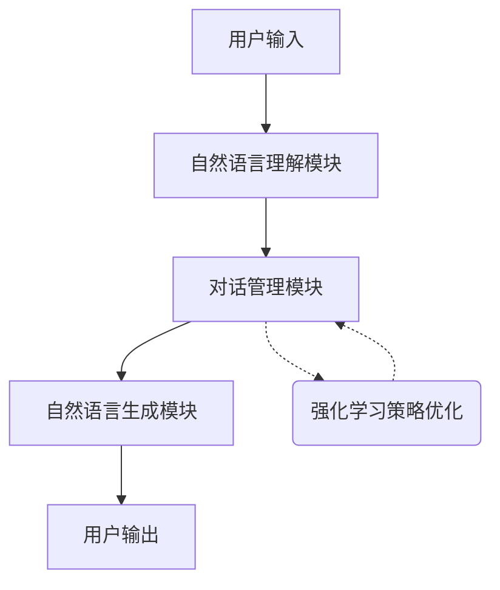

# 强化学习在AI Agent对话系统中的应用

> 关键词：强化学习、AI Agent、对话系统、策略优化、奖励机制

> 摘要：本文深入探讨了强化学习在AI Agent对话系统中的应用。首先介绍了强化学习和对话系统的相关背景知识，接着详细阐述了核心概念、算法原理及操作步骤，通过数学模型和公式进一步剖析其内在机制。然后通过项目实战展示了具体的代码实现和解读，分析了强化学习在不同实际应用场景中的作用。同时推荐了相关的学习资源、开发工具框架以及论文著作。最后对强化学习在AI Agent对话系统中的未来发展趋势与挑战进行了总结，并提供了常见问题的解答和扩展阅读参考资料，旨在为相关领域的研究者和开发者提供全面而深入的技术参考。

## 1. 背景介绍 
### 1.1 目的和范围
随着人工智能技术的飞速发展，AI Agent对话系统在人们的生活和工作中发挥着越来越重要的作用。从智能客服到智能语音助手，对话系统的应用场景日益广泛。然而，现有的对话系统在面对复杂的用户需求和多样化的对话场景时，仍存在诸多不足，如对话的连贯性、智能性和个性化程度有待提高。强化学习作为一种强大的机器学习方法，能够通过智能体与环境的交互不断优化策略，为解决对话系统中的这些问题提供了新的思路和方法。本文的目的在于深入研究强化学习在AI Agent对话系统中的应用，探讨其原理、算法和实现方法，以及在实际应用中的效果和挑战。范围涵盖了强化学习的基本概念、相关算法，AI Agent对话系统的架构和特点，以及两者结合的具体实现和应用案例。

### 1.2 预期读者
本文预期读者包括人工智能领域的研究者、开发者、学生以及对强化学习和对话系统感兴趣的技术爱好者。对于研究者来说，本文可以提供最新的研究思路和方法，促进相关领域的学术交流；对于开发者而言，文中的代码实现和项目实战案例可以为其在实际项目开发中提供参考和借鉴；对于学生来说，有助于他们深入理解强化学习和对话系统的相关知识，拓宽知识面；对于技术爱好者，能够让他们了解到前沿的技术动态和应用场景。

### 1.3 文档结构概述
本文将按照以下结构进行组织：首先介绍强化学习和AI Agent对话系统的相关背景知识，包括目的、预期读者、文档结构概述和术语表；接着阐述强化学习和对话系统的核心概念与联系，通过文本示意图和Mermaid流程图进行直观展示；然后详细讲解强化学习的核心算法原理和具体操作步骤，并使用Python源代码进行阐述；再通过数学模型和公式进一步分析强化学习在对话系统中的作用机制，并举例说明；之后通过项目实战展示具体的代码实现和详细解释；接着介绍强化学习在AI Agent对话系统中的实际应用场景；推荐相关的学习资源、开发工具框架和论文著作；最后总结强化学习在该领域的未来发展趋势与挑战，提供常见问题的解答和扩展阅读参考资料。

### 1.4 术语表
#### 1.4.1 核心术语定义
- **强化学习（Reinforcement Learning）**：一种机器学习范式，智能体通过与环境进行交互，根据环境反馈的奖励信号来学习最优策略，以最大化长期累积奖励。
- **AI Agent（人工智能智能体）**：能够感知环境、进行决策并采取行动的智能实体，在对话系统中可以理解为能够与用户进行对话交流的智能程序。
- **对话系统（Dialogue System）**：一种能够与用户进行自然语言对话的系统，旨在理解用户的意图并生成合适的回应。
- **策略（Policy）**：智能体在给定状态下选择行动的规则，强化学习的目标就是学习到最优策略。
- **奖励（Reward）**：环境对智能体采取的行动给予的即时反馈信号，用于指导智能体的学习过程。

#### 1.4.2 相关概念解释
- **状态（State）**：在对话系统中，状态可以表示当前对话的上下文信息，包括用户的历史输入、系统的历史回复等，智能体根据当前状态来选择合适的行动。
- **行动（Action）**：智能体在某个状态下可以采取的操作，在对话系统中，行动可以是生成的回复语句。
- **环境（Environment）**：与智能体进行交互的外部世界，在对话系统中，环境可以包括用户、对话的场景等。
- **价值函数（Value Function）**：用于评估某个状态或状态 - 行动对的价值，即从该状态或状态 - 行动对开始，遵循某个策略所能获得的长期累积奖励的期望。

#### 1.4.3 缩略词列表
- **RL**：Reinforcement Learning（强化学习）
- **Q - learning**：一种基于值函数的强化学习算法
- **SARSA**：State - Action - Reward - State - Action的缩写，也是一种强化学习算法

## 2. 核心概念与联系 

### 强化学习的基本原理
强化学习的核心思想是智能体通过与环境进行交互，不断尝试不同的行动，并根据环境给予的奖励信号来调整自己的行为，以获得最大的长期累积奖励。智能体在每个时间步观察当前的环境状态 $s_t$，根据当前的策略 $\pi$ 选择一个行动 $a_t$ 执行，环境接收到行动后会转移到下一个状态 $s_{t + 1}$，并返回一个奖励 $r_t$。智能体的目标就是学习一个最优策略 $\pi^*$，使得从任意初始状态开始，长期累积奖励的期望最大。

### AI Agent对话系统的架构
一个典型的AI Agent对话系统通常包括以下几个模块：用户接口模块，用于接收用户的输入并将系统的回复呈现给用户；自然语言理解模块，用于理解用户输入的自然语言，提取用户的意图和关键信息；对话管理模块，根据当前的对话状态和用户意图，选择合适的回复策略；自然语言生成模块，将对话管理模块选择的回复策略转换为自然语言文本。

### 强化学习与AI Agent对话系统的联系
在AI Agent对话系统中，强化学习可以应用于对话管理模块，帮助智能体学习最优的对话策略。对话系统的状态可以包括用户的历史输入、当前的对话场景等，行动可以是生成的回复语句，奖励可以根据回复的质量、用户的满意度等因素来设计。通过强化学习，对话系统可以不断优化自己的回复策略，提高对话的质量和用户的满意度。

### 文本示意图
```plaintext
+---------------------+
|      用户输入       |
+---------------------+
           |
           v
+---------------------+
| 自然语言理解模块    |
+---------------------+
           |
           v
+---------------------+
| 对话管理模块        |
| （强化学习应用）    |
+---------------------+
           |
           v
+---------------------+
| 自然语言生成模块    |
+---------------------+
           |
           v
+---------------------+
|      用户输出       |
+---------------------+
```

### Mermaid流程图


## 3. 核心算法原理 & 具体操作步骤 

### Q - learning算法原理
Q - learning是一种基于值函数的强化学习算法，其核心是学习一个Q值函数 $Q(s, a)$，表示在状态 $s$ 下采取行动 $a$ 的价值。Q - learning的目标是通过不断更新Q值函数，使得Q值能够逼近最优Q值函数 $Q^*$。Q - learning的更新公式为：

$$Q(s_t, a_t) \leftarrow Q(s_t, a_t) + \alpha [r_t + \gamma \max_{a} Q(s_{t + 1}, a) - Q(s_t, a_t)]$$

其中，$\alpha$ 是学习率，控制每次更新的步长；$\gamma$ 是折扣因子，用于平衡即时奖励和未来奖励的重要性。

### Q - learning算法的具体操作步骤
1. **初始化**：初始化Q值函数 $Q(s, a)$ 为任意值，通常初始化为0。
2. **循环迭代**：
    - 观察当前状态 $s_t$。
    - 根据当前的Q值函数和探索策略（如 $\epsilon$ - 贪心策略）选择一个行动 $a_t$。
    - 执行行动 $a_t$，环境转移到下一个状态 $s_{t + 1}$，并返回奖励 $r_t$。
    - 根据Q - learning的更新公式更新Q值函数 $Q(s_t, a_t)$。
    - 更新当前状态 $s_t = s_{t + 1}$。
3. **终止条件**：达到预设的迭代次数或满足其他终止条件。

### Python源代码实现
```python
import numpy as np

# 定义环境的状态和行动空间
num_states = 10
num_actions = 5

# 初始化Q值函数
Q = np.zeros((num_states, num_actions))

# 定义超参数
alpha = 0.1  # 学习率
gamma = 0.9  # 折扣因子
epsilon = 0.1  # 探索率
num_episodes = 1000  # 迭代次数

# 定义环境的转移函数和奖励函数（示例）
def environment_step(state, action):
    # 这里简单假设下一个状态是随机的
    next_state = np.random.randint(num_states)
    # 奖励函数可以根据具体任务设计
    reward = np.random.randn()
    return next_state, reward

# Q - learning算法实现
for episode in range(num_episodes):
    state = np.random.randint(num_states)  # 随机初始化状态
    done = False
    while not done:
        if np.random.uniform(0, 1) < epsilon:
            action = np.random.randint(num_actions)  # 探索：随机选择行动
        else:
            action = np.argmax(Q[state, :])  # 利用：选择Q值最大的行动

        next_state, reward = environment_step(state, action)

        # Q - learning更新公式
        Q[state, action] = Q[state, action] + alpha * (reward + gamma * np.max(Q[next_state, :]) - Q[state, action])

        state = next_state

        # 终止条件（示例：达到一定步数）
        if np.random.rand() < 0.1:
            done = True

print("最终的Q值函数：")
print(Q)
```

### 代码解释
1. **初始化**：定义了环境的状态和行动空间，初始化Q值函数为全0矩阵，设置了超参数。
2. **环境模拟**：定义了一个简单的环境转移函数和奖励函数，用于模拟智能体与环境的交互。
3. **Q - learning循环**：在每个迭代中，智能体根据 $\epsilon$ - 贪心策略选择行动，执行行动后更新Q值函数，直到满足终止条件。
4. **输出结果**：打印最终的Q值函数。

## 4. 数学模型和公式 & 详细讲解 & 举例说明 

### 价值函数
价值函数是强化学习中的重要概念，用于评估某个状态或状态 - 行动对的价值。主要有两种价值函数：状态价值函数 $V(s)$ 和动作价值函数 $Q(s, a)$。

#### 状态价值函数
状态价值函数 $V(s)$ 表示从状态 $s$ 开始，遵循策略 $\pi$ 所能获得的长期累积奖励的期望，定义为：

$$V^{\pi}(s) = \mathbb{E}_{\pi} \left[ \sum_{t = 0}^{\infty} \gamma^t r_t \mid s_0 = s \right]$$

其中，$\gamma$ 是折扣因子，$0 \leq \gamma \leq 1$，用于平衡即时奖励和未来奖励的重要性。

#### 动作价值函数
动作价值函数 $Q(s, a)$ 表示在状态 $s$ 下采取行动 $a$，然后遵循策略 $\pi$ 所能获得的长期累积奖励的期望，定义为：

$$Q^{\pi}(s, a) = \mathbb{E}_{\pi} \left[ \sum_{t = 0}^{\infty} \gamma^t r_t \mid s_0 = s, a_0 = a \right]$$

### 贝尔曼方程
贝尔曼方程是强化学习中的核心方程，它描述了价值函数的递归关系。

#### 状态价值函数的贝尔曼方程
对于状态价值函数 $V(s)$，其贝尔曼方程为：

$$V^{\pi}(s) = \sum_{a} \pi(a \mid s) \sum_{s', r} p(s', r \mid s, a) [r + \gamma V^{\pi}(s')]$$

其中，$\pi(a \mid s)$ 是策略 $\pi$ 在状态 $s$ 下选择行动 $a$ 的概率，$p(s', r \mid s, a)$ 是在状态 $s$ 下采取行动 $a$ 转移到状态 $s'$ 并获得奖励 $r$ 的概率。

#### 动作价值函数的贝尔曼方程
对于动作价值函数 $Q(s, a)$，其贝尔曼方程为：

$$Q^{\pi}(s, a) = \sum_{s', r} p(s', r \mid s, a) [r + \gamma \sum_{a'} \pi(a' \mid s') Q^{\pi}(s', a')]$$

### 最优价值函数和最优策略
最优状态价值函数 $V^*(s)$ 和最优动作价值函数 $Q^*(s, a)$ 分别定义为所有策略下的最大状态价值和最大动作价值：

$$V^*(s) = \max_{\pi} V^{\pi}(s)$$

$$Q^*(s, a) = \max_{\pi} Q^{\pi}(s, a)$$

最优策略 $\pi^*$ 是使得 $V^{\pi}(s) = V^*(s)$ 或 $Q^{\pi}(s, a) = Q^*(s, a)$ 的策略。

### 举例说明
假设一个简单的网格世界环境，智能体可以在一个 $3 \times 3$ 的网格中移动，目标是到达网格的右下角。智能体有四个行动：上、下、左、右。每个行动的奖励为 - 1，到达目标位置的奖励为10。

设折扣因子 $\gamma = 0.9$，初始状态 $s$ 为左上角的网格。我们可以使用贝尔曼方程来计算状态价值函数 $V(s)$。

假设智能体当前处于状态 $s$，采取行动 $a$ （向右移动），转移到下一个状态 $s'$，并获得奖励 $r = - 1$。根据贝尔曼方程：

$$V(s) = \max_{a} \sum_{s', r} p(s', r \mid s, a) [r + \gamma V(s')]$$

在这个简单的环境中，$p(s', r \mid s, a)$ 是确定的，即采取向右行动一定会转移到右边的网格。我们可以通过迭代计算来更新 $V(s)$，直到收敛。

## 5. 项目实战：代码实际案例和详细解释说明 

### 5.1  开发环境搭建
- **操作系统**：推荐使用Linux或Mac OS，也可以使用Windows。
- **编程语言**：Python 3.x
- **开发工具**：推荐使用PyCharm或Jupyter Notebook。
- **依赖库**：需要安装numpy、torch（如果使用深度学习方法）等库。可以使用以下命令进行安装：
```sh
pip install numpy torch
```

### 5.2  源代码详细实现和代码解读
以下是一个简单的基于强化学习的对话系统示例，使用Q - learning算法。

```python
import numpy as np

# 定义对话状态和回复动作
states = ["问候", "询问信息", "提供信息", "结束对话"]
actions = ["问候回复", "信息询问回复", "信息提供回复", "结束对话回复"]

# 初始化Q值函数
num_states = len(states)
num_actions = len(actions)
Q = np.zeros((num_states, num_actions))

# 定义超参数
alpha = 0.1  # 学习率
gamma = 0.9  # 折扣因子
epsilon = 0.1  # 探索率
num_episodes = 1000  # 迭代次数

# 定义奖励函数（示例）
def reward_function(state, action):
    if state == "问候" and action == "问候回复":
        return 1
    elif state == "询问信息" and action == "信息询问回复":
        return 1
    elif state == "提供信息" and action == "信息提供回复":
        return 1
    elif state == "结束对话" and action == "结束对话回复":
        return 1
    else:
        return -1

# 定义状态转移函数（示例）
def state_transition(state, action):
    if state == "问候" and action == "问候回复":
        return "询问信息"
    elif state == "询问信息" and action == "信息询问回复":
        return "提供信息"
    elif state == "提供信息" and action == "信息提供回复":
        return "结束对话"
    elif state == "结束对话" and action == "结束对话回复":
        return None
    else:
        return state

# Q - learning算法实现
for episode in range(num_episodes):
    state_index = 0  # 初始状态为问候
    state = states[state_index]
    done = False
    while not done:
        if np.random.uniform(0, 1) < epsilon:
            action_index = np.random.randint(num_actions)  # 探索：随机选择行动
        else:
            action_index = np.argmax(Q[state_index, :])  # 利用：选择Q值最大的行动

        action = actions[action_index]
        reward = reward_function(state, action)
        next_state = state_transition(state, action)

        if next_state is None:
            done = True
            next_state_index = 0
        else:
            next_state_index = states.index(next_state)

        # Q - learning更新公式
        Q[state_index, action_index] = Q[state_index, action_index] + alpha * (reward + gamma * np.max(Q[next_state_index, :]) - Q[state_index, action_index])

        state_index = next_state_index
        state = next_state

# 测试对话系统
state_index = 0
state = states[state_index]
done = False
while not done:
    action_index = np.argmax(Q[state_index, :])
    action = actions[action_index]
    print(f"状态: {state}, 回复: {action}")
    next_state = state_transition(state, action)
    if next_state is None:
        done = True
    else:
        state_index = states.index(next_state)
        state = next_state
```

### 5.3  代码解读与分析
1. **初始化**：定义了对话的状态和回复动作，初始化Q值函数，设置超参数。
2. **奖励函数**：根据不同的状态和行动组合，定义了奖励函数，用于评估回复的质量。
3. **状态转移函数**：根据当前的状态和行动，定义了状态转移函数，用于模拟对话的流程。
4. **Q - learning循环**：在每个迭代中，智能体根据 $\epsilon$ - 贪心策略选择行动，执行行动后更新Q值函数，直到对话结束。
5. **测试**：使用学习到的Q值函数进行对话测试，输出对话的状态和回复。

通过这个示例，我们可以看到强化学习如何应用于对话系统，通过不断的学习和优化，智能体可以学习到最优的对话策略。

## 6. 实际应用场景 
### 智能客服系统
在智能客服系统中，强化学习可以帮助智能体根据用户的问题和历史对话记录，选择最优的回复策略。例如，当用户询问产品信息时，智能体可以根据用户的需求和历史对话，提供最准确、最有用的信息。同时，强化学习可以根据用户的满意度反馈来调整策略，提高用户的满意度。

### 智能语音助手
智能语音助手需要与用户进行自然流畅的对话。强化学习可以用于优化语音助手的对话策略，使其能够更好地理解用户的意图，生成更自然、更合适的回复。例如，当用户询问天气时，语音助手可以根据当前的对话状态和用户的偏好，提供详细的天气信息和相关建议。

### 智能教育辅助系统
在智能教育辅助系统中，强化学习可以帮助智能体根据学生的学习状态和问题，提供个性化的学习建议和辅导。例如，当学生在学习数学时遇到困难，智能体可以根据学生的错误类型和历史学习记录，选择合适的教学方法和示例，帮助学生更好地理解和掌握知识。

### 智能游戏NPC
在游戏中，强化学习可以用于训练非玩家角色（NPC）的对话策略，使其能够与玩家进行更智能、更有趣的对话。例如，在角色扮演游戏中，NPC可以根据玩家的行为和对话，提供不同的任务和剧情，增加游戏的趣味性和互动性。

## 7. 工具和资源推荐
### 7.1 学习资源推荐
#### 7.1.1 书籍推荐
- 《强化学习：原理与Python实现》：这本书系统地介绍了强化学习的基本原理和算法，通过Python代码实现了多个经典的强化学习算法，适合初学者入门。
- 《Deep Reinforcement Learning Hands-On》：详细介绍了深度强化学习的相关知识和技术，包括深度Q网络（DQN）、策略梯度算法等，适合有一定基础的读者深入学习。
- 《Reinforcement Learning: An Introduction》：强化学习领域的经典著作，由该领域的两位权威专家Richard S. Sutton和Andrew G. Barto所著，全面而深入地介绍了强化学习的理论和方法。

#### 7.1.2 在线课程
- Coursera上的“Reinforcement Learning Specialization”：由美国卡内基梅隆大学的教授授课，包括多个关于强化学习的课程，内容丰富，适合不同层次的学习者。
- edX上的“Introduction to Reinforcement Learning”：介绍了强化学习的基本概念和算法，通过实际案例和编程作业帮助学习者掌握相关知识。
- 哔哩哔哩上的一些强化学习相关视频：有很多优秀的UP主分享了强化学习的教学视频，讲解生动形象，适合自学。

#### 7.1.3 技术博客和网站
- OpenAI博客：OpenAI是人工智能领域的领先研究机构，其博客上经常分享强化学习的最新研究成果和应用案例。
- DeepMind博客：DeepMind在强化学习领域取得了很多重要的研究成果，其博客上的文章具有很高的学术价值。
- 知乎上的强化学习相关专栏：有很多专家和爱好者在知乎上分享强化学习的知识和经验，内容丰富多样。

### 7.2 开发工具框架推荐
#### 7.2.1 IDE和编辑器
- PyCharm：一款专业的Python集成开发环境，具有强大的代码编辑、调试和自动补全功能，适合开发强化学习项目。
- Jupyter Notebook：一种交互式的开发环境，适合进行代码的实验和演示，方便查看代码的运行结果和可视化数据。
- Visual Studio Code：一款轻量级的代码编辑器，支持多种编程语言和插件，可通过安装相关插件来进行强化学习项目的开发。

#### 7.2.2 调试和性能分析工具
- TensorBoard：TensorFlow的可视化工具，可以用于可视化强化学习模型的训练过程，如损失函数的变化、奖励的变化等。
- PyTorch Profiler：PyTorch提供的性能分析工具，可以帮助开发者分析模型的性能瓶颈，优化代码的运行效率。
- cProfile：Python的内置性能分析工具，可以用于分析Python代码的运行时间和函数调用情况。

#### 7.2.3 相关框架和库
- OpenAI Gym：一个用于开发和比较强化学习算法的工具包，提供了多种经典的强化学习环境，方便开发者进行算法的测试和验证。
- Stable Baselines3：基于PyTorch的强化学习库，提供了多种预训练的强化学习算法和模型，方便开发者快速上手和应用。
- RLlib：Ray框架中的强化学习库，支持分布式训练和大规模实验，适合进行复杂的强化学习研究和开发。

### 7.3 相关论文著作推荐
#### 7.3.1 经典论文
- “Playing Atari with Deep Reinforcement Learning”：提出了深度Q网络（DQN）算法，将深度学习和强化学习相结合，在Atari游戏上取得了很好的效果，开创了深度强化学习的先河。
- “Asynchronous Methods for Deep Reinforcement Learning”：提出了异步优势演员 - 评论家（A3C）算法，通过异步训练的方式提高了深度强化学习的训练效率。
- “Proximal Policy Optimization Algorithms”：提出了近端策略优化（PPO）算法，是一种高效的策略梯度算法，在很多强化学习任务中取得了很好的效果。

#### 7.3.2 最新研究成果
- 每年的NeurIPS、ICML、AAAI等人工智能领域的顶级会议上都会有很多关于强化学习的最新研究成果发表，可以关注这些会议的论文。
- arXiv预印本平台上也有很多关于强化学习的最新研究论文，可以及时了解该领域的研究动态。

#### 7.3.3 应用案例分析
- 一些科技公司的官方博客上会分享强化学习在实际应用中的案例，如谷歌、微软、百度等公司的博客，可以从中学习到强化学习在不同领域的应用经验和方法。

## 8. 总结：未来发展趋势与挑战
### 未来发展趋势
- **深度强化学习与其他技术的融合**：深度强化学习将与自然语言处理、计算机视觉等技术进一步融合，实现更复杂、更智能的AI Agent对话系统。例如，结合计算机视觉技术，对话系统可以理解用户的图像和视频输入，提供更丰富的信息和交互方式。
- **多智能体强化学习**：在实际应用中，多个智能体之间的协作和竞争是常见的场景。多智能体强化学习将成为未来的研究热点，用于解决多智能体之间的协调和决策问题，提高对话系统的协作能力和效率。
- **基于模型的强化学习**：基于模型的强化学习可以利用环境的先验知识和模型，提高学习效率和样本利用率。未来，基于模型的强化学习将在AI Agent对话系统中得到更广泛的应用，特别是在资源受限的环境中。
- **个性化和自适应对话系统**：未来的对话系统将更加注重个性化和自适应能力，能够根据用户的偏好、历史对话记录和当前的情境，提供个性化的回复和服务。强化学习可以通过不断学习用户的反馈和行为，实现对话系统的自适应优化。

### 挑战
- **奖励设计难题**：在强化学习中，奖励设计是一个关键问题。在AI Agent对话系统中，如何设计合理的奖励函数来评估对话的质量和用户的满意度是一个挑战。奖励函数的设计不当可能导致智能体学习到不合理的策略，影响对话系统的性能。
- **数据效率问题**：强化学习通常需要大量的交互数据来学习最优策略，这在实际应用中可能会面临数据收集困难和计算资源消耗大的问题。如何提高数据效率，减少数据收集和训练的成本，是一个亟待解决的问题。
- **泛化能力和鲁棒性**：对话系统需要在不同的场景和用户输入下都能表现出良好的性能。强化学习模型的泛化能力和鲁棒性是一个挑战，如何使模型能够适应新的环境和任务，抵抗噪声和干扰，是未来研究的重点。
- **伦理和安全问题**：随着AI Agent对话系统的广泛应用，伦理和安全问题日益凸显。例如，对话系统可能会生成有害或不恰当的内容，对用户造成伤害。如何确保对话系统的安全性和可靠性，遵守伦理道德规范，是一个重要的挑战。

## 9. 附录：常见问题与解答
### 问题1：强化学习在对话系统中的应用与传统的基于规则或统计的方法有什么区别？
- **解答**：传统的基于规则的方法需要人工编写大量的规则来定义对话的流程和回复，这种方法缺乏灵活性，难以应对复杂和多样化的用户需求。基于统计的方法通过对大量对话数据的学习来生成回复，但缺乏对对话的语义理解和推理能力。而强化学习通过智能体与环境的交互，能够根据用户的反馈不断优化对话策略，具有更强的适应性和智能性，能够更好地处理复杂的对话场景。

### 问题2：如何设计合理的奖励函数？
- **解答**：设计合理的奖励函数需要考虑多个因素，如对话的连贯性、回复的准确性、用户的满意度等。可以从以下几个方面入手：
    - **基于任务的奖励**：根据对话是否完成了特定的任务来给予奖励，如成功回答用户的问题、完成订单等。
    - **基于用户反馈的奖励**：根据用户的满意度反馈来调整奖励，如用户的评分、点赞等。
    - **基于对话质量的奖励**：考虑对话的连贯性、逻辑性、礼貌性等因素，给予相应的奖励。
    - **惩罚机制**：对于不恰当的回复或违反规则的行为，给予负奖励，以引导智能体学习到正确的策略。

### 问题3：强化学习在对话系统中的训练时间通常较长，有什么方法可以加速训练？
- **解答**：可以采用以下方法来加速训练：
    - **使用分布式训练**：利用多个计算资源并行训练，提高训练效率。例如，使用分布式强化学习框架RLlib进行训练。
    - **优化算法**：选择高效的强化学习算法，如PPO算法，其在训练效率上有较好的表现。
    - **数据复用**：采用经验回放机制，对历史的交互数据进行复用，提高数据的利用率。
    - **预训练模型**：使用预训练的模型作为初始化，减少训练的时间。例如，使用预训练的语言模型来初始化对话系统的自然语言理解和生成模块。

### 问题4：强化学习在对话系统中如何处理不确定性和噪声？
- **解答**：可以采用以下方法来处理不确定性和噪声：
    - **探索策略**：在训练过程中，采用探索策略（如 $\epsilon$ - 贪心策略），让智能体尝试不同的行动，增加对环境的探索，减少对局部最优解的依赖。
    - **模型集成**：使用多个模型进行集成，通过投票或平均的方式来减少单个模型的误差和不确定性。
    - **鲁棒优化**：在训练过程中，对输入数据添加噪声，让模型学习到更鲁棒的特征和策略，提高模型的抗干扰能力。
    - **自适应调整**：根据环境的变化和不确定性，自适应地调整模型的参数和策略，以提高模型的适应性。

## 10. 扩展阅读 & 参考资料
### 扩展阅读
- 阅读更多关于自然语言处理和深度学习的相关书籍和论文，如《自然语言处理入门》《深度学习》等，以深入理解对话系统的相关技术。
- 关注一些人工智能领域的前沿研究动态，如OpenAI、DeepMind等机构的最新研究成果，了解强化学习的最新发展趋势。
- 参与相关的开源项目和社区，与其他开发者和研究者交流经验和想法，不断提升自己的技术水平。

### 参考资料
- Sutton, R. S., & Barto, A. G. (2018). Reinforcement Learning: An Introduction. MIT press.
- Mnih, V., Kavukcuoglu, K., Silver, D., Rusu, A. A., Veness, J., Bellemare, M. G., ... & Petersen, S. (2015). Human-level control through deep reinforcement learning. Nature, 518(7540), 529-533.
- Schulman, J., Wolski, F., Dhariwal, P., Radford, A., & Klimov, O. (2017). Proximal policy optimization algorithms. arXiv preprint arXiv:1707.06347.
- OpenAI Gym官方文档：https://gym.openai.com/
- Stable Baselines3官方文档：https://stable-baselines3.readthedocs.io/
- RLlib官方文档：https://docs.ray.io/en/latest/rllib/index.html