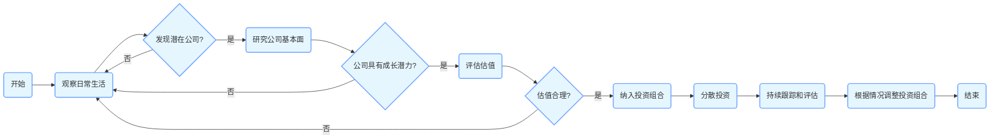

# 彼得·林奇的新兴市场投资策略

> 关键词：彼得·林奇、新兴市场、投资策略、成长股、价值发现

> 摘要：本文深入探讨彼得·林奇的新兴市场投资策略。彼得·林奇作为投资界的传奇人物，其投资理念和策略影响深远。新兴市场具有高增长潜力但也伴随着高风险，通过研究林奇的投资方法，我们能学习到如何在新兴市场中寻找投资机会、评估风险并做出明智的投资决策。文章将介绍相关背景知识，剖析核心概念，阐述投资策略的算法原理和数学模型，通过项目实战案例展示其应用，探讨实际应用场景，推荐学习和开发工具资源，最后总结未来发展趋势与挑战，并解答常见问题，为投资者提供全面的参考。

## 1. 背景介绍 
### 1.1 目的和范围
本文的目的在于全面解析彼得·林奇的新兴市场投资策略，帮助投资者理解和运用这些策略在新兴市场中实现资产增值。范围涵盖了林奇投资策略的基本概念、原理、操作步骤、实际应用案例以及相关的资源推荐等方面，旨在为投资者提供一个系统的学习和参考框架。

### 1.2 预期读者
本文预期读者包括对投资领域感兴趣的初学者、有一定投资经验但希望提升新兴市场投资能力的投资者、金融专业的学生以及从事金融研究和投资分析的专业人士。

### 1.3 文档结构概述
本文首先介绍彼得·林奇及其新兴市场投资策略的背景知识，包括相关术语和概念。接着阐述核心概念及其联系，展示投资策略的架构和原理。然后详细讲解核心算法原理和具体操作步骤，通过 Python 代码示例进行说明。之后介绍相关的数学模型和公式，并举例说明。再通过项目实战案例展示投资策略的实际应用和代码解读。随后探讨新兴市场投资策略的实际应用场景。接着推荐学习和开发相关的工具和资源。最后总结未来发展趋势与挑战，解答常见问题，并提供扩展阅读和参考资料。

### 1.4 术语表
#### 1.4.1 核心术语定义
- **新兴市场**：指发展中国家或地区的金融市场，通常具有较高的经济增长率和市场潜力，但也伴随着较高的风险和不确定性。
- **成长股**：指那些销售额和利润持续增长，且增长速度快于行业平均水平的公司股票。
- **价值投资**：一种投资策略，通过评估公司的内在价值，寻找被市场低估的股票进行投资。
- **分散投资**：将资金分散投资于不同的资产、行业或地区，以降低投资组合的风险。

#### 1.4.2 相关概念解释
- **彼得·林奇**：美国著名的投资家，曾任富达麦哲伦基金的基金经理，在其管理期间，麦哲伦基金的资产规模大幅增长，创造了辉煌的投资业绩。他的投资理念强调从日常生活中发现投资机会，注重公司的基本面分析。
- **新兴市场的特点**：新兴市场国家的经济通常处于快速发展阶段，具有较高的劳动力成本优势、市场需求增长潜力大等特点。但同时，新兴市场也面临着政治不稳定、法律法规不完善、金融市场波动较大等风险。

#### 1.4.3 缩略词列表
- **PEG**：市盈率相对盈利增长比率（Price/Earnings to Growth Ratio），用于评估股票的估值是否合理。

## 2. 核心概念与联系 

### 核心概念原理
彼得·林奇的新兴市场投资策略基于其对成长股的深刻理解和对市场的敏锐洞察力。他认为，新兴市场中存在着许多具有高增长潜力的公司，通过深入研究和分析这些公司的基本面，投资者可以发现被市场低估的成长股，从而获得超额收益。

林奇的投资理念强调从日常生活中寻找投资机会。他认为，普通投资者可以通过观察身边的消费趋势、行业变化等，发现一些具有潜力的公司。例如，如果发现身边的人都在购买某家公司的产品，而且该产品的市场份额不断扩大，那么这家公司就可能是一个值得投资的对象。

在评估公司的基本面时，林奇注重以下几个方面：
- **公司的业务模式**：了解公司的主营业务、盈利模式和竞争优势，判断公司是否具有可持续的盈利能力。
- **财务状况**：分析公司的财务报表，包括收入、利润、资产负债等指标，评估公司的财务健康状况。
- **管理层能力**：考察公司管理层的决策能力、执行能力和创新能力，判断管理层是否能够带领公司实现持续增长。

### 架构的文本示意图
```plaintext
彼得·林奇新兴市场投资策略
|-- 投资理念
|   |-- 从日常生活中发现机会
|   |-- 注重公司基本面分析
|-- 核心策略
|   |-- 寻找成长股
|   |-- 价值投资
|   |-- 分散投资
|-- 评估指标
|   |-- PEG 比率
|   |-- 财务指标
|-- 风险控制
|   |-- 分散投资降低风险
|   |-- 深入研究降低不确定性
```

### Mermaid 流程图


## 3. 核心算法原理 & 具体操作步骤 

### 核心算法原理
彼得·林奇的投资策略虽然不是严格意义上的算法，但可以通过一些量化指标来辅助投资决策。其中，PEG 比率是一个重要的指标，用于评估股票的估值是否合理。

PEG 比率的计算公式为：
$$PEG = \frac{PE}{g}$$
其中，$PE$ 是市盈率，$g$ 是公司的盈利增长率。一般来说，PEG 比率小于 1 表示股票被低估，具有投资价值；PEG 比率大于 1 表示股票被高估，投资风险较大。

### 具体操作步骤
1. **观察日常生活**：投资者要关注身边的消费趋势、行业变化等，发现一些具有潜力的公司。例如，注意新出现的热门产品、服务或品牌。
2. **研究公司基本面**：对发现的潜在公司进行深入研究，包括公司的业务模式、财务状况、管理层能力等方面。可以通过查阅公司的年报、季报、行业研究报告等资料来获取相关信息。
3. **计算 PEG 比率**：根据公司的市盈率和盈利增长率计算 PEG 比率，评估股票的估值是否合理。
4. **评估风险**：考虑新兴市场的政治、经济、法律等风险因素，评估投资的风险水平。
5. **分散投资**：将资金分散投资于不同的公司、行业和地区，降低投资组合的风险。
6. **持续跟踪和评估**：定期跟踪投资组合中公司的业绩变化，根据情况调整投资组合。

### Python 源代码示例
```python
# 定义计算 PEG 比率的函数
def calculate_peg(pe, growth_rate):
    """
    计算 PEG 比率
    :param pe: 市盈率
    :param growth_rate: 盈利增长率
    :return: PEG 比率
    """
    if growth_rate == 0:
        return float('inf')
    else:
        return pe / growth_rate

# 示例数据
pe = 20
growth_rate = 0.2

# 计算 PEG 比率
peg = calculate_peg(pe, growth_rate)
print(f"PEG 比率: {peg}")

# 根据 PEG 比率进行投资决策
if peg < 1:
    print("股票被低估，具有投资价值")
elif peg == 1:
    print("股票估值合理")
else:
    print("股票被高估，投资风险较大")
```

## 4. 数学模型和公式 & 详细讲解 & 举例说明 

### 数学模型和公式
- **PEG 比率**：
$$PEG = \frac{PE}{g}$$
其中，$PE$ 是市盈率，计算公式为：
$$PE = \frac{P}{E}$$
$P$ 是股票价格，$E$ 是每股收益。$g$ 是公司的盈利增长率，通常用过去几年的平均盈利增长率来估算。

### 详细讲解
PEG 比率综合考虑了股票的估值和公司的盈利增长情况。市盈率 $PE$ 反映了市场对公司当前盈利的估值，而盈利增长率 $g$ 反映了公司未来的盈利增长潜力。通过将市盈率除以盈利增长率，得到的 PEG 比率可以更全面地评估股票的投资价值。

当 PEG 比率小于 1 时，说明股票的估值相对其盈利增长来说较低，可能被市场低估，具有投资价值。当 PEG 比率等于 1 时，说明股票的估值与盈利增长相匹配，估值合理。当 PEG 比率大于 1 时，说明股票的估值相对其盈利增长来说较高，可能被市场高估，投资风险较大。

### 举例说明
假设某公司的股票价格为 $P = 50$ 元，每股收益为 $E = 2$ 元，则市盈率 $PE = \frac{50}{2} = 25$。该公司过去几年的平均盈利增长率为 $g = 0.3$，则 PEG 比率为：
$$PEG = \frac{25}{0.3} \approx 83.33$$
由于 PEG 比率远大于 1，说明该股票的估值相对其盈利增长来说较高，可能被市场高估，投资风险较大。

再假设另一家公司的股票价格为 $P = 30$ 元，每股收益为 $E = 3$ 元，则市盈率 $PE = \frac{30}{3} = 10$。该公司过去几年的平均盈利增长率为 $g = 0.2$，则 PEG 比率为：
$$PEG = \frac{10}{0.2} = 50$$
同样，PEG 比率大于 1，该股票也可能被高估。

而如果一家公司的股票价格为 $P = 20$ 元，每股收益为 $E = 2$ 元，市盈率 $PE = \frac{20}{2} = 10$，盈利增长率为 $g = 0.5$，则 PEG 比率为：
$$PEG = \frac{10}{0.5} = 2$$
虽然 PEG 比率大于 1，但相对前两个例子来说，该股票的估值相对其盈利增长的高估程度较小。

如果一家公司的股票价格为 $P = 15$ 元，每股收益为 $E = 1$ 元，市盈率 $PE = \frac{15}{1} = 15$，盈利增长率为 $g = 0.8$，则 PEG 比率为：
$$PEG = \frac{15}{0.8} = 18.75$$
仍然大于 1，但也反映了不同的估值情况。

如果一家公司的股票价格为 $P = 10$ 元，每股收益为 $E = 1$ 元，市盈率 $PE = \frac{10}{1} = 10$，盈利增长率为 $g = 1.2$，则 PEG 比率为：
$$PEG = \frac{10}{1.2} \approx 8.33$$
同样大于 1。

只有当 PEG 比率小于 1 时，如某公司股票价格为 $P = 8$ 元，每股收益为 $E = 1$ 元，市盈率 $PE = \frac{8}{1} = 8$，盈利增长率为 $g = 10$，则 PEG 比率为：
$$PEG = \frac{8}{10} = 0.8$$
此时该股票可能被低估，具有投资价值。

## 5. 项目实战：代码实际案例和详细解释说明 

### 5.1  开发环境搭建
- **编程语言**：Python
- **开发工具**：可以使用 PyCharm、Jupyter Notebook 等开发工具。
- **所需库**：需要安装 `pandas`、`numpy` 等库，用于数据处理和分析。可以使用以下命令进行安装：
```sh
pip install pandas numpy
```

### 5.2  源代码详细实现和代码解读
```python
import pandas as pd
import numpy as np

# 模拟股票数据
data = {
    '股票代码': ['000001', '000002', '000003', '000004', '000005'],
    '股票价格': [50, 30, 20, 15, 10],
    '每股收益': [2, 3, 2, 1, 1],
    '盈利增长率': [0.3, 0.2, 0.5, 0.8, 1.2]
}

# 创建 DataFrame
df = pd.DataFrame(data)

# 计算市盈率
df['市盈率'] = df['股票价格'] / df['每股收益']

# 定义计算 PEG 比率的函数
def calculate_peg(pe, growth_rate):
    if growth_rate == 0:
        return float('inf')
    else:
        return pe / growth_rate

# 计算 PEG 比率
df['PEG 比率'] = df.apply(lambda row: calculate_peg(row['市盈率'], row['盈利增长率']), axis=1)

# 根据 PEG 比率进行投资决策
df['投资决策'] = np.where(df['PEG 比率'] < 1, '具有投资价值', np.where(df['PEG 比率'] == 1, '估值合理', '投资风险较大'))

# 打印结果
print(df)
```

### 5.3  代码解读与分析
1. **数据模拟**：使用字典 `data` 模拟了 5 只股票的相关数据，包括股票代码、股票价格、每股收益和盈利增长率。
2. **创建 DataFrame**：使用 `pandas` 库的 `DataFrame` 函数将模拟数据转换为 DataFrame 对象，方便进行数据处理和分析。
3. **计算市盈率**：通过将股票价格除以每股收益，计算出每只股票的市盈率，并将结果添加到 DataFrame 中。
4. **定义计算 PEG 比率的函数**：定义了 `calculate_peg` 函数，用于计算 PEG 比率。在函数中，处理了盈利增长率为 0 的情况，避免出现除零错误。
5. **计算 PEG 比率**：使用 `apply` 函数将 `calculate_peg` 函数应用到 DataFrame 的每一行，计算出每只股票的 PEG 比率，并将结果添加到 DataFrame 中。
6. **投资决策**：使用 `np.where` 函数根据 PEG 比率进行投资决策，将结果添加到 DataFrame 的 `投资决策` 列中。
7. **打印结果**：最后打印出包含所有信息的 DataFrame，方便查看每只股票的相关信息和投资决策。

通过这个案例，我们可以看到如何使用 Python 代码实现彼得·林奇投资策略中的 PEG 比率计算和投资决策，为投资者提供了一种量化分析的方法。

## 6. 实际应用场景 
### 新兴市场股票投资
在新兴市场中，投资者可以运用彼得·林奇的投资策略，通过观察日常生活中的消费趋势和行业变化，发现具有潜力的成长股。例如，随着新兴市场国家经济的发展，消费升级趋势明显，投资者可以关注一些消费类、科技类等行业的公司。通过研究这些公司的基本面，计算 PEG 比率等指标，评估股票的投资价值，做出投资决策。

### 基金投资
基金经理也可以借鉴彼得·林奇的投资策略，在新兴市场中进行基金投资。基金经理可以通过对不同公司的深入研究，构建一个分散投资的基金组合，降低投资风险。同时，根据公司的业绩变化和市场情况，及时调整基金组合，以实现基金的增值。

### 资产配置
投资者在进行资产配置时，可以将一部分资金投资于新兴市场的股票或基金，以获取新兴市场的高增长潜力。通过运用彼得·林奇的投资策略，选择具有投资价值的资产，合理配置资产比例，实现资产的多元化和风险的分散。

### 行业分析
彼得·林奇的投资策略也可以应用于行业分析。投资者可以通过观察不同行业的发展趋势，找出具有增长潜力的行业。然后在这些行业中，进一步筛选出具有竞争力的公司，进行投资分析。例如，在新兴市场中，新能源、人工智能等行业具有较高的发展潜力，投资者可以重点关注这些行业的公司。

## 7. 工具和资源推荐
### 7.1 学习资源推荐
#### 7.1.1 书籍推荐
- 《彼得·林奇的成功投资》：彼得·林奇的经典著作，详细介绍了他的投资理念和策略，是投资者学习的必读之书。
- 《战胜华尔街》：进一步阐述了彼得·林奇的投资方法和实践经验，对投资者具有很高的参考价值。
- 《聪明的投资者》：本杰明·格雷厄姆的经典著作，是价值投资的奠基之作，对彼得·林奇的投资理念产生了重要影响。

#### 7.1.2 在线课程
- Coursera 上的“投资学原理”课程：系统介绍了投资学的基本原理和方法，包括股票投资、债券投资等内容。
- edX 上的“金融市场”课程：由著名经济学家罗伯特·席勒教授授课，深入讲解了金融市场的运行机制和投资策略。

#### 7.1.3 技术博客和网站
- 雪球网：国内知名的投资社区，提供股票、基金等投资相关的资讯、分析和讨论。
- 东方财富网：提供全面的金融信息和数据，包括股票行情、财经新闻、研究报告等。
- Seeking Alpha：国外知名的投资分析网站，有众多专业投资者和分析师分享投资观点和研究报告。

### 7.2 开发工具框架推荐
#### 7.2.1 IDE和编辑器
- PyCharm：功能强大的 Python 集成开发环境，提供代码编辑、调试、版本控制等功能，适合专业开发者使用。
- Jupyter Notebook：交互式的开发环境，支持 Python 等多种编程语言，方便进行数据分析和可视化。

#### 7.2.2 调试和性能分析工具
- pdb：Python 内置的调试工具，可以帮助开发者定位和解决代码中的问题。
- cProfile：Python 标准库中的性能分析工具，可以分析代码的执行时间和函数调用情况，帮助优化代码性能。

#### 7.2.3 相关框架和库
- pandas：用于数据处理和分析的 Python 库，提供了丰富的数据结构和数据操作方法。
- numpy：用于科学计算的 Python 库，提供了高效的数组和矩阵运算功能。
- matplotlib：用于数据可视化的 Python 库，可以绘制各种类型的图表，如折线图、柱状图、散点图等。

### 7.3 相关论文著作推荐
#### 7.3.1 经典论文
- Eugene F. Fama, Kenneth R. French, "Common Risk Factors in the Returns on Stocks and Bonds"：提出了著名的 Fama-French 三因子模型，对资产定价理论产生了重要影响。
- Markowitz, Harry M., "Portfolio Selection"：奠定了现代投资组合理论的基础，提出了均值 - 方差模型。

#### 7.3.2 最新研究成果
- 关注《Journal of Finance》、《Review of Financial Studies》等顶级金融学术期刊，了解新兴市场投资领域的最新研究成果。

#### 7.3.3 应用案例分析
- 可以参考一些知名投资机构的研究报告和案例分析，了解他们在新兴市场投资中的实践经验和策略应用。

## 8. 总结：未来发展趋势与挑战
### 未来发展趋势
- **新兴市场的增长潜力持续释放**：随着全球经济的发展，新兴市场国家的经济将继续保持较高的增长率，市场潜力将不断释放。这将为投资者提供更多的投资机会，彼得·林奇的投资策略在新兴市场中的应用前景广阔。
- **科技进步推动投资方式创新**：随着人工智能、大数据等技术的发展，投资者可以利用这些技术更高效地进行投资分析和决策。例如，通过大数据分析可以更全面地了解公司的基本面和市场趋势，利用人工智能算法可以实现自动化的投资决策。
- **可持续投资成为主流**：越来越多的投资者开始关注企业的社会责任和可持续发展，可持续投资将成为未来投资的主流趋势。在新兴市场中，投资者可以关注那些具有良好环境、社会和治理（ESG）表现的公司，实现投资的经济效益和社会效益的统一。

### 挑战
- **新兴市场的不确定性增加**：新兴市场国家的政治、经济、法律等环境相对不稳定，政策变化、地缘政治冲突等因素可能导致市场波动加剧，增加投资风险。投资者需要更加谨慎地评估风险，采取有效的风险控制措施。
- **信息不对称问题**：在新兴市场中，信息披露制度可能不够完善，投资者获取信息的难度较大，存在信息不对称问题。这可能导致投资者做出错误的投资决策，需要加强对信息的收集和分析能力。
- **竞争加剧**：随着新兴市场的发展，越来越多的投资者和投资机构进入市场，竞争加剧。投资者需要不断提升自己的投资能力和专业水平，才能在市场中获得超额收益。

## 9. 附录：常见问题与解答
### 问题 1：PEG 比率在所有情况下都适用吗？
答：PEG 比率并不是在所有情况下都适用。它主要适用于评估成长型公司的估值，但对于一些周期性行业的公司或处于特殊发展阶段的公司，PEG 比率可能无法准确反映其投资价值。此外，盈利增长率的估算也存在一定的主观性和不确定性，可能会影响 PEG 比率的准确性。

### 问题 2：如何准确估算公司的盈利增长率？
答：估算公司的盈利增长率可以参考公司过去几年的财务报表，计算其平均盈利增长率。同时，还可以关注行业的发展趋势、公司的战略规划和市场预期等因素，综合评估公司未来的盈利增长潜力。但需要注意的是，盈利增长率的估算存在一定的不确定性，投资者需要谨慎对待。

### 问题 3：新兴市场投资的风险如何控制？
答：可以通过分散投资、深入研究公司基本面、关注宏观经济和政策变化等方式来控制新兴市场投资的风险。分散投资可以降低单一资产或行业的风险，深入研究公司基本面可以选择具有竞争力和抗风险能力的公司，关注宏观经济和政策变化可以及时调整投资策略。

### 问题 4：彼得·林奇的投资策略适合所有投资者吗？
答：彼得·林奇的投资策略强调从日常生活中发现机会和对公司基本面的深入研究，需要投资者具备一定的投资知识和分析能力。对于初学者来说，可能需要花费较多的时间和精力来学习和实践。因此，该策略并不一定适合所有投资者，投资者应根据自己的风险承受能力、投资目标和投资经验等因素选择适合自己的投资策略。

## 10. 扩展阅读 & 参考资料
- 彼得·林奇. 《彼得·林奇的成功投资》. 机械工业出版社.
- 彼得·林奇. 《战胜华尔街》. 机械工业出版社.
- 本杰明·格雷厄姆. 《聪明的投资者》. 人民邮电出版社.
- Eugene F. Fama, Kenneth R. French. "Common Risk Factors in the Returns on Stocks and Bonds".
- Markowitz, Harry M. "Portfolio Selection".
- 雪球网. [https://xueqiu.com/](https://xueqiu.com/)
- 东方财富网. [https://www.eastmoney.com/](https://www.eastmoney.com/)
- Seeking Alpha. [https://seekingalpha.com/](https://seekingalpha.com/)
- Coursera. [https://www.coursera.org/](https://www.coursera.org/)
- edX. [https://www.edx.org/](https://www.edx.org/)