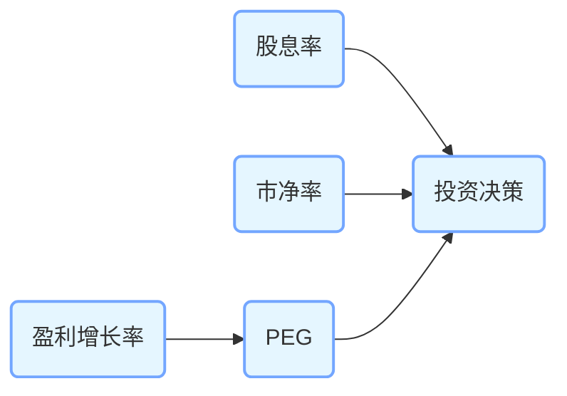

# 彼得林奇四大选股指标详解

> 关键词：彼得林奇、选股指标、成长股、估值、财务分析、投资策略、股票投资

> 摘要：本文旨在深入剖析彼得林奇的四大选股指标。彼得林奇作为投资界的传奇人物，其选股策略影响深远。通过对这四大选股指标的详细解读，包括各指标的原理、计算方法、实际应用以及在不同市场环境下的意义，帮助投资者更好地理解和运用这些指标进行股票筛选和投资决策。同时，结合实际案例展示指标的应用过程，分析其优势与局限性，为投资者在复杂的股票市场中提供有价值的参考，以提高投资成功的概率。

## 1. 背景介绍 
### 1.1 目的和范围
本文的主要目的是全面、深入地阐述彼得林奇的四大选股指标。详细讲解每个指标的核心概念、计算方式以及在股票投资中的实际应用，帮助投资者理解如何运用这些指标来评估股票的投资价值。范围涵盖了四大选股指标的各个方面，包括指标背后的理论基础、实际操作方法、在不同行业和市场环境下的适用性，以及与其他投资分析方法的结合应用等。

### 1.2 预期读者
本文预期读者主要包括对股票投资有一定兴趣的个人投资者，无论是新手投资者希望学习基本的选股方法，还是有一定经验的投资者想要进一步优化自己的投资策略，都可以从本文中获取有价值的信息。同时，金融专业的学生、研究人员以及从事金融投资相关工作的专业人士也可以将本文作为参考资料，深入了解彼得林奇的投资理念和选股技巧。

### 1.3 文档结构概述
本文首先介绍彼得林奇四大选股指标的背景信息，包括目的、预期读者和文档结构。接着详细阐述核心概念与联系，通过文本示意图和 Mermaid 流程图展示指标之间的关系。然后讲解核心算法原理和具体操作步骤，结合 Python 源代码进行详细说明。之后介绍数学模型和公式，并举例说明。再通过项目实战展示代码实际案例和详细解释。随后探讨实际应用场景，推荐相关的工具和资源。最后总结未来发展趋势与挑战，提供常见问题与解答以及扩展阅读和参考资料。

### 1.4 术语表
#### 1.4.1 核心术语定义
- **彼得林奇**：美国著名的投资家，曾任富达麦哲伦基金的基金经理，以出色的投资业绩和独特的选股策略闻名于世。
- **选股指标**：用于评估股票投资价值的一系列量化或非量化的标准和方法，帮助投资者筛选出具有潜力的股票。
- **成长股**：指那些业绩增长速度较快、具有较大发展潜力的公司股票。
- **估值**：对股票内在价值的评估，通过各种方法计算出股票的合理价格范围。
- **财务分析**：对公司财务报表进行分析，以了解公司的财务状况、经营成果和现金流量等情况。

#### 1.4.2 相关概念解释
- **市盈率（PE）**：股票价格与每股收益的比率，反映了市场对公司盈利的预期和估值水平。
- **市净率（PB）**：股票价格与每股净资产的比率，衡量了股票价格相对于公司净资产的高低。
- **股息率**：股息与股票价格的比率，反映了公司向股东分配利润的能力和水平。
- **盈利增长率**：公司盈利在一定时期内的增长速度，是衡量公司成长能力的重要指标。

#### 1.4.3 缩略词列表
- **PE**：市盈率（Price - Earnings Ratio）
- **PB**：市净率（Price - Book Ratio）

## 2. 核心概念与联系 
### 2.1 彼得林奇四大选股指标概述
彼得林奇的四大选股指标分别是：市盈率相对盈利增长比率（PEG）、股息率、市净率（PB）和盈利增长率。这四个指标从不同角度评估了股票的投资价值，相互关联又各有侧重。

- **市盈率相对盈利增长比率（PEG）**：该指标综合考虑了市盈率和盈利增长率，用于衡量股票的估值是否合理。PEG 指标将公司的市盈率与盈利增长率进行比较，当 PEG 小于 1 时，通常认为股票被低估，具有投资价值。
- **股息率**：反映了公司向股东分配利润的情况。较高的股息率表明公司有较强的盈利能力和现金流，同时也为投资者提供了一定的现金回报。
- **市净率（PB）**：衡量了股票价格相对于公司净资产的高低。较低的市净率可能意味着股票被低估，具有一定的安全边际。
- **盈利增长率**：是衡量公司成长能力的关键指标。较高的盈利增长率表明公司业务发展良好，具有较大的发展潜力。

### 2.2 核心概念原理和架构的文本示意图
彼得林奇的四大选股指标构成了一个综合的选股体系。盈利增长率是基础，反映了公司的成长潜力。市盈率相对盈利增长比率（PEG）结合了盈利增长率和市盈率，对股票的估值进行更全面的评估。股息率体现了公司的盈利能力和对股东的回报。市净率则从资产角度衡量股票的价值。这四个指标相互补充，共同为投资者提供了一个多维度的选股视角。

### 2.3 Mermaid 流程图

该流程图展示了四大选股指标之间的关系。盈利增长率是计算 PEG 的重要因素，而 PEG、股息率和市净率共同影响投资决策。

## 3. 核心算法原理 & 具体操作步骤 
### 3.1 市盈率相对盈利增长比率（PEG）
#### 3.1.1 算法原理
PEG 指标的计算公式为：$PEG = \frac{PE}{盈利增长率 \times 100}$，其中 PE 为市盈率，盈利增长率为公司的预期盈利增长率。该指标的核心思想是将公司的市盈率与盈利增长率进行对比，以评估股票的估值是否合理。当 PEG 小于 1 时，说明公司的盈利增长速度能够支撑其当前的市盈率，股票可能被低估；当 PEG 大于 1 时，股票可能被高估。

#### 3.1.2 具体操作步骤
以下是使用 Python 计算 PEG 指标的示例代码：
```python
# 定义计算 PEG 的函数
def calculate_peg(pe, growth_rate):
    if growth_rate == 0:
        return None
    else:
        return pe / (growth_rate * 100)

# 示例数据
pe = 20
growth_rate = 0.2

# 计算 PEG
peg = calculate_peg(pe, growth_rate)
print(f"PEG 值为: {peg}")
```
### 3.2 股息率
#### 3.2.1 算法原理
股息率的计算公式为：$股息率 = \frac{每股股息}{股票价格} \times 100\%$。该指标反映了公司向股东分配利润的比例，较高的股息率通常意味着公司有较强的盈利能力和稳定的现金流。

#### 3.2.2 具体操作步骤
以下是使用 Python 计算股息率的示例代码：
```python
# 定义计算股息率的函数
def calculate_dividend_yield(dividend_per_share, stock_price):
    if stock_price == 0:
        return None
    else:
        return (dividend_per_share / stock_price) * 100

# 示例数据
dividend_per_share = 2
stock_price = 50

# 计算股息率
dividend_yield = calculate_dividend_yield(dividend_per_share, stock_price)
print(f"股息率为: {dividend_yield}%")
```
### 3.3 市净率（PB）
#### 3.3.1 算法原理
市净率的计算公式为：$PB = \frac{股票价格}{每股净资产}$。该指标衡量了股票价格相对于公司净资产的高低，较低的市净率可能意味着股票被低估，具有一定的安全边际。

#### 3.3.2 具体操作步骤
以下是使用 Python 计算市净率的示例代码：
```python
# 定义计算市净率的函数
def calculate_pb(stock_price, book_value_per_share):
    if book_value_per_share == 0:
        return None
    else:
        return stock_price / book_value_per_share

# 示例数据
stock_price = 30
book_value_per_share = 10

# 计算市净率
pb = calculate_pb(stock_price, book_value_per_share)
print(f"市净率为: {pb}")
```
### 3.4 盈利增长率
#### 3.4.1 算法原理
盈利增长率的计算公式为：$盈利增长率 = \frac{本期盈利 - 上期盈利}{上期盈利} \times 100\%$。该指标反映了公司盈利在一定时期内的增长速度，是衡量公司成长能力的重要指标。

#### 3.4.2 具体操作步骤
以下是使用 Python 计算盈利增长率的示例代码：
```python
# 定义计算盈利增长率的函数
def calculate_growth_rate(current_earnings, previous_earnings):
    if previous_earnings == 0:
        return None
    else:
        return ((current_earnings - previous_earnings) / previous_earnings) * 100

# 示例数据
current_earnings = 100
previous_earnings = 80

# 计算盈利增长率
growth_rate = calculate_growth_rate(current_earnings, previous_earnings)
print(f"盈利增长率为: {growth_rate}%")
```

## 4. 数学模型和公式 & 详细讲解 & 举例说明 
### 4.1 市盈率相对盈利增长比率（PEG）
#### 4.1.1 数学公式
$PEG = \frac{PE}{盈利增长率 \times 100}$

#### 4.1.2 详细讲解
PEG 指标的核心在于将市盈率和盈利增长率结合起来，以更全面地评估股票的估值。市盈率反映了市场对公司盈利的预期，而盈利增长率则体现了公司的成长潜力。当 PEG 小于 1 时，说明公司的盈利增长速度能够支撑其当前的市盈率，股票可能被低估；当 PEG 大于 1 时，股票可能被高估。

#### 4.1.3 举例说明
假设公司 A 的市盈率为 20，预期盈利增长率为 25%。则其 PEG 值为：$PEG = \frac{20}{25 \times 100} = 0.8$。由于 PEG 小于 1，根据 PEG 指标的判断标准，公司 A 的股票可能被低估，具有一定的投资价值。

### 4.2 股息率
#### 4.2.1 数学公式
$股息率 = \frac{每股股息}{股票价格} \times 100\%$

#### 4.2.2 详细讲解
股息率反映了公司向股东分配利润的比例。较高的股息率表明公司有较强的盈利能力和稳定的现金流，同时也为投资者提供了一定的现金回报。股息率是衡量股票投资价值的重要指标之一，尤其对于追求稳定收益的投资者来说，具有重要的参考意义。

#### 4.2.3 举例说明
假设公司 B 的每股股息为 1 元，股票价格为 20 元。则其股息率为：$股息率 = \frac{1}{20} \times 100\% = 5\%$。这意味着投资者持有公司 B 的股票，每年可以获得 5%的现金回报。

### 4.3 市净率（PB）
#### 4.3.1 数学公式
$PB = \frac{股票价格}{每股净资产}$

#### 4.3.2 详细讲解
市净率衡量了股票价格相对于公司净资产的高低。较低的市净率可能意味着股票被低估，具有一定的安全边际。因为即使公司面临困境，其净资产也可以作为一种保障。但是，市净率也有其局限性，例如对于一些轻资产的公司，市净率可能不太适用。

#### 4.3.3 举例说明
假设公司 C 的股票价格为 15 元，每股净资产为 10 元。则其市净率为：$PB = \frac{15}{10} = 1.5$。一般来说，市净率越低，股票的投资价值相对越高。与同行业其他公司相比，如果公司 C 的市净率较低，则可能具有一定的投资优势。

### 4.4 盈利增长率
#### 4.4.1 数学公式
$盈利增长率 = \frac{本期盈利 - 上期盈利}{上期盈利} \times 100\%$

#### 4.4.2 详细讲解
盈利增长率是衡量公司成长能力的关键指标。较高的盈利增长率表明公司业务发展良好，具有较大的发展潜力。投资者通常更倾向于投资盈利增长率较高的公司，因为这意味着公司的未来业绩可能会持续增长。

#### 4.4.3 举例说明
假设公司 D 上期盈利为 500 万元，本期盈利为 600 万元。则其盈利增长率为：$盈利增长率 = \frac{600 - 500}{500} \times 100\% = 20\%$。这表明公司 D 在本期的盈利增长了 20%，具有较好的成长态势。

## 5. 项目实战：代码实际案例和详细解释说明 
### 5.1  开发环境搭建
#### 5.1.1 安装 Python
首先，需要安装 Python 开发环境。可以从 Python 官方网站（https://www.python.org/downloads/）下载适合自己操作系统的 Python 安装包，并按照安装向导进行安装。

#### 5.1.2 安装必要的库
在本项目中，需要使用 pandas 库来处理数据。可以使用以下命令来安装 pandas 库：
```sh
pip install pandas
```

### 5.2  源代码详细实现和代码解读
以下是一个使用 Python 实现彼得林奇四大选股指标计算的完整代码示例：
```python
import pandas as pd

# 定义计算 PEG 的函数
def calculate_peg(pe, growth_rate):
    if growth_rate == 0:
        return None
    else:
        return pe / (growth_rate * 100)

# 定义计算股息率的函数
def calculate_dividend_yield(dividend_per_share, stock_price):
    if stock_price == 0:
        return None
    else:
        return (dividend_per_share / stock_price) * 100

# 定义计算市净率的函数
def calculate_pb(stock_price, book_value_per_share):
    if book_value_per_share == 0:
        return None
    else:
        return stock_price / book_value_per_share

# 定义计算盈利增长率的函数
def calculate_growth_rate(current_earnings, previous_earnings):
    if previous_earnings == 0:
        return None
    else:
        return ((current_earnings - previous_earnings) / previous_earnings) * 100

# 示例数据
data = {
    '股票代码': ['000001', '000002', '000003'],
    '市盈率': [20, 30, 15],
    '预期盈利增长率': [0.2, 0.15, 0.25],
    '每股股息': [2, 1, 3],
    '股票价格': [50, 40, 60],
    '每股净资产': [10, 12, 15],
    '上期盈利': [80, 60, 100],
    '本期盈利': [100, 70, 130]
}

# 创建 DataFrame
df = pd.DataFrame(data)

# 计算四大选股指标
df['PEG'] = df.apply(lambda row: calculate_peg(row['市盈率'], row['预期盈利增长率']), axis=1)
df['股息率'] = df.apply(lambda row: calculate_dividend_yield(row['每股股息'], row['股票价格']), axis=1)
df['市净率'] = df.apply(lambda row: calculate_pb(row['股票价格'], row['每股净资产']), axis=1)
df['盈利增长率'] = df.apply(lambda row: calculate_growth_rate(row['本期盈利'], row['上期盈利']), axis=1)

# 输出结果
print(df)
```
### 5.3  代码解读与分析
#### 5.3.1 函数定义
代码中定义了四个函数，分别用于计算 PEG、股息率、市净率和盈利增长率。这些函数根据前面介绍的算法原理实现了相应的计算逻辑。

#### 5.3.2 数据准备
使用字典 `data` 定义了示例数据，包括股票代码、市盈率、预期盈利增长率等信息。然后使用 `pandas` 库的 `DataFrame` 函数将数据转换为数据框。

#### 5.3.3 指标计算
使用 `apply` 函数将计算函数应用到数据框的每一行，计算出每个股票的四大选股指标，并将结果添加到数据框中。

#### 5.3.4 结果输出
最后，使用 `print` 函数输出包含四大选股指标的数据框，方便用户查看和分析。

## 6. 实际应用场景 
### 6.1 个人投资者选股
对于个人投资者来说，彼得林奇的四大选股指标可以帮助他们筛选出具有投资价值的股票。投资者可以根据自己的风险偏好和投资目标，设定相应的指标阈值。例如，对于追求成长型投资的投资者，可以选择 PEG 小于 1、盈利增长率较高的股票；对于追求稳定收益的投资者，可以关注股息率较高的股票。

### 6.2 基金经理投资决策
基金经理在进行投资决策时，也可以参考彼得林奇的四大选股指标。通过对大量股票的指标计算和分析，基金经理可以构建投资组合，优化资产配置。同时，这些指标也可以帮助基金经理评估投资组合的风险和收益，及时调整投资策略。

### 6.3 公司财务分析
公司内部的财务分析人员可以使用这些指标来评估公司的经营状况和财务健康程度。通过与同行业其他公司的指标对比，分析公司在市场中的竞争力和发展潜力。此外，这些指标也可以为公司的战略决策提供参考，帮助公司制定合理的发展规划。

## 7. 工具和资源推荐
### 7.1 学习资源推荐
#### 7.1.1 书籍推荐
- 《彼得林奇的成功投资》：彼得林奇的经典著作，详细介绍了他的投资理念和选股方法，是学习彼得林奇投资思想的必读之书。
- 《战胜华尔街》：进一步阐述了彼得林奇的投资策略和实战经验，对投资者具有很高的参考价值。
- 《聪明的投资者》：本杰明·格雷厄姆的经典著作，虽然不是专门介绍彼得林奇的选股指标，但其中的价值投资理念对理解和应用这些指标有很大的帮助。

#### 7.1.2 在线课程
- Coursera 上的《投资学原理》：该课程系统地介绍了投资学的基本原理和方法，包括股票投资、估值分析等内容，对学习彼得林奇的选股指标有很好的辅助作用。
- 网易云课堂上的《股票投资实战技巧》：课程结合实际案例，讲解股票投资的实战技巧，其中也会涉及到一些选股指标的应用。

#### 7.1.3 技术博客和网站
- 雪球网：国内知名的投资社区，有大量的投资者分享自己的投资经验和研究成果，包括对彼得林奇选股指标的讨论和应用案例。
- 东方财富网：提供丰富的金融数据和资讯，投资者可以在该网站上获取股票的财务数据，用于计算和分析彼得林奇的选股指标。

### 7.2 开发工具框架推荐
#### 7.2.1 IDE和编辑器
- PyCharm：功能强大的 Python 集成开发环境，提供代码编辑、调试、版本控制等功能，适合开发和调试与选股指标计算相关的 Python 代码。
- Jupyter Notebook：交互式的开发环境，方便用户进行数据探索和分析，特别适合在学习和研究选股指标时使用。

#### 7.2.2 调试和性能分析工具
- pdb：Python 自带的调试工具，可以帮助用户在代码中设置断点，逐步执行代码，查找和解决问题。
- cProfile：Python 的性能分析工具，可以帮助用户分析代码的性能瓶颈，优化代码效率。

#### 7.2.3 相关框架和库
- pandas：强大的数据处理和分析库，用于处理和存储股票的财务数据，方便进行选股指标的计算和分析。
- numpy：提供高效的数值计算功能，在计算选股指标时可以提高计算效率。

### 7.3 相关论文著作推荐
#### 7.3.1 经典论文
- 《The Capital Asset Pricing Model: Theory and Evidence》：该论文对资本资产定价模型进行了深入的研究和探讨，对理解股票的估值和投资风险有重要的参考价值。
- 《Efficient Capital Markets: A Review of Theory and Empirical Work》：有效市场假说的经典论文，对股票市场的有效性进行了系统的分析，对投资者的投资决策有一定的指导意义。

#### 7.3.2 最新研究成果
- 关注顶级金融学术期刊，如《Journal of Finance》、《Review of Financial Studies》等，这些期刊会发表关于股票投资、估值分析等方面的最新研究成果。
- 参加金融学术会议，了解学术界在选股指标和投资策略方面的最新研究动态。

#### 7.3.3 应用案例分析
- 一些专业的金融研究机构会发布关于选股指标应用案例的研究报告，投资者可以参考这些报告，学习如何在实际投资中应用彼得林奇的选股指标。
- 上市公司的年报和财务报表中也包含了大量的财务数据和分析，可以作为应用案例进行研究和学习。

## 8. 总结：未来发展趋势与挑战
### 8.1 未来发展趋势
- **数字化和智能化**：随着信息技术的不断发展，选股指标的计算和分析将越来越数字化和智能化。利用大数据、人工智能等技术，可以更快速、准确地获取和处理股票的财务数据，提高选股指标的计算效率和准确性。
- **多指标融合**：未来的选股策略将不再局限于单一的指标，而是会将多个指标进行融合，综合考虑公司的基本面、行业前景、市场情绪等因素，以提高投资决策的准确性和可靠性。
- **国际化投资**：随着全球经济一体化的发展，投资者的投资范围将越来越广泛，国际化投资将成为未来的发展趋势。彼得林奇的选股指标也将在国际市场上得到更广泛的应用和验证。

### 8.2 挑战
- **数据质量和可靠性**：选股指标的计算依赖于准确、可靠的财务数据。然而，在实际应用中，数据质量可能存在问题，如数据错误、数据延迟等，这会影响选股指标的计算结果和投资决策的准确性。
- **市场变化的不确定性**：股票市场是复杂多变的，受到宏观经济、政策法规、行业竞争等多种因素的影响。选股指标可能无法完全适应市场的变化，导致投资决策出现偏差。
- **投资者情绪和行为偏差**：投资者的情绪和行为偏差也会对选股指标的应用产生影响。例如，投资者可能会过度乐观或悲观，导致对股票的估值出现偏差，从而影响投资决策。

## 9. 附录：常见问题与解答
### 9.1 问题：PEG 指标中的盈利增长率是指历史盈利增长率还是预期盈利增长率？
解答：PEG 指标中的盈利增长率通常指预期盈利增长率。因为投资是基于对未来的预期，预期盈利增长率更能反映公司的成长潜力和未来的盈利趋势。然而，预期盈利增长率的准确性较难把握，需要投资者结合公司的基本面、行业前景等因素进行综合分析。

### 9.2 问题：股息率越高越好吗？
解答：一般来说，较高的股息率表明公司有较强的盈利能力和稳定的现金流，同时也为投资者提供了一定的现金回报。但是，股息率并不是越高越好。如果公司的股息率过高，可能意味着公司没有将足够的资金用于再投资，影响公司的未来发展。此外，过高的股息率也可能是由于股票价格下跌导致的，这可能暗示公司存在潜在的问题。

### 9.3 问题：市净率低的股票一定具有投资价值吗？
解答：市净率低的股票可能被低估，具有一定的安全边际。但是，市净率低并不一定意味着股票具有投资价值。例如，一些夕阳行业的公司，由于行业前景不佳，即使市净率较低，其股票也可能没有投资价值。此外，市净率也有其局限性，对于一些轻资产的公司，市净率可能不太适用。

### 9.4 问题：如何获取股票的财务数据来计算选股指标？
解答：可以通过以下途径获取股票的财务数据：
- 金融数据网站：如东方财富网、同花顺等，这些网站提供丰富的股票财务数据。
- 上市公司年报和财务报表：可以从上市公司的官方网站或证券交易所网站下载公司的年报和财务报表，获取详细的财务数据。
- 金融数据提供商：如 Wind、Bloomberg 等，这些数据提供商提供专业的金融数据服务。

## 10. 扩展阅读 & 参考资料
### 10.1 扩展阅读
- 《财务报表分析与股票估值》：深入讲解了财务报表分析和股票估值的方法，对理解和应用彼得林奇的选股指标有很大的帮助。
- 《投资中最简单的事》：介绍了投资的基本原理和方法，强调了价值投资的重要性，对投资者的投资理念有一定的启发作用。

### 10.2 参考资料
- 彼得林奇相关著作和演讲资料。
- 金融学术期刊上发表的关于选股指标和投资策略的研究论文。
- 金融数据网站和上市公司年报提供的相关数据和信息。