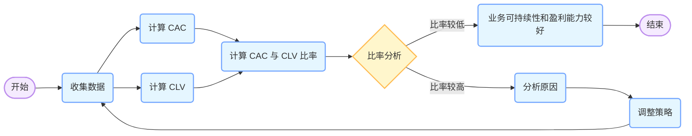

# 彼得林奇如何分析公司的客户获取成本与终身价值比率

> 关键词：彼得林奇、客户获取成本、客户终身价值、比率分析、公司分析、投资策略、财务评估

> 摘要：本文聚焦于彼得林奇分析公司时所采用的客户获取成本与终身价值比率方法。通过深入探讨这一比率的核心概念、算法原理、数学模型，结合项目实战案例，阐述其在实际应用场景中的重要性。同时推荐相关学习资源、开发工具及论文著作，总结未来发展趋势与挑战，旨在帮助投资者和企业管理者更好地理解和运用这一分析方法，评估公司的财务健康状况和投资价值。

## 1. 背景介绍 
### 1.1 目的和范围
在投资领域，准确评估公司的价值是做出明智投资决策的关键。彼得林奇作为投资界的传奇人物，其投资策略和分析方法备受关注。客户获取成本（Customer Acquisition Cost，CAC）与客户终身价值（Customer Lifetime Value，CLV）比率是评估公司业务可持续性和盈利能力的重要指标。本文的目的是深入剖析彼得林奇如何运用这一比率来分析公司，探讨其背后的原理和应用方法。范围涵盖了该比率的基本概念、算法、数学模型、实际案例以及相关的学习资源和工具等方面。

### 1.2 预期读者
本文预期读者包括对投资分析感兴趣的个人投资者、金融专业人士、企业管理者以及相关领域的研究人员。对于希望学习彼得林奇投资方法和深入了解客户获取成本与终身价值比率分析的读者，本文将提供有价值的参考和指导。

### 1.3 文档结构概述
本文首先介绍客户获取成本与终身价值比率的背景知识，包括术语定义和相关概念解释。接着阐述核心概念与联系，通过文本示意图和 Mermaid 流程图展示其原理和架构。然后详细讲解核心算法原理和具体操作步骤，并给出 Python 源代码示例。随后介绍数学模型和公式，并举例说明。在项目实战部分，通过实际案例展示代码实现和详细解读。之后探讨该比率在实际应用场景中的作用，推荐相关的学习资源、开发工具和论文著作。最后总结未来发展趋势与挑战，提供常见问题与解答以及扩展阅读和参考资料。

### 1.4 术语表
#### 1.4.1 核心术语定义
- **客户获取成本（CAC）**：指公司为获取一个新客户而付出的全部成本，包括营销费用、销售费用等。
- **客户终身价值（CLV）**：指公司从一个客户在其与公司的整个关系期间所获得的预期总利润。
- **CAC 与 CLV 比率**：是客户获取成本与客户终身价值的比值，用于衡量公司获取客户的效率和客户的长期价值。

#### 1.4.2 相关概念解释
- **营销费用**：公司为推广产品或服务而发生的费用，如广告费用、促销活动费用等。
- **销售费用**：与销售产品或服务直接相关的费用，如销售人员的工资、差旅费等。
- **客户留存率**：指在一定时期内，继续与公司保持业务关系的客户占总客户数的比例。

#### 1.4.3 缩略词列表
- **CAC**：Customer Acquisition Cost（客户获取成本）
- **CLV**：Customer Lifetime Value（客户终身价值）

## 2. 核心概念与联系 

### 核心概念原理
客户获取成本（CAC）反映了公司在获取新客户过程中所投入的资源。计算 CAC 时，通常将一定时期内的营销和销售费用总和除以该时期内获取的新客户数量。例如，一家公司在一个月内花费 10 万元用于营销和销售活动，共获取了 1000 个新客户，那么该公司的 CAC 为 100 元（100000 ÷ 1000）。

客户终身价值（CLV）则关注客户在与公司的整个关系期间为公司带来的利润。它考虑了客户的购买频率、平均购买金额、客户留存率等因素。例如，一个客户每年在公司购买产品的平均金额为 500 元，购买频率为 2 次，客户留存率为 80%，假设客户与公司的关系持续 5 年，那么该客户的 CLV 可以通过一系列计算得出。

CAC 与 CLV 比率是将 CAC 除以 CLV 得到的数值。这个比率可以帮助投资者和企业管理者评估公司获取客户的效率和客户的长期价值。如果 CAC 与 CLV 比率较低，说明公司能够以较低的成本获取高价值的客户，业务具有较好的可持续性和盈利能力；反之，如果比率较高，可能意味着公司获取客户的成本过高，或者客户的终身价值较低，需要进一步分析原因。

### 文本示意图
```plaintext
客户获取成本（CAC）
|
|-- 营销费用
|-- 销售费用
|
| 计算方式：一定时期内营销和销售费用总和 ÷ 该时期内获取的新客户数量

客户终身价值（CLV）
|
|-- 平均购买金额
|-- 购买频率
|-- 客户留存率
|-- 客户关系持续时间
|
| 计算方式：综合考虑上述因素的复杂计算

CAC 与 CLV 比率
|
|-- CAC ÷ CLV
|
| 作用：评估公司获取客户的效率和客户的长期价值
```

### Mermaid 流程图


## 3. 核心算法原理 & 具体操作步骤 

### 核心算法原理
#### 客户获取成本（CAC）算法
CAC 的计算相对简单，公式为：
$$CAC = \frac{营销和销售费用总和}{新客户数量}$$

#### 客户终身价值（CLV）算法
CLV 的计算较为复杂，常见的一种方法是基于客户的平均购买金额、购买频率、客户留存率和客户关系持续时间来计算。公式如下：
$$CLV = \sum_{t=0}^{n} \left( 平均购买金额 \times 购买频率 \times (客户留存率)^t \right) \times (1 + 折现率)^{-t}$$
其中，$t$ 表示时间周期，$n$ 表示客户关系持续的总时间周期，折现率用于考虑未来现金流的时间价值。

### 具体操作步骤
1. **数据收集**：收集公司一定时期内的营销和销售费用、新客户数量、平均购买金额、购买频率、客户留存率和客户关系持续时间等数据。
2. **计算 CAC**：根据上述 CAC 公式，将营销和销售费用总和除以新客户数量，得到 CAC 值。
3. **计算 CLV**：根据 CLV 公式，代入平均购买金额、购买频率、客户留存率、客户关系持续时间和折现率等数据，计算出 CLV 值。
4. **计算 CAC 与 CLV 比率**：将 CAC 值除以 CLV 值，得到 CAC 与 CLV 比率。
5. **比率分析**：根据比率结果，评估公司获取客户的效率和客户的长期价值。如果比率较低，说明公司业务具有较好的可持续性和盈利能力；如果比率较高，需要进一步分析原因，如是否营销费用过高、客户留存率过低等。

### Python 源代码示例
```python
# 计算客户获取成本（CAC）
def calculate_cac(marketing_sales_cost, new_customers):
    return marketing_sales_cost / new_customers

# 计算客户终身价值（CLV）
def calculate_clv(average_purchase_amount, purchase_frequency, retention_rate, customer_lifetime, discount_rate):
    clv = 0
    for t in range(customer_lifetime):
        clv += average_purchase_amount * purchase_frequency * (retention_rate ** t) * ((1 + discount_rate) ** (-t))
    return clv

# 计算 CAC 与 CLV 比率
def calculate_cac_clv_ratio(cac, clv):
    return cac / clv

# 示例数据
marketing_sales_cost = 100000
new_customers = 1000
average_purchase_amount = 500
purchase_frequency = 2
retention_rate = 0.8
customer_lifetime = 5
discount_rate = 0.1

# 计算 CAC
cac = calculate_cac(marketing_sales_cost, new_customers)
print(f"客户获取成本（CAC）: {cac} 元")

# 计算 CLV
clv = calculate_clv(average_purchase_amount, purchase_frequency, retention_rate, customer_lifetime, discount_rate)
print(f"客户终身价值（CLV）: {clv} 元")

# 计算 CAC 与 CLV 比率
cac_clv_ratio = calculate_cac_clv_ratio(cac, clv)
print(f"CAC 与 CLV 比率: {cac_clv_ratio}")
```

## 4. 数学模型和公式 & 详细讲解 & 举例说明 

### 数学模型和公式
#### 客户获取成本（CAC）公式
$$CAC = \frac{营销和销售费用总和}{新客户数量}$$
这个公式直观地反映了公司为获取一个新客户所需要付出的平均成本。例如，一家电商公司在一个季度内投入了 50 万元用于营销和销售活动，共吸引了 5000 个新客户，那么该公司的 CAC 为：
$$CAC = \frac{500000}{5000} = 100 \text{ 元}$$

#### 客户终身价值（CLV）公式
$$CLV = \sum_{t=0}^{n} \left( 平均购买金额 \times 购买频率 \times (客户留存率)^t \right) \times (1 + 折现率)^{-t}$$
这个公式考虑了客户在多个时间周期内的购买行为以及未来现金流的时间价值。其中，平均购买金额表示客户每次购买的平均花费，购买频率表示客户在单位时间内的购买次数，客户留存率表示客户在每个时间周期后继续购买的概率，折现率用于将未来的现金流折现到当前时刻。

### 详细讲解
- **平均购买金额**：是指客户在一次购买中平均花费的金额。可以通过统计历史交易数据来计算。例如，一家咖啡店统计了过去一个月内所有客户的购买金额，总金额为 10000 元，交易次数为 200 次，那么平均购买金额为 50 元（10000 ÷ 200）。
- **购买频率**：反映了客户的购买活跃度。可以根据客户在一定时期内的购买次数来计算。例如，某客户在一年内在某超市购买了 50 次商品，那么该客户的购买频率为 50 次/年。
- **客户留存率**：是衡量客户忠诚度的重要指标。可以通过比较不同时期的客户数量来计算。例如，某公司在年初有 1000 个客户，年末仍有 800 个客户继续购买产品，那么客户留存率为 80%（800 ÷ 1000）。
- **折现率**：考虑了资金的时间价值。一般来说，未来的现金流不如当前的现金流有价值，因此需要将未来的现金流折现到当前时刻。折现率的选择通常基于市场利率、公司的资本成本等因素。

### 举例说明
假设一家在线教育公司，平均购买金额为 1000 元，购买频率为 1 次/年，客户留存率为 0.7，客户关系持续时间为 3 年，折现率为 0.1。计算该公司的客户终身价值（CLV）：

当 $t = 0$ 时：
$$(1000 \times 1 \times (0.7)^0) \times (1 + 0.1)^{-0} = 1000 \text{ 元}$$

当 $t = 1$ 时：
$$(1000 \times 1 \times (0.7)^1) \times (1 + 0.1)^{-1} = 1000 \times 0.7 \div 1.1 \approx 636.36 \text{ 元}$$

当 $t = 2$ 时：
$$(1000 \times 1 \times (0.7)^2) \times (1 + 0.1)^{-2} = 1000 \times 0.49 \div 1.21 \approx 405.79 \text{ 元}$$

则 CLV 为：
$$CLV = 1000 + 636.36 + 405.79 = 2042.15 \text{ 元}$$

如果该公司在这一年中投入了 10 万元用于营销和销售活动，共获取了 100 个新客户，那么 CAC 为 1000 元（100000 ÷ 100）。

CAC 与 CLV 比率为：
$$\frac{1000}{2042.15} \approx 0.49$$

## 5. 项目实战：代码实际案例和详细解释说明 

### 5.1  开发环境搭建
- **Python 安装**：确保系统中已经安装了 Python 3.x 版本。可以从 Python 官方网站（https://www.python.org/downloads/）下载并安装。
- **开发工具**：推荐使用 PyCharm 或 Jupyter Notebook 作为开发工具。PyCharm 是一款功能强大的 Python 集成开发环境，提供了丰富的代码编辑、调试和运行功能；Jupyter Notebook 则适合进行交互式的代码开发和数据分析。
- **依赖库安装**：本案例中使用的是 Python 内置的库，无需额外安装依赖库。

### 5.2  源代码详细实现和代码解读
```python
# 计算客户获取成本（CAC）
def calculate_cac(marketing_sales_cost, new_customers):
    """
    此函数用于计算客户获取成本（CAC）
    :param marketing_sales_cost: 营销和销售费用总和
    :param new_customers: 新客户数量
    :return: 客户获取成本（CAC）
    """
    return marketing_sales_cost / new_customers

# 计算客户终身价值（CLV）
def calculate_clv(average_purchase_amount, purchase_frequency, retention_rate, customer_lifetime, discount_rate):
    """
    此函数用于计算客户终身价值（CLV）
    :param average_purchase_amount: 平均购买金额
    :param purchase_frequency: 购买频率
    :param retention_rate: 客户留存率
    :param customer_lifetime: 客户关系持续时间
    :param discount_rate: 折现率
    :return: 客户终身价值（CLV）
    """
    clv = 0
    for t in range(customer_lifetime):
        clv += average_purchase_amount * purchase_frequency * (retention_rate ** t) * ((1 + discount_rate) ** (-t))
    return clv

# 计算 CAC 与 CLV 比率
def calculate_cac_clv_ratio(cac, clv):
    """
    此函数用于计算 CAC 与 CLV 比率
    :param cac: 客户获取成本（CAC）
    :param clv: 客户终身价值（CLV）
    :return: CAC 与 CLV 比率
    """
    return cac / clv

# 示例数据
marketing_sales_cost = 100000
new_customers = 1000
average_purchase_amount = 500
purchase_frequency = 2
retention_rate = 0.8
customer_lifetime = 5
discount_rate = 0.1

# 计算 CAC
cac = calculate_cac(marketing_sales_cost, new_customers)
print(f"客户获取成本（CAC）: {cac} 元")

# 计算 CLV
clv = calculate_clv(average_purchase_amount, purchase_frequency, retention_rate, customer_lifetime, discount_rate)
print(f"客户终身价值（CLV）: {clv} 元")

# 计算 CAC 与 CLV 比率
cac_clv_ratio = calculate_cac_clv_ratio(cac, clv)
print(f"CAC 与 CLV 比率: {cac_clv_ratio}")
```
### 代码解读与分析
- **`calculate_cac` 函数**：该函数接受营销和销售费用总和以及新客户数量作为参数，通过将两者相除来计算客户获取成本（CAC）。
- **`calculate_clv` 函数**：该函数接受平均购买金额、购买频率、客户留存率、客户关系持续时间和折现率作为参数，使用循环来计算每个时间周期的现金流，并将其折现到当前时刻，最后累加得到客户终身价值（CLV）。
- **`calculate_cac_clv_ratio` 函数**：该函数接受 CAC 和 CLV 作为参数，通过将 CAC 除以 CLV 来计算 CAC 与 CLV 比率。
- **示例数据部分**：定义了一些示例数据，包括营销和销售费用总和、新客户数量、平均购买金额、购买频率、客户留存率、客户关系持续时间和折现率。
- **计算和输出部分**：调用上述三个函数，分别计算 CAC、CLV 和 CAC 与 CLV 比率，并将结果打印输出。

通过这个示例代码，我们可以清晰地看到如何使用 Python 来计算客户获取成本、客户终身价值以及它们的比率，从而对公司的客户获取效率和客户长期价值进行评估。

## 6. 实际应用场景 
### 投资决策
投资者在评估一家公司的投资价值时，可以使用 CAC 与 CLV 比率来判断公司的业务模式是否具有可持续性和盈利能力。如果一家公司的 CAC 与 CLV 比率较低，说明公司能够以较低的成本获取高价值的客户，未来的盈利潜力较大，可能是一个较好的投资对象；反之，如果比率较高，投资者需要谨慎考虑，进一步分析公司的营销和销售策略、客户留存率等因素，以评估其投资风险。

### 市场营销策略调整
企业可以根据 CAC 与 CLV 比率来调整市场营销策略。如果 CAC 过高，企业可以考虑优化营销渠道，降低营销成本，提高营销效率；如果 CLV 较低，企业可以分析客户流失的原因，采取措施提高客户留存率，增加客户的购买频率和平均购买金额。例如，通过提供优质的客户服务、推出个性化的营销活动、优化产品质量等方式，提高客户的满意度和忠诚度，从而提升客户的终身价值。

### 业务扩张决策
在考虑业务扩张时，企业可以使用 CAC 与 CLV 比率来评估新市场或新产品的可行性。如果在新市场或推出新产品的情况下，预计的 CAC 与 CLV 比率能够保持在合理范围内，说明业务扩张具有一定的潜力和盈利空间；反之，如果比率过高，企业需要谨慎决策，重新评估扩张计划，避免盲目投资导致的损失。

### 预算分配
企业可以根据 CAC 与 CLV 比率来合理分配营销和销售预算。对于 CAC 与 CLV 比率较低的业务领域或客户群体，企业可以适当增加预算，加大营销和销售力度，以获取更多的高价值客户；对于比率较高的领域，企业可以减少预算投入，优化资源配置，提高资金使用效率。

## 7. 工具和资源推荐
### 7.1 学习资源推荐
#### 7.1.1 书籍推荐
- 《彼得林奇的成功投资》：彼得林奇的经典著作，详细介绍了他的投资理念和方法，对于理解如何分析公司具有重要的指导意义。
- 《客户终身价值：驱动企业未来利润的引擎》：深入探讨了客户终身价值的概念、计算方法和应用，对于理解和应用 CAC 与 CLV 比率有很大帮助。
- 《营销管理》：全面介绍了市场营销的理论和实践，包括客户获取、客户关系管理等方面的内容，有助于从更宏观的角度理解 CAC 与 CLV 比率的应用。

#### 7.1.2 在线课程
- Coursera 上的“投资分析与组合管理”课程：提供了系统的投资分析知识和方法，包括公司财务分析、估值模型等内容，对于学习如何运用 CAC 与 CLV 比率进行投资决策有很大帮助。
- Udemy 上的“市场营销数据分析”课程：重点介绍了市场营销中的数据分析方法，包括客户获取成本、客户终身价值等指标的计算和分析，有助于提高数据分析能力。

#### 7.1.3 技术博客和网站
- Seeking Alpha：一个专业的金融投资网站，提供了大量的公司分析报告和投资观点，其中不乏关于 CAC 与 CLV 比率的分析和讨论。
- Harvard Business Review：哈佛商业评论的网站，发布了许多关于企业管理、市场营销等方面的前沿研究和实践案例，对于理解 CAC 与 CLV 比率在企业中的应用有很大启发。

### 7.2 开发工具框架推荐
#### 7.2.1 IDE和编辑器
- PyCharm：功能强大的 Python 集成开发环境，提供了丰富的代码编辑、调试和运行功能，适合进行复杂的数据分析和编程任务。
- Jupyter Notebook：交互式的代码开发和数据分析工具，支持 Python、R 等多种编程语言，方便进行数据探索和可视化。

#### 7.2.2 调试和性能分析工具
- Py-Spy：用于分析 Python 程序的性能，帮助开发者找出程序中的性能瓶颈，优化代码效率。
- PDB：Python 内置的调试器，方便开发者在代码中设置断点、查看变量值等，进行代码调试。

#### 7.2.3 相关框架和库
- Pandas：强大的数据分析库，提供了高效的数据结构和数据处理工具，方便进行数据清洗、整理和分析。
- NumPy：用于科学计算的基础库，提供了高效的数组操作和数学函数，对于计算 CAC、CLV 等指标非常有用。

### 7.3 相关论文著作推荐
#### 7.3.1 经典论文
- “Customer Lifetime Value in a Contractual Setting: An Empirical Analysis”：该论文深入研究了在合同型业务模式下客户终身价值的计算和应用，为理解 CLV 的计算方法提供了重要的理论基础。
- “The Impact of Customer Acquisition and Retention Strategies on Customer - Firm Profitability”：探讨了客户获取和留存策略对企业盈利能力的影响，对于理解 CAC 与 CLV 比率在企业战略中的作用有重要意义。

#### 7.3.2 最新研究成果
- 关注顶级学术期刊如《Journal of Marketing》、《Management Science》等，这些期刊上经常发表关于市场营销、客户关系管理等领域的最新研究成果，包括关于 CAC 与 CLV 比率的前沿研究。

#### 7.3.3 应用案例分析
- 许多咨询公司和行业研究机构会发布关于企业客户获取和客户价值管理的应用案例分析报告，通过实际案例可以更好地理解 CAC 与 CLV 比率在不同行业和企业中的应用方法和效果。

## 8. 总结：未来发展趋势与挑战
### 未来发展趋势
- **数据驱动的精细化分析**：随着大数据技术的不断发展，企业能够获取更丰富、更准确的客户数据，从而实现对 CAC 与 CLV 比率的更精细化分析。通过对客户行为、偏好等多维度数据的挖掘和分析，企业可以更精准地计算 CAC 和 CLV，制定更个性化的营销策略和投资决策。
- **跨行业应用拓展**：CAC 与 CLV 比率的应用将不再局限于传统的零售、金融等行业，而是逐渐拓展到更多领域，如医疗、教育、共享经济等。不同行业可以根据自身特点，灵活运用这一比率来评估业务的可持续性和盈利能力。
- **与人工智能的结合**：人工智能技术如机器学习、深度学习等将与 CAC 与 CLV 比率分析相结合，实现自动化的数据分析和预测。通过建立预测模型，企业可以提前预测客户的终身价值和获取成本，优化资源配置，提高决策效率。

### 挑战
- **数据质量和隐私问题**：准确计算 CAC 与 CLV 比率依赖于高质量的客户数据。然而，数据质量问题如数据缺失、错误、不一致等可能会影响分析结果的准确性。同时，随着数据隐私法规的不断加强，企业在收集、使用和存储客户数据时需要遵守严格的法规要求，这增加了数据管理的难度。
- **模型复杂性和不确定性**：CLV 的计算涉及多个因素和复杂的数学模型，不同的模型和假设可能会导致不同的计算结果。此外，市场环境、客户行为等因素具有不确定性，这使得预测客户的终身价值和获取成本变得更加困难。
- **组织文化和人才短缺**：实施基于 CAC 与 CLV 比率的管理和决策需要企业具备相应的组织文化和人才支持。然而，许多企业的组织文化可能更注重短期业绩，缺乏对客户长期价值的关注。同时，具备数据分析和业务管理能力的复合型人才短缺，也限制了这一方法的广泛应用。

## 9. 附录：常见问题与解答
### 问题 1：CAC 与 CLV 比率的合理范围是多少？
解答：CAC 与 CLV 比率的合理范围没有一个固定的标准，不同行业、不同业务模式的比率会有所差异。一般来说，较低的比率（如小于 1）表示公司能够以较低的成本获取高价值的客户，业务具有较好的可持续性和盈利能力；较高的比率（如大于 3）可能意味着公司获取客户的成本过高，需要进一步分析原因。

### 问题 2：如何提高客户终身价值（CLV）？
解答：可以通过以下几种方式提高 CLV：
- 提高客户留存率：通过提供优质的产品和服务，增强客户满意度和忠诚度，减少客户流失。
- 增加客户购买频率：推出促销活动、会员制度等，鼓励客户更频繁地购买产品或服务。
- 提高平均购买金额：通过产品升级、捆绑销售等方式，提高客户每次购买的金额。

### 问题 3：计算 CLV 时折现率如何选择？
解答：折现率的选择通常基于市场利率、公司的资本成本等因素。一般来说，可以参考公司的加权平均资本成本（WACC）作为折现率。如果公司的风险较高，折现率可以适当提高；如果风险较低，折现率可以适当降低。

### 问题 4：CAC 与 CLV 比率分析有哪些局限性？
解答：CAC 与 CLV 比率分析存在以下局限性：
- 数据准确性：计算 CAC 和 CLV 依赖于准确的客户数据，数据质量问题可能会影响分析结果的准确性。
- 未来不确定性：CLV 的计算基于对未来客户行为的预测，市场环境、客户需求等因素的不确定性可能导致预测结果与实际情况存在偏差。
- 行业差异：不同行业的业务模式和客户特点不同，CAC 与 CLV 比率的合理范围也会有所差异，不能简单地进行跨行业比较。

## 10. 扩展阅读 & 参考资料
### 扩展阅读
- 《竞争战略》：迈克尔·波特的经典著作，介绍了企业竞争战略的理论和方法，有助于从更宏观的角度理解企业的市场定位和竞争优势，与 CAC 与 CLV 比率分析相结合，可以更好地评估公司的投资价值。
- 《精益创业》：介绍了一种快速迭代、以客户为中心的创业方法，其中关于客户获取和客户价值的理念与 CAC 与 CLV 比率分析有一定的关联，可以为企业的市场营销和业务发展提供新的思路。

### 参考资料
- 彼得林奇的官方网站和相关访谈记录，获取其投资理念和分析方法的一手资料。
- 各行业的研究报告和统计数据，用于了解不同行业的 CAC 与 CLV 比率情况和市场趋势。
- 学术数据库如 IEEE Xplore、ACM Digital Library 等，获取关于客户关系管理、数据分析等领域的最新研究成果。