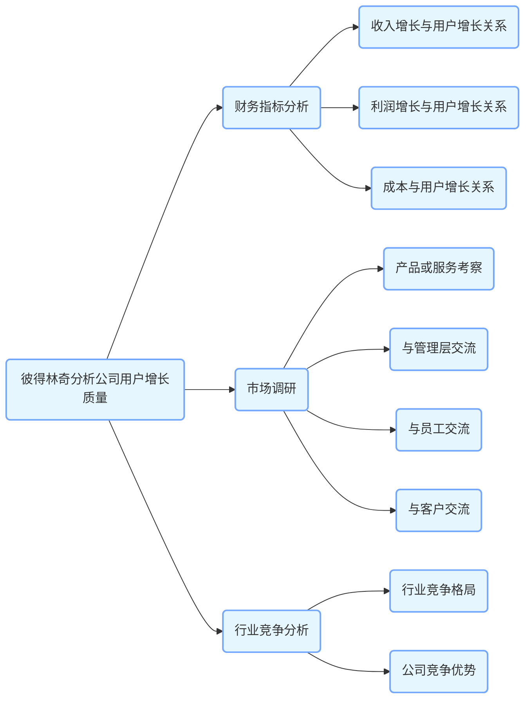

# 彼得林奇如何分析公司的用户增长质量

> 关键词：彼得林奇、公司分析、用户增长质量、财务指标、市场调研

> 摘要：本文深入探讨了投资大师彼得林奇分析公司用户增长质量的方法。通过对彼得林奇投资理念的研究，结合公司用户增长的实际情况，详细阐述了从财务指标、市场调研等多个角度评估用户增长质量的要点。文章旨在为投资者和企业管理者提供有价值的参考，帮助他们更好地理解和分析公司的用户增长态势，做出明智的决策。

## 1. 背景介绍 
### 1.1 目的和范围
彼得林奇是投资领域的传奇人物，他以卓越的投资业绩和独特的投资理念闻名于世。本文章的目的是深入研究彼得林奇分析公司用户增长质量的方法和策略，探讨如何将这些方法应用于实际的投资和企业管理中。范围涵盖了彼得林奇分析公司用户增长质量所涉及的各个方面，包括财务指标分析、市场调研、行业竞争等。

### 1.2 预期读者
本文预期读者包括投资者、企业管理者、金融分析师以及对投资和企业管理感兴趣的人士。对于投资者来说，了解彼得林奇分析公司用户增长质量的方法可以帮助他们筛选出具有投资价值的公司；对于企业管理者来说，这些方法可以作为评估企业用户增长策略有效性的参考；对于金融分析师来说，本文提供了一个全面的分析框架，有助于他们进行更深入的研究和分析。

### 1.3 文档结构概述
本文将按照以下结构进行阐述：首先介绍核心概念与联系，包括彼得林奇的投资理念和公司用户增长质量的相关概念；接着详细讲解核心算法原理和具体操作步骤，通过Python代码示例展示如何进行数据分析；然后介绍数学模型和公式，并结合实际案例进行详细说明；之后通过项目实战，给出代码实际案例和详细解释；再探讨实际应用场景；接着推荐相关的工具和资源；最后总结未来发展趋势与挑战，并提供常见问题与解答以及扩展阅读和参考资料。

### 1.4 术语表
#### 1.4.1 核心术语定义
- **彼得林奇投资理念**：彼得林奇强调通过深入研究公司基本面，寻找具有成长潜力的公司进行投资。他注重实地调研，关注公司的业务模式、竞争力、管理层等因素。
- **用户增长质量**：指公司用户数量增长的可持续性、用户的忠诚度、用户带来的价值等方面的综合表现。高质量的用户增长意味着用户数量的增长是基于公司的核心竞争力和良好的用户体验，能够为公司带来长期稳定的收益。

#### 1.4.2 相关概念解释
- **用户留存率**：指在一定时期内，继续使用公司产品或服务的用户占总用户数的比例。留存率越高，说明用户对产品或服务的满意度越高，公司的用户增长质量越好。
- **用户转化率**：指潜在用户转化为实际用户的比例。转化率高表明公司的营销策略和产品吸引力较强。

#### 1.4.3 缩略词列表
- **ARR**：Annual Recurring Revenue，年度经常性收入，用于衡量公司每年从用户那里获得的稳定收入。
- **CAC**：Customer Acquisition Cost，客户获取成本，指公司为获取一个新客户所花费的平均成本。

## 2. 核心概念与联系 

### 核心概念原理
彼得林奇分析公司用户增长质量的核心原理是从多个维度全面评估公司的用户增长情况。他认为，单纯的用户数量增长并不一定意味着公司具有良好的发展前景，还需要考虑用户增长的质量。具体来说，他关注以下几个方面：

- **财务指标**：通过分析公司的财务报表，了解公司的收入增长、利润增长与用户增长之间的关系。例如，如果公司的用户数量增长迅速，但收入和利润并没有相应增长，可能说明用户增长的质量不高。
- **市场调研**：实地考察公司的产品或服务，与公司的管理层、员工、客户进行交流，了解公司的市场竞争力、用户需求和满意度等情况。
- **行业竞争**：分析公司所处行业的竞争格局，了解公司在行业中的地位和竞争优势。如果公司能够在激烈的竞争中实现用户增长，说明其用户增长质量较高。

### 架构的文本示意图
```plaintext
彼得林奇分析公司用户增长质量
|-- 财务指标分析
|   |-- 收入增长与用户增长关系
|   |-- 利润增长与用户增长关系
|   |-- 成本与用户增长关系
|-- 市场调研
|   |-- 产品或服务考察
|   |-- 与管理层交流
|   |-- 与员工交流
|   |-- 与客户交流
|-- 行业竞争分析
|   |-- 行业竞争格局
|   |-- 公司竞争优势
```

### Mermaid 流程图


## 3. 核心算法原理 & 具体操作步骤 

### 核心算法原理
在分析公司用户增长质量时，我们可以通过计算一些关键指标来评估用户增长的质量。以下是一些常用的指标及其计算方法：

- **用户留存率**：
    - 计算公式：$用户留存率 = \frac{期末留存用户数}{期初用户数} \times 100\%$
    - 原理：留存率反映了用户对产品或服务的持续使用意愿，留存率越高，说明用户增长的质量越好。

- **用户转化率**：
    - 计算公式：$用户转化率 = \frac{转化用户数}{潜在用户数} \times 100\%$
    - 原理：转化率衡量了公司将潜在用户转化为实际用户的能力，转化率越高，说明公司的营销策略和产品吸引力越强。

- **客户获取成本（CAC）与客户生命周期价值（CLV）之比**：
    - 计算公式：$\frac{CAC}{CLV}$
    - 原理：CAC 是公司获取一个新客户所花费的成本，CLV 是一个客户在其生命周期内为公司带来的总价值。该比值越低，说明公司的用户增长质量越高，因为公司在获取客户时花费的成本相对较低，而客户带来的价值相对较高。

### 具体操作步骤及 Python 代码示例
以下是一个使用 Python 计算上述指标的示例代码：

```python
# 示例数据
initial_users = 1000
end_users = 800
potential_users = 2000
converted_users = 500
cac = 100
clv = 500

# 计算用户留存率
retention_rate = (end_users / initial_users) * 100
print(f"用户留存率: {retention_rate}%")

# 计算用户转化率
conversion_rate = (converted_users / potential_users) * 100
print(f"用户转化率: {conversion_rate}%")

# 计算 CAC 与 CLV 之比
cac_clv_ratio = cac / clv
print(f"CAC 与 CLV 之比: {cac_clv_ratio}")
```

在上述代码中，我们首先定义了一些示例数据，包括期初用户数、期末用户数、潜在用户数、转化用户数、客户获取成本和客户生命周期价值。然后，我们根据上述公式计算了用户留存率、用户转化率和 CAC 与 CLV 之比，并将结果打印输出。

## 4. 数学模型和公式 & 详细讲解 & 举例说明 

### 数学模型和公式
- **用户留存率**：
    - 公式：$R = \frac{U_{end}}{U_{start}} \times 100\%$
    - 其中，$R$ 表示用户留存率，$U_{end}$ 表示期末留存用户数，$U_{start}$ 表示期初用户数。

- **用户转化率**：
    - 公式：$C = \frac{U_{convert}}{U_{potential}} \times 100\%$
    - 其中，$C$ 表示用户转化率，$U_{convert}$ 表示转化用户数，$U_{potential}$ 表示潜在用户数。

- **客户获取成本（CAC）与客户生命周期价值（CLV）之比**：
    - 公式：$\frac{CAC}{CLV}$
    - 其中，$CAC$ 表示客户获取成本，$CLV$ 表示客户生命周期价值。

### 详细讲解
- **用户留存率**：留存率是衡量用户忠诚度和产品粘性的重要指标。高留存率意味着用户对产品或服务满意，愿意持续使用。例如，一家在线游戏公司在月初有 1000 名用户，月末仍有 800 名用户在使用该游戏，则该游戏的用户留存率为 $\frac{800}{1000} \times 100\% = 80\%$。这表明该游戏具有较高的用户粘性，用户增长质量较好。

- **用户转化率**：转化率反映了公司的营销策略和产品吸引力。高转化率说明公司能够有效地将潜在用户转化为实际用户。例如，一家电商公司在一次促销活动中，有 2000 名潜在用户访问了其网站，其中 500 名用户下单购买了商品，则该促销活动的用户转化率为 $\frac{500}{2000} \times 100\% = 25\%$。这表明该电商公司的促销活动具有一定的吸引力，但仍有提升空间。

- **客户获取成本（CAC）与客户生命周期价值（CLV）之比**：该比值用于评估公司获取客户的效率和客户的价值。如果 $\frac{CAC}{CLV} < 1$，说明公司获取客户的成本低于客户在其生命周期内为公司带来的价值，公司的用户增长是盈利的；反之，如果 $\frac{CAC}{CLV} > 1$，则说明公司获取客户的成本过高，用户增长可能不具有可持续性。例如，一家软件公司为获取一个新客户花费了 100 元，而该客户在其生命周期内为公司带来的总价值为 500 元，则 $\frac{CAC}{CLV} = \frac{100}{500} = 0.2$，说明该公司的用户增长质量较高。

### 举例说明
假设我们有一家在线教育公司，以下是该公司在某一时期的相关数据：

| 指标 | 数值 |
| ---- | ---- |
| 期初用户数 | 5000 |
| 期末留存用户数 | 4000 |
| 潜在用户数 | 10000 |
| 转化用户数 | 2000 |
| 客户获取成本 | 200 |
| 客户生命周期价值 | 1000 |

根据上述公式，我们可以计算出该公司的相关指标：

- 用户留存率：$R = \frac{4000}{5000} \times 100\% = 80\%$
- 用户转化率：$C = \frac{2000}{10000} \times 100\% = 20\%$
- CAC 与 CLV 之比：$\frac{CAC}{CLV} = \frac{200}{1000} = 0.2$

从这些指标可以看出，该公司的用户留存率较高，说明用户对其在线教育产品比较满意，愿意持续使用；用户转化率为 20%，有一定的提升空间；CAC 与 CLV 之比小于 1，说明公司获取客户的成本相对较低，用户增长具有较好的盈利性。

## 5. 项目实战：代码实际案例和详细解释说明 

### 5.1 开发环境搭建
在进行项目实战之前，我们需要搭建一个合适的开发环境。以下是具体步骤：

1. **安装 Python**：从 Python 官方网站（https://www.python.org/downloads/）下载并安装 Python 3.x 版本。
2. **安装必要的库**：我们将使用 `pandas` 库进行数据处理，`matplotlib` 库进行数据可视化。可以使用以下命令进行安装：
```sh
pip install pandas matplotlib
```

### 5.2 源代码详细实现和代码解读
假设我们有一个包含公司用户数据的 CSV 文件 `user_data.csv`，文件内容如下：

| 日期 | 期初用户数 | 期末留存用户数 | 潜在用户数 | 转化用户数 | 客户获取成本 | 客户生命周期价值 |
| ---- | ---- | ---- | ---- | ---- | ---- | ---- |
| 2023-01-01 | 1000 | 800 | 2000 | 500 | 100 | 500 |
| 2023-02-01 | 1200 | 900 | 2500 | 600 | 120 | 600 |
| 2023-03-01 | 1500 | 1100 | 3000 | 700 | 150 | 700 |

以下是使用 Python 读取该文件并计算相关指标的代码：

```python
import pandas as pd
import matplotlib.pyplot as plt

# 读取数据
data = pd.read_csv('user_data.csv')

# 计算用户留存率
data['用户留存率'] = (data['期末留存用户数'] / data['期初用户数']) * 100

# 计算用户转化率
data['用户转化率'] = (data['转化用户数'] / data['潜在用户数']) * 100

# 计算 CAC 与 CLV 之比
data['CAC 与 CLV 之比'] = data['客户获取成本'] / data['客户生命周期价值']

# 打印计算结果
print(data[['日期', '用户留存率', '用户转化率', 'CAC 与 CLV 之比']])

# 绘制用户留存率和用户转化率的折线图
plt.figure(figsize=(10, 6))
plt.plot(data['日期'], data['用户留存率'], label='用户留存率')
plt.plot(data['日期'], data['用户转化率'], label='用户转化率')
plt.xlabel('日期')
plt.ylabel('百分比')
plt.title('用户留存率和用户转化率变化趋势')
plt.legend()
plt.show()
```

### 代码解读与分析
1. **导入必要的库**：`pandas` 用于数据处理，`matplotlib` 用于数据可视化。
2. **读取数据**：使用 `pd.read_csv` 函数读取 `user_data.csv` 文件，并将数据存储在 `data` 变量中。
3. **计算指标**：根据前面介绍的公式，分别计算用户留存率、用户转化率和 CAC 与 CLV 之比，并将结果添加到 `data` 数据框中。
4. **打印计算结果**：使用 `print` 函数打印出包含日期、用户留存率、用户转化率和 CAC 与 CLV 之比的数据。
5. **绘制折线图**：使用 `plt.plot` 函数绘制用户留存率和用户转化率随日期变化的折线图，以便直观地观察其变化趋势。

通过分析这些指标和可视化结果，我们可以了解公司用户增长质量的变化情况，为公司的决策提供依据。

## 6. 实际应用场景 
### 投资决策
投资者在选择投资标的时，可以运用彼得林奇分析公司用户增长质量的方法来评估公司的价值。通过分析公司的用户留存率、转化率、CAC 与 CLV 之比等指标，投资者可以判断公司的用户增长是否具有可持续性和盈利性。例如，如果一家公司的用户留存率高、转化率不断提升且 CAC 与 CLV 之比小于 1，那么该公司可能具有较好的投资价值。

### 企业战略制定
企业管理者可以利用这些方法来评估公司的用户增长策略是否有效。如果发现用户留存率较低，企业可以分析原因并采取措施提高用户满意度，如改进产品质量、优化服务等；如果用户转化率不高，企业可以调整营销策略，提高产品的吸引力。通过不断优化用户增长策略，企业可以提高用户增长质量，实现可持续发展。

### 市场竞争分析
在激烈的市场竞争中，企业可以通过分析竞争对手的用户增长质量来了解其竞争优势和劣势。如果竞争对手的用户留存率较高，企业可以学习其成功经验，改进自身的产品和服务；如果竞争对手的 CAC 与 CLV 之比过高，企业可以在获取客户方面寻找更有效的方法，降低成本，提高竞争力。

## 7. 工具和资源推荐
### 7.1 学习资源推荐
#### 7.1.1 书籍推荐
- 《彼得林奇的成功投资》：彼得林奇的经典著作，详细介绍了他的投资理念和方法，包括如何分析公司的基本面和寻找具有成长潜力的公司。
- 《战胜华尔街》：进一步阐述了彼得林奇的投资策略，通过实际案例展示了他如何在不同的市场环境中做出投资决策。

#### 7.1.2 在线课程
- Coursera 上的“投资学原理”课程：涵盖了投资的基本概念、分析方法和策略，有助于深入理解投资领域的知识。
- Udemy 上的“财务分析与估值”课程：教授如何进行财务报表分析和公司估值，对分析公司用户增长质量有很大帮助。

#### 7.1.3 技术博客和网站
- Seeking Alpha：提供大量的投资分析文章和研究报告，包括对公司基本面和用户增长情况的分析。
- Bloomberg：全球知名的财经媒体，提供及时的市场信息和公司动态，有助于了解行业趋势和公司竞争格局。

### 7.2 开发工具框架推荐
#### 7.2.1 IDE和编辑器
- PyCharm：功能强大的 Python 集成开发环境，提供代码编辑、调试、版本控制等功能，适合进行数据分析和项目开发。
- Jupyter Notebook：交互式的开发环境，支持 Python 代码的编写、运行和可视化，非常适合进行数据探索和分析。

#### 7.2.2 调试和性能分析工具
- PDB：Python 内置的调试器，可以帮助开发者定位代码中的问题。
- cProfile：Python 标准库中的性能分析工具，可以分析代码的运行时间和函数调用情况，帮助优化代码性能。

#### 7.2.3 相关框架和库
- Pandas：用于数据处理和分析的 Python 库，提供了丰富的数据结构和函数，方便进行数据清洗、转换和计算。
- Matplotlib：用于数据可视化的 Python 库，可以绘制各种类型的图表，如折线图、柱状图、散点图等。

### 7.3 相关论文著作推荐
#### 7.3.1 经典论文
- 《The Long - Term Performance of Initial Public Offerings》：研究了首次公开发行股票的长期表现，对分析公司的成长潜力和投资价值有一定的参考意义。
- 《Do Stock Prices Fully Reflect Information in Accruals and Cash Flows about Future Earnings?》：探讨了财务报表中应计项目和现金流对未来盈利的预测作用，有助于理解如何通过财务指标分析公司的用户增长质量。

#### 7.3.2 最新研究成果
- 可以关注顶级金融期刊，如《Journal of Finance》、《Review of Financial Studies》等，获取关于公司增长、用户行为和投资策略的最新研究成果。

#### 7.3.3 应用案例分析
- 一些咨询公司和研究机构会发布关于公司用户增长和市场竞争的案例分析报告，可以通过这些报告了解实际企业在用户增长质量分析方面的实践经验。

## 8. 总结：未来发展趋势与挑战
### 未来发展趋势
- **数据驱动的决策**：随着大数据和人工智能技术的发展，未来在分析公司用户增长质量时，将更多地依赖数据驱动的方法。通过收集和分析大量的用户数据，可以更准确地评估用户增长的质量，为投资和企业决策提供更有力的支持。
- **跨行业融合**：不同行业之间的界限越来越模糊，用户增长质量的分析也将更加注重跨行业的影响。例如，科技公司可能会进入金融、医疗等领域，在分析这些公司的用户增长质量时，需要考虑不同行业的特点和竞争格局。
- **用户体验的重要性提升**：未来用户对产品和服务的体验要求将越来越高，用户增长质量将更多地取决于用户体验的好坏。因此，企业需要更加注重提升用户体验，以提高用户留存率和转化率。

### 挑战
- **数据质量和安全问题**：在数据驱动的时代，数据质量和安全是关键挑战。如果数据不准确或存在安全漏洞，将影响分析结果的可靠性和企业的决策。因此，需要加强数据质量管理和安全保障。
- **快速变化的市场环境**：市场环境变化迅速，新的商业模式和竞争对手不断涌现。这使得分析公司用户增长质量变得更加困难，需要不断更新分析方法和模型，以适应市场的变化。
- **隐私法规的限制**：随着隐私法规的不断完善，企业在收集和使用用户数据时受到更多的限制。这可能会影响到数据的获取和分析，需要企业在遵守法规的前提下，寻找有效的数据收集和分析方法。

## 9. 附录：常见问题与解答
### 问题 1：如何准确计算客户生命周期价值（CLV）？
解答：计算 CLV 可以使用多种方法，常见的有历史价值法和预测价值法。历史价值法是根据客户过去的购买行为和消费金额来计算其生命周期价值；预测价值法是通过建立数学模型，预测客户未来的购买行为和消费金额。具体计算时，需要考虑客户的购买频率、平均购买金额、客户留存率等因素。

### 问题 2：用户留存率和用户转化率哪个更重要？
解答：两者都很重要，且相互关联。用户留存率反映了用户对产品或服务的忠诚度和满意度，高留存率意味着公司能够留住现有用户，为公司带来稳定的收入；用户转化率反映了公司将潜在用户转化为实际用户的能力，高转化率有助于扩大用户群体。在不同的发展阶段，公司可能会更侧重于其中一个指标。例如，在创业初期，公司可能更关注用户转化率，以快速扩大用户规模；在成熟阶段，公司可能更注重用户留存率，以提高用户的长期价值。

### 问题 3：彼得林奇的分析方法是否适用于所有行业？
解答：彼得林奇的分析方法具有一定的通用性，但不同行业具有不同的特点和规律。在应用这些方法时，需要结合行业的具体情况进行调整。例如，在互联网行业，用户增长速度通常较快，数据更新也更频繁，需要更及时地分析和评估用户增长质量；而在传统制造业，用户增长可能相对缓慢，更注重产品质量和客户关系管理。因此，在分析不同行业的公司时，需要考虑行业的特殊性。

## 10. 扩展阅读 & 参考资料
### 扩展阅读
- 《聪明的投资者》：本杰明·格雷厄姆的经典著作，介绍了价值投资的理念和方法，对理解投资分析有很大帮助。
- 《财务报表分析与证券定价》：深入讲解了如何通过财务报表分析来评估公司的价值，为分析公司用户增长质量提供了重要的财务视角。

### 参考资料
- 彼得林奇的相关演讲和访谈记录，可通过网络搜索获取。
- 金融数据库，如 Bloomberg Terminal、Wind 等，提供了丰富的公司财务数据和市场信息。