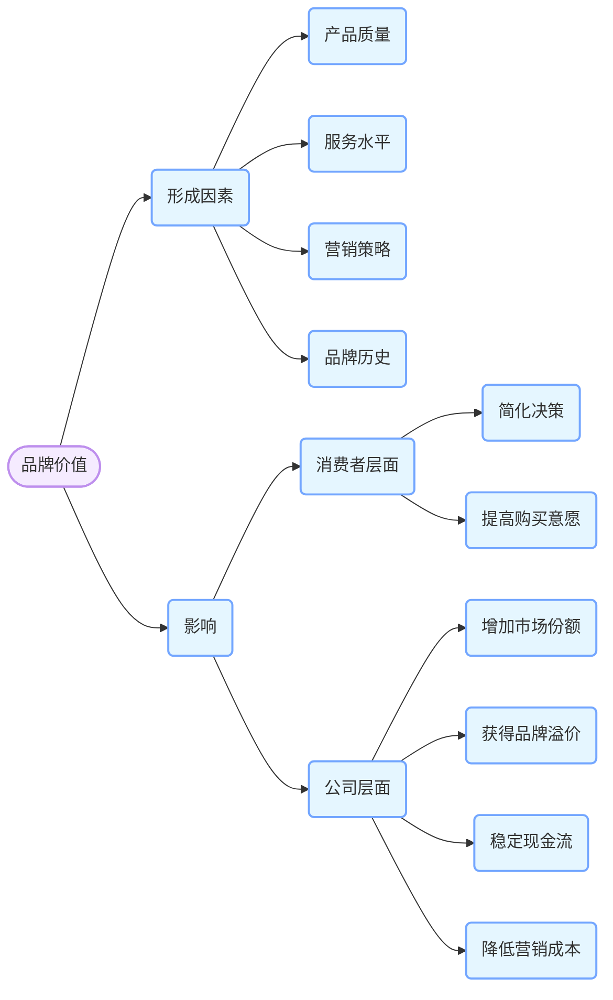

# 彼得林奇如何看待公司的品牌价值

> 关键词：彼得林奇、公司品牌价值、投资分析、消费洞察、品牌优势

> 摘要：本文深入探讨了投资大师彼得林奇对公司品牌价值的看法。从彼得林奇的投资理念出发，阐述品牌价值在公司经营和投资中的重要性。详细分析品牌价值的核心概念及其形成机制，介绍彼得林奇评估品牌价值的核心算法和具体操作步骤，通过数学模型和公式进一步阐释品牌价值对公司财务的影响。结合项目实战案例，说明如何在实际投资中运用对品牌价值的分析。探讨品牌价值在不同行业的实际应用场景，推荐相关的学习资源、开发工具和研究论文。最后总结品牌价值分析在未来投资领域的发展趋势与挑战，并提供常见问题解答和扩展阅读参考资料，帮助投资者更好地理解和运用彼得林奇关于公司品牌价值的观点进行投资决策。

## 1. 背景介绍 
### 1.1 目的和范围
彼得林奇作为投资界的传奇人物，他的投资理念和方法一直备受关注。本文章的目的在于深入剖析彼得林奇对公司品牌价值的看法，探究品牌价值在他的投资决策体系中所占据的重要地位。范围涵盖彼得林奇评估品牌价值的方法、品牌价值对公司经营和投资的影响，以及如何在实际投资中运用这些观点。通过对相关理论和实际案例的分析，为投资者提供全面且深入的理解。

### 1.2 预期读者
本文预期读者包括对投资领域感兴趣的个人投资者、金融从业者、研究投资理论的学者以及关注公司经营和市场价值的商业人士。无论您是初涉投资领域的新手，还是经验丰富的专业投资者，都能从本文中获取关于彼得林奇品牌价值观点的有价值信息，并应用于实际的投资分析和决策中。

### 1.3 文档结构概述
本文将按照以下结构展开：首先介绍核心概念，明确品牌价值的定义和形成机制；接着阐述彼得林奇评估品牌价值的核心算法原理和具体操作步骤，并通过数学模型和公式进行详细讲解；然后通过项目实战案例，展示如何在实际投资中分析公司的品牌价值；探讨品牌价值在不同行业的实际应用场景；推荐相关的学习资源、开发工具和研究论文；最后总结品牌价值分析的未来发展趋势与挑战，提供常见问题解答和扩展阅读参考资料。

### 1.4 术语表
#### 1.4.1 核心术语定义
- **品牌价值**：指品牌在消费者心中所具有的价值，它反映了品牌的知名度、美誉度、忠诚度以及消费者对品牌的认知和情感。品牌价值不仅仅是品牌的市场价格，更是品牌在长期经营过程中积累的无形资产。
- **品牌忠诚度**：消费者对某个品牌的重复购买意愿和行为，表现为消费者在一段时间内持续选择该品牌的产品或服务，而不轻易转向其他竞争品牌。
- **品牌溢价**：消费者愿意为某个品牌支付的价格高于同类产品或服务的价格部分，它是品牌价值的一种体现。

#### 1.4.2 相关概念解释
- **无形资产**：企业拥有或控制的没有实物形态的可辨认非货币性资产，品牌价值属于无形资产的范畴。无形资产虽然不具有实物形态，但对企业的经营和发展具有重要的影响。
- **市场份额**：指企业的产品或服务在市场总需求中所占的比例，品牌价值较高的企业往往能够获得较高的市场份额。

#### 1.4.3 缩略词列表
无

## 2. 核心概念与联系 
### 核心概念原理
彼得林奇认为，公司的品牌价值是一种强大的竞争优势。品牌代表着消费者对公司产品或服务的信任和认可。一个具有良好品牌形象的公司，能够吸引更多的消费者，提高市场份额，并且可以获得品牌溢价。品牌价值的形成是一个长期的过程，它与公司的产品质量、服务水平、营销策略等因素密切相关。

从消费者的角度来看，品牌是一种简化决策的工具。在面对众多选择时，消费者往往会选择他们熟悉和信任的品牌。例如，当消费者购买饮料时，可口可乐和百事可乐这样的知名品牌会更容易进入他们的考虑范围。这是因为这些品牌在消费者心中已经建立了良好的形象，消费者相信它们的产品质量和口感。

从公司的角度来看，品牌价值可以带来更高的利润和更稳定的现金流。具有高品牌价值的公司可以通过提高产品价格来获得品牌溢价，从而增加销售收入。同时，品牌忠诚度也可以减少公司的营销成本，因为忠诚的消费者会主动传播品牌，为公司带来新的客户。

### 架构的文本示意图
```plaintext
品牌价值
|
|-- 形成因素
|   |-- 产品质量
|   |-- 服务水平
|   |-- 营销策略
|   |-- 品牌历史
|
|-- 影响
|   |-- 消费者层面
|   |   |-- 简化决策
|   |   |-- 提高购买意愿
|   |
|   |-- 公司层面
|       |-- 增加市场份额
|       |-- 获得品牌溢价
|       |-- 稳定现金流
|       |-- 降低营销成本
```

### Mermaid 流程图


## 3. 核心算法原理 & 具体操作步骤 
### 核心算法原理
彼得林奇并没有明确提出一个具体的、量化的品牌价值评估算法，但我们可以根据他的投资理念和对品牌价值的重视，构建一个基于财务指标和市场指标的评估方法。

品牌价值可以通过公司的盈利能力和市场表现来间接衡量。我们可以使用以下公式来初步估算品牌价值：

品牌价值 = 品牌溢价收益 + 品牌忠诚度带来的额外收益

品牌溢价收益可以通过以下方式计算：

品牌溢价收益 = （品牌产品实际售价 - 同类无品牌产品平均售价）× 品牌产品销售量

品牌忠诚度带来的额外收益可以通过比较品牌产品的重复购买率和市场平均重复购买率来估算：

品牌忠诚度带来的额外收益 = （品牌产品重复购买率 - 市场平均重复购买率）× 品牌产品总销售额

### 具体操作步骤
#### 步骤 1：收集数据
- 收集品牌产品的实际售价、销售量、重复购买率等数据。
- 收集同类无品牌产品的平均售价和市场平均重复购买率数据。这些数据可以通过市场调研、行业报告、公司财务报表等渠道获取。

#### 步骤 2：计算品牌溢价收益
根据上述公式，计算品牌溢价收益。例如，某品牌运动鞋的实际售价为 500 元，同类无品牌运动鞋的平均售价为 300 元，该品牌运动鞋的销售量为 10 万双。则品牌溢价收益为：

$(500 - 300)×100000 = 20000000$（元）

#### 步骤 3：计算品牌忠诚度带来的额外收益
假设该品牌运动鞋的重复购买率为 60%，市场平均重复购买率为 40%，品牌产品总销售额为 5000 万元。则品牌忠诚度带来的额外收益为：

$(0.6 - 0.4)×50000000 = 10000000$（元）

#### 步骤 4：计算品牌价值
将品牌溢价收益和品牌忠诚度带来的额外收益相加，得到品牌价值：

$20000000 + 10000000 = 30000000$（元）

### Python 源代码实现
```python
# 定义品牌产品相关数据
brand_product_price = 500
non_brand_product_avg_price = 300
brand_product_sales_volume = 100000
brand_product_repeat_purchase_rate = 0.6
market_avg_repeat_purchase_rate = 0.4
brand_product_total_sales = 50000000

# 计算品牌溢价收益
brand_premium_income = (brand_product_price - non_brand_product_avg_price) * brand_product_sales_volume

# 计算品牌忠诚度带来的额外收益
brand_loyalty_extra_income = (brand_product_repeat_purchase_rate - market_avg_repeat_purchase_rate) * brand_product_total_sales

# 计算品牌价值
brand_value = brand_premium_income + brand_loyalty_extra_income

print(f"品牌溢价收益: {brand_premium_income} 元")
print(f"品牌忠诚度带来的额外收益: {brand_loyalty_extra_income} 元")
print(f"品牌价值: {brand_value} 元")
```

## 4. 数学模型和公式 & 详细讲解 & 举例说明 
### 数学模型和公式
#### 品牌价值公式
品牌价值（$V$）可以表示为：

$$V = P + L$$

其中，$P$ 表示品牌溢价收益，$L$ 表示品牌忠诚度带来的额外收益。

#### 品牌溢价收益公式
品牌溢价收益（$P$）的计算公式为：

$$P = (p_b - p_{nb})×q_b$$

其中，$p_b$ 表示品牌产品实际售价，$p_{nb}$ 表示同类无品牌产品平均售价，$q_b$ 表示品牌产品销售量。

#### 品牌忠诚度带来的额外收益公式
品牌忠诚度带来的额外收益（$L$）的计算公式为：

$$L = (r_b - r_m)×S_b$$

其中，$r_b$ 表示品牌产品重复购买率，$r_m$ 表示市场平均重复购买率，$S_b$ 表示品牌产品总销售额。

### 详细讲解
- **品牌价值公式**：品牌价值是由品牌溢价收益和品牌忠诚度带来的额外收益两部分组成。品牌溢价收益反映了消费者愿意为品牌支付的额外价格所带来的收益，而品牌忠诚度带来的额外收益则体现了品牌在消费者心中的地位和影响力，使得消费者更愿意重复购买该品牌的产品。
- **品牌溢价收益公式**：品牌溢价收益的计算基于品牌产品和无品牌产品的价格差异以及品牌产品的销售量。价格差异越大，销售量越高，品牌溢价收益就越高。
- **品牌忠诚度带来的额外收益公式**：该公式通过比较品牌产品的重复购买率和市场平均重复购买率，以及品牌产品的总销售额来计算额外收益。重复购买率越高，总销售额越大，品牌忠诚度带来的额外收益就越高。

### 举例说明
假设一家化妆品公司的品牌口红实际售价为 200 元，同类无品牌口红的平均售价为 100 元，该品牌口红的销售量为 5 万支。品牌口红的重复购买率为 50%，市场平均重复购买率为 30%，品牌口红的总销售额为 1000 万元。

#### 计算品牌溢价收益
根据品牌溢价收益公式：

$$P = (200 - 100)×50000 = 5000000$$（元）

#### 计算品牌忠诚度带来的额外收益
根据品牌忠诚度带来的额外收益公式：

$$L = (0.5 - 0.3)×10000000 = 2000000$$（元）

#### 计算品牌价值
根据品牌价值公式：

$$V = 5000000 + 2000000 = 7000000$$（元）

因此，该化妆品公司品牌口红的品牌价值为 700 万元。

## 5. 项目实战：代码实际案例和详细解释说明 
### 5.1 开发环境搭建
#### 操作系统
可以选择 Windows、Mac OS 或 Linux 操作系统。这里以 Windows 10 为例进行说明。

#### Python 安装
从 Python 官方网站（https://www.python.org/downloads/）下载并安装 Python 3.x 版本。安装过程中选择“Add Python to PATH”选项，以便在命令行中可以直接使用 Python 命令。

#### 开发工具
可以使用 PyCharm、VS Code 等集成开发环境（IDE）。这里以 VS Code 为例，下载并安装 VS Code 后，在扩展市场中安装 Python 扩展，以支持 Python 代码的编写和调试。

### 5.2 源代码详细实现和代码解读
```python
# 定义函数来计算品牌溢价收益
def calculate_brand_premium_income(brand_product_price, non_brand_product_avg_price, brand_product_sales_volume):
    """
    计算品牌溢价收益
    :param brand_product_price: 品牌产品实际售价
    :param non_brand_product_avg_price: 同类无品牌产品平均售价
    :param brand_product_sales_volume: 品牌产品销售量
    :return: 品牌溢价收益
    """
    return (brand_product_price - non_brand_product_avg_price) * brand_product_sales_volume

# 定义函数来计算品牌忠诚度带来的额外收益
def calculate_brand_loyalty_extra_income(brand_product_repeat_purchase_rate, market_avg_repeat_purchase_rate, brand_product_total_sales):
    """
    计算品牌忠诚度带来的额外收益
    :param brand_product_repeat_purchase_rate: 品牌产品重复购买率
    :param market_avg_repeat_purchase_rate: 市场平均重复购买率
    :param brand_product_total_sales: 品牌产品总销售额
    :return: 品牌忠诚度带来的额外收益
    """
    return (brand_product_repeat_purchase_rate - market_avg_repeat_purchase_rate) * brand_product_total_sales

# 定义函数来计算品牌价值
def calculate_brand_value(brand_premium_income, brand_loyalty_extra_income):
    """
    计算品牌价值
    :param brand_premium_income: 品牌溢价收益
    :param brand_loyalty_extra_income: 品牌忠诚度带来的额外收益
    :return: 品牌价值
    """
    return brand_premium_income + brand_loyalty_extra_income

# 主程序
if __name__ == "__main__":
    # 输入品牌产品相关数据
    brand_product_price = float(input("请输入品牌产品实际售价: "))
    non_brand_product_avg_price = float(input("请输入同类无品牌产品平均售价: "))
    brand_product_sales_volume = int(input("请输入品牌产品销售量: "))
    brand_product_repeat_purchase_rate = float(input("请输入品牌产品重复购买率（小数形式）: "))
    market_avg_repeat_purchase_rate = float(input("请输入市场平均重复购买率（小数形式）: "))
    brand_product_total_sales = float(input("请输入品牌产品总销售额: "))

    # 计算品牌溢价收益
    brand_premium_income = calculate_brand_premium_income(brand_product_price, non_brand_product_avg_price, brand_product_sales_volume)

    # 计算品牌忠诚度带来的额外收益
    brand_loyalty_extra_income = calculate_brand_loyalty_extra_income(brand_product_repeat_purchase_rate, market_avg_repeat_purchase_rate, brand_product_total_sales)

    # 计算品牌价值
    brand_value = calculate_brand_value(brand_premium_income, brand_loyalty_extra_income)

    # 输出结果
    print(f"品牌溢价收益: {brand_premium_income} 元")
    print(f"品牌忠诚度带来的额外收益: {brand_loyalty_extra_income} 元")
    print(f"品牌价值: {brand_value} 元")
```

### 5.3 代码解读与分析
#### 函数定义
- `calculate_brand_premium_income` 函数：该函数接受品牌产品实际售价、同类无品牌产品平均售价和品牌产品销售量作为参数，根据品牌溢价收益公式计算并返回品牌溢价收益。
- `calculate_brand_loyalty_extra_income` 函数：该函数接受品牌产品重复购买率、市场平均重复购买率和品牌产品总销售额作为参数，根据品牌忠诚度带来的额外收益公式计算并返回额外收益。
- `calculate_brand_value` 函数：该函数接受品牌溢价收益和品牌忠诚度带来的额外收益作为参数，根据品牌价值公式计算并返回品牌价值。

#### 主程序
- 首先，通过 `input` 函数获取用户输入的品牌产品相关数据。
- 然后，调用上述定义的函数分别计算品牌溢价收益、品牌忠诚度带来的额外收益和品牌价值。
- 最后，使用 `print` 函数输出计算结果。

通过这个代码示例，我们可以方便地根据不同的品牌产品数据计算品牌价值，为投资决策提供参考。

## 6. 实际应用场景 
### 消费品行业
在消费品行业，品牌价值尤为重要。例如，可口可乐和百事可乐在饮料市场占据主导地位，它们的品牌价值使得消费者更愿意购买它们的产品，即使价格相对较高。消费者在购买饮料时，往往会选择自己熟悉和信任的品牌，因为他们相信这些品牌的产品质量和口感。此外，品牌忠诚度也使得消费者会持续购买这些品牌的饮料，为公司带来稳定的现金流。

### 奢侈品行业
奢侈品行业高度依赖品牌价值。像路易威登、古驰等奢侈品牌，它们的品牌价值体现在高端的品质、独特的设计和卓越的工艺上。消费者购买奢侈品不仅仅是为了产品本身，更是为了追求品牌所代表的身份和地位。这些品牌可以通过高定价获得巨大的品牌溢价，并且由于品牌忠诚度高，消费者会不断购买其新产品，推动公司的业绩增长。

### 金融行业
在金融行业，品牌价值同样不可忽视。大型银行和金融机构凭借其良好的品牌形象，能够吸引更多的客户存款和投资。消费者更愿意将资金存入信誉良好的银行，因为他们相信这些银行的安全性和稳定性。此外，金融机构的品牌价值也有助于它们开展新的业务，如推出理财产品等，提高市场竞争力。

### 科技行业
科技行业虽然技术更新换代快，但品牌价值仍然起着重要作用。苹果公司凭借其强大的品牌价值，在智能手机、电脑等领域占据领先地位。消费者对苹果品牌的信任使得他们愿意为苹果产品支付更高的价格，即使市场上有其他性价比更高的产品。苹果品牌的忠诚度也很高，消费者会在新产品推出时积极购买，推动公司的持续发展。

## 7. 工具和资源推荐
### 7.1 学习资源推荐
#### 7.1.1 书籍推荐
- 《彼得林奇的成功投资》：这是彼得林奇的经典著作，详细介绍了他的投资理念和方法，其中包括对公司品牌价值的分析和重视。
- 《品牌洗脑》：深入探讨了品牌在消费者心中的影响力和品牌价值的形成机制，有助于读者更好地理解品牌价值的本质。
- 《定位》：阐述了品牌定位的重要性，以及如何通过有效的定位来提升品牌价值。

#### 7.1.2 在线课程
- Coursera 平台上的“品牌管理”课程：由知名大学的教授授课，系统地介绍了品牌管理的理论和实践，包括品牌价值评估等内容。
- Udemy 平台上的“投资分析与决策”课程：其中有关于公司基本面分析的章节，涉及品牌价值在投资决策中的应用。

#### 7.1.3 技术博客和网站
- Seeking Alpha：提供专业的投资分析文章，其中有很多关于公司品牌价值的研究和分析。
- Brand Finance：专注于品牌价值评估和研究，发布全球品牌价值排行榜等重要信息。

### 7.2 开发工具框架推荐
#### 7.2.1 IDE和编辑器
- PyCharm：功能强大的 Python 集成开发环境，提供代码自动补全、调试等功能，适合开发与品牌价值分析相关的 Python 程序。
- VS Code：轻量级的代码编辑器，支持多种编程语言，通过安装 Python 扩展可以方便地进行 Python 开发。

#### 7.2.2 调试和性能分析工具
- Py-Spy：用于分析 Python 程序的性能，找出性能瓶颈，优化品牌价值计算程序的运行效率。
- PDB：Python 自带的调试器，可以帮助开发者调试代码，解决程序中的错误。

#### 7.2.3 相关框架和库
- Pandas：用于数据处理和分析，可以方便地处理品牌产品相关的数据，如价格、销售量等。
- NumPy：提供高效的数值计算功能，在品牌价值计算中可以提高计算速度。

### 7.3 相关论文著作推荐
#### 7.3.1 经典论文
- “The Financial Performance of Branded versus Private Label Consumer Goods”：研究了品牌产品和自有品牌产品在财务绩效上的差异，强调了品牌价值对公司财务的重要影响。
- “Brand Equity: Building, Measuring, and Managing Customer-Based Brand Equity”：提出了基于客户的品牌资产模型，为品牌价值评估提供了理论基础。

#### 7.3.2 最新研究成果
- 关注学术数据库如 Web of Science、EBSCOhost 等，搜索关于品牌价值评估和投资应用的最新研究论文，了解该领域的前沿动态。

#### 7.3.3 应用案例分析
- 一些商业咨询公司如麦肯锡、波士顿咨询集团等发布的关于品牌价值在不同行业应用的案例分析报告，具有很高的参考价值。

## 8. 总结：未来发展趋势与挑战
### 未来发展趋势
- **数字化品牌价值评估**：随着大数据和人工智能技术的发展，未来品牌价值评估将更加数字化和精准化。通过分析海量的消费者数据、市场数据等，可以更准确地评估品牌的知名度、美誉度和忠诚度，从而更精确地计算品牌价值。
- **品牌价值与可持续发展的结合**：消费者越来越关注企业的社会责任和可持续发展，具有良好可持续发展形象的品牌将获得更高的品牌价值。未来，品牌价值评估将更多地考虑企业在环境保护、社会公益等方面的表现。
- **品牌价值在新兴行业的重要性提升**：随着新兴行业如人工智能、区块链等的发展，品牌价值在这些行业中的重要性将逐渐提升。在竞争激烈的新兴市场中，具有强大品牌影响力的企业将更容易获得市场份额和客户信任。

### 挑战
- **数据获取和准确性**：品牌价值评估需要大量的市场数据、消费者数据等，但这些数据的获取和准确性存在一定的挑战。数据的不完整或不准确可能导致品牌价值评估结果的偏差。
- **品牌价值的动态变化**：品牌价值不是一成不变的，它会随着市场环境、消费者需求等因素的变化而变化。如何及时捕捉品牌价值的动态变化，并进行准确的评估和调整，是一个挑战。
- **跨文化品牌价值评估**：在全球化的背景下，企业的品牌往往面临着跨文化的市场环境。不同文化背景下消费者对品牌的认知和需求存在差异，如何进行跨文化的品牌价值评估是一个需要解决的问题。

## 9. 附录：常见问题与解答
### 问题 1：品牌价值评估的结果是否准确？
品牌价值评估是一个复杂的过程，受到多种因素的影响，因此评估结果只能是一个近似值。虽然我们可以通过科学的方法和合理的模型进行评估，但由于数据的局限性和市场的不确定性，评估结果可能存在一定的误差。

### 问题 2：品牌价值高的公司一定值得投资吗？
品牌价值高是公司的一个重要优势，但并不是投资的唯一依据。投资决策还需要考虑公司的财务状况、行业前景、管理团队等多个因素。品牌价值高的公司也可能面临市场竞争、技术变革等风险，因此需要综合分析后再做出投资决策。

### 问题 3：如何提高公司的品牌价值？
提高公司的品牌价值可以从以下几个方面入手：
- 提高产品质量和服务水平，满足消费者的需求和期望。
- 加强品牌营销和宣传，提高品牌的知名度和美誉度。
- 建立良好的品牌形象，增强消费者对品牌的信任和忠诚度。
- 关注消费者反馈，不断改进和创新品牌。

### 问题 4：品牌价值评估的方法有哪些？
除了本文介绍的基于财务指标和市场指标的评估方法外，还有其他一些常见的品牌价值评估方法，如成本法、市场法、收益法等。成本法是根据品牌的创建和维护成本来评估品牌价值；市场法是通过比较类似品牌的市场交易价格来评估品牌价值；收益法是根据品牌未来的预期收益来评估品牌价值。

## 10. 扩展阅读 & 参考资料
### 扩展阅读
- 《巴菲特致股东的信》：虽然主要讲述巴菲特的投资理念，但其中关于公司内在价值的分析与品牌价值有一定的关联，可以进一步拓展对公司价值评估的理解。
- 《创新者的窘境》：探讨了企业在面对技术创新和市场变革时的挑战和机遇，有助于理解品牌价值在不同市场环境下的变化。

### 参考资料
- 彼得林奇. 《彼得林奇的成功投资》. 机械工业出版社.
- 凯文·莱恩·凯勒. 《战略品牌管理》. 中国人民大学出版社.
- 大卫·阿克. 《管理品牌资产》. 机械工业出版社.
- 相关行业报告和研究论文，如 Euromonitor International 的行业报告、学术数据库中的品牌价值研究论文等。