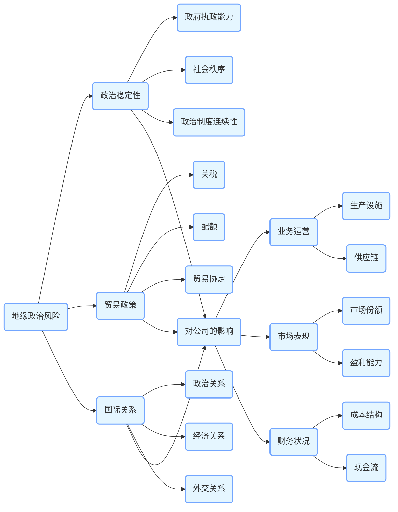

# 彼得林奇如何看待公司的地缘政治风险

> 关键词：彼得林奇、公司、地缘政治风险、投资分析、风险评估

> 摘要：本文围绕彼得林奇对公司地缘政治风险的看法展开深入探讨。首先介绍背景信息，包括目的、预期读者等。接着阐述核心概念，如地缘政治风险的定义及与公司运营的联系，并给出相应的示意图和流程图。然后分析彼得林奇评估地缘政治风险的核心算法原理和具体操作步骤，用 Python 代码详细阐述。讲解相关数学模型和公式并举例说明。通过项目实战，展示代码实际案例并进行详细解释。探讨地缘政治风险在不同场景下对公司的实际影响，推荐学习和开发相关的工具和资源，包括书籍、在线课程等。最后总结未来地缘政治风险的发展趋势与挑战，解答常见问题并提供扩展阅读和参考资料，帮助读者全面理解彼得林奇对公司地缘政治风险的独特见解。

## 1. 背景介绍 
### 1.1 目的和范围
本文旨在深入剖析彼得林奇对于公司地缘政治风险的观点和评估方法。彼得林奇作为投资界的传奇人物，其投资理念和对各种风险的认知对投资者有着深远的影响。我们将探讨他如何看待地缘政治风险对公司的潜在影响，以及如何将这种风险纳入投资决策的考量中。范围涵盖地缘政治风险的各个方面，包括政治稳定性、贸易政策、国际关系等因素对公司业务、财务状况和市场表现的作用。

### 1.2 预期读者
本文适合对投资领域感兴趣的各类人群，包括专业投资者、投资爱好者、金融专业学生以及企业管理者等。对于希望学习彼得林奇投资思想，了解如何评估公司面临的地缘政治风险的读者来说，本文将提供有价值的参考和指导。

### 1.3 文档结构概述
本文将按照以下结构展开：首先介绍相关核心概念和它们之间的联系，包括地缘政治风险的原理和架构；接着阐述彼得林奇评估地缘政治风险的核心算法原理和具体操作步骤，并给出 Python 代码示例；讲解涉及的数学模型和公式并举例说明；通过项目实战展示实际代码案例和详细解读；分析地缘政治风险在实际中的应用场景；推荐相关的学习和开发工具及资源；总结未来发展趋势与挑战；解答常见问题并提供扩展阅读和参考资料。

### 1.4 术语表
#### 1.4.1 核心术语定义
- **地缘政治风险**：指由于地理位置、政治格局、国际关系等因素导致的政治不稳定、政策变化、贸易冲突等情况，对公司的经营、财务和市场价值产生不利影响的可能性。
- **投资决策**：投资者根据对各种因素的分析和评估，决定是否投资于某一公司或资产的过程。
- **公司业务风险**：公司在日常经营活动中面临的各种不确定性，包括市场竞争、技术变革、管理不善等因素带来的风险。

#### 1.4.2 相关概念解释
- **政治稳定性**：一个国家或地区政治环境的稳定程度，包括政府的执政能力、社会秩序、政治制度的连续性等方面。政治不稳定可能导致政策频繁变动、社会动荡，从而影响公司的正常运营。
- **贸易政策**：政府制定的关于进出口贸易的政策和法规，包括关税、配额、贸易协定等。贸易政策的变化可能影响公司的市场份额、成本结构和盈利能力。
- **国际关系**：不同国家之间的政治、经济、外交等方面的关系。国际关系的紧张或友好可能对公司的海外业务、供应链和市场拓展产生重要影响。

#### 1.4.3 缩略词列表
- GDP：国内生产总值（Gross Domestic Product）
- FDI：外国直接投资（Foreign Direct Investment）

## 2. 核心概念与联系 
### 核心概念原理
地缘政治风险是一个复杂的概念，它涉及到政治、经济、社会等多个领域的因素。从原理上讲，地缘政治风险的产生源于不同国家和地区之间的利益冲突、政治制度差异、资源分配不均等。这些因素相互作用，导致政治不稳定、政策变化和贸易摩擦等情况的发生。

对于公司来说，地缘政治风险可能通过多种途径影响其经营和发展。例如，政治不稳定可能导致公司的生产设施受到破坏、供应链中断；贸易政策的变化可能增加公司的成本、减少市场份额；国际关系的紧张可能导致公司在海外市场面临歧视性待遇等。

### 架构的文本示意图
```plaintext
地缘政治风险
|-- 政治稳定性
|   |-- 政府执政能力
|   |-- 社会秩序
|   |-- 政治制度连续性
|-- 贸易政策
|   |-- 关税
|   |-- 配额
|   |-- 贸易协定
|-- 国际关系
|   |-- 政治关系
|   |-- 经济关系
|   |-- 外交关系
|
|-- 对公司的影响
|   |-- 业务运营
|   |   |-- 生产设施
|   |   |-- 供应链
|   |-- 市场表现
|   |   |-- 市场份额
|   |   |-- 盈利能力
|   |-- 财务状况
|   |   |-- 成本结构
|   |   |-- 现金流
```

### Mermaid 流程图


## 3. 核心算法原理 & 具体操作步骤 
### 核心算法原理
彼得林奇在评估公司的地缘政治风险时，主要采用定性和定量相结合的方法。定性分析主要关注地缘政治风险的各个因素，如政治稳定性、贸易政策、国际关系等，通过对这些因素的评估来判断风险的大小和影响程度。定量分析则主要通过分析公司的财务数据和市场表现，来评估地缘政治风险对公司的实际影响。

具体来说，彼得林奇会考虑以下几个方面：
1. **政治稳定性评估**：通过分析政府的执政能力、社会秩序、政治制度的连续性等因素，评估一个国家或地区的政治稳定性。政治不稳定的地区，公司面临的风险相对较高。
2. **贸易政策分析**：研究关税、配额、贸易协定等贸易政策的变化，分析其对公司的市场份额、成本结构和盈利能力的影响。贸易政策的不利变化可能导致公司的竞争力下降。
3. **国际关系考量**：关注不同国家之间的政治、经济、外交关系，评估国际关系的紧张或友好对公司海外业务、供应链和市场拓展的影响。国际关系紧张可能增加公司的运营风险。
4. **公司财务分析**：通过分析公司的财务报表，如收入、利润、现金流等指标，评估地缘政治风险对公司财务状况的实际影响。财务状况不佳的公司可能更容易受到地缘政治风险的冲击。

### 具体操作步骤
以下是彼得林奇评估公司地缘政治风险的具体操作步骤：
1. **收集信息**：收集有关地缘政治风险的各种信息，包括政治新闻、贸易政策变化、国际关系动态等。同时，收集公司的财务报表、市场数据等信息。
2. **定性评估**：根据收集到的信息，对地缘政治风险的各个因素进行定性评估。评估每个因素的风险等级，如高、中、低。
3. **定量分析**：使用公司的财务数据和市场表现数据，进行定量分析。计算一些关键指标，如毛利率、净利率、现金流比率等，评估地缘政治风险对公司财务状况的影响。
4. **综合评估**：将定性评估和定量分析的结果进行综合，评估公司面临的地缘政治风险的总体水平。根据评估结果，决定是否投资于该公司。

### Python 代码示例
```python
import pandas as pd

# 模拟收集的地缘政治风险信息和公司财务数据
geopolitical_risk_data = {
    '政治稳定性': ['高', '中', '低'],
    '贸易政策风险': ['低', '中', '高'],
    '国际关系风险': ['中', '高', '低']
}

company_financial_data = {
    '公司名称': ['公司A', '公司B', '公司C'],
    '毛利率': [0.3, 0.2, 0.1],
    '净利率': [0.15, 0.1, 0.05],
    '现金流比率': [1.2, 1.0, 0.8]
}

# 创建数据框
geopolitical_df = pd.DataFrame(geopolitical_risk_data)
financial_df = pd.DataFrame(company_financial_data)

# 定义风险等级评分
risk_score = {
    '高': 3,
    '中': 2,
    '低': 1
}

# 对地缘政治风险进行评分
geopolitical_df['政治稳定性评分'] = geopolitical_df['政治稳定性'].map(risk_score)
geopolitical_df['贸易政策风险评分'] = geopolitical_df['贸易政策风险'].map(risk_score)
geopolitical_df['国际关系风险评分'] = geopolitical_df['国际关系风险'].map(risk_score)

# 计算地缘政治风险总评分
geopolitical_df['总评分'] = geopolitical_df[['政治稳定性评分', '贸易政策风险评分', '国际关系风险评分']].sum(axis=1)

# 合并地缘政治风险数据和公司财务数据
merged_df = pd.concat([financial_df, geopolitical_df[['总评分']]], axis=1)

# 根据总评分和财务指标评估公司的投资价值
def evaluate_investment(row):
    if row['总评分'] <= 3 and row['毛利率'] > 0.2 and row['净利率'] > 0.1 and row['现金流比率'] > 1.0:
        return '值得投资'
    else:
        return '谨慎投资'

merged_df['投资建议'] = merged_df.apply(evaluate_investment, axis=1)

print(merged_df)
```

## 4. 数学模型和公式 & 详细讲解 & 举例说明 
### 数学模型
在评估公司的地缘政治风险时，可以使用多因素模型。该模型考虑了地缘政治风险的各个因素，如政治稳定性、贸易政策、国际关系等，并将这些因素的影响量化为风险评分。具体数学模型如下：

$$R = \sum_{i=1}^{n} w_i \times r_i$$

其中，$R$ 表示公司面临的地缘政治风险总评分，$w_i$ 表示第 $i$ 个地缘政治风险因素的权重，$r_i$ 表示第 $i$ 个地缘政治风险因素的评分。

### 详细讲解
- **风险因素评分**：对每个地缘政治风险因素进行评分，如政治稳定性可以分为高、中、低三个等级，分别对应不同的评分，如 3、2、1。
- **因素权重**：不同的地缘政治风险因素对公司的影响程度可能不同，因此需要为每个因素赋予不同的权重。权重的确定可以根据经验、专家意见或历史数据进行调整。
- **总评分计算**：将每个因素的评分乘以其权重，然后求和，得到公司面临的地缘政治风险总评分。总评分越高，说明公司面临的地缘政治风险越大。

### 举例说明
假设我们考虑三个地缘政治风险因素：政治稳定性、贸易政策、国际关系，它们的权重分别为 0.4、0.3、0.3。某公司在这三个因素上的评分分别为 2、3、1。则该公司的地缘政治风险总评分计算如下：

$$R = 0.4 \times 2 + 0.3 \times 3 + 0.3 \times 1$$
$$R = 0.8 + 0.9 + 0.3$$
$$R = 2$$

根据总评分，我们可以对该公司面临的地缘政治风险进行评估。如果总评分较低，说明公司面临的地缘政治风险相对较小；如果总评分较高，说明公司需要更加关注地缘政治风险对其经营和发展的影响。

## 5. 项目实战：代码实际案例和详细解释说明 
### 5.1  开发环境搭建
在进行项目实战之前，需要搭建相应的开发环境。以下是具体步骤：
1. **安装 Python**：从 Python 官方网站（https://www.python.org/downloads/）下载并安装 Python 3.x 版本。
2. **安装必要的库**：使用以下命令安装必要的 Python 库：
```bash
pip install pandas
```
3. **选择开发工具**：可以选择使用 Jupyter Notebook、PyCharm 等开发工具进行代码编写和调试。

### 5.2  源代码详细实现和代码解读
以下是一个完整的代码示例，用于评估公司的地缘政治风险：
```python
import pandas as pd

# 模拟收集的地缘政治风险信息和公司财务数据
geopolitical_risk_data = {
    '政治稳定性': ['高', '中', '低'],
    '贸易政策风险': ['低', '中', '高'],
    '国际关系风险': ['中', '高', '低']
}

company_financial_data = {
    '公司名称': ['公司A', '公司B', '公司C'],
    '毛利率': [0.3, 0.2, 0.1],
    '净利率': [0.15, 0.1, 0.05],
    '现金流比率': [1.2, 1.0, 0.8]
}

# 创建数据框
geopolitical_df = pd.DataFrame(geopolitical_risk_data)
financial_df = pd.DataFrame(company_financial_data)

# 定义风险等级评分
risk_score = {
    '高': 3,
    '中': 2,
    '低': 1
}

# 对地缘政治风险进行评分
geopolitical_df['政治稳定性评分'] = geopolitical_df['政治稳定性'].map(risk_score)
geopolitical_df['贸易政策风险评分'] = geopolitical_df['贸易政策风险'].map(risk_score)
geopolitical_df['国际关系风险评分'] = geopolitical_df['国际关系风险'].map(risk_score)

# 计算地缘政治风险总评分
geopolitical_df['总评分'] = geopolitical_df[['政治稳定性评分', '贸易政策风险评分', '国际关系风险评分']].sum(axis=1)

# 合并地缘政治风险数据和公司财务数据
merged_df = pd.concat([financial_df, geopolitical_df[['总评分']]], axis=1)

# 根据总评分和财务指标评估公司的投资价值
def evaluate_investment(row):
    if row['总评分'] <= 3 and row['毛利率'] > 0.2 and row['净利率'] > 0.1 and row['现金流比率'] > 1.0:
        return '值得投资'
    else:
        return '谨慎投资'

merged_df['投资建议'] = merged_df.apply(evaluate_investment, axis=1)

print(merged_df)
```

### 代码解读与分析
1. **数据模拟**：使用字典模拟收集的地缘政治风险信息和公司财务数据，并将其转换为 Pandas 数据框。
2. **风险评分**：定义风险等级评分字典，将地缘政治风险的文字描述转换为数字评分。
3. **总评分计算**：对每个地缘政治风险因素的评分进行求和，得到公司面临的地缘政治风险总评分。
4. **数据合并**：将地缘政治风险数据和公司财务数据合并为一个数据框。
5. **投资评估**：定义一个函数，根据总评分和财务指标评估公司的投资价值，并将评估结果添加到数据框中。
6. **结果输出**：打印最终的评估结果。

通过这个代码示例，我们可以看到如何使用 Python 和 Pandas 库来评估公司的地缘政治风险，并根据评估结果给出投资建议。

## 6. 实际应用场景 
### 跨国公司投资决策
对于跨国公司来说，地缘政治风险是投资决策中需要考虑的重要因素之一。例如，一家美国公司计划在中东地区投资建厂，需要评估该地区的政治稳定性、贸易政策和国际关系等因素。如果该地区政治不稳定，经常发生冲突，贸易政策不确定，国际关系紧张，那么该公司可能需要谨慎考虑投资决策，或者采取相应的风险应对措施，如购买政治风险保险、多元化投资等。

### 国际贸易企业风险管理
国际贸易企业在开展业务时，也面临着地缘政治风险。例如，一家中国的服装出口企业，其主要市场在欧洲。如果欧洲国家出台了新的贸易政策，提高了关税或设置了贸易壁垒，那么该企业的出口业务可能会受到影响。企业需要及时调整市场策略，寻找新的市场机会，或者与供应商和客户协商，共同应对贸易政策变化带来的风险。

### 金融机构信贷评估
金融机构在进行信贷评估时，也需要考虑地缘政治风险对借款企业的影响。例如，一家银行计划向一家在非洲某国开展业务的企业提供贷款，需要评估该国的政治稳定性、经济发展前景和国际关系等因素。如果该国政治不稳定，经济发展前景不佳，国际关系紧张，那么银行可能会提高贷款利率，或者要求企业提供更多的担保措施，以降低信贷风险。

## 7. 工具和资源推荐
### 7.1 学习资源推荐
#### 7.1.1 书籍推荐
- 《彼得林奇的成功投资》：这本书是彼得林奇的经典著作，详细介绍了他的投资理念和方法，对于学习如何评估公司的地缘政治风险具有重要的参考价值。
- 《聪明的投资者》：本杰明·格雷厄姆的经典投资书籍，强调了价值投资的重要性，对于理解投资决策中的风险评估有很大帮助。
- 《地缘政治学：过去、现在和未来》：系统介绍了地缘政治学的基本概念、理论和方法，有助于读者深入了解地缘政治风险的本质和影响。

#### 7.1.2 在线课程
- Coursera 上的“投资学原理”课程：该课程涵盖了投资领域的基本概念和方法，包括风险评估、资产定价等内容，对于学习如何评估公司的地缘政治风险有一定的帮助。
- edX 上的“地缘政治与全球经济”课程：介绍了地缘政治因素对全球经济和企业的影响，通过案例分析和讨论，帮助学员了解如何应对地缘政治风险。

#### 7.1.3 技术博客和网站
- Seeking Alpha：提供了大量的投资分析文章和研究报告，包括对地缘政治风险的分析和评估。
- Politico：专注于政治新闻和分析，对于了解地缘政治动态和政策变化有很大帮助。

### 7.2 开发工具框架推荐
#### 7.2.1 IDE和编辑器
- PyCharm：一款专业的 Python 集成开发环境，提供了丰富的代码编辑、调试和分析功能，适合用于开发和调试评估地缘政治风险的 Python 代码。
- Jupyter Notebook：一个交互式的开发环境，支持 Python、R 等多种编程语言，方便进行数据探索和分析，适合用于对地缘政治风险数据进行可视化和分析。

#### 7.2.2 调试和性能分析工具
- PDB：Python 自带的调试工具，用于调试 Python 代码，帮助开发者定位和解决代码中的问题。
- cProfile：Python 内置的性能分析工具，用于分析 Python 代码的性能瓶颈，优化代码性能。

#### 7.2.3 相关框架和库
- Pandas：一个强大的数据处理和分析库，用于处理和分析地缘政治风险数据和公司财务数据。
- NumPy：一个用于科学计算的 Python 库，提供了高效的数组操作和数学函数，有助于进行数据处理和分析。

### 7.3 相关论文著作推荐
#### 7.3.1 经典论文
- “The Impact of Geopolitical Risks on International Business”：该论文分析了地缘政治风险对国际企业的影响，提出了一些应对地缘政治风险的策略和方法。
- “Geopolitical Risk and Corporate Investment”：研究了地缘政治风险对企业投资决策的影响，通过实证分析验证了地缘政治风险与企业投资之间的关系。

#### 7.3.2 最新研究成果
- 关注国际知名学术期刊，如《Journal of International Business Studies》《Strategic Management Journal》等，这些期刊经常发表关于地缘政治风险和企业战略的最新研究成果。

#### 7.3.3 应用案例分析
- 一些咨询公司和研究机构会发布关于地缘政治风险的应用案例分析报告，如麦肯锡、波士顿咨询集团等，这些报告可以帮助读者了解实际企业如何应对地缘政治风险。

## 8. 总结：未来发展趋势与挑战
### 未来发展趋势
1. **地缘政治风险加剧**：随着全球政治格局的变化和国际关系的复杂化，地缘政治风险可能会进一步加剧。例如，贸易保护主义抬头、地区冲突不断、气候变化等问题都可能引发地缘政治风险。
2. **数字化和科技发展带来新的风险**：数字化和科技的快速发展也带来了新的地缘政治风险，如网络安全、数据隐私等问题。这些问题不仅影响企业的正常运营，还可能引发国家之间的冲突和对抗。
3. **企业更加重视地缘政治风险**：面对日益复杂的地缘政治环境，企业将更加重视地缘政治风险的评估和管理。企业可能会采取更加多元化的投资策略，加强与政府和国际组织的合作，以降低地缘政治风险对其经营和发展的影响。

### 挑战
1. **风险评估难度增加**：地缘政治风险的复杂性和不确定性使得风险评估难度增加。如何准确地评估地缘政治风险的大小和影响程度，是投资者和企业面临的一大挑战。
2. **应对策略的有效性**：即使企业能够准确评估地缘政治风险，如何制定有效的应对策略也是一个难题。不同的地缘政治风险需要不同的应对策略，而且这些策略的有效性还受到多种因素的影响。
3. **国际合作的复杂性**：地缘政治风险往往是全球性的问题，需要国际社会的共同合作来应对。然而，国际合作面临着诸多挑战，如国家利益冲突、政治制度差异等，这使得国际合作的难度增加。

## 9. 附录：常见问题与解答
### 问题 1：如何获取准确的地缘政治风险信息？
解答：可以通过多种渠道获取地缘政治风险信息，如新闻媒体、政府报告、国际组织发布的数据、专业咨询公司的研究报告等。同时，还可以关注一些权威的地缘政治分析网站和专家的观点。

### 问题 2：地缘政治风险对不同行业的影响有何不同？
解答：地缘政治风险对不同行业的影响程度和方式可能不同。例如，能源行业可能受到地缘政治风险的影响较大，因为能源资源的分布和供应受到政治因素的影响较大。而一些消费行业，如食品饮料行业，可能受到地缘政治风险的影响相对较小。

### 问题 3：企业如何应对地缘政治风险？
解答：企业可以采取多种措施应对地缘政治风险，如多元化投资、加强风险管理、与政府和国际组织合作、关注政策变化等。同时，企业还可以通过购买政治风险保险等方式来降低地缘政治风险带来的损失。

## 10. 扩展阅读 & 参考资料
### 扩展阅读
- 《大棋局：美国的首要地位及其地缘战略》：该书分析了美国在全球的地缘战略和利益，对于理解国际地缘政治格局有很大帮助。
- 《文明的冲突与世界秩序的重建》：探讨了不同文明之间的冲突和融合，以及这种冲突对国际政治和地缘政治的影响。

### 参考资料
- Peter Lynch. One Up on Wall Street. Simon & Schuster, 1989.
- Benjamin Graham. The Intelligent Investor. HarperBusiness, 2003.
- Coursera. Principles of Investing. https://www.coursera.org/learn/investment-principles
- edX. Geopolitics and the Global Economy. https://www.edx.org/course/geopolitics-and-the-global-economy