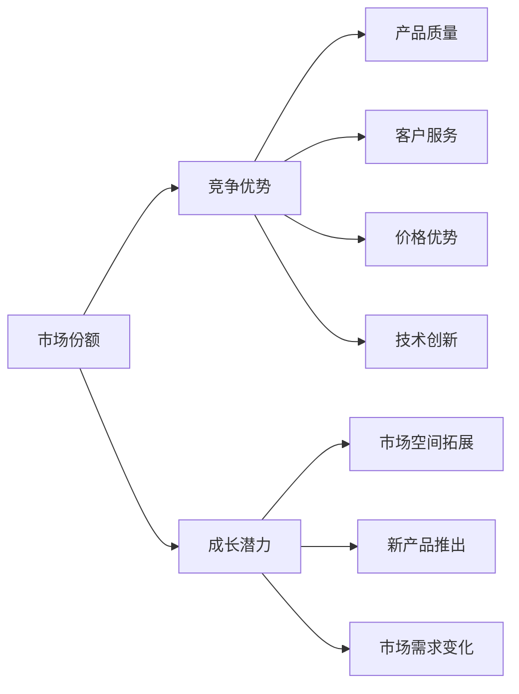

# 彼得林奇如何看待公司的市场份额

> 关键词：彼得林奇、公司市场份额、投资分析、竞争优势、成长潜力

> 摘要：本文深入探讨了投资大师彼得林奇对公司市场份额的独特看法。通过详细介绍相关背景知识，阐述市场份额的核心概念及其与公司竞争力等方面的联系，剖析彼得林奇基于市场份额进行投资分析的核心算法原理与操作步骤，借助数学模型和公式加深理解，结合项目实战案例展示其在实际投资中的应用，探讨实际应用场景，推荐相关学习工具和资源，最后总结未来发展趋势与挑战，并解答常见问题。旨在帮助投资者更好地理解彼得林奇的投资理念，学会运用市场份额这一重要指标进行投资决策。

## 1. 背景介绍 
### 1.1 目的和范围
本文的目的在于全面且深入地探究彼得林奇对公司市场份额的观点及其在投资领域的应用。范围涵盖了彼得林奇投资理念中关于市场份额的各个方面，包括市场份额的定义、其与公司竞争优势和成长潜力的关系，以及如何运用市场份额进行投资决策等内容。通过对这些内容的研究，为投资者提供有价值的参考和指导。

### 1.2 预期读者
本文预期读者主要包括对投资领域感兴趣的初学者，希望通过学习彼得林奇的投资理念来提升自己投资能力的投资者，以及从事金融研究和教学的专业人士。无论是想要入门投资的新手，还是希望进一步完善投资知识体系的专业人士，都能从本文中获得有价值的信息。

### 1.3 文档结构概述
本文首先介绍相关背景知识，包括目的、预期读者和文档结构概述等内容。接着阐述市场份额的核心概念及其与其他因素的联系，通过文本示意图和 Mermaid 流程图进行清晰展示。然后剖析彼得林奇基于市场份额进行投资分析的核心算法原理和具体操作步骤，并使用 Python 源代码进行详细阐述。随后介绍相关数学模型和公式，并举例说明。再通过项目实战案例展示如何运用这些理论进行实际投资，包括开发环境搭建、源代码实现和代码解读等。之后探讨市场份额在实际投资中的应用场景，推荐相关学习工具和资源。最后总结未来发展趋势与挑战，解答常见问题，并提供扩展阅读和参考资料。

### 1.4 术语表
#### 1.4.1 核心术语定义
- **市场份额**：指一个公司的产品或服务在特定市场中所占的比例，通常用销售额、销售量或其他相关指标来衡量。
- **竞争优势**：企业在市场竞争中相对于竞争对手所具有的优势，能够使其在市场中获得更高的市场份额和利润。
- **成长潜力**：公司未来在市场中实现增长和发展的可能性和能力。

#### 1.4.2 相关概念解释
- **相对市场份额**：指公司的市场份额与市场领导者的市场份额之比，用于衡量公司在市场中的相对地位。
- **市场集中度**：反映市场中企业的分布情况，通常用行业前几家企业的市场份额之和来表示。

#### 1.4.3 缩略词列表
- **P/E**：市盈率（Price-to-Earnings Ratio），用于衡量股票价格与每股盈利之间的关系。

## 2. 核心概念与联系 
### 市场份额的核心概念
市场份额是衡量公司在特定市场中地位的重要指标。它反映了公司产品或服务在市场中的受欢迎程度和竞争力。较高的市场份额通常意味着公司在市场中具有更强的话语权和定价能力，能够更好地抵御市场风险。

### 市场份额与竞争优势的联系
市场份额与竞争优势密切相关。具有竞争优势的公司往往能够吸引更多的客户，从而获得更高的市场份额。例如，公司可能通过提供高质量的产品、良好的客户服务、较低的价格或独特的技术等方式来建立竞争优势，进而扩大市场份额。相反，较高的市场份额也可以进一步巩固公司的竞争优势，因为公司可以利用规模经济降低成本，提高生产效率，从而在市场中更具竞争力。

### 市场份额与成长潜力的联系
市场份额与公司的成长潜力也存在一定的关系。一般来说，市场份额较低的公司可能具有更大的成长潜力，因为它们有更多的市场空间可以拓展。然而，这并不意味着市场份额高的公司就没有成长潜力。如果公司能够不断创新，推出新产品或服务，满足市场需求，即使市场份额已经很高，仍然可以实现持续增长。

### 文本示意图
```plaintext
市场份额
|
|-- 竞争优势
|   |-- 产品质量
|   |-- 客户服务
|   |-- 价格优势
|   |-- 技术创新
|
|-- 成长潜力
|   |-- 市场空间拓展
|   |-- 新产品推出
|   |-- 市场需求变化
```

### Mermaid 流程图


## 3. 核心算法原理 & 具体操作步骤 
### 核心算法原理
彼得林奇在分析公司市场份额时，主要关注市场份额的变化趋势以及与竞争对手的比较。他认为，持续增长的市场份额是公司具有竞争优势和成长潜力的重要标志。同时，与竞争对手相比，具有更高市场份额的公司通常更具投资价值。

### 具体操作步骤
1. **收集数据**：收集公司及其竞争对手的市场份额数据，可以通过行业报告、公司财务报表等渠道获取。
2. **分析市场份额变化趋势**：绘制市场份额随时间变化的图表，观察市场份额是上升、下降还是保持稳定。
3. **比较与竞争对手的市场份额**：计算公司与竞争对手的市场份额差距，评估公司在市场中的相对地位。
4. **综合评估**：结合公司的其他因素，如财务状况、产品创新能力等，综合评估公司的投资价值。

### Python 源代码实现
```python
import pandas as pd
import matplotlib.pyplot as plt

# 模拟市场份额数据
data = {
    'Year': [2015, 2016, 2017, 2018, 2019, 2020],
    'Company_A_Market_Share': [10, 12, 15, 18, 20, 22],
    'Company_B_Market_Share': [15, 13, 12, 10, 8, 6],
    'Company_C_Market_Share': [5, 6, 8, 10, 12, 15]
}

df = pd.DataFrame(data)

# 绘制市场份额变化趋势图
plt.figure(figsize=(10, 6))
plt.plot(df['Year'], df['Company_A_Market_Share'], label='Company A')
plt.plot(df['Year'], df['Company_B_Market_Share'], label='Company B')
plt.plot(df['Year'], df['Company_C_Market_Share'], label='Company C')
plt.xlabel('Year')
plt.ylabel('Market Share (%)')
plt.title('Market Share Trend')
plt.legend()
plt.grid(True)
plt.show()

# 比较与竞争对手的市场份额
latest_year = df['Year'].max()
latest_data = df[df['Year'] == latest_year]
print("Latest Market Share:")
print(latest_data[['Company_A_Market_Share', 'Company_B_Market_Share', 'Company_C_Market_Share']])
```

### 代码解释
1. **数据模拟**：使用 `pandas` 库创建一个包含不同公司市场份额数据的 DataFrame。
2. **绘制趋势图**：使用 `matplotlib` 库绘制市场份额随时间变化的趋势图，直观展示各公司市场份额的变化情况。
3. **比较市场份额**：提取最新年份的市场份额数据，并打印输出，以便比较各公司的市场份额。

## 4. 数学模型和公式 & 详细讲解 & 举例说明 
### 市场份额计算方法
市场份额通常可以用以下公式计算：
$$市场份额 = \frac{公司销售额}{市场总销售额} \times 100\%$$

### 相对市场份额计算方法
相对市场份额可以用以下公式计算：
$$相对市场份额 = \frac{公司市场份额}{市场领导者市场份额}$$

### 详细讲解
市场份额的计算是基于公司销售额与市场总销售额的比例关系。通过计算市场份额，可以直观地了解公司在市场中的地位。相对市场份额则是将公司的市场份额与市场领导者的市场份额进行比较，能够更清晰地反映公司在市场中的相对竞争力。

### 举例说明
假设市场总销售额为 1000 万元，公司 A 的销售额为 200 万元，市场领导者公司 B 的销售额为 300 万元。则公司 A 的市场份额为：
$$市场份额_A = \frac{200}{1000} \times 100\% = 20\%$$
公司 A 的相对市场份额为：
$$相对市场份额_A = \frac{20\%}{30\%} \approx 0.67$$

这表明公司 A 的市场份额为 20%，相对市场份额约为 0.67，即公司 A 的市场份额是市场领导者公司 B 的 67%。

## 5. 项目实战：代码实际案例和详细解释说明 
### 5.1  开发环境搭建
1. **安装 Python**：从 Python 官方网站（https://www.python.org/downloads/）下载并安装 Python 3.x 版本。
2. **安装必要的库**：使用 `pip` 命令安装 `pandas` 和 `matplotlib` 库。
```bash
pip install pandas matplotlib
```

### 5.2  源代码详细实现和代码解读
```python
import pandas as pd
import matplotlib.pyplot as plt

# 读取市场份额数据文件
data = pd.read_csv('market_share_data.csv')

# 绘制市场份额变化趋势图
plt.figure(figsize=(10, 6))
for company in data.columns[1:]:
    plt.plot(data['Year'], data[company], label=company)
plt.xlabel('Year')
plt.ylabel('Market Share (%)')
plt.title('Market Share Trend')
plt.legend()
plt.grid(True)
plt.show()

# 计算各公司的平均市场份额
average_market_share = data.drop('Year', axis=1).mean()
print("Average Market Share:")
print(average_market_share)

# 找出市场份额最高的公司
max_market_share_company = average_market_share.idxmax()
max_market_share = average_market_share[max_market_share_company]
print(f"The company with the highest average market share is {max_market_share_company} with {max_market_share}%.")
```

### 5.3  代码解读与分析
1. **数据读取**：使用 `pandas` 库的 `read_csv` 函数读取包含市场份额数据的 CSV 文件。
2. **绘制趋势图**：使用 `matplotlib` 库绘制各公司市场份额随时间变化的趋势图，方便观察市场份额的变化情况。
3. **计算平均市场份额**：使用 `mean` 函数计算各公司的平均市场份额，以便比较各公司在一段时间内的市场表现。
4. **找出市场份额最高的公司**：使用 `idxmax` 函数找出平均市场份额最高的公司，并打印输出相关信息。

## 6. 实际应用场景 
### 投资决策
在投资决策中，市场份额是一个重要的参考指标。投资者可以通过分析公司的市场份额变化趋势和与竞争对手的比较，评估公司的竞争优势和成长潜力，从而做出更明智的投资决策。例如，如果一个公司的市场份额持续增长，且与竞争对手相比具有明显优势，那么该公司可能具有较高的投资价值。

### 战略规划
对于企业来说，市场份额是制定战略规划的重要依据。企业可以通过分析自身和竞争对手的市场份额，了解市场竞争格局，制定相应的市场策略。例如，如果企业的市场份额较低，可以考虑通过产品创新、降低成本、拓展市场等方式来提高市场份额；如果企业的市场份额较高，可以考虑进一步巩固优势，拓展新的市场领域。

### 行业分析
市场份额也是进行行业分析的重要指标。通过分析行业内各公司的市场份额分布情况，可以了解行业的竞争程度和市场集中度。如果行业市场份额高度集中在少数几家公司手中，说明该行业竞争激烈，进入壁垒较高；如果市场份额较为分散，说明该行业竞争相对较弱，进入壁垒较低。

## 7. 工具和资源推荐
### 7.1 学习资源推荐
#### 7.1.1 书籍推荐
- 《彼得林奇的成功投资》：彼得林奇的经典著作，详细阐述了他的投资理念和方法，包括如何分析公司的市场份额等内容。
- 《聪明的投资者》：本杰明·格雷厄姆的经典投资书籍，对价值投资理念进行了深入探讨，为投资者提供了重要的理论基础。

#### 7.1.2 在线课程
- Coursera 上的“投资学原理”课程：由知名大学教授授课，系统介绍投资学的基本原理和方法。
- Udemy 上的“股票投资实战技巧”课程：通过实际案例讲解股票投资的技巧和策略。

#### 7.1.3 技术博客和网站
- 雪球网：国内知名的投资交流社区，提供丰富的投资资讯和分析文章。
- Seeking Alpha：国外知名的投资研究网站，提供专业的投资分析和评论。

### 7.2 开发工具框架推荐
#### 7.2.1 IDE和编辑器
- PyCharm：功能强大的 Python 集成开发环境，提供代码编辑、调试、版本控制等功能。
- Visual Studio Code：轻量级的代码编辑器，支持多种编程语言，具有丰富的插件生态系统。

#### 7.2.2 调试和性能分析工具
- PDB：Python 内置的调试工具，用于调试 Python 代码。
- cProfile：Python 内置的性能分析工具，用于分析 Python 代码的性能瓶颈。

#### 7.2.3 相关框架和库
- Pandas：用于数据处理和分析的 Python 库，提供高效的数据结构和数据操作方法。
- Matplotlib：用于数据可视化的 Python 库，提供丰富的绘图功能。

### 7.3 相关论文著作推荐
#### 7.3.1 经典论文
- Porter, M. E. (1979). How competitive forces shape strategy. Harvard business review, 57(2), 137-145.：该论文提出了波特五力模型，用于分析行业竞争环境，对市场份额的研究具有重要参考价值。
- Bain, J. S. (1951). Relation of profit rate to industry concentration: American manufacturing, 1936 - 1940. The Quarterly Journal of Economics, 65(3), 293-324.：该论文研究了市场集中度与利润率之间的关系，为市场份额的研究提供了理论基础。

#### 7.3.2 最新研究成果
- 关注顶级学术期刊，如《Journal of Financial Economics》、《The Review of Financial Studies》等，了解市场份额研究的最新进展。

#### 7.3.3 应用案例分析
- 分析知名企业的市场份额变化案例，如苹果公司、亚马逊公司等，了解市场份额在企业发展中的作用和影响。

## 8. 总结：未来发展趋势与挑战
### 未来发展趋势
1. **数字化转型对市场份额的影响**：随着数字化技术的不断发展，企业的数字化转型将成为趋势。数字化转型能够提高企业的运营效率、降低成本、提升客户体验，从而影响企业的市场份额。例如，电商平台的兴起改变了零售行业的市场格局，一些传统零售企业的市场份额受到冲击，而电商企业的市场份额不断扩大。
2. **新兴行业的市场份额竞争**：新兴行业如人工智能、新能源、生物医药等将成为未来市场竞争的焦点。这些行业具有巨大的发展潜力，但竞争也非常激烈。企业需要不断创新，提高自身的技术实力和市场竞争力，才能在新兴行业中获得更高的市场份额。
3. **全球化背景下的市场份额争夺**：在全球化背景下，企业面临着更加激烈的国际竞争。企业需要拓展国际市场，提高在全球市场的份额。同时，企业还需要应对不同国家和地区的政策、文化、法律等方面的差异，这对企业的市场拓展能力提出了更高的要求。

### 挑战
1. **数据获取和分析的难度**：准确获取市场份额数据是进行市场份额分析的基础。然而，市场份额数据的获取往往存在一定的难度，尤其是在一些新兴行业和细分市场。此外，对大量的市场份额数据进行分析和解读也需要专业的知识和技能。
2. **市场变化的不确定性**：市场环境是不断变化的，技术创新、消费者需求变化、政策调整等因素都可能导致市场份额的变化。企业和投资者需要及时关注市场变化，调整策略，以应对市场的不确定性。
3. **竞争压力的增大**：随着市场竞争的加剧，企业面临的竞争压力越来越大。企业需要不断提升自身的核心竞争力，才能在激烈的市场竞争中保持或扩大市场份额。同时，投资者也需要更加谨慎地选择投资对象，以降低投资风险。

## 9. 附录：常见问题与解答
### 问题 1：市场份额越高，公司的投资价值就一定越高吗？
解答：不一定。虽然较高的市场份额通常意味着公司具有较强的竞争优势和盈利能力，但投资价值还受到其他因素的影响，如公司的财务状况、创新能力、管理团队等。例如，一个市场份额很高但财务状况不佳、缺乏创新能力的公司，其投资价值可能并不高。

### 问题 2：如何判断市场份额的增长是否可持续？
解答：可以从以下几个方面进行判断：一是公司的竞争优势是否持续存在，如产品质量、技术创新、品牌影响力等；二是市场需求是否持续增长，如果市场需求已经饱和，公司的市场份额增长可能难以持续；三是竞争对手的反应，如果竞争对手采取了有效的竞争策略，可能会对公司的市场份额增长产生影响。

### 问题 3：市场份额分析适用于所有行业吗？
解答：市场份额分析适用于大多数行业，但在不同行业中的应用方式和重要程度可能有所不同。例如，在一些垄断性行业，市场份额的竞争相对较弱，市场份额分析的重要性可能相对较低；而在一些竞争性较强的行业，市场份额分析则具有重要的意义。

## 10. 扩展阅读 & 参考资料
### 扩展阅读
- 《金融炼金术》：乔治·索罗斯的著作，探讨了金融市场的运行规律和投资策略。
- 《穷查理宝典》：收录了查理·芒格的演讲和文章，介绍了他的投资理念和思维方式。

### 参考资料
- 彼得林奇的官方网站和相关访谈资料。
- 行业研究报告和市场分析数据。
- 相关学术期刊和论文。