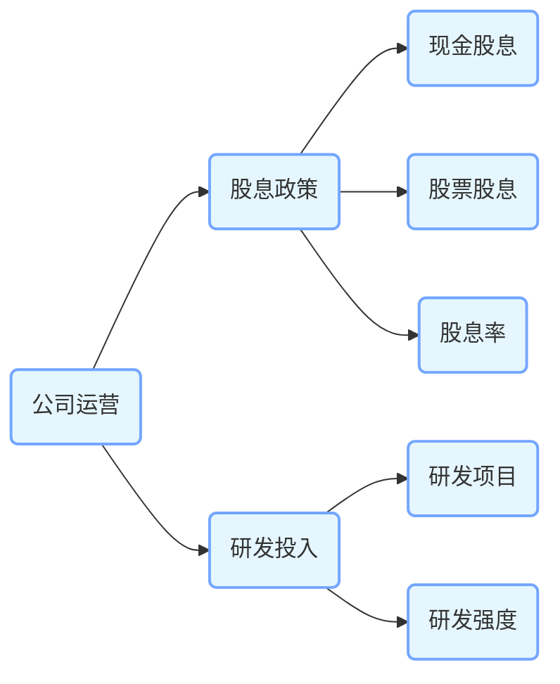

# 彼得林奇如何看待公司的股息政策与研发投入的平衡

> 关键词：彼得林奇、股息政策、研发投入、平衡、公司发展

> 摘要：本文聚焦于投资大师彼得林奇对于公司股息政策与研发投入平衡的观点。深入探讨了股息政策和研发投入在公司运营中的重要性，分析了两者之间可能存在的矛盾与统一。通过介绍相关核心概念、算法原理、数学模型，结合项目实战案例，阐述在不同情况下如何实现两者的合理平衡。同时，探讨了其在实际应用场景中的体现，推荐了相关的学习工具和资源，最后总结未来发展趋势与挑战，并对常见问题进行解答。

## 1. 背景介绍 
### 1.1 目的和范围
本部分旨在深入剖析彼得林奇对公司股息政策与研发投入平衡的看法。通过研究彼得林奇的投资理念和相关案例，为投资者和企业管理者提供关于如何在股息分配和研发投入之间找到合适平衡点的思路和方法。范围涵盖了对股息政策和研发投入的基本概念、两者之间的关系，以及在不同行业和公司规模下的具体应用。

### 1.2 预期读者
本文预期读者包括对投资领域感兴趣的个人投资者、企业的财务管理人员、研究公司财务策略的学者，以及关注公司长期发展战略的相关人士。这些读者可以从本文中获取关于公司股息政策和研发投入平衡的理论知识和实践经验。

### 1.3 文档结构概述
本文首先介绍背景信息，包括目的、预期读者和文档结构。接着阐述核心概念，如股息政策和研发投入的定义和联系，并通过示意图和流程图展示。然后讲解核心算法原理和具体操作步骤，结合数学模型和公式进行详细说明。之后通过项目实战案例分析代码实现和解读。再探讨实际应用场景，推荐相关工具和资源。最后总结未来发展趋势与挑战，解答常见问题并提供扩展阅读和参考资料。

### 1.4 术语表
#### 1.4.1 核心术语定义
- **股息政策**：公司关于向股东分配利润的政策，包括股息的支付频率、支付比例等。
- **研发投入**：公司为了开展研究和开发活动而投入的资金、人力和物力等资源。
- **股息率**：股息与股票价格的比率，反映了股东从股息中获得的收益。
- **研发强度**：研发投入占公司营业收入的比例，衡量公司对研发的重视程度。

#### 1.4.2 相关概念解释
- **现金股息**：公司以现金形式向股东支付的股息。
- **股票股息**：公司以增发股票的形式向股东支付的股息。
- **研发项目**：公司为了实现特定的技术创新或产品改进而开展的一系列研究和开发活动。

#### 1.4.3 缩略词列表
- **R&D**：Research and Development，即研究与开发。
- **EPS**：Earnings Per Share，即每股收益。

## 2. 核心概念与联系 

### 核心概念原理
股息政策是公司财务管理的重要组成部分，它直接关系到股东的利益和公司的市场形象。合理的股息政策可以吸引投资者，提高公司的股价。股息政策的制定通常受到公司盈利状况、现金流状况、发展战略等因素的影响。

研发投入则是公司实现长期发展和保持竞争力的关键因素。通过投入研发，公司可以开发新产品、改进现有产品、提高生产效率等。研发投入的多少取决于公司所处的行业、市场竞争状况、技术创新的需求等。

### 架构的文本示意图
```plaintext
公司运营
|-- 股息政策
|   |-- 现金股息
|   |-- 股票股息
|   |-- 股息率
|-- 研发投入
|   |-- 研发项目
|   |-- 研发强度
```

### Mermaid 流程图


## 3. 核心算法原理 & 具体操作步骤 

### 核心算法原理
在考虑股息政策和研发投入的平衡时，可以使用以下算法原理：

1. **基于现金流的算法**：首先计算公司的自由现金流，即经营活动现金流量减去资本支出。然后根据公司的发展战略和财务状况，确定合理的股息支付比例和研发投入比例。自由现金流的计算公式为：

$$FCF = CFO - CAPEX$$

其中，$FCF$ 表示自由现金流，$CFO$ 表示经营活动现金流量，$CAPEX$ 表示资本支出。

2. **基于盈利的算法**：根据公司的净利润，确定股息支付金额和研发投入金额。可以设定一个固定的股息支付率和研发投入率，例如股息支付率为 30%，研发投入率为 10%。则股息支付金额和研发投入金额的计算公式为：

$$Dividend = EPS \times DividendRate \times SharesOutstanding$$

$$R\&DInvestment = NetIncome \times R\&DRate$$

其中，$Dividend$ 表示股息支付金额，$EPS$ 表示每股收益，$DividendRate$ 表示股息支付率，$SharesOutstanding$ 表示流通股数量，$R\&DInvestment$ 表示研发投入金额，$NetIncome$ 表示净利润，$R\&DRate$ 表示研发投入率。

### 具体操作步骤
1. **收集数据**：收集公司的财务报表，包括利润表、现金流量表和资产负债表，获取相关数据，如净利润、经营活动现金流量、资本支出、每股收益等。
2. **确定目标**：根据公司的发展战略和市场环境，确定合理的股息支付比例和研发投入比例。
3. **计算指标**：根据上述算法原理，计算自由现金流、股息支付金额和研发投入金额。
4. **调整策略**：根据计算结果，调整股息政策和研发投入计划，确保两者之间的平衡。

### Python 源代码实现
```python
# 示例数据
net_income = 1000000  # 净利润
shares_outstanding = 500000  # 流通股数量
eps = net_income / shares_outstanding  # 每股收益
dividend_rate = 0.3  # 股息支付率
rd_rate = 0.1  # 研发投入率

# 计算股息支付金额
dividend = eps * dividend_rate * shares_outstanding

# 计算研发投入金额
rd_investment = net_income * rd_rate

print(f"股息支付金额: {dividend}")
print(f"研发投入金额: {rd_investment}")
```

## 4. 数学模型和公式 & 详细讲解 & 举例说明 

### 数学模型和公式
1. **股息支付模型**：
   - 固定股息支付率模型：$Dividend = EPS \times DividendRate \times SharesOutstanding$
   - 剩余股息模型：$Dividend = NetIncome - R\&DInvestment - CAPEX$

2. **研发投入模型**：
   - 比例模型：$R\&DInvestment = NetIncome \times R\&DRate$
   - 基于市场需求模型：$R\&DInvestment = f(MarketDemand, Competition)$

### 详细讲解
- **固定股息支付率模型**：该模型简单易懂，公司按照固定的比例向股东支付股息。优点是稳定性好，能够给股东带来稳定的收益；缺点是缺乏灵活性，不能根据公司的实际情况进行调整。
- **剩余股息模型**：该模型先满足公司的投资需求，剩余的利润再用于支付股息。优点是能够保证公司的投资需求，有利于公司的长期发展；缺点是股息支付不稳定，可能会影响股东的信心。
- **比例模型**：该模型根据公司的净利润按照一定的比例确定研发投入金额。优点是简单易行，便于管理；缺点是没有考虑市场需求和竞争状况。
- **基于市场需求模型**：该模型根据市场需求和竞争状况确定研发投入金额。优点是能够更好地适应市场变化，提高公司的竞争力；缺点是需要准确的市场预测和分析，难度较大。

### 举例说明
假设某公司的净利润为 1000 万元，流通股数量为 500 万股，每股收益为 2 元。股息支付率为 30%，研发投入率为 10%。

- **固定股息支付率模型**：
  股息支付金额 = $2 \times 0.3 \times 500 = 300$（万元）
  研发投入金额 = $1000 \times 0.1 = 100$（万元）

- **剩余股息模型**：
  假设公司的研发投入为 200 万元，资本支出为 300 万元。
  股息支付金额 = $1000 - 200 - 300 = 500$（万元）

## 5. 项目实战：代码实际案例和详细解释说明 

### 5.1  开发环境搭建
- **操作系统**：Windows、Linux 或 macOS。
- **编程语言**：Python 3.x。
- **开发工具**：PyCharm、Jupyter Notebook 等。
- **相关库**：Pandas、Numpy 等。

### 5.2  源代码详细实现和代码解读
```python
import pandas as pd
import numpy as np

# 模拟公司财务数据
data = {
    'Year': [2018, 2019, 2020, 2021, 2022],
    'NetIncome': [800000, 900000, 1000000, 1100000, 1200000],
    'SharesOutstanding': [400000, 400000, 400000, 400000, 400000],
    'DividendRate': [0.2, 0.25, 0.3, 0.3, 0.3],
    'RDRate': [0.1, 0.12, 0.15, 0.15, 0.15]
}

df = pd.DataFrame(data)

# 计算每股收益
df['EPS'] = df['NetIncome'] / df['SharesOutstanding']

# 计算股息支付金额
df['Dividend'] = df['EPS'] * df['DividendRate'] * df['SharesOutstanding']

# 计算研发投入金额
df['R&DInvestment'] = df['NetIncome'] * df['RDRate']

print(df)
```

### 代码解读与分析
- **数据模拟**：使用字典模拟公司的财务数据，包括年份、净利润、流通股数量、股息支付率和研发投入率。
- **数据处理**：使用 Pandas 库将字典数据转换为 DataFrame 对象。
- **指标计算**：计算每股收益、股息支付金额和研发投入金额。
- **结果输出**：打印计算结果，展示每年的股息支付金额和研发投入金额。

通过这个案例，可以直观地看到公司在不同年份的股息政策和研发投入情况，以及两者之间的关系。

## 6. 实际应用场景 
### 成熟行业的公司
在成熟行业中，市场竞争相对稳定，公司的盈利水平也较为稳定。这类公司通常会采用较高的股息支付政策，以吸引投资者。同时，为了保持竞争力，也会适当进行研发投入，但研发投入的比例相对较低。例如，一些传统制造业公司，如汽车制造公司，会将一部分利润用于支付股息，另一部分用于研发新车型和改进生产工艺。

### 新兴行业的公司
在新兴行业中，市场变化迅速，技术创新是公司生存和发展的关键。这类公司通常会将大部分利润用于研发投入，以开发新产品和新技术，而股息支付比例较低甚至不支付股息。例如，一些科技初创公司，如人工智能公司，会将大量资金投入到研发中，以提高技术水平和市场竞争力。

### 处于转型期的公司
处于转型期的公司需要进行战略调整和业务转型，这通常需要大量的研发投入。在转型期间，公司可能会减少股息支付，甚至暂停股息支付，以确保有足够的资金用于研发和转型。例如，一些传统零售公司向电商转型时，会加大在技术研发和物流配送方面的投入，从而减少股息支付。

## 7. 工具和资源推荐
### 7.1 学习资源推荐
#### 7.1.1 书籍推荐
- 《彼得林奇的成功投资》：彼得林奇的经典著作，详细介绍了他的投资理念和方法。
- 《财务报表分析》：帮助读者了解公司的财务报表，掌握财务分析的方法和技巧。
- 《创新者的窘境》：探讨了公司在创新过程中面临的挑战和机遇。

#### 7.1.2 在线课程
- Coursera 上的“公司财务”课程：由知名大学教授授课，系统讲解公司财务的基本知识和方法。
- edX 上的“投资分析与组合管理”课程：介绍投资分析的方法和组合管理的策略。

#### 7.1.3 技术博客和网站
- Seeking Alpha：提供股票分析和投资建议的网站。
- 雪球网：国内知名的投资社区，有大量的投资者分享投资经验和见解。

### 7.2 开发工具框架推荐
#### 7.2.1 IDE和编辑器
- PyCharm：功能强大的 Python 集成开发环境，适合专业开发者。
- Jupyter Notebook：交互式编程环境，方便进行数据分析和可视化。

#### 7.2.2 调试和性能分析工具
- PDB：Python 自带的调试工具，用于调试 Python 代码。
- cProfile：Python 自带的性能分析工具，用于分析代码的性能瓶颈。

#### 7.2.3 相关框架和库
- Pandas：用于数据处理和分析的 Python 库。
- Numpy：用于科学计算的 Python 库。

### 7.3 相关论文著作推荐
#### 7.3.1 经典论文
- Miller, M. H., & Modigliani, F. (1961). Dividend policy, growth, and the valuation of shares. The Journal of Business, 34(4), 411-433.
- Myers, S. C., & Majluf, N. S. (1984). Corporate financing and investment decisions when firms have information that investors do not have. Journal of Financial Economics, 13(2), 187-221.

#### 7.3.2 最新研究成果
可以通过学术数据库，如 Web of Science、EBSCOhost 等，搜索关于股息政策和研发投入的最新研究成果。

#### 7.3.3 应用案例分析
一些专业的财经媒体和研究机构会发布公司股息政策和研发投入的应用案例分析，可以关注这些内容，学习实际应用中的经验和教训。

## 8. 总结：未来发展趋势与挑战
### 未来发展趋势
- **数字化转型加速**：随着科技的发展，公司将更加注重数字化转型，加大在研发投入，特别是在人工智能、大数据、云计算等领域的投入。
- **社会责任意识增强**：公司在制定股息政策和研发投入计划时，将更加注重社会责任，考虑对环境、社会和治理的影响。
- **股东需求多样化**：股东对股息政策和研发投入的需求将更加多样化，公司需要根据不同股东的需求进行灵活调整。

### 挑战
- **技术创新风险**：研发投入存在技术创新失败的风险，如果研发项目不能取得预期的成果，将对公司的财务状况和市场形象造成负面影响。
- **资金压力**：研发投入需要大量的资金，公司可能会面临资金压力，特别是在经济不景气的情况下。
- **市场竞争加剧**：随着市场竞争的加剧，公司需要不断提高研发投入，以保持竞争力，但同时也需要控制成本，提高资金使用效率。

## 9. 附录：常见问题与解答
### 问题 1：公司的股息政策和研发投入是否可以同时提高？
答：在一定情况下，公司可以同时提高股息政策和研发投入。例如，当公司的盈利水平大幅提高时，可以在增加研发投入的同时，适当提高股息支付比例。但这需要公司具备较强的盈利能力和资金实力。

### 问题 2：如何判断公司的股息政策和研发投入是否合理？
答：可以从以下几个方面判断：一是公司的盈利状况和现金流状况，确保有足够的资金支持股息支付和研发投入；二是行业的平均水平，与同行业公司进行比较；三是公司的发展战略，是否与公司的长期发展目标相匹配。

### 问题 3：研发投入是否一定能带来公司的增长？
答：研发投入并不一定能带来公司的增长。研发项目存在失败的风险，如果研发项目不能取得预期的成果，将无法为公司带来收益。此外，研发成果的商业化也需要一定的时间和市场条件。

## 10. 扩展阅读 & 参考资料
### 扩展阅读
- 《聪明的投资者》：本杰明·格雷厄姆的经典著作，介绍了价值投资的理念和方法。
- 《金融炼金术》：乔治·索罗斯的著作，探讨了金融市场的运行规律和投资策略。

### 参考资料
- 公司的财务报表和公告。
- 财经媒体的报道和分析。
- 学术研究论文和报告。