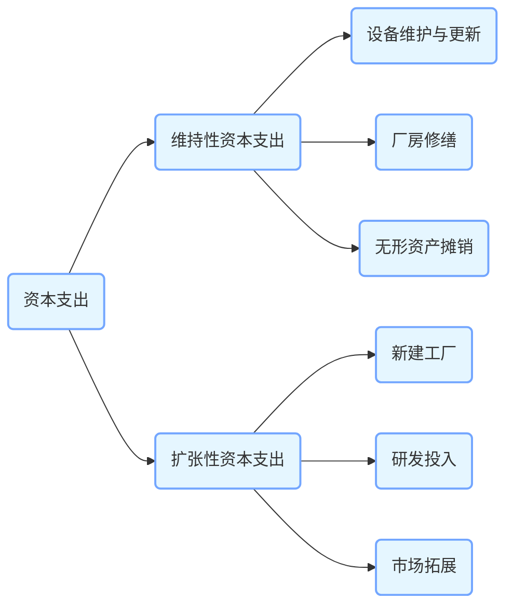

# 彼得林奇如何看待公司的资本支出

> 关键词：彼得林奇、公司资本支出、投资分析、财务评估、企业发展

> 摘要：本文深入探讨了投资大师彼得林奇对公司资本支出的看法。通过分析彼得林奇的投资理念和相关著作，阐述了资本支出在公司运营和发展中的重要性，以及如何通过对资本支出的评估来判断公司的投资价值。文中详细介绍了资本支出的核心概念、相关算法原理，结合数学模型和实际案例进行说明，并探讨了资本支出在不同应用场景中的影响。同时，提供了学习资本支出分析的工具和资源，最后总结了未来资本支出分析的发展趋势与挑战，旨在为投资者和企业管理者提供全面且深入的见解。

## 1. 背景介绍 
### 1.1 目的和范围
本文的目的是全面剖析彼得林奇对公司资本支出的观点和看法。通过研究彼得林奇的投资哲学和实际案例，我们将深入探讨资本支出在公司财务和发展中的作用，以及如何利用这些信息进行投资决策。范围涵盖了资本支出的基本概念、分析方法、实际应用场景，以及相关的工具和资源。

### 1.2 预期读者
本文预期读者包括投资者、企业管理者、财务分析师以及对投资和公司财务感兴趣的人士。无论是专业的投资人士还是初学者，都可以从本文中获得关于公司资本支出分析的有价值信息。

### 1.3 文档结构概述
本文将按照以下结构展开：首先介绍资本支出的核心概念和相关联系，包括其原理和架构；接着讲解核心算法原理和具体操作步骤，并通过Python代码进行详细阐述；然后介绍数学模型和公式，并举例说明；之后通过项目实战，给出代码实际案例和详细解释；再探讨资本支出的实际应用场景；提供相关的工具和资源推荐；最后总结未来发展趋势与挑战，并给出常见问题的解答和扩展阅读参考资料。

### 1.4 术语表
#### 1.4.1 核心术语定义
- **资本支出（Capital Expenditure）**：指企业为了获取长期资产（如固定资产、无形资产等）而发生的支出，通常用于维持或扩大企业的生产经营规模。
- **折旧（Depreciation）**：指固定资产在使用过程中由于磨损、老化等原因而逐渐减少的价值，通过折旧的方式将固定资产的成本分摊到其使用寿命内。
- **自由现金流（Free Cash Flow）**：指企业在满足了运营和资本支出需求后剩余的现金流量，是衡量企业财务健康状况和盈利能力的重要指标。

#### 1.4.2 相关概念解释
- **运营支出（Operating Expenditure）**：指企业在日常经营活动中发生的支出，如原材料采购、员工工资、水电费等，这些支出通常用于维持企业的正常运营。
- **资产回报率（Return on Assets，ROA）**：指企业净利润与总资产的比率，反映了企业利用资产创造利润的能力。
- **权益回报率（Return on Equity，ROE）**：指企业净利润与股东权益的比率，反映了企业为股东创造价值的能力。

#### 1.4.3 缩略词列表
- **CAPEX**：资本支出（Capital Expenditure）
- **FCF**：自由现金流（Free Cash Flow）
- **ROA**：资产回报率（Return on Assets）
- **ROE**：权益回报率（Return on Equity）

## 2. 核心概念与联系 
### 核心概念原理
资本支出是企业为了长期发展而进行的投资，它直接影响着企业的生产能力、技术水平和市场竞争力。彼得林奇认为，资本支出的合理性和有效性是评估公司投资价值的重要因素之一。

从原理上讲，资本支出可以分为两类：一类是维持性资本支出，用于维持企业现有生产经营规模和设备的正常运转；另一类是扩张性资本支出，用于扩大企业的生产规模、开发新产品或进入新市场。维持性资本支出是企业生存的基础，而扩张性资本支出则是企业发展的动力。

### 架构的文本示意图
```plaintext
资本支出
├── 维持性资本支出
│   ├── 设备维护与更新
│   ├── 厂房修缮
│   └── 无形资产摊销
├── 扩张性资本支出
│   ├── 新建工厂
│   ├── 研发投入
│   └── 市场拓展
```

### Mermaid 流程图


## 3. 核心算法原理 & 具体操作步骤 
### 核心算法原理
在分析公司的资本支出时，我们通常会使用一些关键指标，如资本支出率、自由现金流等。以下是这些指标的计算方法：

- **资本支出率（CAPEX Ratio）**：资本支出率是指资本支出与营业收入的比率，反映了企业在营业收入中用于资本支出的比例。计算公式为：
  $$资本支出率 = \frac{资本支出}{营业收入} \times 100\%$$

- **自由现金流（FCF）**：自由现金流是指企业在满足了运营和资本支出需求后剩余的现金流量。计算公式为：
  $$自由现金流 = 经营活动现金流量 - 资本支出$$

### 具体操作步骤
以下是使用Python代码计算资本支出率和自由现金流的示例：

```python
# 定义资本支出和营业收入
capex = 1000000  # 资本支出
revenue = 5000000  # 营业收入
operating_cash_flow = 2000000  # 经营活动现金流量

# 计算资本支出率
capex_ratio = (capex / revenue) * 100

# 计算自由现金流
fcf = operating_cash_flow - capex

# 输出结果
print(f"资本支出率: {capex_ratio:.2f}%")
print(f"自由现金流: {fcf}")
```

### 代码解释
- 首先，我们定义了资本支出、营业收入和经营活动现金流量。
- 然后，根据公式计算资本支出率和自由现金流。
- 最后，使用`print`函数输出计算结果。

## 4. 数学模型和公式 & 详细讲解 & 举例说明 
### 数学模型和公式
除了上述的资本支出率和自由现金流公式外，我们还可以使用一些其他的数学模型和公式来分析公司的资本支出。

- **净现值（Net Present Value，NPV）**：净现值是指投资项目在未来各期现金流量的现值之和减去初始投资的差额。计算公式为：
  $$NPV = \sum_{t=0}^{n} \frac{CF_t}{(1 + r)^t} - I_0$$
  其中，$CF_t$ 是第 $t$ 期的现金流量，$r$ 是折现率，$I_0$ 是初始投资，$n$ 是投资项目的寿命期。

- **内部收益率（Internal Rate of Return，IRR）**：内部收益率是指使投资项目的净现值等于零的折现率。计算公式为：
  $$\sum_{t=0}^{n} \frac{CF_t}{(1 + IRR)^t} - I_0 = 0$$

### 详细讲解
- **净现值（NPV）**：净现值是评估投资项目是否可行的重要指标。如果净现值大于零，则说明投资项目的收益大于成本，项目可行；如果净现值小于零，则说明投资项目的收益小于成本，项目不可行。
- **内部收益率（IRR）**：内部收益率反映了投资项目的实际收益率。如果内部收益率大于投资者的要求收益率，则说明投资项目的收益满足投资者的要求，项目可行；如果内部收益率小于投资者的要求收益率，则说明投资项目的收益不满足投资者的要求，项目不可行。

### 举例说明
假设某公司计划投资一个新项目，初始投资为 $100$ 万元，预计未来 $5$ 年的现金流量分别为 $20$ 万元、$30$ 万元、$40$ 万元、$50$ 万元和 $60$ 万元，折现率为 $10\%$。

- **计算净现值（NPV）**：
  $$NPV = \frac{20}{(1 + 0.1)^1} + \frac{30}{(1 + 0.1)^2} + \frac{40}{(1 + 0.1)^3} + \frac{50}{(1 + 0.1)^4} + \frac{60}{(1 + 0.1)^5} - 100$$
  使用Python代码计算：
  ```python
  import numpy as np

  cash_flows = [-100, 20, 30, 40, 50, 60]
  discount_rate = 0.1

  npv = np.npv(discount_rate, cash_flows)
  print(f"净现值: {npv:.2f} 万元")
  ```

- **计算内部收益率（IRR）**：
  使用Python代码计算：
  ```python
  irr = np.irr(cash_flows)
  print(f"内部收益率: {irr * 100:.2f}%")
  ```

## 5. 项目实战：代码实际案例和详细解释说明 
### 5.1  开发环境搭建
为了进行资本支出分析的项目实战，我们需要搭建以下开发环境：

- **Python**：建议使用Python 3.7及以上版本。
- **IDE或编辑器**：可以选择PyCharm、Jupyter Notebook等。
- **必要的库**：需要安装`pandas`、`numpy`等库，用于数据处理和分析。

可以使用以下命令安装所需的库：
```sh
pip install pandas numpy
```

### 5.2  源代码详细实现和代码解读
假设我们有一个包含公司财务数据的CSV文件`financial_data.csv`，文件中包含`营业收入`、`资本支出`和`经营活动现金流量`等列。我们将使用Python代码读取该文件，并计算资本支出率和自由现金流。

```python
import pandas as pd

# 读取CSV文件
data = pd.read_csv('financial_data.csv')

# 计算资本支出率
data['资本支出率'] = (data['资本支出'] / data['营业收入']) * 100

# 计算自由现金流
data['自由现金流'] = data['经营活动现金流量'] - data['资本支出']

# 输出结果
print(data[['营业收入', '资本支出', '经营活动现金流量', '资本支出率', '自由现金流']])
```

### 代码解读与分析
- 首先，使用`pandas`库的`read_csv`函数读取CSV文件，将数据存储在`data`变量中。
- 然后，使用`data['资本支出'] / data['营业收入'] * 100`计算资本支出率，并将结果存储在新的列`资本支出率`中。
- 接着，使用`data['经营活动现金流量'] - data['资本支出']`计算自由现金流，并将结果存储在新的列`自由现金流`中。
- 最后，使用`print`函数输出包含`营业收入`、`资本支出`、`经营活动现金流量`、`资本支出率`和`自由现金流`的结果。

## 6. 实际应用场景 
### 投资者角度
从投资者的角度来看，对公司资本支出的分析可以帮助他们做出更明智的投资决策。

- **评估公司的成长潜力**：如果公司的扩张性资本支出较高，且能够带来相应的收入增长和利润提升，说明公司具有较强的成长潜力，可能是一个值得投资的对象。例如，一家科技公司不断加大研发投入，推出新的产品和技术，有望在未来获得更高的市场份额和利润。
- **判断公司的财务健康状况**：通过分析公司的资本支出率和自由现金流，可以判断公司的财务健康状况。如果公司的资本支出率过高，导致自由现金流为负，可能意味着公司的资金压力较大，存在一定的财务风险。

### 企业管理者角度
对于企业管理者来说，合理规划和管理资本支出是企业发展的关键。

- **优化资源配置**：通过对资本支出的分析，企业管理者可以了解哪些项目的投资回报率较高，从而优化资源配置，将有限的资金投入到最有价值的项目中。例如，企业可以根据市场需求和竞争情况，决定是加大生产设备的投资还是加强市场拓展的投入。
- **制定战略规划**：资本支出的决策与企业的战略规划密切相关。企业管理者可以根据公司的长期发展目标，制定合理的资本支出计划，以实现企业的战略目标。例如，企业计划进入新的市场，可能需要进行大规模的市场调研和基础设施建设等资本支出。

### 行业分析角度
在行业分析中，资本支出也可以作为一个重要的指标。

- **比较不同企业的竞争力**：通过比较同一行业内不同企业的资本支出情况，可以了解它们的竞争力差异。一般来说，资本支出较高且合理的企业，在技术创新、生产效率等方面可能具有优势。
- **预测行业的发展趋势**：观察整个行业的资本支出趋势，可以预测行业的发展方向。如果某个行业的资本支出普遍增加，可能意味着该行业正处于快速发展阶段，有更多的投资机会。

## 7. 工具和资源推荐
### 7.1 学习资源推荐
#### 7.1.1 书籍推荐
- 《彼得林奇的成功投资》：彼得林奇的经典著作，详细介绍了他的投资理念和方法，包括如何分析公司的财务报表和资本支出等。
- 《财务报表分析》：全面介绍了财务报表的分析方法，包括资本支出、自由现金流等指标的计算和分析。
- 《价值投资实战手册》：结合实际案例，讲解了价值投资的理念和方法，对资本支出的分析有深入的探讨。

#### 7.1.2 在线课程
- Coursera上的“财务报表分析与估值”课程：由知名教授授课，系统地介绍了财务报表分析的方法和技巧，包括资本支出的分析。
- edX上的“投资学原理”课程：涵盖了投资学的基本原理和方法，对资本支出在投资决策中的应用有详细的讲解。

#### 7.1.3 技术博客和网站
- Seeking Alpha：提供专业的金融分析和投资建议，有很多关于公司资本支出分析的文章。
- Bloomberg：全球知名的金融信息服务提供商，提供丰富的公司财务数据和分析报告，可用于资本支出的研究。

### 7.2 开发工具框架推荐
#### 7.2.1 IDE和编辑器
- PyCharm：功能强大的Python集成开发环境，适合进行数据分析和代码开发。
- Jupyter Notebook：交互式的开发环境，方便进行数据探索和代码演示，非常适合初学者。

#### 7.2.2 调试和性能分析工具
- Py-Spy：用于分析Python代码的性能瓶颈，帮助优化代码。
- pdb：Python内置的调试工具，可用于调试代码中的错误。

#### 7.2.3 相关框架和库
- pandas：用于数据处理和分析，提供了丰富的数据结构和函数，方便进行资本支出数据的处理。
- numpy：用于科学计算，提供了高效的数组操作和数学函数，可用于资本支出相关指标的计算。

### 7.3 相关论文著作推荐
#### 7.3.1 经典论文
- “Corporate Capital Expenditure Decisions and the Market Value of the Firm”：探讨了公司资本支出决策与公司市场价值之间的关系。
- “The Relationship between Capital Expenditure and Earnings Growth”：研究了资本支出与公司盈利增长之间的关系。

#### 7.3.2 最新研究成果
- 近年来，有很多关于公司资本支出的研究成果发表在《Journal of Financial Economics》、《The Review of Financial Studies》等顶级金融学术期刊上，可以关注这些期刊获取最新的研究动态。

#### 7.3.3 应用案例分析
- 一些知名的咨询公司和研究机构会发布关于公司资本支出的应用案例分析报告，如麦肯锡、波士顿咨询等，可以参考这些报告了解实际应用中的经验和教训。

## 8. 总结：未来发展趋势与挑战
### 未来发展趋势
- **数字化转型推动资本支出结构变化**：随着科技的不断发展，企业的数字化转型将成为未来的趋势。这将导致企业在信息技术、数据中心等方面的资本支出增加，而传统的固定资产投资可能会相对减少。
- **可持续发展成为资本支出的重要考虑因素**：越来越多的企业开始关注可持续发展，将在环保、节能减排等方面进行更多的资本支出。这不仅有助于企业履行社会责任，还能提升企业的品牌形象和竞争力。
- **资本支出决策更加依赖数据分析**：随着大数据和人工智能技术的发展，企业在进行资本支出决策时将更加依赖数据分析。通过对大量数据的分析，企业可以更准确地评估投资项目的风险和收益，做出更合理的决策。

### 挑战
- **技术更新换代快带来的投资风险**：科技的快速发展使得技术更新换代的速度加快，企业在进行资本支出时面临着技术过时的风险。如果企业投资的技术在短期内被更先进的技术所取代，可能会导致投资失败。
- **宏观经济环境不确定性增加**：宏观经济环境的不确定性，如经济衰退、利率波动等，会对企业的资本支出决策产生影响。在经济不景气的情况下，企业可能会减少资本支出，以降低风险。
- **数据质量和隐私问题**：在依赖数据分析进行资本支出决策时，数据质量和隐私问题成为了挑战。如果数据不准确或存在隐私泄露问题，可能会导致决策失误。

## 9. 附录：常见问题与解答
### 问题1：资本支出和运营支出有什么区别？
资本支出是为了获取长期资产而发生的支出，通常用于维持或扩大企业的生产经营规模，其效益会在多个会计期间体现；而运营支出是企业在日常经营活动中发生的支出，用于维持企业的正常运营，其效益通常在当期体现。

### 问题2：如何判断公司的资本支出是否合理？
可以从以下几个方面判断公司的资本支出是否合理：一是看资本支出是否与公司的战略规划相匹配；二是分析资本支出对公司收入和利润的影响，如果能够带来相应的增长，说明资本支出是合理的；三是比较公司的资本支出率与同行业平均水平，如果过高或过低，可能需要进一步分析原因。

### 问题3：自由现金流为负一定意味着公司有问题吗？
不一定。自由现金流为负可能是由于公司处于扩张阶段，进行了大量的资本支出，如新建工厂、研发投入等。在这种情况下，虽然短期内自由现金流为负，但如果这些投资能够在未来带来更高的收益，公司的发展前景仍然是乐观的。但如果自由现金流长期为负，且没有合理的解释，可能意味着公司存在一定的问题。

## 10. 扩展阅读 & 参考资料
- 《聪明的投资者》，本杰明·格雷厄姆著
- 《漫步华尔街》，伯顿·马尔基尔著
- 《财经杂志》，提供最新的财经资讯和企业案例分析
- 《中国证券报》，发布证券市场的相关信息和研究报告
- 各上市公司的年报和财务报告，可从证券交易所网站获取，是了解公司资本支出情况的第一手资料。

以上文章详细探讨了彼得林奇对公司资本支出的看法，涵盖了资本支出的各个方面，希望能为读者提供有价值的参考。在实际应用中，需要结合具体情况进行分析和判断，以做出合理的投资决策和企业管理决策。