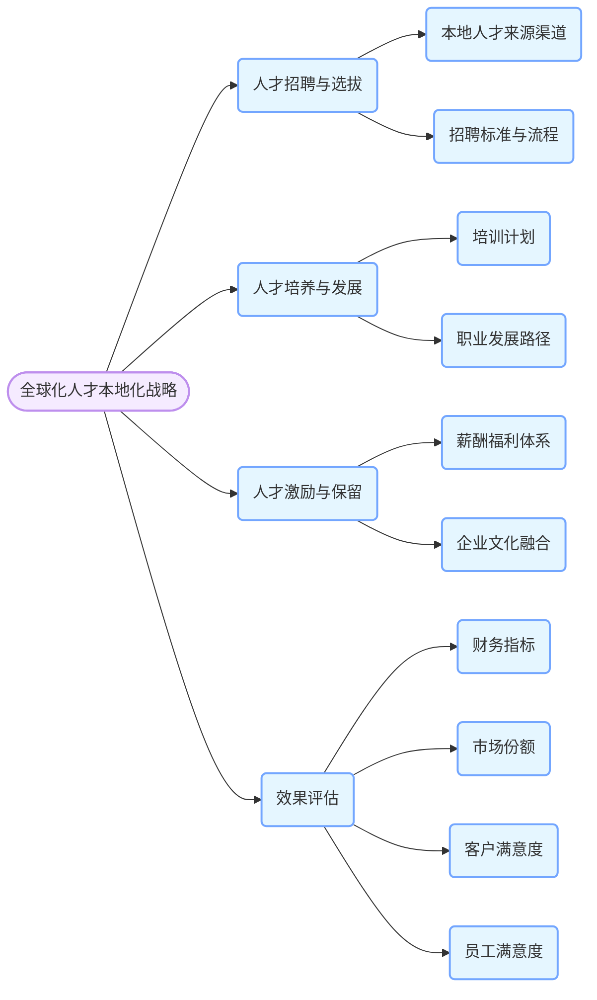

# 彼得林奇如何评估公司的全球化人才本地化效果

> 关键词：彼得林奇、全球化人才本地化、效果评估、公司评估、人才管理

> 摘要：本文聚焦于彼得林奇评估公司全球化人才本地化效果的方法。在当今全球化商业环境下，公司实施全球化人才本地化战略至关重要。彼得林奇作为投资领域的传奇人物，其评估视角和方法具有重要的借鉴意义。文章将深入探讨相关核心概念、评估的算法原理、数学模型，通过实际案例展示评估过程，并介绍在这一领域的实际应用场景、工具资源等，最后总结未来发展趋势与挑战，为企业管理者和投资者提供全面的参考。

## 1. 背景介绍 
### 1.1 目的和范围
在全球化浪潮中，越来越多的公司选择实施全球化人才本地化战略，旨在利用本地人才的优势，更好地适应不同地区的市场环境和文化差异。然而，如何评估这一战略的实施效果成为了公司面临的重要问题。彼得林奇以其独特的投资眼光和对公司基本面的深入研究而闻名。本文的目的在于探究彼得林奇可能采用的评估公司全球化人才本地化效果的方法和思路，范围涵盖相关的理论基础、实际操作步骤以及在不同行业的应用等方面。

### 1.2 预期读者
本文的预期读者包括企业管理者，他们可以从中获取评估公司全球化人才本地化效果的方法，以优化人才战略；投资者可以借鉴彼得林奇的评估视角，更好地判断公司的投资价值；同时，对人力资源管理和投资领域感兴趣的学者和研究人员也可以通过本文深入了解相关领域的知识。

### 1.3 文档结构概述
本文首先介绍相关的背景信息，包括目的、预期读者和文档结构。接着阐述核心概念与联系，展示核心概念原理和架构的文本示意图及 Mermaid 流程图。然后详细讲解核心算法原理和具体操作步骤，通过 Python 源代码进行阐述。之后介绍数学模型和公式，并举例说明。再通过项目实战，展示代码实际案例并进行详细解释。接着探讨实际应用场景，推荐相关的工具和资源。最后总结未来发展趋势与挑战，提供常见问题与解答以及扩展阅读和参考资料。

### 1.4 术语表
#### 1.4.1 核心术语定义
- **全球化人才本地化**：指公司在全球化发展过程中，招聘、培养和使用当地人才，以满足当地市场需求和业务发展的战略。
- **效果评估**：对公司实施全球化人才本地化战略所取得的成果进行衡量和分析的过程。
- **彼得林奇评估方法**：彼得林奇在评估公司时所采用的一系列基于公司基本面和市场表现的分析方法。

#### 1.4.2 相关概念解释
- **人才适配度**：指本地人才的技能、知识和经验与公司业务需求的匹配程度。
- **文化融合度**：指本地人才与公司企业文化的融合程度，以及公司在当地市场的文化适应性。
- **市场竞争力提升**：由于实施全球化人才本地化战略，公司在当地市场的竞争力得到提高的表现。

#### 1.4.3 缩略词列表
- **HR**：Human Resources，人力资源
- **ROI**：Return on Investment，投资回报率

## 2. 核心概念与联系 

### 核心概念原理
全球化人才本地化的核心原理在于利用本地人才对当地市场、文化和社会环境的熟悉度，提高公司在当地的运营效率和市场竞争力。通过招聘和培养本地人才，公司可以更好地理解当地客户的需求，制定更符合当地市场的营销策略，同时减少文化冲突带来的成本。

彼得林奇评估公司全球化人才本地化效果的核心原理是基于公司的基本面和市场表现。他认为，一个成功实施全球化人才本地化战略的公司，应该在财务指标、市场份额、客户满意度等方面表现出积极的变化。

### 架构的文本示意图
```plaintext
全球化人才本地化战略
|
|--人才招聘与选拔
|   |--本地人才来源渠道
|   |--招聘标准与流程
|
|--人才培养与发展
|   |--培训计划
|   |--职业发展路径
|
|--人才激励与保留
|   |--薪酬福利体系
|   |--企业文化融合
|
|--效果评估
|   |--财务指标
|   |--市场份额
|   |--客户满意度
|   |--员工满意度
```

### Mermaid 流程图


## 3. 核心算法原理 & 具体操作步骤 

### 核心算法原理
彼得林奇评估公司全球化人才本地化效果的核心算法原理可以基于多指标综合评估法。通过选取多个相关指标，为每个指标赋予不同的权重，然后计算加权平均值来评估整体效果。

### 具体操作步骤
1. **确定评估指标**：包括财务指标（如销售额、利润、ROI 等）、市场份额、客户满意度、员工满意度等。
2. **收集数据**：通过公司的财务报表、市场调研、客户反馈和员工调查等方式收集相关数据。
3. **设定指标权重**：根据不同指标的重要性，为每个指标设定相应的权重。例如，财务指标可能权重较高，因为它们直接反映了公司的经营状况。
4. **计算加权平均值**：将每个指标的得分乘以其权重，然后将结果相加，得到综合评估得分。

### Python 源代码实现
```python
# 定义评估指标和权重
evaluation_metrics = {
    "财务指标": 0.4,
    "市场份额": 0.3,
    "客户满意度": 0.15,
    "员工满意度": 0.15
}

# 收集数据（假设数据已经收集好）
data = {
    "财务指标": 80,
    "市场份额": 75,
    "客户满意度": 85,
    "员工满意度": 82
}

# 计算加权平均值
total_score = 0
for metric, weight in evaluation_metrics.items():
    score = data[metric]
    total_score += score * weight

print(f"全球化人才本地化效果综合评估得分: {total_score}")
```

## 4. 数学模型和公式 & 详细讲解 & 举例说明 

### 数学模型和公式
设评估指标有 $n$ 个，分别为 $x_1, x_2, \cdots, x_n$，对应的权重为 $w_1, w_2, \cdots, w_n$，且 $\sum_{i=1}^{n} w_i = 1$。则综合评估得分 $S$ 的计算公式为：

$$S = \sum_{i=1}^{n} w_i x_i$$

### 详细讲解
这个公式的含义是，将每个评估指标的得分乘以其对应的权重，然后将所有结果相加，得到综合评估得分。权重的设定反映了每个指标在整体评估中的重要性。例如，如果财务指标的权重较高，说明财务状况在评估全球化人才本地化效果中更为关键。

### 举例说明
假设某公司的全球化人才本地化效果评估指标和数据如下：

| 评估指标 | 得分 | 权重 |
| ---- | ---- | ---- |
| 财务指标 | 85 | 0.4 |
| 市场份额 | 78 | 0.3 |
| 客户满意度 | 82 | 0.15 |
| 员工满意度 | 80 | 0.15 |

根据上述公式计算综合评估得分：

$$
\begin{align*}
S &= 0.4 \times 85 + 0.3 \times 78 + 0.15 \times 82 + 0.15 \times 80 \\
&= 34 + 23.4 + 12.3 + 12 \\
&= 81.7
\end{align*}
$$

这表明该公司的全球化人才本地化效果综合评分为 81.7 分。

## 5. 项目实战：代码实际案例和详细解释说明 

### 5.1  开发环境搭建
- **操作系统**：推荐使用 Windows、Linux 或 macOS。
- **Python 版本**：Python 3.6 及以上。
- **开发工具**：可以使用 PyCharm、VS Code 等集成开发环境。
- **安装必要的库**：在命令行中运行以下命令安装所需库：
```sh
pip install pandas numpy
```

### 5.2  源代码详细实现和代码解读
```python
import pandas as pd
import numpy as np

# 定义评估指标和权重
evaluation_metrics = {
    "财务指标": 0.4,
    "市场份额": 0.3,
    "客户满意度": 0.15,
    "员工满意度": 0.15
}

# 模拟收集数据，存储在 CSV 文件中
data = {
    "公司名称": ["公司 A", "公司 B", "公司 C"],
    "财务指标": [80, 85, 78],
    "市场份额": [75, 78, 80],
    "客户满意度": [85, 82, 83],
    "员工满意度": [82, 80, 81]
}
df = pd.DataFrame(data)
df.to_csv("evaluation_data.csv", index=False)

# 读取数据
data = pd.read_csv("evaluation_data.csv")

# 计算综合评估得分
scores = []
for index, row in data.iterrows():
    total_score = 0
    for metric, weight in evaluation_metrics.items():
        score = row[metric]
        total_score += score * weight
    scores.append(total_score)

# 将得分添加到数据框中
data["综合评估得分"] = scores

# 输出结果
print(data)
```

### 代码解读与分析
1. **定义评估指标和权重**：使用字典 `evaluation_metrics` 定义评估指标和对应的权重。
2. **模拟收集数据**：使用 `pandas` 库创建一个包含公司名称和各项评估指标数据的数据框，并将其保存为 CSV 文件。
3. **读取数据**：使用 `pandas` 库的 `read_csv` 函数读取保存的数据文件。
4. **计算综合评估得分**：遍历数据框的每一行，根据公式计算每个公司的综合评估得分，并将结果存储在列表 `scores` 中。
5. **添加得分到数据框**：将计算得到的综合评估得分添加到数据框中。
6. **输出结果**：打印包含综合评估得分的数据框。

## 6. 实际应用场景 
### 企业内部管理
企业可以使用彼得林奇的评估方法来评估全球化人才本地化战略的实施效果，以便及时调整人才策略。例如，如果发现某地区的市场份额没有明显提升，可能需要重新审视当地人才的招聘和培养计划。

### 投资者决策
投资者可以通过评估公司的全球化人才本地化效果，判断公司的发展潜力和投资价值。一个成功实施全球化人才本地化战略的公司，往往具有更强的市场竞争力和盈利能力，更值得投资。

### 行业研究
行业研究人员可以使用这种评估方法对不同公司的全球化人才本地化效果进行比较和分析，了解行业的发展趋势和竞争格局。

## 7. 工具和资源推荐
### 7.1 学习资源推荐
#### 7.1.1 书籍推荐
- 《彼得林奇的成功投资》：彼得林奇的经典著作，详细介绍了他的投资理念和方法。
- 《人力资源管理概论》：全面介绍人力资源管理的基本理论和方法，有助于理解全球化人才本地化战略。
- 《全球人才管理》：深入探讨全球化背景下的人才管理问题，提供了很多实际案例和解决方案。

#### 7.1.2 在线课程
- Coursera 上的“人力资源管理专项课程”：由知名高校的教授授课，涵盖人力资源管理的各个方面。
- edX 上的“全球领导力与人才管理”：介绍全球领导力和人才管理的最新理论和实践。

#### 7.1.3 技术博客和网站
- HRoot：专注于人力资源管理领域的资讯和研究，提供了很多关于全球化人才管理的文章和案例。
- 36氪：关注科技和商业领域的动态，有很多关于企业全球化发展的报道和分析。

### 7.2 开发工具框架推荐
#### 7.2.1 IDE和编辑器
- PyCharm：专业的 Python 集成开发环境，提供了丰富的代码编辑、调试和部署功能。
- VS Code：轻量级的代码编辑器，支持多种编程语言，有大量的插件可以扩展功能。

#### 7.2.2 调试和性能分析工具
- PySnooper：可以在不修改代码的情况下，快速查看函数的执行过程和变量的值。
- cProfile：Python 内置的性能分析工具，可以分析代码的运行时间和函数调用次数。

#### 7.2.3 相关框架和库
- pandas：用于数据处理和分析的强大库，提供了数据框、数据读取和写入等功能。
- numpy：用于科学计算的基础库，提供了高效的数组操作和数学函数。

### 7.3 相关论文著作推荐
#### 7.3.1 经典论文
- Bartlett, C. A., & Ghoshal, S. (1989). Managing across borders: The transnational solution. Harvard Business School Press. 探讨了跨国公司的管理模式和人才战略。
- Hofstede, G. (1980). Culture's consequences: International differences in work-related values. Sage Publications. 研究了文化差异对企业管理的影响。

#### 7.3.2 最新研究成果
- 关注《Journal of International Business Studies》《Human Resource Management》等国际知名学术期刊，获取关于全球化人才管理的最新研究成果。

#### 7.3.3 应用案例分析
- 可以参考麦肯锡、波士顿咨询集团等咨询公司发布的行业报告，了解不同公司在全球化人才本地化方面的成功案例和经验教训。

## 8. 总结：未来发展趋势与挑战
### 未来发展趋势
- **数字化转型加速**：随着数字化技术的不断发展，公司在全球化人才本地化过程中将更多地利用数字化工具进行人才招聘、培养和管理。
- **跨文化融合更加深入**：未来公司将更加注重跨文化融合，培养具有全球视野和跨文化沟通能力的人才。
- **人才竞争加剧**：全球化人才本地化将成为企业竞争的关键因素，对优秀本地人才的争夺将更加激烈。

### 挑战
- **文化冲突**：不同地区的文化差异可能导致文化冲突，影响团队协作和公司运营效率。
- **人才保留困难**：本地人才可能面临其他公司的诱惑，如何保留优秀人才是企业面临的一大挑战。
- **数据安全和隐私问题**：在全球化人才管理过程中，涉及大量的员工数据，如何保障数据安全和隐私是一个重要问题。

## 9. 附录：常见问题与解答
### 问题 1：如何确定评估指标的权重？
解答：确定评估指标的权重需要综合考虑公司的战略目标、行业特点和市场环境等因素。可以通过专家评估、历史数据分析和问卷调查等方式来确定权重。

### 问题 2：如果某个指标的数据难以获取怎么办？
解答：如果某个指标的数据难以获取，可以考虑使用替代指标。例如，如果无法直接获取市场份额数据，可以使用销售额或客户数量等相关指标来替代。

### 问题 3：评估结果如何应用于公司的决策？
解答：评估结果可以为公司的决策提供重要依据。如果评估结果显示某个地区的全球化人才本地化效果不佳，公司可以调整人才策略，如加强当地人才的招聘和培训，或者优化薪酬福利体系。

## 10. 扩展阅读 & 参考资料
### 扩展阅读
- 《世界是平的》：介绍了全球化时代的经济和社会变革，有助于理解全球化人才本地化的背景。
- 《人才管理大师》：分享了全球知名企业的人才管理经验和最佳实践。

### 参考资料
- 彼得林奇的相关著作和演讲资料。
- 各公司的年报和财务报表。
- 人力资源管理和全球化领域的学术论文和研究报告。