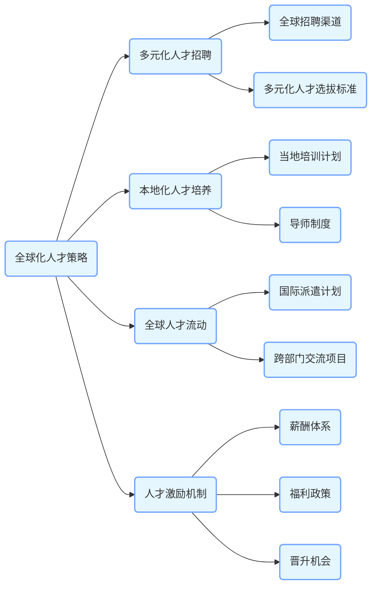

# 彼得林奇如何评估公司的全球化人才策略

> 关键词：彼得林奇、公司评估、全球化人才策略、人才管理、企业竞争力

> 摘要：本文深入探讨了彼得林奇评估公司全球化人才策略的方法和要点。从背景介绍入手，阐述了理解这一评估方法的目的、预期读者、文档结构和相关术语。详细讲解了核心概念，包括全球化人才策略的原理和架构，并以流程图呈现。通过核心算法原理和具体操作步骤，结合Python代码进行说明。引入数学模型和公式对评估过程进行量化分析。以实际项目案例展示了评估的具体应用，包括开发环境搭建、代码实现和解读。探讨了全球化人才策略的实际应用场景，推荐了相关的学习资源、开发工具框架和论文著作。最后总结了未来发展趋势与挑战，解答常见问题并提供扩展阅读和参考资料，旨在帮助读者全面了解彼得林奇评估公司全球化人才策略的思路和方法。

## 1. 背景介绍 
### 1.1 目的和范围
彼得林奇作为投资界的传奇人物，其投资理念和评估公司的方法备受关注。本文章的目的在于深入剖析彼得林奇如何评估公司的全球化人才策略，为投资者、企业管理者以及对人才管理和企业评估感兴趣的人士提供有价值的参考。我们将探讨全球化人才策略的各个方面，包括人才招聘、培养、保留和利用等，以及这些策略如何影响公司的长期发展和竞争力。范围涵盖了不同行业和规模的公司，旨在提供具有普遍性和实用性的评估方法。

### 1.2 预期读者
本文的预期读者包括以下几类人群：
- 投资者：希望通过了解公司的全球化人才策略来评估公司的投资价值，以便做出更明智的投资决策。
- 企业管理者：包括人力资源经理、CEO等，他们可以借鉴彼得林奇的评估方法来优化公司的人才策略，提高企业的竞争力。
- 学者和研究人员：对人才管理和企业评估领域感兴趣的学者和研究人员，可以从本文中获取新的研究思路和方法。
- 学生：学习商业、管理、金融等相关专业的学生，可以通过本文加深对企业人才策略和评估方法的理解。

### 1.3 文档结构概述
本文将按照以下结构进行阐述：
- 核心概念与联系：介绍全球化人才策略的核心概念，包括其原理和架构，并通过文本示意图和Mermaid流程图进行展示。
- 核心算法原理 & 具体操作步骤：讲解彼得林奇评估公司全球化人才策略的核心算法原理，并给出具体的操作步骤，同时使用Python代码进行详细阐述。
- 数学模型和公式 & 详细讲解 & 举例说明：引入数学模型和公式对评估过程进行量化分析，并通过具体例子进行说明。
- 项目实战：代码实际案例和详细解释说明，包括开发环境搭建、源代码详细实现和代码解读。
- 实际应用场景：探讨全球化人才策略在不同行业和场景中的实际应用。
- 工具和资源推荐：推荐相关的学习资源、开发工具框架和论文著作。
- 总结：未来发展趋势与挑战：总结全球化人才策略的未来发展趋势，并分析可能面临的挑战。
- 附录：常见问题与解答：解答读者在阅读过程中可能遇到的常见问题。
- 扩展阅读 & 参考资料：提供相关的扩展阅读材料和参考资料，方便读者进一步深入学习。

### 1.4 术语表
#### 1.4.1 核心术语定义
- 全球化人才策略：指公司为了适应全球化发展的需要，在全球范围内吸引、培养、保留和利用优秀人才的一系列政策和措施。
- 人才招聘：公司通过各种渠道吸引符合岗位要求的人才加入公司的过程。
- 人才培养：公司为了提高员工的能力和素质，通过培训、教育、实践等方式对员工进行培养和发展的过程。
- 人才保留：公司采取各种措施留住优秀人才，减少人才流失的过程。
- 人才利用：公司将人才的能力和潜力充分发挥出来，为公司创造价值的过程。

#### 1.4.2 相关概念解释
- 多元化人才：指具有不同文化背景、教育背景、专业技能和工作经验的人才。
- 本地化人才：指在当地具有丰富人脉资源、熟悉当地市场和文化的人才。
- 人才供应链：指公司为了满足业务发展的需要，建立的一个从人才招聘、培养、保留到利用的完整的人才供应体系。

#### 1.4.3 缩略词列表
- HR：Human Resources，人力资源
- CEO：Chief Executive Officer，首席执行官
- ROI：Return on Investment，投资回报率

## 2. 核心概念与联系 
### 核心概念原理
全球化人才策略的核心原理是通过在全球范围内整合人才资源，提高公司的创新能力、竞争力和适应能力。具体来说，全球化人才策略包括以下几个方面：
- 多元化人才招聘：公司通过在全球范围内招聘具有不同文化背景、教育背景、专业技能和工作经验的人才，为公司带来多元化的思维和创新能力。
- 本地化人才培养：公司在当地培养具有丰富人脉资源、熟悉当地市场和文化的人才，以便更好地适应当地市场的需求。
- 全球人才流动：公司鼓励员工在全球范围内流动，促进不同地区之间的知识和经验交流，提高公司的整体运营效率。
- 人才激励机制：公司建立完善的人才激励机制，包括薪酬、福利、晋升机会等，以吸引和留住优秀人才。

### 架构的文本示意图
全球化人才策略的架构可以用以下文本示意图表示：
```plaintext
全球化人才策略
|-- 多元化人才招聘
|   |-- 全球招聘渠道
|   |-- 多元化人才选拔标准
|-- 本地化人才培养
|   |-- 当地培训计划
|   |-- 导师制度
|-- 全球人才流动
|   |-- 国际派遣计划
|   |-- 跨部门交流项目
|-- 人才激励机制
|   |-- 薪酬体系
|   |-- 福利政策
|   |-- 晋升机会
```

### Mermaid流程图


## 3. 核心算法原理 & 具体操作步骤 
### 核心算法原理
彼得林奇评估公司全球化人才策略的核心算法原理是通过综合考虑多个因素，对公司的人才策略进行量化评估。这些因素包括人才招聘的效果、人才培养的投入和产出、人才保留的情况以及人才利用的效率等。具体来说，我们可以使用以下公式来计算公司全球化人才策略的综合得分：

$$
S = \alpha_1 \times R + \alpha_2 \times T + \alpha_3 \times K + \alpha_4 \times U
$$

其中，$S$ 表示公司全球化人才策略的综合得分，$R$ 表示人才招聘的效果得分，$T$ 表示人才培养的投入产出比得分，$K$ 表示人才保留的情况得分，$U$ 表示人才利用的效率得分，$\alpha_1$、$\alpha_2$、$\alpha_3$、$\alpha_4$ 分别表示各因素的权重，且 $\alpha_1 + \alpha_2 + \alpha_3 + \alpha_4 = 1$。

### 具体操作步骤
以下是彼得林奇评估公司全球化人才策略的具体操作步骤：
1. **数据收集**：收集公司在人才招聘、培养、保留和利用等方面的数据，包括招聘人数、招聘成本、培训投入、员工流失率、员工绩效等。
2. **指标计算**：根据收集到的数据，计算人才招聘的效果得分、人才培养的投入产出比得分、人才保留的情况得分和人才利用的效率得分。
3. **权重确定**：根据公司的战略目标和重点，确定各因素的权重 $\alpha_1$、$\alpha_2$、$\alpha_3$、$\alpha_4$。
4. **综合得分计算**：将各因素的得分和权重代入公式，计算公司全球化人才策略的综合得分。
5. **评估结果分析**：根据综合得分，对公司的全球化人才策略进行评估和分析，找出存在的问题和不足之处，并提出改进建议。

### Python源代码详细阐述
```python
# 假设我们已经收集到了以下数据
# 人才招聘的效果得分
recruitment_score = 80
# 人才培养的投入产出比得分
training_score = 70
# 人才保留的情况得分
retention_score = 75
# 人才利用的效率得分
utilization_score = 85

# 确定各因素的权重
alpha_1 = 0.3
alpha_2 = 0.2
alpha_3 = 0.2
alpha_4 = 0.3

# 计算公司全球化人才策略的综合得分
overall_score = alpha_1 * recruitment_score + alpha_2 * training_score + alpha_3 * retention_score + alpha_4 * utilization_score

print(f"公司全球化人才策略的综合得分是: {overall_score}")
```

在上述代码中，我们首先假设已经收集到了人才招聘的效果得分、人才培养的投入产出比得分、人才保留的情况得分和人才利用的效率得分。然后，我们确定了各因素的权重，并将各因素的得分和权重代入公式，计算出公司全球化人才策略的综合得分。最后，我们使用 `print` 函数输出综合得分。

## 4. 数学模型和公式 & 详细讲解 & 举例说明 
### 数学模型和公式
在前面的核心算法原理中，我们已经介绍了计算公司全球化人才策略综合得分的公式：

$$
S = \alpha_1 \times R + \alpha_2 \times T + \alpha_3 \times K + \alpha_4 \times U
$$

其中，$S$ 表示公司全球化人才策略的综合得分，$R$ 表示人才招聘的效果得分，$T$ 表示人才培养的投入产出比得分，$K$ 表示人才保留的情况得分，$U$ 表示人才利用的效率得分，$\alpha_1$、$\alpha_2$、$\alpha_3$、$\alpha_4$ 分别表示各因素的权重，且 $\alpha_1 + \alpha_2 + \alpha_3 + \alpha_4 = 1$。

### 详细讲解
- **人才招聘的效果得分 $R$**：可以通过招聘人数、招聘成本、招聘质量等指标来计算。例如，招聘人数越多、招聘成本越低、招聘质量越高，则人才招聘的效果得分越高。
- **人才培养的投入产出比得分 $T$**：可以通过培训投入、员工绩效提升等指标来计算。例如，培训投入越高、员工绩效提升越大，则人才培养的投入产出比得分越高。
- **人才保留的情况得分 $K$**：可以通过员工流失率、员工满意度等指标来计算。例如，员工流失率越低、员工满意度越高，则人才保留的情况得分越高。
- **人才利用的效率得分 $U$**：可以通过员工的工作效率、创新能力等指标来计算。例如，员工的工作效率越高、创新能力越强，则人才利用的效率得分越高。

### 举例说明
假设某公司在人才招聘、培养、保留和利用等方面的情况如下：
- 人才招聘的效果得分 $R = 85$
- 人才培养的投入产出比得分 $T = 70$
- 人才保留的情况得分 $K = 75$
- 人才利用的效率得分 $U = 80$

各因素的权重分别为：
- $\alpha_1 = 0.3$
- $\alpha_2 = 0.2$
- $\alpha_3 = 0.2$
- $\alpha_4 = 0.3$

将上述数据代入公式，可得：

$$
\begin{align*}
S &= \alpha_1 \times R + \alpha_2 \times T + \alpha_3 \times K + \alpha_4 \times U\\
&= 0.3 \times 85 + 0.2 \times 70 + 0.2 \times 75 + 0.3 \times 80\\
&= 25.5 + 14 + 15 + 24\\
&= 78.5
\end{align*}
$$

因此，该公司全球化人才策略的综合得分是 78.5。根据这个得分，我们可以对该公司的全球化人才策略进行评估和分析，找出存在的问题和不足之处，并提出改进建议。

## 5. 项目实战：代码实际案例和详细解释说明 
### 5.1  开发环境搭建
为了实现彼得林奇评估公司全球化人才策略的代码，我们需要搭建以下开发环境：
- **Python环境**：建议使用Python 3.7及以上版本。可以从Python官方网站（https://www.python.org/downloads/）下载并安装。
- **开发工具**：可以使用任何文本编辑器或集成开发环境（IDE），如PyCharm、VS Code等。

### 5.2  源代码详细实现和代码解读
以下是一个完整的Python代码示例，用于实现彼得林奇评估公司全球化人才策略的功能：

```python
# 定义一个函数来计算公司全球化人才策略的综合得分
def calculate_overall_score(recruitment_score, training_score, retention_score, utilization_score, alpha_1, alpha_2, alpha_3, alpha_4):
    """
    计算公司全球化人才策略的综合得分

    参数:
    recruitment_score (float): 人才招聘的效果得分
    training_score (float): 人才培养的投入产出比得分
    retention_score (float): 人才保留的情况得分
    utilization_score (float): 人才利用的效率得分
    alpha_1 (float): 人才招聘因素的权重
    alpha_2 (float): 人才培养因素的权重
    alpha_3 (float): 人才保留因素的权重
    alpha_4 (float): 人才利用因素的权重

    返回:
    float: 公司全球化人才策略的综合得分
    """
    overall_score = alpha_1 * recruitment_score + alpha_2 * training_score + alpha_3 * retention_score + alpha_4 * utilization_score
    return overall_score

# 假设我们已经收集到了以下数据
recruitment_score = 80
training_score = 70
retention_score = 75
utilization_score = 85

# 确定各因素的权重
alpha_1 = 0.3
alpha_2 = 0.2
alpha_3 = 0.2
alpha_4 = 0.3

# 调用函数计算综合得分
overall_score = calculate_overall_score(recruitment_score, training_score, retention_score, utilization_score, alpha_1, alpha_2, alpha_3, alpha_4)

# 输出综合得分
print(f"公司全球化人才策略的综合得分是: {overall_score}")
```

### 代码解读与分析
- **函数定义**：`calculate_overall_score` 函数接受人才招聘的效果得分、人才培养的投入产出比得分、人才保留的情况得分、人才利用的效率得分以及各因素的权重作为参数，返回公司全球化人才策略的综合得分。
- **数据收集**：我们假设已经收集到了人才招聘的效果得分、人才培养的投入产出比得分、人才保留的情况得分和人才利用的效率得分，并将它们分别赋值给变量 `recruitment_score`、`training_score`、`retention_score` 和 `utilization_score`。
- **权重确定**：我们确定了各因素的权重，并将它们分别赋值给变量 `alpha_1`、`alpha_2`、`alpha_3` 和 `alpha_4`。
- **函数调用**：我们调用 `calculate_overall_score` 函数，将收集到的数据和确定的权重作为参数传入，计算公司全球化人才策略的综合得分。
- **结果输出**：我们使用 `print` 函数输出综合得分。

通过这个代码示例，我们可以看到如何使用Python实现彼得林奇评估公司全球化人才策略的功能。在实际应用中，我们可以根据具体情况修改数据和权重，以适应不同公司的需求。

## 6. 实际应用场景 
### 跨国企业的人才管理
对于跨国企业来说，全球化人才策略至关重要。通过评估公司的全球化人才策略，企业可以更好地吸引、培养和保留全球范围内的优秀人才，提高企业的创新能力和竞争力。例如，一家跨国科技公司可以通过在全球范围内招聘具有不同专业技能和文化背景的人才，为公司带来多元化的思维和创新能力。同时，公司可以在当地培养具有丰富人脉资源和熟悉当地市场的人才，以便更好地适应当地市场的需求。

### 投资决策
投资者在进行投资决策时，可以将公司的全球化人才策略作为一个重要的参考因素。一个拥有优秀全球化人才策略的公司，通常具有更强的创新能力和竞争力，未来的发展潜力也更大。例如，投资者在评估一家跨国制造企业时，可以通过分析该企业的人才招聘、培养和保留情况，判断其是否具有可持续发展的能力。

### 企业战略规划
企业在制定战略规划时，需要考虑到人才的因素。通过评估公司的全球化人才策略，企业可以了解自身在人才方面的优势和劣势，从而制定相应的战略规划。例如，一家企业发现自身在人才培养方面存在不足，可以制定相应的培训计划，加大对人才培养的投入，提高员工的能力和素质。

## 7. 工具和资源推荐
### 7.1 学习资源推荐
#### 7.1.1 书籍推荐
- 《彼得林奇的成功投资》：彼得林奇的经典著作，介绍了他的投资理念和方法，对理解如何评估公司具有重要的参考价值。
- 《人力资源管理》：全面介绍了人力资源管理的各个方面，包括人才招聘、培养、保留和利用等，对于深入了解全球化人才策略有很大的帮助。
- 《全球人才管理》：专门探讨了全球化背景下的人才管理问题，提供了许多实用的案例和方法。

#### 7.1.2 在线课程
- Coursera上的“人力资源管理专项课程”：由知名大学的教授授课，系统地介绍了人力资源管理的理论和实践。
- edX上的“全球人才战略”：该课程深入探讨了全球化人才策略的制定和实施，适合对全球化人才管理感兴趣的人士学习。

#### 7.1.3 技术博客和网站
- HR.com：提供了丰富的人力资源管理资讯和案例，包括全球化人才策略的相关内容。
- McKinsey & Company：麦肯锡公司的官方网站，发布了许多关于企业管理和人才战略的研究报告和文章。

### 7.2 开发工具框架推荐
#### 7.2.1 IDE和编辑器
- PyCharm：一款专业的Python集成开发环境，具有强大的代码编辑、调试和分析功能。
- VS Code：一款轻量级的代码编辑器，支持多种编程语言，并且有丰富的插件可以扩展功能。

#### 7.2.2 调试和性能分析工具
- pdb：Python自带的调试工具，可以帮助我们定位和解决代码中的问题。
- cProfile：Python的性能分析工具，可以帮助我们分析代码的运行时间和资源使用情况。

#### 7.2.3 相关框架和库
- Pandas：一个强大的数据处理和分析库，可以帮助我们处理和分析人才相关的数据。
- NumPy：一个用于科学计算的库，提供了高效的数组操作和数学函数。

### 7.3 相关论文著作推荐
#### 7.3.1 经典论文
- "The Global Talent Management Challenge"：该论文探讨了全球化背景下企业面临的人才管理挑战，并提出了相应的解决方案。
- "Talent Management: A Critical Review"：对人才管理的相关理论和实践进行了全面的回顾和分析。

#### 7.3.2 最新研究成果
- 关注顶尖学术期刊，如《Academy of Management Journal》、《Journal of International Business Studies》等，这些期刊会发表关于人才管理和全球化战略的最新研究成果。

#### 7.3.3 应用案例分析
- 《哈佛商业评论》上经常会发表一些企业的全球化人才策略应用案例，通过分析这些案例可以学习到实际的操作经验和方法。

## 8. 总结：未来发展趋势与挑战
### 未来发展趋势
- **数字化转型加速**：随着科技的不断发展，企业的全球化人才策略将越来越依赖于数字化技术。例如，通过在线招聘平台、虚拟培训课程等方式，企业可以更高效地吸引和培养全球范围内的人才。
- **多元化和包容性增强**：未来的企业将更加注重多元化和包容性，不仅要招聘具有不同文化背景的人才，还要营造一个包容和尊重差异的工作环境，以充分发挥人才的潜力。
- **人才与业务的深度融合**：企业将更加注重人才与业务的深度融合，根据业务需求来制定人才策略，确保人才能够为企业的战略目标做出贡献。

### 挑战
- **文化差异管理**：在全球化人才管理中，文化差异是一个不可忽视的问题。不同文化背景的人才在价值观、工作方式等方面存在差异，企业需要采取有效的措施来管理这些差异，避免文化冲突。
- **人才竞争加剧**：随着全球化的发展，人才竞争将越来越激烈。企业需要不断提高自身的吸引力和竞争力，才能吸引和留住优秀人才。
- **数据安全和隐私保护**：在数字化转型的过程中，企业需要处理大量的人才数据。如何确保数据的安全和隐私，是企业面临的一个重要挑战。

## 9. 附录：常见问题与解答
### 问题1：如何确定各因素的权重？
各因素的权重可以根据公司的战略目标和重点来确定。例如，如果公司当前的重点是拓展国际市场，那么人才招聘的效果得分的权重可以适当提高；如果公司注重员工的长期发展，那么人才培养的投入产出比得分的权重可以适当提高。一般来说，可以通过专家评估、历史数据分析等方法来确定各因素的权重。

### 问题2：如何收集人才相关的数据？
可以通过以下几种方式收集人才相关的数据：
- **人力资源管理系统**：企业的人力资源管理系统通常会记录员工的基本信息、招聘信息、培训信息、绩效信息等，可以从中提取所需的数据。
- **问卷调查**：可以通过问卷调查的方式收集员工的满意度、工作效率等信息。
- **第三方数据提供商**：一些第三方数据提供商可以提供行业内的人才数据，如人才流动率、薪酬水平等。

### 问题3：评估结果的准确性如何保证？
为了保证评估结果的准确性，可以采取以下措施：
- **数据准确性**：确保收集到的数据准确无误，可以通过多次核对、交叉验证等方式来提高数据的准确性。
- **指标合理性**：选择合理的评估指标，确保这些指标能够全面、客观地反映公司的全球化人才策略。
- **权重合理性**：合理确定各因素的权重，避免权重分配不合理导致评估结果偏差。

## 10. 扩展阅读 & 参考资料
### 扩展阅读
- 《基业长青》：探讨了企业如何实现长期发展的问题，其中涉及到人才管理和企业文化等方面的内容。
- 《从优秀到卓越》：分析了优秀企业如何实现向卓越企业的跨越，对企业的人才战略有一定的启示作用。

### 参考资料
- 彼得林奇的相关著作和演讲
- 各大企业的年度报告和人才战略规划
- 相关学术期刊和研究报告