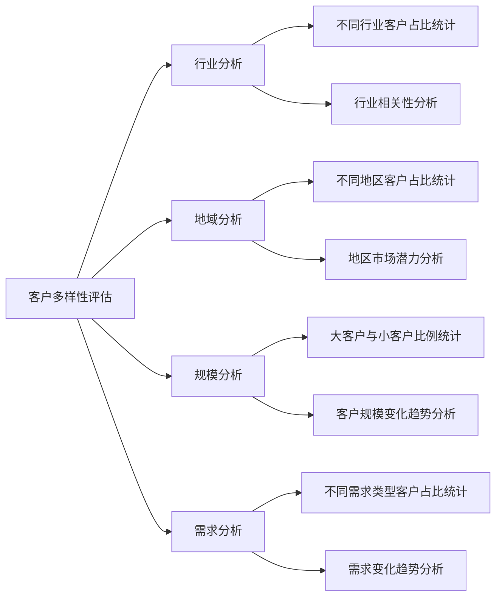

# 彼得林奇如何评估公司的客户多样性

> 关键词：彼得林奇、公司评估、客户多样性、投资分析、财务分析、市场调研、竞争优势

> 摘要：本文深入探讨彼得林奇评估公司客户多样性的方法与理念。彼得林奇作为投资界的传奇人物，其对公司客户多样性的评估在投资决策中占据重要地位。通过分析客户多样性，能洞察公司的市场地位、抗风险能力以及成长潜力。文章将详细阐述彼得林奇评估客户多样性的背景、核心概念、具体方法，结合数学模型与实际案例进行讲解，并探讨其在实际应用场景中的作用，同时推荐相关学习资源和工具，最后总结未来发展趋势与挑战，为投资者和企业管理者提供有价值的参考。

## 1. 背景介绍 
### 1.1 目的和范围
本文旨在全面解析彼得林奇评估公司客户多样性的方法，帮助投资者更好地理解公司的经营状况和潜在风险，从而做出更明智的投资决策。同时，也为企业管理者提供借鉴，使其认识到客户多样性对公司可持续发展的重要性，并思考如何优化客户结构。范围涵盖彼得林奇评估客户多样性的各个方面，包括理论基础、具体操作方法、实际应用案例以及相关的工具和资源。

### 1.2 预期读者
本文的预期读者包括对投资领域感兴趣的个人投资者、专业投资机构的分析师和基金经理、企业管理者以及相关领域的研究人员。无论是希望提升投资能力的新手投资者，还是寻求深入了解公司经营策略的企业管理者，都能从本文中获取有价值的信息。

### 1.3 文档结构概述
本文将按照以下结构展开：首先介绍核心概念与联系，阐述客户多样性的定义、重要性以及与公司其他方面的关系；接着详细讲解彼得林奇评估客户多样性的核心算法原理和具体操作步骤，并结合 Python 源代码进行说明；然后介绍相关的数学模型和公式，并通过举例进行详细讲解；之后通过项目实战，给出代码实际案例并进行详细解释说明；再探讨客户多样性评估在实际应用场景中的作用；推荐相关的工具和资源；最后总结未来发展趋势与挑战，提供常见问题与解答以及扩展阅读和参考资料。

### 1.4 术语表
#### 1.4.1 核心术语定义
- **客户多样性**：指公司客户群体在行业、地域、规模、需求等方面的差异程度。具有多样性的客户群体意味着公司不依赖于单一客户或少数客户群体，从而降低经营风险。
- **客户集中度**：与客户多样性相反，指公司的业务集中于少数几个大客户的程度。客户集中度越高，公司对这些大客户的依赖程度就越高，经营风险也相对较大。
- **投资护城河**：由巴菲特提出的概念，指企业抵御竞争对手的可持续竞争优势。客户多样性可以被视为一种投资护城河，因为多样化的客户群体可以增强公司的抗风险能力和市场竞争力。

#### 1.4.2 相关概念解释
- **市场细分**：将整个市场按照不同的特征（如消费者需求、购买行为、地理区域等）划分为若干个具有相似需求和特征的子市场的过程。公司通过市场细分，可以更好地了解不同客户群体的需求，从而有针对性地进行市场营销和产品开发，提高客户多样性。
- **客户关系管理（CRM）**：企业为提高核心竞争力，利用相应的信息技术以及互联网技术来协调企业与顾客间在销售、营销和服务上的交互，从而提升其管理方式，向客户提供创新式的个性化的客户交互和服务的过程。有效的 CRM 可以帮助公司更好地维护客户关系，拓展客户群体，促进客户多样性的提升。

#### 1.4.3 缩略词列表
- **CRM**：Customer Relationship Management（客户关系管理）
- **ROE**：Return on Equity（净资产收益率）

## 2. 核心概念与联系 

### 2.1 客户多样性的定义和重要性
客户多样性是指公司客户群体在多个维度上的差异程度。这些维度包括但不限于行业、地域、规模、需求等。例如，一家软件公司的客户可能来自金融、医疗、教育等不同行业，分布在不同的国家和地区，具有不同的规模和需求特点。

客户多样性对公司具有重要意义。首先，它可以降低公司的经营风险。如果公司的客户集中在少数几个行业或大客户身上，一旦这些行业出现波动或大客户流失，公司的业绩将受到严重影响。而多样化的客户群体可以分散风险，使公司在面对市场变化时更加稳健。其次，客户多样性有助于公司发现新的市场机会。不同的客户群体可能有不同的需求和偏好，通过满足这些多样化的需求，公司可以开拓新的市场领域，实现业务的增长。最后，客户多样性还可以提升公司的创新能力。与不同类型的客户合作，公司可以接触到不同的观点和想法，从而激发创新思维，推动产品和服务的升级。

### 2.2 客户多样性与公司其他方面的关系
客户多样性与公司的多个方面密切相关。与财务状况方面，客户多样性可以影响公司的收入稳定性和盈利能力。具有多样化客户群体的公司通常收入更加稳定，因为不同客户群体的需求在不同时期可能会有所波动，相互补充可以减少收入的大幅波动。同时，多样化的客户群体也可以为公司带来更多的收入来源，提高盈利能力。

在市场竞争力方面，客户多样性是公司竞争优势的重要体现。多样化的客户群体意味着公司能够满足不同客户的需求，具有更广泛的市场覆盖范围，从而在市场竞争中占据更有利的地位。此外，客户多样性还可以增强公司的品牌影响力，因为与不同类型的客户合作可以提高公司的知名度和美誉度。

与产品和服务创新方面，客户多样性为公司的创新提供了丰富的灵感来源。不同客户群体的需求和反馈可以促使公司不断改进产品和服务，推出更符合市场需求的创新产品。例如，苹果公司通过满足不同消费者群体（如普通消费者、企业用户、创意工作者等）的需求，不断推出创新的产品和服务，保持了在市场上的领先地位。

### 2.3 彼得林奇评估客户多样性的理念
彼得林奇认为，客户多样性是评估公司投资价值的重要因素之一。他强调要深入了解公司的客户群体，包括客户的行业分布、地域分布、规模大小等。通过分析客户多样性，他可以判断公司的经营风险、市场竞争力和成长潜力。

彼得林奇注重实地调研，他会亲自走访公司的客户，了解他们对公司产品和服务的评价，以及与公司的合作情况。他认为，只有通过深入了解客户，才能真正了解公司的业务和市场地位。此外，他还会关注公司的客户获取和维护策略，评估公司在拓展客户群体方面的能力和潜力。

### 2.4 核心概念原理和架构的文本示意图
```plaintext
客户多样性
|-- 行业维度
|   |-- 不同行业客户占比
|   |-- 行业相关性分析
|-- 地域维度
|   |-- 不同地区客户占比
|   |-- 地区市场潜力分析
|-- 规模维度
|   |-- 大客户与小客户比例
|   |-- 客户规模变化趋势
|-- 需求维度
|   |-- 不同需求类型客户占比
|   |-- 需求变化趋势分析
```

### 2.5 Mermaid 流程图


## 3. 核心算法原理 & 具体操作步骤 

### 3.1 核心算法原理
彼得林奇评估客户多样性的核心算法原理基于对客户数据的统计和分析。通过收集公司的客户信息，包括客户所属行业、地域、规模、需求等，然后对这些数据进行分类和计算，得出不同维度的客户多样性指标。

例如，在行业维度，可以计算不同行业客户的销售额占比，通过分析这些占比的分布情况来评估客户在行业上的多样性。如果公司的销售额主要集中在少数几个行业，说明客户的行业多样性较低；反之，如果销售额分布在多个不同行业，说明客户的行业多样性较高。

在地域维度，可以计算不同地区客户的销售额占比或客户数量占比，分析地区市场的分布情况和潜力。对于规模维度，可以统计大客户和小客户的数量或销售额比例，以及客户规模的变化趋势。在需求维度，可以对客户的需求类型进行分类，计算不同需求类型客户的占比和需求变化趋势。

### 3.2 具体操作步骤

#### 3.2.1 数据收集
首先，需要收集公司的客户信息。这些信息可以从公司的财务报表、销售记录、客户关系管理系统（CRM）等渠道获取。具体需要收集的信息包括：
- 客户名称
- 客户所属行业
- 客户所在地区
- 客户的规模（如销售额、员工数量等）
- 客户的需求类型

#### 3.2.2 数据整理和分类
将收集到的客户信息进行整理和分类。根据行业分类标准（如 SIC 码、GB/T 4754 等）对客户所属行业进行分类；根据地理位置对客户所在地区进行划分；根据销售额或员工数量等指标对客户规模进行划分；根据客户的需求特点对需求类型进行分类。

#### 3.2.3 计算多样性指标
- **行业多样性指标**：计算不同行业客户的销售额占比，常用的指标有赫芬达尔 - 赫希曼指数（HHI）。HHI 的计算公式为：
$$HHI=\sum_{i = 1}^{n}s_{i}^{2}$$
其中，$s_{i}$ 表示第 $i$ 个行业客户的销售额占总销售额的比例，$n$ 表示行业的数量。HHI 的取值范围在 0 到 1 之间，值越接近 0 表示客户的行业多样性越高，值越接近 1 表示客户的行业多样性越低。

- **地域多样性指标**：计算不同地区客户的销售额占比或客户数量占比，同样可以使用 HHI 指数来评估地域多样性。

- **规模多样性指标**：统计大客户和小客户的数量或销售额比例，分析客户规模的分布情况。可以计算大客户销售额占总销售额的比例，比例越低说明客户规模越多样化。

- **需求多样性指标**：计算不同需求类型客户的占比，分析需求类型的分布情况。

#### 3.2.4 分析和评估
根据计算得到的多样性指标，对公司的客户多样性进行分析和评估。结合行业特点、市场环境等因素，判断公司的客户多样性是否合理，是否存在潜在的风险。例如，如果公司的 HHI 指数较高，说明客户集中在少数几个行业或地区，可能面临较大的经营风险；如果大客户销售额占比过高，公司对大客户的依赖程度较大，一旦大客户流失，将对公司业绩产生重大影响。

### 3.3 Python 源代码实现
```python
import pandas as pd

# 模拟客户数据
data = {
    '客户名称': ['客户1', '客户2', '客户3', '客户4', '客户5'],
    '所属行业': ['金融', '医疗', '金融', '教育', '医疗'],
    '所在地区': ['北京', '上海', '北京', '广州', '上海'],
    '销售额': [100, 200, 150, 50, 100]
}

df = pd.DataFrame(data)

# 计算行业多样性指标（HHI）
industry_sales = df.groupby('所属行业')['销售额'].sum()
total_sales = industry_sales.sum()
industry_shares = industry_sales / total_sales
hhi_industry = (industry_shares ** 2).sum()

# 计算地域多样性指标（HHI）
region_sales = df.groupby('所在地区')['销售额'].sum()
region_shares = region_sales / total_sales
hhi_region = (region_shares ** 2).sum()

print(f"行业多样性 HHI: {hhi_industry}")
print(f"地域多样性 HHI: {hhi_region}")
```

在上述代码中，首先使用 Pandas 库创建了一个模拟的客户数据集。然后，通过分组计算不同行业和地区的销售额，进而计算出销售额占比。最后，根据 HHI 指数的计算公式计算出行业和地域的多样性指标，并打印输出结果。

## 4. 数学模型和公式 & 详细讲解 & 举例说明 

### 4.1 赫芬达尔 - 赫希曼指数（HHI）
赫芬达尔 - 赫希曼指数（HHI）是一种常用的衡量市场集中度或多样性的指标。在评估客户多样性时，HHI 可以用来衡量客户在行业、地域等维度上的集中程度。

#### 4.1.1 公式
$$HHI=\sum_{i = 1}^{n}s_{i}^{2}$$
其中，$s_{i}$ 表示第 $i$ 个分类（如行业、地区等）的客户销售额占总销售额的比例，$n$ 表示分类的数量。

#### 4.1.2 详细讲解
HHI 的取值范围在 0 到 1 之间。当 HHI 接近 0 时，表示客户在各个分类上的分布非常均匀，多样性很高；当 HHI 接近 1 时，表示客户集中在少数几个分类上，多样性很低。例如，如果一个公司的所有客户都来自同一个行业，那么该行业的销售额占比为 1，其他行业的销售额占比为 0，此时 HHI = 1，说明客户的行业多样性极低。

#### 4.1.3 举例说明
假设一个公司有三个客户，分别来自金融、医疗和教育行业，销售额分别为 200、300 和 500。则总销售额为 200 + 300 + 500 = 1000。

金融行业客户销售额占比 $s_1=\frac{200}{1000}=0.2$
医疗行业客户销售额占比 $s_2=\frac{300}{1000}=0.3$
教育行业客户销售额占比 $s_3=\frac{500}{1000}=0.5$

HHI 指数为：
$$HHI = 0.2^2 + 0.3^2 + 0.5^2 = 0.04 + 0.09 + 0.25 = 0.38$$

### 4.2 客户集中度指标
除了 HHI 指数，客户集中度指标也可以用来评估客户多样性。客户集中度通常用大客户销售额占总销售额的比例来表示。

#### 4.2.1 公式
$$客户集中度=\frac{大客户销售额}{总销售额}$$
其中，大客户的定义可以根据具体情况确定，例如销售额排名前几位的客户。

#### 4.2.2 详细讲解
客户集中度越高，说明公司对大客户的依赖程度越大，经营风险也相对较高。如果大客户流失或减少订单，公司的业绩将受到较大影响。因此，较低的客户集中度通常意味着较高的客户多样性和较低的经营风险。

#### 4.2.3 举例说明
假设一个公司的总销售额为 1000 万元，其中前三大客户的销售额分别为 300 万元、250 万元和 200 万元。则大客户销售额为 300 + 250 + 200 = 750 万元。

客户集中度为：
$$客户集中度=\frac{750}{1000}=0.75$$

这表明该公司的客户集中度较高，对大客户的依赖程度较大，需要关注大客户的稳定性。

## 5. 项目实战：代码实际案例和详细解释说明 

### 5.1  开发环境搭建
为了实现客户多样性评估的代码，我们需要搭建一个 Python 开发环境。以下是具体的步骤：

#### 5.1.1 安装 Python
首先，从 Python 官方网站（https://www.python.org/downloads/）下载并安装 Python 3.x 版本。安装过程中，建议勾选“Add Python to PATH”选项，以便在命令行中可以直接使用 Python 命令。

#### 5.1.2 安装必要的库
我们需要安装 Pandas 库来处理和分析数据。可以使用以下命令在命令行中安装 Pandas：
```sh
pip install pandas
```

### 5.2  源代码详细实现和代码解读

```python
import pandas as pd

# 读取客户数据文件（假设数据文件为 CSV 格式）
data = pd.read_csv('customer_data.csv')

# 计算行业多样性指标（HHI）
industry_sales = data.groupby('所属行业')['销售额'].sum()
total_sales = industry_sales.sum()
industry_shares = industry_sales / total_sales
hhi_industry = (industry_shares ** 2).sum()

# 计算地域多样性指标（HHI）
region_sales = data.groupby('所在地区')['销售额'].sum()
region_shares = region_sales / total_sales
hhi_region = (region_shares ** 2).sum()

# 计算客户集中度指标
top_customers = data.nlargest(3, '销售额')  # 选取销售额排名前 3 的客户
top_sales = top_customers['销售额'].sum()
customer_concentration = top_sales / total_sales

# 输出结果
print(f"行业多样性 HHI: {hhi_industry}")
print(f"地域多样性 HHI: {hhi_region}")
print(f"客户集中度: {customer_concentration}")
```

#### 代码解读
1. **数据读取**：使用 `pd.read_csv` 函数读取存储客户数据的 CSV 文件，将数据加载到 Pandas 的 DataFrame 中。
2. **行业多样性指标计算**：
    - 使用 `groupby` 方法按所属行业对数据进行分组，并计算每个行业的销售额总和。
    - 计算总销售额。
    - 计算每个行业的销售额占比。
    - 根据 HHI 指数的计算公式计算行业多样性 HHI 指数。
3. **地域多样性指标计算**：
    - 与行业多样性指标计算类似，按所在地区对数据进行分组，计算每个地区的销售额总和。
    - 计算每个地区的销售额占比。
    - 计算地域多样性 HHI 指数。
4. **客户集中度指标计算**：
    - 使用 `nlargest` 方法选取销售额排名前 3 的客户。
    - 计算这些大客户的销售额总和。
    - 计算大客户销售额占总销售额的比例，即客户集中度。
5. **结果输出**：使用 `print` 函数输出计算得到的行业多样性 HHI 指数、地域多样性 HHI 指数和客户集中度指标。

### 5.3  代码解读与分析
通过上述代码，我们可以对公司的客户多样性进行量化评估。行业多样性 HHI 指数和地域多样性 HHI 指数可以反映客户在行业和地域上的集中程度，值越低说明客户多样性越高。客户集中度指标可以反映公司对大客户的依赖程度，值越低说明公司对大客户的依赖越小，经营风险相对较低。

在实际应用中，我们可以根据计算结果对公司的客户结构进行分析和优化。如果行业多样性 HHI 指数较高，说明公司的客户集中在少数几个行业，可能面临行业波动的风险，公司可以考虑拓展其他行业的客户；如果客户集中度较高，公司可以加强对中小客户的开发和维护，降低对大客户的依赖。

## 6. 实际应用场景 

### 6.1 投资决策
在投资决策中，客户多样性是评估公司投资价值的重要因素之一。投资者可以通过分析公司的客户多样性来判断公司的经营风险和成长潜力。具有多样化客户群体的公司通常具有更强的抗风险能力和更广阔的市场空间，其业绩相对更加稳定。例如，一家食品公司的客户涵盖了超市、便利店、餐厅、电商平台等多个渠道，分布在不同的地区，那么该公司在面对某一渠道或地区的市场波动时，受到的影响相对较小。投资者在选择投资标的时，可以优先考虑客户多样性较高的公司，以降低投资风险。

### 6.2 企业战略规划
对于企业管理者来说，客户多样性评估可以为企业战略规划提供重要依据。通过了解客户在行业、地域、规模、需求等方面的分布情况，企业可以发现潜在的市场机会，制定针对性的市场拓展策略。例如，如果企业发现某个地区的客户数量较少，但市场潜力较大，就可以加大在该地区的市场推广力度；如果发现某个行业的客户需求增长较快，就可以加大对该行业的产品研发和市场投入。此外，客户多样性评估还可以帮助企业优化客户结构，降低对大客户的依赖，提高企业的经营稳定性。

### 6.3 风险管理
客户多样性在企业风险管理中也起着重要作用。集中的客户群体可能使企业面临较高的风险，如大客户流失、行业衰退等。通过评估客户多样性，企业可以识别潜在的风险点，并采取相应的风险应对措施。例如，企业可以通过拓展新客户、优化客户组合等方式来降低客户集中度，分散经营风险。同时，企业还可以加强对大客户的关系管理，提高大客户的满意度和忠诚度，降低大客户流失的风险。

### 6.4 市场竞争分析
客户多样性可以反映企业在市场中的竞争地位。具有多样化客户群体的企业通常能够更好地满足不同客户的需求，具有更强的市场竞争力。在市场竞争分析中，企业可以通过比较自身与竞争对手的客户多样性，找出自身的优势和劣势，制定差异化的竞争策略。例如，如果企业发现竞争对手在某个行业或地区的客户份额较大，而自身在该领域的客户较少，就可以针对性地制定市场竞争策略，争夺该领域的客户资源。

## 7. 工具和资源推荐
### 7.1 学习资源推荐
#### 7.1.1 书籍推荐
- 《彼得林奇的成功投资》：彼得林奇的经典著作，详细阐述了他的投资理念和方法，包括如何评估公司的基本面和投资价值，对理解客户多样性评估在投资中的应用具有重要参考价值。
- 《聪明的投资者》：本杰明·格雷厄姆的著作，被誉为投资领域的圣经。书中介绍了价值投资的基本原理和方法，对投资者的思维方式和投资决策具有重要指导意义。
- 《财务报表分析与证券定价》：全面介绍了财务报表分析的方法和技术，以及如何利用财务报表信息进行证券定价。对于深入理解公司的财务状况和客户多样性对财务指标的影响有很大帮助。

#### 7.1.2 在线课程
- Coursera 平台上的“投资学原理”课程：由知名高校的教授授课，系统介绍投资学的基本原理和方法，包括公司分析、投资组合管理等内容。
- edX 平台上的“财务报表分析”课程：讲解财务报表分析的技巧和方法，帮助学习者掌握如何从财务报表中获取有用信息，评估公司的经营状况和投资价值。
- 中国大学 MOOC 平台上的“企业战略管理”课程：介绍企业战略管理的基本理论和方法，包括市场分析、战略规划等内容，对于理解客户多样性在企业战略中的应用有一定帮助。

#### 7.1.3 技术博客和网站
- Seeking Alpha：一个提供股票分析、投资建议和市场评论的网站，有很多专业投资者和分析师分享他们的研究成果和投资观点，可以从中获取关于公司客户多样性评估的相关信息。
- 雪球网：国内知名的投资社区，汇聚了大量的投资者和投资爱好者。在雪球网上可以找到很多关于公司分析和投资讨论的内容，对于了解客户多样性在投资中的应用有一定参考价值。
- 金融界网站：提供丰富的金融资讯和上市公司信息，包括公司的财务报表、行业分析等内容，有助于深入了解公司的客户群体和市场地位。

### 7.2 开发工具框架推荐
#### 7.2.1 IDE和编辑器
- PyCharm：一款专业的 Python 集成开发环境（IDE），具有强大的代码编辑、调试和分析功能，适合开发和调试客户多样性评估相关的 Python 代码。
- Jupyter Notebook：一种交互式的开发环境，支持多种编程语言，特别适合数据探索和分析。可以使用 Jupyter Notebook 进行客户数据的可视化分析和模型验证。
- Visual Studio Code：一款轻量级的代码编辑器，支持多种编程语言和插件扩展。可以安装 Python 相关的插件，使其成为一个功能强大的 Python 开发工具。

#### 7.2.2 调试和性能分析工具
- PDB：Python 内置的调试器，可以帮助开发者在代码执行过程中进行调试，查找和解决代码中的问题。
- cProfile：Python 标准库中的性能分析工具，可以统计代码的执行时间和函数调用次数，帮助开发者找出代码中的性能瓶颈。
- Py-Spy：一个用于分析 Python 程序性能的工具，可以实时查看 Python 程序的 CPU 使用率和函数调用栈，帮助开发者优化代码性能。

#### 7.2.3 相关框架和库
- Pandas：一个强大的数据处理和分析库，提供了丰富的数据结构和数据操作方法，适合处理和分析客户数据。
- NumPy：一个用于科学计算的 Python 库，提供了高效的数组操作和数学函数，可用于客户数据的数值计算和分析。
- Matplotlib：一个用于数据可视化的 Python 库，可以将客户数据以图表的形式展示出来，帮助开发者更直观地理解数据和分析结果。

### 7.3 相关论文著作推荐
#### 7.3.1 经典论文
- “The Determinants of Customer Concentration”：该论文研究了影响客户集中度的因素，分析了客户集中度与公司财务绩效、经营风险等方面的关系，对于理解客户多样性的影响因素和经济后果具有重要参考价值。
- “Customer Base Concentration and Firm Performance: Evidence from the U.S. Restaurant Industry”：以美国餐饮行业为例，研究了客户集中度对企业绩效的影响，为企业管理者和投资者提供了有价值的参考。

#### 7.3.2 最新研究成果
- 近年来，随着大数据和人工智能技术的发展，一些学者开始运用这些技术来研究客户多样性。例如，通过对海量客户数据的分析，挖掘客户的潜在需求和行为模式，从而更好地评估客户多样性和优化客户结构。相关研究成果可以在学术数据库（如 IEEE Xplore、ACM Digital Library 等）中查找。

#### 7.3.3 应用案例分析
- 一些咨询公司和研究机构会发布关于客户多样性的应用案例分析报告。例如，麦肯锡公司的一些报告中会分析不同行业企业的客户结构和市场策略，以及客户多样性对企业竞争力和业绩的影响。这些案例分析可以帮助读者更好地理解客户多样性评估在实际企业中的应用和效果。

## 8. 总结：未来发展趋势与挑战
### 8.1 未来发展趋势
#### 8.1.1 数字化和智能化趋势
随着数字化和智能化技术的不断发展，企业获取和分析客户数据的能力将不断增强。通过大数据、人工智能等技术，企业可以更全面、深入地了解客户的需求和行为，实现客户细分和精准营销，进一步提高客户多样性。例如，利用机器学习算法对客户数据进行分析，挖掘潜在客户群体，为企业拓展新的客户市场。

#### 8.1.2 全球化趋势
在全球化的背景下，企业的客户群体将更加多元化。企业可以通过拓展国际市场，接触到不同国家和地区的客户，从而丰富客户的地域多样性。同时，随着跨境电商的发展，企业可以更便捷地与全球客户进行交易，进一步促进客户多样性的提升。

#### 8.1.3 可持续发展趋势
消费者对企业的社会责任和可持续发展表现越来越关注。具有良好社会形象和可持续发展能力的企业更容易吸引不同类型的客户，从而提高客户多样性。未来，企业将更加注重可持续发展战略的实施，通过提供环保、社会责任等方面的产品和服务，满足不同客户的需求，提升企业的竞争力和客户多样性。

### 8.2 挑战
#### 8.2.1 数据隐私和安全问题
在数字化时代，企业收集和分析客户数据面临着数据隐私和安全的挑战。客户对个人信息的保护意识不断增强，企业需要加强数据安全管理，确保客户数据的安全和隐私。否则，一旦发生数据泄露事件，将严重影响企业的声誉和客户信任，进而影响客户多样性。

#### 8.2.2 文化差异和市场适应性问题
在全球化拓展客户群体的过程中，企业面临着文化差异和市场适应性的挑战。不同国家和地区的客户具有不同的文化背景、消费习惯和市场需求，企业需要深入了解这些差异，制定相应的市场策略，以适应不同市场的需求。否则，企业可能无法满足客户的需求，导致客户流失，影响客户多样性。

#### 8.2.3 技术应用和人才短缺问题
虽然数字化和智能化技术为客户多样性评估和管理提供了有力的工具，但企业在技术应用和人才方面面临着挑战。一些企业可能缺乏足够的技术能力和专业人才来有效应用这些技术，导致无法充分发挥技术的优势。因此，企业需要加强技术研发和人才培养，提高自身的技术应用能力和管理水平。

## 9. 附录：常见问题与解答
### 9.1 如何确定大客户的标准？
大客户的标准可以根据具体情况确定。常见的方法是根据销售额、订单量、采购频率等指标来划分。例如，可以将销售额排名前 5% 或 10% 的客户定义为大客户，或者将年采购额超过一定金额的客户视为大客户。不同行业和企业的大客户标准可能会有所不同，企业可以根据自身的业务特点和管理需求来确定合适的标准。

### 9.2 HHI 指数的取值范围是如何确定的？
HHI 指数的取值范围在 0 到 1 之间。当所有客户均匀分布在各个分类中时，HHI 指数接近 0，表示客户多样性最高；当所有客户集中在一个分类中时，HHI 指数为 1，表示客户多样性最低。因此，HHI 指数可以直观地反映客户在不同分类上的集中程度。

### 9.3 客户多样性评估结果如何应用于企业决策？
客户多样性评估结果可以为企业的投资决策、战略规划、风险管理和市场竞争分析等提供重要依据。例如，在投资决策中，投资者可以选择客户多样性较高的公司进行投资，以降低投资风险；在企业战略规划中，企业可以根据客户多样性评估结果制定市场拓展策略，优化客户结构；在风险管理中，企业可以通过评估客户多样性识别潜在风险点，并采取相应的风险应对措施；在市场竞争分析中，企业可以比较自身与竞争对手的客户多样性，制定差异化的竞争策略。

### 9.4 客户多样性与公司业绩之间有什么关系？
一般来说，客户多样性较高的公司具有更强的抗风险能力和更广阔的市场空间，其业绩相对更加稳定。多样化的客户群体可以分散公司的经营风险，使公司在面对市场波动时受到的影响较小。同时，不同客户群体的需求可以为公司带来更多的业务机会，促进公司业绩的增长。然而，客户多样性并不是影响公司业绩的唯一因素，公司的产品质量、管理水平、市场竞争环境等因素也会对公司业绩产生重要影响。

## 10. 扩展阅读 & 参考资料
- 彼得林奇. 《彼得林奇的成功投资》. 机械工业出版社.
- 本杰明·格雷厄姆. 《聪明的投资者》. 人民邮电出版社.
- Penman, S. H. 《财务报表分析与证券定价》. 中国人民大学出版社.
- “The Determinants of Customer Concentration”. Journal of Accounting and Economics.
- “Customer Base Concentration and Firm Performance: Evidence from the U.S. Restaurant Industry”. Journal of Business Research.
- Seeking Alpha 网站：https://seekingalpha.com/
- 雪球网：https://xueqiu.com/
- 金融界网站：https://www.jrj.com.cn/
- Coursera 平台：https://www.coursera.org/
- edX 平台：https://www.edx.org/
- 中国大学 MOOC 平台：https://www.icourse163.org/ 