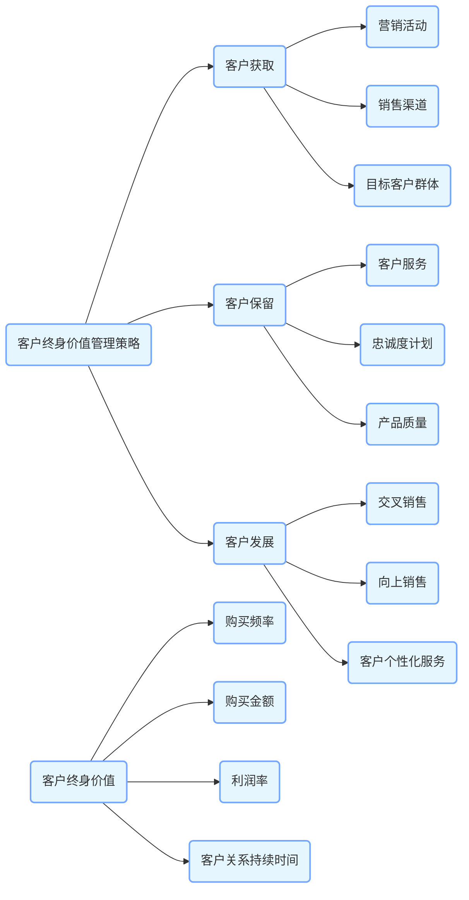

# 彼得林奇如何评估公司的客户终身价值管理策略

> 关键词：彼得林奇、客户终身价值、管理策略、评估方法、公司分析

> 摘要：本文聚焦于彼得林奇评估公司客户终身价值管理策略的方法。首先介绍了相关背景知识，包括目的范围、预期读者等内容。接着阐述核心概念，如客户终身价值及其与公司业务的联系，并给出示意图和流程图。详细讲解核心算法原理，通过Python代码进行说明，同时引入数学模型和公式，辅以具体例子。在项目实战部分，展示代码案例并进行详细解读。分析实际应用场景，推荐相关学习资源、开发工具和论文著作。最后总结未来发展趋势与挑战，解答常见问题并提供扩展阅读和参考资料，旨在帮助读者深入理解彼得林奇评估公司客户终身价值管理策略的思路和方法。

## 1. 背景介绍 
### 1.1 目的和范围
彼得林奇作为投资界的传奇人物，其投资理念和方法对众多投资者和企业管理者产生了深远影响。评估公司的客户终身价值管理策略，有助于深入了解公司的长期盈利能力和发展潜力。本文的目的在于剖析彼得林奇评估公司客户终身价值管理策略的具体方法和思路，范围涵盖从核心概念到实际应用的各个方面，包括算法原理、数学模型、项目实战以及未来趋势等。

### 1.2 预期读者
本文预期读者包括投资者、企业管理者、市场营销人员、金融分析师以及对彼得林奇投资理念和客户终身价值管理感兴趣的相关人士。投资者可以通过学习本文，更好地评估公司的投资价值；企业管理者能够借鉴相关方法优化公司的客户终身价值管理策略；市场营销人员可从中获取客户价值分析的思路；金融分析师则能提升对公司财务和业务状况的分析能力。

### 1.3 文档结构概述
本文将按照以下结构进行阐述：首先介绍相关背景知识，为后续内容奠定基础；接着讲解核心概念，明确客户终身价值及相关联系；然后详细介绍核心算法原理和具体操作步骤，并用Python代码实现；引入数学模型和公式，并举例说明；通过项目实战展示代码案例和详细解释；分析实际应用场景；推荐相关工具和资源；最后总结未来发展趋势与挑战，解答常见问题并提供扩展阅读和参考资料。

### 1.4 术语表
#### 1.4.1 核心术语定义
- **客户终身价值（Customer Lifetime Value，CLV）**：指在客户与公司的整个关系周期内，公司从该客户获得的全部利润的现值。它考虑了客户在未来一段时间内的购买频率、购买金额、利润率等因素，是衡量客户对公司长期价值的重要指标。
- **客户终身价值管理策略**：公司为了最大化客户终身价值而采取的一系列战略和措施，包括客户获取、客户保留、客户发展等方面的策略。
- **彼得林奇投资理念**：彼得林奇强调通过深入研究公司的基本面，寻找具有成长潜力的公司进行投资。他注重实地调研、关注公司的业务模式、竞争优势和财务状况等因素。

#### 1.4.2 相关概念解释
- **客户获取成本（Customer Acquisition Cost，CAC）**：公司为了获取一个新客户所花费的成本，包括营销费用、销售费用等。客户获取成本与客户终身价值的比较是评估公司客户价值管理效率的重要指标。
- **客户保留率（Customer Retention Rate）**：指在一定时期内，公司保留的客户数量与期初客户数量的比例。高客户保留率通常意味着客户对公司的满意度较高，有利于提高客户终身价值。
- **客户流失率（Customer Churn Rate）**：与客户保留率相反，指在一定时期内，公司失去的客户数量与期初客户数量的比例。降低客户流失率是客户终身价值管理的重要目标之一。

#### 1.4.3 缩略词列表
- CLV：Customer Lifetime Value（客户终身价值）
- CAC：Customer Acquisition Cost（客户获取成本）
- CRR：Customer Retention Rate（客户保留率）
- CCR：Customer Churn Rate（客户流失率）

## 2. 核心概念与联系 

### 核心概念原理
客户终身价值（CLV）是评估公司客户价值管理的核心概念。其原理基于客户在与公司的整个关系周期内所产生的现金流。具体来说，CLV考虑了以下几个方面：
- **客户购买行为**：包括购买频率、购买金额等。购买频率越高、购买金额越大，客户为公司带来的收入就越多。
- **客户关系持续时间**：客户与公司保持关系的时间越长，公司从该客户获得的收入就可能越多。
- **利润率**：公司从客户购买中获得的利润是CLV的重要组成部分。利润率越高，客户为公司带来的价值就越大。

公司的客户终身价值管理策略旨在通过优化客户获取、客户保留和客户发展等环节，最大化客户终身价值。例如，通过提高客户服务质量来提高客户保留率，通过精准营销来提高客户购买频率和购买金额等。

### 架构的文本示意图
```plaintext
客户终身价值管理策略
|-- 客户获取
|   |-- 营销活动
|   |-- 销售渠道
|   |-- 目标客户群体
|-- 客户保留
|   |-- 客户服务
|   |-- 忠诚度计划
|   |-- 产品质量
|-- 客户发展
|   |-- 交叉销售
|   |-- 向上销售
|   |-- 客户个性化服务

客户终身价值
|-- 购买频率
|-- 购买金额
|-- 利润率
|-- 客户关系持续时间
```

### Mermaid流程图


## 3. 核心算法原理 & 具体操作步骤 

### 核心算法原理
计算客户终身价值的一种常见方法是基于历史数据进行预测。以下是一个简化的公式：

$$CLV = \sum_{t=1}^{T} \frac{MR_t - C_t}{(1 + r)^t}$$

其中：
- $CLV$ 是客户终身价值
- $MR_t$ 是第 $t$ 期的边际收入
- $C_t$ 是第 $t$ 期的成本
- $r$ 是折现率
- $T$ 是客户关系的持续期

### 具体操作步骤
1. **数据收集**：收集客户的历史购买数据，包括购买时间、购买金额、购买频率等。同时，收集公司的成本数据，如营销成本、生产成本等。
2. **数据预处理**：对收集到的数据进行清洗和整理，去除异常值和缺失值。将数据按照时间周期进行划分，以便后续计算。
3. **计算边际收入和成本**：根据历史数据，计算每个时间周期的边际收入和成本。边际收入可以通过购买金额减去可变成本得到。
4. **确定折现率**：折现率反映了资金的时间价值。通常可以根据公司的资本成本或市场利率来确定。
5. **计算客户终身价值**：根据上述公式，将每个时间周期的边际收入和成本代入公式，计算客户终身价值。

### Python源代码实现
```python
import numpy as np

def calculate_clv(marginal_revenues, costs, discount_rate):
    """
    计算客户终身价值
    :param marginal_revenues: 边际收入列表
    :param costs: 成本列表
    :param discount_rate: 折现率
    :return: 客户终身价值
    """
    num_periods = len(marginal_revenues)
    clv = 0
    for t in range(num_periods):
        net_cash_flow = marginal_revenues[t] - costs[t]
        discounted_cash_flow = net_cash_flow / ((1 + discount_rate) ** t)
        clv += discounted_cash_flow
    return clv

# 示例数据
marginal_revenues = [100, 120, 130, 140, 150]
costs = [50, 60, 65, 70, 75]
discount_rate = 0.1

# 计算客户终身价值
clv = calculate_clv(marginal_revenues, costs, discount_rate)
print(f"客户终身价值: {clv}")
```

## 4. 数学模型和公式 & 详细讲解 & 举例说明 

### 数学模型和公式
#### 基本公式
如前文所述，客户终身价值的基本公式为：

$$CLV = \sum_{t=1}^{T} \frac{MR_t - C_t}{(1 + r)^t}$$

#### 考虑客户保留率的公式
在实际应用中，客户保留率是一个重要的因素。考虑客户保留率的客户终身价值公式可以表示为：

$$CLV = \frac{MR - C}{r + CRR - 1}$$

其中：
- $MR$ 是平均边际收入
- $C$ 是平均成本
- $r$ 是折现率
- $CRR$ 是客户保留率

### 详细讲解
- **基本公式**：基本公式考虑了每个时间周期的边际收入和成本，并通过折现率将未来的现金流折现到当前。这样可以更准确地反映客户终身价值的现值。
- **考虑客户保留率的公式**：该公式考虑了客户保留率对客户终身价值的影响。客户保留率越高，客户与公司的关系持续时间就越长，客户终身价值也就越高。

### 举例说明
#### 基本公式示例
假设某客户在未来 5 年的边际收入分别为 $100$、$120$、$130$、$140$、$150$，成本分别为 $50$、$60$、$65$、$70$、$75$，折现率为 $0.1$。

根据基本公式计算客户终身价值：

$$
\begin{align*}
CLV &= \frac{100 - 50}{(1 + 0.1)^1} + \frac{120 - 60}{(1 + 0.1)^2} + \frac{130 - 65}{(1 + 0.1)^3} + \frac{140 - 70}{(1 + 0.1)^4} + \frac{150 - 75}{(1 + 0.1)^5}\\
&= \frac{50}{1.1} + \frac{60}{1.21} + \frac{65}{1.331} + \frac{70}{1.4641} + \frac{75}{1.61051}\\
&\approx 45.45 + 49.59 + 48.84 + 47.81 + 46.57\\
&\approx 238.26
\end{align*}
$$

#### 考虑客户保留率的公式示例
假设某公司的平均边际收入为 $100$，平均成本为 $50$，折现率为 $0.1$，客户保留率为 $0.8$。

根据考虑客户保留率的公式计算客户终身价值：

$$CLV = \frac{100 - 50}{0.1 + 0.8 - 1} = \frac{50}{-0.1} = -500$$

由于客户保留率小于 $1 - r$，导致客户终身价值为负数。这表明在当前的成本、收入和保留率情况下，公司从该客户获得的价值是亏损的。公司需要采取措施提高客户保留率或降低成本，以提高客户终身价值。

## 5. 项目实战：代码实际案例和详细解释说明 

### 5.1  开发环境搭建
- **Python环境**：确保已经安装了Python 3.x版本。可以从Python官方网站（https://www.python.org/downloads/）下载并安装。
- **开发工具**：推荐使用Jupyter Notebook或PyCharm等开发工具。Jupyter Notebook适合交互式开发和数据分析，PyCharm则是一个功能强大的Python集成开发环境。
- **必要的库**：需要安装`numpy`、`pandas`等库。可以使用以下命令进行安装：
```sh
pip install numpy pandas
```

### 5.2  源代码详细实现和代码解读
```python
import numpy as np
import pandas as pd

# 模拟客户购买数据
data = {
    'customer_id': [1, 1, 1, 2, 2, 3, 3, 3, 3],
    'purchase_date': ['2023-01-01', '2023-02-01', '2023-03-01', '2023-01-15', '2023-03-15', '2023-01-20', '2023-02-20', '2023-03-20', '2023-04-20'],
    'purchase_amount': [100, 120, 130, 80, 90, 110, 125, 135, 140]
}

df = pd.DataFrame(data)

# 数据预处理
df['purchase_date'] = pd.to_datetime(df['purchase_date'])
df['year_month'] = df['purchase_date'].dt.to_period('M')

# 计算每个客户每个月的购买金额
monthly_purchases = df.groupby(['customer_id', 'year_month'])['purchase_amount'].sum().reset_index()

# 计算每个客户的平均购买频率和平均购买金额
customer_summary = monthly_purchases.groupby('customer_id').agg(
    average_purchase_frequency=('year_month', 'count'),
    average_purchase_amount=('purchase_amount', 'mean')
).reset_index()

# 假设成本为购买金额的 30%
customer_summary['average_cost'] = customer_summary['average_purchase_amount'] * 0.3

# 假设折现率为 0.1
discount_rate = 0.1

# 计算每个客户的客户终身价值
def calculate_clv(row):
    average_marginal_revenue = row['average_purchase_amount'] - row['average_cost']
    # 假设客户关系持续 5 年（60 个月）
    num_periods = 60
    clv = 0
    for t in range(num_periods):
        discounted_cash_flow = average_marginal_revenue / ((1 + discount_rate) ** t)
        clv += discounted_cash_flow
    return clv

customer_summary['clv'] = customer_summary.apply(calculate_clv, axis=1)

print(customer_summary)
```

### 5.3  代码解读与分析
1. **数据模拟**：使用`pandas`库创建一个包含客户购买数据的DataFrame，包括客户ID、购买日期和购买金额。
2. **数据预处理**：将购买日期转换为日期时间类型，并提取年月信息。
3. **计算每月购买金额**：使用`groupby`方法按客户ID和年月分组，计算每个客户每个月的购买金额。
4. **计算客户平均信息**：按客户ID分组，计算每个客户的平均购买频率和平均购买金额。
5. **计算成本**：假设成本为购买金额的 30%，计算每个客户的平均成本。
6. **计算客户终身价值**：定义一个函数`calculate_clv`，根据基本公式计算每个客户的客户终身价值。
7. **结果输出**：将计算得到的客户终身价值添加到`customer_summary`DataFrame中，并打印结果。

通过这个项目实战，我们可以看到如何使用Python和`pandas`库来计算客户终身价值。在实际应用中，可以根据具体情况调整数据和参数，以更准确地评估公司的客户终身价值管理策略。

## 6. 实际应用场景 
### 投资决策
投资者可以使用彼得林奇评估公司客户终身价值管理策略的方法，来评估公司的投资价值。高客户终身价值意味着公司具有较强的盈利能力和发展潜力，是一个值得投资的对象。例如，投资者可以比较不同公司的客户终身价值，选择客户终身价值较高且管理策略有效的公司进行投资。

### 企业战略规划
企业管理者可以通过评估客户终身价值管理策略，制定更有效的企业战略。例如，如果发现客户保留率较低，企业可以采取措施提高客户服务质量、优化忠诚度计划等，以提高客户保留率和客户终身价值。同时，企业还可以根据客户终身价值的分布情况，对不同价值的客户采取不同的营销策略，实现资源的优化配置。

### 市场营销优化
市场营销人员可以利用客户终身价值的分析结果，优化营销活动。例如，针对高价值客户，可以开展个性化的营销活动，提高客户的购买频率和购买金额；针对潜在客户，可以通过精准营销提高客户获取效率。此外，通过分析客户终身价值与营销成本的关系，市场营销人员可以评估营销活动的效果，优化营销预算的分配。

### 客户关系管理
客户关系管理部门可以根据客户终身价值的评估结果，制定不同的客户服务策略。对于高价值客户，提供更优质的客户服务，增强客户的忠诚度；对于低价值客户，可以采取措施提高其价值，或者考虑是否继续投入资源维护关系。通过有效的客户关系管理，提高客户的满意度和忠诚度，从而提高客户终身价值。

## 7. 工具和资源推荐
### 7.1 学习资源推荐
#### 7.1.1 书籍推荐
- 《彼得林奇的成功投资》：彼得林奇的经典著作，详细介绍了他的投资理念和方法，包括如何评估公司的基本面和成长潜力。
- 《客户终身价值：模型、方法与应用》：全面介绍了客户终身价值的相关理论、模型和方法，是学习客户终身价值管理的重要参考书籍。
- 《市场营销管理》：菲利普·科特勒的经典教材，涵盖了市场营销的各个方面，包括客户价值管理、营销策略制定等内容。

#### 7.1.2 在线课程
- Coursera上的“客户分析与营销决策”课程：由知名高校教授授课，系统介绍了客户分析的方法和技术，包括客户终身价值的计算和应用。
- edX上的“投资学原理”课程：讲解了投资的基本原理和方法，其中涉及到如何评估公司的价值和投资潜力，对理解彼得林奇的投资理念有很大帮助。

#### 7.1.3 技术博客和网站
- Seeking Alpha：一个金融投资领域的知名网站，提供大量的公司分析报告和投资建议，有助于学习如何评估公司的客户终身价值管理策略。
- MarketingProfs：专注于市场营销领域的博客网站，分享了许多关于客户价值管理、营销策略优化等方面的文章和案例。

### 7.2 开发工具框架推荐
#### 7.2.1 IDE和编辑器
- PyCharm：功能强大的Python集成开发环境，提供代码编辑、调试、版本控制等功能，适合开发Python项目。
- Jupyter Notebook：交互式开发环境，支持Python、R等多种编程语言，方便进行数据分析和可视化。

#### 7.2.2 调试和性能分析工具
- Py-Spy：一个轻量级的Python性能分析工具，可以实时监测Python程序的运行状态，找出性能瓶颈。
- PDB：Python自带的调试工具，可以在代码中设置断点，逐步调试程序，帮助发现和解决问题。

#### 7.2.3 相关框架和库
- Pandas：强大的数据处理和分析库，提供了丰富的数据结构和函数，方便进行数据清洗、整理和分析。
- Numpy：Python的数值计算库，提供了高效的数组和矩阵运算功能，在客户终身价值计算中可以提高计算效率。

### 7.3 相关论文著作推荐
#### 7.3.1 经典论文
- “Customer Lifetime Value: Marketing Models and Applications”：该论文对客户终身价值的模型和应用进行了系统的综述，是客户终身价值研究领域的经典文献。
- “The Value of Customer Relationships in a Contractual Setting: Evidence from the Cellular Industry”：通过对移动通信行业的实证研究，探讨了客户终身价值在契约环境下的评估和应用。

#### 7.3.2 最新研究成果
- 关注学术数据库如IEEE Xplore、ACM Digital Library等，搜索关于客户终身价值管理、投资分析等方面的最新研究论文，了解该领域的前沿动态。

#### 7.3.3 应用案例分析
- 一些知名企业的案例研究，如亚马逊、苹果等公司的客户终身价值管理策略分析，可以帮助我们更好地理解如何将理论应用到实际中。可以通过商业杂志、行业报告等渠道获取相关案例。

## 8. 总结：未来发展趋势与挑战
### 未来发展趋势
- **数据驱动的决策**：随着大数据技术的不断发展，公司将能够收集和分析更多的客户数据，从而更准确地评估客户终身价值。基于数据的决策将成为客户终身价值管理的主流趋势。
- **个性化营销**：消费者对个性化体验的需求越来越高，公司将更加注重根据客户的个性化需求和偏好，制定个性化的营销策略，以提高客户终身价值。
- **跨行业融合**：客户终身价值管理将不再局限于传统的营销和销售领域，而是与金融、科技、医疗等行业进行深度融合，创造更多的商业机会。
- **人工智能和机器学习的应用**：人工智能和机器学习技术将在客户终身价值管理中发挥越来越重要的作用。例如，通过机器学习算法预测客户的购买行为和流失概率，从而制定更有效的管理策略。

### 挑战
- **数据质量和安全**：准确的客户终身价值评估依赖于高质量的数据。然而，数据的收集、存储和管理过程中可能存在数据质量问题，如数据缺失、错误等。此外，数据安全也是一个重要的问题，公司需要保护客户的隐私和数据安全。
- **模型的准确性和适用性**：客户终身价值的计算模型需要根据不同的行业和业务场景进行调整和优化。如何选择合适的模型，并确保模型的准确性和适用性是一个挑战。
- **市场竞争和变化**：市场竞争日益激烈，消费者的需求和行为也在不断变化。公司需要及时调整客户终身价值管理策略，以适应市场的变化。
- **组织文化和协作**：客户终身价值管理需要公司各个部门的协作和配合，包括营销、销售、客户服务等部门。如何建立一个良好的组织文化，促进部门之间的协作，是实现客户终身价值最大化的关键。

## 9. 附录：常见问题与解答
### 问题1：客户终身价值的计算结果是否准确？
客户终身价值的计算结果受到多种因素的影响，如数据质量、模型假设、市场变化等。因此，计算结果只是一个估计值，不能保证完全准确。但是，通过合理的数据收集和分析，选择合适的模型，可以提高计算结果的准确性。

### 问题2：如何提高客户终身价值？
可以从以下几个方面提高客户终身价值：
- **提高客户保留率**：通过提供优质的产品和服务，建立良好的客户关系，提高客户的满意度和忠诚度。
- **增加客户购买频率和购买金额**：通过交叉销售、向上销售等策略，引导客户购买更多的产品和服务。
- **降低客户获取成本**：优化营销渠道和策略，提高营销效率，降低获取新客户的成本。

### 问题3：客户终身价值管理策略是否适用于所有行业？
客户终身价值管理策略适用于大多数行业，但具体的应用方法和重点可能会因行业而异。例如，在零售业中，客户购买频率和购买金额是重要的指标；在金融服务业中，客户的忠诚度和风险偏好更为关键。因此，需要根据不同行业的特点，制定适合的客户终身价值管理策略。

### 问题4：如何评估客户终身价值管理策略的效果？
可以通过以下几个指标评估客户终身价值管理策略的效果：
- **客户终身价值的变化**：比较实施策略前后客户终身价值的变化情况，评估策略的有效性。
- **客户保留率和流失率**：观察客户保留率和流失率的变化，判断策略是否有助于提高客户的忠诚度。
- **营销成本和回报率**：分析营销成本的投入和回报率，评估策略的经济效益。

## 10. 扩展阅读 & 参考资料
### 扩展阅读
- 《竞争战略》：迈克尔·波特的经典著作，介绍了企业竞争战略的基本理论和方法，对理解公司的市场竞争地位和客户价值管理有一定的帮助。
- 《创新者的窘境》：克莱顿·克里斯坦森的著作，探讨了企业在面对技术创新和市场变化时的困境和应对策略，对客户终身价值管理策略的创新有一定的启示。

### 参考资料
- 彼得林奇的官方网站和相关采访资料，获取其投资理念和方法的第一手信息。
- 相关学术期刊和会议论文，如《Journal of Marketing》、《Marketing Science》等，了解客户终身价值管理领域的最新研究成果。
- 商业杂志和行业报告，如《哈佛商业评论》、《麦肯锡季刊》等，获取实际案例和行业动态。