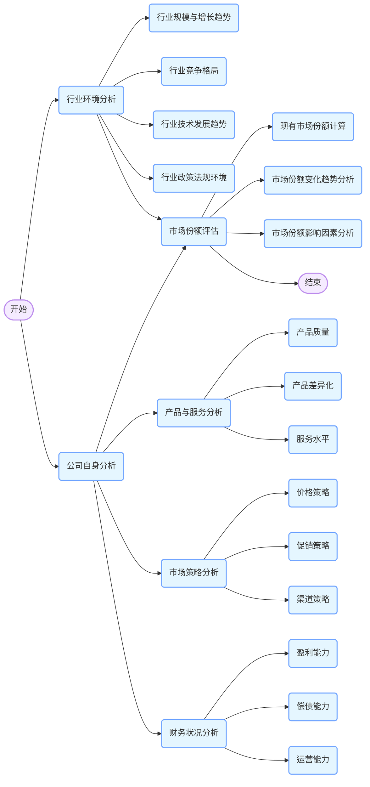

# 彼得林奇如何评估公司的市场份额

> 关键词：彼得林奇、市场份额评估、公司分析、投资策略、财务分析、竞争优势、行业动态

> 摘要：本文深入探讨彼得林奇评估公司市场份额的方法与理念。彼得林奇作为投资界的传奇人物，其评估市场份额的方式对于投资者洞察公司在行业中的地位、竞争优势以及未来发展潜力具有重要指导意义。文章将详细阐述相关核心概念、评估的具体步骤与算法原理，结合数学模型与公式进行深入讲解，并通过项目实战案例展示其在实际投资分析中的应用。同时，介绍该方法在不同场景下的应用，推荐相关学习资源、开发工具以及论文著作，最后对未来发展趋势与挑战进行总结，解答常见问题并提供扩展阅读与参考资料。

## 1. 背景介绍 
### 1.1 目的和范围
彼得林奇在投资领域的卓越成就使其投资方法备受关注。本文旨在深入剖析他评估公司市场份额的方法，帮助投资者更好地理解公司在市场中的竞争力和地位。范围涵盖彼得林奇评估市场份额的核心概念、具体操作步骤、相关数学模型以及实际应用案例等方面。通过对这些内容的探讨，为投资者提供一套系统的分析思路和方法，以便在投资决策中更准确地评估公司的价值。

### 1.2 预期读者
本文预期读者主要包括对投资分析感兴趣的个人投资者、金融专业学生、投资机构从业者以及相关研究人员。对于个人投资者而言，希望通过学习彼得林奇的方法提升自己的投资分析能力；金融专业学生可以将其作为案例研究，深入理解投资分析的理论与实践；投资机构从业者则可借鉴其中的思路和方法，优化投资决策流程；研究人员可以从本文中获取相关研究素材，进一步拓展和深化对投资分析领域的研究。

### 1.3 文档结构概述
本文首先介绍背景信息，包括目的、预期读者和文档结构概述等内容。接着阐述核心概念与联系，通过文本示意图和 Mermaid 流程图展示相关原理和架构。然后详细讲解核心算法原理及具体操作步骤，结合 Python 源代码进行说明。随后介绍数学模型和公式，并通过举例进行详细讲解。在项目实战部分，通过实际案例展示代码实现和详细解释。之后探讨实际应用场景，推荐相关工具和资源，包括学习资源、开发工具框架以及论文著作等。最后总结未来发展趋势与挑战，解答常见问题并提供扩展阅读与参考资料。

### 1.4 术语表
#### 1.4.1 核心术语定义
- **市场份额**：指一个公司的产品或服务在特定市场中的销售额或销售量占该市场总销售额或总销售量的比例。它是衡量公司在市场中竞争力和地位的重要指标。
- **竞争优势**：公司在市场中相对于竞争对手所具有的优势，表现为产品质量、成本、品牌、技术等方面的优势，能够帮助公司获取更高的市场份额和利润。
- **行业动态**：指特定行业在市场环境、技术发展、政策法规等方面的变化和趋势，这些变化会对公司的市场份额产生影响。

#### 1.4.2 相关概念解释
- **相对市场份额**：指公司的市场份额与行业内最大竞争对手的市场份额之比。相对市场份额能够更直观地反映公司在市场中的竞争地位。
- **市场集中度**：指市场中少数几家最大企业所占市场份额的总和。市场集中度反映了市场的竞争程度，集中度越高，市场竞争越不充分。

#### 1.4.3 缩略词列表
- **CAGR**：Compound Annual Growth Rate，复合年均增长率，用于衡量投资在一定时期内的平均增长速度。
- **EPS**：Earnings Per Share，每股收益，反映公司普通股股东每持有一股所能享有的企业净利润或需承担的企业净亏损。

## 2. 核心概念与联系 
### 核心概念原理
彼得林奇评估公司市场份额的核心在于全面、深入地了解公司所处的行业环境和自身的竞争优势。他认为市场份额不仅仅是一个数字，而是公司在市场中综合竞争力的体现。公司的市场份额受到多种因素的影响，包括产品质量、价格、品牌形象、销售渠道、客户服务等。通过对这些因素的分析，可以更准确地评估公司的市场份额及其未来发展趋势。

例如，一家公司如果能够提供高质量的产品和优质的客户服务，就有可能吸引更多的客户，从而提高市场份额。相反，如果公司的产品质量差、价格高，或者销售渠道不畅，就可能导致市场份额下降。

### 架构的文本示意图
```plaintext
公司市场份额评估
|-- 行业环境分析
|   |-- 行业规模与增长趋势
|   |-- 行业竞争格局
|   |-- 行业技术发展趋势
|   |-- 行业政策法规环境
|-- 公司自身分析
|   |-- 产品与服务分析
|   |   |-- 产品质量
|   |   |-- 产品差异化
|   |   |-- 服务水平
|   |-- 市场策略分析
|   |   |-- 价格策略
|   |   |-- 促销策略
|   |   |-- 渠道策略
|   |-- 财务状况分析
|   |   |-- 盈利能力
|   |   |-- 偿债能力
|   |   |-- 运营能力
|-- 市场份额评估
|   |-- 现有市场份额计算
|   |-- 市场份额变化趋势分析
|   |-- 市场份额影响因素分析
```

### Mermaid 流程图


## 3. 核心算法原理 & 具体操作步骤 
### 核心算法原理
彼得林奇评估公司市场份额的核心算法主要基于对公司销售额和市场总销售额的计算。市场份额的计算公式为：

$$市场份额 = \frac{公司销售额}{市场总销售额} \times 100\%$$

### 具体操作步骤
#### 步骤 1：确定目标市场
首先需要明确公司产品或服务所针对的目标市场。目标市场可以根据地理区域、客户群体、产品类型等因素进行划分。例如，一家生产智能手机的公司，其目标市场可以是全球智能手机市场，也可以是某个特定国家或地区的智能手机市场。

#### 步骤 2：收集公司销售额数据
通过公司的财务报表、年报等渠道收集公司在目标市场中的销售额数据。这些数据通常可以在公司的官方网站、证券交易所网站或专业的金融数据库中获取。

#### 步骤 3：收集市场总销售额数据
收集目标市场的总销售额数据。这可能需要参考行业研究报告、市场调研机构的数据、政府统计部门的信息等。不同行业的数据来源可能不同，需要根据具体情况进行选择。

#### 步骤 4：计算市场份额
将公司销售额数据除以市场总销售额数据，并乘以 100%，得到公司的市场份额。

### Python 源代码实现
```python
# 定义函数计算市场份额
def calculate_market_share(company_sales, market_total_sales):
    """
    计算公司的市场份额
    :param company_sales: 公司销售额
    :param market_total_sales: 市场总销售额
    :return: 市场份额（百分比）
    """
    if market_total_sales == 0:
        return 0
    market_share = (company_sales / market_total_sales) * 100
    return market_share

# 示例数据
company_sales = 5000000  # 公司销售额
market_total_sales = 20000000  # 市场总销售额

# 计算市场份额
market_share = calculate_market_share(company_sales, market_total_sales)
print(f"公司的市场份额为: {market_share}%")
```

### 代码解释
- `calculate_market_share` 函数接受两个参数：`company_sales` 表示公司销售额，`market_total_sales` 表示市场总销售额。
- 在函数内部，首先检查市场总销售额是否为 0，如果为 0，则返回 0，避免出现除零错误。
- 然后，将公司销售额除以市场总销售额，并乘以 100，得到市场份额的百分比。
- 最后，使用示例数据调用函数并打印计算结果。

## 4. 数学模型和公式 & 详细讲解 & 举例说明 
### 基本数学模型和公式
#### 市场份额计算公式
$$市场份额 = \frac{公司销售额}{市场总销售额} \times 100\%$$

这个公式是计算市场份额的基本公式，通过比较公司销售额与市场总销售额的比例，直观地反映了公司在市场中的地位。

#### 相对市场份额计算公式
$$相对市场份额 = \frac{公司市场份额}{最大竞争对手市场份额}$$

相对市场份额能够更清晰地展示公司与最大竞争对手之间的差距，帮助投资者更好地评估公司的竞争地位。

### 详细讲解
#### 市场份额计算公式讲解
市场份额的计算基于公司销售额和市场总销售额。公司销售额反映了公司在市场中的销售业绩，而市场总销售额则代表了整个市场的规模。通过将公司销售额除以市场总销售额并乘以 100%，可以得到公司在市场中所占的比例，即市场份额。市场份额越高，说明公司在市场中的竞争力越强。

#### 相对市场份额计算公式讲解
相对市场份额是将公司的市场份额与最大竞争对手的市场份额进行比较。如果相对市场份额大于 1，说明公司的市场份额超过了最大竞争对手，具有较强的竞争优势；如果相对市场份额小于 1，则说明公司的市场份额低于最大竞争对手，需要进一步提升竞争力。

### 举例说明
#### 市场份额计算举例
假设某家汽车制造公司在某一年度的销售额为 50 亿元，而该年度全球汽车市场的总销售额为 5000 亿元。则该公司的市场份额为：

$$市场份额 = \frac{50}{5000} \times 100\% = 1\%$$

这意味着该公司在全球汽车市场中所占的份额为 1%。

#### 相对市场份额计算举例
假设上述汽车制造公司的最大竞争对手在同一年度的市场份额为 2%。则该公司的相对市场份额为：

$$相对市场份额 = \frac{1\%}{2\%} = 0.5$$

这表明该公司的市场份额仅为最大竞争对手的一半，竞争地位相对较弱。

## 5. 项目实战：代码实际案例和详细解释说明 
### 5.1  开发环境搭建
#### 安装 Python
首先需要安装 Python 开发环境。可以从 Python 官方网站（https://www.python.org/downloads/）下载适合自己操作系统的 Python 版本，并按照安装向导进行安装。

#### 安装必要的库
在本项目中，主要使用 Python 的基本库进行数据处理和计算，不需要额外安装其他库。

### 5.2  源代码详细实现和代码解读
```python
# 定义函数计算市场份额
def calculate_market_share(company_sales, market_total_sales):
    """
    计算公司的市场份额
    :param company_sales: 公司销售额
    :param market_total_sales: 市场总销售额
    :return: 市场份额（百分比）
    """
    if market_total_sales == 0:
        return 0
    market_share = (company_sales / market_total_sales) * 100
    return market_share

# 定义函数计算相对市场份额
def calculate_relative_market_share(company_market_share, competitor_market_share):
    """
    计算相对市场份额
    :param company_market_share: 公司市场份额
    :param competitor_market_share: 最大竞争对手市场份额
    :return: 相对市场份额
    """
    if competitor_market_share == 0:
        return 0
    relative_market_share = company_market_share / competitor_market_share
    return relative_market_share

# 示例数据
company_sales = 8000000  # 公司销售额
market_total_sales = 40000000  # 市场总销售额
competitor_market_share = 30  # 最大竞争对手市场份额

# 计算市场份额
market_share = calculate_market_share(company_sales, market_total_sales)
print(f"公司的市场份额为: {market_share}%")

# 计算相对市场份额
relative_market_share = calculate_relative_market_share(market_share, competitor_market_share)
print(f"公司的相对市场份额为: {relative_market_share}")
```

### 5.3  代码解读与分析
#### 函数定义
- `calculate_market_share` 函数用于计算公司的市场份额。它接受公司销售额和市场总销售额作为参数，通过公式计算市场份额并返回结果。
- `calculate_relative_market_share` 函数用于计算相对市场份额。它接受公司市场份额和最大竞争对手市场份额作为参数，通过公式计算相对市场份额并返回结果。

#### 数据处理
- 定义了示例数据，包括公司销售额、市场总销售额和最大竞争对手市场份额。
- 调用 `calculate_market_share` 函数计算公司的市场份额，并打印结果。
- 调用 `calculate_relative_market_share` 函数计算相对市场份额，并打印结果。

#### 错误处理
在两个函数中都进行了错误处理，当分母为 0 时，返回 0，避免出现除零错误。

## 6. 实际应用场景 
### 投资决策
投资者在进行投资决策时，可以通过评估公司的市场份额来判断公司的竞争力和发展潜力。市场份额较高的公司通常具有较强的竞争优势和稳定的盈利能力，更有可能为投资者带来丰厚的回报。例如，在选择投资某家科技公司时，如果该公司在其所在行业中的市场份额持续增长，说明公司的产品或服务具有较强的竞争力，投资者可以考虑将其纳入投资组合。

### 行业分析
市场份额是行业分析的重要指标之一。通过分析不同公司在行业中的市场份额分布，可以了解行业的竞争格局和发展趋势。例如，如果某个行业的市场份额集中在少数几家大型企业手中，说明该行业的竞争程度较高，新进入者的门槛也较高；如果市场份额较为分散，说明行业竞争激烈，企业之间的差异化竞争较为明显。

### 公司战略制定
公司管理层可以根据市场份额的变化情况制定相应的战略。如果公司的市场份额下降，管理层需要分析原因，可能是产品质量、价格、市场策略等方面存在问题，需要及时调整战略以提升市场份额。例如，如果公司的市场份额被竞争对手抢走，管理层可以考虑加大研发投入，推出更具竞争力的产品，或者优化市场策略，提高品牌知名度和市场覆盖率。

### 市场营销策略评估
市场份额可以作为评估市场营销策略效果的重要指标。如果公司实施了新的市场营销策略后，市场份额有所提升，说明该策略取得了一定的效果；如果市场份额没有变化或下降，说明策略可能存在问题，需要进行调整。例如，公司推出了一项促销活动后，观察市场份额的变化情况，如果市场份额上升，说明促销活动吸引了更多的客户，提高了公司的市场竞争力。

## 7. 工具和资源推荐
### 7.1 学习资源推荐
#### 7.1.1 书籍推荐
- 《彼得·林奇的成功投资》：彼得·林奇的经典著作，详细介绍了他的投资理念和方法，包括如何评估公司的市场份额、如何选择股票等内容。
- 《聪明的投资者》：本杰明·格雷厄姆的著作，被认为是投资领域的圣经。书中阐述了价值投资的基本原理和方法，对投资者评估公司价值和市场份额具有重要的指导意义。
- 《财务报表分析与证券定价》：全面介绍了财务报表分析的方法和技巧，帮助投资者通过财务报表评估公司的市场份额和盈利能力。

#### 7.1.2 在线课程
- Coursera 平台上的“投资学原理”课程：由知名大学的教授授课，系统介绍了投资学的基本原理和方法，包括市场分析、公司估值等内容。
- 网易云课堂上的“财务分析实战”课程：通过实际案例讲解财务分析的方法和技巧，帮助学员掌握如何通过财务数据评估公司的市场份额和竞争力。

#### 7.1.3 技术博客和网站
- 雪球网：一个专注于投资交流的社区，汇聚了众多投资者和投资专家。在雪球网上可以找到关于公司市场份额分析的文章和讨论，了解其他投资者的观点和经验。
- 东方财富网：提供丰富的金融信息和数据，包括公司财务报表、行业研究报告等。通过东方财富网可以获取相关公司的市场份额数据和行业动态信息。

### 7.2 开发工具框架推荐
#### 7.2.1 IDE和编辑器
- PyCharm：一款专业的 Python 集成开发环境，具有代码编辑、调试、自动补全、版本控制等功能，适合开发 Python 程序来进行市场份额分析。
- Jupyter Notebook：一种交互式编程环境，支持 Python、R 等多种编程语言。可以在 Jupyter Notebook 中编写代码、进行数据分析和可视化，方便进行市场份额的计算和分析。

#### 7.2.2 调试和性能分析工具
- pdb：Python 自带的调试工具，可以帮助开发者定位代码中的问题。通过 pdb 可以单步执行代码、查看变量值等，方便调试市场份额计算的代码。
- cProfile：Python 内置的性能分析工具，可以分析代码的执行时间和函数调用情况。使用 cProfile 可以找出代码中的性能瓶颈，优化市场份额计算的效率。

#### 7.2.3 相关框架和库
- Pandas：一个强大的数据处理和分析库，提供了数据结构和数据操作工具，方便进行市场份额数据的处理和分析。
- Matplotlib：一个用于数据可视化的库，可以绘制各种图表，如柱状图、折线图等，直观展示市场份额的变化趋势。

### 7.3 相关论文著作推荐
#### 7.3.1 经典论文
- Porter, M. E. (1979). How competitive forces shape strategy. Harvard business review. 该论文提出了波特五力模型，用于分析行业竞争环境，对评估公司市场份额具有重要的理论指导意义。
- Barney, J. B. (1991). Firm resources and sustained competitive advantage. Journal of management, 17(1), 99-120. 该论文探讨了企业资源与持续竞争优势的关系，为分析公司市场份额的影响因素提供了理论基础。

#### 7.3.2 最新研究成果
可以通过学术数据库，如 Web of Science、EBSCOhost 等，搜索关于市场份额评估、公司竞争力分析等方面的最新研究论文。这些论文通常反映了该领域的最新研究动态和前沿观点。

#### 7.3.3 应用案例分析
- 可以参考一些知名企业的案例分析报告，了解它们在市场份额评估和竞争策略制定方面的实践经验。例如，苹果公司在智能手机市场的市场份额变化及相应的市场策略调整，可以为投资者和企业管理者提供有益的借鉴。

## 8. 总结：未来发展趋势与挑战
### 未来发展趋势
#### 数据驱动的市场份额评估
随着大数据和人工智能技术的发展，未来市场份额评估将更加依赖于数据。通过收集和分析大量的市场数据、客户数据、竞争对手数据等，可以更准确地评估公司的市场份额和竞争地位。例如，利用机器学习算法对市场数据进行挖掘和分析，预测市场份额的变化趋势。

#### 跨行业融合对市场份额的影响
随着科技的不断进步，不同行业之间的界限越来越模糊，跨行业融合的趋势日益明显。这将对公司的市场份额产生重要影响。例如，互联网企业与传统制造业的融合，可能会改变传统制造业的市场格局，一些具有创新能力的互联网企业可能会通过技术和商业模式的创新，在传统制造业中占据一定的市场份额。

#### 全球化背景下的市场份额竞争
全球化使得企业面临更加激烈的市场竞争。公司需要在全球范围内争夺市场份额，不仅要面对国内竞争对手，还要面对来自国际市场的竞争对手。这要求公司具备更强的全球市场竞争力，不断提升产品质量、降低成本、优化市场策略，以在全球市场中占据一席之地。

### 挑战
#### 数据质量和准确性问题
在数据驱动的市场份额评估中，数据质量和准确性是关键。如果数据存在误差或不完整，将导致市场份额评估结果不准确。因此，如何获取高质量、准确的数据，并对数据进行有效的清洗和预处理，是市场份额评估面临的重要挑战。

#### 行业动态变化快速
随着科技的快速发展和市场环境的不断变化，行业动态变化越来越快。公司需要及时了解行业的最新变化，调整市场策略，以适应市场的变化。然而，准确预测行业动态变化是非常困难的，这给市场份额评估带来了很大的挑战。

#### 竞争加剧带来的不确定性
全球化和跨行业融合使得市场竞争更加激烈，竞争对手的策略和行为也更加复杂多变。这增加了市场份额评估的不确定性。公司需要不断监测竞争对手的动态，及时调整自己的竞争策略，以保持或提升市场份额。

## 9. 附录：常见问题与解答
### 问题 1：市场份额的计算是否只考虑销售额？
答：市场份额的计算通常可以基于销售额，也可以基于销售量等其他指标。具体选择哪种指标取决于行业特点和分析目的。例如，在一些行业中，产品价格差异较大，使用销售额计算市场份额更能反映公司的市场地位；而在一些产品价格相对稳定的行业中，使用销售量计算市场份额可能更合适。

### 问题 2：如何确定市场总销售额？
答：确定市场总销售额的方法因行业而异。可以参考行业研究报告、市场调研机构的数据、政府统计部门的信息等。对于一些新兴行业，可能需要通过多种渠道收集数据，并进行估算。此外，还可以根据行业内主要企业的销售额数据进行推算。

### 问题 3：市场份额高是否意味着公司一定具有竞争优势？
答：市场份额高通常意味着公司在市场中具有一定的竞争优势，但不是绝对的。市场份额只是一个表面指标，还需要综合考虑公司的产品质量、技术创新能力、成本控制能力、品牌形象等因素。有些公司可能通过低价策略或大规模的市场推广获得较高的市场份额，但如果产品质量和技术水平较低，可能难以保持长期的竞争优势。

### 问题 4：如何分析市场份额的变化趋势？
答：分析市场份额的变化趋势可以通过比较不同时期的市场份额数据来进行。可以绘制市场份额变化的折线图，直观地观察市场份额的上升或下降趋势。同时，还需要分析市场份额变化的原因，可能是公司自身的因素，如产品创新、市场策略调整等，也可能是行业环境的变化，如竞争对手的进入、行业技术变革等。

## 10. 扩展阅读 & 参考资料
### 扩展阅读
- 《金融炼金术》：乔治·索罗斯的著作，阐述了他的投资哲学和市场分析方法，对投资者理解市场的复杂性和不确定性具有重要的启示作用。
- 《非理性繁荣》：罗伯特·席勒的著作，探讨了金融市场中的非理性行为和泡沫现象，帮助投资者更好地理解市场的波动和风险。

### 参考资料
- 彼得·林奇相关的官方网站和社交媒体账号，获取他的最新观点和投资理念。
- 各大金融数据库，如 Wind 资讯、Bloomberg 等，获取公司财务数据和市场信息。
- 行业协会发布的行业研究报告和统计数据，了解行业的发展动态和市场格局。