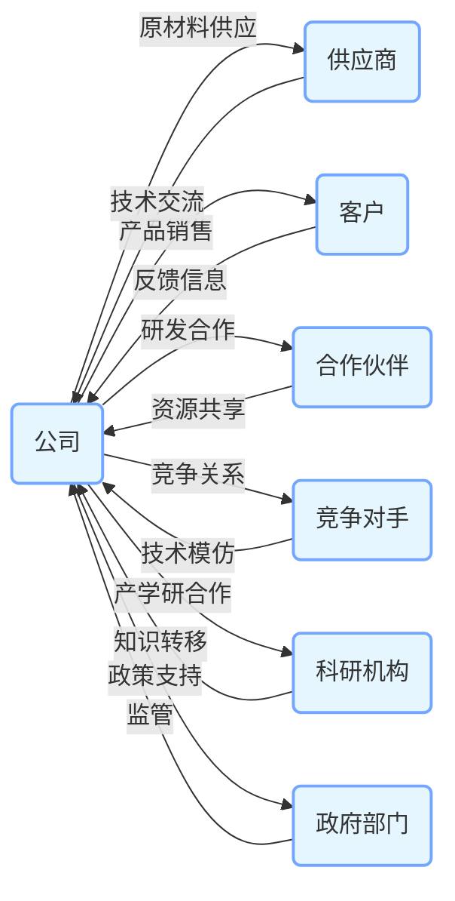

# 彼得林奇对公司创新生态系统的网络分析方法

> 关键词：彼得林奇、公司创新生态系统、网络分析方法、创新评估、投资策略

> 摘要：本文聚焦于彼得林奇对公司创新生态系统的网络分析方法。通过深入剖析该方法的背景、核心概念、算法原理、数学模型等内容，详细阐述其在评估公司创新能力及发展潜力方面的重要作用。结合项目实战案例，展示该方法在实际应用中的操作流程和效果。同时探讨其实际应用场景，推荐相关学习资源、开发工具及论文著作，最后总结该方法的未来发展趋势与挑战，并解答常见问题。旨在帮助读者全面了解彼得林奇的这一独特分析方法，为企业创新管理和投资决策提供有价值的参考。

## 1. 背景介绍 
### 1.1 目的和范围
彼得林奇作为投资界的传奇人物，其投资理念和分析方法一直备受关注。公司创新生态系统的网络分析方法是其评估公司价值的重要手段之一。本文的目的在于深入研究彼得林奇的这一方法，详细阐述其原理、应用及相关要点。范围涵盖该方法的理论基础、操作步骤、实际案例分析，以及在不同行业的应用场景探讨等方面，旨在为读者提供全面且深入的理解。

### 1.2 预期读者
本文预期读者包括对投资领域感兴趣的投资者，无论是专业的投资机构从业者还是个人投资者，都可以从本文中获取关于公司创新生态系统评估的新视角和方法。企业管理者也能从中学习如何优化公司的创新生态系统，提升企业的创新能力和竞争力。此外，对管理学、经济学等相关学科的研究人员和学生来说，本文也能为他们的学术研究提供有价值的参考。

### 1.3 文档结构概述
本文首先介绍彼得林奇对公司创新生态系统的网络分析方法的背景信息，包括目的、预期读者和文档结构等。接着阐述该方法的核心概念与联系，通过文本示意图和 Mermaid 流程图进行直观展示。然后详细讲解核心算法原理和具体操作步骤，结合 Python 源代码进行说明。随后介绍相关的数学模型和公式，并举例说明。再通过项目实战案例，展示该方法在实际中的应用和代码实现。之后探讨其实际应用场景，推荐相关的工具和资源。最后总结该方法的未来发展趋势与挑战，解答常见问题，并提供扩展阅读和参考资料。

### 1.4 术语表
#### 1.4.1 核心术语定义
- **公司创新生态系统**：指公司与其内外部利益相关者（如供应商、客户、合作伙伴、竞争对手等）之间相互作用、相互影响而形成的一个复杂系统，旨在促进公司的创新活动和价值创造。
- **网络分析方法**：通过构建网络模型，分析节点（如公司、利益相关者等）之间的关系（如合作关系、竞争关系等），以评估系统的结构、功能和性能的方法。
- **创新能力**：公司在产品、技术、管理、商业模式等方面进行创新的能力，体现为公司推出新的产品或服务、改进现有业务流程等方面的能力。

#### 1.4.2 相关概念解释
- **利益相关者**：指与公司的经营活动和发展具有利益关联的个人或组织，包括但不限于股东、员工、供应商、客户、政府机构、社区等。他们的行为和决策会对公司的创新生态系统产生影响。
- **网络节点**：在网络分析中，代表系统中的实体，如公司、部门、个人等。节点之间通过各种关系相互连接，形成网络结构。
- **网络边**：表示节点之间的关系，如合作协议、资金流动、信息传递等。边的属性可以包括关系的强度、频率、方向等。

#### 1.4.3 缩略词列表
- **R&D**：Research and Development，研究与开发。
- **CEO**：Chief Executive Officer，首席执行官。
- **CFO**：Chief Financial Officer，首席财务官。

## 2. 核心概念与联系 

### 核心概念原理
彼得林奇的公司创新生态系统的网络分析方法基于系统论和网络科学的原理。公司创新生态系统是一个开放的、动态的复杂系统，其中各个利益相关者作为节点，通过各种关系相互连接，形成一个网络结构。这些关系包括合作、竞争、信息交流、资源共享等，它们共同影响着公司的创新能力和发展潜力。

网络分析的核心在于研究节点之间的关系模式和网络结构的特征。例如，节点的度（即与该节点相连的边的数量）可以反映该节点在网络中的重要性和影响力；网络的聚类系数可以衡量节点之间的紧密程度和合作程度；网络的中心性指标（如介数中心性、接近中心性等）可以确定网络中的关键节点和信息传播的枢纽。

通过对公司创新生态系统的网络分析，可以深入了解公司在创新网络中的位置和作用，识别关键的利益相关者和合作关系，发现潜在的创新机会和风险，从而为公司的创新战略和投资决策提供依据。

### 架构的文本示意图
公司创新生态系统的网络架构可以用以下文本描述：

公司处于网络的中心位置，周围围绕着各种利益相关者节点，包括供应商、客户、合作伙伴、竞争对手、科研机构、政府部门等。公司与这些利益相关者之间存在着多种类型的边，代表着不同的关系。例如，公司与供应商之间可能存在原材料供应关系、技术合作关系；与客户之间存在产品销售关系、反馈交流关系；与合作伙伴之间存在研发合作关系、市场推广合作关系；与竞争对手之间存在竞争关系、技术模仿关系；与科研机构之间存在产学研合作关系；与政府部门之间存在政策支持关系、监管关系等。

这些关系相互交织，形成一个复杂的网络结构。网络中的信息、资源、知识等在节点之间流动和共享，影响着公司的创新活动和发展。

### Mermaid 流程图


## 3. 核心算法原理 & 具体操作步骤 

### 核心算法原理
彼得林奇的公司创新生态系统的网络分析方法主要基于图论和网络分析算法。以下是几个常用的算法及其原理：

#### 度中心性算法
度中心性是衡量节点在网络中重要性的一种简单方法。节点的度是指与该节点相连的边的数量。度中心性越高，说明该节点在网络中与其他节点的连接越广泛，其影响力也可能越大。

#### 介数中心性算法
介数中心性衡量的是节点在网络中作为信息传递中介的重要性。一个节点的介数中心性越高，说明它在很多最短路径上出现的频率越高，对信息在网络中的传播起着关键的中介作用。

#### 聚类系数算法
聚类系数衡量的是节点的邻居节点之间相互连接的紧密程度。聚类系数越高，说明节点的邻居节点之间的联系越紧密，网络的局部结构越稳定。

### 具体操作步骤

#### 步骤 1：数据收集
收集公司创新生态系统中各个利益相关者的信息，包括节点的基本信息（如名称、类型、规模等）和节点之间的关系信息（如合作协议、资金流动、信息交流等）。数据来源可以包括公司内部文档、行业报告、新闻媒体、社交媒体等。

#### 步骤 2：数据预处理
对收集到的数据进行清洗和整理，去除重复、错误或无效的数据。将数据转换为适合网络分析的格式，通常是邻接矩阵或边列表的形式。

#### 步骤 3：网络构建
根据预处理后的数据，构建公司创新生态系统的网络模型。可以使用图论库（如 NetworkX）来实现网络的创建和管理。

#### 步骤 4：网络分析
使用上述的网络分析算法，计算节点的度中心性、介数中心性、聚类系数等指标。分析网络的整体结构特征，如网络的密度、直径、平均路径长度等。

#### 步骤 5：结果可视化
将网络分析的结果以可视化的方式展示出来，如绘制网络图、柱状图、折线图等。通过可视化可以更直观地观察网络的结构和节点的重要性。

#### 步骤 6：分析与决策
根据网络分析的结果，分析公司在创新生态系统中的位置和作用，识别关键的利益相关者和合作关系，发现潜在的创新机会和风险。基于分析结果，制定公司的创新战略和投资决策。

### Python 源代码实现

```python
import networkx as nx
import matplotlib.pyplot as plt

# 步骤 1：数据收集（示例数据）
nodes = ['公司', '供应商', '客户', '合作伙伴', '竞争对手', '科研机构', '政府部门']
edges = [('公司', '供应商', {'relation': '原材料供应'}),
         ('公司', '客户', {'relation': '产品销售'}),
         ('公司', '合作伙伴', {'relation': '研发合作'}),
         ('公司', '竞争对手', {'relation': '竞争关系'}),
         ('公司', '科研机构', {'relation': '产学研合作'}),
         ('公司', '政府部门', {'relation': '政策支持'}),
         ('供应商', '公司', {'relation': '技术交流'}),
         ('客户', '公司', {'relation': '反馈信息'}),
         ('合作伙伴', '公司', {'relation': '资源共享'}),
         ('竞争对手', '公司', {'relation': '技术模仿'}),
         ('科研机构', '公司', {'relation': '知识转移'}),
         ('政府部门', '公司', {'relation': '监管'})]

# 步骤 2：数据预处理（这里数据已经是合适的格式，无需额外处理）

# 步骤 3：网络构建
G = nx.Graph()
G.add_nodes_from(nodes)
G.add_edges_from(edges)

# 步骤 4：网络分析
degree_centrality = nx.degree_centrality(G)
betweenness_centrality = nx.betweenness_centrality(G)
clustering_coefficient = nx.clustering(G)

print("度中心性：", degree_centrality)
print("介数中心性：", betweenness_centrality)
print("聚类系数：", clustering_coefficient)

# 步骤 5：结果可视化
pos = nx.spring_layout(G)
nx.draw_networkx(G, pos)
edge_labels = nx.get_edge_attributes(G, 'relation')
nx.draw_networkx_edge_labels(G, pos, edge_labels=edge_labels)
plt.title("公司创新生态系统网络")
plt.show()

# 步骤 6：分析与决策（这里仅为示例，实际中需要根据具体结果进行分析）
# 找出度中心性最高的节点
max_degree_node = max(degree_centrality, key=degree_centrality.get)
print("度中心性最高的节点：", max_degree_node)
```

## 4. 数学模型和公式 & 详细讲解 & 举例说明 

### 度中心性公式
度中心性 $C_D(v)$ 定义为节点 $v$ 的度 $k_v$ 与网络中节点的最大可能度 $n - 1$ 的比值，其中 $n$ 是网络中的节点总数。公式如下：

$$C_D(v)=\frac{k_v}{n - 1}$$

**详细讲解**：度中心性反映了节点在网络中的连接广泛程度。如果一个节点的度中心性接近 1，说明该节点与网络中的大部分节点都有连接，具有较高的影响力；如果度中心性接近 0，说明该节点的连接较少，影响力较小。

**举例说明**：在一个包含 10 个节点的网络中，节点 $A$ 的度为 5，则其度中心性为 $C_D(A)=\frac{5}{10 - 1}=\frac{5}{9}\approx0.56$。

### 介数中心性公式
节点 $v$ 的介数中心性 $C_B(v)$ 定义为经过节点 $v$ 的最短路径的数量 $\sigma_{st}(v)$ 与所有节点对之间的最短路径的总数 $\sigma_{st}$ 的比值之和，其中 $s$ 和 $t$ 是网络中的不同节点。公式如下：

$$C_B(v)=\sum_{s\neq v\neq t}\frac{\sigma_{st}(v)}{\sigma_{st}}$$

**详细讲解**：介数中心性衡量了节点在网络中作为信息传递中介的重要性。如果一个节点的介数中心性较高，说明它在很多最短路径上出现，对信息的传播起着关键的中介作用。

**举例说明**：假设有一个简单的网络，包含 4 个节点 $A$、$B$、$C$、$D$。节点对 $(A, D)$ 之间的最短路径有 2 条，其中经过节点 $B$ 的有 1 条；节点对 $(A, C)$ 之间的最短路径有 1 条，经过节点 $B$ 的有 1 条；其他节点对之间的最短路径不经过节点 $B$。则节点 $B$ 的介数中心性为 $C_B(B)=\frac{1}{2}+\frac{1}{1}=1.5$。

### 聚类系数公式
节点 $v$ 的聚类系数 $C(v)$ 定义为节点 $v$ 的邻居节点之间实际存在的边的数量 $e_v$ 与邻居节点之间可能存在的最大边的数量 $k_v(k_v - 1)/2$ 的比值，其中 $k_v$ 是节点 $v$ 的度。公式如下：

$$C(v)=\frac{2e_v}{k_v(k_v - 1)}$$

**详细讲解**：聚类系数衡量了节点的邻居节点之间相互连接的紧密程度。如果一个节点的聚类系数接近 1，说明其邻居节点之间的连接非常紧密，形成了一个紧密的小团体；如果聚类系数接近 0，说明邻居节点之间的连接较少。

**举例说明**：节点 $C$ 的度为 3，其邻居节点之间实际存在的边的数量为 2，则其聚类系数为 $C(C)=\frac{2\times2}{3\times(3 - 1)}=\frac{4}{6}\approx0.67$。

## 5. 项目实战：代码实际案例和详细解释说明 

### 5.1  开发环境搭建
- **Python 安装**：确保你已经安装了 Python 3.x 版本。可以从 Python 官方网站（https://www.python.org/downloads/） 下载并安装。
- **依赖库安装**：本项目使用了 NetworkX 和 Matplotlib 库。可以使用以下命令进行安装：
```sh
pip install networkx matplotlib
```

### 5.2  源代码详细实现和代码解读

```python
import networkx as nx
import matplotlib.pyplot as plt

# 步骤 1：数据收集（示例数据）
# 定义节点列表，包含公司及其利益相关者
nodes = ['公司', '供应商', '客户', '合作伙伴', '竞争对手', '科研机构', '政府部门']
# 定义边列表，每条边包含两个节点和边的属性（关系类型）
edges = [('公司', '供应商', {'relation': '原材料供应'}),
         ('公司', '客户', {'relation': '产品销售'}),
         ('公司', '合作伙伴', {'relation': '研发合作'}),
         ('公司', '竞争对手', {'relation': '竞争关系'}),
         ('公司', '科研机构', {'relation': '产学研合作'}),
         ('公司', '政府部门', {'relation': '政策支持'}),
         ('供应商', '公司', {'relation': '技术交流'}),
         ('客户', '公司', {'relation': '反馈信息'}),
         ('合作伙伴', '公司', {'relation': '资源共享'}),
         ('竞争对手', '公司', {'relation': '技术模仿'}),
         ('科研机构', '公司', {'relation': '知识转移'}),
         ('政府部门', '公司', {'relation': '监管'})]

# 步骤 2：数据预处理（这里数据已经是合适的格式，无需额外处理）

# 步骤 3：网络构建
# 创建一个无向图对象
G = nx.Graph()
# 向图中添加节点
G.add_nodes_from(nodes)
# 向图中添加边
G.add_edges_from(edges)

# 步骤 4：网络分析
# 计算节点的度中心性
degree_centrality = nx.degree_centrality(G)
# 计算节点的介数中心性
betweenness_centrality = nx.betweenness_centrality(G)
# 计算节点的聚类系数
clustering_coefficient = nx.clustering(G)

# 打印分析结果
print("度中心性：", degree_centrality)
print("介数中心性：", betweenness_centrality)
print("聚类系数：", clustering_coefficient)

# 步骤 5：结果可视化
# 使用弹簧布局算法确定节点的位置
pos = nx.spring_layout(G)
# 绘制网络图
nx.draw_networkx(G, pos)
# 获取边的属性（关系类型）
edge_labels = nx.get_edge_attributes(G, 'relation')
# 绘制边的标签
nx.draw_networkx_edge_labels(G, pos, edge_labels=edge_labels)
# 设置图的标题
plt.title("公司创新生态系统网络")
# 显示图形
plt.show()

# 步骤 6：分析与决策（这里仅为示例，实际中需要根据具体结果进行分析）
# 找出度中心性最高的节点
max_degree_node = max(degree_centrality, key=degree_centrality.get)
print("度中心性最高的节点：", max_degree_node)
```

### 5.3  代码解读与分析
- **数据收集**：通过定义节点列表和边列表来模拟收集到的公司创新生态系统的数据。节点列表包含公司及其利益相关者，边列表包含节点之间的关系信息。
- **网络构建**：使用 NetworkX 库的 `Graph` 类创建一个无向图对象，并将节点和边添加到图中。
- **网络分析**：使用 NetworkX 库提供的函数计算节点的度中心性、介数中心性和聚类系数。这些指标可以帮助我们了解节点在网络中的重要性和网络的结构特征。
- **结果可视化**：使用 Matplotlib 库绘制网络图，并添加边的标签，使网络结构更加直观。
- **分析与决策**：通过找出度中心性最高的节点，我们可以初步判断在网络中连接最广泛的节点，从而为进一步的分析和决策提供参考。

## 6. 实际应用场景 
### 投资决策
投资者可以使用彼得林奇的公司创新生态系统的网络分析方法来评估公司的创新能力和发展潜力。通过分析公司在创新生态系统中的位置和作用，识别关键的利益相关者和合作关系，投资者可以更准确地判断公司的价值和投资风险。例如，如果一个公司与多个科研机构和合作伙伴有紧密的合作关系，其创新能力可能较强，具有较高的投资价值。

### 企业战略规划
企业管理者可以利用该方法来优化公司的创新生态系统，制定合理的创新战略。通过分析网络结构和节点的重要性，企业可以确定关键的合作伙伴和资源，加强与他们的合作，提高创新效率。同时，企业还可以发现潜在的竞争对手和风险，及时调整战略，增强企业的竞争力。

### 行业分析
行业分析师可以使用该方法来研究整个行业的创新生态系统，了解行业内企业之间的关系和竞争格局。通过比较不同企业在网络中的位置和作用，分析师可以发现行业的创新趋势和发展方向，为行业的发展提供建议和决策支持。

### 政策制定
政府部门可以利用该方法来评估产业政策的效果，制定促进创新的政策措施。通过分析创新生态系统的网络结构和节点的重要性，政府可以确定需要重点支持的企业和领域，加大对创新的投入，推动产业升级和经济发展。

## 7. 工具和资源推荐
### 7.1 学习资源推荐
#### 7.1.1 书籍推荐
- 《彼得林奇的成功投资》：彼得林奇的经典著作，详细介绍了他的投资理念和方法，对理解公司创新生态系统的分析有很大的帮助。
- 《网络科学》：全面介绍了网络科学的基本概念、理论和方法，是学习网络分析的重要参考书籍。
- 《复杂网络理论及其应用》：深入探讨了复杂网络的结构、动力学和应用，对理解公司创新生态系统的网络结构有重要的指导意义。

#### 7.1.2 在线课程
- Coursera 上的“Network Science”课程：由知名教授授课，系统地介绍了网络科学的基础知识和应用。
- edX 上的“Complex Networks”课程：提供了复杂网络的理论和实践内容，帮助学习者掌握网络分析的方法和工具。

#### 7.1.3 技术博客和网站
- NetworkX 官方文档：提供了 NetworkX 库的详细使用说明和示例代码，是学习网络分析编程的重要资源。
- 开源中国：提供了丰富的技术文章和案例，包括网络分析、数据分析等领域的内容。
- 知乎：有很多关于投资、创新管理、网络科学等方面的讨论和分享，可以从中获取不同的观点和经验。

### 7.2 开发工具框架推荐
#### 7.2.1 IDE和编辑器
- PyCharm：一款专业的 Python 集成开发环境，提供了丰富的功能和工具，方便开发和调试 Python 代码。
- Jupyter Notebook：一个交互式的开发环境，适合进行数据分析和可视化，支持 Python 等多种编程语言。

#### 7.2.2 调试和性能分析工具
- pdb：Python 内置的调试器，可以帮助开发者定位和解决代码中的问题。
- cProfile：Python 内置的性能分析工具，可以分析代码的运行时间和性能瓶颈。

#### 7.2.3 相关框架和库
- NetworkX：一个用于创建、操作和研究复杂网络的 Python 库，提供了丰富的网络分析算法和工具。
- Matplotlib：一个用于数据可视化的 Python 库，可以绘制各种类型的图表和图形，方便展示网络分析的结果。
- Pandas：一个用于数据处理和分析的 Python 库，可以帮助开发者对收集到的数据进行清洗、整理和分析。

### 7.3 相关论文著作推荐
#### 7.3.1 经典论文
- Albert, R., & Barabási, A. L. (2002). Statistical mechanics of complex networks. Reviews of modern physics, 74(1), 47. 该论文介绍了复杂网络的统计力学模型，对理解网络的结构和动力学有重要的贡献。
- Newman, M. E. (2003). The structure and function of complex networks. SIAM review, 45(2), 167-256. 该论文系统地介绍了复杂网络的结构和功能，是网络科学领域的经典文献。

#### 7.3.2 最新研究成果
- 关注顶级学术期刊如《Nature》、《Science》、《PNAS》等，以及网络科学、管理学、经济学等领域的专业期刊，获取关于公司创新生态系统和网络分析的最新研究成果。

#### 7.3.3 应用案例分析
- 可以参考一些知名企业的案例分析报告，了解他们如何利用网络分析方法优化创新生态系统，提升企业的竞争力。例如，苹果公司在供应链管理和创新合作方面的成功案例。

## 8. 总结：未来发展趋势与挑战
### 未来发展趋势
- **智能化与自动化**：随着人工智能和机器学习技术的发展，公司创新生态系统的网络分析方法将越来越智能化和自动化。通过机器学习算法，可以自动识别网络中的关键节点和关系模式，提高分析的效率和准确性。
- **多学科融合**：该方法将与管理学、经济学、社会学、计算机科学等多个学科进行更深入的融合。通过跨学科的研究和应用，可以更好地理解公司创新生态系统的复杂性和动态性，为企业的创新管理和投资决策提供更全面的支持。
- **全球化与数字化**：在全球化和数字化的背景下，公司创新生态系统的网络将更加复杂和庞大。网络分析方法将需要应对跨国、跨行业的复杂网络，考虑不同文化、政策和技术环境的影响。

### 挑战
- **数据获取与质量**：准确、全面的数据是进行网络分析的基础。然而，获取公司创新生态系统的相关数据往往面临着数据隐私、数据分散、数据质量参差不齐等问题。如何有效地获取和处理高质量的数据是一个重要的挑战。
- **模型复杂性与解释性**：随着网络分析模型的不断发展和完善，模型的复杂性也在增加。复杂的模型可能会导致解释性变差，难以理解模型的结果和决策依据。如何在保证模型准确性的前提下，提高模型的解释性是一个需要解决的问题。
- **动态性与适应性**：公司创新生态系统是一个动态的系统，节点和关系会随着时间的推移而发生变化。如何及时捕捉这些变化，使网络分析模型具有良好的动态性和适应性，是一个挑战。

## 9. 附录：常见问题与解答
### 问题 1：如何选择合适的网络分析指标？
解答：选择合适的网络分析指标需要根据具体的分析目的和问题来确定。如果关注节点的连接广泛程度，可以选择度中心性指标；如果关注节点在信息传播中的中介作用，可以选择介数中心性指标；如果关注节点邻居之间的紧密程度，可以选择聚类系数指标。在实际应用中，通常需要综合考虑多个指标，以全面了解网络的结构和节点的重要性。

### 问题 2：网络分析结果的准确性如何保证？
解答：网络分析结果的准确性取决于数据的质量和分析方法的合理性。为了保证数据的质量，需要进行严格的数据收集和预处理，去除错误和无效的数据。在选择分析方法时，需要根据问题的特点和数据的类型选择合适的算法和模型。同时，还可以通过多次实验和验证，对分析结果进行评估和优化。

### 问题 3：如何将网络分析结果应用到实际决策中？
解答：将网络分析结果应用到实际决策中需要结合具体的业务场景和决策目标。例如，在投资决策中，可以根据节点的重要性和网络的结构特征，评估公司的创新能力和发展潜力，从而做出投资决策；在企业战略规划中，可以根据分析结果确定关键的合作伙伴和资源，制定合理的创新战略。在应用过程中，需要对分析结果进行深入的解读和分析，结合实际情况进行综合判断。

## 10. 扩展阅读 & 参考资料
### 扩展阅读
- 《创新的艺术》：介绍了创新的方法和技巧，帮助读者更好地理解公司创新生态系统的内涵和重要性。
- 《大数据时代》：探讨了大数据在各个领域的应用和影响，对理解数据在网络分析中的作用有很大的帮助。

### 参考资料
- 彼得林奇的相关著作和演讲资料。
- NetworkX 官方文档和相关技术博客。
- 相关学术期刊和会议论文。