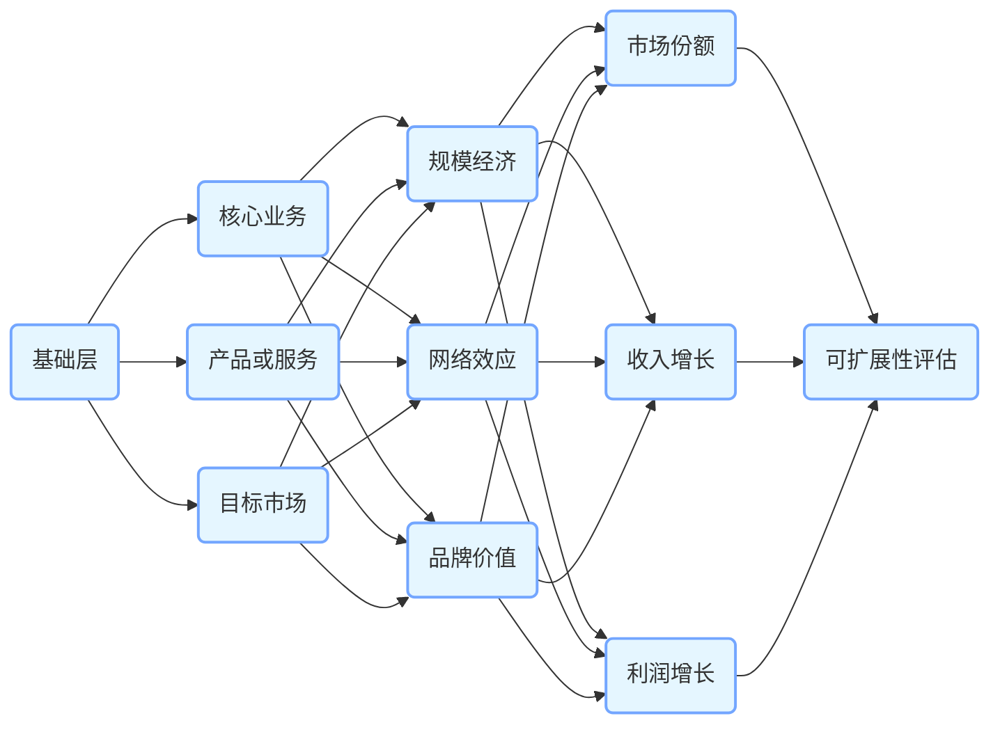

# 彼得林奇对公司商业模式可扩展性的长期评估

> 关键词：彼得林奇、商业模式、可扩展性、长期评估、投资策略

> 摘要：本文聚焦于彼得林奇对公司商业模式可扩展性的长期评估方法。彼得林奇作为投资领域的传奇人物，其投资理念和方法对投资者有着深远影响。商业模式的可扩展性是评估公司长期价值的关键因素之一，关乎公司能否在市场中持续增长和保持竞争力。文章将深入剖析彼得林奇评估公司商业模式可扩展性的核心概念、算法原理、数学模型，通过项目实战案例展示其应用，并探讨实际应用场景、推荐相关工具和资源，最后总结未来发展趋势与挑战，为投资者和企业管理者提供全面且深入的参考。

## 1. 背景介绍 
### 1.1 目的和范围
本文的目的在于深入研究彼得林奇评估公司商业模式可扩展性的方法，为投资者提供一套科学、实用的评估框架，帮助他们更好地识别具有长期投资价值的公司。同时，也为企业管理者提供借鉴，使其能够优化公司的商业模式，提升公司的可扩展性和竞争力。范围涵盖了彼得林奇评估方法的理论基础、具体操作步骤、实际应用案例以及相关的工具和资源。

### 1.2 预期读者
本文预期读者包括投资者，无论是专业的机构投资者还是普通的个人投资者，都能从本文中获取有价值的投资思路和方法；企业管理者可以借鉴本文的评估方法，优化公司的商业模式；对投资和商业管理感兴趣的研究人员和学生也可以通过本文深入了解相关领域的知识。

### 1.3 文档结构概述
本文首先介绍背景信息，包括目的、预期读者和文档结构概述等内容。接着阐述核心概念与联系，通过文本示意图和 Mermaid 流程图展示商业模式可扩展性的原理和架构。然后详细讲解核心算法原理和具体操作步骤，并用 Python 源代码进行阐述。随后介绍数学模型和公式，并通过举例说明其应用。在项目实战部分，通过实际案例展示评估方法的应用和代码解读。之后探讨实际应用场景，推荐相关的工具和资源。最后总结未来发展趋势与挑战，解答常见问题，并提供扩展阅读和参考资料。

### 1.4 术语表
#### 1.4.1 核心术语定义
- **商业模式**：指企业为了创造价值、传递价值和获取价值而建立的一种逻辑架构和运营方式。
- **可扩展性**：指公司的商业模式在不显著增加成本的情况下，能够随着市场需求的增长而扩大业务规模、增加收入和利润的能力。
- **长期评估**：指对公司商业模式可扩展性进行持续、深入的分析和判断，以确定其在较长时间内的发展潜力和价值。

#### 1.4.2 相关概念解释
- **规模经济**：指随着生产规模的扩大，单位成本逐渐降低，从而提高企业的盈利能力。
- **网络效应**：指产品或服务的价值随着用户数量的增加而增加，从而吸引更多的用户，形成良性循环。
- **品牌价值**：指品牌在消费者心目中的形象和声誉，能够为企业带来竞争优势和额外的价值。

#### 1.4.3 缩略词列表
- **ROE**：Return on Equity，净资产收益率
- **EPS**：Earnings Per Share，每股收益

## 2. 核心概念与联系 

### 核心概念原理
彼得林奇认为，公司商业模式的可扩展性是评估其长期投资价值的关键因素之一。一个具有可扩展性的商业模式能够在不显著增加成本的情况下，随着市场需求的增长而扩大业务规模、增加收入和利润。可扩展性的来源主要包括规模经济、网络效应、品牌价值等。

规模经济是指随着生产规模的扩大，单位成本逐渐降低，从而提高企业的盈利能力。例如，一家制造企业通过扩大生产规模，可以降低原材料采购成本、分摊固定成本等，从而提高产品的利润率。

网络效应是指产品或服务的价值随着用户数量的增加而增加，从而吸引更多的用户，形成良性循环。例如，社交网络平台的用户越多，其对新用户的吸引力就越大，因为用户可以在平台上结识更多的朋友、获取更多的信息。

品牌价值是指品牌在消费者心目中的形象和声誉，能够为企业带来竞争优势和额外的价值。例如，消费者往往愿意为知名品牌的产品支付更高的价格，因为他们认为知名品牌的产品质量更有保障、更具可靠性。

### 架构的文本示意图
商业模式可扩展性的评估架构可以分为三个层次：基础层、中间层和应用层。

基础层包括公司的核心业务、产品或服务、目标市场等，是商业模式的基石。中间层包括规模经济、网络效应、品牌价值等可扩展性来源，是商业模式能够实现扩展的关键因素。应用层包括公司的市场份额、收入增长、利润增长等指标，是商业模式可扩展性的具体体现。

### Mermaid 流程图


## 3. 核心算法原理 & 具体操作步骤 

### 核心算法原理
彼得林奇评估公司商业模式可扩展性的核心算法基于对公司财务数据和业务数据的分析。主要通过计算一些关键指标，如净资产收益率（ROE）、每股收益（EPS）的增长率等，来评估公司的盈利能力和增长潜力。同时，还会考虑公司的市场份额、竞争优势等因素，综合判断公司商业模式的可扩展性。

### 具体操作步骤
1. **收集数据**：收集公司的财务报表、行业报告、市场研究等数据，包括收入、利润、资产、负债、市场份额等信息。
2. **计算关键指标**：计算 ROE、EPS 增长率等关键指标，评估公司的盈利能力和增长潜力。
3. **分析可扩展性来源**：分析公司的规模经济、网络效应、品牌价值等可扩展性来源，判断其对公司增长的影响。
4. **评估竞争优势**：评估公司的竞争优势，包括产品差异化、成本优势、技术创新等，判断其在市场中的地位。
5. **综合判断**：综合考虑以上因素，对公司商业模式的可扩展性进行评估，判断其是否具有长期投资价值。

### Python 源代码阐述
```python
import pandas as pd

# 假设已经收集到公司的财务数据，存储在一个 CSV 文件中
data = pd.read_csv('company_financial_data.csv')

# 计算 ROE
data['ROE'] = data['净利润'] / data['净资产']

# 计算 EPS 增长率
data['EPS'] = data['净利润'] / data['总股本']
data['EPS 增长率'] = data['EPS'].pct_change()

# 分析可扩展性来源（示例：简单判断市场份额是否增长）
data['市场份额增长'] = data['市场份额'].diff() > 0

# 评估竞争优势（示例：简单判断毛利率是否高于行业平均）
industry_avg_gross_margin = 0.3
data['竞争优势'] = data['毛利率'] > industry_avg_gross_margin

# 综合判断（示例：简单根据 ROE、EPS 增长率、市场份额增长和竞争优势进行打分）
data['可扩展性得分'] = data['ROE'] * 0.3 + data['EPS 增长率'].fillna(0) * 0.3 + data['市场份额增长'].astype(int) * 0.2 + data['竞争优势'].astype(int) * 0.2

# 输出结果
print(data[['年份', 'ROE', 'EPS 增长率', '市场份额增长', '竞争优势', '可扩展性得分']])
```

## 4. 数学模型和公式 & 详细讲解 & 举例说明 

### 数学模型和公式
- **净资产收益率（ROE）**：
$$ROE = \frac{净利润}{净资产}$$
ROE 反映了公司利用自有资本获取收益的能力，是评估公司盈利能力的重要指标。

- **每股收益（EPS）增长率**：
$$EPS 增长率 = \frac{本期 EPS - 上期 EPS}{上期 EPS}$$
EPS 增长率反映了公司每股收益的增长情况，是评估公司增长潜力的重要指标。

### 详细讲解
ROE 越高，说明公司利用自有资本获取收益的能力越强，盈利能力越好。EPS 增长率越高，说明公司的每股收益增长越快，增长潜力越大。在评估公司商业模式的可扩展性时，需要综合考虑 ROE 和 EPS 增长率等指标，同时结合公司的可扩展性来源和竞争优势进行判断。

### 举例说明
假设一家公司的净利润为 1000 万元，净资产为 5000 万元，则其 ROE 为：
$$ROE = \frac{1000}{5000} = 0.2 = 20\%$$
假设该公司上期 EPS 为 1 元，本期 EPS 为 1.2 元，则其 EPS 增长率为：
$$EPS 增长率 = \frac{1.2 - 1}{1} = 0.2 = 20\%$$
通过计算 ROE 和 EPS 增长率，可以初步评估该公司的盈利能力和增长潜力。如果该公司还具有规模经济、网络效应等可扩展性来源，并且具有较强的竞争优势，则可以判断其商业模式具有较好的可扩展性。

## 5. 项目实战：代码实际案例和详细解释说明 

### 5.1  开发环境搭建
- **编程语言**：Python 3.x
- **开发工具**：Jupyter Notebook 或 PyCharm
- **所需库**：pandas、numpy 等

安装所需库的命令：
```sh
pip install pandas numpy
```

### 5.2  源代码详细实现和代码解读
```python
import pandas as pd
import numpy as np

# 读取公司财务数据
data = pd.read_csv('company_financial_data.csv')

# 数据预处理
# 处理缺失值
data = data.fillna(0)

# 计算 ROE
data['ROE'] = data['净利润'] / data['净资产']

# 计算 EPS
data['EPS'] = data['净利润'] / data['总股本']

# 计算 EPS 增长率
data['EPS 增长率'] = data['EPS'].pct_change()

# 分析可扩展性来源
# 计算市场份额增长率
data['市场份额增长率'] = data['市场份额'].pct_change()

# 判断市场份额是否增长
data['市场份额增长'] = data['市场份额增长率'] > 0

# 评估竞争优势
# 假设行业平均毛利率为 0.3
industry_avg_gross_margin = 0.3
data['竞争优势'] = data['毛利率'] > industry_avg_gross_margin

# 综合判断
# 为各指标分配权重
weights = {
    'ROE': 0.3,
    'EPS 增长率': 0.3,
    '市场份额增长': 0.2,
    '竞争优势': 0.2
}

# 计算可扩展性得分
data['可扩展性得分'] = data['ROE'] * weights['ROE'] + data['EPS 增长率'].fillna(0) * weights['EPS 增长率'] + data['市场份额增长'].astype(int) * weights['市场份额增长'] + data['竞争优势'].astype(int) * weights['竞争优势']

# 输出结果
print(data[['年份', 'ROE', 'EPS 增长率', '市场份额增长', '竞争优势', '可扩展性得分']])
```

### 代码解读与分析
1. **数据读取**：使用 `pandas` 库的 `read_csv` 函数读取公司的财务数据。
2. **数据预处理**：使用 `fillna` 函数处理缺失值，将缺失值填充为 0。
3. **指标计算**：计算 ROE、EPS 和 EPS 增长率等指标。
4. **可扩展性来源分析**：计算市场份额增长率，并判断市场份额是否增长。
5. **竞争优势评估**：根据行业平均毛利率判断公司是否具有竞争优势。
6. **综合判断**：为各指标分配权重，计算可扩展性得分。
7. **结果输出**：输出计算结果，包括年份、ROE、EPS 增长率、市场份额增长、竞争优势和可扩展性得分。

通过以上代码，可以对公司商业模式的可扩展性进行评估，为投资决策提供参考。

## 6. 实际应用场景 
### 投资决策
投资者可以使用彼得林奇的评估方法，对不同公司的商业模式可扩展性进行评估，选择具有长期投资价值的公司进行投资。通过分析公司的财务数据、可扩展性来源和竞争优势等因素，投资者可以更准确地判断公司的发展潜力和投资价值，降低投资风险。

### 企业战略规划
企业管理者可以借鉴彼得林奇的评估方法，对公司的商业模式进行优化和调整。通过分析公司的可扩展性来源和竞争优势，企业管理者可以发现公司的优势和不足，制定相应的战略规划，提升公司的竞争力和可扩展性。

### 行业分析
分析师可以使用该评估方法，对整个行业的公司进行分析和比较。通过分析行业内不同公司的商业模式可扩展性，分析师可以了解行业的发展趋势和竞争格局，为行业研究和投资建议提供参考。

## 7. 工具和资源推荐
### 7.1 学习资源推荐
#### 7.1.1 书籍推荐
- 《彼得林奇的成功投资》：彼得林奇的经典著作，详细介绍了他的投资理念和方法。
- 《聪明的投资者》：本杰明·格雷厄姆的经典著作，对价值投资理论进行了深入阐述。
- 《财务报表分析与证券定价》：介绍了财务报表分析的方法和技巧，对评估公司的财务状况和盈利能力有很大帮助。

#### 7.1.2 在线课程
- Coursera 上的《投资学》课程：由知名教授授课，系统介绍了投资学的基本理论和方法。
- edX 上的《财务报表分析》课程：详细讲解了财务报表分析的方法和技巧。

#### 7.1.3 技术博客和网站
- 雪球网：国内知名的投资社区，提供了丰富的投资资讯和分析文章。
- Seeking Alpha：国外知名的投资网站，提供了大量的投资分析和研究报告。

### 7.2 开发工具框架推荐
#### 7.2.1 IDE和编辑器
- Jupyter Notebook：交互式的开发环境，适合数据探索和分析。
- PyCharm：专业的 Python 开发工具，提供了丰富的功能和插件。

#### 7.2.2 调试和性能分析工具
- pdb：Python 内置的调试工具，用于调试 Python 代码。
- cProfile：Python 内置的性能分析工具，用于分析 Python 代码的性能瓶颈。

#### 7.2.3 相关框架和库
- pandas：用于数据处理和分析的 Python 库，提供了丰富的数据结构和函数。
- numpy：用于科学计算的 Python 库，提供了高效的数组和矩阵运算功能。

### 7.3 相关论文著作推荐
#### 7.3.1 经典论文
- 《有效市场假说》：由尤金·法玛提出，对金融市场的有效性进行了深入研究。
- 《资本资产定价模型》：由威廉·夏普等人提出，对资产定价理论进行了重要贡献。

#### 7.3.2 最新研究成果
- 关注顶级金融学术期刊，如《Journal of Finance》、《Review of Financial Studies》等，获取最新的研究成果。

#### 7.3.3 应用案例分析
- 阅读投资机构和分析师发布的研究报告，了解实际应用案例和分析方法。

## 8. 总结：未来发展趋势与挑战
### 未来发展趋势
- **数字化转型**：随着科技的不断发展，越来越多的公司将进行数字化转型，利用大数据、人工智能等技术提升商业模式的可扩展性。
- **可持续发展**：投资者和消费者越来越关注公司的可持续发展能力，具有可持续发展商业模式的公司将更具竞争力。
- **全球化竞争**：随着全球化的发展，公司面临的竞争将更加激烈，需要不断创新和优化商业模式，以提高可扩展性和竞争力。

### 挑战
- **数据质量和可靠性**：评估公司商业模式的可扩展性需要大量的数据支持，数据的质量和可靠性直接影响评估结果的准确性。
- **技术变革的不确定性**：科技的快速发展带来了技术变革的不确定性，公司需要不断适应技术变革，否则其商业模式的可扩展性可能受到影响。
- **竞争环境的变化**：市场竞争环境不断变化，公司需要及时调整商业模式，以应对竞争挑战，保持可扩展性。

## 9. 附录：常见问题与解答
### 问题 1：如何确定各指标的权重？
各指标的权重可以根据不同的行业和公司特点进行调整。一般来说，可以参考行业平均水平、专家意见和历史数据等，综合确定各指标的权重。

### 问题 2：如何处理异常值？
对于异常值，可以采用数据清洗的方法进行处理，如删除异常值、替换异常值等。也可以采用统计方法进行处理，如使用中位数、均值等代替异常值。

### 问题 3：如何评估新兴行业公司的商业模式可扩展性？
对于新兴行业公司，由于其发展阶段和业务模式与传统行业不同，评估其商业模式可扩展性需要更多地关注其创新能力、技术实力和市场潜力等因素。可以参考行业报告、专家意见和市场数据等，综合评估其可扩展性。

## 10. 扩展阅读 & 参考资料
- 彼得林奇. 《彼得林奇的成功投资》. 机械工业出版社.
- 本杰明·格雷厄姆. 《聪明的投资者》. 人民邮电出版社.
- 斯蒂芬·彭曼. 《财务报表分析与证券定价》. 中国人民大学出版社.
- Coursera 平台上的《投资学》课程.
- edX 平台上的《财务报表分析》课程.
- 雪球网. [https://xueqiu.com/](https://xueqiu.com/)
- Seeking Alpha. [https://seekingalpha.com/](https://seekingalpha.com/)
- 《Journal of Finance》期刊.
- 《Review of Financial Studies》期刊.