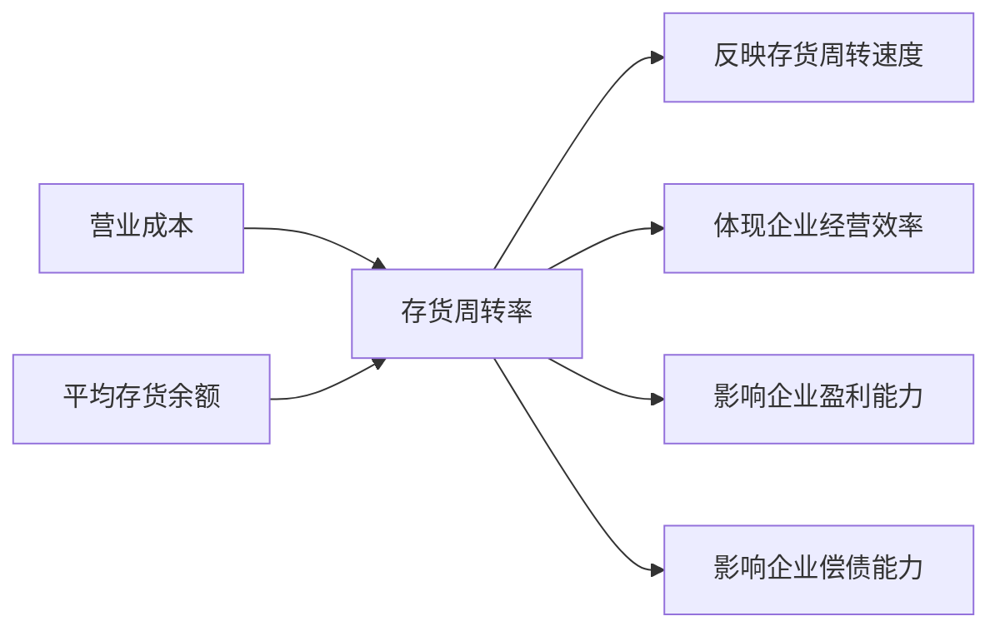

# 彼得林奇对公司存货周转率的分析

> 关键词：彼得林奇、存货周转率、公司分析、财务指标、投资策略

> 摘要：本文深入探讨彼得林奇对公司存货周转率的分析方法和理念。彼得林奇作为投资界的传奇人物，其对存货周转率的关注和分析为投资者评估公司经营状况和投资价值提供了重要视角。文章将先介绍背景知识，包括目的、预期读者等，接着阐述存货周转率的核心概念与联系，详细讲解其算法原理和数学模型，通过项目实战展示实际案例及代码实现，探讨其实际应用场景，推荐相关工具和资源，最后总结未来发展趋势与挑战，并解答常见问题，为投资者和研究人员提供全面而深入的参考。

## 1. 背景介绍 
### 1.1 目的和范围
本文的目的在于深入剖析彼得林奇对公司存货周转率的分析方法和思路，为投资者、财务分析人员以及对企业经营管理感兴趣的人士提供有价值的参考。通过研究彼得林奇的观点和实践，我们将探讨存货周转率这一重要财务指标在评估公司运营效率、盈利能力和投资价值方面的应用。范围涵盖存货周转率的基本概念、计算方法、影响因素，以及彼得林奇如何运用这一指标进行公司分析和投资决策。

### 1.2 预期读者
本文预期读者包括但不限于以下几类人群：
- **投资者**：希望通过分析财务指标来评估公司投资价值，做出更明智投资决策的个人和机构投资者。
- **财务分析人员**：从事财务分析、企业估值等工作，需要深入了解存货周转率等财务指标的专业人士。
- **企业管理人员**：关注企业运营效率和财务状况，希望通过优化存货管理提高企业竞争力的企业管理者。
- **学术研究人员**：对财务分析、投资理论等领域进行研究的学者和学生。

### 1.3 文档结构概述
本文将按照以下结构展开：
- **核心概念与联系**：介绍存货周转率的基本概念、原理和架构，通过文本示意图和 Mermaid 流程图进行直观展示。
- **核心算法原理 & 具体操作步骤**：详细讲解存货周转率的计算方法，使用 Python 源代码进行示例。
- **数学模型和公式 & 详细讲解 & 举例说明**：阐述存货周转率的数学模型和公式，并通过具体例子进行说明。
- **项目实战：代码实际案例和详细解释说明**：通过实际案例展示如何运用 Python 代码计算和分析存货周转率。
- **实际应用场景**：探讨存货周转率在企业经营管理、投资决策等方面的实际应用。
- **工具和资源推荐**：推荐学习存货周转率相关知识的书籍、在线课程、技术博客和网站，以及开发工具和相关框架。
- **总结：未来发展趋势与挑战**：总结彼得林奇对存货周转率分析的要点，展望未来发展趋势和面临的挑战。
- **附录：常见问题与解答**：解答关于存货周转率的常见问题。
- **扩展阅读 & 参考资料**：提供进一步学习和研究的参考资料。

### 1.4 术语表
#### 1.4.1 核心术语定义
- **存货周转率**：存货周转率是企业一定时期营业成本与平均存货余额的比率，用于反映存货的周转速度，即存货的流动性及存货资金占用量是否合理。
- **营业成本**：也称为销售成本，是指企业为生产产品、提供劳务等发生的可归属于产品成本、劳务成本等的费用。
- **平均存货余额**：是指企业在一定时期内期初存货余额与期末存货余额的平均值。

#### 1.4.2 相关概念解释
- **存货周转天数**：存货周转天数是存货周转率的另一种表现形式，它是指企业从取得存货开始，至消耗、销售为止所经历的天数。存货周转天数 = 365 / 存货周转率。
- **存货管理**：是指企业对存货的采购、存储、销售等环节进行的计划、组织、控制和协调等活动，旨在确保存货的合理储备，降低存货成本，提高企业的经济效益。

#### 1.4.3 缩略词列表
- **COGS**：Cost of Goods Sold，营业成本
- **AVG_INV**：Average Inventory，平均存货余额
- **ITR**：Inventory Turnover Ratio，存货周转率

## 2. 核心概念与联系 

### 存货周转率的原理
存货周转率反映了企业存货管理的效率和水平。较高的存货周转率意味着企业能够快速地将存货转化为销售收入，存货的流动性较强，存货占用的资金较少，企业的经营效率较高。相反，较低的存货周转率可能表示企业存货积压，销售不畅，存货占用的资金较多，企业的经营效率较低。

### 存货周转率与其他财务指标的联系
存货周转率与企业的盈利能力、偿债能力等密切相关。较高的存货周转率通常伴随着较高的毛利率和净利率，因为企业能够更快地将存货销售出去，减少了存货持有成本和跌价损失。同时，较高的存货周转率也有助于提高企业的短期偿债能力，因为存货是企业流动资产的重要组成部分，存货的快速周转能够增加企业的现金流入，提高企业的偿债能力。

### 文本示意图
存货周转率的核心概念可以用以下文本示意图表示：

```plaintext
存货周转率
|
|-- 营业成本
|-- 平均存货余额
|
|-- 反映存货周转速度
|-- 体现企业经营效率
|-- 影响企业盈利能力和偿债能力
```

### Mermaid 流程图


## 3. 核心算法原理 & 具体操作步骤 

### 存货周转率的计算公式
存货周转率（ITR）的计算公式为：

$$ITR = \frac{COGS}{AVG\_INV}$$

其中，$COGS$ 表示营业成本，$AVG\_INV$ 表示平均存货余额。平均存货余额的计算公式为：

$$AVG\_INV = \frac{期初存货余额 + 期末存货余额}{2}$$

### Python 源代码实现
以下是使用 Python 实现存货周转率计算的示例代码：

```python
def calculate_inventory_turnover(cogs, beginning_inventory, ending_inventory):
    """
    计算存货周转率
    :param cogs: 营业成本
    :param beginning_inventory: 期初存货余额
    :param ending_inventory: 期末存货余额
    :return: 存货周转率
    """
    average_inventory = (beginning_inventory + ending_inventory) / 2
    if average_inventory == 0:
        return 0
    inventory_turnover = cogs / average_inventory
    return inventory_turnover

# 示例数据
cogs = 1000000
beginning_inventory = 200000
ending_inventory = 300000

# 计算存货周转率
itr = calculate_inventory_turnover(cogs, beginning_inventory, ending_inventory)
print(f"存货周转率: {itr}")
```

### 具体操作步骤
1. **收集数据**：收集企业的营业成本、期初存货余额和期末存货余额数据。这些数据可以从企业的财务报表中获取。
2. **计算平均存货余额**：根据公式计算平均存货余额。
3. **计算存货周转率**：将营业成本除以平均存货余额，得到存货周转率。
4. **分析结果**：根据存货周转率的结果，分析企业的存货管理效率和经营状况。

## 4. 数学模型和公式 & 详细讲解 & 举例说明 

### 数学模型
存货周转率的数学模型基于企业的营业成本和存货余额之间的关系。营业成本反映了企业在一定时期内销售产品或提供劳务所发生的成本，而存货余额则反映了企业在某一时刻所拥有的存货价值。存货周转率通过将营业成本与平均存货余额相比较，反映了存货的周转速度。

### 详细讲解
- **营业成本**：营业成本是企业在生产经营过程中发生的直接成本，包括原材料成本、人工成本、制造费用等。营业成本的高低直接影响企业的盈利能力。
- **平均存货余额**：平均存货余额是企业在一定时期内期初存货余额与期末存货余额的平均值。平均存货余额的大小反映了企业存货的储备水平。
- **存货周转率**：存货周转率越高，说明企业存货的周转速度越快，存货占用的资金越少，企业的经营效率越高。反之，存货周转率越低，说明企业存货的周转速度越慢，存货占用的资金越多，企业的经营效率越低。

### 举例说明
假设某企业在 2023 年度的营业成本为 500 万元，期初存货余额为 100 万元，期末存货余额为 150 万元。则该企业的平均存货余额为：

$$AVG\_INV = \frac{100 + 150}{2} = 125 \text{（万元）}$$

该企业的存货周转率为：

$$ITR = \frac{500}{125} = 4 \text{（次）}$$

这意味着该企业在 2023 年度存货周转了 4 次，平均每 91.25 天（365 / 4）周转一次。

## 5. 项目实战：代码实际案例和详细解释说明 

### 5.1  开发环境搭建
在进行项目实战之前，需要搭建 Python 开发环境。可以按照以下步骤进行：
1. **安装 Python**：从 Python 官方网站（https://www.python.org/downloads/）下载并安装 Python 3.x 版本。
2. **安装开发工具**：推荐使用 PyCharm 或 Visual Studio Code 等集成开发环境（IDE）。
3. **创建虚拟环境**：使用虚拟环境可以隔离项目的依赖，避免不同项目之间的冲突。可以使用 `venv` 或 `conda` 等工具创建虚拟环境。

### 5.2  源代码详细实现和代码解读
以下是一个完整的 Python 代码示例，用于读取企业的财务数据文件（CSV 格式），计算存货周转率，并将结果保存到新的文件中。

```python
import csv

def calculate_inventory_turnover(cogs, beginning_inventory, ending_inventory):
    """
    计算存货周转率
    :param cogs: 营业成本
    :param beginning_inventory: 期初存货余额
    :param ending_inventory: 期末存货余额
    :return: 存货周转率
    """
    average_inventory = (beginning_inventory + ending_inventory) / 2
    if average_inventory == 0:
        return 0
    inventory_turnover = cogs / average_inventory
    return inventory_turnover

def process_financial_data(input_file, output_file):
    """
    处理财务数据，计算存货周转率并保存结果
    :param input_file: 输入文件路径
    :param output_file: 输出文件路径
    """
    with open(input_file, 'r', newline='') as csvfile:
        reader = csv.DictReader(csvfile)
        fieldnames = reader.fieldnames + ['Inventory Turnover']
        with open(output_file, 'w', newline='') as outfile:
            writer = csv.DictWriter(outfile, fieldnames=fieldnames)
            writer.writeheader()
            for row in reader:
                cogs = float(row.get('COGS', 0))
                beginning_inventory = float(row.get('Beginning Inventory', 0))
                ending_inventory = float(row.get('Ending Inventory', 0))
                inventory_turnover = calculate_inventory_turnover(cogs, beginning_inventory, ending_inventory)
                row['Inventory Turnover'] = inventory_turnover
                writer.writerow(row)

# 示例数据文件路径
input_file = 'financial_data.csv'
output_file = 'financial_data_with_itr.csv'

# 处理财务数据
process_financial_data(input_file, output_file)
print(f"处理完成，结果已保存到 {output_file}")
```

### 5.3  代码解读与分析
- **`calculate_inventory_turnover` 函数**：该函数接受营业成本、期初存货余额和期末存货余额作为参数，计算并返回存货周转率。
- **`process_financial_data` 函数**：该函数读取输入的 CSV 文件，逐行计算存货周转率，并将结果写入输出的 CSV 文件中。
- **主程序**：指定输入文件和输出文件的路径，调用 `process_financial_data` 函数进行数据处理。

## 6. 实际应用场景 

### 企业经营管理
- **优化存货管理**：通过分析存货周转率，企业可以了解存货的周转速度和库存水平，及时调整采购计划和生产计划，避免存货积压或缺货现象的发生，降低存货成本。
- **评估销售绩效**：存货周转率可以反映企业的销售能力和市场需求状况。如果存货周转率较低，可能表示企业的销售渠道不畅或产品竞争力不足，需要采取相应的措施进行改进。
- **提高资金使用效率**：较高的存货周转率意味着企业能够更快地将存货转化为现金，提高资金的使用效率，降低资金成本。

### 投资决策
- **筛选投资标的**：投资者可以通过比较不同企业的存货周转率，筛选出存货管理效率较高、经营状况较好的企业作为投资标的。
- **评估企业价值**：存货周转率是评估企业价值的重要指标之一。较高的存货周转率通常伴随着较高的盈利能力和较低的风险，有助于提高企业的估值水平。
- **预测企业未来发展**：通过分析企业存货周转率的变化趋势，可以预测企业未来的经营状况和发展前景。如果存货周转率持续上升，说明企业的经营状况在不断改善，未来发展前景较好。

### 供应链管理
- **优化供应链流程**：存货周转率可以反映供应链的效率和协同性。通过分析存货周转率，企业可以找出供应链中的瓶颈环节，优化供应链流程，提高供应链的响应速度和灵活性。
- **加强供应商管理**：存货周转率与供应商的交货期、质量和价格等因素密切相关。企业可以通过与供应商建立长期稳定的合作关系，加强供应商管理，提高供应商的交货准时率和产品质量，降低采购成本。
- **实现供应链协同**：通过共享存货信息和销售数据，企业可以与供应商、经销商等合作伙伴实现供应链协同，共同优化存货管理，提高整个供应链的效率和竞争力。

## 7. 工具和资源推荐
### 7.1 学习资源推荐
#### 7.1.1 书籍推荐
- 《彼得林奇的成功投资》：彼得林奇的经典著作，详细介绍了他的投资理念和方法，包括如何分析公司的财务指标和经营状况。
- 《财务报表分析》：全面介绍了财务报表分析的方法和技巧，包括存货周转率等财务指标的分析和应用。
- 《公司理财》：系统阐述了公司理财的基本理论和方法，包括存货管理、资金管理等内容。

#### 7.1.2 在线课程
- Coursera 上的 “Financial Markets”：由耶鲁大学教授罗伯特·席勒（Robert Shiller）授课，介绍了金融市场的基本原理和投资策略。
- edX 上的 “Introduction to Financial Accounting”：由哈佛大学教授授课，介绍了财务会计的基本概念和方法。
- 中国大学 MOOC 上的 “财务报表分析”：由国内知名高校教授授课，详细讲解了财务报表分析的方法和技巧。

#### 7.1.3 技术博客和网站
- Seeking Alpha：提供股票分析、投资策略等方面的文章和评论，有很多关于公司财务分析的内容。
- Investopedia：提供金融、投资等领域的百科知识和教程，包括存货周转率等财务指标的解释和应用。
- 雪球网：国内知名的投资社区，有很多投资者分享的公司分析和投资经验。

### 7.2 开发工具框架推荐
#### 7.2.1 IDE和编辑器
- PyCharm：专业的 Python 集成开发环境，具有代码编辑、调试、自动补全等功能。
- Visual Studio Code：轻量级的代码编辑器，支持多种编程语言，有丰富的插件和扩展。
- Jupyter Notebook：交互式的编程环境，适合进行数据探索和分析。

#### 7.2.2 调试和性能分析工具
- PDB：Python 自带的调试工具，可以帮助开发者定位和解决代码中的问题。
- cProfile：Python 自带的性能分析工具，可以分析代码的运行时间和性能瓶颈。
- Py-Spy：一个跨平台的 Python 性能分析工具，可以实时监测 Python 程序的性能。

#### 7.2.3 相关框架和库
- Pandas：用于数据处理和分析的 Python 库，提供了高效的数据结构和数据分析工具。
- NumPy：用于科学计算的 Python 库，提供了高效的数组和矩阵运算功能。
- Matplotlib：用于数据可视化的 Python 库，可以绘制各种类型的图表和图形。

### 7.3 相关论文著作推荐
#### 7.3.1 经典论文
- “Inventory Management and Production Planning and Scheduling”：介绍了存货管理和生产计划调度的基本理论和方法。
- “The Relationship between Inventory Turnover and Financial Performance”：研究了存货周转率与企业财务绩效之间的关系。
- “Inventory Management in Supply Chain Networks”：探讨了供应链网络中的存货管理问题。

#### 7.3.2 最新研究成果
- 关注国际顶级学术期刊，如 Management Science、Operations Research 等，了解存货管理和财务分析领域的最新研究成果。
- 参加相关的学术会议，如 INFORMS Annual Meeting、POMS Annual Conference 等，与国内外学者和专家交流最新研究进展。

#### 7.3.3 应用案例分析
- 各大咨询公司的研究报告，如麦肯锡、波士顿咨询等，提供了很多企业存货管理和财务分析的应用案例。
- 上市公司的年报和公告，包含了企业的财务数据和经营情况，可以作为案例进行分析和研究。

## 8. 总结：未来发展趋势与挑战
### 彼得林奇对存货周转率分析的要点总结
彼得林奇强调了存货周转率在评估公司经营状况和投资价值方面的重要性。他认为，存货周转率是反映企业存货管理效率和销售能力的关键指标，通过分析存货周转率的变化趋势，可以发现企业的潜在问题和投资机会。

### 未来发展趋势
- **数字化转型**：随着信息技术的发展，企业将越来越多地采用数字化手段进行存货管理，如物联网、大数据、人工智能等技术的应用，将提高存货管理的效率和准确性。
- **供应链协同**：企业将更加注重与供应商、经销商等合作伙伴的协同合作，实现供应链的可视化和一体化管理，提高整个供应链的效率和竞争力。
- **可持续发展**：企业将越来越关注可持续发展，在存货管理中考虑环境、社会和治理（ESG）因素，降低对环境的影响，提高企业的社会责任感。

### 面临的挑战
- **数据质量和安全**：数字化转型需要大量的数据支持，数据的质量和安全将成为企业面临的重要挑战。企业需要加强数据管理和安全防护，确保数据的准确性和完整性。
- **供应链风险**：全球供应链的复杂性和不确定性增加了企业面临的供应链风险，如原材料短缺、物流中断等。企业需要加强供应链风险管理，提高供应链的韧性和抗风险能力。
- **人才短缺**：数字化转型和供应链协同需要具备相关知识和技能的人才，人才短缺将成为企业面临的重要挑战。企业需要加强人才培养和引进，提高员工的数字化素养和供应链管理能力。

## 9. 附录：常见问题与解答
### 问题 1：存货周转率越高越好吗？
一般来说，存货周转率越高越好，因为它表示企业能够快速地将存货转化为销售收入，存货的流动性较强，存货占用的资金较少，企业的经营效率较高。但是，存货周转率过高也可能意味着企业存货储备不足，可能会导致缺货现象的发生，影响企业的销售和客户满意度。因此，企业需要根据自身的实际情况，合理确定存货周转率的目标值。

### 问题 2：如何提高存货周转率？
- **优化采购计划**：根据市场需求和销售预测，合理确定采购数量和采购时间，避免存货积压。
- **加强销售管理**：提高销售能力和市场竞争力，加快存货的销售速度。
- **优化库存管理**：采用先进的库存管理方法，如 ABC 分类法、经济订货批量模型等，合理控制库存水平。
- **加强供应链协同**：与供应商、经销商等合作伙伴建立长期稳定的合作关系，实现信息共享和协同运作，提高供应链的效率。

### 问题 3：存货周转率与行业特点有什么关系？
不同行业的存货周转率存在较大差异，这与行业的特点和经营模式有关。例如，零售业的存货周转率通常较高，因为其产品销售速度较快，存货周转周期较短；而制造业的存货周转率相对较低，因为其生产过程复杂，存货周转周期较长。因此，在分析存货周转率时，需要结合行业特点进行比较和分析。

## 10. 扩展阅读 & 参考资料
### 扩展阅读
- 《聪明的投资者》：本杰明·格雷厄姆的经典著作，介绍了价值投资的理念和方法。
- 《金融炼金术》：乔治·索罗斯的著作，探讨了金融市场的运作规律和投资策略。
- 《穷查理宝典》：查理·芒格的智慧箴言录，包含了他的投资理念、思维方式和人生哲学。

### 参考资料
- 彼得林奇的相关著作和访谈资料。
- 企业的财务报表和年报。
- 相关学术期刊和研究报告。
- 在线金融数据库和资讯平台。