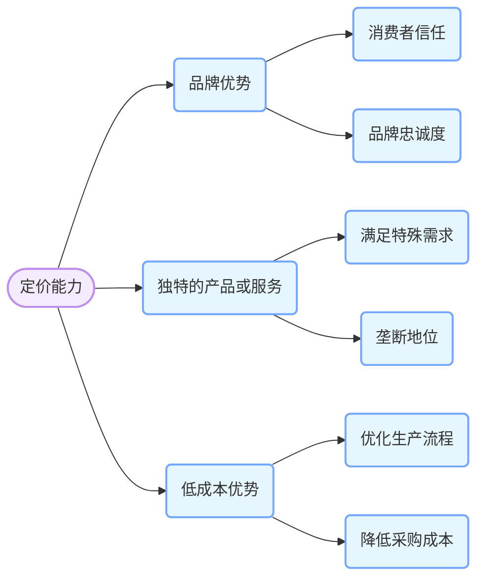

# 彼得林奇对公司定价能力的评估标准

> 关键词：彼得林奇、定价能力、评估标准、公司分析、投资决策、竞争优势、财务指标

> 摘要：本文围绕彼得林奇对公司定价能力的评估标准展开深入探讨。彼得林奇作为投资领域的传奇人物，其对公司定价能力的评估方法对于投资者准确判断公司价值、做出明智投资决策具有重要指导意义。文章将详细阐述相关背景知识，深入剖析核心概念，介绍评估所涉及的核心算法与操作步骤，通过数学模型和公式进行理论支撑，结合项目实战案例进行详细解读，探讨实际应用场景，推荐相关学习工具和资源，最后总结未来发展趋势与挑战，并对常见问题进行解答，为投资者和相关研究人员提供全面而深入的参考。

## 1. 背景介绍 
### 1.1 目的和范围
本部分旨在全面深入地研究彼得林奇对公司定价能力的评估标准。通过梳理这些标准，投资者能够更好地理解公司在市场中的竞争地位和价值创造能力，从而做出更明智的投资决策。研究范围涵盖彼得林奇在其投资实践中所运用的各种评估方法、指标以及相关的分析逻辑，不仅涉及理论层面的探讨，还将结合实际案例进行具体分析。

### 1.2 预期读者
本文预期读者主要包括对投资领域感兴趣的个人投资者，希望通过学习专业的评估方法提升自己的投资水平；金融专业的学生和研究人员，以便深入了解投资分析的理论和实践；以及从事证券分析、投资顾问等相关职业的专业人士，为其日常工作提供参考和借鉴。

### 1.3 文档结构概述
本文首先介绍背景知识，包括目的、预期读者和文档结构概述等内容。接着深入剖析核心概念，阐述定价能力的内涵及其与公司竞争优势的联系，并通过文本示意图和 Mermaid 流程图进行直观展示。然后详细讲解核心算法原理和具体操作步骤，结合 Python 源代码进行说明。之后通过数学模型和公式对评估标准进行理论支撑，并举例说明。再通过项目实战案例，从开发环境搭建、源代码实现到代码解读与分析，全面展示评估标准的实际应用。随后探讨实际应用场景，推荐相关的学习工具和资源。最后总结未来发展趋势与挑战，解答常见问题，并提供扩展阅读和参考资料。

### 1.4 术语表
#### 1.4.1 核心术语定义
- **定价能力**：指公司在市场中制定产品或服务价格的能力，体现为公司能够在多大程度上独立于市场竞争压力，根据自身成本、市场需求和战略目标等因素来确定价格，并通过价格调整实现利润最大化和市场份额的稳定或增长。
- **竞争优势**：公司相对于竞争对手在产品、服务、成本、技术、品牌等方面所具有的独特优势，这些优势能够使公司在市场中获得更高的利润和市场份额，是公司定价能力的重要支撑。
- **经济特许权**：彼得林奇提出的概念，指公司拥有的一种特殊的竞争优势，使公司能够在一定程度上免受竞争的影响，具有较强的定价能力和盈利能力。

#### 1.4.2 相关概念解释
- **成本加成定价**：一种常见的定价方法，公司在产品或服务的成本基础上加上一定的利润来确定价格。这种方法简单易行，但忽略了市场需求和竞争因素，在实际应用中具有一定的局限性。
- **价值定价**：根据客户对产品或服务的价值认知来确定价格，而不是仅仅基于成本。这种定价方法更注重客户的需求和感知，能够更好地反映产品或服务的真实价值，但对公司的市场调研和客户分析能力要求较高。

#### 1.4.3 缩略词列表
- **PE**：市盈率（Price-to-Earnings Ratio），反映公司股票价格与每股盈利之间的关系，是评估公司估值的常用指标。
- **ROE**：净资产收益率（Return on Equity），衡量公司运用自有资本的效率和盈利能力的指标。

## 2. 核心概念与联系 

### 核心概念原理
彼得林奇认为，公司的定价能力是其竞争优势的重要体现。具有强大定价能力的公司通常能够在市场中获得更高的利润和市场份额。定价能力的来源主要包括以下几个方面：
- **品牌优势**：知名品牌能够使消费者对产品或服务产生信任和忠诚度，愿意为其支付更高的价格。例如，苹果公司凭借其强大的品牌影响力，在智能手机市场中能够制定较高的价格，而消费者仍然愿意购买。
- **独特的产品或服务**：具有独特性的产品或服务能够满足消费者的特殊需求，使公司在市场中具有一定的垄断地位，从而拥有较强的定价能力。比如，一些高科技企业的专利产品，由于其独特的技术和功能，能够在市场中获得较高的价格。
- **低成本优势**：公司通过优化生产流程、降低采购成本等方式实现低成本运营，能够在价格竞争中占据优势。即使在市场价格下降的情况下，低成本公司仍然能够保持盈利，并且可以通过降低价格来扩大市场份额。

### 架构的文本示意图
```plaintext
定价能力
|-- 品牌优势
|   |-- 消费者信任
|   |-- 品牌忠诚度
|-- 独特的产品或服务
|   |-- 满足特殊需求
|   |-- 垄断地位
|-- 低成本优势
|   |-- 优化生产流程
|   |-- 降低采购成本
```

### Mermaid 流程图


## 3. 核心算法原理 & 具体操作步骤 

### 核心算法原理
彼得林奇对公司定价能力的评估主要基于对公司财务指标和市场竞争状况的分析。其中，一些重要的财务指标包括毛利率、净利率、ROE 等。毛利率反映了公司产品或服务的盈利能力，净利率则考虑了公司的所有成本和费用，ROE 衡量了公司运用自有资本的效率。

### 具体操作步骤
1. **收集公司财务数据**：包括营业收入、营业成本、净利润、股东权益等。
2. **计算关键财务指标**：
    - 毛利率计算公式：$毛利率 = \frac{营业收入 - 营业成本}{营业收入} \times 100\%$
    - 净利率计算公式：$净利率 = \frac{净利润}{营业收入} \times 100\%$
    - ROE 计算公式：$ROE = \frac{净利润}{股东权益} \times 100\%$
3. **分析财务指标趋势**：观察这些指标在过去几年的变化趋势，判断公司的盈利能力和定价能力是增强还是减弱。
4. **比较同行业公司**：将目标公司的财务指标与同行业其他公司进行比较，评估其在行业中的竞争力和定价能力。

### Python 源代码实现
```python
import pandas as pd

# 示例财务数据
data = {
    '年份': [2018, 2019, 2020, 2021, 2022],
    '营业收入': [1000, 1200, 1300, 1400, 1500],
    '营业成本': [600, 700, 750, 800, 850],
    '净利润': [200, 250, 300, 350, 400],
    '股东权益': [800, 900, 1000, 1100, 1200]
}

df = pd.DataFrame(data)

# 计算毛利率
df['毛利率'] = ((df['营业收入'] - df['营业成本']) / df['营业收入']) * 100

# 计算净利率
df['净利率'] = (df['净利润'] / df['营业收入']) * 100

# 计算 ROE
df['ROE'] = (df['净利润'] / df['股东权益']) * 100

print(df)
```

## 4. 数学模型和公式 & 详细讲解 & 举例说明 

### 数学模型和公式
- **毛利率公式**：$毛利率 = \frac{营业收入 - 营业成本}{营业收入} \times 100\%$
毛利率反映了公司在扣除直接成本后剩余的利润空间，体现了公司产品或服务的基本盈利能力。较高的毛利率意味着公司在定价方面具有一定的优势，能够在成本之上获得较高的利润。

- **净利率公式**：$净利率 = \frac{净利润}{营业收入} \times 100\%$
净利率考虑了公司的所有成本和费用，包括营业成本、销售费用、管理费用、财务费用等，更全面地反映了公司的盈利能力。净利率越高，说明公司的定价能力和成本控制能力越强。

- **ROE 公式**：$ROE = \frac{净利润}{股东权益} \times 100\%$
ROE 衡量了公司运用自有资本的效率和盈利能力，反映了股东权益的收益水平。较高的 ROE 表明公司能够有效地利用股东的资金创造利润，具有较强的定价能力和价值创造能力。

### 详细讲解
- **毛利率**：毛利率的高低受到多种因素的影响，如产品或服务的市场需求、竞争程度、公司的成本控制能力等。如果公司的毛利率在过去几年中保持稳定或上升，说明公司的定价能力较强，能够在市场中获得较高的利润。相反，如果毛利率下降，可能意味着公司面临竞争压力增大、成本上升等问题。
- **净利率**：净利率的变化不仅与毛利率有关，还与公司的费用管理能力密切相关。即使公司的毛利率较高，但如果费用支出过大，净利率也可能较低。因此，在分析净利率时，需要综合考虑公司的成本和费用结构。
- **ROE**：ROE 是一个综合性的指标，受到净利率、总资产周转率和权益乘数等因素的影响。较高的 ROE 可能是由于公司具有较高的净利率、较高的总资产周转率或较高的权益乘数。投资者需要进一步分析这些因素的变化，以确定公司 ROE 变化的原因。

### 举例说明
假设公司 A 和公司 B 是同行业的两家公司，其财务数据如下表所示：

| 公司 | 营业收入（万元） | 营业成本（万元） | 净利润（万元） | 股东权益（万元） |
| ---- | ---- | ---- | ---- | ---- |
| 公司 A | 1000 | 600 | 200 | 800 |
| 公司 B | 1200 | 800 | 240 | 1000 |

- **毛利率计算**：
    - 公司 A 的毛利率：$\frac{1000 - 600}{1000} \times 100\% = 40\%$
    - 公司 B 的毛利率：$\frac{1200 - 800}{1200} \times 100\% \approx 33.33\%$
    从毛利率来看，公司 A 的定价能力相对较强，能够在成本之上获得更高的利润。

- **净利率计算**：
    - 公司 A 的净利率：$\frac{200}{1000} \times 100\% = 20\%$
    - 公司 B 的净利率：$\frac{240}{1200} \times 100\% = 20\%$
    虽然公司 A 的毛利率较高，但两家公司的净利率相同，说明公司 B 在费用管理方面可能更有优势。

- **ROE 计算**：
    - 公司 A 的 ROE：$\frac{200}{800} \times 100\% = 25\%$
    - 公司 B 的 ROE：$\frac{240}{1000} \times 100\% = 24\%$
    公司 A 的 ROE 略高于公司 B，说明公司 A 在运用自有资本创造利润方面更有效率。

## 5. 项目实战：代码实际案例和详细解释说明 

### 5.1  开发环境搭建
- **Python 安装**：从 Python 官方网站（https://www.python.org/downloads/）下载并安装 Python 3.x 版本。
- **开发工具**：推荐使用 PyCharm 或 Jupyter Notebook 作为开发工具。
- **依赖库安装**：使用以下命令安装所需的依赖库：
```bash
pip install pandas
```

### 5.2  源代码详细实现和代码解读
```python
import pandas as pd

# 模拟收集到的公司财务数据
data = {
    '年份': [2018, 2019, 2020, 2021, 2022],
    '营业收入': [1000, 1200, 1300, 1400, 1500],
    '营业成本': [600, 700, 750, 800, 850],
    '净利润': [200, 250, 300, 350, 400],
    '股东权益': [800, 900, 1000, 1100, 1200]
}

# 将数据转换为 DataFrame 格式
df = pd.DataFrame(data)

# 计算毛利率
df['毛利率'] = ((df['营业收入'] - df['营业成本']) / df['营业收入']) * 100

# 计算净利率
df['净利率'] = (df['净利润'] / df['营业收入']) * 100

# 计算 ROE
df['ROE'] = (df['净利润'] / df['股东权益']) * 100

# 输出结果
print(df)
```
**代码解读**：
1. **导入库**：`import pandas as pd` 导入 Pandas 库，用于数据处理和分析。
2. **模拟数据**：定义一个字典 `data`，包含公司的财务数据，如年份、营业收入、营业成本、净利润和股东权益。
3. **创建 DataFrame**：使用 `pd.DataFrame(data)` 将字典数据转换为 Pandas 的 DataFrame 格式，方便进行数据操作。
4. **计算财务指标**：分别使用毛利率、净利率和 ROE 的计算公式，计算相应的指标，并将结果添加到 DataFrame 中。
5. **输出结果**：使用 `print(df)` 输出包含财务指标的 DataFrame。

### 5.3  代码解读与分析
通过上述代码，我们可以得到公司在不同年份的毛利率、净利率和 ROE 指标。观察这些指标的变化趋势，可以帮助我们评估公司的定价能力和盈利能力。例如，如果毛利率和净利率在过去几年中呈现上升趋势，说明公司的定价能力和成本控制能力在增强；如果 ROE 保持较高水平且稳定，说明公司能够有效地利用股东的资金创造利润。

## 6. 实际应用场景 
### 投资决策
投资者在选择投资标的时，可以运用彼得林奇的定价能力评估标准来分析公司的价值。具有较强定价能力的公司通常具有更高的盈利能力和稳定性，能够为投资者带来更好的回报。例如，在选择股票时，投资者可以比较不同公司的毛利率、净利率和 ROE 等指标，选择那些具有竞争优势和定价能力的公司进行投资。

### 企业战略规划
企业管理者可以通过评估自身的定价能力，制定合理的战略规划。如果公司具有较强的定价能力，可以考虑提高产品或服务的价格，以获取更高的利润；如果定价能力较弱，企业可以通过优化产品或服务、降低成本等方式来提升定价能力。例如，一家制造企业通过引进先进的生产技术，降低了生产成本，从而提高了产品的定价能力，在市场中获得了更大的竞争优势。

### 行业分析
在进行行业分析时，定价能力评估标准可以帮助分析人员了解行业内不同公司的竞争地位和市场格局。通过比较同行业公司的定价能力指标，可以发现行业中的领先企业和潜在的竞争对手。例如，在智能手机行业，通过分析各品牌手机的毛利率和市场份额，可以了解不同品牌的定价策略和竞争优势。

## 7. 工具和资源推荐
### 7.1 学习资源推荐
#### 7.1.1 书籍推荐
- 《彼得林奇的成功投资》：彼得林奇的经典著作，详细介绍了他的投资理念和方法，包括对公司定价能力的评估标准。
- 《聪明的投资者》：本杰明·格雷厄姆的著作，是价值投资的经典之作，对投资者理解公司价值和定价能力具有重要的指导意义。
- 《财务报表分析》：帮助读者深入了解财务报表的结构和分析方法，为评估公司定价能力提供必要的财务知识。

#### 7.1.2 在线课程
- Coursera 上的“投资学原理”：由知名大学的教授授课，系统介绍投资学的基本原理和方法，包括公司分析和定价能力评估。
- 网易云课堂上的“财务报表分析实战”：通过实际案例讲解财务报表分析的技巧和方法，帮助学员掌握评估公司定价能力的财务指标分析方法。

#### 7.1.3 技术博客和网站
- 雪球网：一个投资交流社区，投资者可以在上面分享自己的投资经验和对公司的分析，包括对定价能力的讨论。
- 东方财富网：提供丰富的金融资讯和公司财务数据，方便投资者进行公司分析和定价能力评估。

### 7.2 开发工具框架推荐
#### 7.2.1 IDE和编辑器
- PyCharm：一款专业的 Python 集成开发环境，具有强大的代码编辑、调试和分析功能，适合进行数据分析和财务指标计算。
- Jupyter Notebook：一种交互式的开发环境，支持 Python 代码的编写和运行，方便进行数据可视化和结果展示。

#### 7.2.2 调试和性能分析工具
- IPython：一个增强的 Python 解释器，提供了丰富的调试和交互功能，方便在开发过程中进行代码调试和问题排查。
- Pandas Profiling：用于对 Pandas DataFrame 进行快速数据分析和报告生成的工具，能够帮助用户快速了解数据的基本情况和特征。

#### 7.2.3 相关框架和库
- Pandas：用于数据处理和分析的 Python 库，提供了丰富的数据结构和数据操作方法，方便进行财务数据的处理和指标计算。
- Matplotlib：用于数据可视化的 Python 库，能够将财务指标的变化趋势以图表的形式直观地展示出来。

### 7.3 相关论文著作推荐
#### 7.3.1 经典论文
- Modigliani, F., & Miller, M. H. (1958). The Cost of Capital, Corporation Finance and the Theory of Investment. 该论文提出了著名的 MM 定理，对公司的资本结构和价值评估具有重要影响，也为理解公司定价能力提供了理论基础。
- Fama, E. F., & French, K. R. (1992). The Cross-Section of Expected Stock Returns. 这篇论文提出了 Fama-French 三因子模型，用于解释股票收益率的差异，对投资分析和公司价值评估具有重要意义。

#### 7.3.2 最新研究成果
- 近年来，关于公司定价能力的研究不断深入，一些学者从市场竞争、消费者行为、技术创新等多个角度对公司定价能力进行了研究。可以通过学术数据库，如 Web of Science、EBSCO 等，获取最新的研究成果。

#### 7.3.3 应用案例分析
- 一些专业的金融研究机构和咨询公司会发布关于公司定价能力的应用案例分析报告。这些报告通过实际案例，详细分析了不同行业、不同公司的定价策略和定价能力评估方法，具有较高的参考价值。

## 8. 总结：未来发展趋势与挑战
### 未来发展趋势
- **数字化转型对定价能力的影响**：随着数字化技术的发展，公司的定价方式将更加灵活和精准。通过大数据分析和人工智能算法，公司可以更好地了解消费者的需求和偏好，实现个性化定价，从而提升定价能力。
- **绿色可持续发展对定价的影响**：消费者对绿色、可持续产品的需求不断增加，公司在定价时需要考虑产品的环境和社会影响。具有绿色可持续发展优势的公司可能会在市场中获得更高的定价能力。
- **全球化竞争下的定价策略**：随着全球化的深入，公司面临的竞争更加激烈。在国际市场上，公司需要根据不同国家和地区的市场需求、成本结构和竞争状况，制定灵活的定价策略，以提升定价能力和市场竞争力。

### 挑战
- **数据质量和隐私问题**：在数字化定价过程中，公司需要大量的消费者数据来支持定价决策。然而，数据质量和隐私问题是一个重要的挑战。如果数据不准确或存在隐私泄露风险，可能会影响公司的定价决策和声誉。
- **市场不确定性增加**：全球经济环境的不确定性、政策变化和突发事件等因素，增加了市场的不确定性。公司在定价时需要考虑这些因素的影响，制定更加灵活的定价策略，以应对市场变化。
- **消费者行为变化快速**：消费者的需求和偏好变化快速，公司需要及时了解消费者的变化，调整定价策略。然而，准确把握消费者行为变化趋势是一个具有挑战性的任务。

## 9. 附录：常见问题与解答
### 问：如何判断公司的定价能力是否可持续？
答：可以从多个方面进行判断。首先，观察公司的竞争优势是否可持续，如品牌优势、技术优势等。如果公司能够持续保持这些优势，其定价能力也可能持续。其次，分析公司的成本结构和成本控制能力。如果公司能够有效控制成本，即使市场环境变化，也能够保持一定的定价空间。此外，还可以关注公司的创新能力和市场适应性，能够不断推出新产品和服务，适应市场变化的公司，其定价能力更有可能可持续。

### 问：毛利率高是否就意味着公司的定价能力强？
答：毛利率高是公司定价能力强的一个重要表现，但不是唯一的判断标准。毛利率高可能是由于公司产品或服务的独特性、品牌优势等因素导致的，但也可能是由于公司所处的行业环境、市场竞争程度等因素的影响。此外，还需要综合考虑净利率、ROE 等其他财务指标，以及公司的成本结构、费用管理能力等因素，才能全面评估公司的定价能力。

### 问：如何运用彼得林奇的定价能力评估标准分析不同行业的公司？
答：不同行业的公司具有不同的特点和竞争环境，在运用彼得林奇的定价能力评估标准时，需要结合行业特点进行分析。例如，对于高科技行业，需要重点关注公司的技术创新能力和研发投入，因为这些因素对公司的定价能力具有重要影响；对于传统制造业，需要关注公司的成本控制能力和规模效应。此外，还需要比较同行业公司的财务指标，以评估目标公司在行业中的竞争地位和定价能力。

## 10. 扩展阅读 & 参考资料
### 扩展阅读
- 《金融炼金术》：乔治·索罗斯的著作，介绍了他的投资哲学和金融市场分析方法，对投资者拓宽思维和深入理解市场具有重要帮助。
- 《巴菲特致股东的信》：沃伦·巴菲特的经典著作，通过他写给股东的信，阐述了他的投资理念和公司分析方法，对理解公司价值和定价能力具有重要启示。

### 参考资料
- 彼得林奇的相关著作和演讲资料。
- 金融专业期刊和学术论文，如《金融研究》《经济研究》等。
- 各大金融网站和数据库提供的公司财务数据和研究报告。