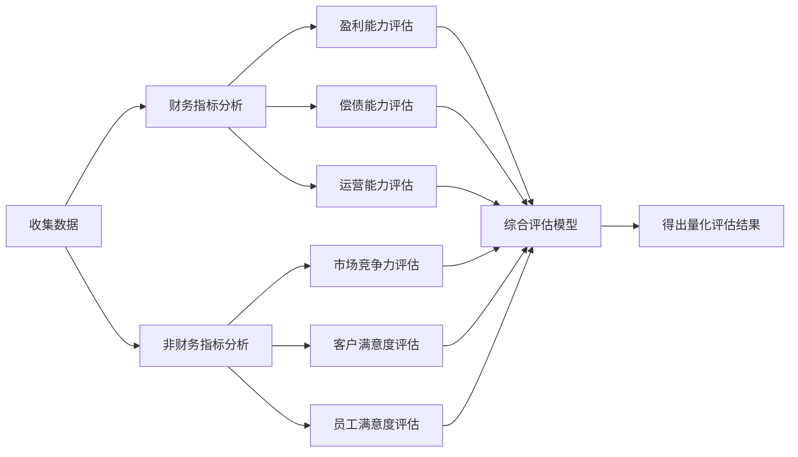

# 彼得林奇对公司管理层执行力的量化评估

> 关键词：彼得林奇、公司管理层、执行力、量化评估、财务指标、非财务指标

> 摘要：本文围绕彼得林奇对公司管理层执行力的量化评估展开。深入探讨了彼得林奇投资理念中管理层执行力的重要性，详细阐述了量化评估的多种方法，包括财务指标与非财务指标的运用。通过数学模型和公式进一步分析量化的依据，结合项目实战案例展示具体操作和分析过程，介绍了其在不同实际场景中的应用，同时推荐了相关学习资源、开发工具和论文著作等，最后对未来在该领域的发展趋势与挑战进行总结，并对常见问题进行解答。

## 1. 背景介绍 
### 1.1 目的和范围
彼得林奇作为投资界的传奇人物，其投资策略和理念备受关注。对公司管理层执行力进行量化评估，有助于投资者更准确地判断公司的潜在价值和发展前景。本文章的目的在于深入剖析彼得林奇在这方面的评估方法和思路，为投资者和相关研究人员提供系统的参考。范围涵盖量化评估所涉及的各个方面，包括核心概念、算法原理、数学模型、实际案例等。

### 1.2 预期读者
本文预期读者包括投资者，无论是专业的投资机构从业者还是个人投资者，都可以从中获取对公司管理层执行力评估的有效方法；金融分析师，通过学习量化评估方法，提升对公司基本面分析的能力；企业管理人员，可借此了解自身在投资者眼中的形象和能力标准，从而改进管理策略；以及对投资和公司管理研究感兴趣的学者和学生。

### 1.3 文档结构概述
本文首先介绍背景信息，包括目的、预期读者和文档结构等。接着阐述核心概念与联系，明确相关概念的原理和架构。然后详细讲解核心算法原理及具体操作步骤，结合数学模型和公式进行深入分析。通过项目实战展示实际案例和代码解读。介绍实际应用场景，推荐相关工具和资源。最后对未来发展趋势与挑战进行总结，解答常见问题并提供扩展阅读和参考资料。

### 1.4 术语表
#### 1.4.1 核心术语定义
- **彼得林奇**：著名的投资大师，曾管理富达公司麦哲伦基金，创造了辉煌的投资业绩，其投资理念和方法影响深远。
- **公司管理层执行力**：指公司管理层将战略决策、计划等转化为实际行动和成果的能力，包括决策的执行速度、质量和效果等方面。
- **量化评估**：运用数学方法和指标体系，将抽象的管理层执行力以具体的数据和数值形式进行衡量和评价。

#### 1.4.2 相关概念解释
- **财务指标**：反映公司财务状况和经营成果的一系列数据，如营业收入、净利润、资产负债率等，可用于从经济角度评估管理层的决策和执行效果。
- **非财务指标**：除财务数据外的其他指标，如市场份额、客户满意度、员工满意度等，能从不同侧面反映管理层在市场竞争、内部管理等方面的执行力。

#### 1.4.3 缩略词列表
- ROE：Return on Equity，净资产收益率
- EPS：Earnings Per Share，每股收益

## 2. 核心概念与联系 

### 核心概念原理
彼得林奇认为，公司的成功很大程度上取决于管理层的执行力。一个具有强大执行力的管理层能够准确把握市场机会，高效地组织和调配资源，推动公司实现战略目标。量化评估管理层执行力的核心原理在于通过收集和分析与管理层决策和执行相关的数据，将这些数据转化为可比较的指标，从而客观地评价管理层的能力。

### 架构的文本示意图
```plaintext
公司管理层执行力量化评估
|-- 财务指标评估
|   |-- 盈利能力指标（ROE、EPS等）
|   |-- 偿债能力指标（资产负债率等）
|   |-- 运营能力指标（存货周转率等）
|-- 非财务指标评估
|   |-- 市场竞争力指标（市场份额等）
|   |-- 客户满意度指标
|   |-- 员工满意度指标
|-- 综合评估模型
|   |-- 权重分配
|   |-- 指标计算与整合
```

### Mermaid 流程图


## 3. 核心算法原理 & 具体操作步骤 

### 核心算法原理
量化评估公司管理层执行力的核心算法基于多指标综合评估的思想。首先确定各项评估指标，然后为每个指标分配相应的权重，最后将各指标的实际值与权重相乘并求和，得到综合评估得分。

### 具体操作步骤

#### 步骤 1：确定评估指标
根据彼得林奇的投资理念和相关研究，确定财务指标和非财务指标。财务指标包括净资产收益率（ROE）、每股收益（EPS）、资产负债率等；非财务指标包括市场份额、客户满意度、员工满意度等。

#### 步骤 2：收集数据
通过公司财务报表、市场调研、客户反馈、员工调查等渠道收集各项指标的数据。

#### 步骤 3：数据预处理
对收集到的数据进行清洗、整理和标准化处理，以消除数据的量纲和异常值的影响。

#### 步骤 4：确定指标权重
可以采用专家打分法、层次分析法等方法确定各指标的权重。

#### 步骤 5：计算综合得分
将各指标的实际值与对应的权重相乘，然后求和得到综合得分。

### Python 源代码实现
```python
import numpy as np

# 定义指标数据
financial_data = {
    "ROE": 0.15,
    "EPS": 2.5,
    "asset_liability_ratio": 0.4
}

non_financial_data = {
    "market_share": 0.2,
    "customer_satisfaction": 0.8,
    "employee_satisfaction": 0.7
}

# 定义指标权重
financial_weights = {
    "ROE": 0.3,
    "EPS": 0.3,
    "asset_liability_ratio": 0.4
}

non_financial_weights = {
    "market_share": 0.3,
    "customer_satisfaction": 0.3,
    "employee_satisfaction": 0.4
}

# 计算财务指标得分
financial_score = sum([financial_data[key] * financial_weights[key] for key in financial_data])

# 计算非财务指标得分
non_financial_score = sum([non_financial_data[key] * non_financial_weights[key] for key in non_financial_data])

# 综合得分（假设财务和非财务指标权重各占0.5）
total_score = 0.5 * financial_score + 0.5 * non_financial_score

print(f"综合评估得分: {total_score}")
```

## 4. 数学模型和公式 & 详细讲解 & 举例说明 

### 数学模型
设共有 $n$ 个评估指标，第 $i$ 个指标的实际值为 $x_i$，对应的权重为 $w_i$，则综合评估得分 $S$ 的计算公式为：

$$S = \sum_{i=1}^{n} w_i x_i$$

其中，$\sum_{i=1}^{n} w_i = 1$。

### 详细讲解
该数学模型的核心思想是将各个评估指标的实际表现按照其重要程度（权重）进行加权求和，得到一个综合的评估得分。权重的确定反映了每个指标在整体评估中的相对重要性。通过这种方式，可以将多个不同维度的指标整合为一个单一的得分，便于对公司管理层执行力进行直观的比较和评价。

### 举例说明
假设我们有三个评估指标：净资产收益率（ROE）、市场份额和客户满意度，其权重分别为 $w_1 = 0.3$，$w_2 = 0.3$，$w_3 = 0.4$。某公司的 ROE 实际值为 $x_1 = 0.12$，市场份额实际值为 $x_2 = 0.15$，客户满意度实际值为 $x_3 = 0.8$。则该公司的综合评估得分 $S$ 为：

$$S = 0.3 \times 0.12 + 0.3 \times 0.15 + 0.4 \times 0.8$$
$$S = 0.036 + 0.045 + 0.32$$
$$S = 0.401$$

这表明该公司管理层执行力的综合评估得分为 0.401。

## 5. 项目实战：代码实际案例和详细解释说明 

### 5.1  开发环境搭建
- **Python 环境**：确保安装了 Python 3.x 版本，可以从 Python 官方网站（https://www.python.org/downloads/）下载并安装。
- **开发工具**：推荐使用 PyCharm 或 Jupyter Notebook 作为开发工具。
- **必要库**：安装 `numpy` 库，可使用以下命令进行安装：
```sh
pip install numpy
```

### 5.2  源代码详细实现和代码解读
```python
import numpy as np

# 定义公司数据类
class CompanyData:
    def __init__(self, financial_data, non_financial_data):
        self.financial_data = financial_data
        self.non_financial_data = non_financial_data

# 定义评估指标权重类
class EvaluationWeights:
    def __init__(self, financial_weights, non_financial_weights):
        self.financial_weights = financial_weights
        self.non_financial_weights = non_financial_weights

# 计算财务指标得分
def calculate_financial_score(company_data, weights):
    financial_score = sum([company_data.financial_data[key] * weights.financial_weights[key] for key in company_data.financial_data])
    return financial_score

# 计算非财务指标得分
def calculate_non_financial_score(company_data, weights):
    non_financial_score = sum([company_data.non_financial_data[key] * weights.non_financial_weights[key] for key in company_data.non_financial_data])
    return non_financial_score

# 计算综合得分
def calculate_total_score(company_data, weights, financial_weight=0.5, non_financial_weight=0.5):
    financial_score = calculate_financial_score(company_data, weights)
    non_financial_score = calculate_non_financial_score(company_data, weights)
    total_score = financial_weight * financial_score + non_financial_weight * non_financial_score
    return total_score

# 示例数据
financial_data = {
    "ROE": 0.18,
    "EPS": 3.0,
    "asset_liability_ratio": 0.35
}

non_financial_data = {
    "market_share": 0.25,
    "customer_satisfaction": 0.85,
    "employee_satisfaction": 0.75
}

financial_weights = {
    "ROE": 0.3,
    "EPS": 0.3,
    "asset_liability_ratio": 0.4
}

non_financial_weights = {
    "market_share": 0.3,
    "customer_satisfaction": 0.3,
    "employee_satisfaction": 0.4
}

# 创建公司数据对象和权重对象
company = CompanyData(financial_data, non_financial_data)
weights = EvaluationWeights(financial_weights, non_financial_weights)

# 计算综合得分
total_score = calculate_total_score(company, weights)
print(f"综合评估得分: {total_score}")
```

### 5.3  代码解读与分析
- **`CompanyData` 类**：用于存储公司的财务和非财务数据，方便数据的管理和传递。
- **`EvaluationWeights` 类**：用于存储评估指标的权重，同样便于管理和使用。
- **`calculate_financial_score` 函数**：根据公司的财务数据和财务指标权重，计算财务指标得分。
- **`calculate_non_financial_score` 函数**：根据公司的非财务数据和非财务指标权重，计算非财务指标得分。
- **`calculate_total_score` 函数**：结合财务和非财务指标得分，根据给定的权重计算综合得分。

通过这种模块化的设计，代码的可维护性和可扩展性得到了提高。

## 6. 实际应用场景 
### 投资决策
投资者在选择投资标的时，可以运用彼得林奇的量化评估方法对公司管理层执行力进行评估。一个具有高执行力的管理层往往能够更好地应对市场变化，实现公司的增长和盈利，从而为投资者带来更高的回报。通过比较不同公司的量化评估得分，投资者可以筛选出更具投资价值的公司。

### 企业内部管理
企业管理层可以利用该量化评估方法进行自我评估，了解自身在决策执行、市场竞争、客户关系和员工管理等方面的优势和不足。根据评估结果，有针对性地制定改进措施，提升企业的整体运营效率和竞争力。

### 金融机构信贷评估
金融机构在进行信贷决策时，除了关注公司的财务状况外，还可以考虑管理层的执行力。一个执行力强的管理层能够更好地保证贷款的偿还能力和项目的顺利实施。通过量化评估，金融机构可以更准确地评估企业的信用风险，做出合理的信贷决策。

## 7. 工具和资源推荐
### 7.1 学习资源推荐
#### 7.1.1 书籍推荐
- 《彼得林奇的成功投资》：彼得林奇的经典著作，详细阐述了他的投资理念和方法，包括对公司管理层的分析和评估。
- 《聪明的投资者》：本杰明·格雷厄姆的著作，是价值投资的经典之作，对理解公司基本面分析和投资决策有很大帮助。
- 《财务报表分析》：介绍了财务报表的解读和分析方法，有助于深入理解财务指标在评估管理层执行力中的作用。

#### 7.1.2 在线课程
- Coursera 上的“投资学原理”课程：系统介绍了投资的基本原理和方法，包括公司分析和估值等内容。
- edX 上的“财务报表分析与估值”课程：专注于财务报表的分析和公司估值，对量化评估有一定的指导作用。

#### 7.1.3 技术博客和网站
- 雪球网：一个投资者交流社区，有很多关于公司分析和投资策略的讨论和分享。
- 东方财富网：提供丰富的金融数据和资讯，有助于获取公司的财务和市场信息。

### 7.2 开发工具框架推荐
#### 7.2.1 IDE和编辑器
- PyCharm：功能强大的 Python 集成开发环境，提供代码编辑、调试、版本控制等功能。
- Jupyter Notebook：交互式的开发环境，适合进行数据探索和代码演示。

#### 7.2.2 调试和性能分析工具
- `pdb`：Python 自带的调试工具，可用于调试代码中的错误。
- `cProfile`：用于分析 Python 代码的性能，找出性能瓶颈。

#### 7.2.3 相关框架和库
- `pandas`：用于数据处理和分析，可方便地读取、清洗和处理公司数据。
- `scikit-learn`：提供了多种机器学习算法和工具，可用于进一步的数据分析和建模。

### 7.3 相关论文著作推荐
#### 7.3.1 经典论文
- 《Management Execution and Firm Performance》：研究了管理层执行力与公司绩效之间的关系，为量化评估提供了理论基础。
- 《The Impact of Management Quality on Firm Value》：探讨了管理层质量对公司价值的影响，对评估管理层执行力有重要参考价值。

#### 7.3.2 最新研究成果
- 关注各大金融和管理领域的学术期刊，如《Journal of Financial Economics》《Management Science》等，了解关于管理层执行力量化评估的最新研究进展。

#### 7.3.3 应用案例分析
- 一些知名咨询公司和研究机构发布的行业研究报告，包含了大量公司管理层执行力评估的应用案例，可从中学习实际操作经验和方法。

## 8. 总结：未来发展趋势与挑战
### 未来发展趋势
- **数据驱动的精细化评估**：随着大数据和人工智能技术的发展，未来对公司管理层执行力的量化评估将能够获取更多维度的数据，实现更精细化的评估。例如，通过社交媒体数据、物联网数据等了解公司的市场声誉和运营效率。
- **多学科融合的评估方法**：评估方法将不再局限于财务和管理领域，而是融合心理学、社会学等多学科知识。例如，通过分析管理层的行为模式和团队协作关系，更全面地评估其执行力。
- **实时动态评估**：借助实时数据采集和分析技术，能够实现对公司管理层执行力的实时动态评估，及时发现问题并做出调整。

### 挑战
- **数据质量和可靠性**：数据的准确性和完整性是量化评估的基础，但在实际中，数据可能存在误差、缺失或造假等问题，影响评估结果的可靠性。
- **指标体系的科学性**：如何确定科学合理的评估指标和权重是一个挑战。不同行业、不同发展阶段的公司，其管理层执行力的关键影响因素可能不同，需要不断优化指标体系。
- **环境变化的适应性**：市场环境、政策法规等外部因素不断变化，管理层执行力的评估方法需要具备较强的适应性，能够及时反映这些变化对公司的影响。

## 9. 附录：常见问题与解答
### 问题 1：如何确定评估指标的权重？
答：可以采用专家打分法、层次分析法等方法确定指标权重。专家打分法是邀请相关领域的专家对各指标的重要性进行打分，然后取平均值得到权重。层次分析法是通过构建判断矩阵，比较各指标之间的相对重要性，计算得到权重。

### 问题 2：非财务指标的数据如何获取？
答：非财务指标的数据可以通过多种渠道获取。市场份额数据可以通过市场调研机构的报告或行业协会的统计数据获得；客户满意度数据可以通过问卷调查、客户反馈等方式收集；员工满意度数据可以通过内部员工调查得到。

### 问题 3：量化评估结果的准确性如何保证？
答：要保证量化评估结果的准确性，需要从多个方面入手。首先，确保数据的质量，对收集到的数据进行严格的清洗和验证。其次，合理确定评估指标和权重，采用科学的方法进行计算。最后，结合定性分析对量化结果进行补充和验证，综合判断公司管理层的执行力。

## 10. 扩展阅读 & 参考资料
- 彼得林奇. 《彼得林奇的成功投资》. 机械工业出版社.
- 本杰明·格雷厄姆. 《聪明的投资者》. 人民邮电出版社.
- 《Management Execution and Firm Performance》. Journal of Financial Economics.
- 《The Impact of Management Quality on Firm Value》. Management Science.
- 雪球网：https://xueqiu.com/
- 东方财富网：https://www.eastmoney.com/