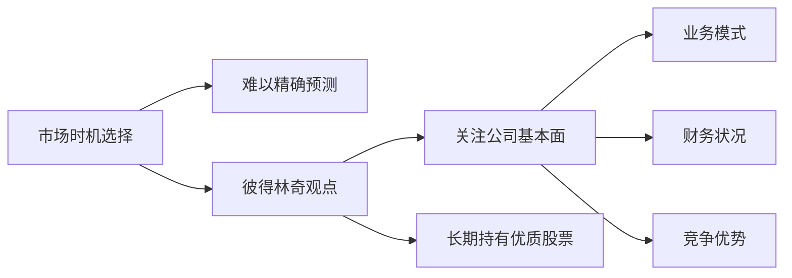

# 彼得林奇对市场时机选择的看法

> 关键词：彼得林奇、市场时机选择、投资理念、股票投资、投资策略

> 摘要：本文深入探讨了投资大师彼得林奇对市场时机选择的看法。首先介绍了相关背景，包括目的范围、预期读者等。接着阐述了核心概念，剖析市场时机选择与投资的联系。详细讲解了彼得林奇相关观点背后可能涉及的原理及操作思路，通过数学模型和公式进行理论支持。以实际案例展示了如何在投资中运用其理念。探讨了该理念在不同场景下的应用，推荐了学习和实践所需的工具、资源及相关论文。最后总结了未来投资中市场时机选择的发展趋势与挑战，并提供常见问题解答和扩展阅读参考资料，帮助投资者更好地理解和运用彼得林奇的投资智慧。

## 1. 背景介绍 
### 1.1 目的和范围
本部分旨在全面剖析彼得林奇对市场时机选择的看法，深入探究其投资理念背后的逻辑和原理。通过对其观点的详细解读，为投资者提供有价值的参考，帮助他们在复杂多变的市场环境中做出更明智的投资决策。研究范围涵盖彼得林奇的经典著作、公开言论以及实际投资案例，以全面了解他对市场时机选择的独特见解。

### 1.2 预期读者
本文主要面向广大投资者，包括个人投资者、专业投资人士以及对投资领域感兴趣的学者和学生。无论你是初涉投资领域的新手，还是经验丰富的老手，都能从彼得林奇的投资智慧中获得启发，提升自己的投资水平。

### 1.3 文档结构概述
本文将按照以下结构展开：首先介绍相关背景知识，包括目的、预期读者和文档结构等。接着阐述核心概念，分析市场时机选择与投资的联系。详细讲解彼得林奇相关观点背后的算法原理和操作步骤，并通过数学模型和公式进行理论支持。以实际案例展示如何在投资中运用其理念。探讨该理念在不同场景下的应用，推荐学习和实践所需的工具、资源及相关论文。最后总结未来投资中市场时机选择的发展趋势与挑战，提供常见问题解答和扩展阅读参考资料。

### 1.4 术语表
#### 1.4.1 核心术语定义
- **市场时机选择**：指投资者试图预测市场走势，在特定的时间点买入或卖出资产，以获取最大收益的行为。
- **投资组合**：投资者将不同的资产进行组合，以达到分散风险、实现预期收益的目的。
- **基本面分析**：通过研究公司的财务状况、经营业绩、行业前景等基本面因素，评估股票的内在价值。

#### 1.4.2 相关概念解释
- **随机漫步理论**：认为股票价格的波动是随机的，无法通过历史数据预测未来走势。
- **有效市场假说**：认为市场价格已经反映了所有可用的信息，投资者无法通过分析信息获得超额收益。

#### 1.4.3 缩略词列表
- **PE**：市盈率，指股票价格与每股收益的比率。
- **PB**：市净率，指股票价格与每股净资产的比率。

## 2. 核心概念与联系 

### 核心概念原理
彼得林奇对市场时机选择持有独特的观点。他认为试图精确预测市场时机是非常困难的，甚至是不可能的。市场受到众多复杂因素的影响，包括宏观经济数据、政治事件、公司业绩等，这些因素的变化具有高度的不确定性，使得准确预测市场的顶部和底部几乎是一项不可能完成的任务。

他强调投资者应该将注意力更多地放在公司的基本面分析上。通过深入研究公司的业务模式、财务状况、竞争优势等，挑选出具有成长潜力的优质股票，并长期持有。彼得林奇相信，只要公司的基本面良好，其股票价格最终会反映其内在价值，而不必过于纠结于市场的短期波动。

### 架构的文本示意图
```plaintext
市场时机选择
|
|-- 难以精确预测（受宏观经济、政治、公司业绩等复杂因素影响）
|
|-- 彼得林奇观点
|   |
|   |-- 关注公司基本面
|   |   |
|   |   |-- 业务模式
|   |   |-- 财务状况
|   |   |-- 竞争优势
|   |
|   |-- 长期持有优质股票
```

### Mermaid 流程图


## 3. 核心算法原理 & 具体操作步骤 

### 核心算法原理
虽然彼得林奇并不强调市场时机选择的精确算法，但他的投资理念可以通过一些基本的算法原理来理解。例如，在评估公司的基本面时，可以使用财务比率分析的方法。以下是一些常见的财务比率及其计算方法：

- **市盈率（PE）**：$PE = \frac{股票价格}{每股收益}$
- **市净率（PB）**：$PB = \frac{股票价格}{每股净资产}$
- **净资产收益率（ROE）**：$ROE = \frac{净利润}{净资产} \times 100\%$

通过比较不同公司的这些财务比率，可以筛选出具有投资价值的股票。一般来说，较低的市盈率和市净率，以及较高的净资产收益率，表明公司具有较好的盈利能力和估值水平。

### 具体操作步骤
#### 步骤 1：确定投资范围
投资者可以根据自己的兴趣和能力，选择特定的行业或板块进行研究。例如，可以选择消费、科技、金融等行业。

#### 步骤 2：收集公司信息
通过查阅公司的年报、季报、行业研究报告等资料，收集公司的财务数据、业务信息、竞争状况等。

#### 步骤 3：进行财务分析
使用上述财务比率等方法，对公司的基本面进行分析。计算公司的市盈率、市净率、净资产收益率等指标，并与同行业其他公司进行比较。

#### 步骤 4：评估公司竞争力
除了财务分析，还需要评估公司的竞争力。包括公司的品牌优势、技术实力、市场份额、管理团队等方面。

#### 步骤 5：选择优质股票
根据财务分析和竞争力评估的结果，选择具有成长潜力和投资价值的优质股票。

#### 步骤 6：长期持有
一旦选择了优质股票，就应该长期持有，不要被市场的短期波动所影响。

### Python 源代码示例
```python
import pandas as pd

# 假设我们有一个包含公司财务数据的 DataFrame
data = {
    '股票代码': ['000001', '000002', '000003'],
    '股票价格': [10, 20, 30],
    '每股收益': [1, 2, 3],
    '每股净资产': [5, 10, 15]
}

df = pd.DataFrame(data)

# 计算市盈率和市净率
df['市盈率'] = df['股票价格'] / df['每股收益']
df['市净率'] = df['股票价格'] / df['每股净资产']

# 筛选出市盈率低于 10 且市净率低于 2 的股票
selected_stocks = df[(df['市盈率'] < 10) & (df['市净率'] < 2)]

print(selected_stocks)
```

在上述代码中，我们首先创建了一个包含公司财务数据的 DataFrame，然后计算了市盈率和市净率。最后，筛选出市盈率低于 10 且市净率低于 2 的股票。

## 4. 数学模型和公式 & 详细讲解 & 举例说明 

### 数学模型和公式
#### 市盈率（PE）
$PE = \frac{P}{EPS}$
其中，$P$ 表示股票价格，$EPS$ 表示每股收益。

市盈率反映了投资者为获取公司每一元盈利所愿意支付的价格。一般来说，较低的市盈率意味着股票相对便宜，具有较高的投资价值。

#### 市净率（PB）
$PB = \frac{P}{BVPS}$
其中，$P$ 表示股票价格，$BVPS$ 表示每股净资产。

市净率反映了股票价格与每股净资产的比率。较低的市净率表明股票可能被低估，具有一定的安全边际。

#### 净资产收益率（ROE）
$ROE = \frac{Net Income}{Equity} \times 100\%$
其中，$Net Income$ 表示净利润，$Equity$ 表示净资产。

净资产收益率反映了公司运用自有资本的效率。较高的净资产收益率表明公司具有较强的盈利能力。

### 详细讲解
- **市盈率**：市盈率是衡量股票估值的重要指标之一。不同行业的市盈率水平可能存在较大差异，因此在使用市盈率进行分析时，需要与同行业其他公司进行比较。例如，科技行业的市盈率通常较高，而传统制造业的市盈率相对较低。
- **市净率**：市净率可以帮助投资者判断股票的估值是否合理。当市净率低于 1 时，意味着股票价格低于每股净资产，可能存在投资机会。但需要注意的是，市净率也受到行业特点的影响，一些轻资产行业的市净率可能较高。
- **净资产收益率**：净资产收益率是评估公司盈利能力的重要指标。持续较高的净资产收益率表明公司具有较强的核心竞争力和盈利能力。投资者可以通过分析公司的历史净资产收益率，判断其盈利能力的稳定性。

### 举例说明
假设公司 A 的股票价格为 20 元，每股收益为 2 元，每股净资产为 10 元。则该公司的市盈率为：
$PE = \frac{20}{2} = 10$
市净率为：
$PB = \frac{20}{10} = 2$
如果该公司的净利润为 1000 万元，净资产为 5000 万元，则净资产收益率为：
$ROE = \frac{1000}{5000} \times 100\% = 20\%$

通过与同行业其他公司的比较，如果公司 A 的市盈率和市净率相对较低，而净资产收益率相对较高，则表明该公司具有较好的投资价值。

## 5. 项目实战：代码实际案例和详细解释说明 

### 5.1 开发环境搭建
#### 安装 Python
首先，需要安装 Python 编程语言。可以从 Python 官方网站（https://www.python.org/downloads/）下载适合自己操作系统的 Python 安装包，并按照安装向导进行安装。

#### 安装必要的库
在进行股票数据分析时，需要使用一些 Python 库，如 `pandas`、`numpy`、`matplotlib` 等。可以使用以下命令进行安装：
```sh
pip install pandas numpy matplotlib
```

### 5.2 源代码详细实现和代码解读
```python
import pandas as pd
import matplotlib.pyplot as plt

# 读取股票数据
data = pd.read_csv('stock_data.csv')

# 计算市盈率和市净率
data['市盈率'] = data['股票价格'] / data['每股收益']
data['市净率'] = data['股票价格'] / data['每股净资产']

# 筛选出市盈率低于 10 且市净率低于 2 的股票
selected_stocks = data[(data['市盈率'] < 10) & (data['市净率'] < 2)]

# 绘制市盈率和市净率的散点图
plt.scatter(selected_stocks['市盈率'], selected_stocks['市净率'])
plt.xlabel('市盈率')
plt.ylabel('市净率')
plt.title('筛选后股票的市盈率和市净率散点图')
plt.show()

# 输出筛选后的股票信息
print(selected_stocks)
```

### 代码解读与分析
#### 代码功能概述
这段代码的主要功能是读取股票数据，计算市盈率和市净率，筛选出市盈率低于 10 且市净率低于 2 的股票，并绘制这些股票的市盈率和市净率散点图。

#### 代码详细解读
1. **导入必要的库**：导入 `pandas` 和 `matplotlib.pyplot` 库，分别用于数据处理和绘图。
2. **读取股票数据**：使用 `pd.read_csv` 函数读取存储在 `stock_data.csv` 文件中的股票数据。
3. **计算市盈率和市净率**：根据公式计算每只股票的市盈率和市净率，并将结果添加到数据框中。
4. **筛选股票**：使用布尔索引筛选出市盈率低于 10 且市净率低于 2 的股票。
5. **绘制散点图**：使用 `plt.scatter` 函数绘制筛选后股票的市盈率和市净率散点图，并添加坐标轴标签和标题。
6. **输出筛选后的股票信息**：使用 `print` 函数输出筛选后股票的信息。

通过这个实际案例，投资者可以更好地理解如何运用彼得林奇的投资理念，通过财务分析筛选出具有投资价值的股票。

## 6. 实际应用场景 
### 个人投资者
对于个人投资者来说，彼得林奇的观点具有很强的指导意义。个人投资者往往缺乏专业的投资知识和经验，难以准确预测市场时机。因此，他们可以将更多的精力放在研究公司的基本面，选择优质的股票进行长期投资。例如，个人投资者可以关注日常生活中接触到的优秀企业，如消费领域的知名品牌，通过深入了解这些企业的业务模式和财务状况，做出投资决策。

### 机构投资者
机构投资者虽然拥有更专业的研究团队和资源，但同样面临市场时机选择的难题。彼得林奇的理念提醒机构投资者不要过于依赖市场时机的预测，而是要注重公司的内在价值。机构投资者可以通过大规模的基本面分析，构建多元化的投资组合，降低市场波动对投资收益的影响。

### 基金投资
在基金投资中，基金经理可以借鉴彼得林奇的观点，选择具有成长潜力的股票构建基金组合。同时，基金投资者也可以根据基金的持仓情况和投资策略，判断基金是否遵循了彼得林奇的投资理念，从而选择适合自己的基金产品。

## 7. 工具和资源推荐
### 7.1 学习资源推荐
#### 7.1.1 书籍推荐
- 《彼得·林奇的成功投资》：这是彼得林奇的经典著作，详细阐述了他的投资理念和方法，是投资者必读的书籍之一。
- 《战胜华尔街》：进一步深入介绍了彼得林奇的投资实践和经验，对于理解他的投资思想具有重要的参考价值。

#### 7.1.2 在线课程
- Coursera 上的“投资学原理”课程：该课程涵盖了投资领域的基本原理和方法，包括股票投资、市场分析等内容。
- 网易云课堂上的“股票投资实战技巧”课程：结合实际案例，讲解股票投资的实战技巧和策略。

#### 7.1.3 技术博客和网站
- 雪球网：国内知名的投资社区，提供股票分析、投资策略讨论等内容。
- Seeking Alpha：国外的投资研究网站，有很多专业的投资分析文章和观点。

### 7.2 开发工具框架推荐
#### 7.2.1 IDE和编辑器
- PyCharm：一款专业的 Python 集成开发环境，具有代码编辑、调试、自动补全等功能。
- Jupyter Notebook：一种交互式的开发环境，适合进行数据分析和可视化。

#### 7.2.2 调试和性能分析工具
- PDB：Python 自带的调试工具，可以帮助开发者定位代码中的问题。
- cProfile：用于分析 Python 代码的性能，找出性能瓶颈。

#### 7.2.3 相关框架和库
- Pandas：用于数据处理和分析的 Python 库，提供了强大的数据结构和数据操作功能。
- Numpy：用于科学计算的 Python 库，提供了高效的数组操作和数学函数。
- Matplotlib：用于数据可视化的 Python 库，可以绘制各种类型的图表。

### 7.3 相关论文著作推荐
#### 7.3.1 经典论文
- 《有效资本市场：理论与实证研究回顾》：该论文提出了有效市场假说，对市场时机选择的研究具有重要的理论基础。
- 《股票市场价格行为》：提出了随机漫步理论，认为股票价格的波动是随机的，难以预测。

#### 7.3.2 最新研究成果
- 一些学术期刊如《金融研究》、《经济研究》等会发表关于市场时机选择和投资策略的最新研究成果。

#### 7.3.3 应用案例分析
- 一些投资机构和研究机构会发布关于投资策略应用案例的分析报告，投资者可以从中学习到实际应用中的经验和教训。

## 8. 总结：未来发展趋势与挑战
### 未来发展趋势
随着科技的不断进步和金融市场的不断发展，未来市场时机选择的研究和实践可能会呈现以下趋势：
- **数据驱动的投资决策**：大数据、人工智能等技术的应用将使得投资者能够获取更多的市场信息，通过数据分析和模型预测，提高市场时机选择的准确性。
- **多元化投资策略**：投资者将不再局限于传统的市场时机选择方法，而是会采用多元化的投资策略，如量化投资、对冲基金等，以降低风险，提高收益。
- **全球市场的融合**：随着全球经济的一体化，金融市场之间的联系日益紧密。投资者需要考虑全球市场的影响，进行跨市场的投资和市场时机选择。

### 挑战
- **市场不确定性增加**：全球政治、经济环境的不确定性增加，如贸易摩擦、地缘政治冲突等，使得市场波动更加剧烈，增加了市场时机选择的难度。
- **技术更新换代快**：科技的快速发展使得投资领域的技术和工具不断更新换代，投资者需要不断学习和适应新的技术和方法。
- **信息过载**：互联网的发展使得信息传播速度加快，投资者面临着海量的信息，如何筛选和分析有价值的信息成为一大挑战。

## 9. 附录：常见问题与解答
### 问题 1：彼得林奇完全否定市场时机选择吗？
解答：彼得林奇并不是完全否定市场时机选择，而是认为精确预测市场时机非常困难，投资者不应该将过多的精力放在这上面。他强调更应该关注公司的基本面，通过长期持有优质股票来获取收益。

### 问题 2：如何判断公司的基本面是否良好？
解答：可以从多个方面判断公司的基本面，如财务状况（包括盈利能力、偿债能力等）、业务模式（是否具有可持续性和竞争力）、行业前景（是否处于增长期）、管理团队（是否具有优秀的领导能力和决策能力）等。

### 问题 3：长期持有股票一定能获得收益吗？
解答：长期持有股票并不一定能获得收益。虽然从长期来看，优质公司的股票价格通常会反映其内在价值，但市场也存在不确定性，如公司经营出现问题、行业竞争加剧等，都可能导致股票价格下跌。因此，投资者在选择股票时需要进行充分的研究和分析。

## 10. 扩展阅读 & 参考资料
### 扩展阅读
- 《聪明的投资者》：本杰明·格雷厄姆的经典著作，介绍了价值投资的理念和方法。
- 《金融炼金术》：乔治·索罗斯的著作，阐述了他的投资哲学和市场观点。

### 参考资料
- 彼得·林奇的官方网站
- 各大金融媒体和财经网站的相关报道和分析文章
- 金融学术期刊上的相关研究论文