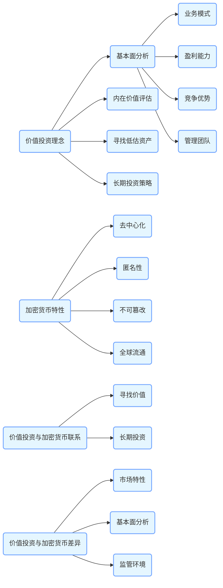

# 彼得林奇的"价值投资"在加密货币时代的新思考

> 关键词：彼得林奇、价值投资、加密货币、投资策略、市场分析

> 摘要：本文旨在探讨彼得林奇经典的价值投资理念在加密货币这一新兴领域的适用性与新发展。通过对价值投资核心概念的剖析，结合加密货币的特点，深入分析其在加密货币市场中的应用原理和操作步骤。文中详细阐述了相关数学模型和公式，并通过项目实战案例展示了如何将价值投资方法应用于加密货币投资。此外，还介绍了加密货币领域的实际应用场景、相关工具和资源，最后总结了价值投资在加密货币时代的未来发展趋势与挑战，为投资者提供全面且深入的参考。

## 1. 背景介绍 

### 1.1 目的和范围
本文章的主要目的是研究彼得林奇的价值投资理论在加密货币市场的可行性和应用方式。彼得林奇作为价值投资领域的传奇人物，其投资理念和方法在传统金融市场取得了巨大成功。然而，加密货币市场具有高度的波动性、创新性和去中心化等特点，与传统金融市场存在显著差异。因此，探讨价值投资在这一新兴市场的应用具有重要的理论和实践意义。

本文的研究范围涵盖了价值投资的核心概念、加密货币的市场特性、将价值投资应用于加密货币的具体方法和策略，以及相关的数学模型和实际案例分析。同时，还会介绍该领域的工具和资源，以及未来的发展趋势和挑战。

### 1.2 预期读者
本文预期读者包括对投资领域感兴趣的普通投资者、金融专业人士、加密货币爱好者以及相关领域的研究人员。对于普通投资者，本文可以提供一种新的投资思路和方法；金融专业人士可以从理论和实践的角度深入探讨价值投资在加密货币市场的应用；加密货币爱好者可以了解如何运用传统投资理念来评估和选择加密货币；研究人员则可以在此基础上开展更深入的学术研究。

### 1.3 文档结构概述
本文将按照以下结构进行阐述：
- 核心概念与联系：介绍彼得林奇的价值投资核心概念以及加密货币的基本概念，分析两者之间的联系和差异。
- 核心算法原理 & 具体操作步骤：讲解将价值投资应用于加密货币的算法原理，并给出具体的操作步骤，同时用 Python 代码进行详细阐述。
- 数学模型和公式 & 详细讲解 & 举例说明：介绍相关的数学模型和公式，详细解释其含义，并通过实际例子进行说明。
- 项目实战：代码实际案例和详细解释说明：通过实际的项目案例，展示如何运用价值投资方法进行加密货币投资，包括开发环境搭建、源代码实现和代码解读。
- 实际应用场景：介绍价值投资在加密货币市场的实际应用场景。
- 工具和资源推荐：推荐相关的学习资源、开发工具框架和论文著作。
- 总结：未来发展趋势与挑战：总结价值投资在加密货币时代的发展趋势和面临的挑战。
- 附录：常见问题与解答：解答读者在阅读过程中可能遇到的常见问题。
- 扩展阅读 & 参考资料：提供相关的扩展阅读材料和参考资料。

### 1.4 术语表
#### 1.4.1 核心术语定义
- **价值投资**：一种基于对资产内在价值的评估，以低于内在价值的价格买入资产，并长期持有的投资策略。其核心思想是寻找被市场低估的资产，通过资产价值的回归来获取收益。
- **加密货币**：一种基于密码学原理的数字货币，使用去中心化的分布式账本（如区块链）来记录交易。加密货币具有匿名性、去中心化、不可篡改等特点。
- **内在价值**：资产在正常市场条件下所具有的真实价值，通常通过对资产的基本面、盈利能力、未来现金流等因素进行分析来评估。
- **市场价格**：资产在市场上的交易价格，由市场供求关系决定。

#### 1.4.2 相关概念解释
- **区块链**：一种去中心化的分布式账本技术，通过密码学算法将交易信息记录在一个个区块中，并按时间顺序链接成链条。区块链具有不可篡改、公开透明等特点，是加密货币的底层技术。
- **去中心化**：指系统不依赖于单一的中心化机构进行管理和控制，而是由多个节点共同参与和维护。在加密货币领域，去中心化意味着交易记录由多个节点共同验证和存储，提高了系统的安全性和可靠性。
- **挖矿**：通过计算机算力解决复杂的数学问题，从而获得加密货币奖励的过程。挖矿是维护区块链网络安全和交易记录的重要方式。

#### 1.4.3 缩略词列表
- **BTC**：比特币（Bitcoin），是最早也是最知名的加密货币。
- **ETH**：以太坊（Ethereum），一种开源的有智能合约功能的公共区块链平台。
- **ICO**：首次代币发行（Initial Coin Offering），是一种通过发行加密代币来筹集资金的方式。

## 2. 核心概念与联系 

### 彼得林奇的价值投资核心概念
彼得林奇是价值投资的杰出代表人物之一，他的投资理念强调对公司基本面的深入研究。他认为投资者应该关注公司的业务模式、盈利能力、竞争优势、管理团队等因素，通过分析这些因素来评估公司的内在价值。

具体来说，彼得林奇关注以下几个方面：
- **公司的业务**：了解公司的主营业务是什么，是否具有可持续性和增长潜力。例如，一家生产有独特需求产品的公司，其业务往往更具稳定性。
- **盈利能力**：通过分析公司的财务报表，如净利润、毛利率、净利率等指标，评估公司的盈利能力。盈利能力强的公司通常具有更高的内在价值。
- **竞争优势**：考察公司在市场中的竞争地位，是否具有独特的技术、品牌、成本等优势。具有竞争优势的公司能够在市场中获得更高的份额和利润。
- **管理团队**：优秀的管理团队能够带领公司实现良好的发展。彼得林奇注重考察管理团队的能力、经验和诚信度。

### 加密货币的基本概念
加密货币是基于密码学原理的数字货币，其核心技术是区块链。与传统货币不同，加密货币不依赖于中央银行发行和管理，而是通过去中心化的分布式账本记录交易。

加密货币具有以下特点：
- **去中心化**：没有单一的中心化机构控制，交易记录由多个节点共同验证和存储，提高了系统的安全性和可靠性。
- **匿名性**：在一定程度上保护了用户的隐私，交易信息只有参与交易的双方和相关节点可见。
- **不可篡改**：一旦交易信息被记录在区块链上，就无法被篡改，保证了交易的真实性和可靠性。
- **全球流通**：加密货币可以在全球范围内自由流通，不受国界和地域的限制。

### 价值投资与加密货币的联系和差异
#### 联系
- **寻找价值**：价值投资的核心是寻找被低估的资产，而在加密货币市场中，同样存在一些被市场低估的加密货币。投资者可以通过分析加密货币的基本面、技术实力、市场需求等因素，寻找具有投资价值的加密货币。
- **长期投资**：彼得林奇主张长期投资，认为通过长期持有被低估的资产，可以获得资产价值回归带来的收益。在加密货币市场中，虽然市场波动性较大，但对于一些具有潜力的加密货币，长期投资也可能带来丰厚的回报。

#### 差异
- **市场特性**：加密货币市场具有高度的波动性和不确定性，价格波动幅度远远超过传统金融市场。这使得价值评估更加困难，因为市场情绪和炒作因素对价格的影响较大。
- **基本面分析**：传统价值投资主要基于公司的财务报表和业务情况进行基本面分析，而加密货币大多没有传统意义上的财务报表，其价值评估更多地依赖于技术实力、社区活跃度、应用场景等因素。
- **监管环境**：加密货币市场的监管环境相对宽松，不同国家和地区对加密货币的态度和监管政策存在差异。这增加了投资的风险和不确定性。

### 核心概念原理和架构的文本示意图
```plaintext
价值投资理念
|-- 基本面分析
|   |-- 业务模式
|   |-- 盈利能力
|   |-- 竞争优势
|   |-- 管理团队
|-- 内在价值评估
|-- 寻找低估资产
|-- 长期投资策略

加密货币特性
|-- 去中心化
|-- 匿名性
|-- 不可篡改
|-- 全球流通

价值投资与加密货币联系
|-- 寻找价值
|-- 长期投资

价值投资与加密货币差异
|-- 市场特性
|-- 基本面分析
|-- 监管环境
```

### Mermaid 流程图


## 3. 核心算法原理 & 具体操作步骤 

### 核心算法原理
将价值投资应用于加密货币的核心算法原理是通过对加密货币的基本面和市场数据进行分析，评估其内在价值，并与市场价格进行比较，从而判断是否具有投资价值。具体步骤如下：

#### 基本面分析
- **技术实力**：评估加密货币的底层技术，如区块链的性能、安全性、扩展性等。技术先进的加密货币通常具有更高的价值。
- **社区活跃度**：社区活跃度反映了加密货币的市场关注度和用户基础。活跃的社区有助于推动加密货币的发展和应用。
- **应用场景**：分析加密货币的应用场景是否广泛，是否具有实际的商业价值。具有明确应用场景的加密货币更有可能获得市场认可。

#### 市场数据分析
- **价格走势**：观察加密货币的历史价格走势，分析其价格波动规律和趋势。可以使用技术分析方法，如移动平均线、相对强弱指标等。
- **交易量**：交易量反映了市场的活跃度和流动性。较大的交易量通常意味着市场参与度高，价格更具可信度。

#### 内在价值评估
综合考虑基本面分析和市场数据分析的结果，对加密货币的内在价值进行评估。可以采用多种方法，如现金流折现法、相对估值法等。

### 具体操作步骤

#### 步骤 1：数据收集
- 收集加密货币的基本面信息，如白皮书、技术文档、社区论坛等。
- 收集加密货币的市场数据，如价格、交易量、市值等。可以通过加密货币交易平台、数据网站等获取数据。

#### 步骤 2：基本面分析
- 对加密货币的技术实力进行评估，了解其底层技术的特点和优势。
- 分析加密货币的社区活跃度，查看社区论坛的讨论热度、社交媒体的关注度等。
- 研究加密货币的应用场景，评估其商业价值和发展潜力。

#### 步骤 3：市场数据分析
- 使用技术分析方法，对加密货币的价格走势进行分析。例如，计算移动平均线，判断价格的趋势。
- 分析交易量的变化，了解市场的活跃度和流动性。

#### 步骤 4：内在价值评估
根据基本面分析和市场数据分析的结果，选择合适的方法对加密货币的内在价值进行评估。

#### 步骤 5：投资决策
将加密货币的内在价值与市场价格进行比较，如果内在价值高于市场价格，则认为该加密货币被低估，具有投资价值；反之，则不建议投资。

### Python 源代码详细阐述
以下是一个简单的 Python 代码示例，用于收集加密货币的市场数据并进行基本的技术分析。

```python
import requests
import pandas as pd
import matplotlib.pyplot as plt

# 定义获取加密货币市场数据的函数
def get_crypto_data(symbol, days):
    url = f"https://api.coingecko.com/api/v3/coins/{symbol}/market_chart?vs_currency=usd&days={days}"
    response = requests.get(url)
    data = response.json()
    prices = data['prices']
    df = pd.DataFrame(prices, columns=['timestamp', 'price'])
    df['timestamp'] = pd.to_datetime(df['timestamp'], unit='ms')
    df.set_index('timestamp', inplace=True)
    return df

# 获取比特币近 30 天的市场数据
btc_data = get_crypto_data('bitcoin', 30)

# 计算 5 日和 20 日移动平均线
btc_data['MA5'] = btc_data['price'].rolling(window=5).mean()
btc_data['MA20'] = btc_data['price'].rolling(window=20).mean()

# 绘制价格走势和移动平均线图
plt.figure(figsize=(12, 6))
plt.plot(btc_data['price'], label='Price')
plt.plot(btc_data['MA5'], label='MA5')
plt.plot(btc_data['MA20'], label='MA20')
plt.title('Bitcoin Price and Moving Averages')
plt.xlabel('Date')
plt.ylabel('Price (USD)')
plt.legend()
plt.show()
```

### 代码解释
- `get_crypto_data` 函数：通过 CoinGecko API 获取指定加密货币的市场数据，并将其转换为 Pandas DataFrame。
- 计算移动平均线：使用 Pandas 的 `rolling` 方法计算 5 日和 20 日移动平均线。
- 绘制图表：使用 Matplotlib 库绘制价格走势和移动平均线图，直观展示加密货币的价格趋势。

## 4. 数学模型和公式 & 详细讲解 & 举例说明 

### 现金流折现法
现金流折现法是一种常用的价值评估方法，其基本原理是将资产未来的现金流折现到当前时刻，从而得到资产的内在价值。在加密货币领域，虽然加密货币本身通常没有传统意义上的现金流，但可以通过分析其应用场景和潜在收益，估算未来的现金流。

#### 数学公式
$$V = \sum_{t=1}^{n} \frac{CF_t}{(1 + r)^t}$$

其中：
- $V$ 表示资产的内在价值。
- $CF_t$ 表示第 $t$ 期的现金流。
- $r$ 表示折现率。
- $n$ 表示现金流的期数。

#### 详细讲解
- **现金流预测**：对于加密货币，需要根据其应用场景和市场前景，预测未来的现金流。例如，如果一种加密货币用于支付领域，可以预测其未来的交易手续费收入。
- **折现率选择**：折现率反映了投资者对风险的预期。一般来说，加密货币市场风险较高，折现率也相对较高。可以参考市场上类似风险资产的收益率来确定折现率。
- **期数确定**：期数的确定需要考虑加密货币的发展阶段和市场前景。通常可以根据加密货币的技术发展、市场推广计划等因素来确定。

#### 举例说明
假设一种加密货币用于去中心化金融（DeFi）领域，预计未来 3 年的现金流分别为 100 万美元、200 万美元和 300 万美元。折现率为 20%。则该加密货币的内在价值计算如下：

$$V = \frac{100}{(1 + 0.2)^1} + \frac{200}{(1 + 0.2)^2} + \frac{300}{(1 + 0.2)^3}$$
$$V = \frac{100}{1.2} + \frac{200}{1.44} + \frac{300}{1.728}$$
$$V \approx 83.33 + 138.89 + 173.61$$
$$V \approx 395.83 \text{（万美元）}$$

### 相对估值法
相对估值法是通过比较类似资产的估值指标，来评估目标资产的价值。在加密货币领域，可以选择一些具有相似特点的加密货币作为参照物，比较它们的市值、交易量、用户数量等指标。

#### 数学公式
$$V_{target} = \frac{指标_{target}}{指标_{reference}} \times V_{reference}$$

其中：
- $V_{target}$ 表示目标加密货币的内在价值。
- $指标_{target}$ 表示目标加密货币的某个估值指标，如市值、交易量等。
- $指标_{reference}$ 表示参照物加密货币的相同估值指标。
- $V_{reference}$ 表示参照物加密货币的市场价值。

#### 详细讲解
- **参照物选择**：选择与目标加密货币具有相似特点的加密货币作为参照物。例如，如果目标加密货币是一种基于以太坊的 DeFi 代币，可以选择其他类似的 DeFi 代币作为参照物。
- **估值指标选择**：选择合适的估值指标进行比较。常见的估值指标包括市值、交易量、用户数量等。不同的估值指标适用于不同的加密货币类型和应用场景。
- **价值计算**：根据公式计算目标加密货币的内在价值。

#### 举例说明
假设目标加密货币 A 的交易量为 1000 万美元，参照物加密货币 B 的交易量为 2000 万美元，加密货币 B 的市值为 5000 万美元。则加密货币 A 的内在价值计算如下：

$$V_A = \frac{1000}{2000} \times 5000 = 2500 \text{（万美元）}$$

## 5. 项目实战：代码实际案例和详细解释说明 

### 5.1 开发环境搭建
#### 安装 Python
首先，需要安装 Python 环境。可以从 Python 官方网站（https://www.python.org/downloads/）下载适合自己操作系统的 Python 安装包，并按照安装向导进行安装。

#### 安装必要的库
在命令行中使用以下命令安装必要的 Python 库：
```sh
pip install requests pandas matplotlib
```
- `requests`：用于发送 HTTP 请求，获取加密货币市场数据。
- `pandas`：用于数据处理和分析。
- `matplotlib`：用于绘制图表。

### 5.2 源代码详细实现和代码解读
以下是一个完整的 Python 代码示例，用于对加密货币进行价值评估和投资决策。

```python
import requests
import pandas as pd
import matplotlib.pyplot as plt

# 定义获取加密货币市场数据的函数
def get_crypto_data(symbol, days):
    url = f"https://api.coingecko.com/api/v3/coins/{symbol}/market_chart?vs_currency=usd&days={days}"
    response = requests.get(url)
    data = response.json()
    prices = data['prices']
    df = pd.DataFrame(prices, columns=['timestamp', 'price'])
    df['timestamp'] = pd.to_datetime(df['timestamp'], unit='ms')
    df.set_index('timestamp', inplace=True)
    return df

# 定义计算移动平均线的函数
def calculate_moving_averages(df, short_window=5, long_window=20):
    df['MA_short'] = df['price'].rolling(window=short_window).mean()
    df['MA_long'] = df['price'].rolling(window=long_window).mean()
    return df

# 定义投资决策函数
def make_investment_decision(df):
    last_row = df.iloc[-1]
    if last_row['MA_short'] > last_row['MA_long']:
        return 'Buy'
    else:
        return 'Sell'

# 获取比特币近 30 天的市场数据
btc_data = get_crypto_data('bitcoin', 30)

# 计算移动平均线
btc_data = calculate_moving_averages(btc_data)

# 进行投资决策
decision = make_investment_decision(btc_data)
print(f"Investment decision: {decision}")

# 绘制价格走势和移动平均线图
plt.figure(figsize=(12, 6))
plt.plot(btc_data['price'], label='Price')
plt.plot(btc_data['MA_short'], label='MA_short')
plt.plot(btc_data['MA_long'], label='MA_long')
plt.title('Bitcoin Price and Moving Averages')
plt.xlabel('Date')
plt.ylabel('Price (USD)')
plt.legend()
plt.show()
```

### 代码解读与分析
- **`get_crypto_data` 函数**：通过 CoinGecko API 获取指定加密货币的市场数据，并将其转换为 Pandas DataFrame。该函数接受两个参数：`symbol` 表示加密货币的符号，`days` 表示获取数据的天数。
- **`calculate_moving_averages` 函数**：计算加密货币价格的短期和长期移动平均线。默认情况下，短期移动平均线的窗口为 5 天，长期移动平均线的窗口为 20 天。
- **`make_investment_decision` 函数**：根据短期和长期移动平均线的交叉情况进行投资决策。如果短期移动平均线大于长期移动平均线，则建议买入；否则，建议卖出。
- **主程序**：获取比特币近 30 天的市场数据，计算移动平均线，进行投资决策，并绘制价格走势和移动平均线图。

### 风险提示
需要注意的是，以上代码只是一个简单的示例，实际的投资决策需要考虑更多的因素，如基本面分析、市场情绪、宏观经济环境等。加密货币市场具有高度的波动性和不确定性，投资前应充分了解相关风险。

## 6. 实际应用场景 

### 个人投资
对于个人投资者来说，价值投资理念可以帮助他们在加密货币市场中选择具有潜力的加密货币进行投资。通过对加密货币的基本面和市场数据进行分析，投资者可以评估其内在价值，避免盲目跟风投资。例如，投资者可以选择那些技术先进、应用场景广泛、社区活跃度高的加密货币进行长期投资。

### 机构投资
机构投资者如对冲基金、资产管理公司等也可以将价值投资应用于加密货币市场。机构投资者通常具有更专业的研究团队和更丰富的资源，能够进行更深入的基本面分析和市场研究。他们可以通过构建投资组合，分散投资风险，获取更稳定的收益。

### 项目评估
在加密货币项目的早期阶段，价值投资理念可以用于评估项目的可行性和发展潜力。项目方可以通过展示项目的技术实力、应用场景、团队背景等信息，吸引投资者的关注。投资者可以根据这些信息，评估项目的内在价值，决定是否参与项目的投资。

### 市场分析
价值投资理念还可以用于加密货币市场的分析和预测。通过对市场上不同加密货币的价值评估，分析市场的整体估值水平和投资机会。同时，也可以通过比较不同加密货币的价值，发现市场中的套利机会。

## 7. 工具和资源推荐

### 7.1 学习资源推荐
#### 7.1.1 书籍推荐
- 《彼得林奇的成功投资》：彼得林奇的经典著作，详细介绍了他的投资理念和方法。
- 《聪明的投资者》：本杰明·格雷厄姆的著作，价值投资的奠基之作，对投资者具有重要的指导意义。
- 《加密货币：从入门到精通》：介绍了加密货币的基本概念、技术原理和投资方法。

#### 7.1.2 在线课程
- Coursera 上的“投资学原理”：由知名教授授课，系统介绍投资学的基本原理和方法。
- Udemy 上的“加密货币投资课程”：专门针对加密货币投资的课程，涵盖了加密货币的市场分析、投资策略等内容。

#### 7.1.3 技术博客和网站
- CoinDesk：提供加密货币市场的最新新闻、分析和评论。
- Cointelegraph：专注于加密货币和区块链技术的新闻和资讯平台。
- Medium 上的加密货币相关博客：有许多专业人士分享的加密货币投资经验和技术分析文章。

### 7.2 开发工具框架推荐
#### 7.2.1 IDE和编辑器
- PyCharm：一款功能强大的 Python 集成开发环境，适合开发加密货币相关的 Python 程序。
- Visual Studio Code：一款轻量级的代码编辑器，支持多种编程语言，具有丰富的插件生态系统。

#### 7.2.2 调试和性能分析工具
- PDB：Python 自带的调试工具，可以帮助开发者定位和解决代码中的问题。
- cProfile：Python 的性能分析工具，可以分析代码的运行时间和资源消耗情况。

#### 7.2.3 相关框架和库
- Requests：用于发送 HTTP 请求，获取加密货币市场数据。
- Pandas：用于数据处理和分析。
- Matplotlib：用于绘制图表，可视化加密货币市场数据。

### 7.3 相关论文著作推荐
#### 7.3.1 经典论文
- “Bitcoin: A Peer-to-Peer Electronic Cash System”：比特币的白皮书，介绍了比特币的技术原理和设计理念。
- “Ethereum: A Next-Generation Smart Contract and Decentralized Application Platform”：以太坊的白皮书，阐述了以太坊的智能合约和去中心化应用平台的概念。

#### 7.3.2 最新研究成果
- 可以关注学术数据库如 IEEE Xplore、ACM Digital Library 等，搜索关于加密货币和区块链的最新研究论文。
- 一些知名的学术会议如 IEEE Blockchain、ACM CCS 等也会发布相关的研究成果。

#### 7.3.3 应用案例分析
- 可以参考一些区块链行业报告和案例分析书籍，了解加密货币在不同领域的应用案例和实践经验。

## 8. 总结：未来发展趋势与挑战

### 未来发展趋势
- **价值投资理念的深入应用**：随着加密货币市场的不断发展和成熟，价值投资理念将得到更广泛的应用。投资者将更加注重加密货币的基本面分析，寻找具有真实价值和发展潜力的项目。
- **与传统金融市场的融合**：加密货币市场与传统金融市场的联系将越来越紧密。一些传统金融机构将逐渐涉足加密货币领域，为加密货币市场带来更多的资金和专业的投资理念。
- **技术创新推动价值提升**：加密货币技术的不断创新将推动其价值的提升。例如，区块链技术的升级、智能合约的完善等将为加密货币带来更广泛的应用场景和商业价值。

### 挑战
- **市场波动性**：加密货币市场的高度波动性仍然是价值投资面临的主要挑战之一。价格的大幅波动使得价值评估更加困难，投资者需要具备更强的风险承受能力和投资策略。
- **监管不确定性**：加密货币市场的监管环境尚未完全成熟，不同国家和地区的监管政策存在差异。监管的不确定性增加了投资的风险，投资者需要密切关注监管动态。
- **技术风险**：加密货币的技术基础是区块链，虽然区块链技术具有许多优势，但也存在一些技术风险，如安全漏洞、扩展性问题等。这些技术风险可能会影响加密货币的价值和发展。

## 9. 附录：常见问题与解答

### 问题 1：价值投资在加密货币市场一定能获得收益吗？
解答：价值投资只是一种投资策略，不能保证在加密货币市场一定能获得收益。加密货币市场具有高度的波动性和不确定性，价格受到多种因素的影响，如市场情绪、政策法规、技术发展等。价值投资可以帮助投资者选择具有潜力的加密货币，但仍然需要投资者具备一定的风险承受能力和投资经验。

### 问题 2：如何评估加密货币的基本面？
解答：评估加密货币的基本面可以从以下几个方面入手：
- 技术实力：了解加密货币的底层技术，如区块链的性能、安全性、扩展性等。
- 社区活跃度：查看社区论坛的讨论热度、社交媒体的关注度等。
- 应用场景：分析加密货币的应用场景是否广泛，是否具有实际的商业价值。
- 团队背景：考察开发团队的技术能力、经验和信誉。

### 问题 3：加密货币的价值评估方法有哪些局限性？
解答：加密货币的价值评估方法存在以下局限性：
- 缺乏传统财务数据：加密货币大多没有传统意义上的财务报表，使得基于财务数据的价值评估方法难以应用。
- 市场不确定性：加密货币市场的波动性和不确定性较大，未来现金流和市场需求难以准确预测。
- 技术发展迅速：加密货币技术发展迅速，新的技术和应用不断涌现，使得价值评估的时效性较差。

### 问题 4：如何选择合适的加密货币进行投资？
解答：选择合适的加密货币进行投资可以参考以下几点：
- 基本面分析：评估加密货币的技术实力、社区活跃度、应用场景等基本面因素。
- 市场数据分析：观察加密货币的价格走势、交易量等市场数据，分析其市场表现。
- 风险承受能力：根据自己的风险承受能力选择合适的加密货币。一般来说，市值较大、流动性较好的加密货币风险相对较低。
- 投资目标：明确自己的投资目标，是短期投机还是长期投资，根据投资目标选择合适的加密货币。

## 10. 扩展阅读 & 参考资料

### 扩展阅读
- 《区块链革命：比特币底层技术如何改变货币、商业和世界》：深入介绍了区块链技术的原理和应用，对理解加密货币的底层技术有很大帮助。
- 《数字黄金：比特币鲜为人知的故事》：讲述了比特币的发展历程和背后的故事，让读者更全面地了解加密货币的起源和发展。

### 参考资料
- CoinGecko API 文档：https://www.coingecko.com/api/documentations/v3
- 彼得林奇的官方网站：https://www.peterlynch.com/
- 加密货币相关的学术研究论文和行业报告。