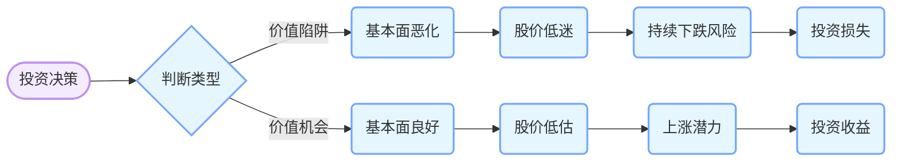

# 彼得林奇的"价值陷阱"vs"价值机会"

> 关键词：彼得林奇、价值陷阱、价值机会、投资分析、股票估值、财务指标、市场趋势

> 摘要：本文围绕彼得林奇提出的“价值陷阱”与“价值机会”展开深入探讨。详细阐述了这两个概念的背景和内涵，分析它们的核心原理与相互联系。通过数学模型和公式对价值评估进行量化分析，并结合Python代码给出具体操作步骤。同时，引入项目实战案例，展示如何在实际投资中识别“价值陷阱”与“价值机会”。还探讨了它们在不同市场环境下的实际应用场景，推荐了相关的学习资源、开发工具和论文著作。最后总结了未来投资领域在这方面的发展趋势与挑战，并解答了常见问题，为投资者提供全面且深入的参考。

## 1. 背景介绍 
### 1.1 目的和范围
彼得林奇是投资领域的传奇人物，他的投资理念和方法影响了无数投资者。“价值陷阱”和“价值机会”是其投资理论中的重要概念。本文的目的在于深入剖析这两个概念，帮助投资者更好地理解和运用它们进行投资决策。范围涵盖了概念的定义、识别方法、实际应用以及相关的理论和实践探讨。

### 1.2 预期读者
本文主要面向对股票投资感兴趣的个人投资者、金融专业学生以及从事投资研究和分析的专业人士。无论您是投资新手还是有一定经验的老手，都能从本文中获得有价值的信息和启示。

### 1.3 文档结构概述
本文首先介绍“价值陷阱”和“价值机会”的背景知识，包括术语定义和相关概念解释。接着阐述核心概念的原理和联系，并用流程图展示。然后讲解识别它们的核心算法原理和具体操作步骤，结合Python代码进行说明。之后给出数学模型和公式，并举例说明。通过项目实战案例，详细介绍开发环境搭建、源代码实现和代码解读。探讨实际应用场景，推荐相关的学习资源、开发工具和论文著作。最后总结未来发展趋势与挑战，解答常见问题，并提供扩展阅读和参考资料。

### 1.4 术语表
#### 1.4.1 核心术语定义
- **价值陷阱**：指那些看起来股价便宜、具有投资价值，但实际上由于公司基本面存在严重问题，如业绩下滑、行业衰退等，导致股价持续低迷甚至进一步下跌的投资对象。
- **价值机会**：是指股价被市场低估，公司具有良好的基本面和发展前景，未来股价有较大上涨空间的投资机会。

#### 1.4.2 相关概念解释
- **市盈率（P/E）**：是指股票价格除以每股收益的比率，反映了市场对公司盈利的预期和估值水平。
- **市净率（P/B）**：是指股票价格与每股净资产的比率，用于衡量公司的资产价值和市场估值。
- **现金流**：指企业在一定会计期间按照现金收付实现制，通过一定经济活动（包括经营活动、投资活动、筹资活动和非经常性项目）而产生的现金流入、现金流出及其总量情况的总称。

#### 1.4.3 缩略词列表
- **P/E**：Price-to-Earnings Ratio，市盈率
- **P/B**：Price-to-Book Ratio，市净率
- **DCF**：Discounted Cash Flow，现金流折现法

## 2. 核心概念与联系 
### 核心概念原理
#### 价值陷阱原理
价值陷阱往往是由于市场对公司的短期困境或长期问题认识不足，导致股价看似便宜。公司可能面临行业竞争加剧、技术变革、管理不善等问题，使得盈利能力下降。即使股价看似很低，但由于基本面的恶化，未来业绩难以改善，股价也难以回升，投资者容易陷入其中。

#### 价值机会原理
价值机会通常是由于市场的短期波动、投资者情绪等因素，导致公司股价低于其内在价值。公司可能具有独特的竞争优势、良好的业绩增长潜力和稳定的现金流，但市场没有充分认识到这些价值。随着时间的推移，市场会逐渐发现公司的价值，股价会向其内在价值回归。

### 架构的文本示意图
```plaintext
              ┌─────────────┐
              │  投资决策  │
              └─────┬──────┘
                    │
        ┌───────────┴───────────┐
        │                       │
 ┌──────▼──────┐         ┌──────▼──────┐
 │ 价值陷阱    │         │ 价值机会    │
 └──────┬──────┘         └──────┬──────┘
        │                       │
        │ 基本面恶化等因素    │ 基本面良好等因素
        │                       │
 ┌──────▼──────┐         ┌──────▼──────┐
 │ 股价低迷    │         │ 股价低估    │
 └──────┬──────┘         └──────┬──────┘
        │                       │
        │ 持续下跌风险        │ 上涨潜力
        │                       │
 ┌──────▼──────┐         ┌──────▼──────┐
 │ 投资损失    │         │ 投资收益    │
 └─────────────┘         └─────────────┘
```

### Mermaid 流程图


## 3. 核心算法原理 & 具体操作步骤 
### 核心算法原理
#### 市盈率法
市盈率法是通过比较公司的市盈率与同行业平均市盈率或历史市盈率来判断公司的估值水平。如果公司的市盈率低于同行业平均水平或历史平均水平，可能存在价值机会；但如果公司的业绩存在下滑风险，低市盈率也可能是价值陷阱。

#### 市净率法
市净率法是比较公司的市净率与同行业平均市净率。市净率较低的公司可能被低估，但如果公司的资产质量不佳或存在大量不良资产，低市净率也可能是价值陷阱。

#### 现金流折现法（DCF）
现金流折现法是通过预测公司未来的现金流，并将其折现到当前时刻，得到公司的内在价值。如果公司的股价低于其内在价值，则可能存在价值机会；反之，如果公司未来现金流难以预测或存在下降趋势，即使股价看似较低，也可能是价值陷阱。

### 具体操作步骤
#### 数据收集
收集公司的财务报表、行业数据、市场数据等信息。包括每股收益、每股净资产、现金流等指标。

#### 指标计算
计算公司的市盈率、市净率等指标，并与同行业平均水平进行比较。

#### 现金流预测
使用合适的方法预测公司未来的现金流，如历史数据法、行业趋势法等。

#### 内在价值计算
使用现金流折现法计算公司的内在价值。

#### 判断结果
根据计算结果判断公司是价值陷阱还是价值机会。

### Python源代码实现
```python
import pandas as pd
import numpy as np

# 数据收集
def collect_data():
    # 这里假设数据存储在 CSV 文件中
    data = pd.read_csv('company_data.csv')
    return data

# 指标计算
def calculate_metrics(data):
    data['PE'] = data['Stock_Price'] / data['Earnings_Per_Share']
    data['PB'] = data['Stock_Price'] / data['Book_Value_Per_Share']
    return data

# 现金流预测（简单示例：假设现金流按固定增长率增长）
def predict_cash_flow(data, growth_rate, years):
    cash_flows = []
    initial_cf = data['Cash_Flow'].iloc[0]
    for i in range(years):
        cash_flow = initial_cf * (1 + growth_rate) ** i
        cash_flows.append(cash_flow)
    return cash_flows

# 现金流折现法计算内在价值
def dcf_analysis(cash_flows, discount_rate):
    present_values = []
    for i, cf in enumerate(cash_flows):
        pv = cf / ((1 + discount_rate) ** (i + 1))
        present_values.append(pv)
    intrinsic_value = sum(present_values)
    return intrinsic_value

# 判断结果
def judge_result(data, intrinsic_value):
    stock_price = data['Stock_Price'].iloc[0]
    if stock_price < intrinsic_value:
        return "价值机会"
    else:
        return "需进一步分析是否为价值陷阱"

# 主函数
def main():
    data = collect_data()
    data = calculate_metrics(data)
    growth_rate = 0.05  # 假设现金流增长率为 5%
    years = 5  # 预测未来 5 年现金流
    cash_flows = predict_cash_flow(data, growth_rate, years)
    discount_rate = 0.1  # 假设折现率为 10%
    intrinsic_value = dcf_analysis(cash_flows, discount_rate)
    result = judge_result(data, intrinsic_value)
    print(f"判断结果: {result}")

if __name__ == "__main__":
    main()
```

## 4. 数学模型和公式 & 详细讲解 & 举例说明 
### 市盈率（P/E）
#### 公式
$$P/E = \frac{股价}{每股收益}$$

#### 详细讲解
市盈率反映了投资者为获得公司每一元盈利所愿意支付的价格。一般来说，市盈率较低的公司可能被低估，但需要结合公司的业绩增长情况进行分析。如果公司的业绩处于下滑阶段，即使市盈率较低，也可能是价值陷阱。

#### 举例说明
假设公司 A 的股价为 20 元，每股收益为 2 元，则其市盈率为 $20 \div 2 = 10$ 倍。同行业平均市盈率为 15 倍，从市盈率角度看，公司 A 可能被低估。但如果公司 A 所在行业面临技术变革，公司的市场份额逐渐下降，未来业绩可能进一步下滑，那么这个低市盈率可能就是价值陷阱。

### 市净率（P/B）
#### 公式
$$P/B = \frac{股价}{每股净资产}$$

#### 详细讲解
市净率衡量了公司的市场价值与账面价值的关系。市净率较低的公司可能具有较高的安全边际，但如果公司的资产质量不佳，如存在大量坏账、存货积压等问题，低市净率也可能是价值陷阱。

#### 举例说明
公司 B 的股价为 15 元，每股净资产为 20 元，则其市净率为 $15 \div 20 = 0.75$ 倍。同行业平均市净率为 1 倍，公司 B 的市净率较低。但如果公司 B 的固定资产大多为陈旧设备，市场价值远低于账面价值，那么这个低市净率可能并不能反映公司的真实价值，存在价值陷阱的可能。

### 现金流折现法（DCF）
#### 公式
$$V = \sum_{t=1}^{n} \frac{CF_t}{(1 + r)^t}$$
其中，$V$ 为公司的内在价值，$CF_t$ 为第 $t$ 期的现金流，$r$ 为折现率，$n$ 为预测期数。

#### 详细讲解
现金流折现法的核心思想是将公司未来的现金流折现到当前时刻，以评估公司的内在价值。预测现金流和确定折现率是该方法的关键。如果预测的现金流不准确或折现率选择不当，可能会导致对公司内在价值的评估出现偏差。

#### 举例说明
假设公司 C 未来 5 年的现金流分别为 100 万元、120 万元、130 万元、140 万元和 150 万元，折现率为 10%。则公司 C 的内在价值为：
$$V = \frac{100}{(1 + 0.1)^1} + \frac{120}{(1 + 0.1)^2} + \frac{130}{(1 + 0.1)^3} + \frac{140}{(1 + 0.1)^4} + \frac{150}{(1 + 0.1)^5}$$
```python
import numpy as np

cash_flows = [100, 120, 130, 140, 150]
discount_rate = 0.1
intrinsic_value = sum([cf / ((1 + discount_rate) ** (i + 1)) for i, cf in enumerate(cash_flows)])
print(f"公司 C 的内在价值: {intrinsic_value:.2f} 万元")
```
假设公司 C 的当前市值为 400 万元，低于其内在价值，可能存在价值机会。但如果公司 C 所处行业竞争激烈，未来现金流存在较大的不确定性，那么即使当前市值低于内在价值，也需要谨慎判断是否为价值陷阱。

## 5. 项目实战：代码实际案例和详细解释说明 
### 5.1  开发环境搭建
#### 安装 Python
首先需要安装 Python 环境，建议使用 Python 3.7 及以上版本。可以从 Python 官方网站（https://www.python.org/downloads/）下载安装包，按照提示进行安装。

#### 安装必要的库
使用以下命令安装所需的库：
```sh
pip install pandas numpy
```

#### 数据准备
准备公司的财务数据，将其存储在 CSV 文件中，文件包含以下列：`Stock_Price`（股价）、`Earnings_Per_Share`（每股收益）、`Book_Value_Per_Share`（每股净资产）、`Cash_Flow`（现金流）。

### 5.2  源代码详细实现和代码解读
```python
import pandas as pd
import numpy as np

# 数据收集
def collect_data():
    # 这里假设数据存储在 CSV 文件中
    data = pd.read_csv('company_data.csv')
    return data

# 代码解读：该函数使用 pandas 库的 read_csv 函数读取存储在 CSV 文件中的公司数据，并返回一个 DataFrame 对象。

# 指标计算
def calculate_metrics(data):
    data['PE'] = data['Stock_Price'] / data['Earnings_Per_Share']
    data['PB'] = data['Stock_Price'] / data['Book_Value_Per_Share']
    return data

# 代码解读：该函数计算公司的市盈率（PE）和市净率（PB），并将结果添加到 DataFrame 中，最后返回更新后的 DataFrame。

# 现金流预测（简单示例：假设现金流按固定增长率增长）
def predict_cash_flow(data, growth_rate, years):
    cash_flows = []
    initial_cf = data['Cash_Flow'].iloc[0]
    for i in range(years):
        cash_flow = initial_cf * (1 + growth_rate) ** i
        cash_flows.append(cash_flow)
    return cash_flows

# 代码解读：该函数假设现金流按固定增长率增长，根据初始现金流和增长率预测未来若干年的现金流，并返回一个列表。

# 现金流折现法计算内在价值
def dcf_analysis(cash_flows, discount_rate):
    present_values = []
    for i, cf in enumerate(cash_flows):
        pv = cf / ((1 + discount_rate) ** (i + 1))
        present_values.append(pv)
    intrinsic_value = sum(present_values)
    return intrinsic_value

# 代码解读：该函数使用现金流折现法计算公司的内在价值，将预测的现金流折现到当前时刻，并求和得到内在价值。

# 判断结果
def judge_result(data, intrinsic_value):
    stock_price = data['Stock_Price'].iloc[0]
    if stock_price < intrinsic_value:
        return "价值机会"
    else:
        return "需进一步分析是否为价值陷阱"

# 代码解读：该函数比较公司的股价和内在价值，如果股价低于内在价值，则判断为价值机会；否则，需要进一步分析是否为价值陷阱。

# 主函数
def main():
    data = collect_data()
    data = calculate_metrics(data)
    growth_rate = 0.05  # 假设现金流增长率为 5%
    years = 5  # 预测未来 5 年现金流
    cash_flows = predict_cash_flow(data, growth_rate, years)
    discount_rate = 0.1  # 假设折现率为 10%
    intrinsic_value = dcf_analysis(cash_flows, discount_rate)
    result = judge_result(data, intrinsic_value)
    print(f"判断结果: {result}")

if __name__ == "__main__":
    main()
```

### 5.3  代码解读与分析
#### 整体流程
代码的整体流程是先收集公司数据，然后计算相关指标，接着预测现金流并计算内在价值，最后根据股价和内在价值的比较结果进行判断。

#### 数据处理
使用 pandas 库进行数据的读取和处理，方便对数据进行操作和分析。

#### 现金流预测
采用简单的固定增长率模型进行现金流预测，实际应用中可以根据公司的具体情况采用更复杂的模型。

#### 内在价值计算
使用现金流折现法计算内在价值，折现率的选择需要根据市场情况和公司的风险水平进行合理调整。

#### 判断结果
判断结果只是一个初步的判断，实际投资中还需要综合考虑其他因素，如行业前景、公司治理等。

## 6. 实际应用场景 
### 股票投资
在股票投资中，投资者可以使用上述方法识别“价值陷阱”和“价值机会”。对于被判断为价值机会的股票，可以考虑买入并持有；对于可能是价值陷阱的股票，应谨慎投资或避免投资。

### 基金投资
基金经理在选择投资标的时，也可以运用这些方法评估股票的价值。通过筛选出具有价值机会的股票，构建基金组合，提高基金的投资收益。

### 企业并购
在企业并购中，收购方需要评估目标企业的价值。判断目标企业是否为价值陷阱或价值机会，可以帮助收购方做出更合理的决策，避免高价收购陷入困境的企业。

### 风险投资
风险投资机构在选择投资项目时，需要对创业公司的价值进行评估。识别价值机会可以帮助风投机构发现具有潜力的创业公司，而避免陷入价值陷阱可以降低投资风险。

## 7. 工具和资源推荐
### 7.1 学习资源推荐
#### 7.1.1 书籍推荐
- 《彼得·林奇的成功投资》：彼得林奇的经典著作，详细介绍了他的投资理念和方法。
- 《聪明的投资者》：本杰明·格雷厄姆的著作，是价值投资的经典之作，对理解价值评估和投资决策有很大帮助。
- 《财务报表分析与证券定价》：深入讲解了如何通过财务报表分析评估企业的价值。

#### 7.1.2 在线课程
- Coursera 上的“投资学原理”：提供了系统的投资学知识，包括股票估值、风险评估等内容。
- edX 上的“财务报表分析”：帮助学习者掌握财务报表分析的方法和技巧。

#### 7.1.3 技术博客和网站
- 雪球网：是一个投资者交流社区，有很多关于股票投资的分析和讨论。
- 东方财富网：提供丰富的金融数据和资讯，方便投资者进行研究和分析。

### 7.2 开发工具框架推荐
#### 7.2.1 IDE和编辑器
- PyCharm：是一款专业的 Python 集成开发环境，提供了丰富的功能和插件，方便代码的编写和调试。
- Visual Studio Code：轻量级的代码编辑器，支持多种编程语言，具有丰富的扩展插件。

#### 7.2.2 调试和性能分析工具
- PDB：Python 自带的调试器，可以帮助开发者定位代码中的问题。
- cProfile：Python 的性能分析工具，可以分析代码的运行时间和函数调用情况。

#### 7.2.3 相关框架和库
- Pandas：用于数据处理和分析的 Python 库，提供了高效的数据结构和数据操作方法。
- Numpy：用于科学计算的 Python 库，提供了高性能的数组和矩阵运算功能。

### 7.3 相关论文著作推荐
#### 7.3.1 经典论文
- Fama, Eugene F., and Kenneth R. French. "The Cross-Section of Expected Stock Returns." Journal of Finance 47.2 (1992): 427-465. 该论文提出了著名的 Fama-French 三因子模型，对股票收益的影响因素进行了深入研究。
- Graham, Benjamin, and David L. Dodd. "Security Analysis." McGraw-Hill, 1934. 这是价值投资的经典著作，奠定了价值投资的理论基础。

#### 7.3.2 最新研究成果
- 关注顶级金融学术期刊，如《Journal of Financial Economics》《Review of Financial Studies》等，了解最新的投资研究成果。

#### 7.3.3 应用案例分析
- 可以参考一些投资机构的研究报告和案例分析，了解他们在实际投资中如何识别“价值陷阱”和“价值机会”。

## 8. 总结：未来发展趋势与挑战
### 未来发展趋势
#### 数据驱动的投资决策
随着大数据和人工智能技术的发展，投资者将更多地依赖数据和模型进行投资决策。通过对海量金融数据的分析和挖掘，可以更准确地识别“价值陷阱”和“价值机会”。

#### 跨学科融合
投资领域将与计算机科学、数学、统计学等学科进行更深入的融合。例如，运用机器学习算法对股票进行分类和预测，提高投资决策的准确性。

#### 全球投资视野
投资者将更加关注全球市场，寻找不同地区的价值机会。同时，也需要考虑全球经济和政治环境的变化对投资的影响。

### 挑战
#### 数据质量和可靠性
数据的质量和可靠性是数据驱动投资决策的关键。不准确或不完整的数据可能导致错误的投资决策。

#### 模型的局限性
任何模型都有其局限性，无法完全准确地预测市场和公司的未来发展。投资者需要对模型的结果进行合理的评估和判断。

#### 市场的不确定性
金融市场具有高度的不确定性，各种突发事件和政策变化可能导致市场波动，增加了识别“价值陷阱”和“价值机会”的难度。

## 9. 附录：常见问题与解答
### 如何准确预测公司的现金流？
预测公司的现金流是一个复杂的过程，需要考虑多个因素。可以参考公司的历史现金流数据、行业发展趋势、市场需求等。同时，还可以采用多种预测方法进行综合分析，如时间序列分析、回归分析等。

### 折现率应该如何选择？
折现率的选择需要考虑市场利率、公司的风险水平等因素。一般来说，可以参考同行业的平均资本成本或市场的无风险利率，并根据公司的具体情况进行调整。

### 如何判断一个低市盈率的公司是否为价值陷阱？
不能仅仅根据市盈率来判断公司是否为价值陷阱。需要综合考虑公司的业绩增长情况、行业前景、财务状况等因素。如果公司的业绩处于下滑阶段，或者行业面临困境，即使市盈率较低，也可能是价值陷阱。

### 价值机会和价值陷阱的判断结果是否会随着时间变化？
是的，公司的基本面和市场环境是不断变化的，因此价值机会和价值陷阱的判断结果也可能会随着时间变化。投资者需要定期对投资标的进行评估和调整。

## 10. 扩展阅读 & 参考资料
### 扩展阅读
- 《漫步华尔街》：介绍了有效市场假说和随机漫步理论，对投资市场有独特的见解。
- 《黑天鹅》：探讨了极端事件对金融市场的影响，提醒投资者要关注市场的不确定性。

### 参考资料
- 彼得·林奇的官方网站和相关访谈资料。
- 金融学术期刊和研究报告。
- 各大金融数据提供商的数据库和分析工具。