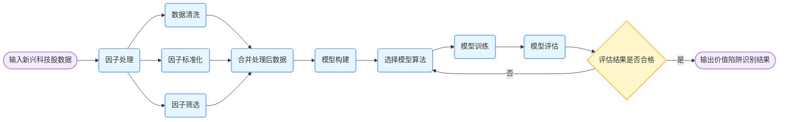

# 彼得林奇的"价值陷阱"在新兴科技股中的多因子识别模型

> 关键词：彼得林奇、价值陷阱、新兴科技股、多因子识别模型、金融科技

> 摘要：本文深入探讨了彼得林奇提出的“价值陷阱”概念在新兴科技股领域的应用，旨在构建多因子识别模型以准确识别新兴科技股中的价值陷阱。通过对背景的详细介绍，阐述核心概念及联系，剖析核心算法原理与具体操作步骤，引入数学模型和公式并举例说明，结合项目实战案例进行代码实现与解读，分析实际应用场景，推荐相关工具和资源，最后总结未来发展趋势与挑战，并提供常见问题解答和扩展阅读参考资料，为投资者和研究人员在新兴科技股投资中提供科学有效的决策依据。

## 1. 背景介绍 
### 1.1 目的和范围
在当今科技飞速发展的时代，新兴科技股市场呈现出巨大的发展潜力，但同时也伴随着高风险。彼得林奇提出的“价值陷阱”概念提醒投资者，某些看似具有投资价值的股票可能实际上是陷阱，会导致投资损失。本研究的目的在于构建一个多因子识别模型，专门用于新兴科技股，以帮助投资者准确识别其中的价值陷阱，降低投资风险，提高投资回报率。研究范围涵盖了各类新兴科技行业的股票，包括但不限于人工智能、大数据、云计算、生物科技等领域。

### 1.2 预期读者
本文的预期读者主要包括金融投资者，尤其是对新兴科技股感兴趣的个人和机构投资者，他们可以通过本文的研究成果优化投资决策。此外，金融分析师、研究人员以及相关领域的学者也可以从本文中获取有价值的信息，为进一步的研究和实践提供参考。同时，对于从事金融科技开发的技术人员，本文的多因子识别模型构建思路和代码实现也具有一定的借鉴意义。

### 1.3 文档结构概述
本文将按照以下结构展开：首先介绍背景信息，包括研究目的、预期读者和文档结构概述；接着阐述核心概念与联系，包括“价值陷阱”和新兴科技股的定义以及它们之间的关系，并给出相应的文本示意图和 Mermaid 流程图；然后详细讲解核心算法原理和具体操作步骤，使用 Python 源代码进行阐述；随后引入数学模型和公式，并通过具体例子进行说明；之后进行项目实战，包括开发环境搭建、源代码详细实现和代码解读；分析实际应用场景；推荐相关的工具和资源，包括学习资源、开发工具框架和相关论文著作；最后总结未来发展趋势与挑战，提供常见问题解答和扩展阅读参考资料。

### 1.4 术语表
#### 1.4.1 核心术语定义
- **价值陷阱**：指股票看似具有较低的估值，如低市盈率、低市净率等，吸引投资者购买，但实际上由于公司基本面存在问题，如行业前景不佳、财务造假、管理层能力不足等，导致股票价格长期低迷甚至下跌，使投资者陷入投资困境。
- **新兴科技股**：指处于新兴科技行业的上市公司股票，这些行业通常具有较高的创新性、成长性和不确定性，如人工智能、区块链、新能源等领域的股票。
- **多因子识别模型**：一种基于多个因子对股票进行分析和评估的模型，通过综合考虑多个因素来判断股票是否存在价值陷阱。

#### 1.4.2 相关概念解释
- **因子**：在多因子识别模型中，因子是指影响股票价格和价值的各种因素，如财务指标、市场指标、行业指标等。
- **金融科技**：指利用现代科技手段改造和创新金融业务和服务的领域，本文中的多因子识别模型就是金融科技在股票投资领域的应用。

#### 1.4.3 缩略词列表
- **PE**：市盈率（Price-to-Earnings Ratio），指股票价格除以每股收益的比率，用于衡量股票的估值水平。
- **PB**：市净率（Price-to-Book Ratio），指股票价格除以每股净资产的比率，用于衡量股票的账面价值与市场价值的关系。
- **ROE**：净资产收益率（Return on Equity），指净利润与平均股东权益的百分比，用于衡量公司运用自有资本的效率。

## 2. 核心概念与联系 

### 核心概念原理
#### 价值陷阱原理
价值陷阱的产生主要源于投资者对股票估值的误判。投资者往往只关注股票的低估值指标，如低 PE 和 PB，而忽视了公司的基本面问题。例如，一些传统行业的公司由于行业竞争激烈、技术落后等原因，业绩持续下滑，但股票价格可能由于惯性或市场情绪暂时保持在较低水平，吸引投资者买入。然而，随着公司基本面的进一步恶化，股票价格可能会继续下跌，使投资者陷入价值陷阱。

#### 新兴科技股特点
新兴科技股具有高创新性、高成长性和高不确定性的特点。这些公司通常处于技术创新的前沿，具有巨大的发展潜力，但同时也面临着技术风险、市场风险和竞争风险。例如，人工智能公司可能面临技术研发失败、市场需求不足、竞争对手推出更先进技术等风险。因此，新兴科技股的估值往往较为复杂，不能简单地依靠传统的估值指标进行判断。

#### 多因子识别模型原理
多因子识别模型通过综合考虑多个因子来评估新兴科技股是否存在价值陷阱。这些因子可以分为财务因子、市场因子和行业因子等。财务因子包括公司的盈利能力、偿债能力、运营能力等；市场因子包括股票的流动性、波动性等；行业因子包括行业的发展前景、竞争格局等。通过对这些因子的综合分析，可以更全面地了解新兴科技股的价值和风险。

### 架构的文本示意图
```plaintext
多因子识别模型
|-- 输入
|   |-- 新兴科技股数据
|       |-- 财务数据（PE、PB、ROE 等）
|       |-- 市场数据（成交量、换手率等）
|       |-- 行业数据（行业增长率、竞争格局等）
|-- 因子处理
|   |-- 数据清洗
|   |-- 因子标准化
|   |-- 因子筛选
|-- 模型构建
|   |-- 选择合适的模型算法（如逻辑回归、随机森林等）
|   |-- 模型训练
|   |-- 模型评估
|-- 输出
|   |-- 价值陷阱识别结果
```

### Mermaid 流程图


## 3. 核心算法原理 & 具体操作步骤 

### 核心算法原理
本多因子识别模型采用逻辑回归算法进行价值陷阱的识别。逻辑回归是一种广泛应用于分类问题的机器学习算法，它通过对输入的多个因子进行线性组合，然后通过逻辑函数将线性组合的结果映射到 0 到 1 之间的概率值，用于判断样本属于某个类别的可能性。

逻辑回归的数学表达式为：
$$P(Y = 1|X) = \frac{1}{1 + e^{-(w_0 + w_1x_1 + w_2x_2 + \cdots + w_nx_n)}}$$
其中，$P(Y = 1|X)$ 表示在输入特征 $X = (x_1, x_2, \cdots, x_n)$ 的条件下，样本属于正类（存在价值陷阱）的概率；$w_0, w_1, w_2, \cdots, w_n$ 是模型的参数；$e$ 是自然常数。

### 具体操作步骤
#### 步骤 1：数据收集
收集新兴科技股的财务数据、市场数据和行业数据。可以通过金融数据提供商，如东方财富、Wind 等获取相关数据。

#### 步骤 2：数据清洗
对收集到的数据进行清洗，去除缺失值、异常值和重复值。可以使用 Python 的 Pandas 库进行数据清洗。

```python
import pandas as pd

# 读取数据
data = pd.read_csv('emerging_tech_stocks.csv')

# 去除缺失值
data = data.dropna()

# 去除异常值（以 PE 为例，去除 PE 大于 100 的值）
data = data[data['PE'] <= 100]

# 去除重复值
data = data.drop_duplicates()
```

#### 步骤 3：因子标准化
对清洗后的数据进行标准化处理，使各个因子具有相同的尺度。可以使用 Python 的 Scikit-learn 库中的 StandardScaler 进行标准化处理。

```python
from sklearn.preprocessing import StandardScaler

# 选择需要标准化的因子
factors = ['PE', 'PB', 'ROE', 'Volume', 'Turnover']
X = data[factors]

# 标准化处理
scaler = StandardScaler()
X_scaled = scaler.fit_transform(X)
```

#### 步骤 4：因子筛选
使用特征选择方法筛选出对价值陷阱识别影响较大的因子。可以使用 Python 的 Scikit-learn 库中的 SelectKBest 进行因子筛选。

```python
from sklearn.feature_selection import SelectKBest, f_classif

# 选择目标变量
y = data['ValueTrap']

# 筛选前 3 个重要的因子
selector = SelectKBest(score_func=f_classif, k=3)
X_selected = selector.fit_transform(X_scaled, y)

# 获取筛选后的因子名称
selected_factors = [factors[i] for i in selector.get_support(indices=True)]
print("Selected factors:", selected_factors)
```

#### 步骤 5：模型训练
使用筛选后的因子数据进行逻辑回归模型的训练。可以使用 Python 的 Scikit-learn 库中的 LogisticRegression 进行模型训练。

```python
from sklearn.linear_model import LogisticRegression
from sklearn.model_selection import train_test_split

# 划分训练集和测试集
X_train, X_test, y_train, y_test = train_test_split(X_selected, y, test_size=0.2, random_state=42)

# 创建逻辑回归模型
model = LogisticRegression()

# 模型训练
model.fit(X_train, y_train)
```

#### 步骤 6：模型评估
使用测试集对训练好的模型进行评估，计算模型的准确率、召回率、F1 值等指标。可以使用 Python 的 Scikit-learn 库中的相关函数进行模型评估。

```python
from sklearn.metrics import accuracy_score, recall_score, f1_score

# 模型预测
y_pred = model.predict(X_test)

# 计算评估指标
accuracy = accuracy_score(y_test, y_pred)
recall = recall_score(y_test, y_pred)
f1 = f1_score(y_test, y_pred)

print("Accuracy:", accuracy)
print("Recall:", recall)
print("F1-score:", f1)
```

## 4. 数学模型和公式 & 详细讲解 & 举例说明 

### 逻辑回归模型的数学公式
逻辑回归模型的核心公式为：
$$P(Y = 1|X) = \frac{1}{1 + e^{-(w_0 + w_1x_1 + w_2x_2 + \cdots + w_nx_n)}}$$
其中，$P(Y = 1|X)$ 表示在输入特征 $X = (x_1, x_2, \cdots, x_n)$ 的条件下，样本属于正类（存在价值陷阱）的概率；$w_0, w_1, w_2, \cdots, w_n$ 是模型的参数；$e$ 是自然常数。

### 详细讲解
逻辑回归模型通过对输入的多个因子进行线性组合，得到一个线性得分 $z = w_0 + w_1x_1 + w_2x_2 + \cdots + w_nx_n$。然后，通过逻辑函数（也称为 sigmoid 函数）将线性得分映射到 0 到 1 之间的概率值。逻辑函数的表达式为：
$$\sigma(z) = \frac{1}{1 + e^{-z}}$$
逻辑函数具有以下特点：
- 当 $z$ 趋近于正无穷大时，$\sigma(z)$ 趋近于 1；
- 当 $z$ 趋近于负无穷大时，$\sigma(z)$ 趋近于 0；
- 当 $z = 0$ 时，$\sigma(z) = 0.5$。

因此，逻辑回归模型可以根据输入的特征计算出样本属于正类的概率，通过设定一个阈值（通常为 0.5），可以将概率值转换为分类结果。

### 举例说明
假设我们有一个简单的逻辑回归模型，只考虑两个因子 $x_1$ 和 $x_2$，模型的参数为 $w_0 = -1$，$w_1 = 0.5$，$w_2 = 0.3$。对于一个样本，其特征值为 $x_1 = 2$，$x_2 = 3$，则线性得分 $z$ 为：
$$z = -1 + 0.5 \times 2 + 0.3 \times 3 = -1 + 1 + 0.9 = 0.9$$
将 $z = 0.9$ 代入逻辑函数，得到样本属于正类的概率为：
$$P(Y = 1|X) = \frac{1}{1 + e^{-0.9}} \approx 0.71$$
如果设定阈值为 0.5，则该样本被分类为正类，即存在价值陷阱。

## 5. 项目实战：代码实际案例和详细解释说明 

### 5.1  开发环境搭建
#### 安装 Python
首先需要安装 Python 环境，建议使用 Python 3.7 及以上版本。可以从 Python 官方网站（https://www.python.org/downloads/）下载并安装。

#### 安装必要的库
使用 Python 的包管理工具 pip 安装必要的库，包括 Pandas、Scikit-learn 等。
```bash
pip install pandas scikit-learn
```

### 5.2  源代码详细实现和代码解读
以下是一个完整的多因子识别模型的代码实现：

```python
import pandas as pd
from sklearn.preprocessing import StandardScaler
from sklearn.feature_selection import SelectKBest, f_classif
from sklearn.linear_model import LogisticRegression
from sklearn.model_selection import train_test_split
from sklearn.metrics import accuracy_score, recall_score, f1_score

# 步骤 1：数据收集
# 假设数据已经存储在 CSV 文件中
data = pd.read_csv('emerging_tech_stocks.csv')

# 步骤 2：数据清洗
# 去除缺失值
data = data.dropna()

# 去除异常值（以 PE 为例，去除 PE 大于 100 的值）
data = data[data['PE'] <= 100]

# 去除重复值
data = data.drop_duplicates()

# 步骤 3：因子标准化
# 选择需要标准化的因子
factors = ['PE', 'PB', 'ROE', 'Volume', 'Turnover']
X = data[factors]

# 标准化处理
scaler = StandardScaler()
X_scaled = scaler.fit_transform(X)

# 步骤 4：因子筛选
# 选择目标变量
y = data['ValueTrap']

# 筛选前 3 个重要的因子
selector = SelectKBest(score_func=f_classif, k=3)
X_selected = selector.fit_transform(X_scaled, y)

# 获取筛选后的因子名称
selected_factors = [factors[i] for i in selector.get_support(indices=True)]
print("Selected factors:", selected_factors)

# 步骤 5：模型训练
# 划分训练集和测试集
X_train, X_test, y_train, y_test = train_test_split(X_selected, y, test_size=0.2, random_state=42)

# 创建逻辑回归模型
model = LogisticRegression()

# 模型训练
model.fit(X_train, y_train)

# 步骤 6：模型评估
# 模型预测
y_pred = model.predict(X_test)

# 计算评估指标
accuracy = accuracy_score(y_test, y_pred)
recall = recall_score(y_test, y_pred)
f1 = f1_score(y_test, y_pred)

print("Accuracy:", accuracy)
print("Recall:", recall)
print("F1-score:", f1)
```

### 5.3  代码解读与分析
- **数据收集**：使用 Pandas 的 `read_csv` 函数从 CSV 文件中读取新兴科技股的数据。
- **数据清洗**：使用 Pandas 的 `dropna` 函数去除缺失值，通过条件筛选去除异常值，使用 `drop_duplicates` 函数去除重复值。
- **因子标准化**：使用 Scikit-learn 的 `StandardScaler` 对因子数据进行标准化处理，使各个因子具有相同的尺度。
- **因子筛选**：使用 Scikit-learn 的 `SelectKBest` 和 `f_classif` 进行因子筛选，选择对价值陷阱识别影响较大的前 3 个因子。
- **模型训练**：使用 Scikit-learn 的 `LogisticRegression` 构建逻辑回归模型，并使用 `fit` 方法进行模型训练。
- **模型评估**：使用 Scikit-learn 的 `accuracy_score`、`recall_score` 和 `f1_score` 计算模型的准确率、召回率和 F1 值，评估模型的性能。

## 6. 实际应用场景 
### 投资者决策
对于个人和机构投资者来说，多因子识别模型可以帮助他们在投资新兴科技股时，更准确地识别价值陷阱，避免投资损失。投资者可以根据模型的输出结果，调整投资组合，选择更具投资价值的股票。

### 金融机构风险管理
金融机构在进行新兴科技股的投资和融资业务时，面临着较高的风险。多因子识别模型可以帮助金融机构评估股票的风险，制定合理的风险管理策略，降低潜在的损失。

### 金融研究和监管
研究人员可以使用多因子识别模型对新兴科技股市场进行深入研究，了解市场的运行规律和风险特征。监管机构可以利用该模型监测市场风险，制定相应的监管政策，维护市场的稳定和健康发展。

## 7. 工具和资源推荐
### 7.1 学习资源推荐
#### 7.1.1 书籍推荐
- 《金融科技：框架与实践》：全面介绍了金融科技的各个领域，包括多因子模型在金融领域的应用。
- 《Python 机器学习》：详细讲解了 Python 在机器学习中的应用，包括逻辑回归等算法的实现。
- 《聪明的投资者》：价值投资的经典著作，其中包含了对价值陷阱的深入分析。

#### 7.1.2 在线课程
- Coursera 上的“机器学习”课程：由斯坦福大学教授 Andrew Ng 授课，系统介绍了机器学习的基本原理和算法。
- edX 上的“金融科技基础”课程：涵盖了金融科技的核心概念和应用，包括多因子模型的构建和应用。

#### 7.1.3 技术博客和网站
- Medium：有许多金融科技和机器学习领域的优秀博客文章，提供了最新的研究成果和实践经验。
- Kaggle：一个数据科学竞赛平台，上面有许多关于金融数据和模型的案例和讨论。

### 7.2 开发工具框架推荐
#### 7.2.1 IDE和编辑器
- PyCharm：一款专业的 Python 集成开发环境，提供了丰富的代码编辑、调试和项目管理功能。
- Jupyter Notebook：一个交互式的开发环境，适合进行数据探索和模型实验。

#### 7.2.2 调试和性能分析工具
- PySnooper：一个简单易用的 Python 调试工具，可以自动记录函数的执行过程和变量的值。
- Scikit-learn 的 `cross_val_score` 函数：用于模型的交叉验证和性能评估。

#### 7.2.3 相关框架和库
- Pandas：用于数据处理和分析的 Python 库，提供了高效的数据结构和数据操作方法。
- Scikit-learn：一个强大的机器学习库，包含了各种机器学习算法和工具，如逻辑回归、决策树等。

### 7.3 相关论文著作推荐
#### 7.3.1 经典论文
- Fama, E. F., & French, K. R. (1992). The cross-section of expected stock returns. Journal of Finance, 47(2), 427-465. 提出了著名的 Fama-French 三因子模型，为多因子模型的发展奠定了基础。
- Sharpe, W. F. (1964). Capital asset prices: A theory of market equilibrium under conditions of risk. Journal of Finance, 19(3), 425-442. 提出了资本资产定价模型（CAPM），是现代金融理论的重要基石。

#### 7.3.2 最新研究成果
- Harvey, C. R., Liu, Y., & Zhu, H. (2016). … and the cross-section of expected returns. The Review of Financial Studies, 29(1), 5-68. 对多因子模型的因子选择和模型评估进行了深入研究。
- Gu, S., Kelly, B., & Xiu, D. (2020). Empirical asset pricing via machine learning. Review of Financial Studies, 33(5), 2223-2273. 将机器学习方法应用于资产定价和多因子模型的研究。

#### 7.3.3 应用案例分析
- 在一些金融科技公司的研究报告中，会有关于多因子模型在新兴科技股投资中的应用案例分析，可以通过这些案例了解模型的实际应用效果和存在的问题。

## 8. 总结：未来发展趋势与挑战
### 未来发展趋势
#### 融合更多数据源
未来的多因子识别模型将融合更多的数据源，如社交媒体数据、新闻舆情数据等，以更全面地了解新兴科技股的市场情况和公司基本面。

#### 引入深度学习算法
深度学习算法在处理复杂数据和模式识别方面具有强大的能力，未来的多因子识别模型可能会引入深度学习算法，如神经网络、卷积神经网络等，提高模型的准确性和预测能力。

#### 实现实时监测和预警
随着金融科技的发展，多因子识别模型将实现实时监测和预警功能，及时发现新兴科技股中的价值陷阱，为投资者和金融机构提供更及时的决策支持。

### 挑战
#### 数据质量和可用性
新兴科技行业的发展变化迅速，数据的质量和可用性可能会受到影响。例如，一些新兴科技公司可能没有完整的财务数据，或者数据存在偏差，这会影响模型的准确性。

#### 模型解释性
深度学习等复杂算法虽然可以提高模型的性能，但模型的解释性较差。在金融领域，模型的解释性非常重要，因为投资者和监管机构需要了解模型的决策依据。

#### 市场不确定性
新兴科技股市场具有较高的不确定性，市场环境和行业竞争格局可能会发生突然变化，这会增加模型的预测难度。

## 9. 附录：常见问题与解答
### 问题 1：多因子识别模型的准确率能达到多少？
模型的准确率受到多种因素的影响，如数据质量、因子选择、模型算法等。在实际应用中，模型的准确率可能在 70% - 90% 之间，但具体情况需要根据实际数据和模型进行评估。

### 问题 2：如何选择合适的因子？
可以通过特征选择方法，如相关性分析、方差分析等，筛选出与价值陷阱相关性较高的因子。同时，还可以结合金融理论和实践经验，选择具有经济意义的因子。

### 问题 3：模型是否可以应用于其他类型的股票？
多因子识别模型的基本原理可以应用于其他类型的股票，但需要根据不同类型股票的特点，调整因子的选择和模型的参数。

## 10. 扩展阅读 & 参考资料
### 扩展阅读
- 《金融大数据分析与应用》：深入介绍了金融大数据的分析方法和应用案例，对多因子识别模型的研究有一定的参考价值。
- 《量化投资：策略与技术》：介绍了量化投资的各种策略和技术，包括多因子模型的构建和应用。

### 参考资料
- 东方财富网：提供了丰富的金融数据和市场信息。
- Wind 资讯：专业的金融数据提供商，为金融研究和投资决策提供数据支持。
- Scikit-learn 官方文档：详细介绍了 Scikit-learn 库的各种功能和使用方法。