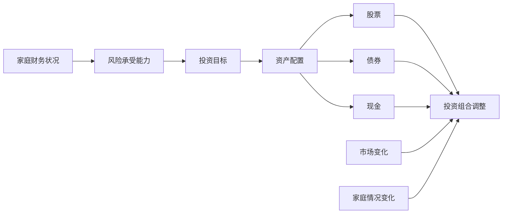

# 彼得林奇的“家庭投资组合”在后疫情时代的调整策略

> 关键词：彼得林奇、家庭投资组合、后疫情时代、调整策略、资产配置

> 摘要：本文聚焦于彼得林奇的“家庭投资组合”理论，深入探讨在后疫情时代该投资组合应如何进行调整。首先介绍了彼得林奇投资理念的背景，明确文章的目的、范围、预期读者等内容。接着阐述核心概念，包括家庭投资组合的原理与架构。详细讲解核心算法原理及操作步骤，并运用数学模型和公式进行说明。通过项目实战给出代码案例，分析代码实现及解读。探讨该投资组合在后疫情时代的实际应用场景，推荐相关的学习资源、开发工具和论文著作。最后总结未来发展趋势与挑战，解答常见问题并提供扩展阅读和参考资料，旨在为家庭投资者在后疫情时代优化投资组合提供全面的指导。

## 1. 背景介绍 
### 1.1 目的和范围
本文的目的在于探讨彼得林奇的“家庭投资组合”理论在后疫情时代的适用性以及相应的调整策略。彼得林奇是投资领域的传奇人物，他的投资理念以注重实地调研、关注日常生活中的投资机会等特点而闻名。家庭投资组合是家庭理财的重要组成部分，合理的投资组合能够帮助家庭实现资产的保值增值。后疫情时代，全球经济格局、市场环境等都发生了显著变化，因此有必要重新审视和调整家庭投资组合，以适应新的市场环境。

本文的范围主要涵盖彼得林奇“家庭投资组合”理论的核心概念、核心算法原理、数学模型以及在后疫情时代的实际应用场景和调整策略。同时，还将提供相关的学习资源、开发工具和论文著作推荐，为读者提供全面的投资知识和实践指导。

### 1.2 预期读者
本文的预期读者主要包括对投资感兴趣的普通家庭投资者、金融从业者以及相关领域的研究人员。对于普通家庭投资者来说，本文可以帮助他们了解彼得林奇的投资理念，掌握在后疫情时代调整家庭投资组合的方法，提高投资收益。金融从业者可以从本文中获取新的投资思路和方法，为客户提供更专业的投资建议。相关领域的研究人员可以通过本文对后疫情时代家庭投资组合的调整策略进行深入研究，推动投资领域的理论和实践发展。

### 1.3 文档结构概述
本文将按照以下结构进行组织：
1. **背景介绍**：介绍文章的目的、范围、预期读者和文档结构概述，以及相关术语的定义和解释。
2. **核心概念与联系**：阐述彼得林奇“家庭投资组合”的核心概念、原理和架构，并通过文本示意图和 Mermaid 流程图进行直观展示。
3. **核心算法原理 & 具体操作步骤**：详细讲解家庭投资组合的核心算法原理，并使用 Python 源代码进行具体操作步骤的阐述。
4. **数学模型和公式 & 详细讲解 & 举例说明**：介绍家庭投资组合的数学模型和公式，并通过具体例子进行详细讲解。
5. **项目实战：代码实际案例和详细解释说明**：提供一个实际的项目案例，包括开发环境搭建、源代码实现和代码解读。
6. **实际应用场景**：探讨彼得林奇“家庭投资组合”在后疫情时代的实际应用场景，分析不同场景下的调整策略。
7. **工具和资源推荐**：推荐相关的学习资源、开发工具和论文著作，帮助读者进一步深入学习和实践。
8. **总结：未来发展趋势与挑战**：总结后疫情时代家庭投资组合的未来发展趋势和面临的挑战。
9. **附录：常见问题与解答**：解答读者在阅读和实践过程中可能遇到的常见问题。
10. **扩展阅读 & 参考资料**：提供相关的扩展阅读材料和参考资料，方便读者进一步研究。

### 1.4 术语表
#### 1.4.1 核心术语定义
- **彼得林奇的“家庭投资组合”**：彼得林奇认为家庭投资组合应该根据家庭的财务状况、风险承受能力和投资目标进行合理配置，包括股票、债券、现金等不同资产类别。
- **后疫情时代**：指新冠疫情得到一定控制后，全球经济和社会逐渐恢复正常，但仍受到疫情影响的时期。
- **资产配置**：指投资者根据自身的风险承受能力和投资目标，将资金分配到不同的资产类别中，以实现资产的优化配置。
- **风险承受能力**：指投资者在面对投资风险时所能承受的最大损失程度。
- **投资目标**：指投资者进行投资的目的，如资产保值、增值、获取收益等。

#### 1.4.2 相关概念解释
- **股票**：是股份公司发行的所有权凭证，是股份公司为筹集资金而发行给各个股东作为持股凭证并借以取得股息和红利的一种有价证券。
- **债券**：是发行人向投资者发行的一种债务凭证，发行人承诺在一定时期内支付利息，并在到期时偿还本金。
- **现金**：指可以随时用于支付的货币资金，包括现金、银行存款等。
- **分散投资**：指将资金分散投资于不同的资产类别、行业和公司，以降低投资风险。

#### 1.4.3 缩略词列表
- **ETF**：交易型开放式指数基金（Exchange Traded Fund）
- **ROE**：净资产收益率（Return on Equity）
- **PE**：市盈率（Price Earnings Ratio）

## 2. 核心概念与联系 

### 2.1 彼得林奇“家庭投资组合”的核心概念
彼得林奇强调家庭投资组合应该基于家庭的实际情况进行个性化配置。他认为投资者不必成为金融专家，通过关注日常生活中的消费体验和行业动态，就能够发现有潜力的投资机会。家庭投资组合的核心目标是在控制风险的前提下，实现资产的长期增值。

家庭投资组合通常包括以下几类资产：
- **股票**：具有较高的潜在回报，但也伴随着较高的风险。彼得林奇主张投资者关注那些具有成长潜力的公司，尤其是那些在日常生活中能够接触到的公司，如消费品公司、科技公司等。
- **债券**：相对股票来说，债券的风险较低，收益较为稳定。债券可以作为投资组合的稳定器，降低整体风险。
- **现金**：现金具有高度的流动性，可以用于应对突发情况或抓住新的投资机会。

### 2.2 核心概念原理和架构的文本示意图
彼得林奇的“家庭投资组合”原理可以用以下文本示意图表示：

家庭财务状况（收入、资产、负债） -> 风险承受能力 -> 投资目标（短期、中期、长期） -> 资产配置（股票、债券、现金） -> 投资组合调整（根据市场变化和家庭情况）

### 2.3 Mermaid 流程图


该流程图展示了家庭投资组合的构建过程。首先，根据家庭财务状况确定风险承受能力，然后结合投资目标进行资产配置，包括股票、债券和现金。最后，根据市场变化和家庭情况的变化对投资组合进行调整。

## 3. 核心算法原理 & 具体操作步骤 

### 3.1 核心算法原理
家庭投资组合的核心算法原理是基于风险 - 收益平衡的原则，通过合理配置不同资产的比例，实现投资组合的最优风险 - 收益特征。常用的方法是现代投资组合理论中的均值 - 方差模型，该模型通过计算资产的预期收益率和方差（风险），以及资产之间的协方差，来确定最优的资产配置比例。

设投资组合中有 $n$ 种资产，第 $i$ 种资产的权重为 $w_i$，预期收益率为 $r_i$，方差为 $\sigma_i^2$，资产 $i$ 和资产 $j$ 之间的协方差为 $\sigma_{ij}$。投资组合的预期收益率 $R_p$ 和方差 $\sigma_p^2$ 可以通过以下公式计算：

$$R_p = \sum_{i = 1}^{n} w_i r_i$$

$$\sigma_p^2 = \sum_{i = 1}^{n} w_i^2 \sigma_i^2 + 2 \sum_{1 \leq i < j \leq n} w_i w_j \sigma_{ij}$$

在给定预期收益率的情况下，通过优化算法求解最小方差的资产配置比例，即为最优投资组合。

### 3.2 具体操作步骤
以下是使用 Python 实现家庭投资组合优化的具体操作步骤：

```python
import numpy as np
import pandas as pd
import matplotlib.pyplot as plt
from scipy.optimize import minimize

# 假设我们有 3 种资产，分别为股票、债券和现金
# 输入每种资产的预期收益率、方差和协方差矩阵
expected_returns = np.array([0.1, 0.05, 0.02])  # 预期收益率
cov_matrix = np.array([[0.2, 0.05, 0.01],
                       [0.05, 0.1, 0.005],
                       [0.01, 0.005, 0.001]])  # 协方差矩阵

# 定义目标函数：最小化投资组合的方差
def portfolio_variance(weights, cov_matrix):
    return np.dot(weights.T, np.dot(cov_matrix, weights))

# 定义约束条件：权重之和为 1
def weight_constraint(weights):
    return np.sum(weights) - 1

# 定义边界条件：权重范围在 0 到 1 之间
bounds = [(0, 1) for _ in range(len(expected_returns))]
constraints = [{'type': 'eq', 'fun': weight_constraint}]

# 初始权重猜测
initial_weights = np.ones(len(expected_returns)) / len(expected_returns)

# 求解最优投资组合
result = minimize(portfolio_variance, initial_weights, args=(cov_matrix,),
                  method='SLSQP', bounds=bounds, constraints=constraints)

# 输出最优权重
optimal_weights = result.x
print("最优权重：", optimal_weights)

# 计算最优投资组合的预期收益率和方差
optimal_return = np.dot(optimal_weights, expected_returns)
optimal_variance = portfolio_variance(optimal_weights, cov_matrix)
print("最优投资组合的预期收益率：", optimal_return)
print("最优投资组合的方差：", optimal_variance)

# 绘制有效前沿
num_portfolios = 1000
portfolio_returns = []
portfolio_volatilities = []
for _ in range(num_portfolios):
    weights = np.random.random(len(expected_returns))
    weights /= np.sum(weights)
    portfolio_return = np.dot(weights, expected_returns)
    portfolio_volatility = np.sqrt(portfolio_variance(weights, cov_matrix))
    portfolio_returns.append(portfolio_return)
    portfolio_volatilities.append(portfolio_volatility)

plt.figure(figsize=(10, 6))
plt.scatter(portfolio_volatilities, portfolio_returns, c='b', marker='o', alpha=0.5)
plt.scatter(np.sqrt(optimal_variance), optimal_return, c='r', marker='*', s=200, label='最优投资组合')
plt.xlabel('波动率')
plt.ylabel('预期收益率')
plt.title('有效前沿')
plt.legend()
plt.show()
```

### 3.3 代码解释
1. **输入数据**：定义了三种资产的预期收益率和协方差矩阵。
2. **目标函数**：定义了投资组合的方差作为目标函数，通过最小化方差来寻找最优投资组合。
3. **约束条件**：权重之和必须为 1，确保投资组合使用了全部资金。
4. **边界条件**：权重范围在 0 到 1 之间，避免卖空。
5. **优化求解**：使用 `scipy.optimize.minimize` 函数求解最优投资组合的权重。
6. **结果输出**：输出最优权重、最优投资组合的预期收益率和方差，并绘制有效前沿图。

## 4. 数学模型和公式 & 详细讲解 & 举例说明 

### 4.1 均值 - 方差模型
均值 - 方差模型是现代投资组合理论的核心，由哈里·马科维茨（Harry Markowitz）提出。该模型的基本思想是在给定预期收益率的情况下，通过优化资产配置比例，使投资组合的方差最小；或者在给定方差的情况下，使投资组合的预期收益率最大。

#### 4.1.1 数学公式
设投资组合中有 $n$ 种资产，第 $i$ 种资产的权重为 $w_i$，预期收益率为 $r_i$，方差为 $\sigma_i^2$，资产 $i$ 和资产 $j$ 之间的协方差为 $\sigma_{ij}$。投资组合的预期收益率 $R_p$ 和方差 $\sigma_p^2$ 可以通过以下公式计算：

$$R_p = \sum_{i = 1}^{n} w_i r_i$$

$$\sigma_p^2 = \sum_{i = 1}^{n} w_i^2 \sigma_i^2 + 2 \sum_{1 \leq i < j \leq n} w_i w_j \sigma_{ij}$$

#### 4.1.2 详细讲解
- **预期收益率**：投资组合的预期收益率是各种资产预期收益率的加权平均值，权重为每种资产在投资组合中的比例。预期收益率反映了投资组合的平均收益水平。
- **方差**：方差衡量了投资组合的风险程度。方差越大，投资组合的收益波动越大，风险越高。方差的计算考虑了每种资产的方差以及资产之间的协方差。协方差反映了两种资产收益率之间的相关性，正协方差表示两种资产的收益率倾向于同向变动，负协方差表示两种资产的收益率倾向于反向变动。

#### 4.1.3 举例说明
假设我们有两种资产：股票和债券。股票的预期收益率为 $15\%$，方差为 $0.2$；债券的预期收益率为 $5\%$，方差为 $0.05$；股票和债券之间的协方差为 $0.02$。我们将资金的 $60\%$ 投资于股票，$40\%$ 投资于债券。

则投资组合的预期收益率为：

$$R_p = 0.6 \times 0.15 + 0.4 \times 0.05 = 0.11 = 11\%$$

投资组合的方差为：

$$\sigma_p^2 = 0.6^2 \times 0.2 + 0.4^2 \times 0.05 + 2 \times 0.6 \times 0.4 \times 0.02 = 0.072 + 0.008 + 0.0096 = 0.0896$$

### 4.2 资本资产定价模型（CAPM）
资本资产定价模型（CAPM）是另一个重要的投资组合理论模型，用于描述资产的预期收益率与市场风险之间的关系。

#### 4.2.1 数学公式
$$R_i = R_f + \beta_i (R_m - R_f)$$

其中，$R_i$ 是资产 $i$ 的预期收益率，$R_f$ 是无风险收益率，$\beta_i$ 是资产 $i$ 的贝塔系数，$R_m$ 是市场组合的预期收益率。

#### 4.2.2 详细讲解
- **无风险收益率**：通常用国债收益率来表示，代表了投资者在无风险情况下的收益率。
- **贝塔系数**：衡量了资产 $i$ 的收益率相对于市场组合收益率的波动程度。$\beta_i > 1$ 表示资产 $i$ 的收益率波动比市场组合大，风险较高；$\beta_i < 1$ 表示资产 $i$ 的收益率波动比市场组合小，风险较低。
- **市场风险溢价**：$R_m - R_f$ 表示市场组合的预期收益率与无风险收益率之间的差值，反映了投资者承担市场风险所获得的额外收益。

#### 4.2.3 举例说明
假设无风险收益率为 $3\%$，市场组合的预期收益率为 $10\%$，某股票的贝塔系数为 $1.2$。则该股票的预期收益率为：

$$R_i = 0.03 + 1.2 \times (0.1 - 0.03) = 0.03 + 0.084 = 0.114 = 11.4\%$$

## 5. 项目实战：代码实际案例和详细解释说明 

### 5.1  开发环境搭建
在进行家庭投资组合优化的项目实战之前，需要搭建相应的开发环境。以下是具体步骤：

#### 5.1.1 安装 Python
可以从 Python 官方网站（https://www.python.org/downloads/）下载并安装 Python 3.x 版本。

#### 5.1.2 安装必要的库
使用 `pip` 命令安装以下必要的库：
```sh
pip install numpy pandas matplotlib scipy
```

#### 5.1.3 选择开发工具
可以选择使用 Jupyter Notebook、PyCharm 等开发工具进行代码编写和调试。

### 5.2  源代码详细实现和代码解读
以下是一个完整的家庭投资组合优化的代码示例，包括数据获取、数据处理、投资组合优化和结果可视化：

```python
import numpy as np
import pandas as pd
import matplotlib.pyplot as plt
from scipy.optimize import minimize
import yfinance as yf

# 定义要分析的资产
tickers = ['AAPL', 'MSFT', 'JNJ', 'PG', 'V']  # 苹果、微软、强生、宝洁、Visa

# 获取历史数据
start_date = '2020-01-01'
end_date = '2023-01-01'
data = yf.download(tickers, start=start_date, end=end_date)['AdjClose']

# 计算每日收益率
returns = data.pct_change().dropna()

# 计算预期收益率和协方差矩阵
expected_returns = returns.mean() * 252  # 年化预期收益率
cov_matrix = returns.cov() * 252  # 年化协方差矩阵

# 定义目标函数：最小化投资组合的方差
def portfolio_variance(weights, cov_matrix):
    return np.dot(weights.T, np.dot(cov_matrix, weights))

# 定义约束条件：权重之和为 1
def weight_constraint(weights):
    return np.sum(weights) - 1

# 定义边界条件：权重范围在 0 到 1 之间
bounds = [(0, 1) for _ in range(len(expected_returns))]
constraints = [{'type': 'eq', 'fun': weight_constraint}]

# 初始权重猜测
initial_weights = np.ones(len(expected_returns)) / len(expected_returns)

# 求解最优投资组合
result = minimize(portfolio_variance, initial_weights, args=(cov_matrix,),
                  method='SLSQP', bounds=bounds, constraints=constraints)

# 输出最优权重
optimal_weights = result.x
print("最优权重：", optimal_weights)

# 计算最优投资组合的预期收益率和方差
optimal_return = np.dot(optimal_weights, expected_returns)
optimal_variance = portfolio_variance(optimal_weights, cov_matrix)
print("最优投资组合的预期收益率：", optimal_return)
print("最优投资组合的方差：", optimal_variance)

# 绘制有效前沿
num_portfolios = 1000
portfolio_returns = []
portfolio_volatilities = []
for _ in range(num_portfolios):
    weights = np.random.random(len(expected_returns))
    weights /= np.sum(weights)
    portfolio_return = np.dot(weights, expected_returns)
    portfolio_volatility = np.sqrt(portfolio_variance(weights, cov_matrix))
    portfolio_returns.append(portfolio_return)
    portfolio_volatilities.append(portfolio_volatility)

plt.figure(figsize=(10, 6))
plt.scatter(portfolio_volatilities, portfolio_returns, c='b', marker='o', alpha=0.5)
plt.scatter(np.sqrt(optimal_variance), optimal_return, c='r', marker='*', s=200, label='最优投资组合')
plt.xlabel('波动率')
plt.ylabel('预期收益率')
plt.title('有效前沿')
plt.legend()
plt.show()
```

### 5.3  代码解读与分析
1. **数据获取**：使用 `yfinance` 库从雅虎财经获取指定股票的历史数据。
2. **数据处理**：计算每日收益率，并进一步计算年化预期收益率和年化协方差矩阵。
3. **目标函数**：定义投资组合的方差作为目标函数，通过最小化方差来寻找最优投资组合。
4. **约束条件和边界条件**：权重之和必须为 1，权重范围在 0 到 1 之间。
5. **优化求解**：使用 `scipy.optimize.minimize` 函数求解最优投资组合的权重。
6. **结果输出**：输出最优权重、最优投资组合的预期收益率和方差，并绘制有效前沿图。

通过这个项目实战，我们可以看到如何使用 Python 实现家庭投资组合的优化，并根据历史数据找到最优的资产配置比例。

## 6. 实际应用场景 
### 6.1 后疫情时代经济环境分析
后疫情时代，全球经济呈现出复杂多变的态势。一方面，一些行业如科技、医疗等在疫情期间得到了快速发展，具有较强的增长潜力；另一方面，一些传统行业如旅游、航空等受到了较大的冲击，恢复需要一定的时间。同时，全球货币政策和财政政策的调整也对市场产生了重要影响。

### 6.2 彼得林奇“家庭投资组合”在后疫情时代的调整策略
#### 6.2.1 增加科技和医疗板块的配置
科技和医疗行业在疫情期间展现出了强大的韧性和发展潜力。科技行业的数字化转型加速，远程办公、在线教育、电子商务等领域需求旺盛；医疗行业则在疫苗研发、疫情防控等方面发挥了重要作用。因此，在后疫情时代，可以适当增加科技和医疗板块的股票配置，以分享行业发展的红利。

#### 6.2.2 关注消费升级和新兴消费领域
随着经济的逐渐恢复和居民收入水平的提高，消费升级和新兴消费领域将迎来新的发展机遇。例如，高端消费品、新能源汽车、智能家居等领域的需求有望持续增长。投资者可以关注这些领域的优质企业，将其纳入家庭投资组合。

#### 6.2.3 适当增加债券和现金的比例
后疫情时代，市场不确定性仍然较高。为了降低投资组合的风险，可以适当增加债券和现金的比例。债券可以提供稳定的收益，现金则可以增强投资组合的流动性，以便在市场出现机会时能够及时调整投资组合。

#### 6.2.4 分散投资降低风险
在后疫情时代，市场波动可能会加剧。为了降低投资组合的风险，应该遵循分散投资的原则，将资金分散投资于不同的资产类别、行业和公司。避免过度集中投资于某一个行业或某几只股票。

### 6.3 不同家庭情况的投资组合调整
#### 6.3.1 年轻家庭
年轻家庭通常具有较长的投资期限和较高的风险承受能力。在后疫情时代，年轻家庭可以适当增加股票的配置比例，尤其是科技和新兴消费领域的股票，以追求较高的投资回报。同时，可以配置一定比例的债券和现金，以应对突发情况。

#### 6.3.2 中年家庭
中年家庭的财务状况相对稳定，但也需要考虑子女教育、养老等问题。在后疫情时代，中年家庭可以适当降低股票的配置比例，增加债券和现金的比例，以保证投资组合的稳定性。同时，可以关注一些分红稳定的蓝筹股，以获取稳定的现金流。

#### 6.3.3 老年家庭
老年家庭的风险承受能力较低，投资目标主要是资产保值和稳定的现金流。在后疫情时代，老年家庭应该以债券和现金为主，适当配置一些大盘蓝筹股，以获取一定的收益。避免投资高风险的股票和金融衍生品。

## 7. 工具和资源推荐
### 7.1 学习资源推荐
#### 7.1.1 书籍推荐
- 《彼得·林奇的成功投资》：彼得·林奇的经典著作，详细介绍了他的投资理念和方法，对于家庭投资者具有很高的参考价值。
- 《聪明的投资者》：本杰明·格雷厄姆的经典著作，被誉为投资领域的“圣经”，阐述了价值投资的基本原理和方法。
- 《漫步华尔街》：伯顿·马尔基尔的著作，介绍了各种投资理论和方法，帮助读者了解投资市场的本质和规律。

#### 7.1.2 在线课程
- Coursera 上的“投资学原理”：由知名大学教授授课，系统介绍投资学的基本原理和方法。
- edX 上的“金融市场”：提供了金融市场的全面知识，包括股票、债券、期货等市场的运作机制。
- 网易云课堂上的“家庭理财规划”：专门针对家庭投资者，介绍家庭理财的规划方法和投资策略。

#### 7.1.3 技术博客和网站
- 雪球网：国内知名的投资社区，提供股票、基金等投资产品的分析和讨论，投资者可以在这里交流投资经验和分享投资观点。
- 东方财富网：提供全面的金融信息和数据，包括股票行情、基金净值、财经新闻等，是投资者获取信息的重要渠道。
- Seeking Alpha：国外知名的投资博客网站，汇聚了众多投资专家和分析师的观点和研究报告，对于了解国际市场和投资机会具有重要参考价值。

### 7.2 开发工具框架推荐
#### 7.2.1 IDE和编辑器
- PyCharm：专业的 Python 集成开发环境，具有强大的代码编辑、调试和分析功能，适合开发复杂的投资分析程序。
- Jupyter Notebook：交互式的开发环境，支持代码、文本、图表等多种形式的展示，适合进行数据探索和分析。
- Visual Studio Code：轻量级的代码编辑器，支持多种编程语言和插件扩展，具有良好的用户体验。

#### 7.2.2 调试和性能分析工具
- PySnooper：简单易用的 Python 调试工具，可以自动记录函数的调用过程和变量的值，方便调试代码。
- cProfile：Python 自带的性能分析工具，可以分析代码的运行时间和函数调用次数，帮助优化代码性能。
- Memory Profiler：用于分析 Python 代码的内存使用情况，找出内存泄漏和高内存占用的代码段。

#### 7.2.3 相关框架和库
- Pandas：强大的数据处理和分析库，提供了 DataFrame 和 Series 等数据结构，方便进行数据清洗、转换和分析。
- NumPy：用于科学计算的基础库，提供了高效的数组操作和数学函数，是许多数据分析和机器学习库的基础。
- Matplotlib：常用的绘图库，可以绘制各种类型的图表，如折线图、柱状图、散点图等，用于数据可视化。
- Scipy：科学计算和优化库，提供了许多优化算法和统计函数，用于解决投资组合优化等问题。

### 7.3 相关论文著作推荐
#### 7.3.1 经典论文
- Markowitz, H. M. (1952). Portfolio Selection. The Journal of Finance, 7(1), 77 - 91. 这篇论文提出了现代投资组合理论的均值 - 方差模型，奠定了投资组合理论的基础。
- Sharpe, W. F. (1964). Capital Asset Prices: A Theory of Market Equilibrium Under Conditions of Risk. The Journal of Finance, 19(3), 425 - 442. 该论文提出了资本资产定价模型（CAPM），用于描述资产的预期收益率与市场风险之间的关系。

#### 7.3.2 最新研究成果
- 在学术数据库如 IEEE Xplore、ACM Digital Library、ScienceDirect 等上搜索关于后疫情时代家庭投资组合调整策略的最新研究论文，了解该领域的前沿动态和研究成果。

#### 7.3.3 应用案例分析
- 一些金融机构和研究机构会发布关于家庭投资组合的应用案例分析报告，可以通过它们的官方网站或专业财经媒体获取这些报告，学习实际案例中的投资策略和方法。

## 8. 总结：未来发展趋势与挑战
### 8.1 未来发展趋势
#### 8.1.1 数字化投资趋势
随着科技的不断发展，数字化投资将成为未来的发展趋势。投资者可以通过在线平台进行投资交易，使用智能投顾工具进行投资组合的优化和管理。同时，区块链技术的应用也将为投资领域带来新的变革，提高投资的透明度和安全性。

#### 8.1.2 可持续投资兴起
后疫情时代，人们对环境保护、社会责任和公司治理（ESG）的关注度不断提高。可持续投资将成为未来投资的重要方向，投资者会更加倾向于投资那些具有良好 ESG 表现的公司。

#### 8.1.3 全球资产配置多元化
随着全球经济一体化的发展，投资者将更加注重全球资产配置的多元化。通过投资不同国家和地区的资产，可以降低投资组合的风险，提高投资回报。

### 8.2 挑战
#### 8.2.1 市场不确定性增加
后疫情时代，全球经济和政治环境仍然存在较大的不确定性。贸易摩擦、地缘政治冲突、货币政策调整等因素都可能导致市场波动加剧，增加投资的难度和风险。

#### 8.2.2 技术变革带来的挑战
数字化投资和智能投顾等技术的发展，虽然为投资者带来了便利，但也对投资者的技术素养和信息安全提出了更高的要求。投资者需要不断学习和掌握新的技术和知识，以适应技术变革带来的挑战。

#### 8.2.3 可持续投资标准不统一
目前，可持续投资的标准和评价体系还不够统一，不同机构和投资者对 ESG 因素的理解和衡量方法存在差异。这给投资者进行可持续投资带来了一定的困难。

## 9. 附录：常见问题与解答
### 9.1 如何确定家庭的风险承受能力？
确定家庭的风险承受能力需要综合考虑多个因素，包括家庭的财务状况（如收入、资产、负债）、投资目标（短期、中期、长期）、投资经验和心理承受能力等。可以通过一些风险承受能力评估问卷来初步了解家庭的风险承受能力，也可以咨询专业的金融顾问。

### 9.2 投资组合多久调整一次比较合适？
投资组合的调整频率没有固定的标准，需要根据市场情况和家庭情况的变化来决定。一般来说，可以定期（如每年或每半年）对投资组合进行评估和调整。如果市场出现重大变化或家庭情况发生了较大改变（如收入增加、家庭成员变化等），则需要及时调整投资组合。

### 9.3 如何选择适合的投资产品？
选择适合的投资产品需要考虑多个因素，包括投资目标、风险承受能力、投资期限等。如果投资目标是短期保值和流动性，可以选择货币基金、短期债券等产品；如果投资目标是长期增值，可以选择股票、股票型基金等产品。同时，要关注投资产品的历史业绩、管理团队、费用等因素。

### 9.4 智能投顾工具可靠吗？
智能投顾工具是基于算法和模型为投资者提供投资建议和组合管理服务的工具。一般来说，正规的智能投顾工具具有一定的可靠性，但不能完全替代投资者的自主决策。投资者在使用智能投顾工具时，要了解其算法和模型的原理，结合自己的实际情况进行判断和决策。

## 10. 扩展阅读 & 参考资料
### 10.1 扩展阅读
- 《金融炼金术》：乔治·索罗斯的著作，介绍了他的投资哲学和金融市场的运行规律。
- 《穷查理宝典》：收录了查理·芒格的演讲和文章，阐述了他的投资理念和人生智慧。
- 《投资中最简单的事》：邱国鹭的著作，分享了他在投资领域的经验和心得，对于家庭投资者具有一定的启示作用。

### 10.2 参考资料
- 彼得·林奇相关的官方网站和访谈记录，获取他的最新投资观点和经验分享。
- 金融机构和研究机构发布的投资研究报告和市场分析报告，了解市场动态和投资趋势。
- 学术期刊和会议论文，获取投资领域的最新研究成果和理论进展。