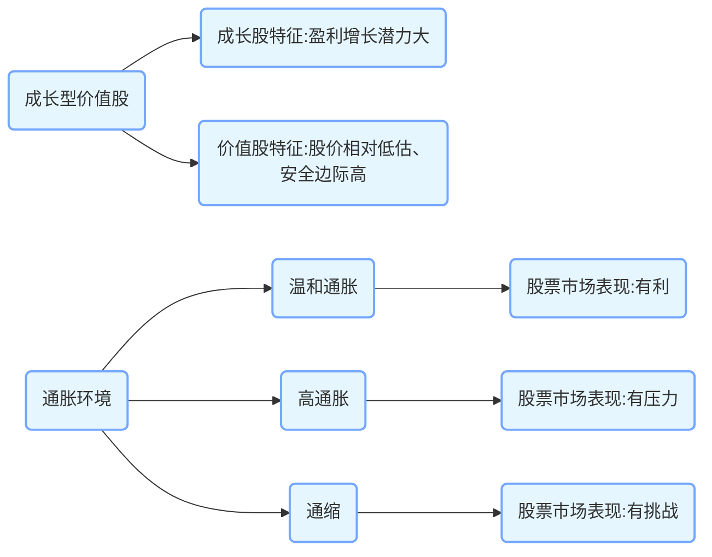

# 彼得林奇的"成长型价值股"在不同通胀环境下的表现分析

> 关键词：彼得林奇、成长型价值股、通胀环境、股票表现、投资策略

> 摘要：本文旨在深入分析彼得林奇所倡导的“成长型价值股”在不同通胀环境下的表现。通过对成长型价值股的核心概念、相关算法原理、数学模型等多方面的探讨，结合实际案例和应用场景，全面剖析其在通胀环境中的特性。同时，为投资者提供在不同通胀阶段投资成长型价值股的参考依据，帮助投资者更好地理解和把握市场规律，制定合理的投资策略。

## 1. 背景介绍 
### 1.1 目的和范围
本研究的目的在于系统地探究彼得林奇的“成长型价值股”在不同通胀环境下的表现，为投资者在复杂的经济环境中提供决策参考。研究范围涵盖了不同程度的通胀环境，包括温和通胀、高通胀以及通缩等情况，分析成长型价值股在这些环境中的股价走势、盈利状况以及估值变化等方面的表现。

### 1.2 预期读者
本文预期读者包括专业投资者、股票市场爱好者、金融从业者以及对投资策略和经济环境分析感兴趣的人群。无论是经验丰富的投资者希望优化投资组合，还是初学者想要了解投资领域的相关知识，都能从本文中获得有价值的信息。

### 1.3 文档结构概述
本文将首先介绍相关的核心概念和术语，为后续的分析奠定基础。接着，阐述成长型价值股的核心算法原理和具体操作步骤，并运用数学模型和公式进行详细讲解和举例说明。然后通过项目实战，展示实际案例并对代码进行解读分析。之后探讨成长型价值股在不同通胀环境下的实际应用场景。再推荐相关的学习资源、开发工具框架以及论文著作。最后总结未来发展趋势与挑战，并提供常见问题与解答以及扩展阅读和参考资料。

### 1.4 术语表
#### 1.4.1 核心术语定义
- **成长型价值股**：彼得林奇所定义的一类股票，这类股票既具备成长股的特征，即公司具有较高的盈利增长潜力，又具有价值股的特点，如股价相对其内在价值被低估，存在一定的安全边际。
- **通胀**：指在货币流通条件下，因货币供给大于货币实际需求，也即现实购买力大于产出供给，导致货币贬值，而引起的一段时间内物价持续而普遍地上涨现象。

#### 1.4.2 相关概念解释
- **温和通胀**：一般指通货膨胀率维持在相对较低且稳定的水平，通常在 2% - 5% 之间。在这种环境下，经济通常保持适度增长，物价的缓慢上升对消费者和企业的影响相对较小。
- **高通胀**：通货膨胀率较高，一般超过 5%，甚至可能达到两位数。高通胀会导致物价快速上涨，对经济和社会产生多方面的影响，如增加企业成本、降低消费者购买力等。
- **通缩**：与通胀相反，是指物价水平持续下降的经济现象。通缩可能导致企业利润下降、失业率上升等问题。

#### 1.4.3 缩略词列表
- **CPI**：消费者物价指数（Consumer Price Index），是衡量通货膨胀水平的常用指标之一，反映一定时期内居民购买的生活消费品和服务价格水平的变动情况。

## 2. 核心概念与联系 
### 2.1 彼得林奇的成长型价值股概念
彼得林奇认为，成长型价值股是那些被市场低估，但同时具有强大成长潜力的公司股票。这些公司通常具有独特的竞争优势，如创新的产品或服务、优秀的管理团队、广阔的市场空间等。与传统的成长股相比，成长型价值股不仅关注公司的增长速度，还注重其估值的合理性。与价值股相比，成长型价值股更强调公司的成长潜力，而不仅仅是低估值。

### 2.2 通胀环境与股票市场的联系
通胀环境对股票市场有着重要的影响。在温和通胀环境下，企业的销售收入和利润可能会随着物价的上涨而增加，这对股票市场通常是有利的。然而，高通胀可能会导致企业成本上升、利率提高，从而对股票市场产生负面影响。通缩则可能导致企业盈利下降、消费者信心不足，同样会对股票市场造成压力。

### 2.3 核心概念原理和架构的文本示意图
```plaintext
           成长型价值股
         /               \
    成长股特征          价值股特征
  盈利增长潜力大        股价相对低估
                        安全边际高

         通胀环境
         /   |   \
温和通胀  高通胀  通缩

  股票市场表现
  /   |   \
有利  有压力  有挑战
```

### 2.4 Mermaid 流程图


## 3. 核心算法原理 & 具体操作步骤 
### 3.1 成长型价值股的筛选算法原理
成长型价值股的筛选通常基于多个财务指标和基本面因素。以下是一个简化的筛选算法原理，使用 Python 代码实现：

```python
import pandas as pd

# 假设我们有一个包含股票数据的 DataFrame，包含以下列：
# 'symbol'（股票代码）, 'eps_growth'（每股收益增长率）, 'pe_ratio'（市盈率）, 'pb_ratio'（市净率）

def screen_growth_value_stocks(data, min_eps_growth=0.1, max_pe_ratio=20, max_pb_ratio=3):
    """
    筛选成长型价值股的函数
    :param data: 包含股票数据的 DataFrame
    :param min_eps_growth: 最小每股收益增长率
    :param max_pe_ratio: 最大市盈率
    :param max_pb_ratio: 最大市净率
    :return: 筛选后的成长型价值股 DataFrame
    """
    # 筛选出每股收益增长率大于等于最小增长率的股票
    growth_stocks = data[data['eps_growth'] >= min_eps_growth]
    # 进一步筛选出市盈率小于等于最大市盈率且市净率小于等于最大市净率的股票
    growth_value_stocks = growth_stocks[(growth_stocks['pe_ratio'] <= max_pe_ratio) & (growth_stocks['pb_ratio'] <= max_pb_ratio)]
    return growth_value_stocks

# 示例数据
data = pd.DataFrame({
    'symbol': ['AAPL', 'GOOG', 'MSFT', 'AMZN'],
    'eps_growth': [0.15, 0.2, 0.08, 0.25],
    'pe_ratio': [18, 22, 15, 30],
    'pb_ratio': [3, 4, 2, 5]
})

# 调用筛选函数
result = screen_growth_value_stocks(data)
print(result)
```

### 3.2 具体操作步骤
1. **数据收集**：收集股票的相关财务数据，包括每股收益增长率、市盈率、市净率等。这些数据可以从金融数据提供商、证券交易所网站或专业的金融数据库中获取。
2. **数据预处理**：对收集到的数据进行清洗和整理，处理缺失值、异常值等问题，确保数据的准确性和一致性。
3. **参数设定**：根据市场情况和投资目标，设定筛选成长型价值股的参数，如最小每股收益增长率、最大市盈率和最大市净率等。
4. **筛选股票**：使用上述筛选算法对股票数据进行筛选，得到符合条件的成长型价值股。
5. **进一步分析**：对筛选出的股票进行进一步的基本面分析，如研究公司的业务模式、竞争优势、管理团队等，以确定其投资价值。

## 4. 数学模型和公式 & 详细讲解 & 举例说明 
### 4.1 市盈率（PE）模型
市盈率是衡量股票估值的常用指标之一，其计算公式为：
$$PE = \frac{股价}{每股收益}$$
其中，股价是指股票的当前市场价格，每股收益是指公司每股股票的盈利。市盈率反映了投资者为获得公司每一元盈利所愿意支付的价格。一般来说，较低的市盈率可能意味着股票被低估，具有投资价值。

**举例说明**：假设某股票的当前股价为 50 元，每股收益为 2 元，则该股票的市盈率为：
$$PE = \frac{50}{2} = 25$$

### 4.2 市净率（PB）模型
市净率也是衡量股票估值的重要指标，其计算公式为：
$$PB = \frac{股价}{每股净资产}$$
其中，每股净资产是指公司每股股票所对应的净资产价值。市净率反映了股票价格相对于公司净资产的倍数。较低的市净率可能表示股票被低估。

**举例说明**：假设某股票的当前股价为 30 元，每股净资产为 10 元，则该股票的市净率为：
$$PB = \frac{30}{10} = 3$$

### 4.3 盈利增长率模型
盈利增长率是衡量公司成长潜力的重要指标，其计算公式为：
$$盈利增长率 = \frac{本期盈利 - 上期盈利}{上期盈利} \times 100\%$$

**举例说明**：假设某公司上期盈利为 1000 万元，本期盈利为 1200 万元，则该公司的盈利增长率为：
$$盈利增长率 = \frac{1200 - 1000}{1000} \times 100\% = 20\%$$

### 4.4 综合估值模型
在筛选成长型价值股时，可以综合考虑市盈率、市净率和盈利增长率等指标，构建一个综合估值模型。例如，可以使用以下公式计算综合估值得分：
$$综合估值得分 = \alpha \times \frac{1}{PE} + \beta \times \frac{1}{PB} + \gamma \times 盈利增长率$$
其中，$\alpha$、$\beta$ 和 $\gamma$ 是权重系数，根据投资者的偏好和市场情况进行调整。

**举例说明**：假设某股票的市盈率为 20，市净率为 3，盈利增长率为 15%，权重系数 $\alpha = 0.4$，$\beta = 0.3$，$\gamma = 0.3$，则该股票的综合估值得分计算如下：
$$综合估值得分 = 0.4 \times \frac{1}{20} + 0.3 \times \frac{1}{3} + 0.3 \times 0.15 = 0.02 + 0.1 + 0.045 = 0.165$$

## 5. 项目实战：代码实际案例和详细解释说明 
### 5.1  开发环境搭建
1. **安装 Python**：可以从 Python 官方网站（https://www.python.org/downloads/）下载并安装最新版本的 Python。
2. **安装必要的库**：使用以下命令安装所需的库：
```sh
pip install pandas yfinance matplotlib
```
其中，`pandas` 用于数据处理，`yfinance` 用于获取股票数据，`matplotlib` 用于数据可视化。

### 5.2  源代码详细实现和代码解读
```python
import yfinance as yf
import pandas as pd
import matplotlib.pyplot as plt

# 定义股票列表
stocks = ['AAPL', 'GOOG', 'MSFT', 'AMZN']

# 获取股票数据
data = yf.download(stocks, start='2010-01-01', end='2023-12-31')

# 提取收盘价数据
close_prices = data['Close']

# 计算每日收益率
daily_returns = close_prices.pct_change()

# 计算累计收益率
cumulative_returns = (1 + daily_returns).cumprod()

# 绘制累计收益率曲线
cumulative_returns.plot(figsize=(12, 8))
plt.title('Cumulative Returns of Selected Stocks')
plt.xlabel('Date')
plt.ylabel('Cumulative Returns')
plt.show()

# 筛选成长型价值股
# 假设我们可以通过 yfinance 获取每股收益增长率、市盈率和市净率等数据
# 这里只是示例，实际中可能需要更复杂的处理
def get_stock_fundamentals(symbol):
    stock = yf.Ticker(symbol)
    info = stock.info
    eps_growth = info.get('earningsQuarterlyGrowth', 0)
    pe_ratio = info.get('trailingPE', 0)
    pb_ratio = info.get('priceToBook', 0)
    return eps_growth, pe_ratio, pb_ratio

fundamentals = {}
for symbol in stocks:
    eps_growth, pe_ratio, pb_ratio = get_stock_fundamentals(symbol)
    fundamentals[symbol] = {
        'eps_growth': eps_growth,
        'pe_ratio': pe_ratio,
        'pb_ratio': pb_ratio
    }

fundamentals_df = pd.DataFrame(fundamentals).T

# 筛选成长型价值股
min_eps_growth = 0.1
max_pe_ratio = 20
max_pb_ratio = 3
growth_value_stocks = fundamentals_df[(fundamentals_df['eps_growth'] >= min_eps_growth) & (fundamentals_df['pe_ratio'] <= max_pe_ratio) & (fundamentals_df['pb_ratio'] <= max_pb_ratio)]
print(growth_value_stocks)
```

### 5.3  代码解读与分析
1. **数据获取**：使用 `yfinance` 库下载指定股票在指定时间范围内的历史数据，包括开盘价、收盘价、最高价、最低价等。
2. **收益率计算**：计算每日收益率和累计收益率，用于分析股票的表现。
3. **数据可视化**：使用 `matplotlib` 库绘制累计收益率曲线，直观地展示股票的走势。
4. **基本面数据获取**：通过 `yfinance` 库获取股票的每股收益增长率、市盈率和市净率等基本面数据。
5. **成长型价值股筛选**：根据设定的筛选条件，筛选出符合要求的成长型价值股。

## 6. 实际应用场景 
### 6.1 温和通胀环境
在温和通胀环境下，成长型价值股通常具有较好的表现。一方面，企业的销售收入和利润可能会随着物价的上涨而增加，从而推动股价上升。另一方面，成长型价值股的估值相对合理，具有一定的安全边际，能够抵御市场波动的风险。投资者可以适当增加成长型价值股在投资组合中的比重，以获取较好的收益。

### 6.2 高通胀环境
在高通胀环境下，成长型价值股面临着一定的挑战。高通胀可能导致企业成本上升、利率提高，从而对企业的盈利和股价产生负面影响。然而，一些具有强大竞争力和定价能力的成长型价值股，可能能够通过提高产品价格等方式转嫁成本压力，保持较好的盈利增长。投资者在高通胀环境下需要更加谨慎地选择成长型价值股，关注企业的成本控制能力和市场竞争力。

### 6.3 通缩环境
在通缩环境下，成长型价值股同样面临挑战。通缩可能导致企业盈利下降、消费者信心不足，从而对股票市场造成压力。然而，一些具有创新能力和成长潜力的成长型价值股，可能能够在通缩环境中寻找新的发展机会，实现逆势增长。投资者在通缩环境下需要更加注重企业的基本面和成长潜力，选择具有抗通缩能力的成长型价值股。

## 7. 工具和资源推荐
### 7.1 学习资源推荐
#### 7.1.1 书籍推荐
- 《彼得·林奇的成功投资》：彼得·林奇的经典著作，详细介绍了他的投资理念和方法，对理解成长型价值股具有重要的指导意义。
- 《聪明的投资者》：本杰明·格雷厄姆的经典著作，阐述了价值投资的基本原理和方法，为投资者提供了宝贵的投资智慧。
- 《怎样选择成长股》：菲利普·费雪的经典著作，介绍了如何选择具有成长潜力的股票，对成长型价值股的研究有很大的帮助。

#### 7.1.2 在线课程
- Coursera 上的“投资学原理”课程：由知名大学的教授授课，系统地介绍了投资学的基本原理和方法。
- edX 上的“金融市场”课程：涵盖了金融市场的各个方面，包括股票市场、债券市场等，对理解股票投资具有重要的意义。

#### 7.1.3 技术博客和网站
- 雪球网：国内知名的投资社区，提供丰富的股票分析和投资策略分享。
- 东方财富网：提供全面的金融信息和股票数据，是投资者获取信息的重要渠道。

### 7.2 开发工具框架推荐
#### 7.2.1 IDE和编辑器
- PyCharm：功能强大的 Python 集成开发环境，提供代码编辑、调试、版本控制等多种功能。
- Jupyter Notebook：交互式的开发环境，适合进行数据分析和可视化。

#### 7.2.2 调试和性能分析工具
- PDB：Python 内置的调试工具，用于调试 Python 代码。
- cProfile：Python 内置的性能分析工具，用于分析代码的性能瓶颈。

#### 7.2.3 相关框架和库
- Pandas：用于数据处理和分析的 Python 库，提供了高效的数据结构和数据操作方法。
- Numpy：用于科学计算的 Python 库，提供了高效的数组操作和数学函数。
- Matplotlib：用于数据可视化的 Python 库，提供了丰富的绘图功能。

### 7.3 相关论文著作推荐
#### 7.3.1 经典论文
- Fama, E. F., & French, K. R. (1992). The cross-section of expected stock returns. The Journal of Finance, 47(2), 427-465. 该论文提出了著名的 Fama-French 三因子模型，对股票收益率的解释具有重要的意义。
- Sharpe, W. F. (1964). Capital asset prices: A theory of market equilibrium under conditions of risk. The Journal of Finance, 19(3), 425-442. 该论文提出了资本资产定价模型（CAPM），是现代金融理论的重要基石之一。

#### 7.3.2 最新研究成果
- 关注顶级金融学术期刊，如 The Journal of Finance、The Review of Financial Studies 等，获取最新的金融研究成果。

#### 7.3.3 应用案例分析
- 可以参考一些投资机构的研究报告和案例分析，了解成长型价值股在不同市场环境下的投资策略和实践经验。

## 8. 总结：未来发展趋势与挑战
### 8.1 未来发展趋势
- **科技驱动**：随着科技的不断进步，新兴科技领域的成长型价值股将具有更大的发展潜力。例如，人工智能、新能源、生物医药等领域的公司，可能会在未来实现快速增长。
- **全球化**：全球化的趋势将继续加强，跨国公司的成长型价值股将受到更多投资者的关注。投资者可以通过投资全球市场的成长型价值股，实现资产的多元化配置。
- **可持续投资**：随着社会对可持续发展的关注度不断提高，具有良好环境、社会和治理（ESG）表现的成长型价值股将更受青睐。投资者将更加注重企业的社会责任和可持续发展能力。

### 8.2 挑战
- **市场不确定性**：股票市场充满了不确定性，宏观经济环境、政策变化、突发事件等因素都可能对成长型价值股的表现产生影响。投资者需要具备较强的风险意识和应对能力。
- **竞争加剧**：随着投资者对成长型价值股的关注度不断提高，市场竞争也将加剧。如何在众多的股票中筛选出真正具有投资价值的成长型价值股，对投资者的分析能力和判断力提出了更高的要求。
- **数据质量和分析能力**：准确的财务数据和基本面分析是筛选成长型价值股的关键。然而，数据质量问题和分析能力的不足可能会导致投资者做出错误的决策。投资者需要不断提高自己的数据处理和分析能力。

## 9. 附录：常见问题与解答
### 9.1 如何判断股票是否为成长型价值股？
可以通过分析股票的财务指标，如每股收益增长率、市盈率、市净率等，结合公司的基本面情况，如业务模式、竞争优势、管理团队等，综合判断股票是否为成长型价值股。

### 9.2 成长型价值股在不同通胀环境下的表现是否具有确定性？
不具有确定性。虽然一般来说，成长型价值股在温和通胀环境下可能表现较好，在高通胀和通缩环境下面临挑战，但实际表现还受到多种因素的影响，如公司的竞争力、行业发展趋势、宏观政策等。

### 9.3 如何构建包含成长型价值股的投资组合？
可以根据自己的风险偏好和投资目标，确定成长型价值股在投资组合中的比重。同时，还可以结合其他类型的资产，如债券、现金等，实现资产的多元化配置，降低投资风险。

## 10. 扩展阅读 & 参考资料
### 10.1 扩展阅读
- 阅读更多关于投资策略和股票分析的书籍和文章，深入了解成长型价值股的投资方法和技巧。
- 关注金融市场的动态和热点问题，了解宏观经济环境对股票市场的影响。

### 10.2 参考资料
- 金融数据提供商的官方网站，如雅虎财经、彭博等，获取准确的股票数据和财务信息。
- 证券交易所的官方网站，了解股票市场的规则和政策。
- 专业的金融研究机构和投资咨询公司的报告和研究成果，获取专业的投资分析和建议。