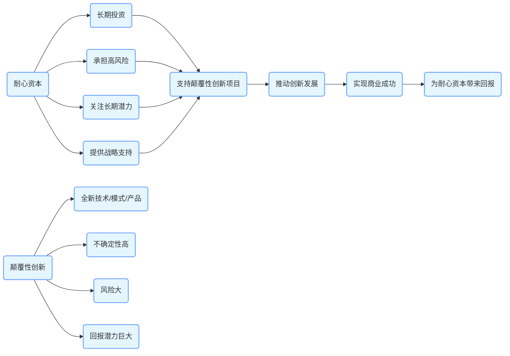

# 彼得林奇的“耐心资本”在颠覆性创新中的角色

> 关键词：彼得林奇、耐心资本、颠覆性创新、风险投资、长期价值

> 摘要：本文深入探讨了彼得林奇所倡导的“耐心资本”在颠覆性创新领域中的重要角色。通过对耐心资本的概念、特点进行剖析，阐述其与颠覆性创新的内在联系。分析耐心资本在颠覆性创新过程中的具体作用机制，包括对创新项目的孵化、成长和商业化等阶段的支持。结合实际案例，展示耐心资本如何助力颠覆性创新取得成功。同时，探讨了耐心资本面临的挑战与机遇，以及未来在推动颠覆性创新方面的发展趋势。旨在为理解和应用耐心资本促进颠覆性创新提供全面而深入的理论和实践参考。

## 1. 背景介绍 
### 1.1 目的和范围
本研究的目的在于全面且深入地探究彼得林奇的“耐心资本”在颠覆性创新中所扮演的角色。通过对相关理论和实践案例的分析，揭示耐心资本对颠覆性创新的推动作用、作用机制以及面临的挑战和机遇。研究范围涵盖耐心资本的概念、特点、与颠覆性创新的关系，以及在不同行业和领域中耐心资本支持颠覆性创新的实际案例。同时，对耐心资本未来的发展趋势进行展望，为投资者、创业者和政策制定者提供有价值的参考。

### 1.2 预期读者
本文预期读者包括对投资、创新和经济发展感兴趣的各界人士。具体涵盖专业投资者，他们可以从本文中获取关于耐心资本投资策略和风险评估的新视角；创业者能够了解如何吸引耐心资本支持其颠覆性创新项目；政策制定者可以参考本文内容制定有利于耐心资本发展和颠覆性创新的政策；学者和研究人员则可以将本文作为进一步研究相关领域的参考资料。

### 1.3 文档结构概述
本文首先介绍研究的背景、目的、预期读者和文档结构，为后续内容奠定基础。接着阐述耐心资本的核心概念，包括其定义、特点以及与其他资本形式的联系，并通过文本示意图和 Mermaid 流程图进行直观展示。然后深入分析耐心资本在颠覆性创新中的核心算法原理和具体操作步骤，结合 Python 源代码进行详细阐述。之后介绍相关的数学模型和公式，并通过举例说明其在实际中的应用。通过项目实战部分，展示耐心资本支持颠覆性创新的实际案例，包括开发环境搭建、源代码详细实现和代码解读。探讨耐心资本在不同领域的实际应用场景，推荐相关的工具和资源，包括学习资源、开发工具框架和相关论文著作。最后对耐心资本在颠覆性创新中的角色进行总结，展望未来发展趋势与挑战，并提供常见问题与解答以及扩展阅读和参考资料。

### 1.4 术语表
#### 1.4.1 核心术语定义
- **耐心资本**：指投资者愿意长期投入资金，不追求短期回报，给予创新项目足够的时间和资源来发展和成长，以获取长期的、巨大的价值回报的资本形式。
- **颠覆性创新**：指通过引入新的技术、商业模式或产品，打破现有市场格局，创造新的市场需求和价值，对传统产业和企业产生重大冲击和变革的创新活动。

#### 1.4.2 相关概念解释
- **风险投资**：是一种向极具发展潜力的初创企业提供资金支持并取得该公司股份的权益性投资方式。与耐心资本不同的是，风险投资通常有相对明确的退出期限和回报预期，更注重项目的短期增长和市场估值提升。
- **长期价值**：指企业或项目在较长时间内持续创造的经济、社会和环境价值，包括盈利能力、市场份额、品牌影响力、技术创新能力等多个方面。耐心资本的投资目标就是追求被投资项目的长期价值最大化。

#### 1.4.3 缩略词列表
- **VC**：Venture Capital，风险投资
- **PE**：Private Equity，私募股权投资

## 2. 核心概念与联系 

### 耐心资本的概念与特点
耐心资本是一种具有独特属性的资本形式。其核心特点在于投资者的长期视角和耐心。与传统的短期逐利资本不同，耐心资本的投资者理解颠覆性创新项目通常需要较长时间才能实现盈利和价值创造。他们愿意承担更高的风险，给予创新者足够的时间和资源来进行研发、试验和市场拓展。

耐心资本的投资者往往更关注项目的长期潜力和战略价值，而不是短期的财务指标。他们会积极参与到项目的发展过程中，提供战略指导、资源整合和人脉支持等，帮助创新项目克服各种困难，实现可持续发展。

### 颠覆性创新的概念与特征
颠覆性创新是一种具有革命性的创新模式。它通常通过引入全新的技术、商业模式或产品，打破现有的市场规则和竞争格局。颠覆性创新往往从市场的边缘或低端切入，逐步积累用户和市场份额，最终对主流市场和传统企业产生巨大的冲击和替代效应。

颠覆性创新具有不确定性高、风险大、回报潜力巨大等特征。由于其创新性和前瞻性，颠覆性创新项目在初期往往面临技术难题、市场接受度低、资金短缺等诸多挑战，但一旦成功，将创造出巨大的商业价值和社会影响。

### 耐心资本与颠覆性创新的联系
耐心资本与颠覆性创新之间存在着紧密的内在联系。颠覆性创新项目的高风险、长周期特点决定了其需要耐心资本的支持。耐心资本的长期投资和资源注入，为颠覆性创新项目提供了生存和发展的土壤。

同时，颠覆性创新项目的巨大回报潜力也吸引着耐心资本的投资者。通过支持有潜力的颠覆性创新项目，耐心资本投资者有机会获得高额的长期回报。此外，耐心资本的参与还可以为颠覆性创新项目带来更多的资源和战略支持，促进创新项目的成功实施。

### 文本示意图
```plaintext
耐心资本
|--长期投资视角
|--承担高风险
|--关注长期潜力
|--提供战略支持

颠覆性创新
|--全新技术/商业模式/产品
|--不确定性高
|--风险大
|--回报潜力巨大

联系
|--耐心资本为颠覆性创新提供资金和资源支持
|--颠覆性创新为耐心资本带来高额回报机会
```

### Mermaid 流程图


## 3. 核心算法原理 & 具体操作步骤 

### 耐心资本投资决策的核心算法原理
耐心资本的投资决策是一个复杂的过程，涉及多个因素的综合评估。我们可以将其简化为一个基于多因素加权评分的算法模型。

假设我们有 $n$ 个评估因素 $x_1, x_2, \cdots, x_n$，每个因素对应的权重为 $w_1, w_2, \cdots, w_n$，且 $\sum_{i=1}^{n} w_i = 1$。对于一个颠覆性创新项目 $P$，其在每个评估因素上的得分分别为 $s_1, s_2, \cdots, s_n$。则该项目的综合得分 $S$ 可以通过以下公式计算：

$$S = \sum_{i=1}^{n} w_i s_i$$

评估因素可以包括技术创新性、市场潜力、团队能力、商业模式可行性等。权重的确定需要根据投资者的战略目标和风险偏好进行调整。

### Python 源代码实现
```python
# 定义评估因素和权重
evaluation_factors = ["技术创新性", "市场潜力", "团队能力", "商业模式可行性"]
weights = [0.3, 0.3, 0.2, 0.2]

# 定义一个函数来计算项目的综合得分
def calculate_project_score(scores):
    if len(scores) != len(weights):
        raise ValueError("得分列表的长度必须与权重列表的长度相同")
    score = 0
    for i in range(len(scores)):
        score += weights[i] * scores[i]
    return score

# 示例：假设有一个项目在各个评估因素上的得分
project_scores = [8, 7, 6, 7]

# 计算项目的综合得分
project_score = calculate_project_score(project_scores)
print(f"该项目的综合得分是: {project_score}")
```

### 具体操作步骤
1. **确定评估因素**：根据投资目标和行业特点，确定对颠覆性创新项目进行评估的关键因素。这些因素应该能够全面反映项目的潜力和风险。
2. **确定权重**：根据投资者的战略重点和风险偏好，为每个评估因素分配相应的权重。权重的分配应该体现不同因素在投资决策中的重要性。
3. **项目评估**：对每个待评估的颠覆性创新项目，组织专业团队对其在各个评估因素上的表现进行评分。评分可以采用定量和定性相结合的方法。
4. **计算综合得分**：使用上述算法模型，计算每个项目的综合得分。综合得分越高，说明项目的潜力越大，越值得投资。
5. **投资决策**：根据项目的综合得分，结合投资者的资金规模和投资策略，做出投资决策。对于综合得分较高的项目，可以考虑加大投资力度；对于得分较低的项目，可以选择放弃或进一步观察。

## 4. 数学模型和公式 & 详细讲解 & 举例说明 

### 耐心资本投资回报模型
耐心资本的投资回报通常具有较长的周期和不确定性。我们可以建立一个简化的投资回报模型来分析其收益情况。

假设耐心资本投资者在 $t = 0$ 时刻投入资金 $I$，项目在第 $n$ 年实现盈利，每年的净利润为 $N_t$（$t = n, n + 1, \cdots$）。考虑资金的时间价值，使用贴现率 $r$ 来计算未来现金流的现值。则投资者的投资回报 $R$ 可以通过以下公式计算：

$$R = \sum_{t=n}^{\infty} \frac{N_t}{(1 + r)^t} - I$$

### 详细讲解
- **资金投入**：$I$ 表示投资者在项目初期投入的资金，包括股权融资、债权融资等各种形式的资金。
- **净利润**：$N_t$ 表示项目在第 $t$ 年实现的净利润，它受到项目的盈利能力、市场竞争、成本控制等多种因素的影响。
- **贴现率**：$r$ 是一个反映资金时间价值和风险水平的参数。贴现率越高，说明投资者对未来现金流的预期越低，风险越大。
- **投资回报**：$R$ 表示投资者的最终投资回报。如果 $R > 0$，说明投资项目是盈利的；如果 $R < 0$，则说明投资项目亏损。

### 举例说明
假设投资者在 $t = 0$ 时刻投入资金 $I = 1000$ 万元，项目在第 5 年开始盈利，每年的净利润 $N_t = 200$ 万元，贴现率 $r = 0.1$。则投资者的投资回报计算如下：

首先，计算未来现金流的现值：

$$\sum_{t=5}^{\infty} \frac{N_t}{(1 + r)^t} = \sum_{t=5}^{\infty} \frac{200}{(1 + 0.1)^t}$$

这是一个无穷等比数列求和问题，首项 $a = \frac{200}{(1 + 0.1)^5}$，公比 $q = \frac{1}{1 + 0.1}$。根据无穷等比数列求和公式 $S = \frac{a}{1 - q}$，可得：

$$\sum_{t=5}^{\infty} \frac{200}{(1 + 0.1)^t} = \frac{\frac{200}{(1 + 0.1)^5}}{1 - \frac{1}{1 + 0.1}} \approx 1241.84$$

然后，计算投资回报：

$$R = \sum_{t=5}^{\infty} \frac{200}{(1 + 0.1)^t} - 1000 \approx 1241.84 - 1000 = 241.84$$

这意味着投资者在考虑资金时间价值的情况下，最终可以获得约 241.84 万元的投资回报。

## 5. 项目实战：代码实际案例和详细解释说明 

### 5.1  开发环境搭建
在进行耐心资本支持颠覆性创新项目的实战模拟时，我们可以使用 Python 语言进行开发。以下是开发环境搭建的步骤：

1. **安装 Python**：从 Python 官方网站（https://www.python.org/downloads/）下载并安装适合你操作系统的 Python 版本。建议安装 Python 3.7 及以上版本。
2. **安装开发工具**：可以选择使用 PyCharm、VS Code 等集成开发环境（IDE）或文本编辑器来编写和运行 Python 代码。这里以 PyCharm 为例，从 JetBrains 官方网站（https://www.jetbrains.com/pycharm/download/）下载并安装 PyCharm 社区版。
3. **创建虚拟环境**：为了避免不同项目之间的依赖冲突，建议使用虚拟环境。在命令行中执行以下命令创建并激活虚拟环境：

```bash
# 创建虚拟环境
python -m venv myenv

# 激活虚拟环境（Windows）
myenv\Scripts\activate

# 激活虚拟环境（Linux/Mac）
source myenv/bin/activate
```

4. **安装依赖库**：在虚拟环境中安装所需的 Python 库，例如 `numpy`、`pandas` 等。可以使用以下命令进行安装：

```bash
pip install numpy pandas
```

### 5.2  源代码详细实现和代码解读
以下是一个模拟耐心资本投资决策和回报计算的 Python 代码示例：

```python
import numpy as np
import pandas as pd

# 定义评估因素和权重
evaluation_factors = ["技术创新性", "市场潜力", "团队能力", "商业模式可行性"]
weights = np.array([0.3, 0.3, 0.2, 0.2])

# 定义项目列表和对应的得分
projects = [
    {"name": "项目 A", "scores": np.array([8, 7, 6, 7])},
    {"name": "项目 B", "scores": np.array([7, 8, 7, 6])},
    {"name": "项目 C", "scores": np.array([6, 7, 8, 7])}
]

# 定义一个函数来计算项目的综合得分
def calculate_project_score(scores):
    if len(scores) != len(weights):
        raise ValueError("得分列表的长度必须与权重列表的长度相同")
    score = np.dot(weights, scores)
    return score

# 计算每个项目的综合得分
for project in projects:
    project["score"] = calculate_project_score(project["scores"])

# 将项目信息转换为 DataFrame 格式，方便查看和分析
project_df = pd.DataFrame(projects)

# 按照综合得分降序排序
project_df = project_df.sort_values(by="score", ascending=False)

print("项目综合得分排序结果：")
print(project_df[["name", "score"]])

# 定义投资回报计算函数
def calculate_investment_return(initial_investment, annual_profit, start_year, discount_rate, num_years):
    cash_flows = np.zeros(num_years)
    cash_flows[start_year:] = annual_profit
    present_values = cash_flows / (1 + discount_rate) ** np.arange(num_years)
    investment_return = np.sum(present_values) - initial_investment
    return investment_return

# 假设选择项目 A 进行投资
selected_project = project_df.iloc[0]
initial_investment = 1000  # 初始投资 1000 万元
annual_profit = 200  # 每年净利润 200 万元
start_year = 5  # 第 5 年开始盈利
discount_rate = 0.1  # 贴现率 10%
num_years = 20  # 计算 20 年的投资回报

investment_return = calculate_investment_return(initial_investment, annual_profit, start_year, discount_rate, num_years)
print(f"选择项目 {selected_project['name']} 进行投资，最终投资回报为: {investment_return} 万元")
```

### 5.3  代码解读与分析
1. **评估因素和权重**：定义了四个评估因素和对应的权重，用于计算项目的综合得分。
2. **项目列表和得分**：定义了三个项目及其在各个评估因素上的得分。
3. **综合得分计算**：使用 `calculate_project_score` 函数计算每个项目的综合得分，并将结果存储在项目字典中。
4. **排序和展示**：将项目信息转换为 DataFrame 格式，并按照综合得分降序排序，方便查看和分析。
5. **投资回报计算**：定义了 `calculate_investment_return` 函数，用于计算投资项目的最终回报。该函数考虑了初始投资、每年净利润、开始盈利年份、贴现率和计算年限等因素。
6. **选择项目并计算回报**：选择综合得分最高的项目进行投资，并计算其最终投资回报。

通过这个代码示例，我们可以模拟耐心资本的投资决策过程，并计算投资项目的回报情况，为实际投资提供参考。

## 6. 实际应用场景 

### 科技行业
在科技行业，颠覆性创新层出不穷，如人工智能、区块链、量子计算等领域。这些领域的创新项目通常需要大量的研发投入和长期的技术积累，才能实现商业化应用。耐心资本在这些项目的发展过程中发挥了关键作用。

例如，在人工智能领域，一些初创企业专注于研发先进的深度学习算法和应用。这些企业在初期可能面临技术难题、数据获取困难和市场认可度低等问题，需要耐心资本的支持来进行研发和市场推广。耐心资本投资者可以为这些企业提供资金、技术和人才等方面的支持，帮助它们逐步成长和发展。

### 医疗行业
医疗行业的颠覆性创新对于改善人类健康和提高医疗水平具有重要意义。例如，基因编辑技术、个性化医疗、远程医疗等领域的创新项目，都需要长期的研究和临床试验才能取得成功。耐心资本可以为这些项目提供必要的资金和资源，支持其进行研发和临床试验。

以基因编辑技术为例，相关的研究和开发需要大量的资金和时间投入。耐心资本投资者可以参与到这些项目中，与科研团队合作，共同推动技术的进步和应用。一旦这些技术取得突破，将为患者带来新的治疗选择，同时也为投资者带来巨大的回报。

### 能源行业
能源行业的颠覆性创新对于实现可持续发展和应对气候变化具有重要意义。例如，太阳能、风能、储能技术等领域的创新项目，需要长期的研发和市场培育才能实现大规模应用。耐心资本可以为这些项目提供资金支持，帮助它们克服技术和市场障碍。

以太阳能行业为例，早期的太阳能技术成本较高，效率较低，市场竞争力不足。耐心资本的投入促进了太阳能技术的研发和创新，推动了成本的降低和效率的提高。如今，太阳能已经成为一种具有竞争力的清洁能源，得到了广泛的应用和发展。

### 交通行业
交通行业的颠覆性创新正在改变人们的出行方式和物流模式。例如，电动汽车、自动驾驶技术、共享出行等领域的创新项目，都需要大量的资金和时间来进行研发和市场推广。耐心资本可以为这些项目提供支持，帮助它们实现商业化和规模化发展。

以电动汽车行业为例，特斯拉作为电动汽车领域的领军企业，在发展初期面临着技术难题、资金短缺和市场质疑等问题。耐心资本的投资者看到了电动汽车的发展潜力，为特斯拉提供了持续的资金支持。经过多年的发展，特斯拉已经成为全球知名的电动汽车品牌，推动了整个汽车行业的变革。

## 7. 工具和资源推荐
### 7.1 学习资源推荐
#### 7.1.1 书籍推荐
- 《彼得·林奇的成功投资》：彼得·林奇的经典著作，详细介绍了他的投资理念和方法，对于理解耐心资本的投资策略具有重要参考价值。
- 《创新者的窘境》：克莱顿·克里斯坦森的著作，深入探讨了颠覆性创新的概念、特点和影响，为我们理解颠覆性创新提供了理论基础。
- 《风险投资交易》：布拉德·菲尔德和杰森·门德尔松的著作，全面介绍了风险投资的交易流程、条款和策略，对于了解耐心资本的投资运作具有实际指导意义。

#### 7.1.2 在线课程
- Coursera 上的“投资学原理”课程：由知名大学的教授授课，系统介绍了投资学的基本原理和方法，包括股票投资、债券投资、风险投资等内容。
- edX 上的“创新与创业”课程：该课程聚焦于创新和创业领域，涵盖颠覆性创新的理论和实践，以及如何吸引投资等方面的知识。
- Udemy 上的“风险投资实战”课程：通过实际案例分析，介绍风险投资的运作流程和投资决策方法，对于想要了解耐心资本投资实践的学习者具有很大帮助。

#### 7.1.3 技术博客和网站
- 36氪：关注新经济领域的创新和创业动态，提供大量关于颠覆性创新项目和投资的报道和分析。
- 创业邦：专注于创业和投资领域，分享创业项目的经验和教训，以及投资机构的观点和趋势分析。
- 投中网：提供专业的投资资讯和研究报告，涵盖风险投资、私募股权投资等领域，对于了解耐心资本的市场动态和行业趋势具有重要参考价值。

### 7.2 开发工具框架推荐
#### 7.2.1 IDE和编辑器
- PyCharm：一款专业的 Python 集成开发环境，具有代码编辑、调试、版本控制等功能，适合开发与耐心资本投资分析相关的 Python 程序。
- VS Code：一款轻量级的代码编辑器，支持多种编程语言，具有丰富的插件生态系统，可以通过安装相关插件来提高开发效率。
- Jupyter Notebook：一种交互式的开发环境，适合进行数据分析和模型验证。可以方便地展示代码、数据和分析结果，便于团队协作和交流。

#### 7.2.2 调试和性能分析工具
- PDB：Python 内置的调试工具，可以帮助开发者在代码执行过程中进行断点调试，查看变量的值和程序的执行流程。
- cProfile：Python 标准库中的性能分析工具，可以统计代码中各个函数的执行时间和调用次数，帮助开发者找出性能瓶颈。
- Py-Spy：一款轻量级的 Python 性能分析工具，可以实时监测 Python 程序的性能，生成火焰图等可视化结果，便于开发者进行性能优化。

#### 7.2.3 相关框架和库
- NumPy：Python 中用于科学计算的基础库，提供了高效的数组操作和数学函数，对于实现耐心资本投资模型和算法具有重要作用。
- Pandas：Python 中用于数据处理和分析的库，提供了 DataFrame 和 Series 等数据结构，方便进行数据的读取、清洗、分析和可视化。
- Scikit-learn：Python 中用于机器学习的库，提供了丰富的机器学习算法和工具，可用于对颠覆性创新项目进行风险评估和预测。

### 7.3 相关论文著作推荐
#### 7.3.1 经典论文
- Christensen, C. M. (1997). The Innovator's Dilemma: When New Technologies Cause Great Firms to Fail. Harvard Business School Press. 该论文提出了颠覆性创新的概念，并通过大量案例分析了颠覆性创新对企业和行业的影响。
- Lerner, J. (2002). Venture Capitalists and the Oversight of Private Firms. Journal of Finance, 57(1), 301-346. 该论文研究了风险投资家在投资项目中的监督和管理作用，对于理解耐心资本的投资行为具有重要参考价值。

#### 7.3.2 最新研究成果
- Bernstein, S., Giroud, X., & Townsend, R. R. (2016). Does Going Public Affect Innovation? The Quarterly Journal of Economics, 131(3), 1369-1436. 该研究探讨了企业上市对创新的影响，为耐心资本的投资决策提供了新的视角。
- Nanda, R., & Rhodes-Kropf, M. (2013). The Grandstanding Hypothesis Revisited. Journal of Financial Economics, 109(2), 373-390. 该论文重新审视了风险投资中的“大出风头”假说，对于理解耐心资本的投资动机和行为具有重要意义。

#### 7.3.3 应用案例分析
- Gompers, P. A., & Lerner, J. (2001). The Venture Capital Cycle. MIT Press. 该书通过大量的案例分析，介绍了风险投资的整个生命周期，包括投资决策、项目管理、退出等环节，对于了解耐心资本的投资实践具有实际指导作用。
- Sahlman, W. A. (1990). The Structure and Governance of Venture-Capital Organizations. Journal of Financial Economics, 27(2), 473-521. 该论文通过案例分析了风险投资机构的组织结构和治理机制，为耐心资本的投资运作提供了参考。

## 8. 总结：未来发展趋势与挑战
### 未来发展趋势
1. **多元化投资**：未来耐心资本的投资领域将更加多元化，不仅局限于科技、医疗、能源等传统领域，还将涉及到文化、教育、环保等新兴领域。随着社会的发展和进步，这些领域的颠覆性创新项目将不断涌现，为耐心资本提供更多的投资机会。
2. **国际化合作**：随着全球经济一体化的加速，耐心资本的投资将更加国际化。投资者将跨越国界，寻找具有潜力的颠覆性创新项目进行投资。同时，国际间的合作也将促进创新资源的共享和优化配置，推动颠覆性创新的发展。
3. **与产业资本深度融合**：耐心资本将与产业资本更加紧密地结合。产业资本具有丰富的行业资源和市场渠道，而耐心资本具有长期投资的优势。两者的结合将为颠覆性创新项目提供更全面的支持，加速创新项目的商业化进程。
4. **数字化和智能化投资决策**：随着大数据、人工智能等技术的发展，耐心资本的投资决策将更加数字化和智能化。通过对大量数据的分析和挖掘，投资者可以更准确地评估项目的潜力和风险，提高投资决策的效率和准确性。

### 挑战
1. **高风险和不确定性**：颠覆性创新项目本身具有高风险和不确定性，耐心资本的投资者需要承担更大的风险。在项目的研发和发展过程中，可能会遇到技术难题、市场变化、政策调整等各种因素的影响，导致项目失败或投资回报不及预期。
2. **长期投资的资金压力**：耐心资本的投资周期较长，投资者需要在较长时间内保持资金的投入。这对投资者的资金实力和资金管理能力提出了较高的要求。如果投资者在投资过程中出现资金短缺或资金链断裂的情况，可能会影响项目的发展和投资回报。
3. **人才短缺**：耐心资本的投资需要具备专业知识和丰富经验的投资人才。这些人才不仅需要了解投资领域的知识，还需要熟悉相关行业的技术和市场动态。目前，市场上这类复合型人才相对短缺，这在一定程度上限制了耐心资本的发展。
4. **政策和监管环境的变化**：政策和监管环境的变化对耐心资本的投资具有重要影响。不同国家和地区的政策和监管要求可能存在差异，而且政策和监管环境也可能随着时间的推移而发生变化。投资者需要密切关注政策和监管环境的变化，及时调整投资策略，以适应新的环境。

## 9. 附录：常见问题与解答
### 1. 耐心资本与风险投资有什么区别？
耐心资本与风险投资有一些相似之处，但也存在明显的区别。风险投资通常有相对明确的退出期限和回报预期，更注重项目的短期增长和市场估值提升。而耐心资本更强调长期投资视角，愿意承担更高的风险，给予创新项目足够的时间和资源来发展和成长，追求项目的长期价值最大化。

### 2. 如何判断一个项目是否值得耐心资本投资？
判断一个项目是否值得耐心资本投资需要综合考虑多个因素。包括项目的技术创新性、市场潜力、团队能力、商业模式可行性等。可以通过建立多因素评估模型，对项目进行量化评估。同时，还需要考虑项目的长期发展前景和战略价值，以及投资者的风险偏好和投资目标。

### 3. 耐心资本的投资回报周期一般有多长？
耐心资本的投资回报周期通常较长，具体时间因项目而异。一般来说，颠覆性创新项目的投资回报周期可能在 5 - 10 年甚至更长时间。这是因为颠覆性创新项目需要较长时间进行研发、试验和市场推广，才能实现盈利和价值创造。

### 4. 耐心资本在投资过程中如何控制风险？
耐心资本在投资过程中可以通过多种方式控制风险。例如，在投资前进行充分的尽职调查，对项目的技术、市场、团队等方面进行全面评估；在投资过程中，积极参与项目的管理和监督，提供战略指导和资源支持；合理分散投资，降低单个项目的风险；与其他投资者合作，共同承担风险等。

### 5. 耐心资本对创业者有哪些要求？
耐心资本对创业者的要求较高。创业者需要具备创新精神和创业能力，有清晰的商业计划和战略目标；要有强大的团队和良好的团队合作精神，能够吸引和留住优秀的人才；要具备坚韧不拔的毅力和应对挑战的能力，在项目发展过程中能够克服各种困难；同时，创业者还需要与投资者保持良好的沟通和合作关系，共同推动项目的发展。

## 10. 扩展阅读 & 参考资料
### 扩展阅读
- 《资本的规则》：作者张巍，从法律和金融的角度探讨了资本运作的规则和逻辑，对于理解耐心资本的投资运作具有一定的参考价值。
- 《指数型组织》：作者萨利姆·伊斯梅尔等，介绍了指数型组织的特点和发展趋势，以及如何通过指数型思维进行创新和创业，对于了解颠覆性创新的组织模式有一定的帮助。
- 《从 0 到 1》：作者彼得·蒂尔，分享了创业的经验和思考，强调了创新和垄断的重要性，对于创业者和投资者都具有启发意义。

### 参考资料
- Christensen, C. M. (1997). The Innovator's Dilemma: When New Technologies Cause Great Firms to Fail. Harvard Business School Press.
- Lerner, J. (2002). Venture Capitalists and the Oversight of Private Firms. Journal of Finance, 57(1), 301-346.
- Gompers, P. A., & Lerner, J. (2001). The Venture Capital Cycle. MIT Press.
- Sahlman, W. A. (1990). The Structure and Governance of Venture-Capital Organizations. Journal of Financial Economics, 27(2), 473-521.
- Bernstein, S., Giroud, X., & Townsend, R. R. (2016). Does Going Public Affect Innovation? The Quarterly Journal of Economics, 131(3), 1369-1436.
- Nanda, R., & Rhodes-Kropf, M. (2013). The Grandstanding Hypothesis Revisited. Journal of Financial Economics, 109(2), 373-390.