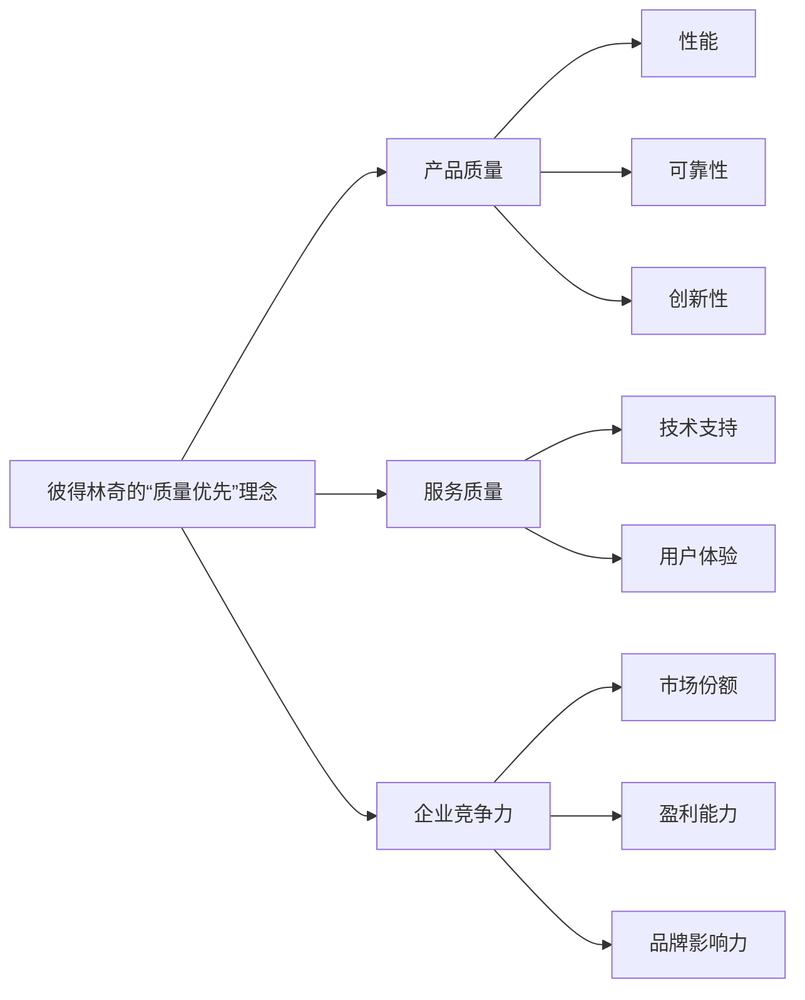

# 彼得林奇的"质量优先"在高科技行业的应用

> 关键词：彼得林奇、质量优先、高科技行业、投资策略、企业管理

> 摘要：本文深入探讨了彼得林奇“质量优先”理念在高科技行业的应用。首先介绍了该理念的背景以及本文的目的、预期读者等信息。接着阐述了“质量优先”的核心概念及其与高科技行业的联系，并给出了相应的文本示意图和Mermaid流程图。详细讲解了相关核心算法原理及操作步骤，运用Python代码进行说明。同时给出了数学模型和公式，并举例说明。通过项目实战案例，对代码进行详细解读。分析了“质量优先”在高科技行业的实际应用场景，推荐了相关的学习资源、开发工具框架以及论文著作。最后总结了未来发展趋势与挑战，解答常见问题，并提供扩展阅读和参考资料，旨在为高科技行业的投资和企业管理提供有价值的参考。

## 1. 背景介绍 
### 1.1 目的和范围
彼得林奇作为投资界的传奇人物，其“质量优先”的投资理念在传统行业取得了巨大的成功。然而，高科技行业具有技术更新快、竞争激烈、不确定性强等特点，与传统行业存在显著差异。本文的目的在于探讨彼得林奇的“质量优先”理念如何在高科技行业中应用，分析其在高科技行业投资决策和企业管理中的可行性和有效性。范围涵盖了高科技行业的多个领域，包括人工智能、半导体、软件等，旨在为高科技行业的投资者和企业管理者提供理论和实践指导。

### 1.2 预期读者
本文的预期读者主要包括高科技行业的投资者，他们希望通过借鉴彼得林奇的投资理念，提高投资决策的准确性和回报率；高科技企业的管理者，他们可以将“质量优先”理念应用于企业的战略规划、产品研发和市场拓展等方面；以及对高科技行业和投资领域感兴趣的学者和研究人员，为他们的学术研究和实践探索提供参考。

### 1.3 文档结构概述
本文将按照以下结构进行阐述：首先介绍核心概念与联系，明确“质量优先”在高科技行业的内涵和相关要素之间的关系；接着讲解核心算法原理和具体操作步骤，运用Python代码进行详细说明；然后给出数学模型和公式，并举例说明；通过项目实战案例，对代码进行详细解读；分析“质量优先”在高科技行业的实际应用场景；推荐相关的学习资源、开发工具框架以及论文著作；最后总结未来发展趋势与挑战，解答常见问题，并提供扩展阅读和参考资料。

### 1.4 术语表
#### 1.4.1 核心术语定义
- **彼得林奇的“质量优先”**：指在投资或企业经营过程中，优先考虑产品或服务的质量，包括产品的性能、可靠性、创新性等方面，认为高质量的产品或服务是企业长期发展和获得竞争优势的关键。
- **高科技行业**：指以高新技术为基础，从事一种或多种高新技术及其产品的研究、开发、生产和技术服务的企业集合，主要包括信息技术、生物技术、新材料技术、新能源技术等领域。
- **投资决策**：指投资者为了实现其预期的投资目标，运用一定的科学理论、方法和手段，通过一定的程序对投资的必要性、投资目标、投资规模、投资方向、投资结构、投资成本与收益等经济活动中的重大问题所进行的分析、判断和方案选择。
- **企业管理**：指对企业的生产经营活动进行计划、组织、指挥、协调和控制等一系列职能的总称，旨在提高企业的经济效益和社会效益。

#### 1.4.2 相关概念解释
- **产品质量**：是指产品满足规定需要和潜在需要的特征和特性的总和，包括产品的性能、寿命、可靠性、安全性、经济性等方面。
- **技术创新**：指企业应用创新的知识和新技术、新工艺，采用新的生产方式和经营管理模式，提高产品质量，开发生产新的产品，提供新的服务，占据市场并实现市场价值。
- **市场竞争力**：指企业在市场竞争中，相对于竞争对手所具有的优势和能力，包括产品质量、价格、品牌、服务等方面。

#### 1.4.3 缩略词列表
- **AI**：Artificial Intelligence，人工智能
- **IoT**：Internet of Things，物联网
- **VC**：Venture Capital，风险投资

## 2. 核心概念与联系 
### 核心概念原理
彼得林奇的“质量优先”理念强调在投资和企业经营中，要将产品或服务的质量放在首位。在高科技行业，质量的内涵更加丰富，不仅包括产品的物理性能和可靠性，还包括技术的创新性、数据的安全性、用户体验等方面。高质量的高科技产品或服务能够满足用户的需求，提高用户的满意度和忠诚度，从而为企业带来长期的竞争优势和稳定的收益。

### 架构的文本示意图
```plaintext
彼得林奇的“质量优先”理念
|
|-- 产品质量
|   |-- 性能
|   |-- 可靠性
|   |-- 创新性
|
|-- 服务质量
|   |-- 技术支持
|   |-- 用户体验
|
|-- 企业竞争力
|   |-- 市场份额
|   |-- 盈利能力
|   |-- 品牌影响力
```

### Mermaid流程图


## 3. 核心算法原理 & 具体操作步骤 
### 核心算法原理
在高科技行业应用“质量优先”理念时，可以通过建立一个综合评价指标体系来评估企业的产品或服务质量。该指标体系可以包括多个维度的指标，如技术指标、市场指标、用户指标等。通过对这些指标进行量化和加权计算，可以得到一个综合的质量得分，从而为投资决策和企业管理提供依据。

### 具体操作步骤
1. **确定评价指标**：根据高科技行业的特点和企业的实际情况，确定评价产品或服务质量的指标，如技术创新性、产品性能、市场占有率、用户满意度等。
2. **收集数据**：通过市场调研、企业年报、用户反馈等渠道，收集与评价指标相关的数据。
3. **指标量化**：将收集到的数据进行量化处理，如将技术创新性指标量化为专利数量、研发投入等。
4. **确定权重**：根据各指标的重要程度，确定其在综合评价中的权重。
5. **计算综合得分**：将量化后的指标值乘以相应的权重，然后相加得到综合得分。
6. **决策分析**：根据综合得分，对企业的产品或服务质量进行评估，并做出投资决策或企业管理决策。

### Python源代码实现
```python
import pandas as pd

# 定义评价指标和权重
metrics = ['技术创新性', '产品性能', '市场占有率', '用户满意度']
weights = [0.3, 0.2, 0.3, 0.2]

# 示例数据
data = {
    '企业A': [80, 90, 70, 85],
    '企业B': [75, 85, 75, 90],
    '企业C': [90, 80, 85, 75]
}

# 创建DataFrame
df = pd.DataFrame(data, index=metrics)

# 计算综合得分
scores = {}
for company in df.columns:
    score = sum(df[company] * weights)
    scores[company] = score

# 输出结果
print("各企业的综合得分：")
for company, score in scores.items():
    print(f"{company}: {score}")
```

### 代码解释
1. **定义评价指标和权重**：使用列表`metrics`和`weights`分别定义评价指标和对应的权重。
2. **示例数据**：使用字典`data`存储各企业在不同指标上的得分。
3. **创建DataFrame**：使用`pandas`库的`DataFrame`函数将数据转换为表格形式。
4. **计算综合得分**：遍历各企业，将其在不同指标上的得分乘以相应的权重，然后相加得到综合得分。
5. **输出结果**：将各企业的综合得分输出。

## 4. 数学模型和公式 & 详细讲解 & 举例说明 
### 数学模型和公式
设评价指标有 $n$ 个，分别为 $x_1, x_2, \cdots, x_n$，对应的权重为 $w_1, w_2, \cdots, w_n$，且 $\sum_{i=1}^{n} w_i = 1$。企业在各指标上的得分分别为 $x_{i1}, x_{i2}, \cdots, x_{in}$，则企业的综合得分 $S$ 可以表示为：

$$S = \sum_{i=1}^{n} w_i x_{ii}$$

### 详细讲解
该公式的含义是将企业在各评价指标上的得分乘以相应的权重，然后相加得到综合得分。权重反映了各指标在综合评价中的重要程度，权重越大，该指标对综合得分的影响越大。

### 举例说明
假设某高科技企业在技术创新性、产品性能、市场占有率、用户满意度四个指标上的得分分别为 80、90、70、85，对应的权重分别为 0.3、0.2、0.3、0.2，则该企业的综合得分 $S$ 为：

$$S = 0.3 \times 80 + 0.2 \times 90 + 0.3 \times 70 + 0.2 \times 85$$
$$S = 24 + 18 + 21 + 17$$
$$S = 80$$

这表明该企业的综合质量得分较高，具有较好的发展潜力。

## 5. 项目实战：代码实际案例和详细解释说明 
### 5.1  开发环境搭建
1. **安装Python**：从Python官方网站（https://www.python.org/downloads/）下载并安装Python 3.x版本。
2. **安装必要的库**：使用`pip`命令安装`pandas`库，用于数据处理和分析。
```sh
pip install pandas
```

### 5.2  源代码详细实现和代码解读
```python
import pandas as pd

# 定义评价指标和权重
metrics = ['技术创新性', '产品性能', '市场占有率', '用户满意度']
weights = [0.3, 0.2, 0.3, 0.2]

# 示例数据
data = {
    '企业A': [80, 90, 70, 85],
    '企业B': [75, 85, 75, 90],
    '企业C': [90, 80, 85, 75]
}

# 创建DataFrame
df = pd.DataFrame(data, index=metrics)

# 计算综合得分
scores = {}
for company in df.columns:
    score = sum(df[company] * weights)
    scores[company] = score

# 输出结果
print("各企业的综合得分：")
for company, score in scores.items():
    print(f"{company}: {score}")
```

### 代码解读与分析
1. **导入必要的库**：使用`import pandas as pd`导入`pandas`库，用于数据处理和分析。
2. **定义评价指标和权重**：使用列表`metrics`和`weights`分别定义评价指标和对应的权重。
3. **示例数据**：使用字典`data`存储各企业在不同指标上的得分。
4. **创建DataFrame**：使用`pandas`库的`DataFrame`函数将数据转换为表格形式，方便后续处理。
5. **计算综合得分**：遍历各企业，将其在不同指标上的得分乘以相应的权重，然后相加得到综合得分。
6. **输出结果**：将各企业的综合得分输出，方便进行比较和分析。

通过这个项目实战案例，我们可以看到如何使用Python代码实现“质量优先”理念在高科技行业的应用，通过建立综合评价指标体系，对企业的产品或服务质量进行评估，为投资决策和企业管理提供依据。

## 6. 实际应用场景 
### 投资决策
在高科技行业的投资决策中，“质量优先”理念可以帮助投资者筛选出具有高质量产品或服务的企业。投资者可以通过分析企业的技术创新性、产品性能、市场占有率、用户满意度等指标，评估企业的综合质量得分，从而选择具有投资价值的企业。例如，在投资人工智能企业时，投资者可以关注企业的算法研发能力、模型性能、应用场景等方面，选择那些在技术上具有领先优势、产品质量高的企业进行投资。

### 企业战略规划
高科技企业在制定战略规划时，可以将“质量优先”作为核心战略。企业可以加大在研发方面的投入，提高产品的技术含量和质量水平；加强质量管理体系建设，确保产品的可靠性和稳定性；注重用户体验，提高用户的满意度和忠诚度。例如，苹果公司一直以“质量优先”为理念，通过不断创新和提高产品质量，赢得了全球消费者的青睐，成为全球最有价值的公司之一。

### 产品研发
在高科技产品研发过程中，“质量优先”理念可以指导企业注重产品的性能、创新性和可靠性。企业可以在研发前期进行充分的市场调研和用户需求分析，确定产品的质量目标；在研发过程中，采用先进的技术和工艺，严格控制产品质量；在产品上线后，及时收集用户反馈，不断改进产品质量。例如，华为公司在5G技术研发过程中，投入了大量的人力和物力，注重技术创新和产品质量，使其5G产品在全球市场上具有很强的竞争力。

### 市场竞争
在激烈的市场竞争中，高质量的产品或服务是企业获得竞争优势的关键。高科技企业可以通过提高产品质量，树立良好的品牌形象，吸引更多的用户。同时，高质量的产品或服务也可以提高用户的忠诚度，降低用户的流失率。例如，谷歌公司的搜索引擎以其高质量的搜索结果和良好的用户体验，在全球搜索引擎市场上占据了主导地位。

## 7. 工具和资源推荐
### 7.1 学习资源推荐
#### 7.1.1 书籍推荐
- 《彼得林奇的成功投资》：彼得林奇的经典著作，详细介绍了他的投资理念和方法，对高科技行业的投资者和企业管理者具有重要的参考价值。
- 《创新者的窘境》：克莱顿·克里斯坦森的著作，探讨了高科技行业中创新与企业发展的关系，帮助读者理解高科技企业如何应对技术变革和市场竞争。
- 《智能时代》：吴军的著作，介绍了人工智能、大数据等高科技领域的发展趋势和应用场景，为读者了解高科技行业提供了全面的视角。

#### 7.1.2 在线课程
- Coursera上的“人工智能基础”课程：由全球知名高校的教授授课，系统介绍了人工智能的基本概念、算法和应用。
- edX上的“大数据分析”课程：提供了大数据处理、分析和可视化的相关知识和技能，适合高科技行业的数据分析师和企业管理者学习。
- Udemy上的“Python编程入门”课程：适合初学者学习Python编程，为后续进行高科技行业的数据分析和开发打下基础。

#### 7.1.3 技术博客和网站
- 机器之心：专注于人工智能领域的技术博客，提供最新的技术动态、研究成果和应用案例。
- 36氪：关注高科技行业的创业和投资，提供行业资讯、分析报告和深度报道。
- 开源中国：提供开源软件的相关信息和技术交流平台，适合高科技行业的开发者和爱好者。

### 7.2 开发工具框架推荐
#### 7.2.1 IDE和编辑器
- PyCharm：专业的Python集成开发环境，提供代码编辑、调试、版本控制等功能，适合Python开发者使用。
- Visual Studio Code：轻量级的代码编辑器，支持多种编程语言和插件扩展，适合初学者和专业开发者使用。
- Jupyter Notebook：交互式的开发环境，适合进行数据分析和机器学习实验，支持Python、R等多种编程语言。

#### 7.2.2 调试和性能分析工具
- PDB：Python自带的调试工具，用于调试Python代码，查找和修复代码中的错误。
- Py-Spy：用于分析Python程序的性能，找出程序中的性能瓶颈。
- TensorBoard：TensorFlow的可视化工具，用于可视化深度学习模型的训练过程和结果。

#### 7.2.3 相关框架和库
- TensorFlow：谷歌开发的开源深度学习框架，广泛应用于图像识别、自然语言处理等领域。
- PyTorch：Facebook开发的开源深度学习框架，具有动态图和易于使用的特点，适合科研和开发。
- Scikit-learn：用于机器学习的Python库，提供了丰富的机器学习算法和工具，适合初学者和专业开发者使用。

### 7.3 相关论文著作推荐
#### 7.3.1 经典论文
- “ImageNet Classification with Deep Convolutional Neural Networks”：Alex Krizhevsky等人发表的论文，介绍了AlexNet卷积神经网络在图像分类任务中的应用，开创了深度学习在计算机视觉领域的先河。
- “Attention Is All You Need”：Vaswani等人发表的论文，提出了Transformer模型，在自然语言处理领域取得了巨大的成功。
- “Generative Adversarial Nets”：Ian Goodfellow等人发表的论文，提出了生成对抗网络（GAN）的概念，为生成式模型的发展做出了重要贡献。

#### 7.3.2 最新研究成果
- 关注顶级学术会议如NeurIPS、ICML、CVPR等的论文，了解高科技领域的最新研究动态和成果。
- 查阅知名学术期刊如Journal of Artificial Intelligence Research、Artificial Intelligence等的文章，获取高质量的学术研究成果。

#### 7.3.3 应用案例分析
- 分析谷歌、苹果、华为等高科技企业的成功案例，了解它们在产品研发、市场竞争和企业管理等方面的经验和做法。
- 研究独角兽企业的发展历程，学习它们如何在高科技行业中快速崛起和取得成功。

## 8. 总结：未来发展趋势与挑战
### 未来发展趋势
- **技术创新加速**：高科技行业将继续保持快速的技术创新，人工智能、物联网、区块链等技术将不断取得突破和应用，为企业带来更多的发展机遇。
- **质量要求提高**：随着消费者对产品和服务质量的要求越来越高，高科技企业将更加注重质量优先，不断提高产品的性能、可靠性和用户体验。
- **跨界融合加剧**：高科技行业将与传统行业进行更深入的跨界融合，创造出更多的新业态和新模式，推动经济社会的发展。
- **全球化竞争加剧**：高科技行业的全球化竞争将更加激烈，企业需要在全球范围内寻找资源和市场，提高自身的国际竞争力。

### 挑战
- **技术更新换代快**：高科技行业的技术更新换代速度非常快，企业需要不断投入研发资源，跟上技术发展的步伐，否则容易被市场淘汰。
- **人才短缺**：高科技行业对高素质的技术人才和管理人才需求旺盛，人才短缺成为制约企业发展的重要因素。
- **数据安全和隐私问题**：随着高科技的发展，数据安全和隐私问题日益突出，企业需要加强数据安全管理，保护用户的隐私。
- **市场竞争激烈**：高科技行业的市场竞争非常激烈，企业需要不断提高产品质量和服务水平，降低成本，才能在市场中立足。

## 9. 附录：常见问题与解答
### 问题1：“质量优先”在高科技行业是否适用？
解答：“质量优先”在高科技行业同样适用。虽然高科技行业具有技术更新快、竞争激烈等特点，但高质量的产品或服务仍然是企业获得竞争优势和长期发展的关键。高科技产品的质量不仅包括物理性能和可靠性，还包括技术创新性、数据安全性、用户体验等方面。

### 问题2：如何衡量高科技产品的质量？
解答：可以通过建立综合评价指标体系来衡量高科技产品的质量，包括技术指标（如技术创新性、性能指标等）、市场指标（如市场占有率、销售额等）、用户指标（如用户满意度、忠诚度等）。通过对这些指标进行量化和加权计算，可以得到一个综合的质量得分。

### 问题3：高科技企业如何实现“质量优先”？
解答：高科技企业可以通过以下几个方面实现“质量优先”：加大研发投入，提高产品的技术含量和质量水平；加强质量管理体系建设，确保产品的可靠性和稳定性；注重用户体验，及时收集用户反馈，不断改进产品质量；培养和吸引高素质的人才，提高企业的创新能力和管理水平。

### 问题4：“质量优先”与成本控制是否矛盾？
解答：“质量优先”与成本控制并不矛盾。虽然提高产品质量可能会增加一定的成本，但从长期来看，高质量的产品可以提高用户的满意度和忠诚度，增加市场份额，从而带来更高的收益。同时，企业可以通过优化生产流程、提高管理效率等方式降低成本，实现质量和成本的平衡。

## 10. 扩展阅读 & 参考资料
### 扩展阅读
- 《浪潮之巅》：吴军的著作，介绍了全球高科技行业的发展历程和兴衰变迁，为读者了解高科技行业的发展规律提供了有益的参考。
- 《从0到1》：彼得·蒂尔的著作，探讨了创业和创新的本质，对高科技行业的创业者和投资者具有重要的启示作用。
- 《技术的本质》：布莱恩·阿瑟的著作，从哲学和科学的角度探讨了技术的本质和发展规律，帮助读者深入理解高科技行业的发展动力。

### 参考资料
- 彼得林奇的相关著作和演讲资料。
- 高科技行业的市场研究报告和统计数据。
- 学术期刊和会议上发表的关于高科技行业和投资领域的研究论文。