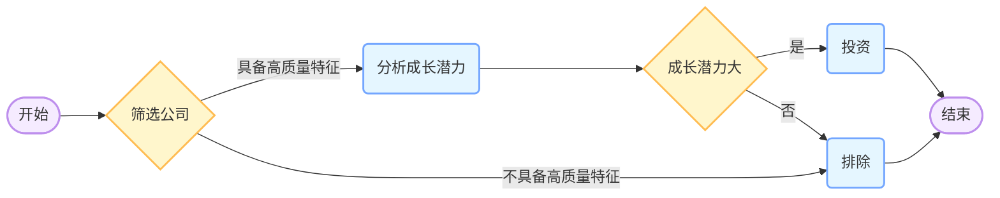

# 彼得林奇的“质量成长”投资案例

> 关键词：彼得林奇、质量成长投资、投资案例、成长股、投资策略

> 摘要：本文深入剖析了投资大师彼得林奇的“质量成长”投资理念及相关案例。详细介绍了彼得林奇投资方法的背景和核心概念，阐述了其核心算法原理和具体操作步骤，并结合数学模型和公式进行解读。通过实际的项目实战案例，展示了“质量成长”投资在实际中的应用。同时，探讨了该投资策略的实际应用场景，推荐了相关的学习工具和资源。最后，总结了“质量成长”投资的未来发展趋势与挑战，并对常见问题进行了解答。

## 1. 背景介绍 
### 1.1 目的和范围
本文旨在全面解析彼得林奇的“质量成长”投资策略，并通过具体案例进行深入探讨。我们将详细研究彼得林奇如何识别具有高质量和成长潜力的股票，以及他在实际投资过程中所采用的方法和决策依据。通过对这些案例的分析，我们可以学习到宝贵的投资经验和技巧，为投资者在股票市场中寻找优质投资机会提供参考。

### 1.2 预期读者
本文主要面向对股票投资感兴趣的个人投资者、金融专业学生以及从事金融行业的从业者。无论是初学者希望了解投资大师的投资理念，还是有一定经验的投资者想要深入研究“质量成长”投资策略，都能从本文中获得有价值的信息。

### 1.3 文档结构概述
本文将按照以下结构展开：首先介绍彼得林奇“质量成长”投资的核心概念和相关联系，包括其原理和架构的文本示意图以及 Mermaid 流程图；接着详细阐述核心算法原理和具体操作步骤，并使用 Python 源代码进行说明；然后引入数学模型和公式，结合具体例子进行详细讲解；通过实际的项目实战案例，展示该投资策略的具体应用；探讨“质量成长”投资的实际应用场景；推荐相关的学习工具和资源；总结“质量成长”投资的未来发展趋势与挑战；最后提供常见问题的解答和扩展阅读的参考资料。

### 1.4 术语表
#### 1.4.1 核心术语定义
- **质量成长投资**：彼得林奇所倡导的一种投资策略，注重寻找那些具有高质量（如优秀的管理层、稳定的财务状况等）且具备持续成长潜力的公司股票进行投资。
- **成长股**：指那些销售额和利润额持续增长，且其增长速度快于整个国家及其所在行业的公司所发行的股票。
- **PEG 比率**：市盈率相对盈利增长比率，是用公司的市盈率除以公司的盈利增长速度，用于评估股票的估值是否合理。

#### 1.4.2 相关概念解释
- **基本面分析**：通过对公司的财务报表、行业地位、管理层能力等基本面因素进行分析，来评估公司的内在价值和投资价值。
- **价值投资**：一种寻找被低估股票的投资策略，强调股票的内在价值与市场价格之间的差异。

#### 1.4.3 缩略词列表
- **PEG**：Price/Earnings to Growth Ratio（市盈率相对盈利增长比率）
- **EPS**：Earnings Per Share（每股收益）

## 2. 核心概念与联系 

### 核心概念原理
彼得林奇的“质量成长”投资理念核心在于寻找那些具有高质量和成长潜力的公司。高质量的公司通常具有以下特征：
- **优秀的管理层**：具备卓越的领导能力、战略眼光和决策能力，能够带领公司在市场竞争中取得优势。
- **稳定的财务状况**：包括健康的资产负债表、稳定的现金流和良好的盈利能力。
- **独特的竞争优势**：如品牌优势、技术优势、成本优势等，使公司能够在行业中脱颖而出。

成长潜力则体现在公司的销售额和利润能够持续增长。彼得林奇认为，投资成长股可以在公司成长的过程中获得丰厚的回报。

### 架构的文本示意图
```plaintext
质量成长投资
|-- 高质量公司
|   |-- 优秀管理层
|   |-- 稳定财务状况
|   |-- 独特竞争优势
|-- 成长潜力
|   |-- 销售额增长
|   |-- 利润增长
```

### Mermaid 流程图


## 3. 核心算法原理 & 具体操作步骤 

### 核心算法原理
彼得林奇在“质量成长”投资中，常用的一个重要指标是 PEG 比率。PEG 比率的计算公式为：

$PEG = \frac{PE}{g}$

其中，$PE$ 是市盈率，$g$ 是盈利增长率。

PEG 比率可以帮助投资者评估股票的估值是否合理。一般来说，PEG 比率小于 1 时，股票可能被低估；PEG 比率大于 1 时，股票可能被高估。

### 具体操作步骤
1. **筛选高质量公司**：
    - 研究公司的管理层，了解其背景、经验和业绩。
    - 分析公司的财务报表，关注资产负债表、利润表和现金流量表，评估公司的财务健康状况。
    - 考察公司的竞争优势，如品牌、技术、市场份额等。
2. **评估成长潜力**：
    - 分析公司的历史销售额和利润增长情况。
    - 研究行业的发展趋势，判断公司所在行业是否具有增长潜力。
    - 关注公司的新产品、新业务和市场拓展计划。
3. **计算 PEG 比率**：
    - 获取公司的市盈率和盈利增长率数据。
    - 根据公式计算 PEG 比率。
4. **做出投资决策**：
    - 如果公司具有高质量和成长潜力，且 PEG 比率小于 1，则可以考虑投资。
    - 如果公司不具备高质量或成长潜力，或者 PEG 比率大于 1，则可以排除该股票。

### Python 源代码实现
```python
def calculate_peg(pe_ratio, growth_rate):
    """
    计算 PEG 比率
    :param pe_ratio: 市盈率
    :param growth_rate: 盈利增长率
    :return: PEG 比率
    """
    if growth_rate == 0:
        return float('inf')
    return pe_ratio / growth_rate

# 示例数据
pe_ratio = 20
growth_rate = 0.2

peg = calculate_peg(pe_ratio, growth_rate)
print(f"PEG 比率: {peg}")

if peg < 1:
    print("股票可能被低估，可以考虑投资。")
else:
    print("股票可能被高估，建议谨慎投资。")
```

## 4. 数学模型和公式 & 详细讲解 & 举例说明 

### 数学模型和公式
- **市盈率（PE）**：$PE = \frac{P}{EPS}$
其中，$P$ 是股票价格，$EPS$ 是每股收益。
- **PEG 比率**：$PEG = \frac{PE}{g}$
其中，$PE$ 是市盈率，$g$ 是盈利增长率。

### 详细讲解
- **市盈率（PE）**：市盈率是衡量股票估值的一个重要指标。它反映了投资者为了获得公司每股收益所愿意支付的价格。一般来说，市盈率越高，说明市场对公司的未来预期越高，但也可能意味着股票被高估；市盈率越低，说明股票可能被低估。
- **PEG 比率**：PEG 比率是在市盈率的基础上，考虑了公司的盈利增长因素。它可以帮助投资者更全面地评估股票的估值。当 PEG 比率小于 1 时，说明公司的盈利增长能够支撑其较高的市盈率，股票可能被低估；当 PEG 比率大于 1 时，说明公司的市盈率相对其盈利增长过高，股票可能被高估。

### 举例说明
假设公司 A 的股票价格为 $50$ 元，每股收益为 $2$ 元，则其市盈率为：

$PE = \frac{50}{2} = 25$

如果公司 A 的盈利增长率为 $0.3$，则其 PEG 比率为：

$PEG = \frac{25}{0.3} \approx 83.33$

由于 PEG 比率远大于 1，说明公司 A 的股票可能被高估，投资者需要谨慎考虑。

再假设公司 B 的股票价格为 $30$ 元，每股收益为 $1.5$ 元，则其市盈率为：

$PE = \frac{30}{1.5} = 20$

如果公司 B 的盈利增长率为 $0.25$，则其 PEG 比率为：

$PEG = \frac{20}{0.25} = 80$

同样，PEG 比率大于 1，公司 B 的股票也可能被高估。

而公司 C 的股票价格为 $20$ 元，每股收益为 $1$ 元，市盈率为：

$PE = \frac{20}{1} = 20$

如果公司 C 的盈利增长率为 $0.3$，则其 PEG 比率为：

$PEG = \frac{20}{0.3} \approx 66.67$

虽然 PEG 比率仍然大于 1，但相对较低，说明公司 C 的股票高估程度相对较小。

## 5. 项目实战：代码实际案例和详细解释说明 

### 5.1 开发环境搭建
- **Python 环境**：建议使用 Python 3.7 及以上版本。可以从 Python 官方网站（https://www.python.org/downloads/）下载并安装。
- **开发工具**：推荐使用 PyCharm 作为开发工具，它是一款功能强大的 Python 集成开发环境（IDE）。可以从 JetBrains 官方网站（https://www.jetbrains.com/pycharm/download/）下载并安装。
- **所需库**：需要安装 `pandas`、`numpy` 等库，用于数据处理和分析。可以使用以下命令进行安装：
```sh
pip install pandas numpy
```

### 5.2 源代码详细实现和代码解读
```python
import pandas as pd

# 假设我们有一个包含股票信息的 CSV 文件，文件名为 stocks.csv
# 文件包含三列：股票代码、市盈率（PE）、盈利增长率（growth_rate）
data = pd.read_csv('stocks.csv')

# 计算 PEG 比率
data['PEG'] = data['PE'] / data['growth_rate']

# 筛选出 PEG 比率小于 1 的股票
undervalued_stocks = data[data['PEG'] < 1]

# 输出筛选结果
print("可能被低估的股票：")
print(undervalued_stocks[['stock_code', 'PEG']])
```

### 代码解读与分析
1. **数据读取**：使用 `pandas` 库的 `read_csv` 函数读取包含股票信息的 CSV 文件。
2. **计算 PEG 比率**：通过将市盈率除以盈利增长率，计算出每只股票的 PEG 比率，并将结果添加到数据框中。
3. **筛选股票**：使用布尔索引筛选出 PEG 比率小于 1 的股票，这些股票可能被低估。
4. **输出结果**：输出筛选出的股票代码和 PEG 比率，方便投资者进一步研究。

## 6. 实际应用场景 
### 个人投资者
个人投资者可以运用彼得林奇的“质量成长”投资策略，在股票市场中寻找具有投资价值的股票。通过对公司基本面的分析和 PEG 比率的计算，个人投资者可以筛选出那些被低估的成长股，进行长期投资，以获取丰厚的回报。

### 基金经理
基金经理可以将“质量成长”投资策略作为投资组合的一部分。通过深入研究公司的质量和成长潜力，基金经理可以选择优质的成长股纳入投资组合，提高基金的业绩表现。

### 金融分析师
金融分析师可以使用“质量成长”投资策略来评估公司的投资价值，并为投资者提供投资建议。通过对公司的财务报表、行业前景等进行分析，金融分析师可以准确判断公司的质量和成长潜力，为投资者提供专业的投资意见。

## 7. 工具和资源推荐
### 7.1 学习资源推荐
#### 7.1.1 书籍推荐
- 《彼得·林奇的成功投资》：彼得林奇的经典著作，详细介绍了他的投资理念和方法，是学习“质量成长”投资的必读之书。
- 《战胜华尔街》：进一步阐述了彼得林奇的投资策略和实践经验，对投资者具有很高的参考价值。
- 《聪明的投资者》：本杰明·格雷厄姆的经典著作，虽然不是专门针对“质量成长”投资，但对于理解价值投资和基本面分析具有重要意义。

#### 7.1.2 在线课程
- Coursera 上的“投资学原理”课程：由知名教授授课，系统介绍了投资学的基本原理和方法，包括股票投资、债券投资等。
- edX 上的“金融市场”课程：提供了丰富的金融市场知识，有助于投资者更好地理解股票市场和投资策略。

#### 7.1.3 技术博客和网站
- 雪球网：国内知名的投资社区，提供了大量的股票分析文章和投资者的交流分享，有助于投资者获取最新的市场信息和投资观点。
- 东方财富网：提供全面的金融信息和数据服务，包括股票行情、财务报表、行业分析等，是投资者进行基本面分析的重要工具。

### 7.2 开发工具框架推荐
#### 7.2.1 IDE和编辑器
- PyCharm：功能强大的 Python 集成开发环境，提供了代码编辑、调试、版本控制等一系列功能，适合专业开发者使用。
- Visual Studio Code：轻量级的代码编辑器，支持多种编程语言，具有丰富的插件扩展功能，适合初学者和快速开发。

#### 7.2.2 调试和性能分析工具
- PyCharm 自带的调试功能：可以方便地设置断点、单步执行代码，帮助开发者快速定位和解决问题。
- cProfile：Python 内置的性能分析工具，可以分析代码的运行时间和函数调用情况，帮助开发者优化代码性能。

#### 7.2.3 相关框架和库
- pandas：强大的数据处理和分析库，提供了高效的数据结构和数据操作方法，适合处理和分析金融数据。
- numpy：用于科学计算的基础库，提供了高效的数组操作和数学函数，是许多数据分析和机器学习库的基础。

### 7.3 相关论文著作推荐
#### 7.3.1 经典论文
- 《资本资产定价模型：风险条件下的市场均衡理论》：由威廉·夏普等人提出，是现代金融理论的重要基石，对于理解股票投资的风险和收益具有重要意义。
- 《有效资本市场：理论与实证研究回顾》：对有效市场假说进行了系统的阐述和回顾，有助于投资者理解股票市场的有效性和投资策略的有效性。

#### 7.3.2 最新研究成果
- 《行为金融学》：结合心理学和金融学的理论，研究投资者的行为和决策过程，为投资策略的制定提供了新的视角。
- 《机器学习在金融领域的应用》：探讨了机器学习技术在金融市场分析、风险评估、投资决策等方面的应用，为投资者提供了新的工具和方法。

#### 7.3.3 应用案例分析
- 《成长股投资案例分析》：通过实际案例分析，介绍了成长股投资的策略和方法，以及如何在不同市场环境下选择和投资成长股。
- 《价值投资与成长投资的比较研究》：对价值投资和成长投资两种策略进行了比较和分析，帮助投资者了解两种策略的优缺点和适用场景。

## 8. 总结：未来发展趋势与挑战
### 未来发展趋势
- **科技驱动**：随着科技的不断发展，人工智能、大数据、区块链等技术将在投资领域得到更广泛的应用。投资者可以利用这些技术进行更精准的基本面分析和投资决策，提高投资效率和回报率。
- **多元化投资**：未来投资者将更加注重多元化投资，不仅投资于股票，还会投资于债券、基金、房地产等多种资产，以降低投资风险。
- **社会责任投资**：越来越多的投资者开始关注企业的社会责任和可持续发展，将社会责任纳入投资决策的考虑因素。具有良好社会责任表现的公司将更受投资者青睐。

### 挑战
- **市场不确定性**：股票市场受到宏观经济、政策变化、国际形势等多种因素的影响，市场不确定性增加。投资者需要具备更强的风险意识和应对能力。
- **信息过载**：随着信息传播的快速发展，投资者面临着大量的信息。如何从海量信息中筛选出有价值的信息，做出正确的投资决策，是投资者面临的一大挑战。
- **竞争加剧**：随着投资市场的不断发展，投资者数量不断增加，竞争也日益激烈。投资者需要不断提升自己的投资能力和专业水平，才能在市场中脱颖而出。

## 9. 附录：常见问题与解答
### 问题 1：PEG 比率是否适用于所有类型的股票？
解答：PEG 比率并不适用于所有类型的股票。它更适用于成长型股票，因为成长型股票的盈利增长速度较快，PEG 比率可以更好地反映其估值情况。对于成熟型公司或盈利增长不稳定的公司，PEG 比率的参考价值可能会降低。

### 问题 2：如何判断公司的管理层是否优秀？
解答：可以从以下几个方面判断公司的管理层是否优秀：
- **业绩表现**：考察管理层过去的业绩，包括公司的销售额、利润增长等指标。
- **战略眼光**：了解管理层的战略规划和决策能力，判断其是否能够带领公司适应市场变化。
- **管理能力**：观察管理层的团队管理、资源配置等能力，评估其是否能够有效地运营公司。

### 问题 3：在使用“质量成长”投资策略时，如何平衡风险和收益？
解答：可以从以下几个方面平衡风险和收益：
- **分散投资**：将资金分散投资于不同行业、不同规模的股票，降低单一股票的风险。
- **控制仓位**：根据自己的风险承受能力，合理控制每只股票的仓位，避免过度集中投资。
- **定期评估**：定期对投资组合进行评估和调整，及时卖出表现不佳的股票，买入更有潜力的股票。

## 10. 扩展阅读 & 参考资料
### 扩展阅读
- 《金融炼金术》：乔治·索罗斯的著作，介绍了他的投资哲学和反身性理论，对投资者的思维方式具有很大的启发。
- 《邓普顿教你逆向投资》：约翰·邓普顿的投资经验分享，强调逆向投资的重要性，为投资者提供了另一种投资思路。

### 参考资料
- 《彼得·林奇的成功投资》，彼得·林奇著
- 《战胜华尔街》，彼得·林奇著
- 《聪明的投资者》，本杰明·格雷厄姆著
- Coursera 课程：投资学原理
- edX 课程：金融市场
- 雪球网：https://xueqiu.com/
- 东方财富网：https://www.eastmoney.com/